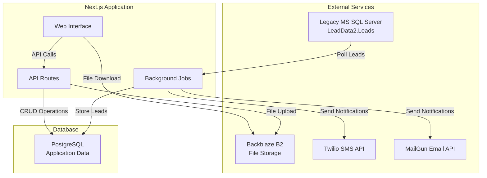

# Design Document

## Overview

The Fund Track App is a Next.js web application with PostgreSQL database that provides lead management capabilities for internal staff and a public intake workflow for prospects. The system integrates with legacy MS SQL Server for lead import, Backblaze B2 for file storage, Twilio for SMS, and MailGun for email notifications.

The architecture follows a clean separation between the staff management interface and public intake workflow, with automated background processes handling lead polling and follow-up communications.

## Architecture

### System Architecture



### Technology Stack

- **Frontend**: Next.js 14 with App Router, React, TypeScript
- **Backend**: Next.js API Routes with TypeScript
- **Database**: PostgreSQL with Prisma ORM
- **Authentication**: NextAuth.js with database sessions
- **File Storage**: Backblaze B2 with official SDK
- **Background Jobs**: Node-cron for scheduling
- **Notifications**: Twilio SDK for SMS, MailGun SDK for email
- **Styling**: Tailwind CSS for responsive design

## Components and Interfaces

### Core Components

#### 1. Lead Management System
- **LeadService**: Handles CRUD operations for leads
- **LeadPoller**: Background service for importing from legacy database
- **LeadStatusManager**: Manages status transitions and triggers

#### 2. Authentication System
- **AuthProvider**: NextAuth.js configuration with database adapter
- **RoleGuard**: Component for role-based access control
- **UserService**: User management and role assignment

#### 3. Intake Workflow
- **IntakeController**: Manages multi-step intake process
- **TokenService**: Generates and validates intake tokens
- **IntakeForm**: React components for Step 1 and Step 2

#### 4. Document Management
- **FileUploadService**: Handles Backblaze B2 integration
- **DocumentManager**: File metadata and access control
- **FileViewer**: Component for displaying and downloading files

#### 5. Notification System
- **NotificationService**: Unified interface for email/SMS
- **FollowUpScheduler**: Manages automated follow-up campaigns
- **NotificationQueue**: Handles retry logic and delivery tracking

### API Endpoints

#### Authentication Routes
- `POST /api/auth/signin` - User login
- `POST /api/auth/signout` - User logout
- `GET /api/auth/session` - Current session info

#### Lead Management Routes
- `GET /api/leads` - List leads with filtering/search
- `GET /api/leads/[id]` - Get lead details
- `PUT /api/leads/[id]` - Update lead status/info
- `POST /api/leads/[id]/notes` - Add internal note
- `POST /api/leads/[id]/files` - Upload file for lead

#### Intake Routes
- `GET /api/intake/[token]` - Get intake session data
- `POST /api/intake/[token]/step1` - Submit step 1 data
- `POST /api/intake/[token]/step2` - Upload documents
- `POST /api/intake/[token]/save` - Save progress

#### Background Job Routes
- `POST /api/cron/poll-leads` - Trigger lead polling
- `POST /api/cron/send-followups` - Process follow-up queue

## Data Models

### PostgreSQL Schema

#### Users Table
```sql
CREATE TABLE users (
    id SERIAL PRIMARY KEY,
    email VARCHAR(255) UNIQUE NOT NULL,
    password_hash VARCHAR(255) NOT NULL,
    role VARCHAR(20) DEFAULT 'user' CHECK (role IN ('admin', 'user')),
    created_at TIMESTAMP DEFAULT CURRENT_TIMESTAMP,
    updated_at TIMESTAMP DEFAULT CURRENT_TIMESTAMP
);
```

#### Leads Table
```sql
CREATE TABLE leads (
    id SERIAL PRIMARY KEY,
    legacy_lead_id BIGINT UNIQUE NOT NULL,
    campaign_id INTEGER NOT NULL,
    email VARCHAR(255),
    phone VARCHAR(20),
    first_name VARCHAR(100),
    last_name VARCHAR(100),
    business_name VARCHAR(255),
    status VARCHAR(20) DEFAULT 'new' CHECK (status IN ('new', 'pending', 'in_progress', 'completed', 'rejected')),
    intake_token VARCHAR(255) UNIQUE,
    intake_completed_at TIMESTAMP,
    created_at TIMESTAMP DEFAULT CURRENT_TIMESTAMP,
    updated_at TIMESTAMP DEFAULT CURRENT_TIMESTAMP,
    imported_at TIMESTAMP DEFAULT CURRENT_TIMESTAMP
);
```

#### Lead Notes Table
```sql
CREATE TABLE lead_notes (
    id SERIAL PRIMARY KEY,
    lead_id INTEGER REFERENCES leads(id) ON DELETE CASCADE,
    user_id INTEGER REFERENCES users(id),
    content TEXT NOT NULL,
    created_at TIMESTAMP DEFAULT CURRENT_TIMESTAMP
);
```

#### Documents Table
```sql
CREATE TABLE documents (
    id SERIAL PRIMARY KEY,
    lead_id INTEGER REFERENCES leads(id) ON DELETE CASCADE,
    filename VARCHAR(255) NOT NULL,
    original_filename VARCHAR(255) NOT NULL,
    file_size INTEGER NOT NULL,
    mime_type VARCHAR(100) NOT NULL,
    b2_file_id VARCHAR(255) NOT NULL,
    b2_bucket_name VARCHAR(100) NOT NULL,
    uploaded_by INTEGER REFERENCES users(id),
    uploaded_at TIMESTAMP DEFAULT CURRENT_TIMESTAMP
);
```

#### Follow-up Queue Table
```sql
CREATE TABLE followup_queue (
    id SERIAL PRIMARY KEY,
    lead_id INTEGER REFERENCES leads(id) ON DELETE CASCADE,
    scheduled_at TIMESTAMP NOT NULL,
    followup_type VARCHAR(20) NOT NULL CHECK (followup_type IN ('3h', '9h', '24h', '72h')),
    status VARCHAR(20) DEFAULT 'pending' CHECK (status IN ('pending', 'sent', 'cancelled')),
    sent_at TIMESTAMP,
    created_at TIMESTAMP DEFAULT CURRENT_TIMESTAMP
);
```

#### Notification Log Table
```sql
CREATE TABLE notification_log (
    id SERIAL PRIMARY KEY,
    lead_id INTEGER REFERENCES leads(id),
    type VARCHAR(20) NOT NULL CHECK (type IN ('email', 'sms')),
    recipient VARCHAR(255) NOT NULL,
    subject VARCHAR(255),
    content TEXT,
    status VARCHAR(20) DEFAULT 'pending' CHECK (status IN ('pending', 'sent', 'failed')),
    external_id VARCHAR(255),
    error_message TEXT,
    sent_at TIMESTAMP,
    created_at TIMESTAMP DEFAULT CURRENT_TIMESTAMP
);
```

### Prisma Schema Models

The Prisma schema will define relationships and provide type-safe database access:

```prisma
model Lead {
  id                  Int           @id @default(autoincrement())
  legacyLeadId        BigInt        @unique @map("legacy_lead_id")
  campaignId          Int           @map("campaign_id")
  email               String?
  phone               String?
  firstName           String?       @map("first_name")
  lastName            String?       @map("last_name")
  businessName        String?       @map("business_name")
  status              LeadStatus    @default(NEW)
  intakeToken         String?       @unique @map("intake_token")
  intakeCompletedAt   DateTime?     @map("intake_completed_at")
  createdAt           DateTime      @default(now()) @map("created_at")
  updatedAt           DateTime      @updatedAt @map("updated_at")
  importedAt          DateTime      @default(now()) @map("imported_at")
  
  notes               LeadNote[]
  documents           Document[]
  followupQueue       FollowupQueue[]
  notificationLog     NotificationLog[]
  
  @@map("leads")
}

enum LeadStatus {
  NEW         @map("new")
  PENDING     @map("pending")
  IN_PROGRESS @map("in_progress")
  COMPLETED   @map("completed")
  REJECTED    @map("rejected")
}
```

## Error Handling

### Error Categories

1. **Database Errors**: Connection failures, constraint violations, query timeouts
2. **External Service Errors**: API failures for Twilio, MailGun, Backblaze B2
3. **Authentication Errors**: Invalid credentials, expired sessions, insufficient permissions
4. **Validation Errors**: Invalid input data, file format restrictions
5. **Business Logic Errors**: Invalid status transitions, duplicate operations

### Error Handling Strategy

#### API Error Responses
```typescript
interface ApiError {
  error: string;
  message: string;
  code: number;
  details?: any;
}
```

#### Error Logging
- Use structured logging with Winston or similar
- Log levels: ERROR, WARN, INFO, DEBUG
- Include request context, user ID, and stack traces
- Store critical errors in database for monitoring

#### Retry Logic
- Implement exponential backoff for external API calls
- Maximum 3 retries for transient failures
- Circuit breaker pattern for persistent service failures

## Testing Strategy

### Unit Testing
- **Framework**: Jest with React Testing Library
- **Coverage**: Minimum 80% code coverage
- **Focus Areas**: Business logic, utility functions, API endpoints

### Integration Testing
- **Database**: Use test database with Docker
- **External Services**: Mock Twilio, MailGun, Backblaze B2 APIs
- **API Routes**: Test complete request/response cycles

### End-to-End Testing
- **Framework**: Playwright for browser automation
- **Scenarios**: Complete intake workflow, staff dashboard operations
- **Data**: Use seeded test data for consistent results

### Testing Environment Setup
```typescript
// jest.config.js
module.exports = {
  testEnvironment: 'node',
  setupFilesAfterEnv: ['<rootDir>/tests/setup.ts'],
  testMatch: ['**/__tests__/**/*.test.ts'],
  collectCoverageFrom: [
    'src/**/*.{ts,tsx}',
    '!src/**/*.d.ts',
    '!src/**/*.stories.tsx'
  ]
};
```

### Mock Services
- Create mock implementations for external services
- Use dependency injection for easy testing
- Provide realistic response data for comprehensive testing

## Security Considerations

### Authentication & Authorization
- Password hashing with bcrypt (minimum 12 rounds)
- Session-based authentication with secure cookies
- Role-based access control with middleware guards
- CSRF protection for state-changing operations

### Data Protection
- Input validation and sanitization on all endpoints
- SQL injection prevention through Prisma ORM
- File upload restrictions (type, size, scan for malware)
- Secure token generation for intake links

### Infrastructure Security
- HTTPS enforcement in production
- Environment variable management for secrets
- Database connection encryption
- Regular security updates for dependencies

### Privacy & Compliance
- Minimal data collection and retention
- Secure file storage with access controls
- Audit logging for sensitive operations
- Data anonymization for testing environments