# API Routing Structure

<cite>
**Referenced Files in This Document**   
- [route.ts](file://src/app/api/leads/route.ts)
- [route.ts](file://src/app/api/leads/[id]/route.ts)
- [route.ts](file://src/app/api/intake/[token]/route.ts)
- [route.ts](file://src/app/api/admin/settings/[key]/route.ts)
- [route.ts](file://src/app/api/cron/poll-leads/route.ts)
- [route.ts](file://src/app/api/auth/[...nextauth]/route.ts)
- [route.ts](file://src/app/api/health/live/route.ts)
- [errors.ts](file://src/lib/errors.ts)
- [monitoring.ts](file://src/lib/monitoring.ts)
- [prisma.ts](file://src/lib/prisma.ts)
- [database-error-handler.ts](file://src/lib/database-error-handler.ts)
- [middleware.ts](file://src/middleware.ts)
- [route.ts](file://src/app/api/leads/[id]/share/route.ts) - *Added in recent commit*
- [route.ts](file://src/app/api/share/[token]/documents/[documentId]/route.ts) - *Added in recent commit*
</cite>

## Update Summary
**Changes Made**   
- Added new section for Lead Sharing API to document the newly implemented share feature
- Updated Project Structure section to include the new share API routes
- Added new sequence diagram for the lead sharing workflow
- Added new diagram for shared document access flow
- Updated dependency analysis to include the new FileUploadService
- Added sources for newly created files and updated sections

## Table of Contents
1. [Introduction](#introduction)
2. [Project Structure](#project-structure)
3. [Core Components](#core-components)
4. [Architecture Overview](#architecture-overview)
5. [Detailed Component Analysis](#detailed-component-analysis)
6. [Dependency Analysis](#dependency-analysis)
7. [Performance Considerations](#performance-considerations)
8. [Troubleshooting Guide](#troubleshooting-guide)
9. [Conclusion](#conclusion)

## Introduction
The fund-track application implements a robust API routing structure using Next.js App Router conventions. This document provides a comprehensive analysis of the API routing system, focusing on file-based routing, dynamic route segments, nested route organization, and implementation patterns for various business features including lead management, intake processing, and administrative operations. The analysis covers request handling, parameter extraction, validation, error handling, and integration with middleware and context.

## Project Structure
The API routing structure follows a logical organization based on business domains and functionality. The routes are organized under the `src/app/api` directory with subdirectories for different feature areas:

- **admin**: Administrative operations and system management
- **auth**: Authentication and session management
- **cron**: Scheduled background jobs and automated processes
- **dev**: Development and testing endpoints
- **health**: System health monitoring and liveness checks
- **intake**: Application intake workflow
- **leads**: Lead management and tracking
- **metrics**: Performance and monitoring metrics
- **monitoring**: System status and monitoring
- **share**: Secure sharing of lead information and documents

This organization enables clear separation of concerns and makes the API structure intuitive to navigate.

```mermaid
graph TD
A[/api] --> B[admin]
A --> C[auth]
A --> D[cron]
A --> E[dev]
A --> F[health]
A --> G[intake]
A --> H[leads]
A --> I[metrics]
A --> J[monitoring]
A --> K[share]
B --> B1[background-jobs]
B --> B2[cleanup]
B --> B3[connectivity]
B --> B4[notifications]
B --> B5[settings]
B --> B6[users]
C --> C1[[...nextauth]]
C --> C2[session]
D --> D1[poll-leads]
D --> D2[send-followups]
G --> G1[[token]]
H --> H1[[id]]
H --> H2[share]
F --> F1[live]
F --> F2[ready]
K --> K1[[token]]
K --> K2[documents]
K --> K3[[documentId]]
```

**Diagram sources**
- [middleware.ts](file://src/middleware.ts#L159-L189)

**Section sources**
- [middleware.ts](file://src/middleware.ts#L128-L162)

## Core Components
The API routing system is built on several core components that provide essential functionality:

1. **Error Handling**: Standardized error responses using the `withErrorHandler` middleware
2. **Authentication**: Integration with NextAuth for session management
3. **Database Access**: Prisma client with enhanced error handling and retry logic
4. **Logging**: Comprehensive logging system for API requests and operations
5. **Validation**: Input validation and parameter extraction
6. **Performance Monitoring**: Request timing and performance tracking

These components work together to create a robust and maintainable API system.

**Section sources**
- [errors.ts](file://src/lib/errors.ts#L0-L47)
- [monitoring.ts](file://src/lib/monitoring.ts#L0-L76)
- [prisma.ts](file://src/lib/prisma.ts#L0-L60)

## Architecture Overview
The API architecture follows a layered approach with clear separation between routing, business logic, and data access. The Next.js App Router handles route resolution based on the file system structure, while API routes implement specific HTTP methods (GET, POST, PUT, DELETE) to handle requests.

The architecture incorporates several key patterns:
- **Middleware Integration**: Authentication and authorization checks
- **Error Handling Middleware**: Standardized error responses
- **Database Connection Management**: Prisma client with connection pooling
- **Request Validation**: Input parameter validation and sanitization
- **Response Formatting**: Consistent JSON response structure

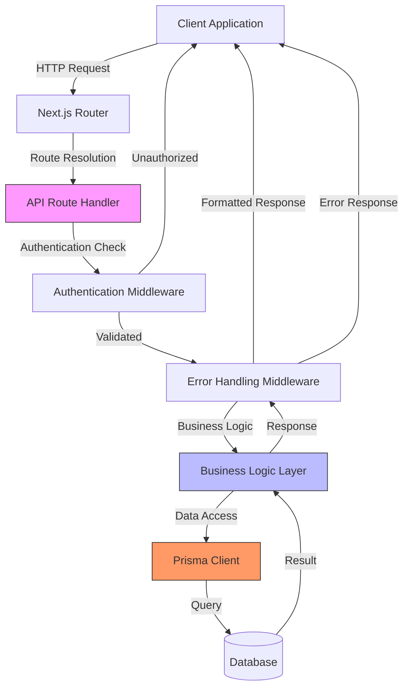

**Diagram sources**
- [middleware.ts](file://src/middleware.ts#L128-L162)
- [errors.ts](file://src/lib/errors.ts#L237-L300)
- [prisma.ts](file://src/lib/prisma.ts#L0-L60)

## Detailed Component Analysis

### Lead Management API
The lead management API provides comprehensive CRUD operations for lead records. The implementation demonstrates several key patterns in the routing system.

#### List and Create Leads
The `/api/leads` endpoint handles both listing existing leads and creating new ones. The GET method implements sophisticated filtering and pagination capabilities.

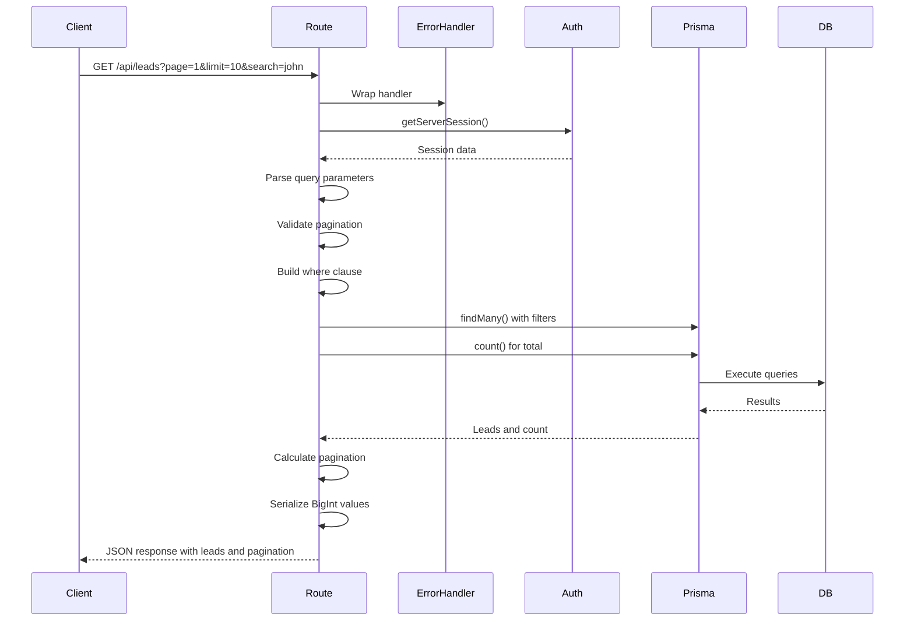

**Diagram sources**
- [route.ts](file://src/app/api/leads/route.ts#L0-L166)

**Section sources**
- [route.ts](file://src/app/api/leads/route.ts#L0-L166)

#### Individual Lead Operations
The `/api/leads/[id]` endpoint handles operations on individual lead records using dynamic route segments.

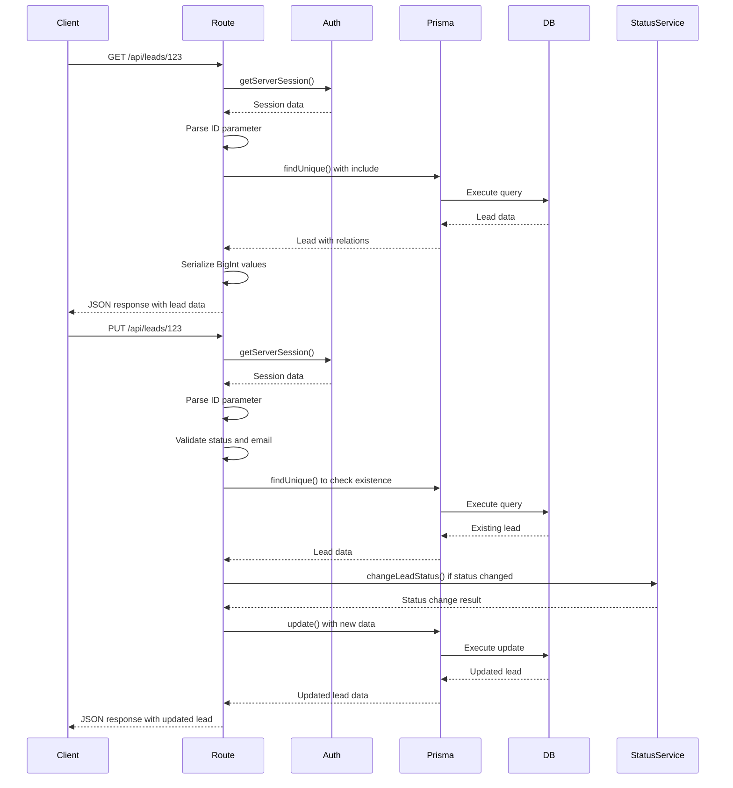

**Diagram sources**
- [route.ts](file://src/app/api/leads/[id]/route.ts#L0-L199)

**Section sources**
- [route.ts](file://src/app/api/leads/[id]/route.ts#L0-L199)

### Intake Processing API
The intake processing API handles the application intake workflow using dynamic route segments for token-based access.

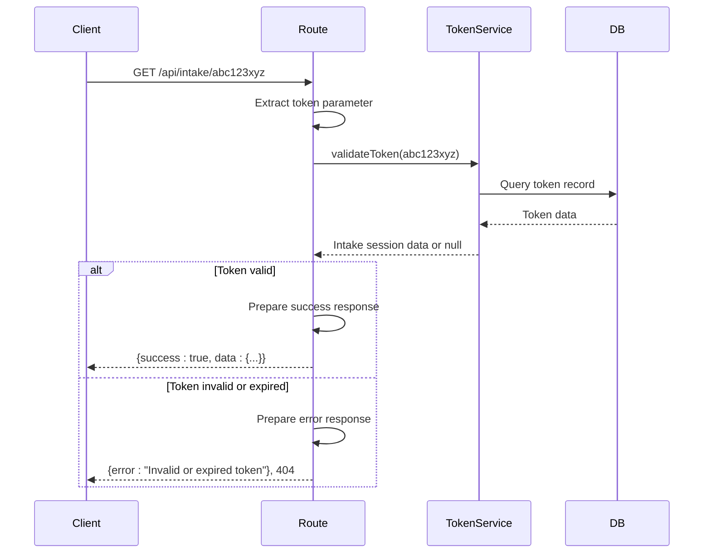

**Diagram sources**
- [route.ts](file://src/app/api/intake/[token]/route.ts#L0-L37)

**Section sources**
- [route.ts](file://src/app/api/intake/[token]/route.ts#L0-L37)

### Admin Settings API
The admin settings API demonstrates the use of dynamic route segments for managing system settings.

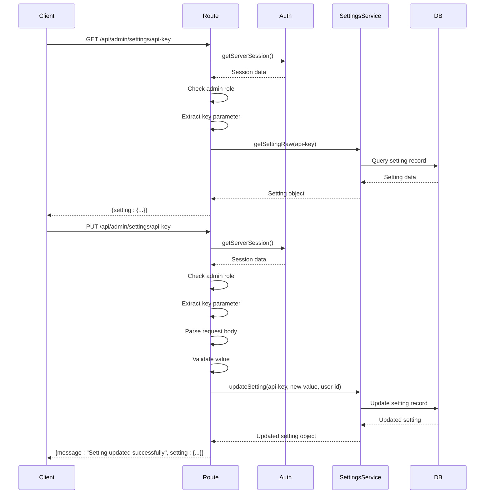

**Diagram sources**
- [route.ts](file://src/app/api/admin/settings/[key]/route.ts#L0-L129)

**Section sources**
- [route.ts](file://src/app/api/admin/settings/[key]/route.ts#L0-L129)

### Authentication API
The authentication API integrates with NextAuth for session management.

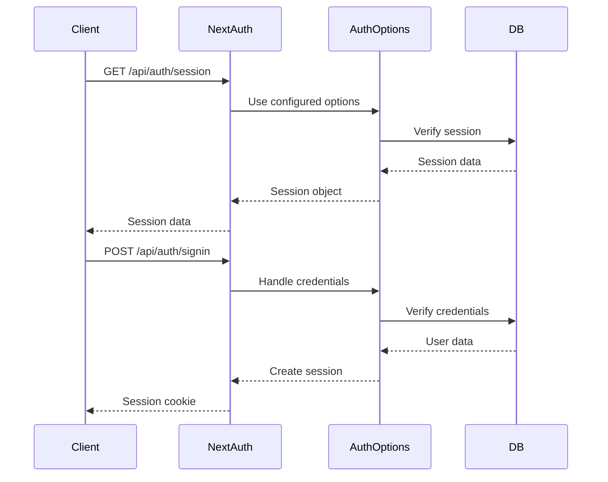

**Diagram sources**
- [route.ts](file://src/app/api/auth/[...nextauth]/route.ts#L0-L5)

**Section sources**
- [route.ts](file://src/app/api/auth/[...nextauth]/route.ts#L0-L5)

### Cron Job API
The cron job API handles automated background processes like lead polling.

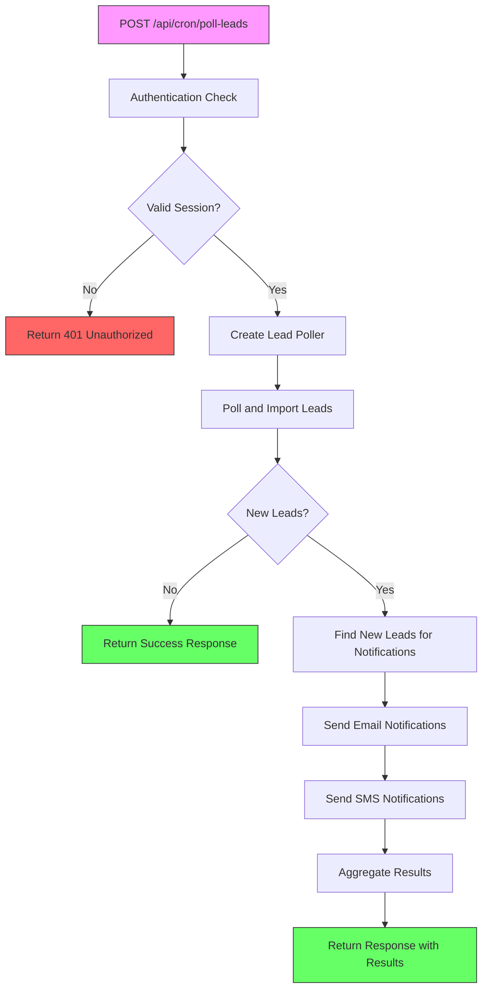

**Diagram sources**
- [route.ts](file://src/app/api/cron/poll-leads/route.ts#L0-L192)

**Section sources**
- [route.ts](file://src/app/api/cron/poll-leads/route.ts#L0-L192)

### Health Check API
The health check API provides liveness probes for system monitoring.

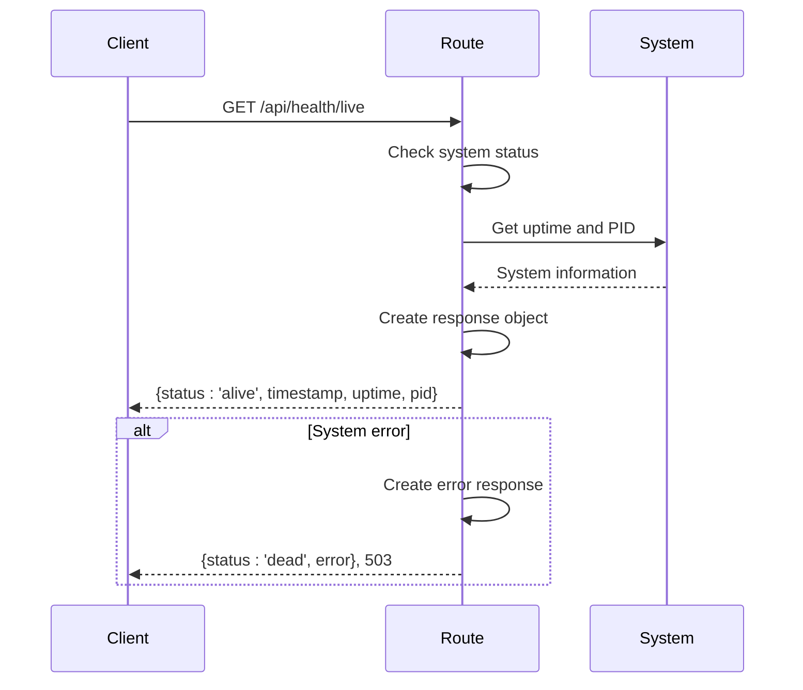

**Diagram sources**
- [route.ts](file://src/app/api/health/live/route.ts#L0-L27)

**Section sources**
- [route.ts](file://src/app/api/health/live/route.ts#L0-L27)

### Lead Sharing API
The lead sharing API enables secure sharing of lead information with external parties through time-limited, token-based URLs. This feature allows authorized users to generate shareable links for specific leads, which can be accessed without requiring authentication.

#### Create and Manage Share Links
The `/api/leads/[id]/share` endpoint provides POST, GET, and DELETE operations for managing share links for a specific lead.

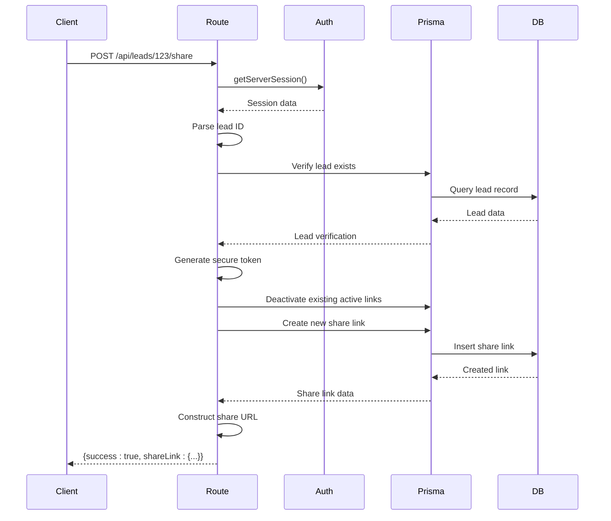

**Section sources**
- [route.ts](file://src/app/api/leads/[id]/share/route.ts#L0-L196)

**Diagram sources**
- [route.ts](file://src/app/api/leads/[id]/share/route.ts#L0-L196)

#### Access Shared Documents
The `/api/share/[token]/documents/[documentId]` endpoint allows access to specific documents through a share token without authentication.

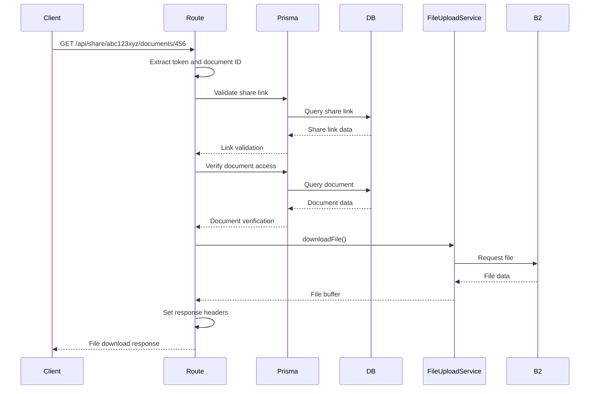

**Section sources**
- [route.ts](file://src/app/api/share/[token]/documents/[documentId]/route.ts#L0-L67)

**Diagram sources**
- [route.ts](file://src/app/api/share/[token]/documents/[documentId]/route.ts#L0-L67)

## Dependency Analysis
The API routes depend on several key components and services that provide essential functionality.

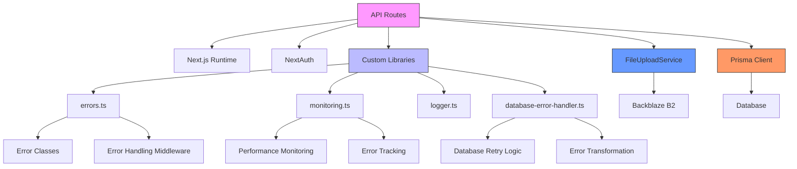

**Diagram sources**
- [errors.ts](file://src/lib/errors.ts#L0-L339)
- [monitoring.ts](file://src/lib/monitoring.ts#L0-L276)
- [database-error-handler.ts](file://src/lib/database-error-handler.ts#L0-L320)
- [prisma.ts](file://src/lib/prisma.ts#L0-L60)
- [FileUploadService.ts](file://src/services/FileUploadService.ts#L0-L150)

**Section sources**
- [errors.ts](file://src/lib/errors.ts#L0-L339)
- [monitoring.ts](file://src/lib/monitoring.ts#L0-L276)
- [database-error-handler.ts](file://src/lib/database-error-handler.ts#L0-L320)
- [prisma.ts](file://src/lib/prisma.ts#L0-L60)
- [FileUploadService.ts](file://src/services/FileUploadService.ts#L0-L150)

## Performance Considerations
The API implementation includes several performance optimization patterns:

1. **Caching**: The system uses in-memory stores for rate limiting and metrics
2. **Database Optimization**: Prisma queries include only necessary fields and use efficient filtering
3. **Error Handling**: Centralized error handling reduces code duplication
4. **Connection Management**: Prisma client is singleton and properly managed
5. **Request Validation**: Early validation prevents unnecessary processing
6. **Pagination**: Large datasets are paginated to reduce memory usage

The `executeDatabaseOperation` function wraps database operations with retry logic and error handling, ensuring resilience against transient database issues. The `withPerformanceMonitoring` middleware tracks execution time and can identify slow operations.

**Section sources**
- [monitoring.ts](file://src/lib/monitoring.ts#L77-L276)
- [database-error-handler.ts](file://src/lib/database-error-handler.ts#L200-L320)

## Troubleshooting Guide
When troubleshooting API route issues, consider the following common problems and solutions:

1. **Authentication Issues**: Ensure valid session and proper role permissions
2. **Database Connection Problems**: Check DATABASE_URL environment variable and network connectivity
3. **Validation Errors**: Verify request parameters and body structure
4. **Rate Limiting**: Check if rate limiting is enabled and adjust settings if needed
5. **Dynamic Route Parameters**: Ensure proper parameter extraction using `await params`
6. **BigInt Serialization**: Remember to convert BigInt values to strings before JSON serialization

The comprehensive logging system can help identify issues by providing detailed information about API requests, database operations, and errors.

**Section sources**
- [errors.ts](file://src/lib/errors.ts#L196-L249)
- [middleware.ts](file://src/middleware.ts#L0-L45)
- [prisma.ts](file://src/lib/prisma.ts#L0-L60)

## Conclusion
The API routing structure in the fund-track application demonstrates a well-architected implementation using Next.js App Router conventions. The system effectively uses file-based routing, dynamic route segments, and nested route organization to create a maintainable and scalable API. Key features include comprehensive error handling, authentication integration, performance monitoring, and robust database access patterns. The implementation follows best practices for API design and provides a solid foundation for the application's business functionality.