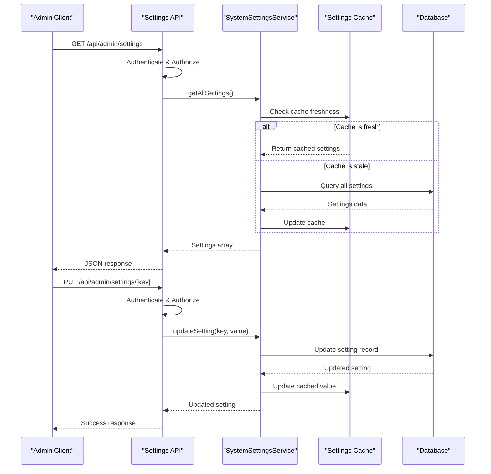

# Admin API Endpoints

<cite>
**Referenced Files in This Document**   
- [src/app/api/admin/background-jobs/status/route.ts](file://src/app/api/admin/background-jobs/status/route.ts)
- [src/app/api/admin/background-jobs/trigger-polling/route.ts](file://src/app/api/admin/background-jobs/trigger-polling/route.ts)
- [src/app/api/admin/cleanup/route.ts](file://src/app/api/admin/cleanup/route.ts)
- [src/app/api/admin/connectivity/legacy-db/route.ts](file://src/app/api/admin/connectivity/legacy-db/route.ts)
- [src/app/api/admin/notifications/route.ts](file://src/app/api/admin/notifications/route.ts)
- [src/app/api/admin/settings/[key]/route.ts](file://src/app/api/admin/settings/[key]/route.ts)
- [src/app/api/admin/settings/audit/route.ts](file://src/app/api/admin/settings/audit/route.ts)
- [src/app/api/admin/settings/route.ts](file://src/app/api/admin/settings/route.ts)
- [src/app/api/admin/users/route.ts](file://src/app/api/admin/users/route.ts)
- [src/services/SystemSettingsService.ts](file://src/services/SystemSettingsService.ts)
- [src/services/NotificationService.ts](file://src/services/NotificationService.ts)
- [src/lib/auth.ts](file://src/lib/auth.ts)
- [src/middleware.ts](file://src/middleware.ts)
</cite>

## Table of Contents
1. [Introduction](#introduction)
2. [Authentication and Authorization](#authentication-and-authorization)
3. [Background Job Management](#background-job-management)
4. [Connectivity Testing](#connectivity-testing)
5. [Notification Management](#notification-management)
6. [System Settings Management](#system-settings-management)
7. [User Management](#user-management)
8. [Cleanup Operations](#cleanup-operations)
9. [Security Considerations](#security-considerations)

## Introduction
This document provides comprehensive documentation for the administrative API endpoints in the fund-track application. These endpoints are designed to support system administration, monitoring, and maintenance operations. The APIs cover functionality such as background job monitoring, legacy database connectivity testing, notification log retrieval, user management, system settings management with audit logging, and cleanup operations. All admin endpoints require authentication via NextAuth.js and enforce role-based access control (RBAC) to ensure only authorized administrators can access sensitive functionality.

**Section sources**
- [src/app/api/admin](file://src/app/api/admin)

## Authentication and Authorization

The administrative API endpoints implement a robust authentication and authorization system using NextAuth.js for authentication and role-based access control (RBAC) for authorization.

### Authentication with NextAuth.js
All admin endpoints verify user authentication using NextAuth.js's `getServerSession` function with the application's `authOptions`. The authentication flow uses credential-based login with email and password, where passwords are securely hashed using bcrypt before storage.

```typescript
const session = await getServerSession(authOptions);
if (!session?.user) {
  return NextResponse.json({ error: "Unauthorized" }, { status: 401 });
}
```

### Role-Based Access Control (RBAC)
The system implements RBAC by checking the user's role from the session. Only users with the ADMIN role can access administrative endpoints. This check is consistently applied across all admin routes:

```typescript
if (session.user.role !== UserRole.ADMIN) {
  return NextResponse.json(
    { error: "Unauthorized - Admin access required" },
    { status: 403 }
  );
}
```

The middleware also enforces these rules at the routing level, redirecting non-admin users attempting to access admin routes:

```typescript
if (pathname.startsWith("/admin") && token.role !== "ADMIN") {
  return NextResponse.redirect(new URL("/dashboard", req.url));
}
```

**Section sources**
- [src/lib/auth.ts](file://src/lib/auth.ts#L0-L70)
- [src/middleware.ts](file://src/middleware.ts#L128-L162)

## Background Job Management

The background job management endpoints provide monitoring and manual triggering capabilities for scheduled background processes.

### GET /api/admin/background-jobs/status
Retrieves the current status of background job schedulers.

**HTTP Method**: GET  
**Authentication**: Required (Admin role)  
**Parameters**: None  
**Response Schema**:
```json
{
  "success": true,
  "scheduler": {
    "isRunning": boolean,
    "jobs": {
      "leadPolling": {
        "isActive": boolean,
        "lastRun": string,
        "nextRun": string
      },
      "followUp": {
        "isActive": boolean,
        "lastRun": string,
        "nextRun": string
      }
    }
  },
  "environment": {
    "nodeEnv": string,
    "enableBackgroundJobs": string,
    "leadPollingPattern": string,
    "followUpPattern": string,
    "batchSize": string,
    "timezone": string
  },
  "timestamp": string
}
```

**Example Response (Success)**:
```json
{
  "success": true,
  "scheduler": {
    "isRunning": true,
    "jobs": {
      "leadPolling": {
        "isActive": true,
        "lastRun": "2025-08-26T10:15:30.000Z",
        "nextRun": "2025-08-26T10:30:00.000Z"
      },
      "followUp": {
        "isActive": true,
        "lastRun": "2025-08-26T10:20:45.000Z",
        "nextRun": "2025-08-26T10:25:00.000Z"
      }
    }
  },
  "environment": {
    "nodeEnv": "production",
    "enableBackgroundJobs": "true",
    "leadPollingPattern": "*/15 * * * *",
    "followUpPattern": "*/5 * * * *",
    "batchSize": "100",
    "timezone": "America/New_York"
  },
  "timestamp": "2025-08-26T10:22:15.123Z"
}
```

**Example Response (Error)**:
```json
{
  "success": false,
  "error": "Failed to get scheduler status",
  "timestamp": "2025-08-26T10:22:15.123Z"
}
```

**Section sources**
- [src/app/api/admin/background-jobs/status/route.ts](file://src/app/api/admin/background-jobs/status/route.ts)

### POST /api/admin/background-jobs/trigger-polling
Manually triggers the lead polling process.

**HTTP Method**: POST  
**Authentication**: Required (Admin role)  
**Parameters**: None (body not required)  
**Response Schema**:
```json
{
  "success": boolean,
  "message": string,
  "timestamp": string,
  "triggeredBy": string
}
```

**Example Request**:
```bash
curl -X POST http://localhost:3000/api/admin/background-jobs/trigger-polling \
  -H "Authorization: Bearer <admin-token>" \
  -H "Content-Type: application/json"
```

**Example Response (Success)**:
```json
{
  "success": true,
  "message": "Lead polling executed successfully",
  "timestamp": "2025-08-26T10:22:15.123Z",
  "triggeredBy": "admin@fund-track.com"
}
```

**Example Response (Error)**:
```json
{
  "success": false,
  "error": "Database connection failed",
  "message": "Failed to execute lead polling",
  "timestamp": "2025-08-26T10:22:15.123Z"
}
```

**Section sources**
- [src/app/api/admin/background-jobs/trigger-polling/route.ts](file://src/app/api/admin/background-jobs/trigger-polling/route.ts)

## Connectivity Testing

### GET /api/admin/connectivity/legacy-db
Tests connectivity to the legacy database system.

**HTTP Method**: GET  
**Authentication**: Required (Admin role)  
**Parameters**: None  
**Response Schema**:
```json
{
  "status": "connected" | "disconnected" | "failed" | "error",
  "error": string | null,
  "details": {
    "responseTime": string,
    "serverInfo": {
      "version": string,
      "database_name": string,
      "server_name": string
    },
    "connectionStatus": string
  },
  "timestamp": string,
  "config": {
    "server": string,
    "database": string,
    "port": string,
    "encrypt": string,
    "trustServerCertificate": string
  }
}
```

**Example Response (Connected)**:
```json
{
  "status": "connected",
  "error": null,
  "details": {
    "responseTime": "45ms",
    "serverInfo": {
      "version": "Microsoft SQL Server 2019",
      "database_name": "LegacyCRM",
      "server_name": "SQLPROD01"
    },
    "connectionStatus": "Active"
  },
  "timestamp": "2025-08-26T10:22:15.123Z",
  "config": {
    "server": "legacy-db.fund-track.com",
    "database": "LegacyCRM",
    "port": "1433",
    "encrypt": "true",
    "trustServerCertificate": "true"
  }
}
```

**Example Response (Error)**:
```json
{
  "status": "error",
  "error": "Failed to connect to server",
  "details": {
    "responseTime": "5000ms",
    "connectionStatus": "Error"
  },
  "timestamp": "2025-08-26T10:22:15.123Z",
  "config": {
    "server": "legacy-db.fund-track.com",
    "database": "LegacyCRM",
    "port": "1433",
    "encrypt": "true",
    "trustServerCertificate": "true"
  }
}
```

**Section sources**
- [src/app/api/admin/connectivity/legacy-db/route.ts](file://src/app/api/admin/connectivity/legacy-db/route.ts)

## Notification Management

### GET /api/admin/notifications
Retrieves notification logs with filtering, search, and pagination.

**HTTP Method**: GET  
**Authentication**: Required (Admin role)  
**Query Parameters**:
- `limit`: Number of records to return (1-100, default: 25)
- `cursor`: Pagination cursor for next page
- `type`: Filter by notification type (EMAIL, SMS)
- `status`: Filter by status (PENDING, SENT, FAILED)
- `recipient`: Filter by recipient email/phone
- `search`: Full-text search across multiple fields

**Response Schema**:
```json
{
  "logs": [
    {
      "id": number,
      "leadId": number | null,
      "type": "EMAIL" | "SMS",
      "recipient": string,
      "subject": string | null,
      "content": string,
      "status": "PENDING" | "SENT" | "FAILED",
      "externalId": string | null,
      "errorMessage": string | null,
      "sentAt": string | null,
      "createdAt": string,
      "lead": {
        "id": number,
        "firstName": string,
        "lastName": string,
        "email": string,
        "phone": string
      } | null
    }
  ],
  "hasMore": boolean,
  "nextCursor": string | null,
  "limit": number
}
```

**Example Request**:
```bash
curl "http://localhost:3000/api/admin/notifications?limit=10&type=EMAIL&status=FAILED&search=error" \
  -H "Authorization: Bearer <admin-token>"
```

**Example Response**:
```json
{
  "logs": [
    {
      "id": 12345,
      "leadId": 789,
      "type": "EMAIL",
      "recipient": "client@example.com",
      "subject": "Application Follow-up",
      "content": "Following up on your application...",
      "status": "FAILED",
      "externalId": null,
      "errorMessage": "Mailgun API error: 550 Invalid recipient",
      "sentAt": null,
      "createdAt": "2025-08-25T14:30:00.000Z",
      "lead": {
        "id": 789,
        "firstName": "John",
        "lastName": "Doe",
        "email": "client@example.com",
        "phone": "+1234567890"
      }
    }
  ],
  "hasMore": false,
  "nextCursor": null,
  "limit": 10
}
```

**Section sources**
- [src/app/api/admin/notifications/route.ts](file://src/app/api/admin/notifications/route.ts)

## System Settings Management

The system settings endpoints provide CRUD operations for application settings with audit logging.

### GET /api/admin/settings
Retrieves all system settings or settings by category.

**HTTP Method**: GET  
**Authentication**: Required (Admin role)  
**Query Parameters**:
- `category`: Filter settings by category (GENERAL, EMAIL, SMS, API_KEYS, SECURITY)

**Response Schema**:
```json
{
  "settings": [
    {
      "key": string,
      "value": string,
      "type": "BOOLEAN" | "STRING" | "NUMBER" | "JSON",
      "category": "GENERAL" | "EMAIL" | "SMS" | "API_KEYS" | "SECURITY",
      "description": string,
      "defaultValue": string,
      "updatedBy": number | null,
      "updatedAt": string
    }
  ]
}
```

**Example Request**:
```bash
curl "http://localhost:3000/api/admin/settings?category=EMAIL" \
  -H "Authorization: Bearer <admin-token>"
```

**Section sources**
- [src/app/api/admin/settings/route.ts](file://src/app/api/admin/settings/route.ts)

### PUT /api/admin/settings
Bulk updates multiple system settings.

**HTTP Method**: PUT  
**Authentication**: Required (Admin role)  
**Request Body**:
```json
{
  "updates": [
    {
      "key": string,
      "value": string
    }
  ]
}
```

**Response Schema**:
```json
{
  "message": string,
  "settings": [
    {
      "key": string,
      "value": string,
      "type": string,
      "category": string,
      "description": string,
      "defaultValue": string,
      "updatedBy": number | null,
      "updatedAt": string
    }
  ]
}
```

**Example Request**:
```bash
curl -X PUT http://localhost:3000/api/admin/settings \
  -H "Authorization: Bearer <admin-token>" \
  -H "Content-Type: application/json" \
  -d '{
    "updates": [
      {
        "key": "email.enabled",
        "value": "true"
      },
      {
        "key": "sms.enabled",
        "value": "false"
      }
    ]
  }'
```

### GET /api/admin/settings/[key]
Retrieves a specific setting by key.

**HTTP Method**: GET  
**Authentication**: Required (Admin role)  
**Path Parameter**: `key` - The setting key  
**Response Schema**:
```json
{
  "setting": {
    "key": string,
    "value": string,
    "type": string,
    "category": string,
    "description": string,
    "defaultValue": string,
    "updatedBy": number | null,
    "updatedAt": string
  }
}
```

### PUT /api/admin/settings/[key]
Updates a specific setting value.

**HTTP Method**: PUT  
**Authentication**: Required (Admin role)  
**Path Parameter**: `key` - The setting key  
**Request Body**:
```json
{
  "value": string
}
```

**Response Schema**:
```json
{
  "message": string,
  "setting": {
    "key": string,
    "value": string,
    "type": string,
    "category": string,
    "description": string,
    "defaultValue": string,
    "updatedBy": number | null,
    "updatedAt": string
  }
}
```

### POST /api/admin/settings/[key]
Performs actions on a specific setting (currently only reset to default).

**HTTP Method**: POST  
**Authentication**: Required (Admin role)  
**Path Parameter**: `key` - The setting key  
**Request Body**:
```json
{
  "action": "reset"
}
```

**Response Schema**:
```json
{
  "message": string,
  "setting": {
    "key": string,
    "value": string,
    "type": string,
    "category": string,
    "description": string,
    "defaultValue": string,
    "updatedBy": number | null,
    "updatedAt": string
  }
}
```

### GET /api/admin/settings/audit
Retrieves the audit trail of setting changes.

**HTTP Method**: GET  
**Authentication**: Required (Admin role)  
**Query Parameters**:
- `limit`: Number of audit entries to return (default: 50)

**Response Schema**:
```json
{
  "auditTrail": [
    {
      "id": number,
      "settingKey": string,
      "oldValue": string | null,
      "newValue": string,
      "changedBy": number,
      "changedAt": string,
      "user": {
        "id": number,
        "email": string
      }
    }
  ]
}
```

**Integration with SystemSettingsService**
The settings endpoints integrate with the `SystemSettingsService` which provides:
- Caching with 5-minute TTL
- Type-safe setting retrieval
- Validation of setting values
- Audit logging of changes
- Bulk update operations within database transactions



**Diagram sources**
- [src/services/SystemSettingsService.ts](file://src/services/SystemSettingsService.ts#L0-L199)
- [src/app/api/admin/settings/route.ts](file://src/app/api/admin/settings/route.ts)
- [src/app/api/admin/settings/[key]/route.ts](file://src/app/api/admin/settings/[key]/route.ts)

**Section sources**
- [src/app/api/admin/settings/route.ts](file://src/app/api/admin/settings/route.ts)
- [src/app/api/admin/settings/[key]/route.ts](file://src/app/api/admin/settings/[key]/route.ts)
- [src/app/api/admin/settings/audit/route.ts](file://src/app/api/admin/settings/audit/route.ts)
- [src/services/SystemSettingsService.ts](file://src/services/SystemSettingsService.ts)

## User Management

### GET /api/admin/users
Retrieves a paginated list of users.

**HTTP Method**: GET  
**Authentication**: Required (Admin role)  
**Query Parameters**:
- `page`: Page number (default: 1)
- `limit`: Records per page (1-100, default: 25)
- `search`: Search by email

**Response Schema**:
```json
{
  "users": [
    {
      "id": number,
      "email": string,
      "role": "ADMIN" | "USER",
      "createdAt": string,
      "updatedAt": string
    }
  ],
  "total": number,
  "page": number,
  "limit": number
}
```

### POST /api/admin/users
Creates a new user.

**HTTP Method**: POST  
**Authentication**: Required (Admin role)  
**Request Body**:
```json
{
  "email": string,
  "role": "ADMIN" | "USER",
  "password": string
}
```

**Response Schema**:
```json
{
  "message": string,
  "user": {
    "id": number,
    "email": string,
    "role": "ADMIN" | "USER",
    "createdAt": string,
    "updatedAt": string
  }
}
```

### PUT /api/admin/users
Updates an existing user.

**HTTP Method**: PUT  
**Authentication**: Required (Admin role)  
**Request Body**:
```json
{
  "id": number,
  "email": string,
  "role": "ADMIN" | "USER",
  "newPassword": string
}
```

**Response Schema**:
```json
{
  "message": string,
  "user": {
    "id": number,
    "email": string,
    "role": "ADMIN" | "USER",
    "createdAt": string,
    "updatedAt": string
  }
}
```

### DELETE /api/admin/users
Deletes a user.

**HTTP Method**: DELETE  
**Authentication**: Required (Admin role)  
**Request Body**:
```json
{
  "id": number
}
```

**Response Schema**:
```json
{
  "message": string
}
```

**Section sources**
- [src/app/api/admin/users/route.ts](file://src/app/api/admin/users/route.ts)

## Cleanup Operations

### POST /api/admin/cleanup
Performs various cleanup operations.

**HTTP Method**: POST  
**Authentication**: Required (Admin role)  
**Request Body**:
```json
{
  "action": "cleanup-notifications" | "cleanup-followups" | "emergency-cleanup" | "cleanup-lead-notifications" | "get-stats",
  "daysToKeep": number,
  "leadId": number,
  "maxToKeep": number
}
```

**Supported Actions**:
- `cleanup-notifications`: Removes notifications older than specified days (default: 30)
- `cleanup-followups`: Removes follow-up records older than specified days (default: 30)
- `emergency-cleanup`: Removes all notifications older than 7 days
- `cleanup-lead-notifications`: Removes excessive notifications for a specific lead, keeping only the most recent
- `get-stats`: Retrieves notification statistics

**Response Schema**:
```json
{
  "message": string,
  "deletedCount": number,
  "success": boolean,
  "error": string | null,
  "stats": {
    "totalNotifications": number,
    "notificationsByStatus": {
      "PENDING": number,
      "SENT": number,
      "FAILED": number
    },
    "notificationsByType": {
      "EMAIL": number,
      "SMS": number
    },
    "oldestNotification": string
  }
}
```

### GET /api/admin/cleanup
Retrieves cleanup information and statistics.

**HTTP Method**: GET  
**Authentication**: Required (Admin role)  
**Response Schema**:
```json
{
  "message": string,
  "stats": {
    "totalNotifications": number,
    "notificationsByStatus": {
      "PENDING": number,
      "SENT": number,
      "FAILED": number
    },
    "notificationsByType": {
      "EMAIL": number,
      "SMS": number
    },
    "oldestNotification": string
  },
  "actions": [
    {
      "action": string,
      "description": string,
      "parameters": object
    }
  ]
}
```

**Section sources**
- [src/app/api/admin/cleanup/route.ts](file://src/app/api/admin/cleanup/route.ts)

## Security Considerations

The administrative API endpoints implement multiple security measures to protect sensitive operations:

### Authentication and Authorization
- All endpoints require authentication via NextAuth.js
- Role-based access control ensures only ADMIN users can access these endpoints
- Session management uses JWT with secure signing
- Passwords are hashed using bcrypt with salt

### Input Validation
- All input data is validated before processing
- User input is sanitized to prevent injection attacks
- Type checking ensures data integrity
- Length and format validation for sensitive fields

### Rate Limiting and Monitoring
- Critical operations are logged for audit purposes
- Error handling prevents information leakage
- API usage can be monitored through logs
- Sensitive operations are timestamped and attributed to specific users

### Secure Configuration
- Database credentials and API keys are stored in environment variables
- Connection encryption is enabled for database connections
- Production configurations are separated from development
- Regular security audits are recommended

### Best Practices
- Use HTTPS in production environments
- Rotate API keys and credentials periodically
- Monitor access logs for suspicious activity
- Implement IP-based restrictions for admin endpoints in production
- Regularly update dependencies to address security vulnerabilities

**Section sources**
- [src/lib/auth.ts](file://src/lib/auth.ts)
- [src/middleware.ts](file://src/middleware.ts)
- [src/app/api/admin/*.ts](file://src/app/api/admin)