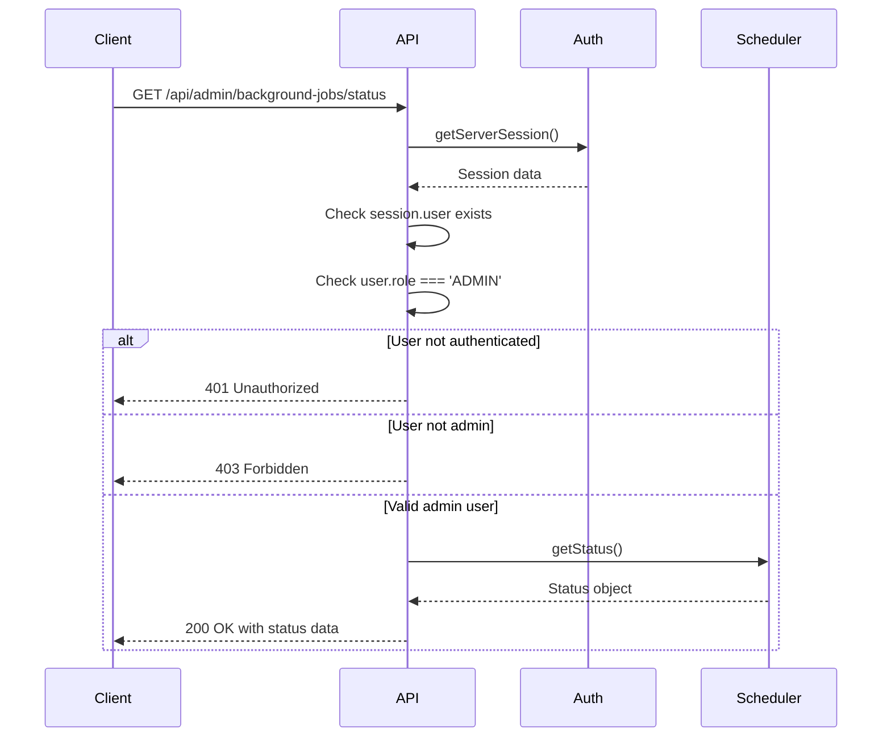
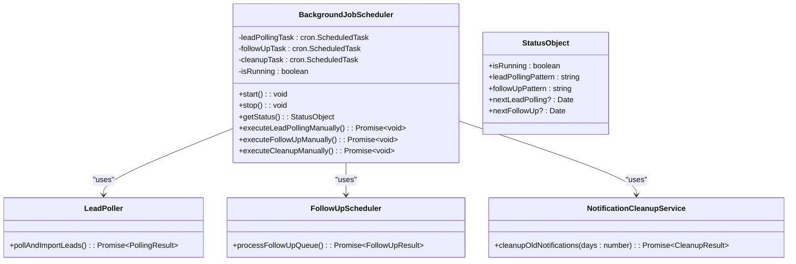
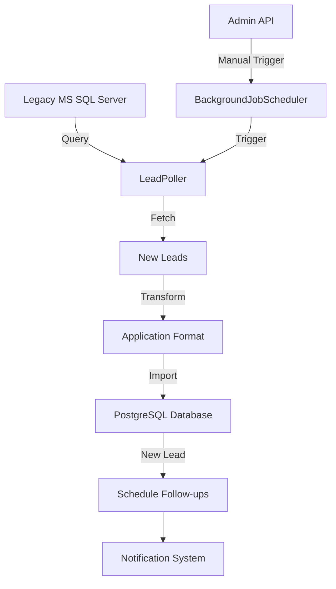
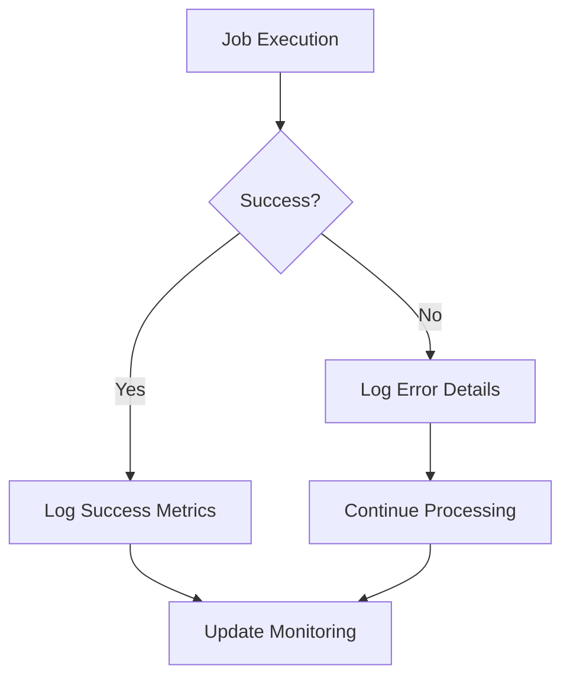

# Background Jobs API

<cite>
**Referenced Files in This Document**   
- [src/app/api/admin/background-jobs/status/route.ts](file://src/app/api/admin/background-jobs/status/route.ts)
- [src/app/api/admin/background-jobs/trigger-polling/route.ts](file://src/app/api/admin/background-jobs/trigger-polling/route.ts)
- [src/services/BackgroundJobScheduler.ts](file://src/services/BackgroundJobScheduler.ts)
- [src/services/LeadPoller.ts](file://src/services/LeadPoller.ts)
- [src/lib/auth.ts](file://src/lib/auth.ts)
</cite>

## Table of Contents
1. [Introduction](#introduction)
2. [Authentication and Authorization](#authentication-and-authorization)
3. [GET /api/admin/background-jobs/status](#get-apimadminbackground-jobsstatus)
4. [POST /api/admin/background-jobs/trigger-polling](#post-apimadminbackground-jobstrigger-polling)
5. [BackgroundJobScheduler Service](#backgroundjobscheduler-service)
6. [LeadPoller Integration](#leadpoller-integration)
7. [Error Handling](#error-handling)
8. [Use Cases](#use-cases)
9. [Examples](#examples)

## Introduction
This document provides comprehensive documentation for the background jobs API endpoints in the fund-track application. The API enables administrators to monitor the status of scheduled background tasks and manually trigger lead polling operations. These endpoints are critical for system monitoring, troubleshooting, and manual intervention when automated processes require human oversight.

The background job system is built around the BackgroundJobScheduler service, which manages three primary scheduled tasks: lead polling, follow-up processing, and notification cleanup. The API provides secure access to monitor and control these operations, ensuring system reliability and operational visibility.

**Section sources**
- [src/app/api/admin/background-jobs/status/route.ts](file://src/app/api/admin/background-jobs/status/route.ts)
- [src/services/BackgroundJobScheduler.ts](file://src/services/BackgroundJobScheduler.ts)

## Authentication and Authorization
All background jobs API endpoints require authentication and admin-level authorization. The system uses NextAuth.js for authentication, and only users with the ADMIN role can access these endpoints.

When a request is made to any background jobs endpoint, the system:
1. Validates the user's authentication session using `getServerSession(authOptions)`
2. Checks if the session contains a user object
3. Verifies that the user's role is 'ADMIN'

Unauthorized access attempts (unauthenticated users or non-admin users) are rejected with appropriate HTTP status codes:
- **401 Unauthorized**: Returned when no valid authentication session exists
- **403 Forbidden**: Returned when the authenticated user lacks admin privileges

This security model ensures that sensitive system monitoring and control functions are only accessible to authorized personnel.



**Diagram sources**
- [src/app/api/admin/background-jobs/status/route.ts](file://src/app/api/admin/background-jobs/status/route.ts)
- [src/lib/auth.ts](file://src/lib/auth.ts)

**Section sources**
- [src/app/api/admin/background-jobs/status/route.ts](file://src/app/api/admin/background-jobs/status/route.ts)
- [src/lib/auth.ts](file://src/lib/auth.ts)

## GET /api/admin/background-jobs/status
The GET /api/admin/background-jobs/status endpoint retrieves the current status of the background job scheduler and related system metrics.

### Request
- **Method**: GET
- **Path**: /api/admin/background-jobs/status
- **Authentication**: Required (NextAuth.js)
- **Authorization**: ADMIN role required

### Response Schema
The endpoint returns a JSON object with the following structure:

```json
{
  "success": true,
  "scheduler": {
    "isRunning": true,
    "leadPollingPattern": "*/15 * * * *",
    "followUpPattern": "*/5 * * * *",
    "nextLeadPolling": "2025-08-27T10:15:00.000Z",
    "nextFollowUp": "2025-08-27T10:10:00.000Z"
  },
  "environment": {
    "nodeEnv": "production",
    "enableBackgroundJobs": "true",
    "leadPollingPattern": "*/15 * * * *",
    "followUpPattern": "*/5 * * * *",
    "campaignIds": "123,456,789",
    "batchSize": "100",
    "timezone": "America/New_York"
  },
  "timestamp": "2025-08-27T10:00:00.000Z"
}
```

#### Scheduler Object
- **isRunning**: Boolean indicating if the scheduler is currently active
- **leadPollingPattern**: Cron pattern for lead polling jobs (defaults to "*/15 * * * *" if not set)
- **followUpPattern**: Cron pattern for follow-up processing jobs (defaults to "*/5 * * * *" if not set)
- **nextLeadPolling**: Timestamp of the next scheduled lead polling execution (optional)
- **nextFollowUp**: Timestamp of the next scheduled follow-up processing execution (optional)

#### Environment Object
- **nodeEnv**: Current Node.js environment (development, production, etc.)
- **enableBackgroundJobs**: Value of ENABLE_BACKGROUND_JOBS environment variable
- **leadPollingPattern**: LEAD_POLLING_CRON_PATTERN environment variable value
- **followUpPattern**: FOLLOWUP_CRON_PATTERN environment variable value
- **campaignIds**: MERCHANT_FUNDING_CAMPAIGN_IDS environment variable value
- **batchSize**: LEAD_POLLING_BATCH_SIZE environment variable value
- **timezone**: TZ environment variable value

### Error Responses
The endpoint returns error responses in the following format:

```json
{
  "success": false,
  "error": "Error message describing the failure"
}
```

Common error scenarios:
- **401 Unauthorized**: No valid authentication session
- **403 Forbidden**: User lacks admin privileges
- **500 Internal Server Error**: Unexpected error retrieving scheduler status

**Section sources**
- [src/app/api/admin/background-jobs/status/route.ts](file://src/app/api/admin/background-jobs/status/route.ts)
- [src/services/BackgroundJobScheduler.ts](file://src/services/BackgroundJobScheduler.ts)

## POST /api/admin/background-jobs/trigger-polling
The POST /api/admin/background-jobs/trigger-polling endpoint manually initiates the lead polling process, bypassing the normal cron schedule.

### Request
- **Method**: POST
- **Path**: /api/admin/background-jobs/trigger-polling
- **Authentication**: Required (NextAuth.js)
- **Authorization**: ADMIN role required
- **Body**: Empty (no request body required)

### Response Schema
The endpoint returns a JSON object with the following structure upon success:

```json
{
  "success": true,
  "message": "Lead polling job triggered successfully",
  "jobStartTime": "2025-08-27T10:00:00.000Z",
  "timestamp": "2025-08-27T10:00:00.000Z"
}
```

#### Response Fields
- **success**: Boolean indicating the operation was initiated successfully
- **message**: Descriptive message about the operation result
- **jobStartTime**: Timestamp when the lead polling job began execution
- **timestamp**: Timestamp when the response was generated

### Error Responses
The endpoint returns error responses in the following format:

```json
{
  "success": false,
  "error": "Error message describing the failure"
}
```

Common error scenarios:
- **401 Unauthorized**: No valid authentication session
- **403 Forbidden**: User lacks admin privileges
- **500 Internal Server Error**: Failed to start the lead polling job

### Processing Flow
When the endpoint is called:
1. Authentication and authorization are verified
2. The `executeLeadPollingManually()` method is called on the BackgroundJobScheduler singleton
3. The lead polling job begins immediately, following the same process as scheduled executions
4. The response is sent once the job has been successfully initiated (not after completion)

**Section sources**
- [src/app/api/admin/background-jobs/trigger-polling/route.ts](file://src/app/api/admin/background-jobs/trigger-polling/route.ts)
- [src/services/BackgroundJobScheduler.ts](file://src/services/BackgroundJobScheduler.ts)

## BackgroundJobScheduler Service
The BackgroundJobScheduler service is the core component that manages all background jobs in the application. It uses the cron library to schedule and execute recurring tasks.

### Architecture
The service manages three primary scheduled tasks:
1. **Lead Polling**: Retrieves new leads from the legacy database
2. **Follow-up Processing**: Sends automated follow-up notifications
3. **Notification Cleanup**: Removes old notification records

Each task is configured with a cron pattern, typically set via environment variables with sensible defaults.

### Key Methods
- **start()**: Initializes and starts all scheduled tasks
- **stop()**: Stops all scheduled tasks
- **getStatus()**: Returns the current status of the scheduler
- **executeLeadPollingManually()**: Triggers lead polling immediately
- **executeFollowUpManually()**: Triggers follow-up processing immediately
- **executeCleanupManually()**: Triggers notification cleanup immediately

### Configuration
The scheduler reads configuration from environment variables:
- **LEAD_POLLING_CRON_PATTERN**: Cron pattern for lead polling (default: "*/15 * * * *")
- **FOLLOWUP_CRON_PATTERN**: Cron pattern for follow-up processing (default: "*/5 * * * *")
- **CLEANUP_CRON_PATTERN**: Cron pattern for cleanup jobs (default: "0 2 * * *")
- **TZ**: Timezone for cron scheduling (default: "America/New_York")



**Diagram sources**
- [src/services/BackgroundJobScheduler.ts](file://src/services/BackgroundJobScheduler.ts)
- [src/services/LeadPoller.ts](file://src/services/LeadPoller.ts)
- [src/services/FollowUpScheduler.ts](file://src/services/FollowUpScheduler.ts)

**Section sources**
- [src/services/BackgroundJobScheduler.ts](file://src/services/BackgroundJobScheduler.ts)

## LeadPoller Integration
The BackgroundJobScheduler integrates with the LeadPoller service to retrieve and import leads from the legacy database system.

### Polling Process
When the lead polling job executes (either scheduled or manual), the following process occurs:

1. A LeadPoller instance is created
2. The pollAndImportLeads() method is called
3. The LeadPoller connects to the legacy MS SQL Server database
4. New leads are retrieved from the Leads table, filtered by campaign IDs
5. Leads are processed in batches to manage memory usage
6. Each lead is transformed and imported into the application database
7. Follow-up notifications are scheduled for new leads

### Data Flow


### Error Handling
The LeadPoller implements robust error handling:
- Individual lead import failures do not stop the entire batch
- Connection retries with exponential backoff
- Comprehensive logging of all operations
- Database transaction management
- Graceful degradation when individual campaigns fail

The integration ensures that lead data is reliably imported while maintaining system stability even when the legacy database experiences connectivity issues.

**Diagram sources**
- [src/services/BackgroundJobScheduler.ts](file://src/services/BackgroundJobScheduler.ts)
- [src/services/LeadPoller.ts](file://src/services/LeadPoller.ts)

**Section sources**
- [src/services/BackgroundJobScheduler.ts](file://src/services/BackgroundJobScheduler.ts)
- [src/services/LeadPoller.ts](file://src/services/LeadPoller.ts)

## Error Handling
The background jobs system implements comprehensive error handling at multiple levels to ensure reliability and provide actionable insights when failures occur.

### Job-Level Error Handling
Each background job (lead polling, follow-up processing, cleanup) wraps its execution in try-catch blocks:



When a job fails:
- The error is logged with full context using the application logger
- Key details include: error message, stack trace, processing time, and relevant identifiers
- The scheduler continues running (a single job failure doesn't stop the entire system)
- For lead polling failures, an error notification is sent to the admin email

### API Error Handling
The API endpoints implement consistent error handling:

```typescript
try {
  // Business logic
} catch (error) {
  console.error('Descriptive error message:', error);
  return NextResponse.json(
    { 
      success: false, 
      error: error instanceof Error ? error.message : 'Unknown error occurred' 
    }, 
    { status: 500 }
  );
}
```

Errors are:
- Logged to the console and application logs
- Returned with appropriate HTTP status codes
- Sanitized to prevent information leakage
- Structured consistently across all endpoints

### Monitoring and Alerting
Failed jobs trigger multiple monitoring mechanisms:
- Application logs with ERROR level
- Database error logs
- Admin email notifications for critical failures
- External monitoring systems via health checks

This multi-layered approach ensures that failures are detected promptly and provide sufficient information for troubleshooting.

**Section sources**
- [src/services/BackgroundJobScheduler.ts](file://src/services/BackgroundJobScheduler.ts)
- [src/app/api/admin/background-jobs/status/route.ts](file://src/app/api/admin/background-jobs/status/route.ts)
- [src/app/api/admin/background-jobs/trigger-polling/route.ts](file://src/app/api/admin/background-jobs/trigger-polling/route.ts)

## Use Cases
The background jobs API supports several critical operational use cases for system administrators.

### System Monitoring
Administrators can use the GET /api/admin/background-jobs/status endpoint to:
- Verify the scheduler is running properly
- Check the next scheduled execution times
- Validate cron pattern configurations
- Monitor system health and environment settings
- Troubleshoot scheduling issues

This is particularly useful during system startup, after deployments, or when investigating potential issues with automated processes.

### Manual Intervention During Failures
When automated lead polling fails or is suspected to be malfunctioning, administrators can:
1. Check the current scheduler status
2. Manually trigger lead polling using POST /api/admin/background-jobs/trigger-polling
3. Monitor the results and verify successful execution

This capability allows for immediate remediation without waiting for the next scheduled run, minimizing potential data import delays.

### Operational Verification
After configuration changes or system maintenance, administrators can:
- Verify that the scheduler reflects updated cron patterns
- Test that manual triggering works correctly
- Confirm that lead polling connects to the legacy database
- Validate that new leads are properly imported and processed

### Development and Testing
During development, these endpoints enable:
- Testing the entire lead import pipeline on demand
- Verifying integration with the legacy database
- Debugging issues with data transformation
- Testing notification workflows with real data

The combination of monitoring and manual control provides administrators with the tools needed to ensure reliable operation of the background job system.

**Section sources**
- [src/app/api/admin/background-jobs/status/route.ts](file://src/app/api/admin/background-jobs/status/route.ts)
- [src/app/api/admin/background-jobs/trigger-polling/route.ts](file://src/app/api/admin/background-jobs/trigger-polling/route.ts)

## Examples
This section provides practical examples of using the background jobs API endpoints.

### Checking Scheduler Status
```bash
curl -X GET \
  http://localhost:3000/api/admin/background-jobs/status \
  -H "Authorization: Bearer <admin-jwt-token>" \
  -H "Content-Type: application/json"

# Example response
{
  "success": true,
  "scheduler": {
    "isRunning": true,
    "leadPollingPattern": "*/15 * * * *",
    "followUpPattern": "*/5 * * * *",
    "nextLeadPolling": "2025-08-27T10:15:00.000Z",
    "nextFollowUp": "2025-08-27T10:10:00.000Z"
  },
  "environment": {
    "nodeEnv": "production",
    "enableBackgroundJobs": "true",
    "leadPollingPattern": "*/15 * * * *",
    "followUpPattern": "*/5 * * * *",
    "campaignIds": "123,456,789",
    "batchSize": "100",
    "timezone": "America/New_York"
  },
  "timestamp": "2025-08-27T10:00:00.000Z"
}
```

### Triggering Manual Lead Polling
```bash
curl -X POST \
  http://localhost:3000/api/admin/background-jobs/trigger-polling \
  -H "Authorization: Bearer <admin-jwt-token>" \
  -H "Content-Type: application/json"

# Example response
{
  "success": true,
  "message": "Lead polling job triggered successfully",
  "jobStartTime": "2025-08-27T10:00:00.000Z",
  "timestamp": "2025-08-27T10:00:00.000Z"
}
```

### Error Response Examples
```bash
# Unauthorized access
curl -X GET http://localhost:3000/api/admin/background-jobs/status
# Response: { "error": "Unauthorized" } with status 401

# Insufficient privileges
curl -X GET http://localhost:3000/api/admin/background-jobs/status \
  -H "Authorization: Bearer <non-admin-jwt-token>"
# Response: { "error": "Forbidden - Admin access required" } with status 403

# Server error
curl -X GET http://localhost:3000/api/admin/background-jobs/status \
  -H "Authorization: Bearer <admin-jwt-token>"
# Response: { "success": false, "error": "Unknown error occurred" } with status 500
```

These examples demonstrate the practical usage of the API endpoints for both successful operations and error handling scenarios.

**Section sources**
- [src/app/api/admin/background-jobs/status/route.ts](file://src/app/api/admin/background-jobs/status/route.ts)
- [src/app/api/admin/background-jobs/trigger-polling/route.ts](file://src/app/api/admin/background-jobs/trigger-polling/route.ts)