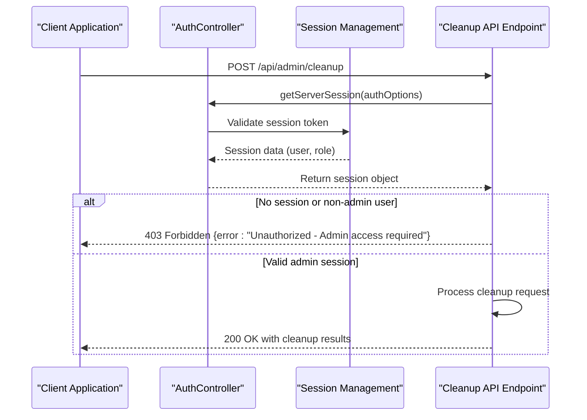
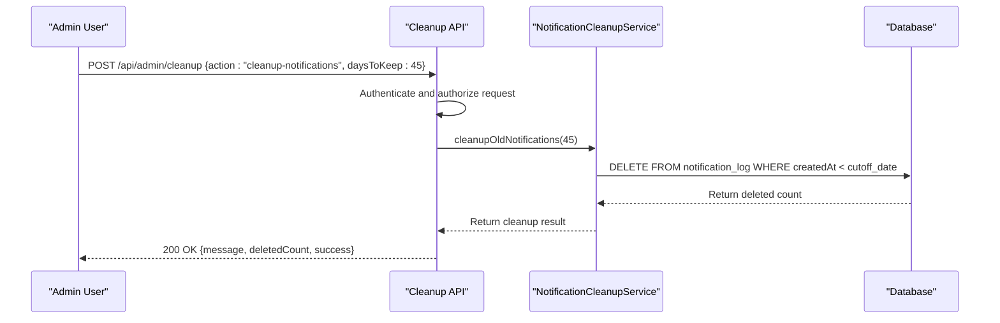
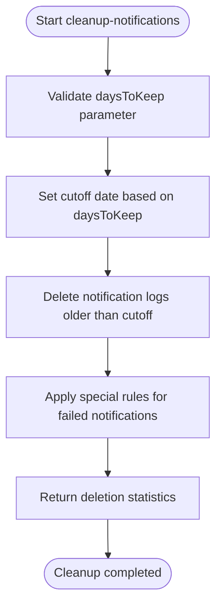
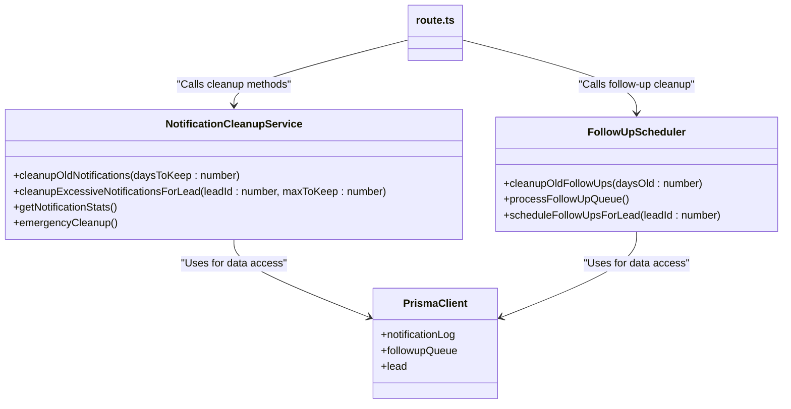
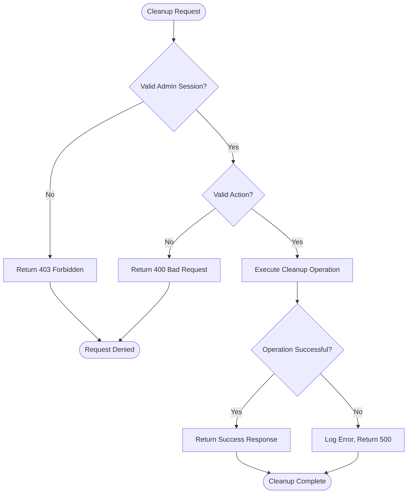
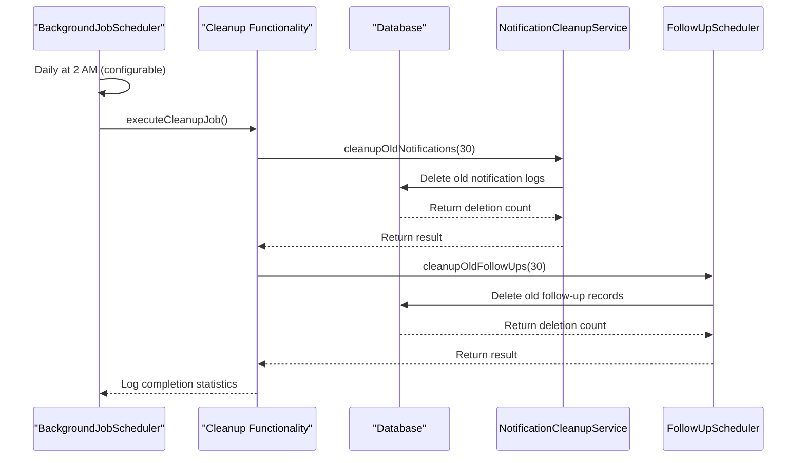

# Cleanup API

<cite>
**Referenced Files in This Document**   
- [route.ts](file://src/app/api/admin/cleanup/route.ts)
- [NotificationCleanupService.ts](file://src/services/NotificationCleanupService.ts)
- [FollowUpScheduler.ts](file://src/services/FollowUpScheduler.ts)
- [auth.ts](file://src/lib/auth.ts)
- [BackgroundJobScheduler.ts](file://src/services/BackgroundJobScheduler.ts)
</cite>

## Table of Contents
1. [Cleanup API Overview](#cleanup-api-overview)
2. [Authentication and Authorization](#authentication-and-authorization)
3. [POST /api/admin/cleanup Endpoint](#post-apicleanup-endpoint)
4. [Request Parameters](#request-parameters)
5. [Response Schema](#response-schema)
6. [Supported Actions](#supported-actions)
7. [Integration with NotificationCleanupService](#integration-with-notificationcleanupservice)
8. [Safety Mechanisms](#safety-mechanisms)
9. [Scheduled Cleanup Jobs](#scheduled-cleanup-jobs)
10. [Use Cases](#use-cases)

## Cleanup API Overview

The Cleanup API provides administrative functionality for managing expired notification logs and temporary data within the fund-track application. This endpoint enables system administrators to perform various cleanup operations to maintain database performance and storage efficiency. The API supports multiple cleanup actions including removing old notifications, follow-ups, and handling emergency cleanup scenarios.

The cleanup functionality is critical for maintaining optimal database performance by preventing uncontrolled growth of notification logs and follow-up records. The system implements both manual cleanup operations through the API and automated scheduled cleanup jobs that run daily to maintain data hygiene.

**Section sources**
- [route.ts](file://src/app/api/admin/cleanup/route.ts#L1-L144)
- [NotificationCleanupService.ts](file://src/services/NotificationCleanupService.ts#L3-L230)

## Authentication and Authorization

The cleanup endpoint enforces strict authentication and authorization requirements using NextAuth.js. Access to the cleanup functionality is restricted to users with administrative privileges only.



**Diagram sources**
- [route.ts](file://src/app/api/admin/cleanup/route.ts#L15-L23)
- [auth.ts](file://src/lib/auth.ts#L1-L70)

**Section sources**
- [route.ts](file://src/app/api/admin/cleanup/route.ts#L15-L23)
- [auth.ts](file://src/lib/auth.ts#L1-L70)

## POST /api/admin/cleanup Endpoint

The primary endpoint for triggering cleanup operations is POST /api/admin/cleanup. This endpoint accepts JSON payloads specifying the cleanup action to perform and optional parameters that modify the cleanup behavior.



**Diagram sources**
- [route.ts](file://src/app/api/admin/cleanup/route.ts#L15-L70)
- [NotificationCleanupService.ts](file://src/services/NotificationCleanupService.ts#L8-L45)

**Section sources**
- [route.ts](file://src/app/api/admin/cleanup/route.ts#L15-L70)

## Request Parameters

The cleanup endpoint accepts the following parameters in the request body:

**:action** (required): Specifies the cleanup operation to perform. Supported values include:
- "cleanup-notifications": Remove old notification logs
- "cleanup-followups": Remove old follow-up records
- "emergency-cleanup": Emergency removal of recent notifications
- "cleanup-lead-notifications": Clean excessive notifications for a specific lead
- "get-stats": Retrieve notification statistics

**:daysToKeep** (optional): Number of days of records to retain. Defaults to 30 days for notification cleanup.

**:leadId** (required for lead-specific cleanup): The ID of the lead for which to clean excessive notifications.

**:maxToKeep** (optional): Maximum number of recent notifications to keep for a specific lead. Defaults to 10.

```json
{
  "action": "cleanup-notifications",
  "daysToKeep": 45
}
```

**Section sources**
- [route.ts](file://src/app/api/admin/cleanup/route.ts#L24-L25)

## Response Schema

The cleanup endpoint returns a standardized JSON response containing cleanup statistics and status information.

**:message** (string): Descriptive message about the cleanup operation performed.

**:deletedCount** (number): Number of records deleted during the cleanup operation.

**:success** (boolean): Indicates whether the cleanup operation completed successfully.

**:error** (string, optional): Error message if the cleanup operation failed.

**:stats** (object, optional): Statistics about notification logs when retrieving stats.

Example successful response:
```json
{
  "message": "Cleaned up notifications older than 30 days",
  "deletedCount": 1542,
  "success": true
}
```

Example error response:
```json
{
  "error": "Unauthorized - Admin access required",
  "status": 403
}
```

**Section sources**
- [route.ts](file://src/app/api/admin/cleanup/route.ts#L26-L70)

## Supported Actions

The cleanup API supports multiple actions for different maintenance scenarios:

### cleanup-notifications
Removes notification logs older than the specified retention period. Failed notifications are retained for a shorter period (7 days) for debugging purposes.



**Diagram sources**
- [NotificationCleanupService.ts](file://src/services/NotificationCleanupService.ts#L8-L45)

### cleanup-followups
Removes completed or cancelled follow-up records older than the specified retention period.

### emergency-cleanup
Performs an emergency cleanup of all notifications older than 7 days, regardless of the default retention policy.

### cleanup-lead-notifications
Removes excessive notifications for a specific lead, keeping only the most recent ones as specified by maxToKeep.

### get-stats
Retrieves comprehensive statistics about notification logs for monitoring and analysis.

**Section sources**
- [route.ts](file://src/app/api/admin/cleanup/route.ts#L26-L70)
- [NotificationCleanupService.ts](file://src/services/NotificationCleanupService.ts#L8-L227)

## Integration with NotificationCleanupService

The cleanup endpoint integrates directly with the NotificationCleanupService class, which encapsulates the business logic for data cleanup operations. This service provides a clean separation between the API interface and the underlying cleanup implementation.



**Diagram sources**
- [NotificationCleanupService.ts](file://src/services/NotificationCleanupService.ts#L3-L230)
- [FollowUpScheduler.ts](file://src/services/FollowUpScheduler.ts#L1-L490)
- [route.ts](file://src/app/api/admin/cleanup/route.ts#L1-L144)

**Section sources**
- [NotificationCleanupService.ts](file://src/services/NotificationCleanupService.ts#L3-L230)
- [route.ts](file://src/app/api/admin/cleanup/route.ts#L1-L144)

## Safety Mechanisms

The cleanup system implements several safety mechanisms to prevent accidental data loss and ensure operational integrity:

1. **Administrative Role Enforcement**: Only users with ADMIN role can access cleanup functionality.

2. **Parameter Validation**: All input parameters are validated before processing.

3. **Selective Deletion**: The system preserves failed notifications for 7 days to aid in debugging.

4. **Transaction Safety**: Database operations use Prisma's transaction capabilities where appropriate.

5. **Comprehensive Logging**: All cleanup operations are logged with detailed information.

6. **Error Handling**: Robust error handling prevents partial cleanup states.



**Diagram sources**
- [route.ts](file://src/app/api/admin/cleanup/route.ts#L15-L70)
- [NotificationCleanupService.ts](file://src/services/NotificationCleanupService.ts#L8-L45)

**Section sources**
- [route.ts](file://src/app/api/admin/cleanup/route.ts#L15-L70)
- [NotificationCleanupService.ts](file://src/services/NotificationCleanupService.ts#L8-L45)

## Scheduled Cleanup Jobs

The system includes automated cleanup jobs that run on a daily schedule to maintain data hygiene without requiring manual intervention.



The scheduled cleanup job is configured in the BackgroundJobScheduler and runs daily at 2 AM by default, though this can be customized via environment variables. The job automatically cleans up notification logs older than 30 days and follow-up records older than 30 days.

**Diagram sources**
- [BackgroundJobScheduler.ts](file://src/services/BackgroundJobScheduler.ts#L423-L461)
- [NotificationCleanupService.ts](file://src/services/NotificationCleanupService.ts#L8-L45)
- [FollowUpScheduler.ts](file://src/services/FollowUpScheduler.ts#L467-L489)

**Section sources**
- [BackgroundJobScheduler.ts](file://src/services/BackgroundJobScheduler.ts#L423-L461)

## Use Cases

### Routine Maintenance
System administrators can perform routine maintenance by triggering cleanup operations during off-peak hours to optimize database performance.

**curl example:**
```bash
curl -X POST https://fund-track.example.com/api/admin/cleanup \
  -H "Authorization: Bearer <admin_token>" \
  -H "Content-Type: application/json" \
  -d '{
    "action": "cleanup-notifications",
    "daysToKeep": 45
  }'
```

### Troubleshooting Storage Issues
When storage capacity becomes a concern, administrators can use the cleanup API to quickly reduce database size by removing expired records.

### Emergency Data Reduction
In cases of unexpected database growth, the emergency-cleanup action can be used to rapidly free up space by removing notifications older than 7 days.

### Lead-Specific Cleanup
For specific leads generating excessive notifications, the cleanup-lead-notifications action can be used to clean up historical data while preserving recent interactions.

### Monitoring and Analysis
The get-stats action provides valuable insights into notification patterns and helps identify leads with excessive notifications that may require attention.

**Section sources**
- [route.ts](file://src/app/api/admin/cleanup/route.ts#L1-L144)
- [NotificationCleanupService.ts](file://src/services/NotificationCleanupService.ts#L3-L230)