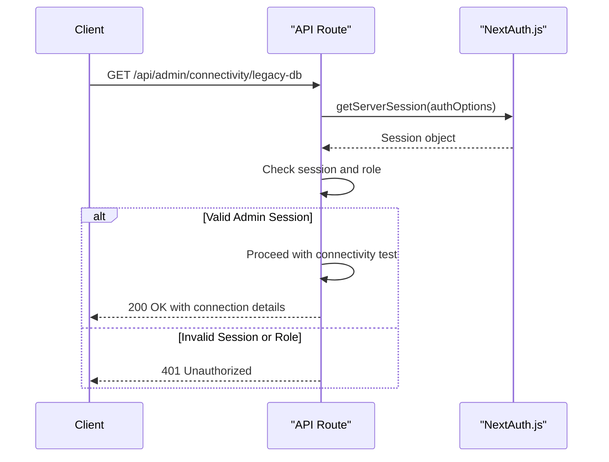
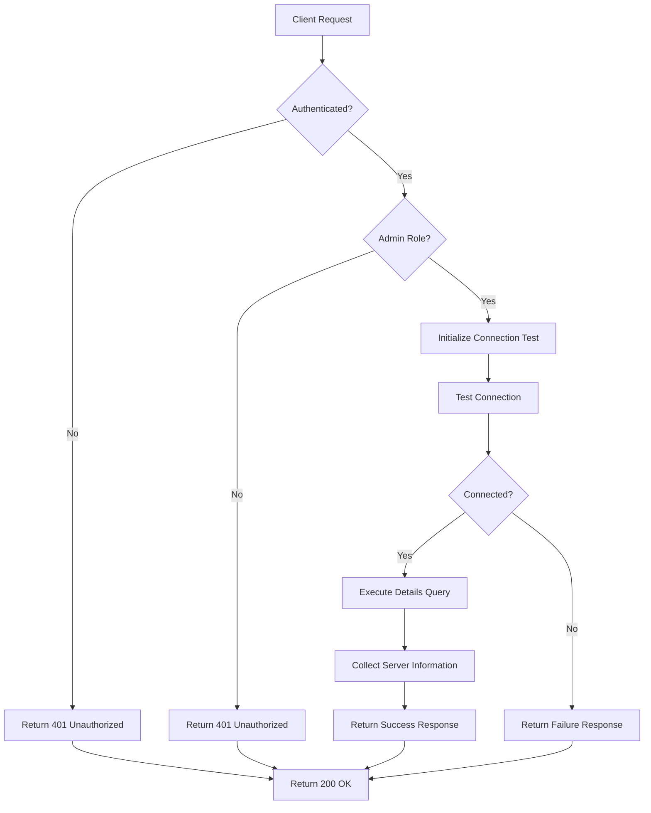
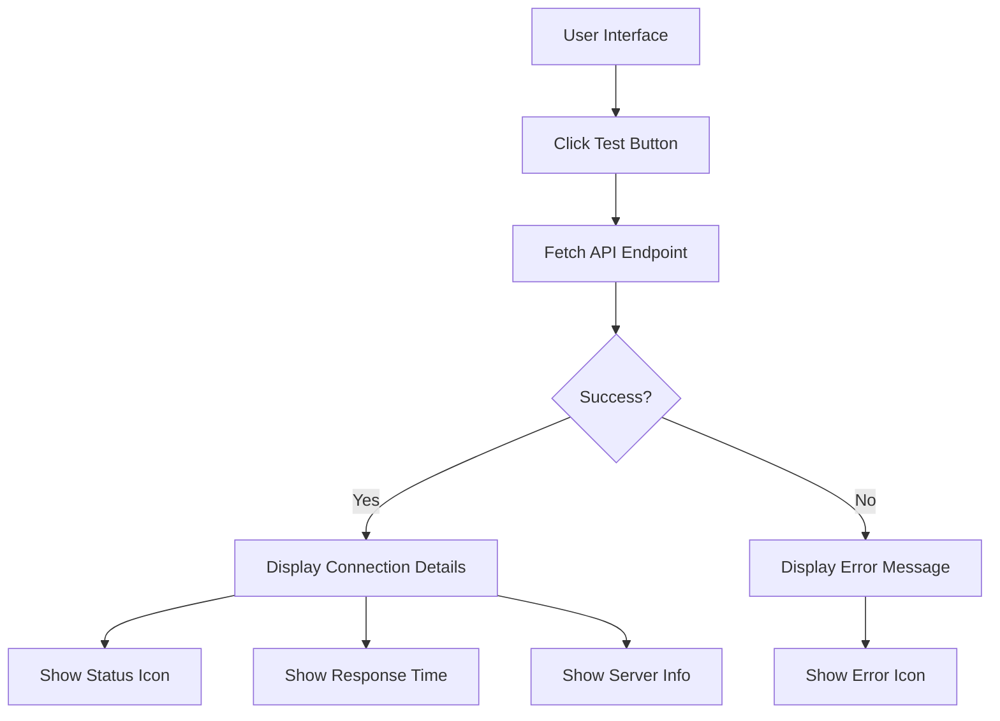

# Connectivity API

<cite>
**Referenced Files in This Document**   
- [route.ts](file://src/app/api/admin/connectivity/legacy-db/route.ts)
- [legacy-db.ts](file://src/lib/legacy-db.ts)
- [auth.ts](file://src/lib/auth.ts)
- [ConnectivityCheck.tsx](file://src/components/admin/ConnectivityCheck.tsx)
- [test-legacy-db.mjs](file://scripts/test-legacy-db.mjs)
</cite>

## Table of Contents
1. [Introduction](#introduction)
2. [Authentication and Authorization](#authentication-and-authorization)
3. [Endpoint Details](#endpoint-details)
4. [Response Schema](#response-schema)
5. [Integration with Legacy Database Utility](#integration-with-legacy-database-utility)
6. [Timeout Handling](#timeout-handling)
7. [Use Cases](#use-cases)
8. [Security Considerations](#security-considerations)
9. [Testing and Diagnostics](#testing-and-diagnostics)
10. [Example Usage](#example-usage)

## Introduction
The Connectivity API provides a mechanism to test connectivity to the legacy MS SQL Server database used by the fund-track application. This endpoint is critical for system diagnostics, deployment validation, and troubleshooting data import failures. The API endpoint is accessible at `GET /api/admin/connectivity/legacy-db` and returns comprehensive information about the database connection status, latency, configuration, and server metadata.

The connectivity check performs a complete connection test by establishing a connection to the legacy database and executing a simple query. The endpoint is protected by authentication and role-based access control, ensuring only authorized administrators can access this sensitive diagnostic information. The response includes detailed connection metrics, error information when applicable, and the current database configuration.

**Section sources**
- [route.ts](file://src/app/api/admin/connectivity/legacy-db/route.ts#L1-L87)

## Authentication and Authorization
The connectivity endpoint enforces strict authentication and authorization requirements using NextAuth.js. Access is restricted to users with the ADMIN role, ensuring that sensitive database connectivity information is only available to authorized personnel.

The authentication process is implemented in the API route using `getServerSession` from NextAuth.js with the application's authentication options. The session is validated to ensure both the presence of a user session and that the user's role is explicitly set to 'ADMIN'.



**Diagram sources**
- [route.ts](file://src/app/api/admin/connectivity/legacy-db/route.ts#L15-L22)
- [auth.ts](file://src/lib/auth.ts#L1-L70)

**Section sources**
- [route.ts](file://src/app/api/admin/connectivity/legacy-db/route.ts#L15-L22)
- [auth.ts](file://src/lib/auth.ts#L1-L70)

## Endpoint Details
The connectivity testing endpoint is implemented as a GET request handler at `/api/admin/connectivity/legacy-db`. This endpoint serves as a health check for the connection between the fund-track application and the legacy MS SQL Server database.

The endpoint performs the following operations:
1. Authenticates the requesting user and verifies admin privileges
2. Retrieves the legacy database instance using the singleton pattern
3. Measures the response time for the connectivity test
4. Attempts to establish a connection and execute a test query
5. Collects detailed connection information when successful
6. Returns a comprehensive JSON response with status, error information, details, and configuration

The endpoint is designed to be idempotent and safe, as it only retrieves connection status information without modifying any data. It follows RESTful principles by using the appropriate HTTP methods and status codes.



**Diagram sources**
- [route.ts](file://src/app/api/admin/connectivity/legacy-db/route.ts#L1-L87)

**Section sources**
- [route.ts](file://src/app/api/admin/connectivity/legacy-db/route.ts#L1-L87)

## Response Schema
The connectivity endpoint returns a JSON response with a standardized schema that includes connection status, error information, detailed metrics, timestamp, and configuration details.

### Response Structure
```json
{
  "status": "connected",
  "error": null,
  "details": {
    "responseTime": "123ms",
    "serverInfo": {
      "version": "Microsoft SQL Server 2019",
      "database_name": "LeadData2",
      "server_name": "LEGACY-SQL-01"
    },
    "connectionStatus": "Active"
  },
  "timestamp": "2025-08-28T10:30:00.000Z",
  "config": {
    "server": "172.16.0.70",
    "database": "LeadData2",
    "port": "1433",
    "encrypt": "true",
    "trustServerCertificate": "true"
  }
}
```

### Field Definitions
**status**: Connection status with possible values:
- `connected`: Successfully connected and query executed
- `failed`: Connection established but test query failed
- `error`: Connection attempt failed
- `disconnected`: Not connected (initial state)

**error**: Error message when the connection test fails, or null if successful.

**details**: Object containing detailed connection information:
- `responseTime`: Time taken for the connection test in milliseconds
- `serverInfo`: Database server metadata from the version query
- `connectionStatus`: Current connection status (Active, Inactive, etc.)

**timestamp**: ISO 8601 timestamp of when the test was performed.

**config**: Current database configuration from environment variables, with fallback values when not configured.

The response schema is designed to provide comprehensive diagnostic information while maintaining a consistent structure for programmatic consumption.

**Section sources**
- [route.ts](file://src/app/api/admin/connectivity/legacy-db/route.ts#L23-L87)
- [ConnectivityCheck.tsx](file://src/components/admin/ConnectivityCheck.tsx#L1-L55)

## Integration with Legacy Database Utility
The connectivity endpoint integrates with the legacy database utility through the `getLegacyDatabase()` function, which provides a singleton instance of the `LegacyDatabase` class. This utility encapsulates all interactions with the MS SQL Server database and provides a clean abstraction layer.

The `LegacyDatabase` class implements connection pooling, query execution, and connection testing functionality. The connectivity test uses the `testConnection()` method, which attempts to establish a connection and execute a simple query (`SELECT 1 as test`) to verify both connectivity and query execution capability.

```mermaid
classDiagram
class LegacyDatabase {
-pool : ConnectionPool
-config : LegacyDbConfig
+connect() : Promise~void~
+disconnect() : Promise~void~
+query~T~(queryText : string, parameters? : Record~string, any~) : Promise~T[]~
+testConnection() : Promise~boolean~
+isConnected() : boolean
}
class LegacyDbConfig {
+server : string
+database : string
+user : string
+password : string
+port? : number
+options? : LegacyDbOptions
}
class LegacyDbOptions {
+encrypt? : boolean
+trustServerCertificate? : boolean
+requestTimeout? : number
+connectionTimeout? : number
+enableArithAbort? : boolean
+abortTransactionOnError? : boolean
}
LegacyDatabase --> LegacyDbConfig : "uses"
LegacyDatabase --> "mssql.ConnectionPool" : "creates"
```

**Diagram sources**
- [legacy-db.ts](file://src/lib/legacy-db.ts#L1-L157)

**Section sources**
- [route.ts](file://src/app/api/admin/connectivity/legacy-db/route.ts#L19-L20)
- [legacy-db.ts](file://src/lib/legacy-db.ts#L1-L157)

## Timeout Handling
The legacy database utility implements comprehensive timeout handling through configuration options that are initialized from environment variables. These timeouts ensure that connectivity tests and database operations do not hang indefinitely, providing predictable response times and preventing resource exhaustion.

Two key timeout settings are configured:

1. **Connection Timeout**: The maximum time (in milliseconds) to wait for a connection to be established. Default: 15,000ms (15 seconds).
2. **Request Timeout**: The maximum time (in milliseconds) to wait for a query to complete. Default: 30,000ms (30 seconds).

These timeout values are set in the `LegacyDbConfig` options and are derived from environment variables with sensible defaults:

- `LEGACY_DB_CONNECTION_TIMEOUT`: Connection timeout in milliseconds
- `LEGACY_DB_REQUEST_TIMEOUT`: Request/query timeout in milliseconds

When a timeout occurs, the underlying mssql library throws an error, which is caught by the `testConnection()` method and results in a `false` return value. The connectivity endpoint captures this failure and returns an appropriate error response with the timeout duration included in the response time measurement.

The timeout configuration ensures that the connectivity check itself has predictable performance characteristics, even when the legacy database is unresponsive.

**Section sources**
- [legacy-db.ts](file://src/lib/legacy-db.ts#L144-L145)
- [legacy-db.ts](file://src/lib/legacy-db.ts#L30-L35)

## Use Cases
The connectivity testing endpoint serves several critical use cases in the operation and maintenance of the fund-track application.

### System Diagnostics
The primary use case is system diagnostics, allowing administrators to verify the health of the connection to the legacy database. This is particularly valuable when investigating issues with data synchronization, lead imports, or other functionality that depends on the legacy system.

### Deployment Validation
During deployments or infrastructure changes, the connectivity endpoint provides a quick way to validate that the application can successfully connect to the legacy database with the current configuration. This helps catch configuration errors before they impact users.

### Troubleshooting Data Import Failures
When data import processes fail, the first step in troubleshooting is often to verify database connectivity. The endpoint provides immediate feedback on whether connectivity issues are the root cause, helping to narrow down the problem space.

### Monitoring and Alerting
The endpoint can be integrated into monitoring systems to provide continuous visibility into the health of the legacy database connection. Automated checks can trigger alerts when connectivity is lost, enabling proactive issue resolution.

### Configuration Verification
The response includes the current database configuration as loaded from environment variables, allowing administrators to verify that the correct settings are being used, especially after configuration changes.

**Section sources**
- [route.ts](file://src/app/api/admin/connectivity/legacy-db/route.ts#L1-L87)
- [ConnectivityCheck.tsx](file://src/components/admin/ConnectivityCheck.tsx#L1-L230)

## Security Considerations
Exposing database connectivity information presents several security considerations that have been addressed in the implementation.

### Authentication and Authorization
The endpoint requires authentication and restricts access to users with the ADMIN role. This prevents unauthorized users from probing the database configuration or using the endpoint to perform reconnaissance on the database infrastructure.

### Information Disclosure
The response includes database configuration details such as server address, database name, and connection settings. While this information is necessary for diagnostic purposes, it could be valuable to attackers. The role-based access control mitigates this risk by limiting access to trusted administrators.

### Connection Testing
The connectivity test itself could potentially be abused to perform denial-of-service attacks on the legacy database by repeatedly establishing connections. The implementation uses connection pooling and the singleton pattern to minimize the impact, and the timeouts prevent long-running connection attempts.

### Environment Variable Exposure
The endpoint returns configuration values derived from environment variables. Sensitive information like passwords is not included in the response, but other configuration details are exposed. This is considered acceptable for administrative endpoints with proper access controls.

### Error Handling
Error messages are carefully crafted to provide useful diagnostic information without revealing excessive implementation details that could aid attackers. Generic error messages are used for unauthorized access attempts.

**Section sources**
- [route.ts](file://src/app/api/admin/connectivity/legacy-db/route.ts#L15-L22)
- [legacy-db.ts](file://src/lib/legacy-db.ts#L130-L157)

## Testing and Diagnostics
The application includes multiple tools for testing and diagnosing legacy database connectivity, both through the API and command-line interfaces.

### Frontend Component
The `ConnectivityCheck` component provides a user-friendly interface for administrators to test the database connection. It displays the connection status with visual indicators, response time, server information, and configuration details in a formatted panel.



**Diagram sources**
- [ConnectivityCheck.tsx](file://src/components/admin/ConnectivityCheck.tsx#L1-L230)

### Command-Line Testing
The `scripts/test-legacy-db.mjs` script provides command-line access to legacy database testing functionality. It supports multiple operations:
- `status`: Check current test records in both databases
- `insert`: Insert a test record into the legacy database
- `delete`: Delete test records from both databases
- `cleanup`: Cleanup related records from the application database

This script is useful for automated testing, deployment validation, and troubleshooting in environments where the web interface may not be accessible.

**Section sources**
- [ConnectivityCheck.tsx](file://src/components/admin/ConnectivityCheck.tsx#L1-L230)
- [test-legacy-db.mjs](file://scripts/test-legacy-db.mjs#L1-L104)

## Example Usage
### curl Command
```bash
curl -X GET \
  http://localhost:3000/api/admin/connectivity/legacy-db \
  -H "Authorization: Bearer <admin-jwt-token>" \
  -H "Content-Type: application/json"
```

### Successful Response
```json
{
  "status": "connected",
  "error": null,
  "details": {
    "responseTime": "45ms",
    "serverInfo": {
      "version": "Microsoft SQL Server 2019 (RTM) - 15.0.2000.5",
      "database_name": "LeadData2",
      "server_name": "LEGACY-SQL-01"
    },
    "connectionStatus": "Active"
  },
  "timestamp": "2025-08-28T10:30:00.000Z",
  "config": {
    "server": "172.16.0.70",
    "database": "LeadData2",
    "port": "1433",
    "encrypt": "true",
    "trustServerCertificate": "true"
  }
}
```

### Failed Connection Response
```json
{
  "status": "error",
  "error": "Failed to connect to server",
  "details": {
    "responseTime": "15023ms",
    "connectionStatus": "Error"
  },
  "timestamp": "2025-08-28T10:31:00.000Z",
  "config": {
    "server": "172.16.0.70",
    "database": "LeadData2",
    "port": "1433",
    "encrypt": "true",
    "trustServerCertificate": "true"
  }
}
```

The example usage demonstrates how to call the endpoint and the expected response formats for both successful and failed connection tests.

**Section sources**
- [route.ts](file://src/app/api/admin/connectivity/legacy-db/route.ts#L1-L87)
- [ConnectivityCheck.tsx](file://src/components/admin/ConnectivityCheck.tsx#L1-L230)