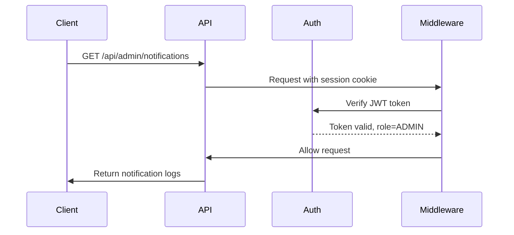
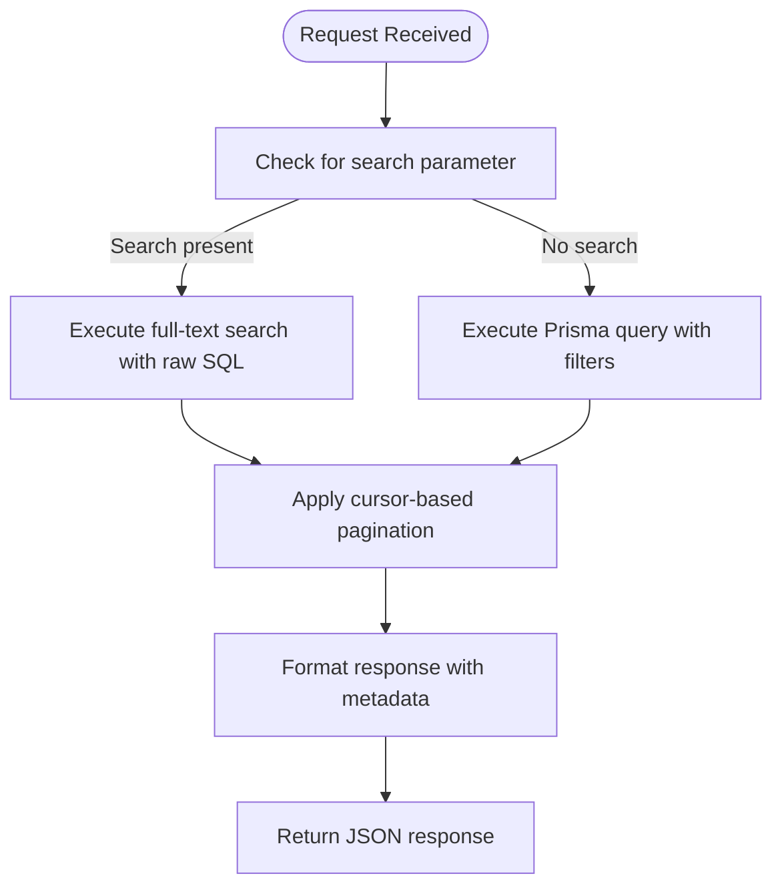
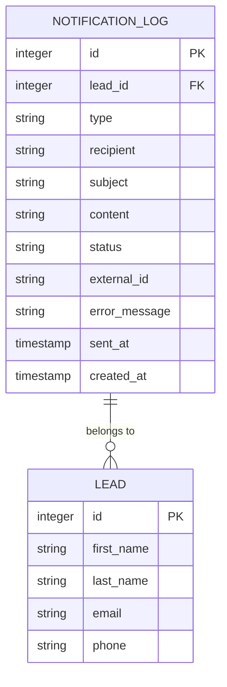
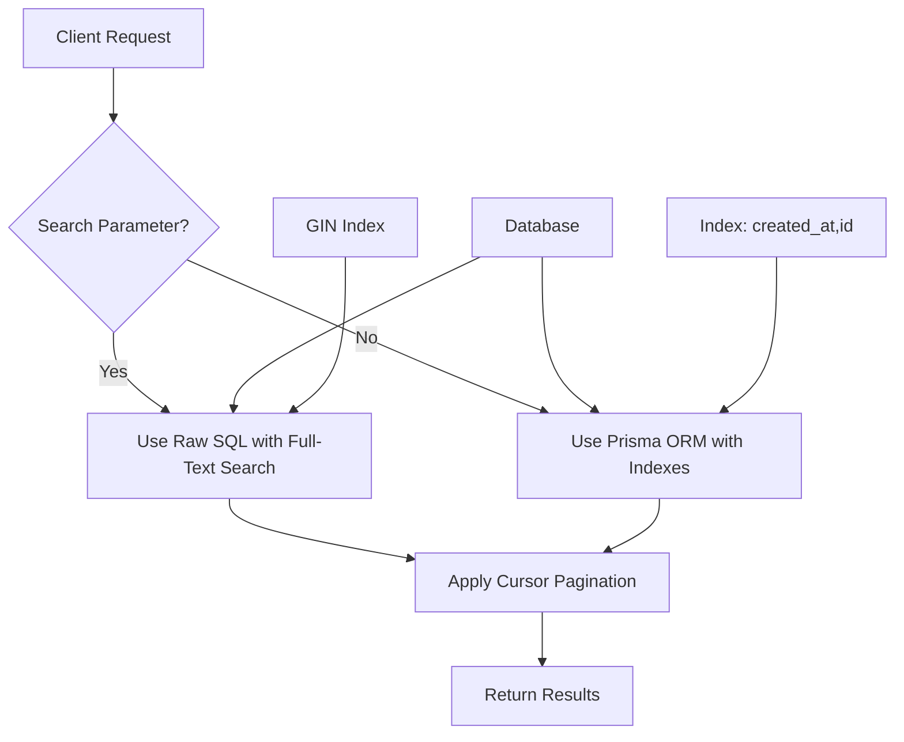

# Notifications API

<cite>
**Referenced Files in This Document**   
- [route.ts](file://src/app/api/admin/notifications/route.ts)
- [NotificationService.ts](file://src/services/NotificationService.ts)
- [auth.ts](file://src/lib/auth.ts)
- [schema.prisma](file://prisma/schema.prisma)
- [page.tsx](file://src/app/admin/notifications/page.tsx)
- [middleware.ts](file://src/middleware.ts)
</cite>

## Table of Contents
1. [Introduction](#introduction)
2. [Authentication and Authorization](#authentication-and-authorization)
3. [Endpoint Details](#endpoint-details)
4. [Query Parameters](#query-parameters)
5. [Response Schema](#response-schema)
6. [Performance Considerations](#performance-considerations)
7. [Integration with NotificationService](#integration-with-notificationservice)
8. [Usage Examples](#usage-examples)
9. [Error Handling](#error-handling)

## Introduction
The Notifications API provides administrative access to notification logs within the fund-track application. This RESTful endpoint enables retrieval of email and SMS delivery records with comprehensive filtering capabilities. The API is designed for administrative use, offering insights into communication history, delivery status, and troubleshooting information for failed notifications.

The system integrates with external services (Mailgun for email, Twilio for SMS) and maintains a detailed log of all notification attempts. The API supports efficient querying of large datasets through cursor-based pagination and optimized database queries.

## Authentication and Authorization
The GET /api/admin/notifications endpoint requires authenticated access with admin privileges. Authentication is implemented using NextAuth.js with JWT-based session management.



**Diagram sources**
- [auth.ts](file://src/lib/auth.ts#L1-L70)
- [middleware.ts](file://src/middleware.ts#L128-L162)

The authentication flow works as follows:
1. NextAuth.js manages user sessions using JWT tokens stored in cookies
2. The `authOptions` configuration includes a credentials provider for email/password authentication
3. Upon successful login, the JWT token includes the user's role (ADMIN or USER)
4. Middleware enforces role-based access control, redirecting non-admin users
5. Only users with ADMIN role can access the notifications endpoint

**Section sources**
- [auth.ts](file://src/lib/auth.ts#L1-L70)
- [middleware.ts](file://src/middleware.ts#L128-L162)

## Endpoint Details
### GET /api/admin/notifications
Retrieves notification logs with filtering and pagination capabilities.

**Method**: GET  
**Authentication**: Required (Admin role)  
**Response Format**: JSON  
**Pagination**: Cursor-based

The endpoint supports two query execution paths based on the presence of a search parameter:
- For search queries: Uses raw SQL with PostgreSQL full-text search for optimal performance
- For standard queries: Uses Prisma ORM with indexed fields for efficient retrieval



**Diagram sources**
- [route.ts](file://src/app/api/admin/notifications/route.ts#L0-L121)

**Section sources**
- [route.ts](file://src/app/api/admin/notifications/route.ts#L0-L121)

## Query Parameters
The endpoint accepts the following query parameters for filtering and pagination:

| Parameter | Type | Required | Default | Description |
|---------|------|----------|---------|-------------|
| limit | number | No | 25 | Number of records to return (max 100) |
| cursor | string | No | - | Cursor for pagination (notification ID) |
| type | string | No | - | Filter by notification type: "email" or "sms" |
| status | string | No | - | Filter by delivery status: "sent", "failed", or "pending" |
| recipient | string | No | - | Filter by recipient email or phone number |
| search | string | No | - | Full-text search across recipient, subject, content, externalId, and errorMessage |

**Section sources**
- [route.ts](file://src/app/api/admin/notifications/route.ts#L15-L35)

## Response Schema
The API returns a JSON response with the following structure:

```json
{
  "logs": [
    {
      "id": 123,
      "leadId": 456,
      "type": "email",
      "recipient": "user@example.com",
      "subject": "Application Confirmation",
      "content": "Thank you for your application...",
      "status": "sent",
      "externalId": "mg_789",
      "errorMessage": null,
      "sentAt": "2025-08-15T10:30:00Z",
      "createdAt": "2025-08-15T10:29:55Z",
      "lead": {
        "id": 456,
        "firstName": "John",
        "lastName": "Doe",
        "email": "user@example.com",
        "phone": "+1234567890"
      }
    }
  ],
  "hasMore": true,
  "nextCursor": "124",
  "limit": 25
}
```

### Response Fields
- **logs**: Array of notification log entries
- **hasMore**: Boolean indicating if more records are available
- **nextCursor**: Cursor for fetching the next page of results
- **limit**: Number of records requested per page

### Notification Log Fields
- **id**: Unique identifier for the notification log
- **leadId**: Associated lead ID (nullable)
- **type**: Notification type ("email" or "sms")
- **recipient**: Destination email or phone number
- **subject**: Email subject (nullable)
- **content**: Notification content/body
- **status**: Delivery status ("pending", "sent", or "failed")
- **externalId**: Provider-specific message ID (Mailgun SID or Twilio SID)
- **errorMessage**: Error details if delivery failed
- **sentAt**: Timestamp when successfully delivered
- **createdAt**: Timestamp when log entry was created
- **lead**: Associated lead information (when available)



**Diagram sources**
- [schema.prisma](file://prisma/schema.prisma#L150-L165)

**Section sources**
- [schema.prisma](file://prisma/schema.prisma#L150-L165)
- [route.ts](file://src/app/api/admin/notifications/route.ts#L86-L120)

## Performance Considerations
The API implements several performance optimizations to handle large datasets efficiently:

### Cursor-Based Pagination
The endpoint uses cursor-based pagination instead of offset-based pagination to maintain consistent performance regardless of dataset size. This approach:
- Uses the `id` field as a cursor for stable pagination
- Avoids performance degradation with large offsets
- Ensures consistent results even with concurrent data modifications

### Database Indexing
The database schema includes optimized indexes:
- Composite index on `created_at DESC, id DESC` for efficient sorting and pagination
- GIN full-text index for search operations across multiple text fields

### Query Optimization
The API uses different query strategies based on the request:
- **Full-text search**: Uses raw SQL with PostgreSQL's `to_tsvector` and `plainto_tsquery` functions for optimal search performance
- **Standard queries**: Uses Prisma ORM with indexed fields for efficient filtering

### Rate Limiting
The NotificationService implements rate limiting to prevent system overload:
- Maximum of 2 notifications per hour per recipient
- Maximum of 10 notifications per day per lead



**Diagram sources**
- [route.ts](file://src/app/api/admin/notifications/route.ts#L38-L55)
- [schema.prisma](file://prisma/schema.prisma#L150-L165)

**Section sources**
- [route.ts](file://src/app/api/admin/notifications/route.ts#L38-L55)
- [schema.prisma](file://prisma/schema.prisma#L150-L165)

## Integration with NotificationService
The notifications API is closely integrated with the NotificationService class, which handles the actual sending of notifications and logging.

```mermaid
classDiagram
class NotificationService {
+sendEmail(notification : EmailNotification) Promise~NotificationResult~
+sendSMS(notification : SMSNotification) Promise~NotificationResult~
+getRecentNotifications(limit : number) Promise~NotificationLog[]~
-executeWithRetry(fn : Function, operationType : string) Promise~T~
-checkRateLimit(recipient : string, type : string, leadId? : number) Promise~{allowed : boolean, reason? : string}~
}
class NotificationLog {
+id : number
+leadId : number
+type : NotificationType
+recipient : string
+subject : string
+content : string
+status : NotificationStatus
+externalId : string
+errorMessage : string
+sentAt : Date
+createdAt : Date
}
class EmailNotification {
+leadId : number
+to : string
+subject : string
+text : string
+html? : string
}
class SMSNotification {
+leadId : number
+to : string
+message : string
}
NotificationService --> NotificationLog : "creates and updates"
NotificationService --> EmailNotification : "consumes"
NotificationService --> SMSNotification : "consumes"
```

**Diagram sources**
- [NotificationService.ts](file://src/services/NotificationService.ts#L47-L468)
- [schema.prisma](file://prisma/schema.prisma#L150-L165)

The integration works as follows:
1. When a notification is sent via NotificationService, it creates a log entry with status "pending"
2. Upon successful delivery, the status is updated to "sent" and the externalId is recorded
3. If delivery fails, the status is updated to "failed" with error details
4. The GET /api/admin/notifications endpoint retrieves these log entries for administrative review

The NotificationService also implements retry logic with exponential backoff for failed deliveries and validates configuration settings before sending notifications.

**Section sources**
- [NotificationService.ts](file://src/services/NotificationService.ts#L47-L468)

## Usage Examples
### Retrieve Recent Notifications
```bash
curl -X GET "http://localhost:3000/api/admin/notifications?limit=10" \
  -H "Authorization: Bearer <admin_token>"
```

### Filter by Notification Type
```bash
curl -X GET "http://localhost:3000/api/admin/notifications?type=email&status=sent" \
  -H "Authorization: Bearer <admin_token>"
```

### Search Across Multiple Fields
```bash
curl -X GET "http://localhost:3000/api/admin/notifications?search=john@example.com" \
  -H "Authorization: Bearer <admin_token>"
```

### Paginate Through Results
```bash
# Get first page
curl -X GET "http://localhost:3000/api/admin/notifications?limit=25" \
  -H "Authorization: Bearer <admin_token>"

# Get next page using cursor from previous response
curl -X GET "http://localhost:3000/api/admin/notifications?limit=25&cursor=124" \
  -H "Authorization: Bearer <admin_token>"
```

### Filter by Specific Recipient
```bash
curl -X GET "http://localhost:3000/api/admin/notifications?recipient=user@example.com" \
  -H "Authorization: Bearer <admin_token>"
```

## Error Handling
The API implements comprehensive error handling to ensure reliability and provide meaningful feedback:

### Client-Side Error Handling
The admin interface (page.tsx) implements error handling for API requests:
- Displays loading states during requests
- Shows user-friendly error messages on failure
- Provides refresh functionality to retry failed requests

### Server-Side Error Handling
The API endpoint includes robust error handling:
```typescript
try {
  // Query logic
} catch (error) {
  console.error("Failed to fetch notification logs", error);
  return NextResponse.json(
    { error: error instanceof Error ? error.message : "Unknown error" },
    { status: 500 }
  );
}
```

### Notification Delivery Errors
The NotificationService handles delivery errors with:
- Retry logic with exponential backoff (configurable)
- Detailed error logging with context
- Status updates in the notification log
- Rate limiting to prevent spam

Common error scenarios include:
- Invalid recipient addresses
- Provider API failures
- Network connectivity issues
- Rate limit exceeded
- Configuration errors

The system logs all errors with detailed context for troubleshooting while maintaining system stability.

**Section sources**
- [route.ts](file://src/app/api/admin/notifications/route.ts#L115-L121)
- [NotificationService.ts](file://src/services/NotificationService.ts#L297-L349)