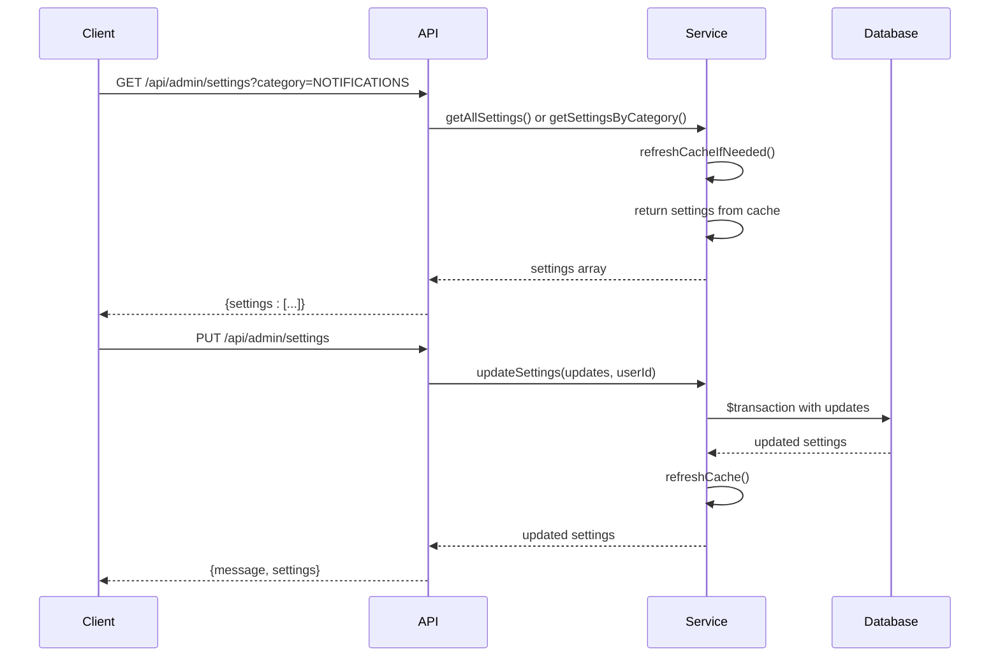
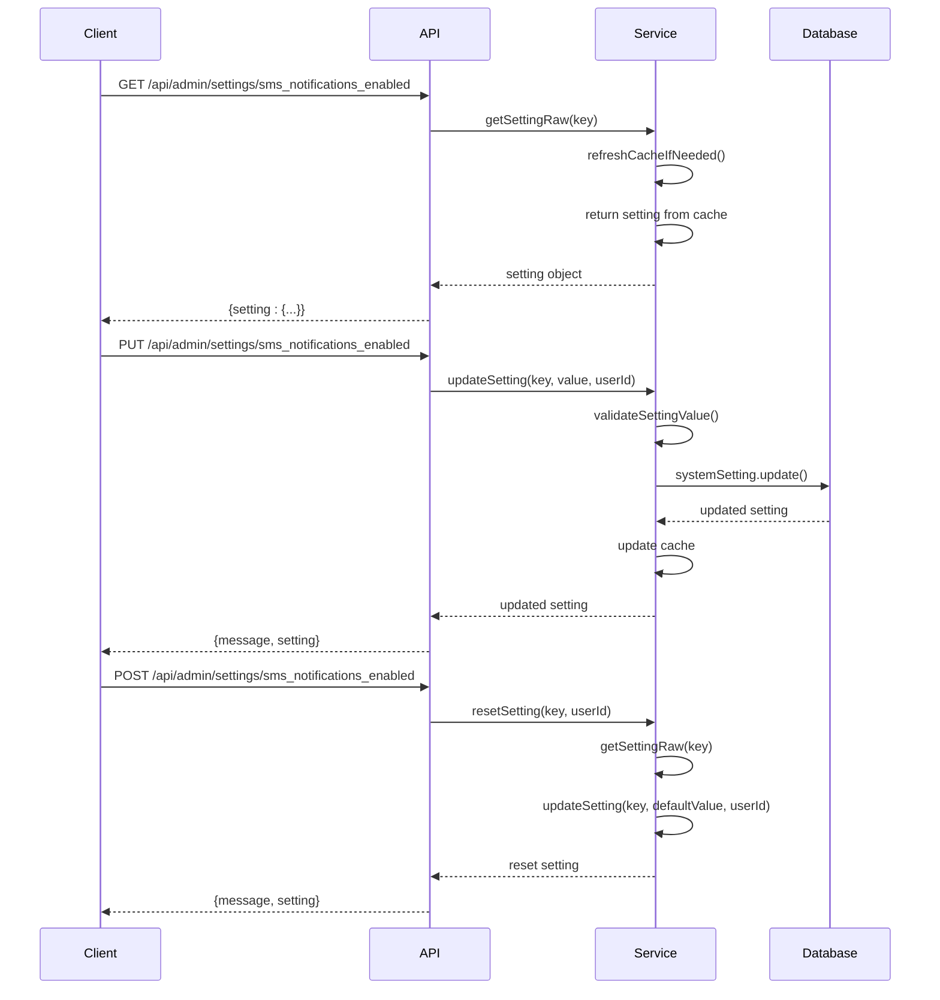
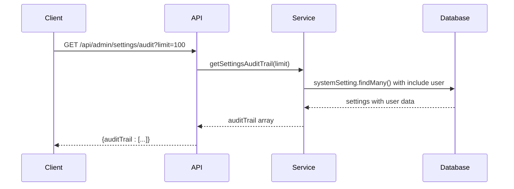
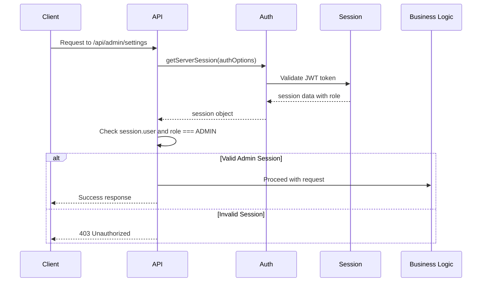
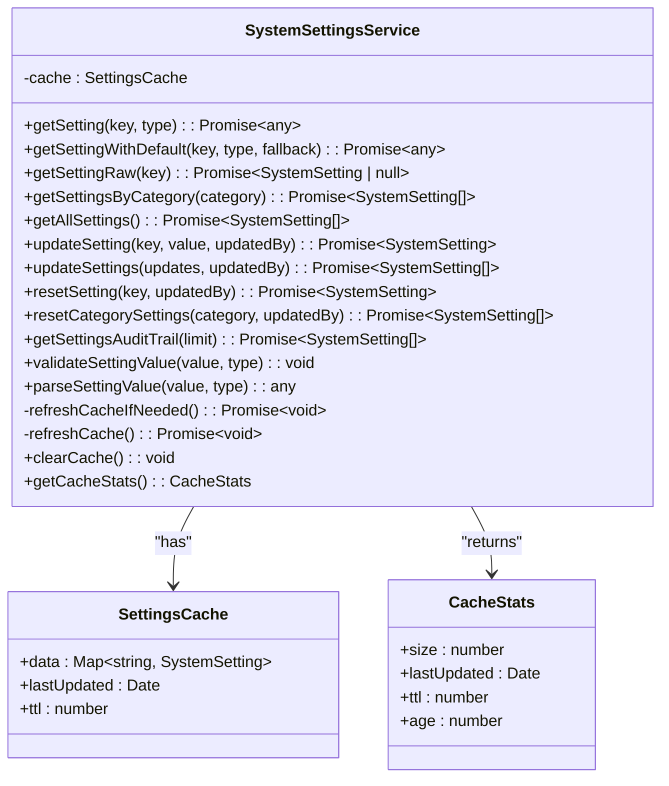

# Settings API

<cite>
**Referenced Files in This Document**   
- [route.ts](file://src/app/api/admin/settings/route.ts)
- [route.ts](file://src/app/api/admin/settings/[key]/route.ts)
- [route.ts](file://src/app/api/admin/settings/audit/route.ts)
- [SystemSettingsService.ts](file://src/services/SystemSettingsService.ts)
- [auth.ts](file://src/lib/auth.ts)
- [schema.prisma](file://prisma/schema.prisma)
- [page.tsx](file://src/app/admin/settings/page.tsx)
- [SettingsCard.tsx](file://src/components/admin/SettingsCard.tsx)
- [system-settings.ts](file://prisma/seeds/system-settings.ts)
</cite>

## Table of Contents
1. [Introduction](#introduction)
2. [API Endpoints Overview](#api-endpoints-overview)
3. [Authentication and Authorization](#authentication-and-authorization)
4. [Request and Response Schemas](#request-and-response-schemas)
5. [SystemSettingsService Implementation](#systemsettingsservice-implementation)
6. [Database Schema](#database-schema)
7. [Frontend Integration](#frontend-integration)
8. [Usage Examples](#usage-examples)
9. [Error Handling](#error-handling)
10. [Audit Logging and Compliance](#audit-logging-and-compliance)

## Introduction
The Settings API in the fund-track application provides a comprehensive interface for managing system-wide configuration settings. This RESTful API enables administrators to retrieve, update, and audit system settings that control various aspects of the application's behavior, including notifications, connectivity, and other operational parameters. The API is designed with security, type validation, and auditability as core principles, ensuring that configuration changes are properly authorized, validated, and tracked.

The system supports both individual setting management and bulk operations, with a caching layer to optimize performance. All settings are typed, with validation enforced at the service layer to prevent invalid configurations. The audit trail functionality provides complete visibility into configuration changes, supporting compliance requirements and change tracking.

**Section sources**
- [route.ts](file://src/app/api/admin/settings/route.ts)
- [SystemSettingsService.ts](file://src/services/SystemSettingsService.ts)

## API Endpoints Overview
The Settings API consists of three main endpoint groups that provide comprehensive management capabilities for system settings.

### GET/PUT /api/admin/settings
This endpoint handles retrieval and bulk update of system settings. The GET method returns all system settings or filters them by category when a category parameter is provided. The PUT method enables bulk updates of multiple settings in a single transaction, ensuring data consistency.



**Diagram sources**
- [route.ts](file://src/app/api/admin/settings/route.ts#L1-L106)
- [SystemSettingsService.ts](file://src/services/SystemSettingsService.ts#L107-L158)

### GET/PUT/DELETE /api/admin/settings/[key]
This endpoint manages individual settings by key. The GET method retrieves a specific setting, the PUT method updates its value, and the POST method with action=reset resets it to its default value. Note that DELETE is not implemented as settings are not removed but can be reset to defaults.



**Diagram sources**
- [route.ts](file://src/app/api/admin/settings/[key]/route.ts#L1-L129)
- [SystemSettingsService.ts](file://src/services/SystemSettingsService.ts#L49-L105)

### GET /api/admin/settings/audit
This endpoint retrieves the audit trail of settings changes, returning the most recently updated settings with information about who made the changes. The response includes user information for each changed setting, enabling full accountability.



**Diagram sources**
- [route.ts](file://src/app/api/admin/settings/audit/route.ts#L1-L32)
- [SystemSettingsService.ts](file://src/services/SystemSettingsService.ts#L204-L239)

## Authentication and Authorization
The Settings API enforces strict authentication and authorization requirements using NextAuth.js. All endpoints require an authenticated session with admin privileges, ensuring that only authorized personnel can view or modify system settings.



The authentication flow integrates with the application's Prisma adapter and credential-based login system. The authOptions configuration defines the credential provider that validates user credentials against the database using bcrypt hashing. Upon successful authentication, the JWT token includes the user's role, which is then used for authorization decisions in the API routes.

**Section sources**
- [auth.ts](file://src/lib/auth.ts#L1-L70)
- [route.ts](file://src/app/api/admin/settings/route.ts#L1-L106)

## Request and Response Schemas
The Settings API uses well-defined request and response schemas to ensure consistency and proper data validation.

### GET /api/admin/settings Response
```json
{
  "settings": [
    {
      "id": 1,
      "key": "sms_notifications_enabled",
      "value": "true",
      "type": "BOOLEAN",
      "category": "NOTIFICATIONS",
      "description": "Enable or disable SMS notifications globally",
      "defaultValue": "true",
      "updatedBy": 1,
      "updatedAt": "2025-08-15T10:30:00Z",
      "createdAt": "2025-08-10T08:00:00Z"
    }
  ]
}
```

### PUT /api/admin/settings Request
```json
{
  "updates": [
    {
      "key": "sms_notifications_enabled",
      "value": "false"
    },
    {
      "key": "notification_retry_attempts",
      "value": "5"
    }
  ]
}
```

### PUT /api/admin/settings/[key] Request
```json
{
  "value": "false"
}
```

### GET /api/admin/settings/audit Response
```json
{
  "auditTrail": [
    {
      "id": 1,
      "key": "sms_notifications_enabled",
      "value": "true",
      "type": "BOOLEAN",
      "category": "NOTIFICATIONS",
      "description": "Enable or disable SMS notifications globally",
      "defaultValue": "true",
      "updatedBy": 1,
      "updatedAt": "2025-08-15T10:30:00Z",
      "createdAt": "2025-08-10T08:00:00Z",
      "user": {
        "id": 1,
        "email": "admin@fund-track.com"
      }
    }
  ]
}
```

**Section sources**
- [route.ts](file://src/app/api/admin/settings/route.ts)
- [route.ts](file://src/app/api/admin/settings/[key]/route.ts)
- [route.ts](file://src/app/api/admin/settings/audit/route.ts)

## SystemSettingsService Implementation
The SystemSettingsService class provides the business logic layer for settings management, implementing caching, validation, and transactional updates.



**Diagram sources**
- [SystemSettingsService.ts](file://src/services/SystemSettingsService.ts#L1-L351)

The service implements a 5-minute TTL cache to reduce database load while ensuring reasonably fresh data. The cache is automatically refreshed when expired or after bulk updates. Type validation ensures that values conform to their defined types (BOOLEAN, STRING, NUMBER, JSON), preventing invalid configurations. The service also validates that the updating user exists, setting updatedBy to null if the user is not found rather than failing the operation.

**Section sources**
- [SystemSettingsService.ts](file://src/services/SystemSettingsService.ts#L1-L351)

## Database Schema
The SystemSetting model in the Prisma schema defines the structure of settings in the database, including support for type-safe values and audit tracking.

```mermaid
erDiagram
SYSTEM_SETTING {
Int id PK
String key UK
String value
SystemSettingType type
SystemSettingCategory category
String description
String default_value
Int? updated_by FK
DateTime created_at
DateTime updated_at
}
USER {
Int id PK
String email UK
UserRole role
String passwordHash
DateTime created_at
DateTime updated_at
}
SYSTEM_SETTING ||--o{ USER : "updated_by"
```

The schema includes essential fields for configuration management:
- **key**: Unique identifier for the setting
- **value**: Current value stored as string (serialized for non-string types)
- **type**: Enum indicating BOOLEAN, STRING, NUMBER, or JSON type
- **category**: Enum for grouping settings (NOTIFICATIONS, CONNECTIVITY)
- **defaultValue**: Default value for reset operations
- **updatedBy**: Foreign key to user who last modified the setting
- **timestamps**: createdAt and updatedAt for audit purposes

The schema also defines enums for SystemSettingType and SystemSettingCategory, ensuring data integrity and providing a clear structure for settings organization.

**Section sources**
- [schema.prisma](file://prisma/schema.prisma#L175-L257)

## Frontend Integration
The Settings API is integrated into the admin interface through the AdminSettingsPage component, which provides a user-friendly interface for managing settings.

```mermaid
flowchart TD
A[AdminSettingsPage] --> B[fetchSettings]
B --> C{API Call to /api/admin/settings}
C --> D[Update State with Settings]
D --> E[Render SettingsCard]
E --> F[User Edits Setting]
F --> G[handleSettingUpdate]
G --> H{API Call to /api/admin/settings/[key]}
H --> I[Refresh Settings]
I --> D
F --> J[User Resets Setting]
J --> K[handleSettingReset]
K --> L{API Call to /api/admin/settings/[key] POST}
L --> I
A --> M[Show Audit Log]
M --> N[SettingsAuditLog Component]
N --> O{API Call to /api/admin/settings/audit}
O --> P[Display Audit Trail]
```

The frontend uses a tabbed interface to organize settings by category, with real-time feedback during updates. The SettingsCard component handles individual setting inputs, showing loading states and error messages. The ConnectivityCheck component provides specialized UI for connectivity settings, while the SettingsAuditLog component displays the change history.

**Section sources**
- [page.tsx](file://src/app/admin/settings/page.tsx#L1-L264)
- [SettingsCard.tsx](file://src/components/admin/SettingsCard.tsx#L1-L43)

## Usage Examples
The following examples demonstrate common operations with the Settings API.

### Retrieve All Settings
```bash
curl -X GET "http://localhost:3000/api/admin/settings" \
  -H "Authorization: Bearer <admin-jwt-token>" \
  -H "Content-Type: application/json"
```

### Retrieve Settings by Category
```bash
curl -X GET "http://localhost:3000/api/admin/settings?category=NOTIFICATIONS" \
  -H "Authorization: Bearer <admin-jwt-token>" \
  -H "Content-Type: application/json"
```

### Update Multiple Settings
```bash
curl -X PUT "http://localhost:3000/api/admin/settings" \
  -H "Authorization: Bearer <admin-jwt-token>" \
  -H "Content-Type: application/json" \
  -d '{
    "updates": [
      {
        "key": "sms_notifications_enabled",
        "value": "false"
      },
      {
        "key": "notification_retry_attempts",
        "value": "5"
      }
    ]
  }'
```

### Update Individual Setting
```bash
curl -X PUT "http://localhost:3000/api/admin/settings/sms_notifications_enabled" \
  -H "Authorization: Bearer <admin-jwt-token>" \
  -H "Content-Type: application/json" \
  -d '{
    "value": "true"
  }'
```

### Reset Setting to Default
```bash
curl -X POST "http://localhost:3000/api/admin/settings/sms_notifications_enabled" \
  -H "Authorization: Bearer <admin-jwt-token>" \
  -H "Content-Type: application/json" \
  -d '{
    "action": "reset"
  }'
```

### Retrieve Audit Trail
```bash
curl -X GET "http://localhost:3000/api/admin/settings/audit?limit=100" \
  -H "Authorization: Bearer <admin-jwt-token>" \
  -H "Content-Type: application/json"
```

**Section sources**
- [route.ts](file://src/app/api/admin/settings/route.ts)
- [route.ts](file://src/app/api/admin/settings/[key]/route.ts)
- [route.ts](file://src/app/api/admin/settings/audit/route.ts)

## Error Handling
The Settings API implements comprehensive error handling to provide meaningful feedback for various failure scenarios.

```mermaid
flowchart TD
A[API Request] --> B{Authentication Check}
B --> |Failed| C[Return 403 Unauthorized]
B --> |Success| D{Validate Request}
D --> |Invalid| E[Return 400 Bad Request]
D --> |Valid| F[Execute Business Logic]
F --> G{Error Occurred?}
G --> |Yes| H[Log Error]
H --> I[Return 500 Internal Server Error]
G --> |No| J[Return Success Response]
K[updateSetting] --> L{Setting Exists?}
L --> |No| M[Throw "Setting not found"]
L --> |Yes| N{Valid Value?}
N --> |No| O[Throw "Invalid value for type"]
N --> |Yes| P[Update Database]
```

Error responses follow a consistent format with descriptive messages:
- **403 Unauthorized**: When the user lacks admin privileges
- **400 Bad Request**: When request data is malformed or missing required fields
- **404 Not Found**: When attempting to access a non-existent setting
- **500 Internal Server Error**: When an unexpected error occurs during processing

The service layer throws specific error messages that are caught by the API routes and returned to the client, while also being logged for debugging purposes.

**Section sources**
- [route.ts](file://src/app/api/admin/settings/route.ts)
- [route.ts](file://src/app/api/admin/settings/[key]/route.ts)
- [SystemSettingsService.ts](file://src/services/SystemSettingsService.ts)

## Audit Logging and Compliance
The Settings API provides robust audit logging capabilities to support compliance requirements and change tracking. Every setting update records the user responsible and the timestamp of the change, creating a complete audit trail.

The audit functionality serves multiple purposes:
- **Compliance**: Provides evidence of configuration changes for regulatory requirements
- **Troubleshooting**: Helps identify when and by whom configuration changes were made
- **Accountability**: Tracks user actions for security and governance
- **Recovery**: Enables identification of previous configurations for rollback

The getSettingsAuditTrail method returns settings ordered by updatedAt in descending order, showing the most recent changes first. Each entry includes the associated user's email, allowing administrators to identify who made each change. The audit log is accessible through the SettingsAuditLog component in the admin interface, providing a user-friendly view of configuration history.

The system also includes seed data for initial settings configuration, ensuring consistent default values across environments. The seedSystemSettings function upserts predefined settings, making it suitable for both development and production environments.

**Section sources**
- [route.ts](file://src/app/api/admin/settings/audit/route.ts)
- [SystemSettingsService.ts](file://src/services/SystemSettingsService.ts#L204-L239)
- [system-settings.ts](file://prisma/seeds/system-settings.ts#L1-L73)