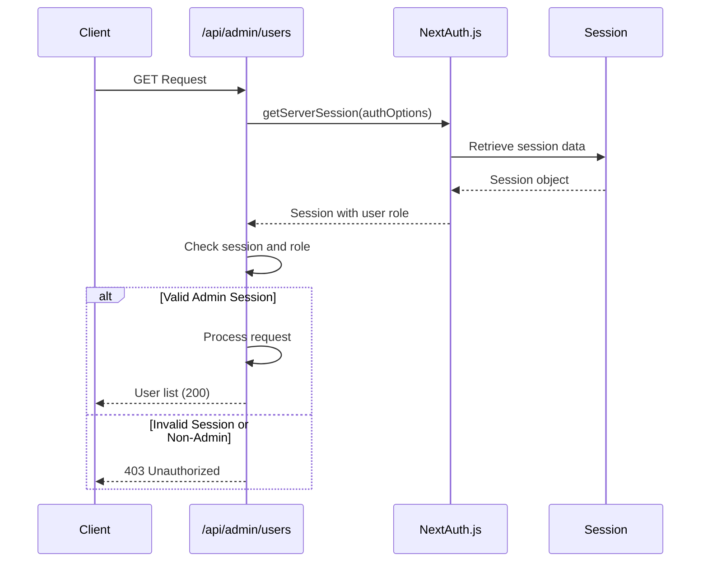
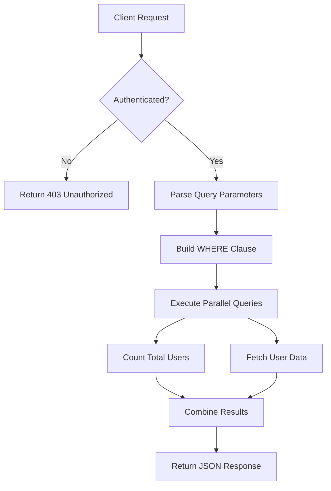
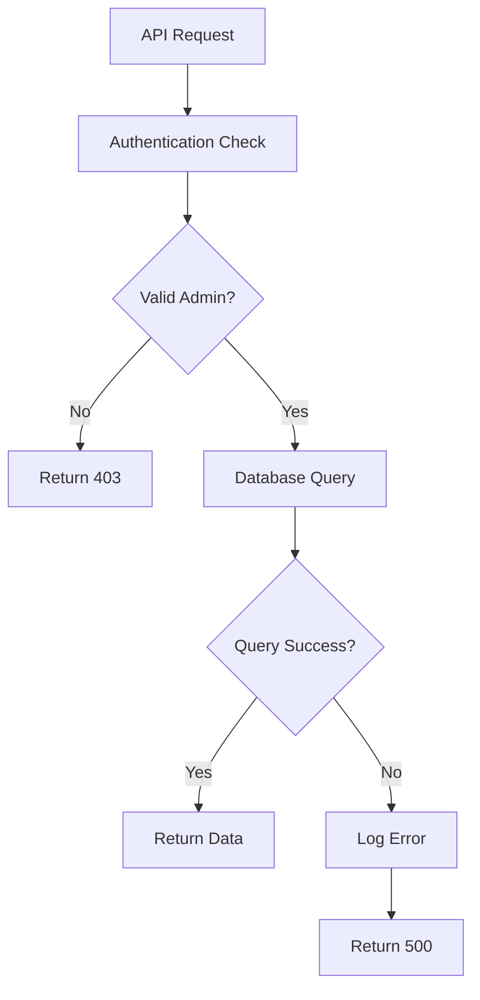
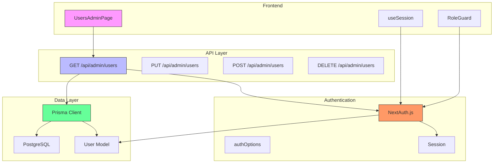

# Users API

<cite>
**Referenced Files in This Document**   
- [route.ts](file://src/app/api/admin/users/route.ts)
- [auth.ts](file://src/lib/auth.ts)
- [RoleGuard.tsx](file://src/components/auth/RoleGuard.tsx)
- [schema.prisma](file://prisma/schema.prisma)
- [prisma.ts](file://src/lib/prisma.ts)
- [next-auth.d.ts](file://src/types/next-auth.d.ts)
- [password.ts](file://src/lib/password.ts)
- [page.tsx](file://src/app/admin/users/page.tsx)
</cite>

## Table of Contents
1. [Introduction](#introduction)
2. [Authentication and Authorization](#authentication-and-authorization)
3. [GET /api/admin/users Endpoint](#get-apiv1adminusers-endpoint)
4. [Response Schema](#response-schema)
5. [Query Parameters](#query-parameters)
6. [Example Usage](#example-usage)
7. [Integration with NextAuth.js](#integration-with-nextauthjs)
8. [Use Cases](#use-cases)
9. [Privacy Considerations](#privacy-considerations)
10. [Error Handling](#error-handling)
11. [Frontend Integration](#frontend-integration)
12. [Architecture Overview](#architecture-overview)

## Introduction
The Users API provides administrative functionality for managing user accounts within the fund-track application. This documentation focuses on the `GET /api/admin/users` endpoint, which retrieves a paginated list of all user accounts with role-based access information. The endpoint enforces strict admin-level authentication and provides essential user data for administrative operations such as auditing, access management, and security reviews.

**Section sources**
- [route.ts](file://src/app/api/admin/users/route.ts#L1-L227)

## Authentication and Authorization
The user management endpoint implements role-based access control using NextAuth.js for authentication. Only users with the ADMIN role can access the endpoint. The authorization process follows these steps:

1. Extract the session from the request using `getServerSession(authOptions)`
2. Validate that a session exists and contains user information
3. Verify that the user's role is ADMIN
4. Return a 403 Unauthorized response if any check fails

The system defines two user roles in the `UserRole` enum:
- **ADMIN**: Full administrative privileges
- **USER**: Standard application user with limited access



**Diagram sources**
- [route.ts](file://src/app/api/admin/users/route.ts#L6-L15)
- [auth.ts](file://src/lib/auth.ts#L1-L70)

**Section sources**
- [route.ts](file://src/app/api/admin/users/route.ts#L6-L15)
- [auth.ts](file://src/lib/auth.ts#L1-L70)
- [next-auth.d.ts](file://src/types/next-auth.d.ts#L1-L23)

## GET /api/admin/users Endpoint
The GET method of the `/api/admin/users` endpoint retrieves a paginated list of all user accounts in the system. This endpoint is specifically designed for administrative use and provides essential user information while maintaining security and performance.

### Endpoint Details
- **Method**: GET
- **Path**: `/api/admin/users`
- **Authentication**: Required (Admin role)
- **Response Format**: JSON
- **Pagination**: Supported with default values

### Implementation Logic
The endpoint implementation follows these steps:
1. Authenticate and authorize the requesting user
2. Parse pagination parameters (page, limit) from query string
3. Process search parameter if provided
4. Execute parallel database queries for total count and user data
5. Return paginated results with metadata



**Diagram sources**
- [route.ts](file://src/app/api/admin/users/route.ts#L6-L46)

**Section sources**
- [route.ts](file://src/app/api/admin/users/route.ts#L6-L46)

## Response Schema
The endpoint returns a JSON object containing user data and pagination metadata.

### Response Structure
```json
{
  "users": [
    {
      "id": 1,
      "email": "admin@fund-track.com",
      "role": "ADMIN",
      "createdAt": "2024-01-01T00:00:00.000Z",
      "updatedAt": "2024-01-02T00:00:00.000Z"
    }
  ],
  "total": 25,
  "page": 1,
  "limit": 25
}
```

### Field Descriptions
**:users** (array)
- **id**: Unique identifier for the user (integer)
- **email**: User's email address (string)
- **role**: User's role (ADMIN or USER) (string)
- **createdAt**: Timestamp when the account was created (ISO 8601 string)
- **updatedAt**: Timestamp when the account was last updated (ISO 8601 string)

**:metadata**
- **total**: Total number of users matching the criteria (integer)
- **page**: Current page number (integer)
- **limit**: Number of users per page (integer)

**Section sources**
- [route.ts](file://src/app/api/admin/users/route.ts#L35-L44)
- [schema.prisma](file://prisma/schema.prisma#L1-L258)

## Query Parameters
The endpoint supports several query parameters for filtering and pagination.

### Supported Parameters
**:page** (optional)
- **Description**: Page number for pagination
- **Default**: 1
- **Validation**: Minimum value of 1
- **Example**: `?page=2`

**:limit** (optional)
- **Description**: Number of users to return per page
- **Default**: 25
- **Validation**: Minimum 1, maximum 100
- **Example**: `?limit=50`

**:search** (optional)
- **Description**: Email search filter (case-insensitive)
- **Default**: None
- **Validation**: Partial match on email field
- **Example**: `?search=admin@`

**Section sources**
- [route.ts](file://src/app/api/admin/users/route.ts#L16-L27)

## Example Usage
### curl Command
Retrieve the first page of users (25 per page):

```bash
curl -X GET "http://localhost:3000/api/admin/users" \
  -H "Authorization: Bearer <admin-jwt-token>"
```

Retrieve the second page with 50 users per page:

```bash
curl -X GET "http://localhost:3000/api/admin/users?page=2&limit=50" \
  -H "Authorization: Bearer <admin-jwt-token>"
```

Search for users with "admin" in their email:

```bash
curl -X GET "http://localhost:3000/api/admin/users?search=admin" \
  -H "Authorization: Bearer <admin-jwt-token>"
```

**Section sources**
- [route.ts](file://src/app/api/admin/users/route.ts#L16-L27)
- [page.tsx](file://src/app/admin/users/page.tsx#L30-L81)

## Integration with NextAuth.js
The endpoint integrates with NextAuth.js for authentication and session management. The integration follows a multi-layered approach:

### Authentication Flow
1. **Session Retrieval**: The endpoint uses `getServerSession(authOptions)` to extract session data from the request
2. **Role Verification**: The session's user role is checked against the ADMIN role requirement
3. **Token Handling**: NextAuth.js manages JWT tokens with role information in the token payload

### Configuration Details
The `authOptions` configuration in `auth.ts` defines:
- **Credentials Provider**: Email/password authentication
- **Session Strategy**: JWT-based sessions
- **Callbacks**: Custom JWT and session callbacks to include role information
- **Adapter**: Prisma adapter for database persistence

```mermaid
classDiagram
class NextAuthOptions {
+adapter : PrismaAdapter
+providers : CredentialsProvider[]
+session : {strategy : "jwt"}
+callbacks : {jwt(), session()}
+pages : {signIn : "/auth/signin"}
}
class CredentialsProvider {
+name : "credentials"
+credentials : {email, password}
+authorize(credentials) : User | null
}
class User {
+id : string
+email : string
+role : UserRole
}
class JWT {
+id : string
+role : UserRole
}
class Session {
+user : {id, email, role}
}
NextAuthOptions --> CredentialsProvider : "uses"
CredentialsProvider --> User : "returns"
NextAuthOptions --> JWT : "callback"
NextAuthOptions --> Session : "callback"
```

**Diagram sources**
- [auth.ts](file://src/lib/auth.ts#L1-L70)
- [next-auth.d.ts](file://src/types/next-auth.d.ts#L1-L23)

**Section sources**
- [auth.ts](file://src/lib/auth.ts#L1-L70)
- [next-auth.d.ts](file://src/types/next-auth.d.ts#L1-L23)

## Use Cases
### User Auditing
Administrators can periodically review all user accounts to ensure compliance with organizational policies. The paginated response allows for efficient processing of large user bases.

### Access Management
The endpoint enables administrators to monitor user roles and identify accounts that may need privilege adjustments based on changing responsibilities.

### Security Reviews
During security audits, administrators can verify that only authorized personnel have access to the system and identify any suspicious accounts.

### Account Recovery
When users report access issues, administrators can verify account status and last update times to assist with recovery processes.

**Section sources**
- [route.ts](file://src/app/api/admin/users/route.ts#L6-L46)
- [page.tsx](file://src/app/admin/users/page.tsx#L0-L34)

## Privacy Considerations
The endpoint implements several privacy-preserving measures:

### Data Minimization
The response includes only essential user information:
- Excludes sensitive data like password hashes
- Limits personal information to email and role
- Omits potentially identifying metadata

### Access Control
Strict role-based access ensures that only authorized administrators can view user lists:
- 403 responses for non-admin users
- Session validation on every request
- No public access to user enumeration

### Search Security
The search functionality is limited to email addresses with case-insensitive partial matching, preventing information leakage through enumeration attacks.

**Section sources**
- [route.ts](file://src/app/api/admin/users/route.ts#L35-L44)
- [schema.prisma](file://prisma/schema.prisma#L1-L258)

## Error Handling
The endpoint implements comprehensive error handling for various scenarios.

### Error Responses
**:403 Unauthorized**
- **Cause**: Missing session or non-admin user
- **Response**: `{ "error": "Unauthorized - Admin access required" }`

**:500 Internal Server Error**
- **Cause**: Database connection issues or unexpected errors
- **Response**: `{ "error": "Error message" }`

### Error Management
The implementation uses try-catch blocks to handle exceptions and provides meaningful error messages while avoiding sensitive information disclosure. All errors are logged server-side for debugging purposes.



**Diagram sources**
- [route.ts](file://src/app/api/admin/users/route.ts#L10-L15)
- [route.ts](file://src/app/api/admin/users/route.ts#L47-L55)

**Section sources**
- [route.ts](file://src/app/api/admin/users/route.ts#L10-L15)
- [route.ts](file://src/app/api/admin/users/route.ts#L47-L55)

## Frontend Integration
The Users API is integrated with the admin frontend through the UsersAdminPage component.

### Component Flow
1. **RoleGuard**: The `AdminOnly` component wraps the page to enforce frontend access control
2. **Data Fetching**: The `fetchUsers` function calls the API endpoint with pagination parameters
3. **State Management**: React state hooks manage users, pagination, and loading states
4. **User Interface**: Data is displayed in a table with search and pagination controls

### Key Integration Points
- **Authentication**: Uses `useSession()` to verify user role
- **API Calls**: Direct fetch requests to `/api/admin/users`
- **Error Handling**: Catches and displays API errors to users
- **Form Submissions**: Uses the same endpoint for create, update, and delete operations

**Section sources**
- [page.tsx](file://src/app/admin/users/page.tsx#L0-L34)
- [page.tsx](file://src/app/admin/users/page.tsx#L30-L81)

## Architecture Overview
The user management system follows a layered architecture with clear separation of concerns.



**Diagram sources**
- [route.ts](file://src/app/api/admin/users/route.ts#L1-L227)
- [auth.ts](file://src/lib/auth.ts#L1-L70)
- [prisma.ts](file://src/lib/prisma.ts#L1-L61)
- [schema.prisma](file://prisma/schema.prisma#L1-L258)

**Section sources**
- [route.ts](file://src/app/api/admin/users/route.ts#L1-L227)
- [auth.ts](file://src/lib/auth.ts#L1-L70)
- [prisma.ts](file://src/lib/prisma.ts#L1-L61)
- [schema.prisma](file://prisma/schema.prisma#L1-L258)