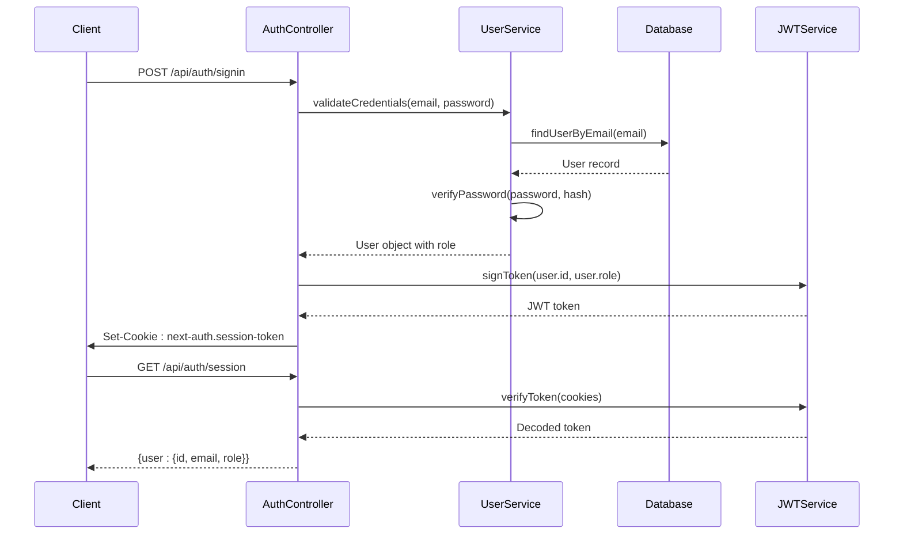
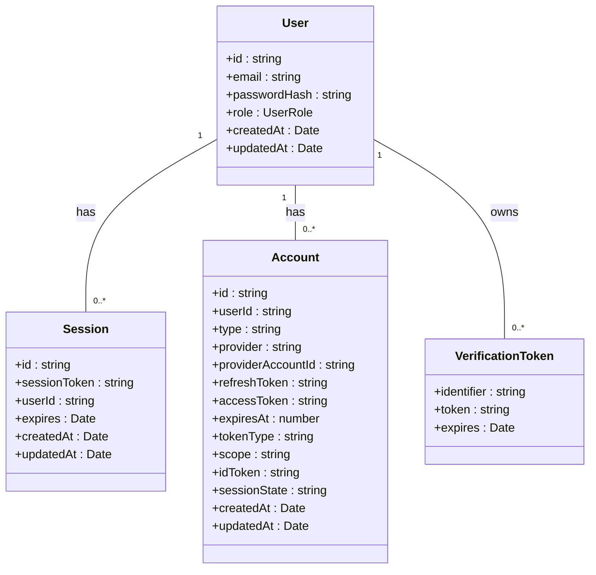
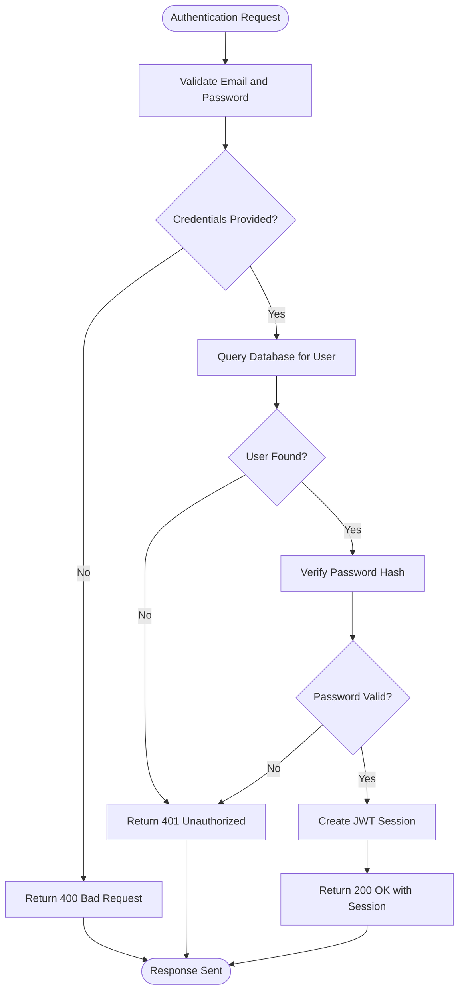
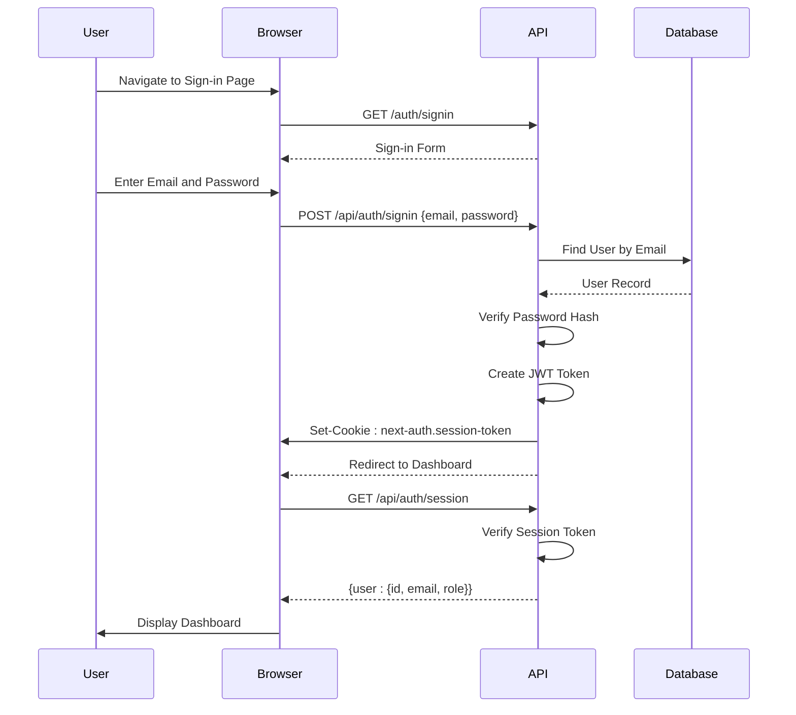
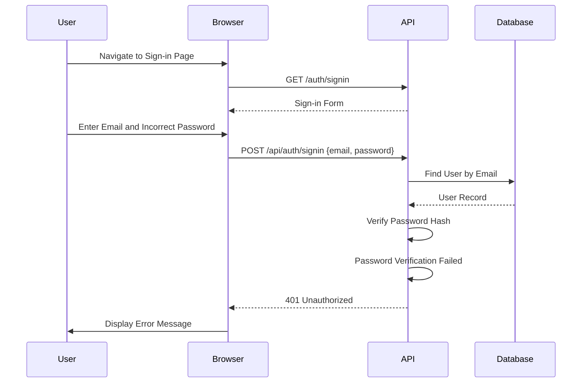

# Authentication API Endpoints

<cite>
**Referenced Files in This Document**   
- [route.ts](file://src/app/api/auth/[...nextauth]/route.ts)
- [auth.ts](file://src/lib/auth.ts)
- [session/route.ts](file://src/app/api/auth/session/route.ts)
- [signin/route.ts](file://src/app/api/auth/signin/route.ts)
- [RoleGuard.tsx](file://src/components/auth/RoleGuard.tsx)
- [SessionProvider.tsx](file://src/components/auth/SessionProvider.tsx)
- [prisma.ts](file://src/lib/prisma.ts)
- [next-auth.d.ts](file://src/types/next-auth.d.ts)
- [middleware.ts](file://src/middleware.ts)
- [next.config.mjs](file://next.config.mjs)
</cite>

## Table of Contents
1. [Introduction](#introduction)
2. [Authentication System Overview](#authentication-system-overview)
3. [Core Authentication Endpoints](#core-authentication-endpoints)
4. [JWT Token and Session Management](#jwt-token-and-session-management)
5. [Database Integration and Session Persistence](#database-integration-and-session-persistence)
6. [Security Configuration](#security-configuration)
7. [Role-Based Access Control](#role-based-access-control)
8. [Error Handling and Edge Cases](#error-handling-and-edge-cases)
9. [Authentication Flow Examples](#authentication-flow-examples)

## Introduction
This document provides comprehensive documentation for the authentication system in the fund-track application, which is built using NextAuth.js. The system supports both OAuth providers and credential-based sign-in, with robust security measures including secure cookie handling, CSRF protection, and role-based access control. This documentation details the API endpoints, request/response formats, integration with the Prisma database adapter, and security configurations that ensure a secure and reliable authentication experience.

## Authentication System Overview
The authentication system in fund-track is implemented using NextAuth.js, a complete authentication solution for Next.js applications. It handles both OAuth providers and credential-based sign-in through a catch-all route. The system is designed with security as a primary concern, implementing secure cookie practices, CSRF protection, and role-based access control. The authentication flow is integrated with the application's middleware to protect routes and ensure that only authenticated users can access protected resources.

```mermaid
graph TB
Client[Client Application] --> |POST /api/auth/signin| SigninEndpoint[/api/auth/signin]
SigninEndpoint --> |Credentials| NextAuth[NextAuth.js Handler]
NextAuth --> |Database Query| Prisma[Prisma Client]
Prisma --> |User Data| Database[(PostgreSQL)]
NextAuth --> |JWT Token| Client
Client --> |GET /api/auth/session| SessionEndpoint[/api/auth/session]
SessionEndpoint --> |Validates Session| NextAuth
NextAuth --> |Session Data| Client
Client --> |Protected Route| Middleware[Authentication Middleware]
Middleware --> |Validates Token| NextAuth
NextAuth --> |Authorization Decision| Client
style Client fill:#f9f,stroke:#333
style SigninEndpoint fill:#bbf,stroke:#333
style SessionEndpoint fill:#bbf,stroke:#333
style NextAuth fill:#f96,stroke:#333
style Prisma fill:#69f,stroke:#333
style Database fill:#6f9,stroke:#333
style Middleware fill:#9f6,stroke:#333
```

**Diagram sources**
- [route.ts](file://src/app/api/auth/[...nextauth]/route.ts)
- [signin/route.ts](file://src/app/api/auth/signin/route.ts)
- [session/route.ts](file://src/app/api/auth/session/route.ts)
- [middleware.ts](file://src/middleware.ts)

**Section sources**
- [route.ts](file://src/app/api/auth/[...nextauth]/route.ts)
- [auth.ts](file://src/lib/auth.ts)

## Core Authentication Endpoints

### [...nextauth] Route Implementation
The catch-all route at `/api/auth/[...nextauth]/route.ts` serves as the central handler for all NextAuth.js operations. It imports the authentication options from the `auth.ts` file and creates a NextAuth handler that processes all authentication requests.

```typescript
import NextAuth from "next-auth"
import { authOptions } from "@/lib/auth"

const handler = NextAuth(authOptions)

export { handler as GET, handler as POST }
```

This implementation exports the handler for both GET and POST methods, allowing NextAuth.js to handle various authentication flows including sign-in, callback, session management, and sign-out.

**Section sources**
- [route.ts](file://src/app/api/auth/[...nextauth]/route.ts)

### Signin Endpoint
The signin endpoint at `/api/auth/signin/route.ts` provides an API interface for credential-based authentication. While the actual authentication is handled by NextAuth.js, this endpoint ensures API consistency and provides structured error responses.

```typescript
import { NextRequest, NextResponse } from "next/server"
import { signIn } from "next-auth/react"

export async function POST(request: NextRequest) {
  try {
    const { email, password } = await request.json()

    if (!email || !password) {
      return NextResponse.json(
        { error: "Email and password are required" },
        { status: 400 }
      )
    }

    // The actual authentication is handled by NextAuth.js
    // This endpoint is mainly for API consistency
    return NextResponse.json(
      { message: "Use NextAuth signin endpoint" },
      { status: 200 }
    )
  } catch (error) {
    return NextResponse.json(
      { error: "Internal server error" },
      { status: 500 }
    )
  }
}
```

The endpoint validates that both email and password are provided in the request body and returns appropriate error responses for missing credentials or server errors.

**Section sources**
- [signin/route.ts](file://src/app/api/auth/signin/route.ts)

### Session Endpoint
The session endpoint at `/api/auth/session/route.ts` allows clients to retrieve the current user's session data. It uses the `getServerSession` function from NextAuth.js to obtain session information and returns it in a structured JSON format.

```typescript
import { NextRequest, NextResponse } from "next/server"
import { getServerSession } from "next-auth/next"
import { authOptions } from "@/lib/auth"

// Force dynamic rendering for this route
export const dynamic = 'force-dynamic';

export async function GET(request: NextRequest) {
  try {
    const session = await getServerSession(authOptions)

    if (!session) {
      return NextResponse.json(
        { error: "Not authenticated" },
        { status: 401 }
      )
    }

    return NextResponse.json({
      user: {
        id: session.user.id,
        email: session.user.email,
        role: session.user.role,
      }
    })
  } catch (error) {
    return NextResponse.json(
      { error: "Internal server error" },
      { status: 500 }
    )
  }
}
```

The endpoint is configured with `dynamic = 'force-dynamic'` to ensure it is not statically rendered, guaranteeing that session data is always current. It returns a 401 status if no session exists, indicating that the user is not authenticated.

**Section sources**
- [session/route.ts](file://src/app/api/auth/session/route.ts)

## JWT Token and Session Management

### Authentication Configuration
The core authentication configuration is defined in `/src/lib/auth.ts`, which exports the `authOptions` object used by NextAuth.js. This configuration specifies the use of JWT for session strategy and includes custom callbacks to include user role information in the token and session.

```typescript
import { NextAuthOptions } from "next-auth"
import CredentialsProvider from "next-auth/providers/credentials"
import { PrismaAdapter } from "@next-auth/prisma-adapter"
import { prisma } from "@/lib/prisma"
import bcrypt from "bcrypt"
import { UserRole } from "@prisma/client"

export const authOptions: NextAuthOptions = {
  adapter: PrismaAdapter(prisma),
  providers: [
    CredentialsProvider({
      name: "credentials",
      credentials: {
        email: { label: "Email", type: "email" },
        password: { label: "Password", type: "password" }
      },
      async authorize(credentials) {
        if (!credentials?.email || !credentials?.password) {
          return null
        }

        const user = await prisma.user.findUnique({
          where: {
            email: credentials.email
          }
        })

        if (!user) {
          return null
        }

        const isPasswordValid = await bcrypt.compare(
          credentials.password,
          user.passwordHash
        )

        if (!isPasswordValid) {
          return null
        }

        return {
          id: user.id.toString(),
          email: user.email,
          role: user.role,
        }
      }
    })
  ],
  session: {
    strategy: "jwt",
  },
  callbacks: {
    async jwt({ token, user }) {
      if (user) {
        token.id = user.id
        token.role = user.role
      }
      return token
    },
    async session({ session, token }) {
      if (token) {
        session.user.id = token.id as string
        session.user.role = token.role as UserRole
      }
      return session
    },
  },
  pages: {
    signIn: "/auth/signin",
  },
}
```

The configuration uses the Credentials provider for username/password authentication, with the `authorize` callback handling user validation against the database. Passwords are securely hashed using bcrypt, and the user's role is included in the authentication result.

**Section sources**
- [auth.ts](file://src/lib/auth.ts)

### JWT Token Structure
The JWT token structure is enhanced through the `jwt` and `session` callbacks in the authentication configuration. When a user successfully authenticates, the `jwt` callback adds the user's ID and role to the token. Subsequently, the `session` callback extracts this information and includes it in the session object returned to the client.

This approach ensures that role information is available throughout the application without requiring additional database queries. The token is stored in an HTTP-only cookie for security, with appropriate SameSite and Secure flags in production environments.



**Diagram sources**
- [auth.ts](file://src/lib/auth.ts)
- [session/route.ts](file://src/app/api/auth/session/route.ts)

## Database Integration and Session Persistence

### Prisma Adapter Integration
The authentication system integrates with the database using the Prisma adapter for NextAuth.js. This adapter handles all database operations related to authentication, including user creation, session management, and account linking.

The adapter is configured in the `authOptions` object with `adapter: PrismaAdapter(prisma)`, where `prisma` is the Prisma client instance imported from `@/lib/prisma`. This integration ensures that all authentication data is persisted in the PostgreSQL database and is consistent with the application's data model.



**Diagram sources**
- [auth.ts](file://src/lib/auth.ts)
- [prisma.ts](file://src/lib/prisma.ts)

### Prisma Client Configuration
The Prisma client is configured in `/src/lib/prisma.ts` with enhanced logging and error handling. The configuration includes environment-specific settings to prevent database connections during build time and ensures proper cleanup when the application shuts down.

```typescript
import { PrismaClient } from '@prisma/client';
import { logger } from './logger';

const globalForPrisma = globalThis as unknown as {
  prisma: PrismaClient | undefined;
};

// Check if we're in a build environment or if DATABASE_URL is a placeholder
const isBuildTime = process.env.SKIP_ENV_VALIDATION === 'true' ||
  process.env.DATABASE_URL?.includes('placeholder') ||
  !process.env.DATABASE_URL ||
  typeof window !== 'undefined'; // Client-side check

// Enhanced Prisma client with logging and error handling
export const prisma =
  globalForPrisma.prisma ??
  new PrismaClient({
    log: process.env.NODE_ENV === 'development' ? ['query', 'error', 'warn'] : ['error'],
    errorFormat: 'pretty',
    // Don't connect to database during build time
    datasources: isBuildTime ? undefined : {
      db: {
        url: process.env.DATABASE_URL
      }
    }
  });
```

The configuration uses a global variable to prevent creating multiple instances of the Prisma client in development, which could lead to connection leaks. It also includes a health check utility to verify database connectivity.

**Section sources**
- [prisma.ts](file://src/lib/prisma.ts)

## Security Configuration

### CORS and CSRF Protection
The authentication system leverages NextAuth.js built-in CSRF protection, which is automatically implemented through the use of anti-forgery tokens. When a sign-in request is initiated, NextAuth.js generates a CSRF token that must be included in subsequent requests to prevent cross-site request forgery attacks.

The CSRF protection is implemented at the framework level, with tokens stored in cookies and validated on each authentication request. This mechanism is transparent to the application code but provides robust protection against CSRF attacks.

Additionally, the application's security headers are configured in `next.config.mjs` to include Content Security Policy (CSP), Strict Transport Security (HSTS), and other security measures:

```javascript
async headers() {
  return [
    {
      source: "/(.*)",
      headers: [
        {
          key: "Strict-Transport-Security",
          value: "max-age=63072000; includeSubDomains; preload",
        },
        {
          key: "X-Frame-Options",
          value: "DENY",
        },
        {
          key: "X-Content-Type-Options",
          value: "nosniff",
        },
        {
          key: "Content-Security-Policy",
          value: [
            "default-src 'self'",
            "script-src 'self' 'unsafe-eval' 'unsafe-inline'",
            "style-src 'self' 'unsafe-inline'",
            "img-src 'self' data: https:",
            "connect-src 'self' https://*.backblazeb2.com",
          ].join("; "),
        },
      ],
    },
  ];
}
```

**Section sources**
- [next.config.mjs](file://next.config.mjs)
- [auth.ts](file://src/lib/auth.ts)

### Secure Cookie Practices
Secure cookie practices are implemented through both NextAuth.js configuration and application middleware. In production environments, cookies are configured with the Secure and SameSite=Strict attributes to prevent transmission over insecure connections and protect against cross-site request forgery.

The middleware function in `/src/middleware.ts` enhances cookie security by modifying the Set-Cookie header to include these attributes:

```typescript
// Secure cookies in production
if (process.env.NODE_ENV === 'production' && process.env.SECURE_COOKIES === 'true') {
  const cookies = response.headers.get('set-cookie');
  if (cookies) {
    const secureCookies = cookies.replace(/; secure/gi, '').replace(/$/g, '; Secure; SameSite=Strict');
    response.headers.set('set-cookie', secureCookies);
  }
}
```

This ensures that authentication cookies are only transmitted over HTTPS connections and are not sent in cross-site requests, significantly reducing the risk of session hijacking.

**Section sources**
- [middleware.ts](file://src/middleware.ts)

## Role-Based Access Control

### RoleGuard Component
The `RoleGuard` component in `/src/components/auth/RoleGuard.tsx` implements role-based access control for protected routes. It uses the NextAuth.js `useSession` hook to retrieve the current user's session and checks if their role is included in the allowed roles list.

```typescript
"use client";

import { useSession } from "next-auth/react";
import { UserRole } from "@prisma/client";
import { ReactNode } from "react";
import PageLoading from "@/components/PageLoading";

interface RoleGuardProps {
  children: ReactNode;
  allowedRoles: UserRole[];
  fallback?: ReactNode;
}

export function RoleGuard({
  children,
  allowedRoles,
  fallback,
}: RoleGuardProps) {
  const { data: session, status } = useSession();

  if (status === "loading") return <PageLoading />;

  if (!session || !allowedRoles.includes(session.user.role)) {
    if (fallback !== undefined) return <>{fallback}</>;

    return (
      <div className="min-h-screen bg-gray-50 p-6 flex items-center justify-center">
        <div className="max-w-xl w-full bg-white border border-gray-100 rounded-md shadow-sm p-6">
          <h2 className="text-lg font-semibold text-gray-900">Access denied</h2>
          <p className="mt-2 text-sm text-gray-600">
            You do not have permission to view this page. If you believe this is
            a mistake, contact an administrator.
          </p>
        </div>
      </div>
    );
  }

  return <>{children}</>;
}
```

The component provides a loading state while the session is being retrieved and renders a default "Access denied" UI when the user does not have the required role. It also supports custom fallback content through the `fallback` prop.

**Section sources**
- [RoleGuard.tsx](file://src/components/auth/RoleGuard.tsx)

### SessionProvider Component
The `SessionProvider` component wraps the application and provides session context to all components. It uses the NextAuth.js `SessionProvider` to manage the authentication state.

```typescript
"use client"

import { SessionProvider as NextAuthSessionProvider } from "next-auth/react"
import { ReactNode } from "react"

interface SessionProviderProps {
  children: ReactNode
}

export function SessionProvider({ children }: SessionProviderProps) {
  return (
    <NextAuthSessionProvider>
      {children}
    </NextAuthSessionProvider>
  )
}
```

This component is typically used in the application's root layout to ensure that all pages have access to the authentication context.

**Section sources**
- [SessionProvider.tsx](file://src/components/auth/SessionProvider.tsx)

### Middleware-Based Route Protection
Route protection is also implemented at the middleware level in `/src/middleware.ts`, which intercepts requests to protected routes and redirects unauthenticated users to the sign-in page.

```typescript
// Protect dashboard and API routes (except auth routes)
if (pathname.startsWith("/dashboard") || 
    (pathname.startsWith("/api") && !pathname.startsWith("/api/auth"))) {
  
  if (!token) {
    return NextResponse.redirect(new URL("/auth/signin", req.url));
  }

  // Admin-only routes (if needed in the future)
  if (pathname.startsWith("/admin") && token.role !== "ADMIN") {
    return NextResponse.redirect(new URL("/dashboard", req.url));
  }
}
```

This approach provides an additional layer of security by enforcing authentication at the request level before the request reaches the application code.

**Section sources**
- [middleware.ts](file://src/middleware.ts)

## Error Handling and Edge Cases

### Authentication Error Conditions
The authentication system handles various error conditions with appropriate HTTP status codes and error messages:

- **Invalid credentials**: When a user provides incorrect email or password, the `authorize` callback returns `null`, resulting in a 401 Unauthorized response.
- **Missing credentials**: The signin endpoint validates that both email and password are provided, returning a 400 Bad Request response if either is missing.
- **Expired sessions**: When a session token has expired, the session endpoint returns a 401 Unauthorized response, prompting the client to re-authenticate.
- **Internal server errors**: Any unexpected errors during authentication are caught and result in a 500 Internal Server Error response.



**Diagram sources**
- [auth.ts](file://src/lib/auth.ts)
- [signin/route.ts](file://src/app/api/auth/signin/route.ts)

### Session Expiration Policies
Session expiration is managed through the JWT token's expiration claim. The exact expiration time is configured in the NextAuth.js options, though the specific duration is not visible in the provided code. When a token expires, the client must re-authenticate to obtain a new session.

The session endpoint checks the validity of the session token on each request, ensuring that expired sessions are detected and handled appropriately. This approach provides a balance between security and user experience, requiring periodic re-authentication while maintaining convenience for active users.

## Authentication Flow Examples

### Successful Credential-Based Authentication Flow
The following sequence diagram illustrates a successful credential-based authentication flow:



**Diagram sources**
- [signin/route.ts](file://src/app/api/auth/signin/route.ts)
- [auth.ts](file://src/lib/auth.ts)
- [session/route.ts](file://src/app/api/auth/session/route.ts)

### Failed Authentication Due to Invalid Credentials
The following sequence diagram illustrates the flow when a user attempts to authenticate with invalid credentials:



**Diagram sources**
- [auth.ts](file://src/lib/auth.ts)
- [signin/route.ts](file://src/app/api/auth/signin/route.ts)