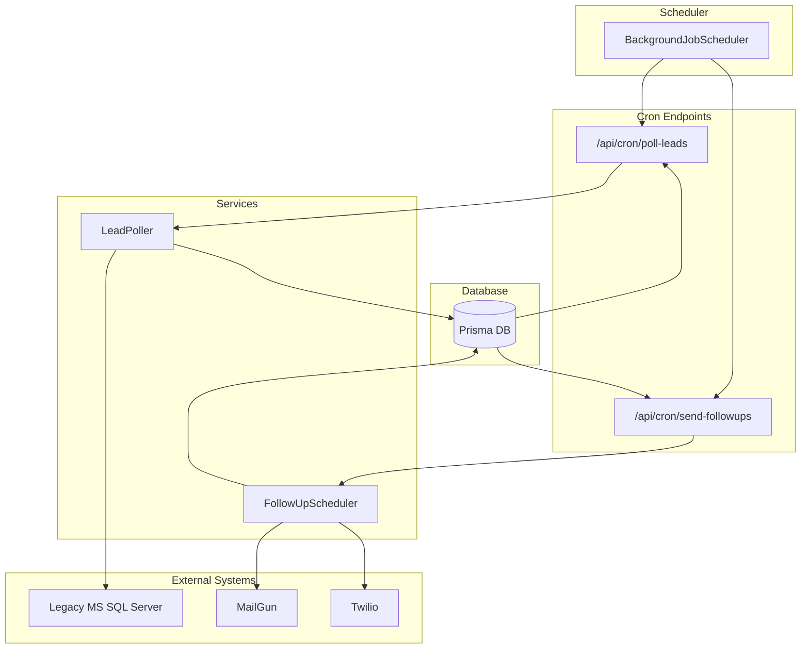
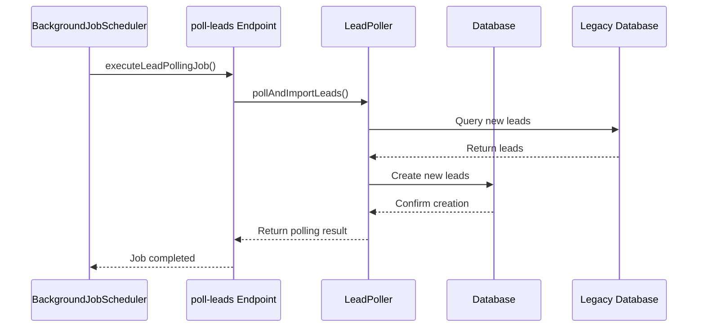

# Cron Job Endpoints

<cite>
**Referenced Files in This Document**   
- [poll-leads/route.ts](file://src/app/api/cron/poll-leads/route.ts)
- [send-followups/route.ts](file://src/app/api/cron/send-followups/route.ts)
- [BackgroundJobScheduler.ts](file://src/services/BackgroundJobScheduler.ts)
- [LeadPoller.ts](file://src/services/LeadPoller.ts)
- [FollowUpScheduler.ts](file://src/services/FollowUpScheduler.ts)
</cite>

## Table of Contents
1. [Introduction](#introduction)
2. [Architecture Overview](#architecture-overview)
3. [poll-leads Endpoint](#poll-leads-endpoint)
4. [send-followups Endpoint](#send-followups-endpoint)
5. [Background Job Scheduler Integration](#background-job-scheduler-integration)
6. [Error Handling Strategies](#error-handling-strategies)
7. [Example Payloads](#example-payloads)

## Introduction
This document provides comprehensive API documentation for the cron-triggered endpoints that power background job processing in the fund-track application. It details the **poll-leads** endpoint responsible for synchronizing new leads from a legacy MS SQL Server database, and the **send-followups** endpoint that manages scheduled follow-up notifications via Twilio and MailGun. The documentation covers invocation patterns, authentication requirements, response formats, rate limiting, idempotency, and integration with core services such as BackgroundJobScheduler, LeadPoller, and FollowUpScheduler.

## Architecture Overview



**Diagram sources**
- [BackgroundJobScheduler.ts](file://src/services/BackgroundJobScheduler.ts)
- [poll-leads/route.ts](file://src/app/api/cron/poll-leads/route.ts)
- [send-followups/route.ts](file://src/app/api/cron/send-followups/route.ts)
- [LeadPoller.ts](file://src/services/LeadPoller.ts)
- [FollowUpScheduler.ts](file://src/services/FollowUpScheduler.ts)

## poll-leads Endpoint

The **poll-leads** endpoint synchronizes new leads from the legacy MS SQL Server database into the application's primary database. It is designed to be invoked by a scheduler and handles batch processing, conflict resolution, and status tracking.

### Invocation and Authentication
- **Method**: POST
- **Path**: `/api/cron/poll-leads`
- **Authentication**: None required. This endpoint is intended for internal cron invocation only.
- **Expected Invocation**: Triggered by the BackgroundJobScheduler every 15 minutes (configurable via `LEAD_POLLING_CRON_PATTERN` environment variable).

### Processing Logic
1. **Batch Processing**: The endpoint uses the LeadPoller service to fetch new leads from the legacy database in batches. The batch size is configurable via the `LEAD_POLLING_BATCH_SIZE` environment variable (default: 100).
2. **Conflict Resolution**: The system prevents duplicates by tracking the highest legacy lead ID already imported. Only leads with IDs greater than this value are processed.
3. **Status Tracking**: Each lead is assigned a `PENDING` status upon import, and an intake token is generated to enable application completion.

### Response Format
Successful responses return a 200 status code with the following structure:

```json
{
  "success": true,
  "message": "Lead polling and notifications completed successfully",
  "pollingResult": {
    "totalProcessed": 50,
    "newLeads": 45,
    "duplicatesSkipped": 0,
    "errors": [],
    "processingTime": 2500
  },
  "notificationResults": {
    "emailsSent": 45,
    "smsSent": 30,
    "emailErrors": 0,
    "smsErrors": 0
  }
}
```

If no new leads are found, the response indicates success with a message stating no new leads were found.

### Rate Limiting and Idempotency
- **Rate Limiting**: Not implemented at the endpoint level. Rate limiting is managed by the scheduling frequency.
- **Idempotency**: The endpoint is idempotent due to its conflict resolution mechanism. Repeated invocations will not import the same lead twice.

**Section sources**
- [poll-leads/route.ts](file://src/app/api/cron/poll-leads/route.ts)
- [LeadPoller.ts](file://src/services/LeadPoller.ts)

## send-followups Endpoint

The **send-followups** endpoint processes scheduled follow-up notifications for leads that have not completed their application. It integrates with Twilio for SMS and MailGun for email notifications.

### Invocation and Authentication
- **Method**: POST
- **Path**: `/api/cron/send-followups`
- **Authentication**: None required. This endpoint is intended for internal cron invocation only.
- **Expected Invocation**: Triggered by the BackgroundJobScheduler every 5 minutes (configurable via `FOLLOWUP_CRON_PATTERN` environment variable).

### Queue Management and Retry Mechanisms
1. **Queue Processing**: The endpoint queries the follow-up queue for all pending follow-ups that are due (scheduled time ≤ current time).
2. **Retry Mechanisms**: Failed notifications are logged as errors but do not prevent processing of other follow-ups. The system does not automatically retry failed notifications within the same job execution.
3. **Status Updates**: After a follow-up is sent, its status is updated to `SENT` in the database. If a lead's status changes from `PENDING`, associated follow-ups are cancelled.

### Response Format
Successful responses return a 200 status code with the following structure:

```json
{
  "success": true,
  "message": "Follow-up processing completed",
  "data": {
    "processed": 10,
    "sent": 8,
    "cancelled": 2,
    "processingTime": "1200ms",
    "errors": []
  }
}
```

If some follow-ups fail but others succeed, a 207 (Multi-Status) response is returned. Complete failures return a 500 status code.

### Rate Limiting and Idempotency
- **Rate Limiting**: Not implemented at the endpoint level. The processing frequency and internal delays (100ms between notifications) help prevent rate limiting.
- **Idempotency**: The endpoint is idempotent. Follow-ups are marked as `SENT` after delivery, preventing re-sending.

**Section sources**
- [send-followups/route.ts](file://src/app/api/cron/send-followups/route.ts)
- [FollowUpScheduler.ts](file://src/services/FollowUpScheduler.ts)

## Background Job Scheduler Integration

The **BackgroundJobScheduler** service coordinates the execution of both cron endpoints. It uses the `node-cron` library to schedule jobs based on configurable cron patterns.

### Job Coordination
- **poll-leads**: Scheduled every 15 minutes by default.
- **send-followups**: Scheduled every 5 minutes by default.
- **Cleanup Job**: Runs daily at 2 AM to remove old notification and follow-up records.

### Service Integration
The scheduler integrates with the following services:
- **LeadPoller**: Used by the poll-leads job to fetch and import leads.
- **FollowUpScheduler**: Used by the send-followups job to process the follow-up queue.



**Diagram sources**
- [BackgroundJobScheduler.ts](file://src/services/BackgroundJobScheduler.ts)
- [poll-leads/route.ts](file://src/app/api/cron/poll-leads/route.ts)
- [LeadPoller.ts](file://src/services/LeadPoller.ts)

## Error Handling Strategies

Both endpoints implement comprehensive error handling to ensure reliability and provide meaningful logs for debugging.

### poll-leads Error Handling
- **Database Errors**: Caught and logged with context. The job continues processing other leads.
- **Notification Errors**: Individual email or SMS failures are tracked separately and do not halt the entire process.
- **Legacy Database Connection**: Connection errors are caught, and the job fails gracefully with a 500 response.

### send-followups Error Handling
- **Follow-up Processing**: Errors in sending individual follow-ups are captured in the `errors` array. The job continues processing other follow-ups.
- **Database Errors**: Failures to update follow-up status are logged but do not stop the job.
- **External Service Errors**: Failures from Twilio or MailGun are caught and recorded in the error log.

Both endpoints use structured logging to capture error details, including timestamps, error messages, and relevant context.

**Section sources**
- [poll-leads/route.ts](file://src/app/api/cron/poll-leads/route.ts)
- [send-followups/route.ts](file://src/app/api/cron/send-followups/route.ts)

## Example Payloads

### Successful poll-leads Response
```json
{
  "success": true,
  "message": "Lead polling and notifications completed successfully",
  "pollingResult": {
    "totalProcessed": 25,
    "newLeads": 25,
    "duplicatesSkipped": 0,
    "errors": [],
    "processingTime": 1800
  },
  "notificationResults": {
    "emailsSent": 25,
    "smsSent": 20,
    "emailErrors": 0,
    "smsErrors": 0
  }
}
```

### Failed poll-leads Response
```json
{
  "success": false,
  "error": "Connection to legacy database failed",
  "message": "Lead polling process failed"
}
```

### Successful send-followups Response
```json
{
  "success": true,
  "message": "Follow-up processing completed",
  "data": {
    "processed": 15,
    "sent": 15,
    "cancelled": 0,
    "processingTime": "950ms",
    "errors": []
  }
}
```

### Partial Success send-followups Response
```json
{
  "success": false,
  "message": "Follow-up processing completed with errors",
  "data": {
    "processed": 12,
    "sent": 10,
    "cancelled": 2,
    "processingTime": "1100ms",
    "errors": [
      "Failed to send follow-up 101: Email service timeout",
      "Failed to send follow-up 102: SMS service unavailable"
    ]
  }
}
```

**Section sources**
- [poll-leads/route.ts](file://src/app/api/cron/poll-leads/route.ts)
- [send-followups/route.ts](file://src/app/api/cron/send-followups/route.ts)