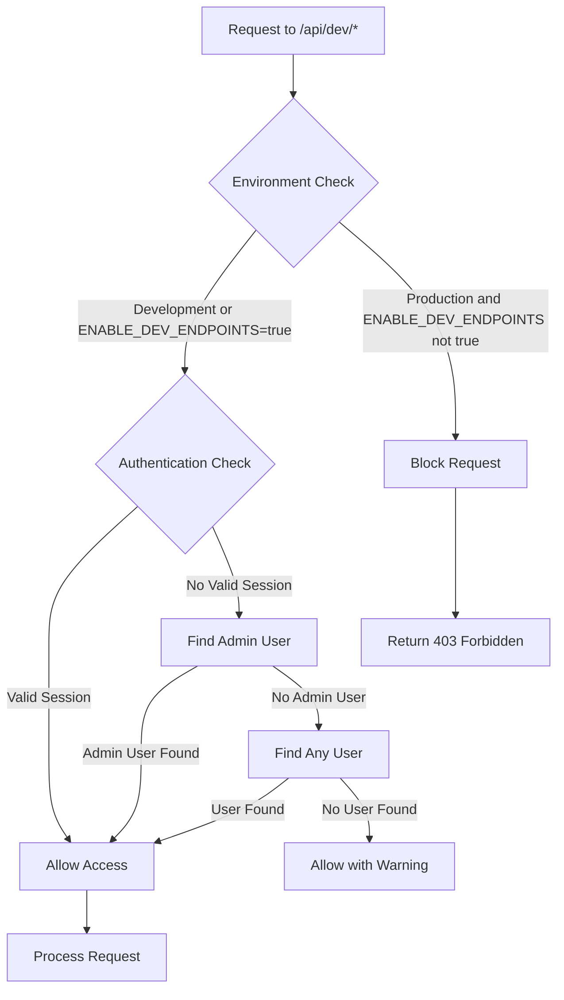
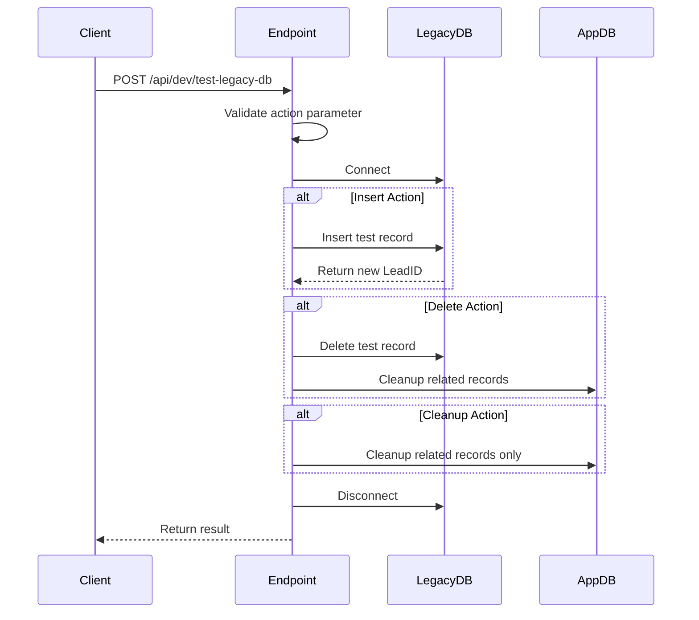
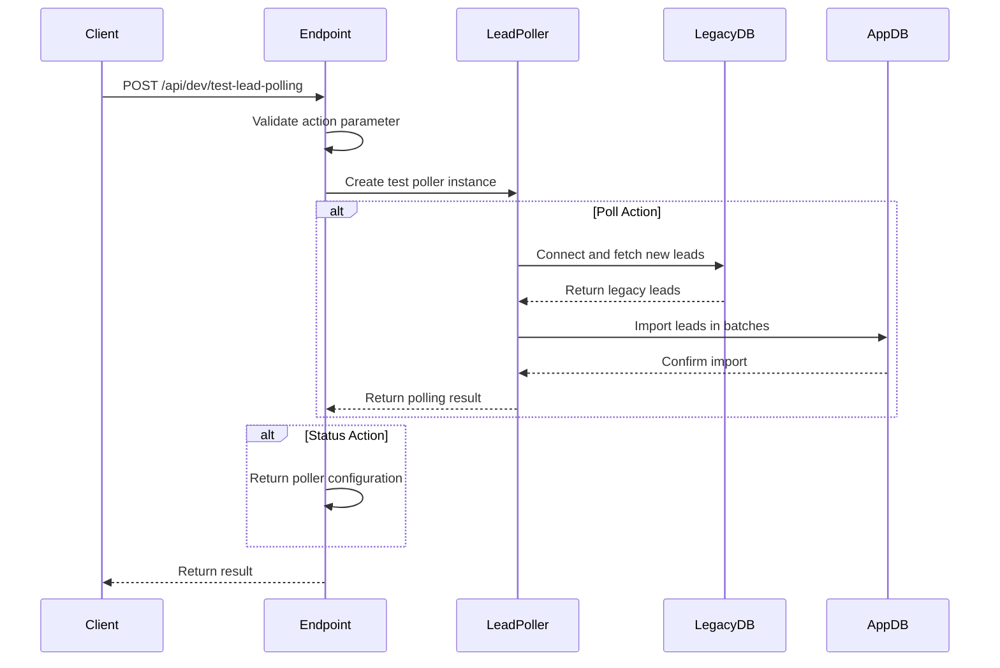
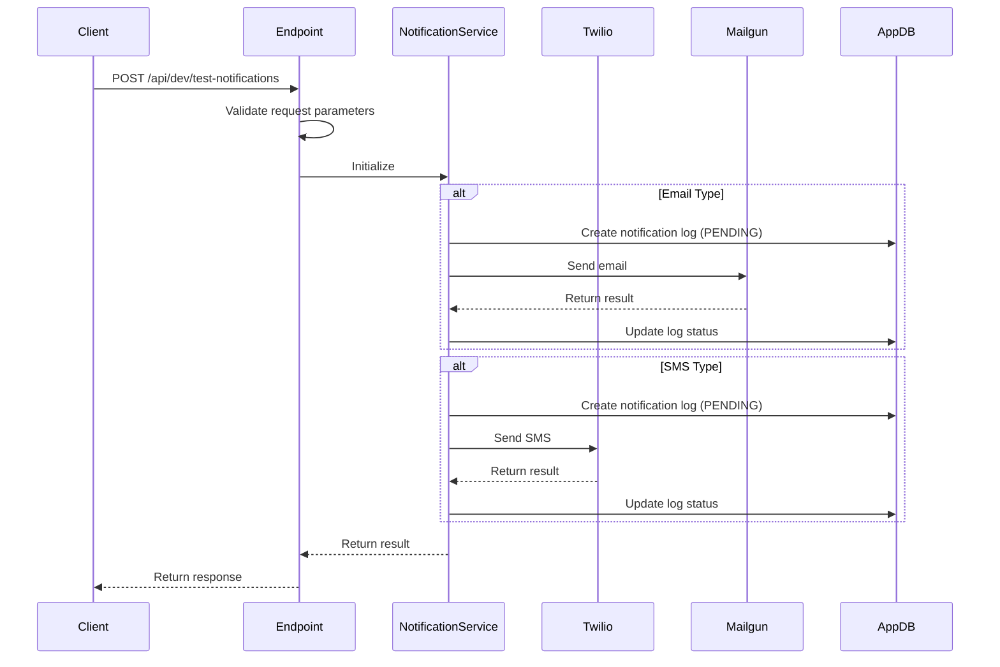
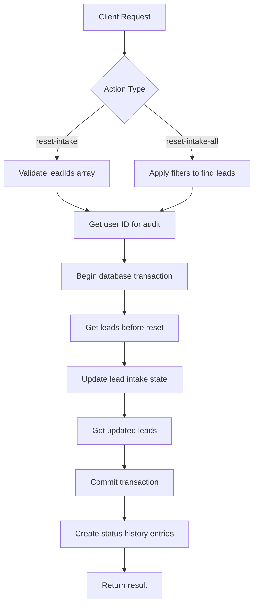
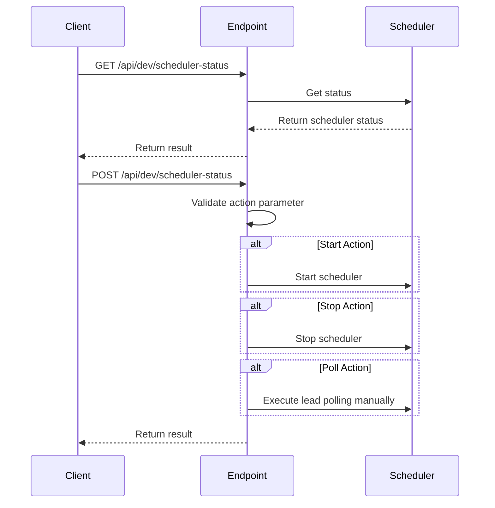
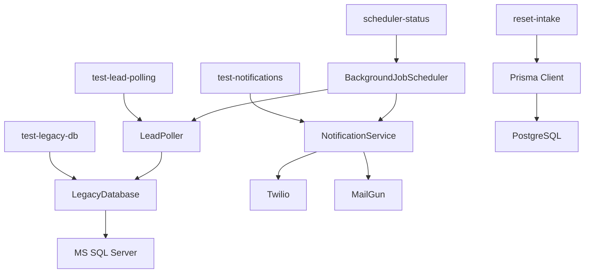

# Development & Testing API Endpoints

<cite>
**Referenced Files in This Document**   
- [test-legacy-db/route.ts](file://src/app/api/dev/test-legacy-db/route.ts)
- [test-lead-polling/route.ts](file://src/app/api/dev/test-lead-polling/route.ts)
- [test-notifications/route.ts](file://src/app/api/dev/test-notifications/route.ts)
- [reset-intake/route.ts](file://src/app/api/dev/reset-intake/route.ts)
- [scheduler-status/route.ts](file://src/app/api/dev/scheduler-status/route.ts)
- [middleware.ts](file://src/middleware.ts)
- [BackgroundJobScheduler.ts](file://src/services/BackgroundJobScheduler.ts)
- [NotificationService.ts](file://src/services/NotificationService.ts)
- [LeadPoller.ts](file://src/services/LeadPoller.ts)
- [legacy-db.ts](file://src/lib/legacy-db.ts)
</cite>

## Table of Contents
1. [Introduction](#introduction)
2. [Authentication and Environment Restrictions](#authentication-and-environment-restrictions)
3. [Endpoint: test-legacy-db](#endpoint-test-legacy-db)
4. [Endpoint: test-lead-polling](#endpoint-test-lead-polling)
5. [Endpoint: test-notifications](#endpoint-test-notifications)
6. [Endpoint: reset-intake](#endpoint-reset-intake)
7. [Endpoint: scheduler-status](#endpoint-scheduler-status)
8. [Integration Points](#integration-points)
9. [Security Measures](#security-measures)

## Introduction
This document provides comprehensive documentation for the development and testing API endpoints in the fund-track application. These endpoints are designed for diagnostic purposes, allowing developers to verify system connectivity, simulate workflows, and monitor background processes during development. The endpoints are strictly restricted to development environments and developer access only, ensuring production system integrity. This documentation covers the purpose, parameters, behavior, request/response examples, and integration details for each endpoint.

## Authentication and Environment Restrictions
The development and testing endpoints are protected by multiple security layers to prevent unauthorized access and accidental exposure in production environments. Access is restricted based on both authentication requirements and environment configuration.



**Diagram sources**
- [middleware.ts](file://src/middleware.ts#L87-L126)

**Section sources**
- [middleware.ts](file://src/middleware.ts#L87-L126)

## Endpoint: test-legacy-db
The `test-legacy-db` endpoint verifies connectivity to the MS SQL Server database and allows testing of data insertion and deletion operations. It supports both POST and GET methods for different testing scenarios.

### Purpose
This endpoint enables developers to:
- Verify connectivity to the legacy MS SQL Server database
- Test insertion of test records into the legacy database
- Test deletion of test records from the legacy database
- Clean up related records in the application database
- Retrieve current test data status

### Parameters
**POST Request Parameters:**
- `action`: Required string, must be one of "insert", "delete", or "cleanup"
- `customValues`: Optional object with custom field values to override defaults

**GET Request Parameters:**
- None

### Behavior
The endpoint uses a default test record configuration and connects to the legacy database using configuration from environment variables. For POST requests, it performs the specified action (insert, delete, or cleanup) and returns the result. For GET requests, it retrieves existing test records from both the legacy database and the application database.



**Diagram sources**
- [test-legacy-db/route.ts](file://src/app/api/dev/test-legacy-db/route.ts#L1-L342)

**Section sources**
- [test-legacy-db/route.ts](file://src/app/api/dev/test-legacy-db/route.ts#L1-L342)

### Request and Response Examples
**Success Response (Insert Action):**
```json
{
  "success": true,
  "action": "insert",
  "result": {
    "message": "Test record inserted successfully",
    "newLeadId": "123456",
    "insertedValues": {
      "CampaignID": 11302,
      "SourceID": 6343,
      "PublisherID": 40235,
      "SubID": "TEST",
      "FirstName": "TEST",
      "LastName": "TEST",
      "Email": "ARDABASOGLU@GMAIL.COM",
      "Phone": "+15005550006",
      "Address": "1260 NW 133 AVE",
      "City": "Fort Lauderdale",
      "State": "FL",
      "ZipCode": "33323",
      "Country": "USA",
      "TestLead": 1,
      "NetworkID": 10000,
      "LeadCost": 0,
      "Currency": "USD",
      "Payin": 0,
      "PayOutType": 1,
      "CurrencyIn": "USD"
    }
  },
  "timestamp": "2025-08-26T15:30:45.123Z"
}
```

**Failure Response:**
```json
{
  "error": "Internal server error",
  "details": "Legacy database connection failed: Failed to connect to server",
  "timestamp": "2025-08-26T15:30:45.123Z"
}
```

## Endpoint: test-lead-polling
The `test-lead-polling` endpoint simulates the lead import workflow by triggering the lead polling process. It allows developers to test the integration between the application and the legacy database for lead data synchronization.

### Purpose
This endpoint enables developers to:
- Simulate the lead import workflow
- Test the lead polling functionality
- Verify the integration with the legacy database
- Monitor the status of the test poller

### Parameters
**POST Request Parameters:**
- `action`: Required string, must be either "poll" or "status"

**GET Request Parameters:**
- None

### Behavior
The endpoint creates a test lead poller instance and performs the requested action. When the "poll" action is specified, it triggers the polling process to import leads from the legacy database. The "status" action returns configuration information about the test poller.



**Diagram sources**
- [test-lead-polling/route.ts](file://src/app/api/dev/test-lead-polling/route.ts#L1-L79)
- [LeadPoller.ts](file://src/services/LeadPoller.ts#L21-L497)

**Section sources**
- [test-lead-polling/route.ts](file://src/app/api/dev/test-lead-polling/route.ts#L1-L79)

### Request and Response Examples
**Success Response (Poll Action):**
```json
{
  "success": true,
  "action": "poll",
  "result": {
    "totalProcessed": 5,
    "newLeads": 5,
    "duplicatesSkipped": 0,
    "errors": [],
    "processingTime": 1250
  },
  "timestamp": "2025-08-26T15:30:45.123Z"
}
```

**Success Response (Status Action):**
```json
{
  "success": true,
  "action": "status",
  "result": {
    "message": "Test poller status",
    "campaignIds": [11302],
    "batchSize": 10
  },
  "timestamp": "2025-08-26T15:30:45.123Z"
}
```

**Failure Response:**
```json
{
  "error": "Internal server error",
  "details": "Lead polling process failed: Connection to legacy database failed",
  "timestamp": "2025-08-26T15:30:45.123Z"
}
```

## Endpoint: test-notifications
The `test-notifications` endpoint validates the integration with Twilio and MailGun for sending email and SMS notifications. It allows developers to send test notifications and verify the notification delivery pipeline.

### Purpose
This endpoint enables developers to:
- Validate Twilio SMS integration
- Validate MailGun email integration
- Test notification delivery to recipients
- Retrieve recent notification logs for debugging
- Verify rate limiting and retry logic

### Parameters
**POST Request Parameters:**
- `type`: Required string, must be "email" or "sms"
- `recipient`: Required string, email address or phone number
- `subject`: Required for email, string with email subject
- `message`: Required string with notification content
- `leadId`: Optional number, associated lead ID

**GET Request Parameters:**
- None

### Behavior
The endpoint validates the request parameters and uses the NotificationService to send the specified notification type. For email notifications, both text and HTML versions are sent. The service handles rate limiting, retry logic, and logging of notification attempts.



**Diagram sources**
- [test-notifications/route.ts](file://src/app/api/dev/test-notifications/route.ts#L1-L110)
- [NotificationService.ts](file://src/services/NotificationService.ts#L47-L468)

**Section sources**
- [test-notifications/route.ts](file://src/app/api/dev/test-notifications/route.ts#L1-L110)

### Request and Response Examples
**Success Response (Email):**
```json
{
  "success": true,
  "externalId": "<20250826153045.123456.1234567890@mx.mailgun.org>",
  "timestamp": "2025-08-26T15:30:45.123Z"
}
```

**Success Response (SMS):**
```json
{
  "success": true,
  "externalId": "SM1234567890abcdef1234567890abcdef",
  "timestamp": "2025-08-26T15:30:45.123Z"
}
```

**Failure Response:**
```json
{
  "error": "Internal server error",
  "details": "Failed to send email: Mailgun API error - Invalid email address",
  "timestamp": "2025-08-26T15:30:45.123Z"
}
```

## Endpoint: reset-intake
The `reset-intake` endpoint clears the intake state for specified leads during development. It resets completion timestamps and status, allowing developers to retest the intake workflow.

### Purpose
This endpoint enables developers to:
- Reset intake completion status for specific leads
- Clear intake progress for multiple leads matching criteria
- Reset intake state for all leads with specific filters
- Retrieve leads with intake progress information

### Parameters
**POST Request Parameters:**
- `action`: Required string, must be "reset-intake" or "reset-intake-all"
- `leadIds`: Required for "reset-intake" action, array of lead IDs
- `filters`: Required for "reset-intake-all" action, object with filtering criteria
  - `status`: Optional string, lead status filter
  - `search`: Optional string, search term for lead fields

**GET Request Parameters:**
- None

### Behavior
The endpoint performs the reset operation in a database transaction to ensure data consistency. It resets intake completion timestamps and changes the lead status to PENDING. After the transaction, it creates status history entries to maintain audit trails.



**Diagram sources**
- [reset-intake/route.ts](file://src/app/api/dev/reset-intake/route.ts#L1-L326)

**Section sources**
- [reset-intake/route.ts](file://src/app/api/dev/reset-intake/route.ts#L1-L326)

### Request and Response Examples
**Success Response:**
```json
{
  "success": true,
  "message": "Reset intake process completion for leads",
  "resetCount": 3,
  "totalTargeted": 3,
  "resetLeads": [
    {
      "id": 1001,
      "firstName": "John",
      "lastName": "Doe",
      "email": "john.doe@example.com",
      "phone": "5551234567",
      "businessName": "Doe Enterprises",
      "status": "PENDING",
      "step1CompletedAt": null,
      "step2CompletedAt": null,
      "intakeCompletedAt": null
    }
  ],
  "timestamp": "2025-08-26T15:30:45.123Z"
}
```

**Failure Response:**
```json
{
  "error": "Internal server error",
  "details": "Failed to reset intake process: Database transaction failed",
  "timestamp": "2025-08-26T15:30:45.123Z"
}
```

## Endpoint: scheduler-status
The `scheduler-status` endpoint monitors the execution of background jobs and allows manual control of the background job scheduler. It provides visibility into scheduled tasks and their next execution times.

### Purpose
This endpoint enables developers to:
- Monitor the status of the background job scheduler
- View configuration of scheduled tasks
- Manually start or stop the scheduler
- Trigger scheduled jobs manually for testing

### Parameters
**GET Request Parameters:**
- None

**POST Request Parameters:**
- `action`: Required string, must be "start", "stop", or "poll"

### Behavior
The endpoint retrieves the current status of the background job scheduler, including whether it is running and the next scheduled execution times for various jobs. For POST requests, it allows manual control of the scheduler and manual triggering of specific jobs.



**Diagram sources**
- [scheduler-status/route.ts](file://src/app/api/dev/scheduler-status/route.ts#L1-L83)
- [BackgroundJobScheduler.ts](file://src/services/BackgroundJobScheduler.ts#L8-L458)

**Section sources**
- [scheduler-status/route.ts](file://src/app/api/dev/scheduler-status/route.ts#L1-L83)

### Request and Response Examples
**Success Response (GET):**
```json
{
  "success": true,
  "action": "scheduler-status",
  "result": {
    "scheduler": {
      "isRunning": true,
      "leadPollingPattern": "*/15 * * * *",
      "followUpPattern": "*/5 * * * *",
      "nextLeadPolling": "2025-08-26T15:45:00.000Z",
      "nextFollowUp": "2025-08-26T15:35:00.000Z"
    },
    "environment": {
      "nodeEnv": "development",
      "backgroundJobsEnabled": "true",
      "leadPollingPattern": "*/15 * * * *",
      "campaignIds": "11302"
    },
    "timestamp": "2025-08-26T15:30:45.123Z"
  }
}
```

**Success Response (POST - Start):**
```json
{
  "success": true,
  "message": "Background job scheduler started manually",
  "timestamp": "2025-08-26T15:30:45.123Z"
}
```

**Failure Response:**
```json
{
  "error": "Failed to get scheduler status",
  "details": "Scheduler not initialized",
  "timestamp": "2025-08-26T15:30:45.123Z"
}
```

## Integration Points
The development and testing endpoints integrate with various services and components within the application architecture. These integrations enable the endpoints to perform their diagnostic functions by leveraging existing business logic and data access patterns.



**Diagram sources**
- [test-legacy-db/route.ts](file://src/app/api/dev/test-legacy-db/route.ts#L1-L342)
- [test-lead-polling/route.ts](file://src/app/api/dev/test-lead-polling/route.ts#L1-L79)
- [test-notifications/route.ts](file://src/app/api/dev/test-notifications/route.ts#L1-L110)
- [reset-intake/route.ts](file://src/app/api/dev/reset-intake/route.ts#L1-L326)
- [scheduler-status/route.ts](file://src/app/api/dev/scheduler-status/route.ts#L1-L83)

**Section sources**
- [test-legacy-db/route.ts](file://src/app/api/dev/test-legacy-db/route.ts#L1-L342)
- [test-lead-polling/route.ts](file://src/app/api/dev/test-lead-polling/route.ts#L1-L79)
- [test-notifications/route.ts](file://src/app/api/dev/test-notifications/route.ts#L1-L110)
- [reset-intake/route.ts](file://src/app/api/dev/reset-intake/route.ts#L1-L326)
- [scheduler-status/route.ts](file://src/app/api/dev/scheduler-status/route.ts#L1-L83)

## Security Measures
The development and testing endpoints implement multiple security measures to prevent unauthorized access and ensure they cannot be used in production environments. These measures include environment-based access control, authentication requirements, and explicit configuration flags.

The primary security mechanism is implemented in the middleware, which checks both the environment and a specific configuration flag before allowing access to any `/api/dev/*` endpoint. This ensures that the endpoints are only accessible in development environments or when explicitly enabled through the `ENABLE_DEV_ENDPOINTS` environment variable.

Additionally, the endpoints perform authentication checks to ensure that only authorized developers can access them. When a valid session is not present, the system attempts to find an admin user or any user to associate with the operation for audit purposes, but access is still restricted by the environment check.

These security measures work together to create a robust protection system that prevents accidental exposure of these powerful diagnostic tools in production environments while still providing full functionality for developers during the development process.

**Section sources**
- [middleware.ts](file://src/middleware.ts#L87-L126)
- [scheduler-status/route.ts](file://src/app/api/dev/scheduler-status/route.ts#L12-L15)