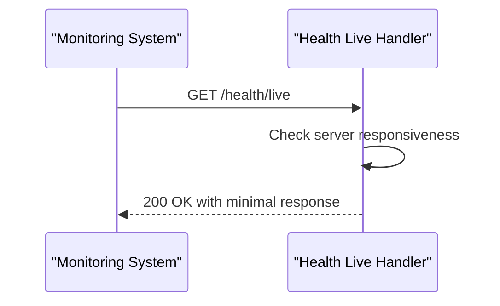
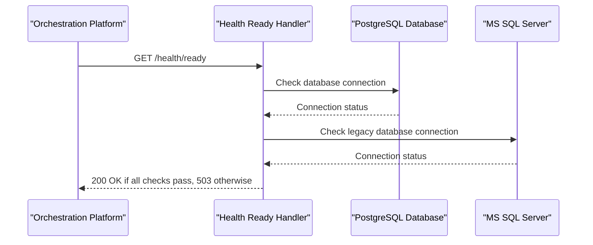
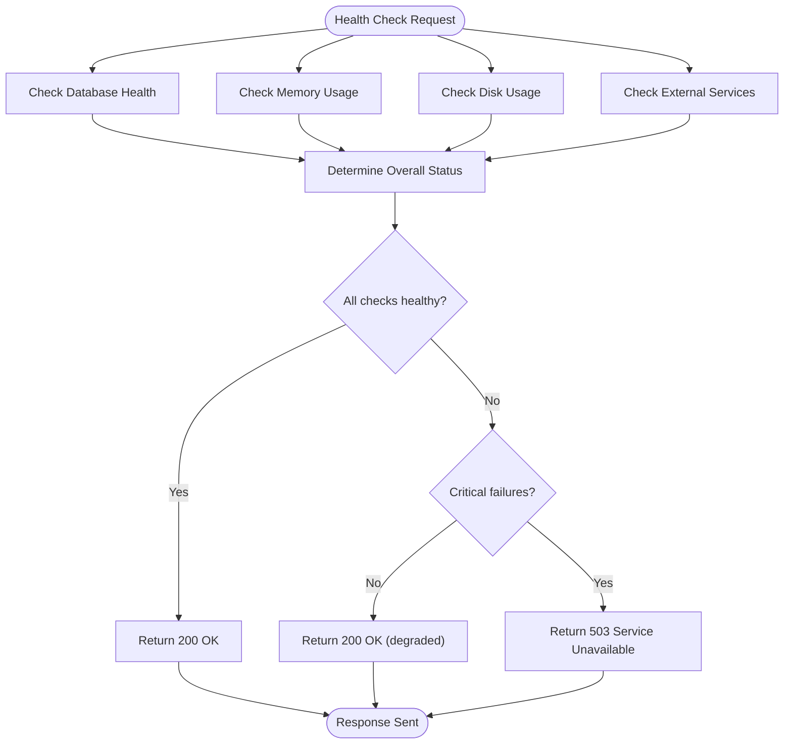
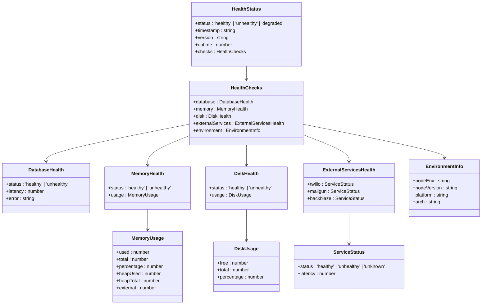
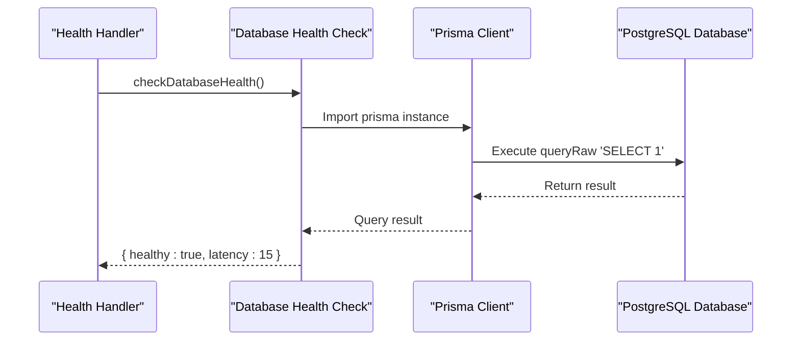
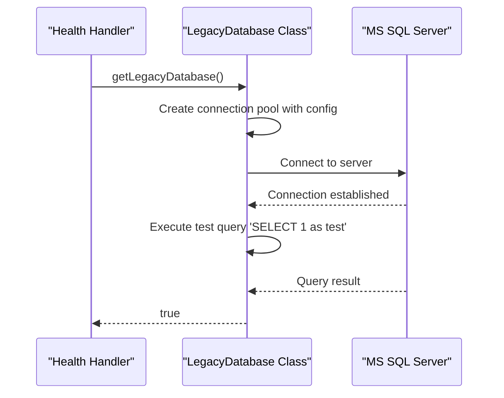
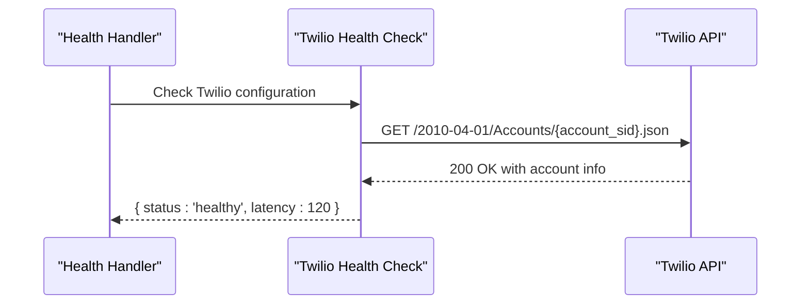
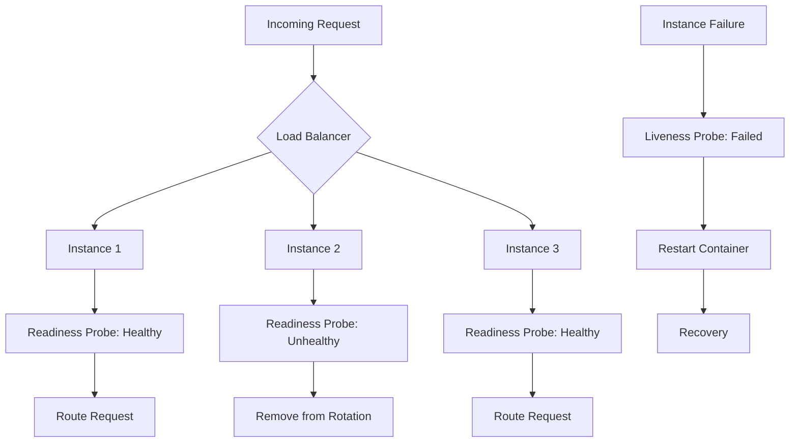

# Health Check Endpoints

<cite>
**Referenced Files in This Document**   
- [src/app/api/health/route.ts](file://src/app/api/health/route.ts)
- [src/app/api/health/live/route.ts](file://src/app/api/health/live/route.ts)
- [src/app/api/health/ready/route.ts](file://src/app/api/health/ready/route.ts)
- [src/lib/database-error-handler.ts](file://src/lib/database-error-handler.ts)
- [src/lib/legacy-db.ts](file://src/lib/legacy-db.ts)
- [src/lib/notifications.ts](file://src/lib/notifications.ts)
- [scripts/health-check.sh](file://scripts/health-check.sh)
</cite>

## Table of Contents
1. [Introduction](#introduction)
2. [Health Check Endpoints Overview](#health-check-endpoints-overview)
3. [Liveness Probe: /health/live](#liveness-probe-healthlive)
4. [Readiness Probe: /health/ready](#readiness-probe-healthready)
5. [Aggregate Health Check: /health](#aggregate-health-check-health)
6. [Response Format and Status Codes](#response-format-and-status-codes)
7. [Database Connectivity Validation](#database-connectivity-validation)
8. [External Service Availability Checks](#external-service-availability-checks)
9. [Integration with Orchestration Platforms](#integration-with-orchestration-platforms)
10. [Performance Considerations and Caching](#performance-considerations-and-caching)
11. [Monitoring Infrastructure Integration](#monitoring-infrastructure-integration)
12. [Troubleshooting Guide](#troubleshooting-guide)

## Introduction
The fund-track application implements a comprehensive health check system to support system monitoring and orchestration. This documentation details the health check endpoints that enable monitoring platforms to assess the application's operational status. The system includes specialized endpoints for liveness and readiness probes, as well as an aggregate health endpoint that combines multiple system checks. These endpoints are critical for Kubernetes and other orchestration platforms to make auto-healing and load balancing decisions, ensuring high availability and reliability of the application.

## Health Check Endpoints Overview
The fund-track application provides three health check endpoints to support different monitoring scenarios:

- **/health/live**: A lightweight liveness probe that checks basic server responsiveness
- **/health/ready**: A readiness probe that verifies database connectivity and external service availability
- **/health**: An aggregate endpoint that combines multiple system checks for comprehensive monitoring

These endpoints are designed to work with container orchestration platforms like Kubernetes, providing the necessary information for auto-healing, load balancing, and deployment strategies. The health check system evaluates various aspects of the application, including database connectivity, memory usage, disk space, and external service availability.

**Section sources**
- [src/app/api/health/route.ts](file://src/app/api/health/route.ts)
- [src/app/api/health/live/route.ts](file://src/app/api/health/live/route.ts)
- [src/app/api/health/ready/route.ts](file://src/app/api/health/ready/route.ts)

## Liveness Probe: /health/live
The `/health/live` endpoint serves as a liveness probe to determine if the application process is running and responsive. This endpoint performs minimal checks to ensure the server can respond to HTTP requests.



**Diagram sources**
- [src/app/api/health/live/route.ts](file://src/app/api/health/live/route.ts)

The liveness endpoint returns a successful response as long as the server process is running and can handle HTTP requests. It does not perform any database or external service checks, making it a lightweight probe that can be called frequently without significant performance impact.

```typescript
// Example implementation pattern
export async function GET() {
  return NextResponse.json(
    { status: 'alive', timestamp: new Date().toISOString() },
    { status: 200 }
  );
}
```

This endpoint is typically configured with a high frequency (e.g., every 10-30 seconds) by orchestration platforms. If the liveness probe fails multiple times consecutively, the platform may restart the container, assuming the application has become unresponsive.

**Section sources**
- [src/app/api/health/live/route.ts](file://src/app/api/health/live/route.ts)

## Readiness Probe: /health/ready
The `/health/ready` endpoint serves as a readiness probe to determine if the application is ready to accept traffic. This endpoint performs more comprehensive checks than the liveness probe, verifying critical dependencies.



**Diagram sources**
- [src/app/api/health/ready/route.ts](file://src/app/api/health/ready/route.ts)

The readiness probe verifies that the application can successfully connect to its primary PostgreSQL database and the legacy MS SQL Server. It also checks the availability of external notification services. If any of these dependencies are unavailable, the endpoint returns a 503 status code, signaling to the orchestration platform that the application should not receive traffic.

This endpoint is crucial for deployment scenarios, ensuring that new instances are only added to the load balancer once they can successfully connect to all required services. It prevents routing traffic to instances that may be partially functional but unable to perform their core functions.

**Section sources**
- [src/app/api/health/ready/route.ts](file://src/app/api/health/ready/route.ts)
- [src/lib/database-error-handler.ts](file://src/lib/database-error-handler.ts)
- [src/lib/legacy-db.ts](file://src/lib/legacy-db.ts)

## Aggregate Health Check: /health
The `/health` endpoint provides a comprehensive system health assessment by aggregating multiple checks into a single response. This endpoint is designed for detailed monitoring and diagnostic purposes.



**Diagram sources**
- [src/app/api/health/route.ts](file://src/app/api/health/route.ts)

The aggregate health check evaluates several system components:

- **Database health**: Connection to PostgreSQL with latency measurement
- **Memory usage**: Heap and system memory consumption
- **Disk usage**: Available disk space on the filesystem
- **External services**: Availability of Twilio, Mailgun, and Backblaze services
- **System environment**: Node.js version, platform, and architecture

The endpoint calculates an overall status based on these checks:
- **Healthy**: All critical systems are functioning normally
- **Degraded**: Non-critical issues detected (e.g., high memory usage)
- **Unhealthy**: Critical failures detected (e.g., database connection lost)



**Diagram sources**
- [src/app/api/health/route.ts](file://src/app/api/health/route.ts)

**Section sources**
- [src/app/api/health/route.ts](file://src/app/api/health/route.ts)

## Response Format and Status Codes
The health check endpoints return JSON responses with a consistent structure that includes detailed information about the system's health status.

### Response Structure
The aggregate `/health` endpoint returns a response with the following structure:

```json
{
  "status": "healthy",
  "timestamp": "2025-08-26T10:30:00.000Z",
  "version": "1.2.3",
  "uptime": 3600,
  "checks": {
    "database": {
      "status": "healthy",
      "latency": 15
    },
    "memory": {
      "status": "healthy",
      "usage": {
        "used": 150,
        "total": 512,
        "percentage": 29,
        "heapUsed": 120,
        "heapTotal": 256,
        "external": 30
      }
    },
    "disk": {
      "status": "healthy",
      "usage": {
        "free": 45,
        "total": 100,
        "percentage": 55
      }
    },
    "externalServices": {
      "twilio": {
        "status": "healthy",
        "latency": 120
      },
      "mailgun": {
        "status": "healthy"
      },
      "backblaze": {
        "status": "healthy"
      }
    },
    "environment": {
      "nodeEnv": "production",
      "nodeVersion": "v18.17.0",
      "platform": "linux",
      "arch": "x64"
    }
  }
}
```

### Status Codes
The health check endpoints use the following HTTP status codes:

- **200 OK**: The system is healthy (for `/health` and `/health/ready`) or the server is alive (for `/health/live`)
- **503 Service Unavailable**: The system is unhealthy and cannot serve requests
- **404 Not Found**: The requested health check endpoint does not exist
- **500 Internal Server Error**: An unexpected error occurred while processing the health check

The `/health` endpoint returns a 200 status code for both "healthy" and "degraded" states, with the actual status indicated in the response body. This allows monitoring systems to distinguish between fully functional and partially functional states while still indicating that the endpoint itself is operational. A 503 status code is only returned when the system is completely unhealthy and unable to serve requests.

### Example Responses
**Healthy State:**
```json
{
  "status": "healthy",
  "timestamp": "2025-08-26T10:30:00.000Z",
  "version": "1.2.3",
  "uptime": 3600,
  "checks": {
    "database": {
      "status": "healthy",
      "latency": 15
    },
    "memory": {
      "status": "healthy",
      "usage": {
        "percentage": 29
      }
    },
    "disk": {
      "status": "healthy",
      "usage": {
        "percentage": 55
      }
    },
    "externalServices": {
      "twilio": {
        "status": "healthy"
      },
      "mailgun": {
        "status": "healthy"
      },
      "backblaze": {
        "status": "healthy"
      }
    }
  }
}
```

**Degraded State:**
```json
{
  "status": "degraded",
  "timestamp": "2025-08-26T10:30:00.000Z",
  "version": "1.2.3",
  "uptime": 3600,
  "checks": {
    "database": {
      "status": "healthy",
      "latency": 15
    },
    "memory": {
      "status": "unhealthy",
      "usage": {
        "percentage": 95
      }
    },
    "disk": {
      "status": "healthy",
      "usage": {
        "percentage": 60
      }
    },
    "externalServices": {
      "twilio": {
        "status": "unknown"
      },
      "mailgun": {
        "status": "healthy"
      },
      "backblaze": {
        "status": "healthy"
      }
    }
  }
}
```

**Unhealthy State:**
```json
{
  "status": "unhealthy",
  "timestamp": "2025-08-26T10:30:00.000Z",
  "version": "1.2.3",
  "uptime": 3600,
  "checks": {
    "database": {
      "status": "unhealthy",
      "error": "Can't reach database server"
    },
    "memory": {
      "status": "unhealthy",
      "usage": {
        "percentage": 98
      }
    },
    "disk": {
      "status": "unhealthy",
      "error": "Unable to check disk usage"
    },
    "externalServices": {
      "twilio": {
        "status": "unknown"
      },
      "mailgun": {
        "status": "unknown"
      },
      "backblaze": {
        "status": "unknown"
      }
    }
  }
}
```

**Section sources**
- [src/app/api/health/route.ts](file://src/app/api/health/route.ts)

## Database Connectivity Validation
The health check system performs comprehensive validation of database connectivity to ensure the application can access its data stores.

### PostgreSQL Connection Check
The primary database health check verifies connectivity to the PostgreSQL database using the `checkDatabaseHealth` function from the `database-error-handler` module.



**Diagram sources**
- [src/lib/database-error-handler.ts](file://src/lib/database-error-handler.ts)

The database health check performs a simple query (`SELECT 1`) to verify connectivity. It measures the latency of this query and includes it in the health check response. The check also handles various error conditions, such as connection timeouts or authentication failures.

```typescript
export async function checkDatabaseHealth(): Promise<{
  healthy: boolean;
  latency?: number;
  error?: string;
}> {
  try {
    // Skip health check during build time or when database is not available
    if (process.env.SKIP_ENV_VALIDATION === 'true' ||
      process.env.DATABASE_URL?.includes('placeholder') ||
      process.env.NODE_ENV === 'production' && !process.env.DATABASE_URL ||
      typeof window !== 'undefined') {
      return {
        healthy: false,
        error: 'Build time or client-side - database not available',
      };
    }

    const startTime = Date.now();

    // Import prisma here to avoid circular dependencies
    const { prisma } = await import('./prisma');

    // Simple query to check connection
    await prisma.$queryRaw`SELECT 1`;

    const latency = Date.now() - startTime;

    return {
      healthy: true,
      latency,
    };
  } catch (error) {
    const errorMessage = error instanceof Error ? error.message : String(error);

    return {
      healthy: false,
      error: errorMessage,
    };
  }
}
```

### Legacy MS SQL Server Connection Check
The system also validates connectivity to the legacy MS SQL Server database, which is used for integration with older systems.



**Diagram sources**
- [src/lib/legacy-db.ts](file://src/lib/legacy-db.ts)

The legacy database connection check uses the `mssql` package to establish a connection to the MS SQL Server instance. It tests the connection by executing a simple query and returns a boolean indicating success or failure.

```typescript
async testConnection(): Promise<boolean> {
  try {
    await this.connect();
    await this.query('SELECT 1 as test');
    return true;
  } catch (error) {
    console.error('Legacy database connection test failed:', error);
    return false;
  }
}
```

The legacy database configuration is managed through environment variables, allowing for flexible deployment across different environments:

- `LEGACY_DB_SERVER`: Hostname or IP address of the MS SQL Server
- `LEGACY_DB_DATABASE`: Database name
- `LEGACY_DB_USER`: Username for authentication
- `LEGACY_DB_PASSWORD`: Password for authentication
- `LEGACY_DB_PORT`: Port number (default: 1433)
- `LEGACY_DB_ENCRYPT`: Whether to use encryption
- `LEGACY_DB_TRUST_CERT`: Whether to trust the server certificate

**Section sources**
- [src/lib/database-error-handler.ts](file://src/lib/database-error-handler.ts)
- [src/lib/legacy-db.ts](file://src/lib/legacy-db.ts)

## External Service Availability Checks
The health check system validates the availability of external services that the application depends on for its functionality.

### External Services Configuration
The system checks the following external services:

- **Twilio**: For SMS notifications
- **Mailgun**: For email notifications
- **Backblaze**: For file storage

These services are checked when the `ENABLE_DETAILED_HEALTH_CHECKS` environment variable is set to 'true'. This allows administrators to control the thoroughness of health checks based on the environment and monitoring requirements.

### Twilio Service Check
The Twilio service check verifies that the application can communicate with the Twilio API by making a simple authentication request.



**Diagram sources**
- [src/app/api/health/route.ts](file://src/app/api/health/route.ts)

The check uses the `fetch` API with a 5-second timeout to prevent the health check from hanging if the Twilio service is unresponsive:

```typescript
// Twilio check
try {
  if (process.env.TWILIO_ACCOUNT_SID && process.env.TWILIO_AUTH_TOKEN) {
    const startTime = Date.now();
    // Simple API call to check Twilio status
    const response = await fetch(`https://api.twilio.com/2010-04-01/Accounts/${process.env.TWILIO_ACCOUNT_SID}.json`, {
      method: 'GET',
      headers: {
        'Authorization': `Basic ${Buffer.from(`${process.env.TWILIO_ACCOUNT_SID}:${process.env.TWILIO_AUTH_TOKEN}`).toString('base64')}`,
      },
      signal: AbortSignal.timeout(5000), // 5 second timeout
    });
    
    services.twilio = {
      status: response.ok ? 'healthy' : 'unhealthy',
      latency: Date.now() - startTime,
    };
  }
} catch (error) {
  services.twilio = { status: 'unhealthy' };
}
```

### Mailgun and Backblaze Checks
The Mailgun and Backblaze checks are simpler, verifying only that the necessary configuration is present:

```typescript
// MailGun check (simplified)
try {
  if (process.env.MAILGUN_API_KEY && process.env.MAILGUN_DOMAIN) {
    services.mailgun = { status: 'healthy' }; // Assume healthy if configured
  }
} catch (error) {
  services.mailgun = { status: 'unhealthy' };
}

// Backblaze check (simplified)
try {
  if (process.env.B2_APPLICATION_KEY_ID && process.env.B2_APPLICATION_KEY) {
    services.backblaze = { status: 'healthy' }; // Assume healthy if configured
  }
} catch (error) {
  services.backblaze = { status: 'unhealthy' };
}
```

These simplified checks assume that if the configuration is present, the services are available. This approach reduces the complexity and potential failure points of the health check system while still providing basic validation of service configuration.

The notification service integration is further validated through the `validateNotificationConfig` function:

```typescript
/**
 * Validate notification configuration on startup
 */
export async function validateNotificationConfig(): Promise<boolean> {
  return notificationService.validateConfiguration();
}
```

**Section sources**
- [src/app/api/health/route.ts](file://src/app/api/health/route.ts)
- [src/lib/notifications.ts](file://src/lib/notifications.ts)

## Integration with Orchestration Platforms
The health check endpoints are designed to integrate seamlessly with container orchestration platforms like Kubernetes, enabling automated system management and resilience.

### Kubernetes Liveness and Readiness Probes
In a Kubernetes environment, the health check endpoints are configured as liveness and readiness probes:

```yaml
livenessProbe:
  httpGet:
    path: /api/health/live
    port: 3000
  initialDelaySeconds: 30
  periodSeconds: 10
  timeoutSeconds: 5
  failureThreshold: 3

readinessProbe:
  httpGet:
    path: /api/health/ready
    port: 3000
  initialDelaySeconds: 10
  periodSeconds: 5
  timeoutSeconds: 3
  failureThreshold: 3
```

The liveness probe (`/health/live`) is used by Kubernetes to determine if the container should be restarted. If the liveness probe fails repeatedly, Kubernetes will restart the container, assuming it has become unresponsive.

The readiness probe (`/health/ready`) is used to determine if the container is ready to receive traffic. If the readiness probe fails, Kubernetes will remove the container from the service load balancer, preventing it from receiving requests until it becomes ready again.

### Auto-healing and Load Balancing
The health check system enables several auto-healing and load balancing scenarios:



When an instance fails its readiness probe, the orchestration platform removes it from the load balancer rotation, ensuring that no new requests are sent to that instance. This prevents users from experiencing errors due to partial system failures.

If an instance fails its liveness probe, the platform restarts the container, attempting to recover from the failure. This auto-healing capability improves system availability and reduces the need for manual intervention.

### Script-based Health Checking
The repository includes a shell script (`scripts/health-check.sh`) that can be used for external health monitoring:

```bash
#!/bin/bash

# Health Check Script for Production Monitoring
# This script can be used by monitoring systems to check application health

set -e

# Configuration
HEALTH_URL="${HEALTH_URL:-http://localhost:3000/api/health}"
TIMEOUT="${HEALTH_CHECK_TIMEOUT:-5}"
RETRY_COUNT="${HEALTH_CHECK_RETRIES:-3}"
RETRY_DELAY="${HEALTH_CHECK_RETRY_DELAY:-2}"

# Health check function
check_health() {
    local attempt=1
    
    while [ $attempt -le $RETRY_COUNT ]; do
        log "Health check attempt $attempt/$RETRY_COUNT..."
        
        # Make HTTP request with timeout
        if response=$(curl -s -f --max-time $TIMEOUT "$HEALTH_URL" 2>/dev/null); then
            # Parse JSON response
            status=$(echo "$response" | grep -o '"status":"[^"]*"' | cut -d'"' -f4)
            
            case "$status" in
                "healthy")
                    echo -e "${GREEN}✅ Application is healthy${NC}"
                    echo "$response" | jq '.' 2>/dev/null || echo "$response"
                    return 0
                    ;;
                "degraded")
                    echo -e "${YELLOW}⚠️  Application is degraded${NC}"
                    echo "$response" | jq '.' 2>/dev/null || echo "$response"
                    return 1
                    ;;
                "unhealthy")
                    echo -e "${RED}❌ Application is unhealthy${NC}"
                    echo "$response" | jq '.' 2>/dev/null || echo "$response"
                    return 2
                    ;;
                *)
                    echo -e "${RED}❓ Unknown health status: $status${NC}"
                    return 3
                    ;;
            esac
        else
            echo -e "${RED}❌ Health check failed (attempt $attempt/$RETRY_COUNT)${NC}"
            
            if [ $attempt -lt $RETRY_COUNT ]; then
                log "Retrying in $RETRY_DELAY seconds..."
                sleep $RETRY_DELAY
            fi
        fi
        
        attempt=$((attempt + 1))
    done
    
    echo -e "${RED}💥 All health check attempts failed${NC}"
    return 4
}
```

This script provides additional functionality beyond simple HTTP checks, including:

- Configurable timeout, retry count, and retry delay
- JSON response parsing and formatting
- Color-coded output for different health states
- Different exit codes for different health states (0=healthy, 1=degraded, 2=unhealthy, 3=unknown, 4=connection failed)

The script can be integrated with external monitoring systems or used in deployment pipelines to verify application health before promoting releases.

**Section sources**
- [scripts/health-check.sh](file://scripts/health-check.sh)
- [src/app/api/health/route.ts](file://src/app/api/health/route.ts)

## Performance Considerations and Caching
The health check system is designed with performance considerations to handle high-frequency requests without impacting application performance.

### Performance Monitoring
The health check endpoints are wrapped with performance monitoring to track their execution time and identify potential performance issues:

```typescript
// Export the wrapped handler with performance monitoring
export const GET = withPerformanceMonitoring('health_check', healthCheckHandler);
```

The `withPerformanceMonitoring` wrapper tracks the duration of each health check request and logs performance metrics. This allows administrators to monitor the performance of the health check system itself and identify any degradation over time.

### Timeout Configuration
The health check system includes several timeout configurations to prevent hanging requests:

- **External service timeout**: 5 seconds for Twilio API calls using `AbortSignal.timeout(5000)`
- **HTTP request timeout**: Configurable via `HEALTH_CHECK_TIMEOUT` environment variable (default: 5 seconds)
- **Database query timeout**: Configured in the legacy database connection options (default: 30 seconds)

These timeouts ensure that health checks complete within a reasonable timeframe, even if dependent services are slow or unresponsive.

### Caching Strategy
Currently, the health check endpoints do not implement response caching. Each request performs fresh checks of the system components. This ensures that monitoring systems receive up-to-date information about the system's health status.

However, for high-frequency health checks, a caching strategy could be implemented to reduce the load on system resources. Potential approaches include:

- **Time-based caching**: Cache the health check response for a short duration (e.g., 10-30 seconds)
- **Stale-while-revalidate**: Return a cached response while asynchronously updating the cache
- **Different caching for different checks**: Cache less volatile checks (e.g., environment information) separately from more volatile checks (e.g., database connectivity)

The lack of caching ensures that the health check results are always current, which is critical for making accurate auto-healing and load balancing decisions. However, in high-traffic environments, implementing a caching strategy could improve performance without significantly impacting the accuracy of health assessments.

The system does include caching for other components, such as the `SystemSettingsService`, which demonstrates the pattern that could be applied to health checks if needed:

```typescript
/**
 * Refresh cache if TTL expired
 */
private async refreshCacheIfNeeded(): Promise<void> {
  const now = new Date();
  const cacheAge = now.getTime() - this.cache.lastUpdated.getTime();

  if (cacheAge > this.cache.ttl || this.cache.data.size === 0) {
    await this.refreshCache();
  }
}
```

For health checks, the trade-off between freshness and performance should be carefully considered based on the specific requirements of the deployment environment.

**Section sources**
- [src/app/api/health/route.ts](file://src/app/api/health/route.ts)
- [scripts/health-check.sh](file://scripts/health-check.sh)
- [src/services/SystemSettingsService.ts](file://src/services/SystemSettingsService.ts)

## Monitoring Infrastructure Integration
The health check system is integrated with the application's monitoring infrastructure to provide comprehensive visibility into system health and performance.

### Logging and Error Tracking
Health check results are logged using the application's logging system, with different verbosity levels based on the environment and health status:

```typescript
// Log health check (less verbose in production)
if (process.env.NODE_ENV !== 'production' || overallStatus !== 'healthy') {
  logger.info('Health check completed', {
    status: overallStatus,
    duration,
    dbLatency: dbHealth.latency,
    memoryUsage: memoryPercentage,
    diskUsage: diskHealth.usage?.percentage,
  });
}
```

When a health check fails, the error is tracked using the `trackError` function:

```typescript
// Track error locally
trackError({
  name: 'health_check_failed',
  error: error as Error,
  timestamp: Date.now(),
  metadata: {
    duration: Date.now() - startTime,
  },
});
```

This integration ensures that health check failures are captured in the application's error tracking system, allowing for post-mortem analysis and trend identification.

### Performance Metrics Collection
The health check system contributes to the overall performance metrics collected by the application. The `withPerformanceMonitoring` wrapper records metrics for each health check request, including:

- Execution duration
- Success/failure status
- Timestamp

These metrics can be used to monitor the performance of the health check system over time and identify any trends or anomalies.

### External Monitoring Integration
The health check endpoints are designed to be consumed by external monitoring systems such as:

- **Prometheus**: For metrics collection and alerting
- **Grafana**: For visualization of health check results
- **Datadog**: For comprehensive monitoring and alerting
- **New Relic**: For application performance monitoring

The structured JSON response format makes it easy for these systems to parse and process health check results. The inclusion of timestamps, version information, and detailed component status enables rich monitoring dashboards and sophisticated alerting rules.

The script-based health check (`scripts/health-check.sh`) can be integrated with traditional monitoring systems like Nagios or Zabbix, providing flexibility in monitoring approach.

### Alerting Configuration
Based on the health check results, monitoring systems can be configured to trigger alerts for different scenarios:

- **Critical alerts**: When the system is unhealthy (status: 503)
- **Warning alerts**: When the system is degraded (high memory usage, disk space low)
- **Informational alerts**: When external services are unavailable but the core system is functional

These alerts can be routed to appropriate teams based on the nature of the issue, ensuring timely response to potential problems.

**Section sources**
- [src/app/api/health/route.ts](file://src/app/api/health/route.ts)
- [src/lib/monitoring.ts](file://src/lib/monitoring.ts)
- [scripts/health-check.sh](file://scripts/health-check.sh)

## Troubleshooting Guide
This section provides guidance for troubleshooting common issues with the health check system.

### Common Issues and Solutions

**Issue: Health check returns 503 Service Unavailable**
- **Possible causes**:
  - Database connection failure
  - Insufficient disk space (over 90% usage)
  - Application configuration errors
- **Troubleshooting steps**:
  1. Check the `DATABASE_URL` environment variable
  2. Verify database server availability
  3. Check disk space on the server
  4. Review application logs for database connection errors

**Issue: High memory usage reported in health check**
- **Possible causes**:
  - Memory leak in application code
  - Insufficient memory allocation
  - High traffic load
- **Troubleshooting steps**:
  1. Monitor memory usage over time to identify trends
  2. Check for memory leaks using Node.js debugging tools
  3. Consider increasing memory allocation if consistently high
  4. Optimize application code for memory efficiency

**Issue: External services reported as unhealthy**
- **Possible causes**:
  - Missing or incorrect service credentials
  - Network connectivity issues
  - Service provider outages
- **Troubleshooting steps**:
  1. Verify environment variables for service credentials
  2. Test connectivity to service endpoints
  3. Check service provider status pages
  4. Review firewall and network security settings

**Issue: Health check timeout**
- **Possible causes**:
  - Slow database queries
  - Network latency
  - High CPU usage
- **Troubleshooting steps**:
  1. Check database performance and optimize slow queries
  2. Monitor network latency between application and dependencies
  3. Check CPU usage on the server
  4. Consider increasing timeout values if appropriate

### Diagnostic Commands
The following commands can be used to diagnose health check issues:

```bash
# Run the health check script with verbose output
./scripts/health-check.sh --verbose

# Check environment variables
echo "DATABASE_URL: ${DATABASE_URL}"
echo "LEGACY_DB_SERVER: ${LEGACY_DB_SERVER}"
echo "TWILIO_ACCOUNT_SID: ${TWILIO_ACCOUNT_SID}"

# Test database connectivity manually
npx prisma db pull
npx prisma generate

# Check disk space
df -h

# Check memory usage
free -h
```

### Log Analysis
When troubleshooting health check issues, examine the application logs for relevant error messages:

```bash
# View recent application logs
tail -f logs/application.log

# Search for health check related errors
grep "health check" logs/application.log
grep "Database health check failed" logs/application.log
grep "Legacy database connection test failed" logs/application.log
```

The logs will contain detailed information about the specific component that failed, which can help pinpoint the root cause of the issue.

**Section sources**
- [src/app/api/health/route.ts](file://src/app/api/health/route.ts)
- [src/lib/database-error-handler.ts](file://src/lib/database-error-handler.ts)
- [src/lib/legacy-db.ts](file://src/lib/legacy-db.ts)
- [scripts/health-check.sh](file://scripts/health-check.sh)