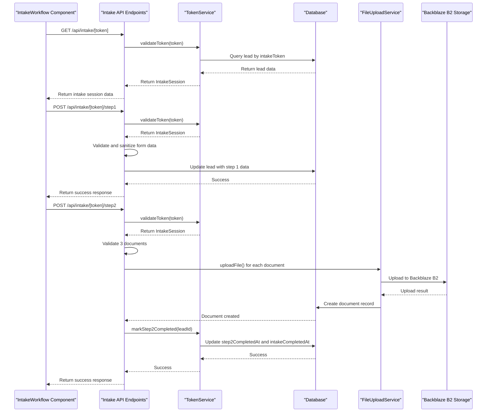
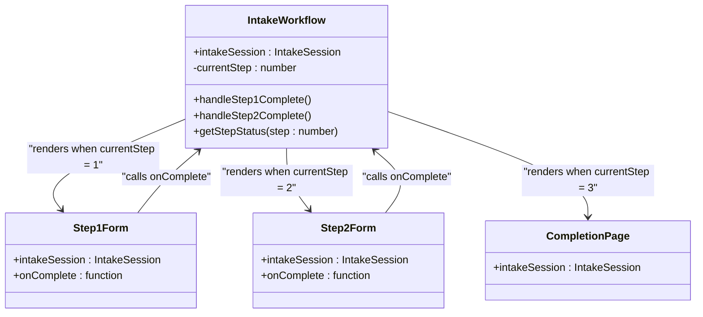
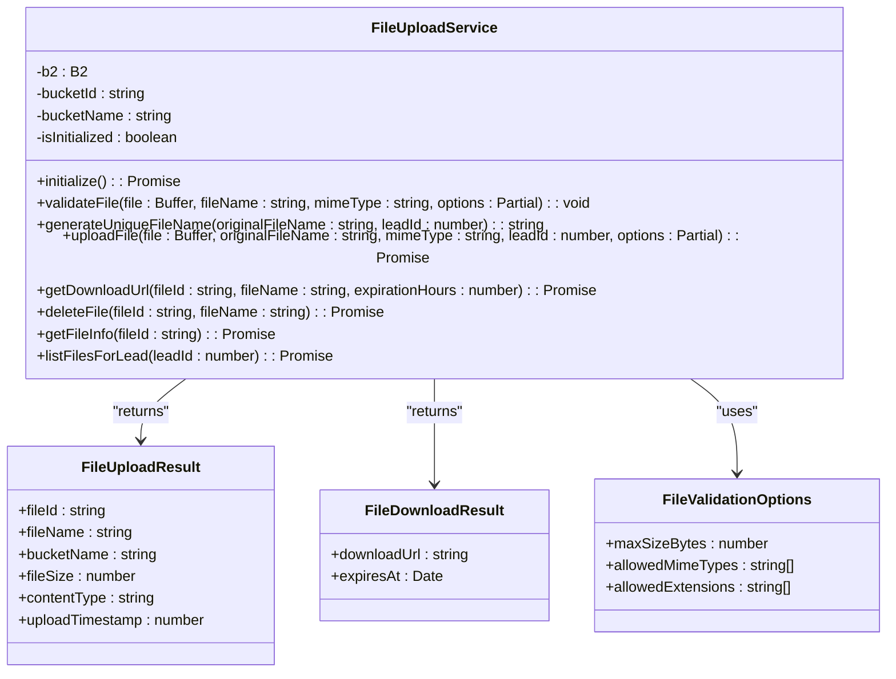

# Intake Process API Endpoints

<cite>
**Referenced Files in This Document**   
- [route.ts](file://src/app/api/intake/[token]/route.ts)
- [step1/route.ts](file://src/app/api/intake/[token]/step1/route.ts)
- [step2/route.ts](file://src/app/api/intake/[token]/step2/route.ts)
- [save/route.ts](file://src/app/api/intake/[token]/save/route.ts)
- [IntakeWorkflow.tsx](file://src/components/intake/IntakeWorkflow.tsx)
- [Step1Form.tsx](file://src/components/intake/Step1Form.tsx)
- [Step2Form.tsx](file://src/components/intake/Step2Form.tsx)
- [TokenService.ts](file://src/services/TokenService.ts)
- [FileUploadService.ts](file://src/services/FileUploadService.ts)
- [schema.prisma](file://prisma/schema.prisma)
</cite>

## Table of Contents
1. [Introduction](#introduction)
2. [Project Structure](#project-structure)
3. [Core Components](#core-components)
4. [Architecture Overview](#architecture-overview)
5. [Detailed Component Analysis](#detailed-component-analysis)
6. [Dependency Analysis](#dependency-analysis)
7. [Performance Considerations](#performance-considerations)
8. [Troubleshooting Guide](#troubleshooting-guide)
9. [Conclusion](#conclusion)

## Introduction
This document provides comprehensive documentation for the intake process API endpoints in the fund-track application. These endpoints support a multi-step onboarding workflow for prospects using token-based authentication. The system enables collection of business and personal information, document uploads, and saving of partial progress. The documentation details the integration between frontend components and backend services, including validation, data sanitization, and error handling mechanisms.

## Project Structure
The intake process is implemented within the `src/app/api/intake/[token]` directory, using Next.js route handlers with dynamic routing based on secure tokens. The frontend components are located in `src/components/intake/`, while core services for token management and file handling reside in the `src/services/` directory. The data model is defined in the Prisma schema.

```mermaid
graph TB
subgraph "API Endpoints"
A[/api/intake/[token]]
B[/api/intake/[token]/step1]
C[/api/intake/[token]/step2]
D[/api/intake/[token]/save]
end
subgraph "Frontend Components"
E[IntakeWorkflow]
F[Step1Form]
G[Step2Form]
H[CompletionPage]
end
subgraph "Core Services"
I[TokenService]
J[FileUploadService]
end
subgraph "Data Layer"
K[Prisma Schema]
L[PostgreSQL Database]
end
E --> A
E --> B
E --> C
D --> E
B --> I
C --> I
A --> I
C --> J
I --> K
J --> K
K --> L
```

**Diagram sources**
- [route.ts](file://src/app/api/intake/[token]/route.ts)
- [step1/route.ts](file://src/app/api/intake/[token]/step1/route.ts)
- [step2/route.ts](file://src/app/api/intake/[token]/step2/route.ts)
- [save/route.ts](file://src/app/api/intake/[token]/save/route.ts)
- [IntakeWorkflow.tsx](file://src/components/intake/IntakeWorkflow.tsx)
- [TokenService.ts](file://src/services/TokenService.ts)
- [FileUploadService.ts](file://src/services/FileUploadService.ts)
- [schema.prisma](file://prisma/schema.prisma)

**Section sources**
- [route.ts](file://src/app/api/intake/[token]/route.ts)
- [step1/route.ts](file://src/app/api/intake/[token]/step1/route.ts)
- [step2/route.ts](file://src/app/api/intake/[token]/step2/route.ts)
- [save/route.ts](file://src/app/api/intake/[token]/save/route.ts)
- [IntakeWorkflow.tsx](file://src/components/intake/IntakeWorkflow.tsx)
- [TokenService.ts](file://src/services/TokenService.ts)
- [FileUploadService.ts](file://src/services/FileUploadService.ts)
- [schema.prisma](file://prisma/schema.prisma)

## Core Components
The intake process consists of several core components that work together to provide a seamless onboarding experience. The API endpoints handle data processing and validation, while the frontend components manage user interaction. The TokenService ensures secure access to the intake workflow, and the FileUploadService manages document storage.

**Section sources**
- [route.ts](file://src/app/api/intake/[token]/route.ts)
- [step1/route.ts](file://src/app/api/intake/[token]/step1/route.ts)
- [step2/route.ts](file://src/app/api/intake/[token]/step2/route.ts)
- [save/route.ts](file://src/app/api/intake/[token]/save/route.ts)
- [IntakeWorkflow.tsx](file://src/components/intake/IntakeWorkflow.tsx)
- [TokenService.ts](file://src/services/TokenService.ts)
- [FileUploadService.ts](file://src/services/FileUploadService.ts)

## Architecture Overview
The intake process follows a token-based authentication flow where each prospect receives a unique token that grants access to their intake session. The architecture separates concerns between frontend presentation, API processing, and backend services.



**Diagram sources**
- [route.ts](file://src/app/api/intake/[token]/route.ts)
- [step1/route.ts](file://src/app/api/intake/[token]/step1/route.ts)
- [step2/route.ts](file://src/app/api/intake/[token]/step2/route.ts)
- [TokenService.ts](file://src/services/TokenService.ts)
- [FileUploadService.ts](file://src/services/FileUploadService.ts)
- [schema.prisma](file://prisma/schema.prisma)

## Detailed Component Analysis

### Intake API Endpoints
The intake API endpoints provide a secure, token-gated interface for prospect onboarding. Each endpoint validates the token before processing requests and implements comprehensive validation and error handling.

#### Main Route (GET)
The main route retrieves the current intake session status for a given token.

```mermaid
flowchart TD
A[GET /api/intake/[token]] --> B{Token Provided?}
B --> |No| C[Return 400: Token required]
B --> |Yes| D[Validate Token]
D --> E{Valid Token?}
E --> |No| F[Return 404: Invalid or expired token]
E --> |Yes| G[Return IntakeSession Data]
G --> H[Return 200: Success]
```

**Diagram sources**
- [route.ts](file://src/app/api/intake/[token]/route.ts)

**Section sources**
- [route.ts](file://src/app/api/intake/[token]/route.ts)

#### Step 1 Endpoint (POST)
The step1 endpoint collects business and personal information from prospects.

```mermaid
flowchart TD
A[POST /api/intake/[token]/step1] --> B{Token Provided?}
B --> |No| C[Return 400: Token required]
B --> |Yes| D[Validate Token]
D --> E{Valid Token?}
E --> |No| F[Return 404: Invalid or expired token]
E --> |Yes| G{Intake Completed?}
G --> |Yes| H[Return 400: Already completed]
G --> |No| I[Parse Request Body]
I --> J[Trim All String Fields]
J --> K[Validate Required Fields]
K --> L{Missing Fields?}
L --> |Yes| M[Return 400: Missing required fields]
L --> |No| N[Validate Email Formats]
N --> O{Valid Emails?}
O --> |No| P[Return 400: Invalid email format]
O --> |Yes| Q[Validate Phone Formats]
Q --> R{Valid Phones?}
R --> |No| S[Return 400: Invalid phone format]
R --> |Yes| T[Clean Phone Numbers]
T --> U[Validate Ownership Percentage]
U --> V{Valid Percentage?}
V --> |No| W[Return 400: Invalid ownership percentage]
V --> |Yes| X[Validate Years in Business]
X --> Y{Valid Years?}
Y --> |No| Z[Return 400: Invalid years in business]
Y --> |Yes| AA[Update Lead Record]
AA --> AB[Return 200: Success]
```

**Diagram sources**
- [step1/route.ts](file://src/app/api/intake/[token]/step1/route.ts)

**Section sources**
- [step1/route.ts](file://src/app/api/intake/[token]/step1/route.ts)

#### Step 2 Endpoint (POST)
The step2 endpoint handles document uploads for the intake process.

```mermaid
flowchart TD
A[POST /api/intake/[token]/step2] --> B[Validate Token]
B --> C{Valid Token?}
C --> |No| D[Return 400: Invalid or expired token]
C --> |Yes| E{Step 1 Completed?}
E --> |No| F[Return 400: Step 1 must be completed]
E --> |Yes| G{Step 2 Already Completed?}
G --> |Yes| H[Return 400: Step 2 already completed]
G --> |No| I[Parse Form Data]
I --> J{Exactly 3 Documents?}
J --> |No| K[Return 400: Exactly 3 documents required]
J --> |Yes| L[Process Each Document]
L --> M{File Valid?}
M --> |No| N[Return 400: Empty or invalid document]
M --> |Yes| O[Convert to Buffer]
O --> P[Upload to Backblaze B2]
P --> Q{Upload Successful?}
Q --> |No| R[Return 500: Failed to upload document]
Q --> |Yes| S[Create Document Record]
S --> T[Store in Database]
T --> U[Next Document]
U --> V{All Documents Processed?}
V --> |No| L
V --> |Yes| W[Mark Step 2 Completed]
W --> X{Success?}
X --> |No| Y[Return 500: Failed to complete step 2]
X --> |Yes| Z[Return 200: Success]
```

**Diagram sources**
- [step2/route.ts](file://src/app/api/intake/[token]/step2/route.ts)

**Section sources**
- [step2/route.ts](file://src/app/api/intake/[token]/step2/route.ts)

#### Save Endpoint (POST)
The save endpoint allows prospects to save partial progress during the intake process.

```mermaid
flowchart TD
A[POST /api/intake/[token]/save] --> B{Token Provided?}
B --> |No| C[Return 400: Token required]
B --> |Yes| D[Validate Token]
D --> E{Valid Token?}
E --> |No| F[Return 404: Invalid or expired token]
E --> |Yes| G{Intake Completed?}
G --> |Yes| H[Return 400: Already completed]
G --> |No| I[Parse Request Body]
I --> J{Step and Data Provided?}
J --> |No| K[Return 400: Step and data required]
J --> |Yes| L{Step 1?}
L --> |No| M[Return 400: Invalid step number]
L --> |Yes| N[Validate Required Fields]
N --> O{Missing Fields?}
O --> |Yes| P[Return 400: Missing required fields]
O --> |No| Q[Validate Email Format]
Q --> R{Valid Email?}
R --> |No| S[Return 400: Invalid email format]
R --> |Yes| T[Validate Phone Format]
T --> U{Valid Phone?}
U --> |No| V[Return 400: Invalid phone format]
U --> |Yes| W[Clean Phone Number]
W --> X[Update Lead Record]
X --> Y[Return 200: Progress saved]
```

**Diagram sources**
- [save/route.ts](file://src/app/api/intake/[token]/save/route.ts)

**Section sources**
- [save/route.ts](file://src/app/api/intake/[token]/save/route.ts)

### Frontend Components
The frontend components provide a user-friendly interface for the intake process, coordinating with the API endpoints to manage the workflow.

#### IntakeWorkflow Component
The IntakeWorkflow component manages the overall intake process flow, displaying the appropriate step based on the current intake status.



**Diagram sources**
- [IntakeWorkflow.tsx](file://src/components/intake/IntakeWorkflow.tsx)
- [Step1Form.tsx](file://src/components/intake/Step1Form.tsx)
- [Step2Form.tsx](file://src/components/intake/Step2Form.tsx)
- [CompletionPage.tsx](file://src/components/intake/CompletionPage.tsx)

**Section sources**
- [IntakeWorkflow.tsx](file://src/components/intake/IntakeWorkflow.tsx)

### Service Components
The service components provide critical functionality for token management and file handling in the intake process.

#### TokenService
The TokenService handles secure token validation and management for the intake workflow.

```mermaid
classDiagram
class TokenService {
+generateToken() : string
+validateToken(token : string) : Promise<IntakeSession | null>
+generateTokenForLead(leadId : number) : Promise<string | null>
+markStep1Completed(leadId : number) : Promise<boolean>
+markStep2Completed(leadId : number) : Promise<boolean>
+getIntakeProgress(leadId : number) : Promise<{
step1Completed : boolean
step2Completed : boolean
intakeCompleted : boolean
} | null>
}
class IntakeSession {
+leadId : number
+token : string
+isValid : boolean
+isCompleted : boolean
+step1Completed : boolean
+step2Completed : boolean
+lead : LeadData
}
TokenService --> IntakeSession : "returns"
```

**Diagram sources**
- [TokenService.ts](file://src/services/TokenService.ts)

**Section sources**
- [TokenService.ts](file://src/services/TokenService.ts)

#### FileUploadService
The FileUploadService manages document uploads to Backblaze B2 storage.



**Diagram sources**
- [FileUploadService.ts](file://src/services/FileUploadService.ts)

**Section sources**
- [FileUploadService.ts](file://src/services/FileUploadService.ts)

## Dependency Analysis
The intake process components have well-defined dependencies that ensure separation of concerns while maintaining necessary integration points.

```mermaid
graph TD
A[IntakeWorkflow] --> B[Step1Form]
A --> C[Step2Form]
A --> D[CompletionPage]
A --> E[TokenService]
B --> F[/api/intake/[token]/step1]
C --> G[/api/intake/[token]/step2]
D --> H[/api/intake/[token]]
F --> E
F --> I[Prisma]
G --> E
G --> J[FileUploadService]
G --> I
H --> E
K[/api/intake/[token]/save] --> E
K --> I
E --> I
J --> L[Backblaze B2]
I --> M[PostgreSQL]
style A fill:#f9f,stroke:#333
style F fill:#bbf,stroke:#333
style G fill:#bbf,stroke:#333
style H fill:#bbf,stroke:#333
style K fill:#bbf,stroke:#333
style E fill:#f96,stroke:#333
style J fill:#f96,stroke:#333
style I fill:#6f9,stroke:#333
```

**Diagram sources**
- [IntakeWorkflow.tsx](file://src/components/intake/IntakeWorkflow.tsx)
- [step1/route.ts](file://src/app/api/intake/[token]/step1/route.ts)
- [step2/route.ts](file://src/app/api/intake/[token]/step2/route.ts)
- [route.ts](file://src/app/api/intake/[token]/route.ts)
- [save/route.ts](file://src/app/api/intake/[token]/save/route.ts)
- [TokenService.ts](file://src/services/TokenService.ts)
- [FileUploadService.ts](file://src/services/FileUploadService.ts)
- [schema.prisma](file://prisma/schema.prisma)

**Section sources**
- [IntakeWorkflow.tsx](file://src/components/intake/IntakeWorkflow.tsx)
- [step1/route.ts](file://src/app/api/intake/[token]/step1/route.ts)
- [step2/route.ts](file://src/app/api/intake/[token]/step2/route.ts)
- [route.ts](file://src/app/api/intake/[token]/route.ts)
- [save/route.ts](file://src/app/api/intake/[token]/save/route.ts)
- [TokenService.ts](file://src/services/TokenService.ts)
- [FileUploadService.ts](file://src/services/FileUploadService.ts)

## Performance Considerations
The intake process has been designed with performance in mind, particularly for file uploads and database operations. The FileUploadService implements lazy initialization of the Backblaze B2 connection to avoid unnecessary overhead. The TokenService caches database queries where appropriate, and all API endpoints implement efficient error handling to prevent cascading failures. For large file uploads, the system processes files sequentially with appropriate error recovery mechanisms.

## Troubleshooting Guide
When troubleshooting issues with the intake process, consider the following common problems and solutions:

**Invalid Token Errors**
- Verify the token exists in the database and is associated with a valid lead
- Check that the token has not expired (though the current implementation does not have explicit expiration)
- Ensure the token is being passed correctly in the URL path

**Document Upload Failures**
- Verify the file size is under 10MB (the current limit)
- Check that the file type is one of the allowed types: PDF, JPEG, PNG, or DOCX
- Ensure exactly 3 documents are being uploaded
- Confirm the Backblaze B2 credentials are correctly configured in environment variables

**Validation Errors**
- For step1, ensure all required fields are provided and properly formatted
- Check that email addresses are valid and phone numbers contain at least 10 digits
- Verify ownership percentage is between 0-100 and years in business is between 0-100

**Database Connection Issues**
- Confirm the DATABASE_URL environment variable is correctly set
- Check that the Prisma client is properly initialized
- Verify the PostgreSQL database is accessible from the application server

**Section sources**
- [step1/route.ts](file://src/app/api/intake/[token]/step1/route.ts)
- [step2/route.ts](file://src/app/api/intake/[token]/step2/route.ts)
- [TokenService.ts](file://src/services/TokenService.ts)
- [FileUploadService.ts](file://src/services/FileUploadService.ts)
- [schema.prisma](file://prisma/schema.prisma)

## Conclusion
The intake process API endpoints provide a robust, secure, and user-friendly onboarding experience for prospects in the fund-track application. The token-based authentication system ensures that each prospect can only access their own intake session, while the multi-step workflow allows for collection of comprehensive business and personal information along with required documentation. The integration between frontend components and backend services is well-structured, with clear separation of concerns and comprehensive error handling. The system is designed for reliability and performance, with appropriate validation, data sanitization, and error recovery mechanisms in place.