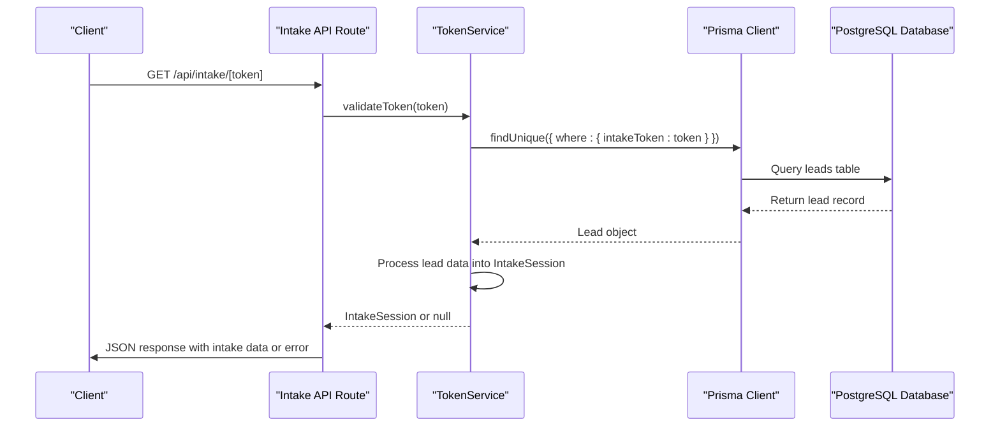
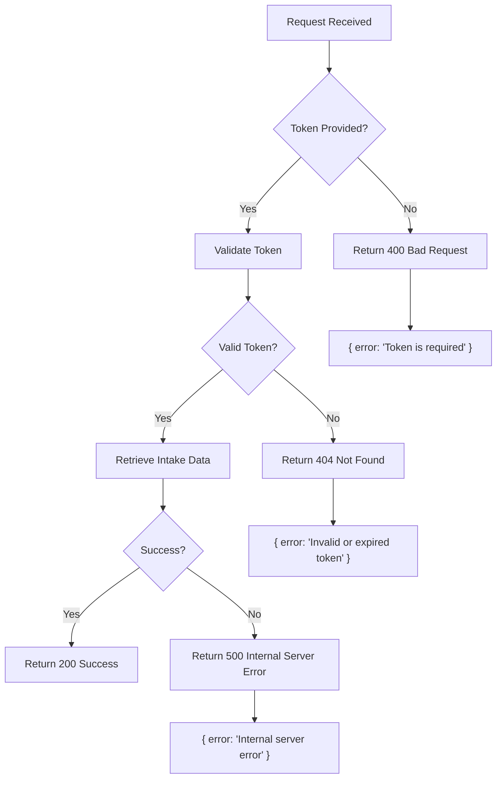
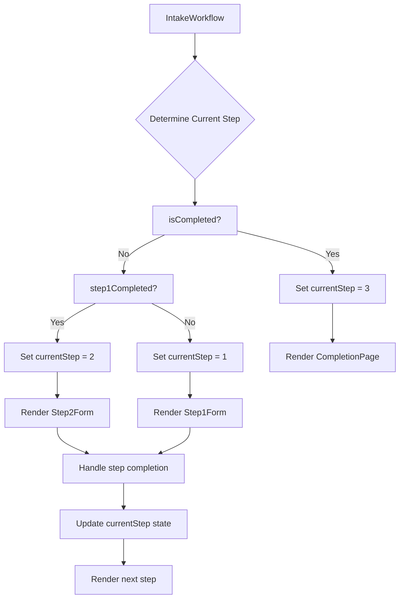
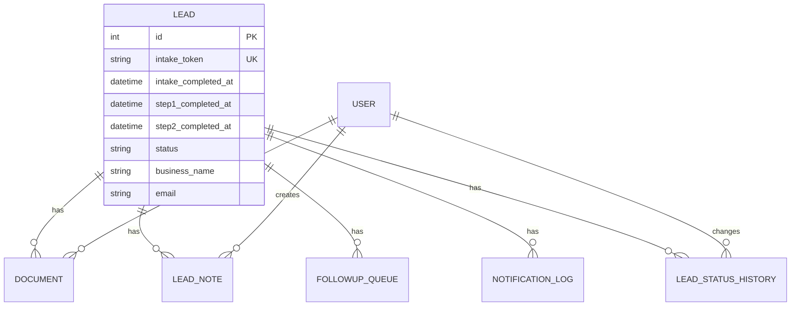

# Main Intake Route

<cite>
**Referenced Files in This Document**   
- [route.ts](file://src/app/api/intake/[token]/route.ts)
- [TokenService.ts](file://src/services/TokenService.ts)
- [IntakeWorkflow.tsx](file://src/components/intake/IntakeWorkflow.tsx)
- [page.tsx](file://src/app/application/[token]/page.tsx)
- [schema.prisma](file://prisma/schema.prisma)
</cite>

## Table of Contents
1. [Main Intake Route](#main-intake-route)
2. [Endpoint Implementation](#endpoint-implementation)
3. [Token Validation Process](#token-validation-process)
4. [Response Schema](#response-schema)
5. [Error Handling](#error-handling)
6. [Frontend Integration](#frontend-integration)
7. [Database Schema](#database-schema)
8. [Usage Example](#usage-example)

## Main Intake Route

The main intake route at `/api/intake/[token]` serves as the authentication gateway for prospective applicants in the funding application process. This endpoint validates a unique token to authenticate users and retrieve their current intake status, enabling a secure, stateless workflow for applicants to complete their funding application.

The route follows a token-based authentication pattern where each prospective applicant receives a unique, cryptographically secure token that grants access to their intake session. The endpoint handles GET requests to validate this token and return the applicant's current progress through the intake workflow, including which steps have been completed and associated lead data.

This route is a critical component of the application's security model, ensuring that only authorized users with valid tokens can access the intake process while maintaining a seamless user experience. The implementation leverages the TokenService for authentication logic and Prisma for database interactions, following a clean separation of concerns between the API layer and business logic.

**Section sources**
- [route.ts](file://src/app/api/intake/[token]/route.ts#L1-L38)

## Endpoint Implementation

The main intake route is implemented as a Next.js API route that handles GET requests to `/api/intake/[token]`, where `[token]` is a dynamic route parameter containing the unique intake token. The implementation follows the Next.js App Router pattern with server-side processing to validate the token and retrieve the applicant's intake status.

```typescript
import { NextRequest, NextResponse } from "next/server";
import { TokenService } from "@/services/TokenService";

export async function GET(
  request: NextRequest,
  { params }: { params: Promise<{ token: string }> }
) {
  try {
    const { token } = await params;

    if (!token) {
      return NextResponse.json({ error: "Token is required" }, { status: 400 });
    }

    // Validate the token and get intake session data
    const intakeSession = await TokenService.validateToken(token);

    if (!intakeSession) {
      return NextResponse.json(
        { error: "Invalid or expired token" },
        { status: 404 }
      );
    }

    // Return the intake session data
    return NextResponse.json({
      success: true,
      data: intakeSession,
    });
  } catch (error) {
    console.error("Error retrieving intake session:", error);
    return NextResponse.json(
      { error: "Internal server error" },
      { status: 500 }
    );
  }
}
```

The endpoint implementation follows a straightforward flow:
1. Extract the token from the route parameters
2. Validate that a token was provided
3. Use TokenService to validate the token and retrieve intake session data
4. Return the intake session data if valid, or appropriate error responses if invalid

The route handles asynchronous operations with proper error handling, ensuring robust behavior even when unexpected errors occur. It returns JSON responses with appropriate HTTP status codes to communicate success or failure states to the client.

**Section sources**
- [route.ts](file://src/app/api/intake/[token]/route.ts#L1-L38)

## Token Validation Process

The token validation process is handled by the `TokenService.validateToken()` method, which authenticates prospective applicants by verifying their token against the database and retrieving their current intake status. This process involves querying the Prisma database to find a lead record with a matching intake token and constructing an intake session object with the applicant's progress and associated data.



**Diagram sources**
- [TokenService.ts](file://src/services/TokenService.ts#L67-L180)
- [route.ts](file://src/app/api/intake/[token]/route.ts#L1-L38)

The validation process works as follows:

1. The `validateToken` method queries the `lead` table using Prisma's `findUnique` function, searching for a record where the `intakeToken` field matches the provided token
2. The query selects specific fields from the lead record, including personal and business information, contact details, and system fields related to intake status
3. If no lead is found or the lead doesn't have an intake token, the method returns `null`, indicating an invalid or expired token
4. If a valid lead is found, the method determines the intake status by checking the timestamp fields:
   - `isCompleted`: true if `intakeCompletedAt` is not null
   - `step1Completed`: true if `step1CompletedAt` is not null
   - `step2Completed`: true if `step2CompletedAt` is not null
5. The method constructs and returns an `IntakeSession` object containing the lead ID, token, completion status flags, and the lead data

The token validation process is designed to be efficient with a single database query that retrieves all necessary information. It also includes error handling to catch any database errors and return `null` in such cases, which the API route then translates to a 500 Internal Server Error response.

**Section sources**
- [TokenService.ts](file://src/services/TokenService.ts#L67-L180)

## Response Schema

The main intake route returns a JSON response with a standardized schema that includes the intake session data for authenticated applicants. The response structure provides comprehensive information about the applicant's current state in the intake workflow, including completion status and associated lead data.

### Response Structure

The API returns responses in the following format:

```json
{
  "success": true,
  "data": {
    "leadId": 123,
    "token": "abc123def456...",
    "isValid": true,
    "isCompleted": false,
    "step1Completed": true,
    "step2Completed": false,
    "lead": {
      "id": 123,
      "email": "applicant@example.com",
      "phone": "5551234567",
      "firstName": "John",
      "lastName": "Doe",
      "businessName": "Doe Enterprises",
      // ... other lead fields
      "status": "PENDING"
    }
  }
}
```

### IntakeSession Interface

The response data conforms to the `IntakeSession` interface defined in the TokenService:

```typescript
export interface IntakeSession {
  leadId: number;
  token: string;
  isValid: boolean;
  isCompleted: boolean;
  step1Completed: boolean;
  step2Completed: boolean;
  lead: {
    id: number;
    // Contact Information
    email: string | null;
    phone: string | null;
    firstName: string | null;
    lastName: string | null;
    
    // Business Information
    businessName: string | null;
    dba: string | null;
    businessAddress: string | null;
    businessPhone: string | null;
    businessEmail: string | null;
    mobile: string | null;
    businessCity: string | null;
    businessState: string | null;
    businessZip: string | null;
    industry: string | null;
    yearsInBusiness: number | null;
    amountNeeded: string | null;
    monthlyRevenue: string | null;
    ownershipPercentage: string | null;
    taxId: string | null;
    stateOfInc: string | null;
    dateBusinessStarted: string | null;
    legalEntity: string | null;
    natureOfBusiness: string | null;
    hasExistingLoans: string | null;
    
    // Personal Information
    dateOfBirth: string | null;
    socialSecurity: string | null;
    personalAddress: string | null;
    personalCity: string | null;
    personalState: string | null;
    personalZip: string | null;
    legalName: string | null;
    
    status: string;
  };
}
```

The response schema is designed to provide all necessary information for the frontend to render the appropriate intake step and display relevant applicant data. The `data` field contains the `IntakeSession` object with key properties:
- `leadId`: The unique identifier for the lead record
- `token`: The intake token (same as provided in the request)
- `isValid`: Always true for successful responses
- `isCompleted`: Indicates if the entire intake process is complete
- `step1Completed`: Indicates if step 1 of the intake process is complete
- `step2Completed`: Indicates if step 2 of the intake process is complete
- `lead`: An object containing the lead's data including personal information, business details, and current status

**Section sources**
- [TokenService.ts](file://src/services/TokenService.ts#L6-L54)

## Error Handling

The main intake route implements comprehensive error handling to manage various failure scenarios and provide appropriate responses to clients. The endpoint handles both client-side errors (invalid requests) and server-side errors (system failures) with specific HTTP status codes and error messages.

### Error Response Types

The endpoint returns the following error responses:



**Diagram sources**
- [route.ts](file://src/app/api/intake/[token]/route.ts#L1-L38)

#### 400 Bad Request - Missing Token

When a request is made without a token parameter, the endpoint returns a 400 Bad Request response:

```json
{
  "error": "Token is required"
}
```

This occurs when the `[token]` parameter is missing from the URL path. The endpoint explicitly checks for the presence of the token and returns this error response immediately if the token is not provided.

#### 404 Not Found - Invalid or Expired Token

When a request contains an invalid or expired token, the endpoint returns a 404 Not Found response:

```json
{
  "error": "Invalid or expired token"
}
```

This response is returned when the `TokenService.validateToken()` method returns `null`, which occurs when:
- No lead record exists with the provided intake token
- The token exists but has been invalidated (e.g., intake process completed)
- The token has expired (though the current implementation doesn't have explicit token expiration)

#### 500 Internal Server Error - System Failure

When an unexpected error occurs during processing, the endpoint returns a 500 Internal Server Error response:

```json
{
  "error": "Internal server error"
}
```

This response is returned when any exception is thrown during the execution of the route handler, such as database connection issues or other runtime errors. The error is logged to the console for debugging purposes, but only a generic error message is returned to the client for security reasons.

The error handling implementation follows best practices by:
- Validating input parameters early in the request lifecycle
- Using appropriate HTTP status codes for different error types
- Providing descriptive error messages for client debugging
- Logging detailed error information on the server for troubleshooting
- Returning generic error messages for internal server errors to avoid exposing system details

**Section sources**
- [route.ts](file://src/app/api/intake/[token]/route.ts#L1-L38)

## Frontend Integration

The intake status data retrieved from the main intake route is used by the frontend `IntakeWorkflow` component to render the appropriate step in the application process. The `application/[token]/page.tsx` page serves as the entry point, validating the token and passing the intake session data to the `IntakeWorkflow` component.

### Application Page Integration

The application page at `/application/[token]` integrates with the intake API by directly using the `TokenService.validateToken()` method to authenticate the user and retrieve their intake status:

```typescript
export default async function IntakePage({ params }: IntakePageProps) {
  const { token } = params;

  // Validate token and get intake session data
  const intakeSession = await TokenService.validateToken(token);

  if (!intakeSession) {
    notFound();
  }

  return (
    <div className="min-h-screen bg-[#f8fafc]">
      <div className="container mx-auto px-4 py-8">
        <div className="max-w-4xl mx-auto">
          {/* Security badges and header */}
          <div className="bg-white rounded-xl shadow-xl overflow-hidden border border-gray-100">
            {/* Header Section */}
            <div className="bg-white px-8 py-6 border-b">
              {/* Logo and title */}
            </div>

            {/* Form Content */}
            <div className="p-8">
              <IntakeWorkflow intakeSession={intakeSession} />
            </div>
            
            {/* Footer */}
          </div>
        </div>
      </div>
    </div>
  );
}
```

### IntakeWorkflow Component Logic

The `IntakeWorkflow` component uses the intake session data to determine the current step and render the appropriate form:



**Diagram sources**
- [IntakeWorkflow.tsx](file://src/components/intake/IntakeWorkflow.tsx#L12-L95)
- [page.tsx](file://src/app/application/[token]/page.tsx#L1-L222)

The component's logic works as follows:

1. On initialization, the component determines the current step based on the intake session data:
   - If `isCompleted` is true, set current step to 3 (completion)
   - If `step1Completed` is true, set current step to 2 (document upload)
   - Otherwise, set current step to 1 (personal information)

2. The component renders a progress indicator showing the status of each step (completed, current, or upcoming) using visual cues like checkmarks and color coding.

3. Based on the current step, the component renders the appropriate form component:
   - Step 1: `Step1Form` for personal and business information
   - Step 2: `Step2Form` for document upload
   - Step 3: `CompletionPage` for successful submission

4. When a step is completed, callback functions update the component's state to advance to the next step, triggering a re-render with the new form.

This integration pattern allows for a seamless user experience where applicants can resume their application at any point, with the system automatically directing them to the correct step based on their progress. The token-based authentication ensures that each applicant can only access their own application data.

**Section sources**
- [IntakeWorkflow.tsx](file://src/components/intake/IntakeWorkflow.tsx#L12-L95)
- [page.tsx](file://src/app/application/[token]/page.tsx#L1-L222)

## Database Schema

The intake functionality is supported by the `Lead` model in the Prisma schema, which includes specific fields for managing the intake process, token authentication, and tracking completion status. These fields enable the system to securely authenticate applicants and maintain state throughout the intake workflow.

### Lead Model Intake Fields

The relevant fields in the `Lead` model for the intake process are:

```prisma
model Lead {
  // ... other fields
  
  // System fields for intake process
  status            LeadStatus @default(NEW)
  intakeToken       String?    @unique @map("intake_token")
  intakeCompletedAt DateTime?  @map("intake_completed_at")
  step1CompletedAt  DateTime?  @map("step1_completed_at")
  step2CompletedAt  DateTime?  @map("step2_completed_at")
  createdAt         DateTime   @default(now()) @map("created_at")
  updatedAt         DateTime   @updatedAt @map("updated_at")
  importedAt        DateTime   @default(now()) @map("imported_at")

  // ... relations
}
```

### Field Descriptions

- `intakeToken`: A unique, randomly generated string that serves as the authentication token for the intake process. Marked as unique to prevent duplication and nullable to allow for leads that haven't started intake.
- `intakeCompletedAt`: A timestamp that indicates when the entire intake process was completed. When null, the intake is incomplete; when set, it marks the completion time.
- `step1CompletedAt`: A timestamp that indicates when step 1 of the intake process was completed. Used to track progress through the multi-step workflow.
- `step2CompletedAt`: A timestamp that indicates when step 2 of the intake process was completed. Together with `step1CompletedAt`, this enables granular tracking of the applicant's progress.
- `status`: An enum field that tracks the overall status of the lead, with values like NEW, PENDING, IN_PROGRESS, COMPLETED, and REJECTED. This field is updated throughout the intake process.

### Database Relationships



**Diagram sources**
- [schema.prisma](file://prisma/schema.prisma#L78-L120)

The database schema is designed to support the token-based authentication flow and progressive completion of the intake process. The use of timestamp fields (`step1CompletedAt`, `step2CompletedAt`, `intakeCompletedAt`) rather than boolean flags allows for both state tracking and auditing of when each step was completed. The `intakeToken` field is indexed and constrained as unique for efficient lookups during authentication.

When a new lead is created, the intake token is generated and assigned through the `TokenService.generateTokenForLead()` method, which updates the lead record with a new token and sets the status to PENDING. As the applicant progresses through the intake steps, the corresponding timestamp fields are updated to reflect completion.

**Section sources**
- [schema.prisma](file://prisma/schema.prisma#L78-L120)

## Usage Example

### API Request Example

To retrieve the intake status for a prospective applicant, make a GET request to the intake endpoint with a valid token:

```bash
curl -X GET "http://localhost:3000/api/intake/abc123def456ghi789jkl012mno345pqr678stu901vwx234yz567" \
  -H "Content-Type: application/json"
```

### Successful Response

When the token is valid, the API returns a 200 OK response with the intake session data:

```json
{
  "success": true,
  "data": {
    "leadId": 123,
    "token": "abc123def456ghi789jkl012mno345pqr678stu901vwx234yz567",
    "isValid": true,
    "isCompleted": false,
    "step1Completed": true,
    "step2Completed": false,
    "lead": {
      "id": 123,
      "email": "john.doe@example.com",
      "phone": "5551234567",
      "firstName": "John",
      "lastName": "Doe",
      "businessName": "Doe Enterprises",
      "businessAddress": "123 Main St",
      "businessCity": "Anytown",
      "businessState": "CA",
      "businessZip": "12345",
      "industry": "Technology",
      "yearsInBusiness": 5,
      "amountNeeded": "50000",
      "monthlyRevenue": "20000",
      "status": "PENDING",
      "dateOfBirth": "1980-01-01",
      "socialSecurity": "XXX-XX-XXXX",
      "personalAddress": "456 Oak Ave",
      "personalCity": "Othertown",
      "personalState": "CA",
      "personalZip": "67890"
    }
  }
}
```

### Error Responses

If the token is missing:

```bash
curl -X GET "http://localhost:3000/api/intake/" \
  -H "Content-Type: application/json"
```

```json
{
  "error": "Token is required"
}
```

If the token is invalid or expired:

```bash
curl -X GET "http://localhost:3000/api/intake/invalid-token-123" \
  -H "Content-Type: application/json"
```

```json
{
  "error": "Invalid or expired token"
}
```

### Frontend Usage

The intake status data is used by the frontend to render the appropriate step in the workflow:

```typescript
// In the application page
const intakeSession = await TokenService.validateToken(token);

// In the IntakeWorkflow component
function IntakeWorkflow({ intakeSession }: IntakeWorkflowProps) {
  const [currentStep, setCurrentStep] = useState(() => {
    if (intakeSession.isCompleted) return 3;
    if (intakeSession.step1Completed) return 2;
    return 1;
  });
  
  // Render appropriate step based on currentStep
  return (
    <div>
      {currentStep === 1 && <Step1Form />}
      {currentStep === 2 && <Step2Form />}
      {currentStep === 3 && <CompletionPage />}
    </div>
  );
}
```

The API endpoint enables a seamless intake experience where applicants can resume their application at any point, with the system automatically directing them to the correct step based on their progress. The token-based authentication ensures secure access to the application process while maintaining a user-friendly experience.

**Section sources**
- [route.ts](file://src/app/api/intake/[token]/route.ts#L1-L38)
- [TokenService.ts](file://src/services/TokenService.ts#L6-L54)
- [IntakeWorkflow.tsx](file://src/components/intake/IntakeWorkflow.tsx#L12-L95)