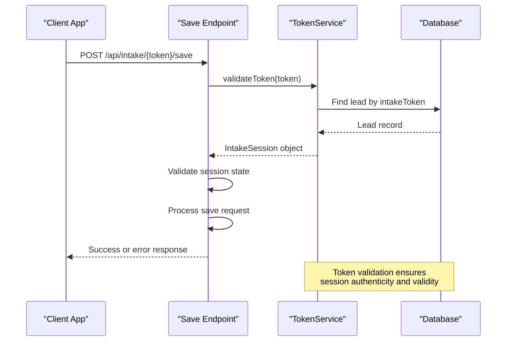
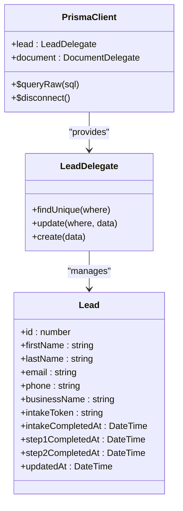

# Save Intake Progress

<cite>
**Referenced Files in This Document**   
- [route.ts](file://src/app/api/intake/[token]/save/route.ts)
- [Step1Form.tsx](file://src/components/intake/Step1Form.tsx)
- [IntakeWorkflow.tsx](file://src/components/intake/IntakeWorkflow.tsx)
- [TokenService.ts](file://src/services/TokenService.ts)
- [prisma.ts](file://src/lib/prisma.ts)
- [step1/route.ts](file://src/app/api/intake/[token]/step1/route.ts)
</cite>

## Table of Contents
1. [Save Intake Progress Endpoint Overview](#save-intake-progress-endpoint-overview)
2. [Request Structure and Validation](#request-structure-and-validation)
3. [Token Validation and Session Management](#token-validation-and-session-management)
4. [Data Persistence with Prisma](#data-persistence-with-prisma)
5. [Idempotent Nature and User Experience](#idempotent-nature-and-user-experience)
6. [Frontend Integration with IntakeWorkflow](#frontend-integration-with-intakeworkflow)
7. [Security Considerations and Data Expiration](#security-considerations-and-data-expiration)
8. [Response Format and Success Indicators](#response-format-and-success-indicators)

## Save Intake Progress Endpoint Overview

The save intake progress endpoint enables applicants to save partial intake progress and resume later. This functionality is critical for lengthy intake forms, allowing users to maintain their progress without losing data. The endpoint is implemented as a POST request handler located at `/src/app/api/intake/[token]/save/route.ts` and accepts incomplete form data from either step 1 or step 2 of the intake process.

The endpoint is designed to persist data without advancing the workflow state, meaning that saving progress does not mark any steps as completed. This allows users to return to the same step where they left off. The implementation uses a token-based authentication system to identify the applicant's session and associate the saved data with the correct Lead record.

The save functionality is currently focused on step 1 of the intake process, with plans to extend support to step 2 in future implementations. This incremental approach allows for focused development and testing of the save feature before expanding its scope. The endpoint is idempotent, meaning that multiple save requests with the same data will produce the same result without unintended side effects.

**Section sources**
- [route.ts](file://src/app/api/intake/[token]/save/route.ts#L0-L129)

## Request Structure and Validation

The save endpoint accepts a POST request with a JSON payload containing the step number and partial form data. The request structure is defined by the `SaveProgressData` interface, which includes a `step` field indicating which step of the intake process the data belongs to, and a `data` object containing the actual form fields.

```typescript
interface SaveProgressData {
  step: number;
  data: {
    firstName?: string;
    lastName?: string;
    email?: string;
    phone?: string;
    businessName?: string;
  };
}
```

The endpoint performs comprehensive validation on the incoming request. First, it validates the presence of the required `token` parameter in the URL path, which is used to identify the applicant's session. Then, it validates that both the `step` and `data` fields are present in the request body. For step 1, the endpoint validates that all required fields are present and properly formatted.

Field validation includes:
- **Email format validation** using a regular expression to ensure proper email syntax
- **Phone number format validation** with cleaning of special characters and format checking
- **Required field validation** to ensure essential fields are not empty

The validation process is designed to be user-friendly, returning specific error messages that can be displayed to the user to help them correct their input. This immediate feedback improves the user experience by preventing data loss due to validation errors.

**Section sources**
- [route.ts](file://src/app/api/intake/[token]/save/route.ts#L0-L129)

## Token Validation and Session Management

The save endpoint relies on token-based authentication to identify and validate the applicant's session. The token is extracted from the URL path parameter and validated using the `TokenService.validateToken()` method. This service checks whether the token exists in the database and is associated with a valid intake session.



**Diagram sources**
- [route.ts](file://src/app/api/intake/[token]/save/route.ts#L0-L129)
- [TokenService.ts](file://src/services/TokenService.ts#L0-L313)

**Section sources**
- [route.ts](file://src/app/api/intake/[token]/save/route.ts#L0-L129)
- [TokenService.ts](file://src/services/TokenService.ts#L0-L313)

The `IntakeSession` interface returned by the token validation includes critical information about the session state, such as whether the intake process is already completed (`isCompleted`), and the completion status of individual steps (`step1Completed`, `step2Completed`). This information is used to prevent saving progress on completed intakes.

The token validation process also checks if the intake process has already been completed. If so, the endpoint returns a 400 error with the message "Intake process has already been completed." This prevents users from modifying data after the intake process has been finalized.

## Data Persistence with Prisma

The save endpoint uses Prisma, an ORM (Object-Relational Mapping) tool, to persist data to the database. When valid data is received, the endpoint updates the corresponding Lead record using Prisma's `update` operation. This operation is targeted to the specific lead identified by the token validation process.

```typescript
await prisma.lead.update({
  where: { id: intakeSession.leadId },
  data: {
    firstName: body.data.firstName?.trim(),
    lastName: body.data.lastName?.trim(),
    email: body.data.email?.trim().toLowerCase(),
    phone: cleanPhone.replace(/^\+/, ""),
    businessName: body.data.businessName?.trim(),
    updatedAt: new Date(),
  },
});
```

The update operation is carefully designed to only modify the fields provided in the request, leaving other fields unchanged. This partial update approach ensures that users can save progress incrementally without affecting data they haven't modified. The operation also updates the `updatedAt` timestamp to reflect when the last modification occurred.

The Prisma client is configured with enhanced logging and error handling, particularly in development environments where query logging is enabled. The connection management includes proper cleanup on application shutdown to ensure database connections are properly closed.



**Diagram sources**
- [route.ts](file://src/app/api/intake/[token]/save/route.ts#L0-L129)
- [prisma.ts](file://src/lib/prisma.ts#L0-L61)

**Section sources**
- [route.ts](file://src/app/api/intake/[token]/save/route.ts#L0-L129)
- [prisma.ts](file://src/lib/prisma.ts#L0-L61)

## Idempotent Nature and User Experience

The save endpoint is designed to be idempotent, meaning that multiple identical requests will produce the same result as a single request. This property is essential for reliable auto-save functionality, as it ensures that repeated save operations do not create unintended side effects or data inconsistencies.

The idempotent nature of the endpoint improves user experience in several ways:
- **Network resilience**: If a save request fails due to network issues, the client can safely retry the request without risk of duplicating data or creating conflicts.
- **Auto-save reliability**: The frontend can implement frequent auto-save functionality without concern about the impact of multiple simultaneous save operations.
- **User confidence**: Users can manually save their progress multiple times without worrying about overwriting or corrupting their data.

The endpoint contributes significantly to the user experience for lengthy intake forms by eliminating the pressure to complete the entire process in one session. Applicants can save their progress at any point and return later to continue, reducing abandonment rates and improving completion rates.

The implementation specifically handles step 1 data for the initial release, with validation focused on the core contact and business information fields (firstName, lastName, email, phone, and businessName). This focused approach allows for thorough testing and optimization before expanding to more complex form sections.

**Section sources**
- [route.ts](file://src/app/api/intake/[token]/save/route.ts#L0-L129)

## Frontend Integration with IntakeWorkflow

The save endpoint is integrated with the frontend `IntakeWorkflow` component, which manages the multi-step intake process. The `IntakeWorkflow` component uses the `IntakeSession` data provided by the `TokenService` to determine the current state of the intake process and display the appropriate step.

```mermaid
flowchart TD
A[User Loads Application] --> B{IntakePage}
B --> C[IntakeWorkflow]
C --> D[TokenService.validateToken]
D --> E{Valid Session?}
E --> |Yes| F[Display Current Step]
E --> |No| G[Show Not Found]
F --> H[Step1Form or Step2Form]
H --> I[Auto-save or Manual Save]
I --> J[POST /api/intake/{token}/save]
J --> K[Update Lead Record]
K --> L[Continue or Resume Later]
```

**Diagram sources**
- [IntakeWorkflow.tsx](file://src/components/intake/IntakeWorkflow.tsx#L0-L96)
- [Step1Form.tsx](file://src/components/intake/Step1Form.tsx#L0-L399)
- [route.ts](file://src/app/api/intake/[token]/save/route.ts#L0-L129)

**Section sources**
- [IntakeWorkflow.tsx](file://src/components/intake/IntakeWorkflow.tsx#L0-L96)
- [Step1Form.tsx](file://src/components/intake/Step1Form.tsx#L0-L399)

The `Step1Form` component collects the applicant's information and could be enhanced to include auto-save functionality that periodically calls the save endpoint. Currently, the form includes a manual save mechanism through the "Continue to Step 2" button, which submits the data to the step1 endpoint rather than the save endpoint.

When resuming a saved intake, the application retrieves the applicant's data through the token validation process. The `IntakeSession` object returned by `TokenService.validateToken()` includes the pre-filled values from the Lead record, which are then used to initialize the form fields in the `Step1Form` component. This seamless resume capability ensures that users can pick up exactly where they left off.

## Security Considerations and Data Expiration

The save endpoint implements several security measures to protect applicant data:
- **Token validation**: Every request must include a valid token that is verified against the database
- **Session state checking**: The endpoint prevents saving progress on completed intakes
- **Input validation**: All incoming data is validated for format and completeness
- **Error handling**: Comprehensive error handling prevents information leakage in error messages

The token-based authentication system ensures that users can only access and modify their own intake data. The token is generated using a cryptographically secure random number generator, making it virtually impossible to guess or brute-force.

Regarding data expiration, the current implementation does not include explicit expiration policies for saved progress. However, the system relies on the fact that intake tokens are single-use and are consumed when the intake process is completed. The database schema includes timestamps for tracking when steps are completed (`step1CompletedAt`, `step2CompletedAt`, `intakeCompletedAt`), which could be used to implement expiration policies in the future.

Potential security enhancements could include:
- **Token expiration**: Implementing a time limit for how long a token remains valid
- **Rate limiting**: Preventing excessive save requests from a single user
- **Data encryption**: Encrypting sensitive fields in the database
- **Audit logging**: Tracking save operations for security monitoring

**Section sources**
- [route.ts](file://src/app/api/intake/[token]/save/route.ts#L0-L129)
- [TokenService.ts](file://src/services/TokenService.ts#L0-L313)

## Response Format and Success Indicators

The save endpoint returns a standardized JSON response format that indicates the success or failure of the operation. On successful save operations, the endpoint returns a 200 status code with a success response containing confirmation of the saved state.

```json
{
  "success": true,
  "message": "Progress saved successfully",
  "data": {
    "step": 1,
    "saved": true
  }
}
```

The response includes:
- **success**: A boolean indicating whether the operation was successful
- **message**: A human-readable message describing the result
- **data**: An object containing details about the saved progress, including the step number and confirmation of the save

For error conditions, the endpoint returns appropriate HTTP status codes and error messages:
- **400 Bad Request**: When required fields are missing or validation fails
- **404 Not Found**: When the token is invalid or expired
- **500 Internal Server Error**: When an unexpected server error occurs

The error responses include specific information about the nature of the error, which can be used by the frontend to provide helpful feedback to users. For example, when required fields are missing, the response includes a list of the missing fields, allowing the frontend to highlight them for the user.

The consistent response format makes it easy for the frontend to handle both success and error cases, providing a smooth user experience regardless of the outcome of the save operation.

**Section sources**
- [route.ts](file://src/app/api/intake/[token]/save/route.ts#L0-L129)