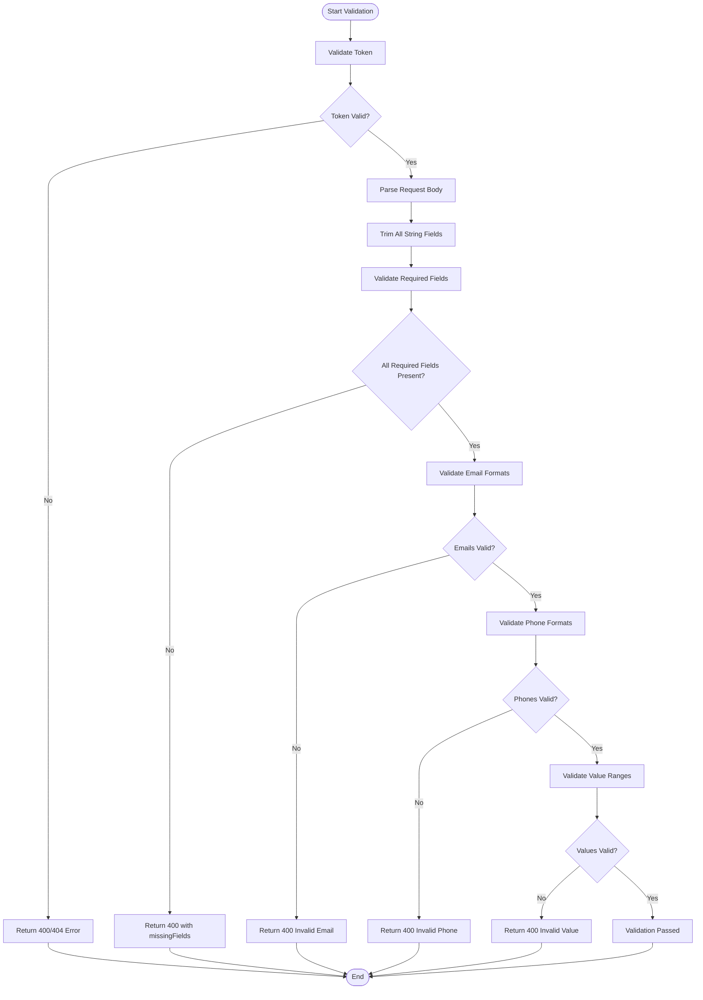
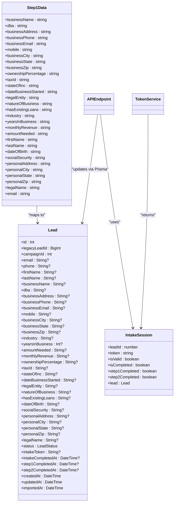
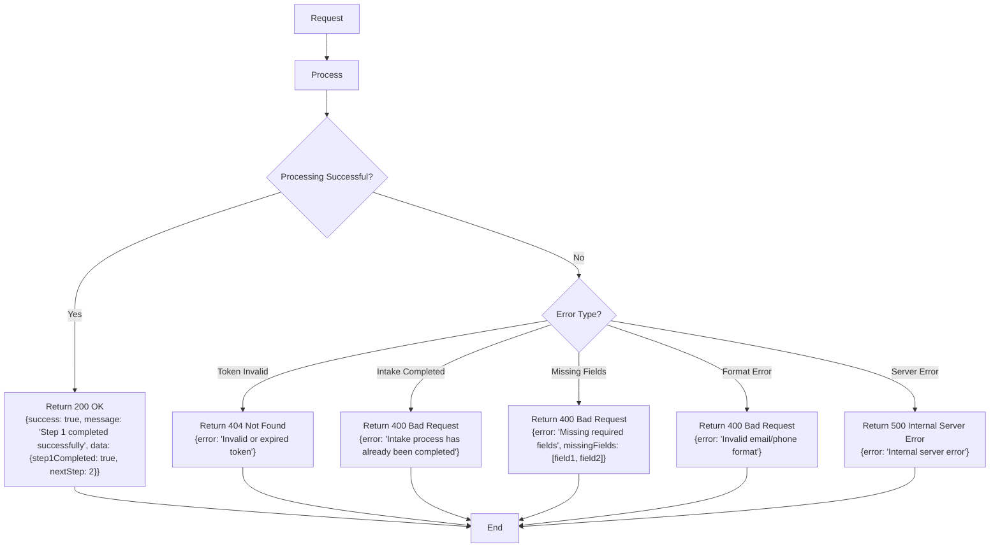
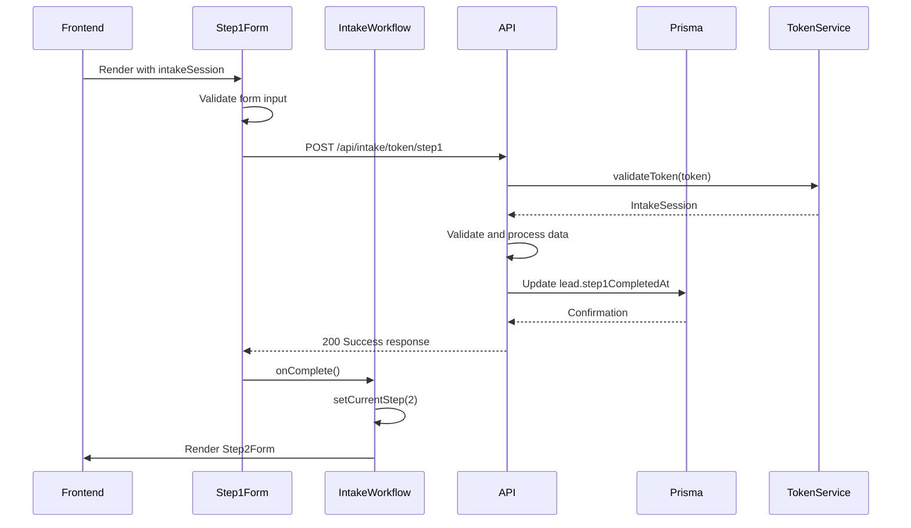
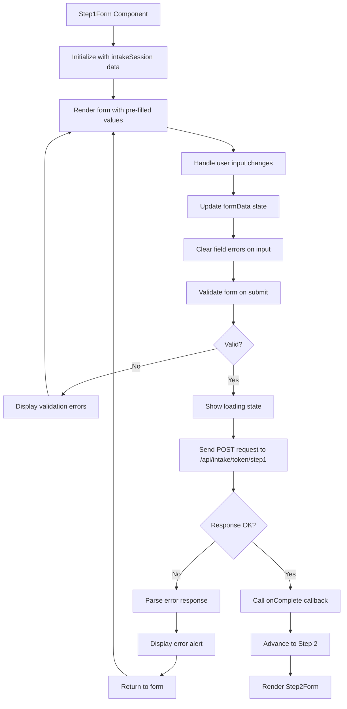

# Step 1: Business and Personal Information

<cite>
**Referenced Files in This Document**   
- [route.ts](file://src/app/api/intake/[token]/step1/route.ts)
- [Step1Form.tsx](file://src/components/intake/Step1Form.tsx)
- [schema.prisma](file://prisma/schema.prisma)
- [TokenService.ts](file://src/services/TokenService.ts)
</cite>

## Table of Contents
1. [Introduction](#introduction)
2. [POST Request Structure](#post-request-structure)
3. [Data Validation Rules](#data-validation-rules)
4. [Sensitive Data Sanitization](#sensitive-data-sanitization)
5. [Prisma Integration and Lead Model](#prisma-integration-and-lead-model)
6. [Response Format](#response-format)
7. [JSON Examples](#json-examples)
8. [Workflow Progression](#workflow-progression)
9. [Frontend Integration](#frontend-integration)

## Introduction
This document provides comprehensive documentation for the step1 intake endpoint, which collects business and personal information from applicants. The endpoint is part of a multi-step intake workflow for a business funding application system. It handles the collection of essential business details such as business name, EIN (tax ID), and address, along with personal information including owner name and SSN. The documentation covers the POST request structure, data validation rules, sensitive data handling, Prisma integration, response formats, and coordination with the frontend Step1Form component.

**Section sources**
- [route.ts](file://src/app/api/intake/[token]/step1/route.ts)
- [Step1Form.tsx](file://src/components/intake/Step1Form.tsx)

## POST Request Structure
The step1 intake endpoint accepts a POST request at the path `/api/intake/[token]/step1`, where `[token]` is a unique intake token that authenticates and identifies the applicant's session. The request body contains a JSON payload with business and personal information fields organized into three sections: Business Details, Personal Details, and Legal Information.

The required fields in the request include:
- **Business Details**: businessName, businessAddress, businessPhone, businessEmail, mobile, businessCity, businessState, businessZip, ownershipPercentage, taxId, stateOfInc, dateBusinessStarted, legalEntity, natureOfBusiness, hasExistingLoans, industry, yearsInBusiness, monthlyRevenue, amountNeeded
- **Personal Details**: firstName, lastName, dateOfBirth, socialSecurity, personalAddress, personalCity, personalState, personalZip
- **Legal Information**: legalName, email

The endpoint first validates the provided token using the TokenService before processing the request body. If the token is invalid, expired, or if the intake process has already been completed, appropriate error responses are returned.

```mermaid
sequenceDiagram
participant Frontend
participant API as /api/intake/[token]/step1
participant TokenService
participant Prisma
Frontend->>API : POST request with JSON payload
API->>TokenService : validateToken(token)
TokenService-->>API : IntakeSession or null
alt Token invalid
API-->>Frontend : 400/404 error response
return
end
API->>API : Parse and trim request body
API->>API : Validate required fields
alt Missing required fields
API-->>Frontend : 400 error with missingFields
return
end
API->>API : Validate email and phone formats
alt Invalid formats
API-->>Frontend : 400 error with format details
return
end
API->>API : Clean phone numbers for storage
API->>Prisma : Update lead with step 1 data
Prisma-->>API : Updated lead record
API-->>Frontend : 200 success response
```

**Diagram sources**
- [route.ts](file://src/app/api/intake/[token]/step1/route.ts)
- [TokenService.ts](file://src/services/TokenService.ts)

**Section sources**
- [route.ts](file://src/app/api/intake/[token]/step1/route.ts)

## Data Validation Rules
The step1 endpoint implements comprehensive data validation rules to ensure data integrity and consistency. Unlike the documentation objective's suggestion of using Zod, the system implements custom validation logic directly in the route handler.

The validation process includes:
1. **Token validation**: Ensures the intake token is valid and not expired
2. **Required field validation**: Checks for the presence of all required fields marked with an asterisk (*) in the specification
3. **Format validation**: Validates email and phone number formats using regular expressions
4. **Value range validation**: Ensures numerical values fall within acceptable ranges

The validation rules are implemented as follows:
- **Email validation**: Uses regex `/^[^'''\s@]+@[^'''\s@]+\.[^'''\s@]+$/` to validate both personal and business email formats
- **Phone validation**: Uses regex `/^[\d\s\-\(\)\+\.]{10,}$/` to validate business phone and mobile number formats
- **Ownership percentage**: Must be a number between 0 and 100
- **Years in business**: Must be an integer between 0 and 100
- **Dropdown selections**: Validates that required dropdown fields (amountNeeded, monthlyRevenue) have values selected

The validation occurs after trimming all string fields to remove leading and trailing whitespace. If any validation fails, the endpoint returns a 400 Bad Request response with specific error details.



**Diagram sources**
- [route.ts](file://src/app/api/intake/[token]/step1/route.ts)

**Section sources**
- [route.ts](file://src/app/api/intake/[token]/step1/route.ts)

## Sensitive Data Sanitization
The system implements several data sanitization measures to ensure data quality and security before persisting sensitive information to the database.

The sanitization process includes:
1. **String trimming**: All string fields are trimmed of leading and trailing whitespace using JavaScript's trim() method
2. **Phone number cleaning**: Phone numbers are cleaned by removing formatting characters (spaces, hyphens, parentheses, periods) using regex replacement
3. **Email normalization**: Email addresses are converted to lowercase before storage to ensure consistency
4. **Null handling**: Optional fields like DBA are explicitly set to null if empty

For phone numbers, the system removes all non-digit characters except the leading plus sign, which is also removed during the final storage process. This ensures consistent formatting in the database while preserving the original user input format in the application layer.

The system does not appear to implement additional security measures such as SSN masking or encryption at the application level, relying instead on database-level security and proper access controls. The social security number is stored as a plain string in the database, which represents a potential security consideration that should be evaluated.

**Section sources**
- [route.ts](file://src/app/api/intake/[token]/step1/route.ts)

## Prisma Integration and Lead Model
The step1 endpoint integrates with Prisma to update the Lead model with the collected business and personal information. The Lead model, defined in the Prisma schema, contains fields for both business and personal information, as well as system tracking fields.

Key fields in the Lead model relevant to step1 include:
- **Business Information**: businessName, dba, businessAddress, businessPhone, businessEmail, mobile, businessCity, businessState, businessZip, industry, yearsInBusiness, amountNeeded, monthlyRevenue, ownershipPercentage, taxId, stateOfInc, dateBusinessStarted, legalEntity, natureOfBusiness, hasExistingLoans
- **Personal Information**: dateOfBirth, socialSecurity, personalAddress, personalCity, personalState, personalZip, legalName
- **System fields**: step1CompletedAt, updatedAt

The endpoint uses Prisma's update method to modify the lead record identified by the intake session's leadId. When updating numerical fields like yearsInBusiness, the string input is parsed to an integer. The update operation also sets the step1CompletedAt timestamp to the current date and time, indicating that step 1 of the intake process has been completed.



**Diagram sources**
- [schema.prisma](file://prisma/schema.prisma)
- [route.ts](file://src/app/api/intake/[token]/step1/route.ts)
- [TokenService.ts](file://src/services/TokenService.ts)

**Section sources**
- [schema.prisma](file://prisma/schema.prisma)
- [route.ts](file://src/app/api/intake/[token]/step1/route.ts)

## Response Format
The step1 endpoint returns JSON responses with different formats depending on the outcome of the request processing.

For successful submissions, the endpoint returns a 200 OK status with a JSON response containing:
- **success**: Boolean indicating the operation was successful
- **message**: Descriptive message about the outcome
- **data**: Object containing step completion status and next step information

For error conditions, the endpoint returns appropriate HTTP status codes with JSON error details:
- **400 Bad Request**: For missing token, completed intake, or validation errors
- **404 Not Found**: For invalid or expired tokens
- **500 Internal Server Error**: For unexpected server errors

The error responses include an "error" field with a descriptive message, and in the case of validation errors, a "missingFields" array listing the required fields that were not provided.



**Diagram sources**
- [route.ts](file://src/app/api/intake/[token]/step1/route.ts)

**Section sources**
- [route.ts](file://src/app/api/intake/[token]/step1/route.ts)

## JSON Examples
### Valid Request Payload
```json
{
  "businessName": "ABC Corporation",
  "dba": "ABC Tech",
  "businessAddress": "123 Main Street",
  "businessPhone": "(555) 123-4567",
  "businessEmail": "info@abccorp.com",
  "mobile": "555-987-6543",
  "businessCity": "New York",
  "businessState": "NY",
  "businessZip": "10001",
  "ownershipPercentage": "100",
  "taxId": "12-3456789",
  "stateOfInc": "DE",
  "dateBusinessStarted": "2020-01-15",
  "legalEntity": "Corporation",
  "natureOfBusiness": "Technology",
  "hasExistingLoans": "No",
  "industry": "Software Development",
  "yearsInBusiness": "5",
  "monthlyRevenue": "50000-100000",
  "amountNeeded": "100000-250000",
  "firstName": "John",
  "lastName": "Doe",
  "dateOfBirth": "1980-05-15",
  "socialSecurity": "123-45-6789",
  "personalAddress": "456 Oak Avenue",
  "personalCity": "Brooklyn",
  "personalState": "NY",
  "personalZip": "11201",
  "legalName": "John Doe",
  "email": "john.doe@email.com"
}
```

### Sample Error Response
```json
{
  "error": "Missing required fields",
  "missingFields": [
    "businessName",
    "businessAddress",
    "businessPhone",
    "socialSecurity"
  ]
}
```

**Section sources**
- [route.ts](file://src/app/api/intake/[token]/step1/route.ts)

## Workflow Progression
The successful submission of step 1 advances the intake workflow to step 2 through a combination of backend updates and frontend coordination. On the backend, the endpoint updates the Lead model by setting the step1CompletedAt field to the current timestamp, which serves as a marker that step 1 has been completed.

The TokenService plays a crucial role in this workflow progression by providing intake session status information. After step 1 is completed, the TokenService will return an IntakeSession object with step1Completed set to true. This information is used by the frontend to determine the current step in the workflow.

The response from the step1 endpoint includes a success indicator and next step information, which the frontend uses to navigate to step 2. The Step1Form component's onComplete callback triggers the IntakeWorkflow component to update its state and render the Step2Form component.

This progression mechanism ensures that applicants cannot skip steps in the intake process and that each step is completed in sequence. The system also prevents re-submission of completed steps by checking the isCompleted flag in the intake session.



**Diagram sources**
- [route.ts](file://src/app/api/intake/[token]/step1/route.ts)
- [Step1Form.tsx](file://src/components/intake/Step1Form.tsx)
- [IntakeWorkflow.tsx](file://src/components/intake/IntakeWorkflow.tsx)
- [TokenService.ts](file://src/services/TokenService.ts)

**Section sources**
- [route.ts](file://src/app/api/intake/[token]/step1/route.ts)
- [Step1Form.tsx](file://src/components/intake/Step1Form.tsx)
- [IntakeWorkflow.tsx](file://src/components/intake/IntakeWorkflow.tsx)

## Frontend Integration
The step1 intake endpoint is closely coordinated with the Step1Form frontend component, which provides the user interface for collecting business and personal information. The Step1Form is a client-side React component that manages form state, performs client-side validation, and handles the submission process.

Key integration points between the frontend and backend include:
- **Form initialization**: The Step1Form pre-fills form fields with existing data from the intake session, allowing applicants to resume incomplete applications
- **Client-side validation**: The component implements real-time validation feedback, displaying error messages when required fields are empty or formats are invalid
- **Submission handling**: On form submission, the component sends the data to the step1 endpoint via fetch API and handles success and error responses
- **Error feedback**: The component displays user-friendly error messages based on the API response, including specific guidance for missing fields

The Step1Form organizes fields into three logical sections (Business Details, Personal Details, and Legal Information) with appropriate input types and validation rules. It uses controlled components to manage form state and provides immediate feedback when users begin typing in fields with previous errors.

The integration between the frontend and backend ensures a seamless user experience while maintaining data integrity through dual validation (client-side and server-side) and proper error handling.



**Diagram sources**
- [Step1Form.tsx](file://src/components/intake/Step1Form.tsx)

**Section sources**
- [Step1Form.tsx](file://src/components/intake/Step1Form.tsx)