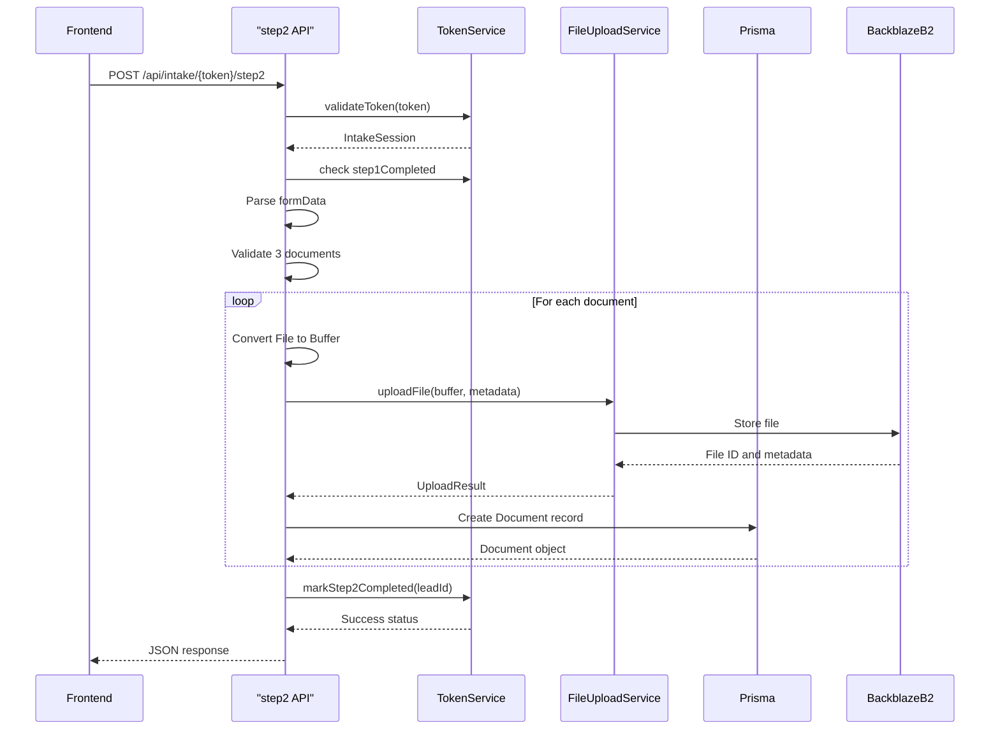
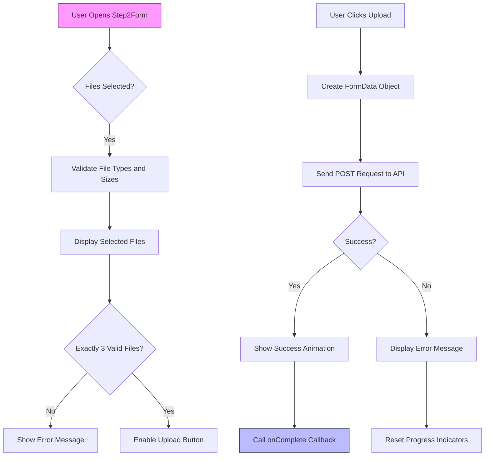
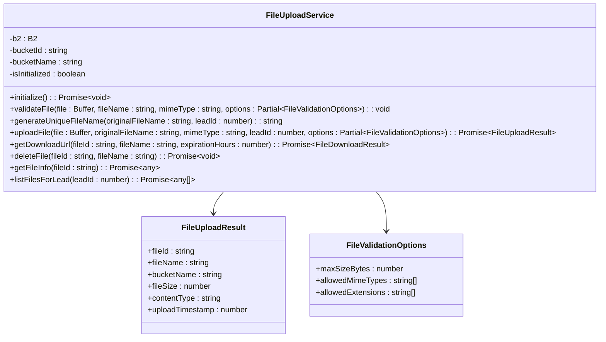
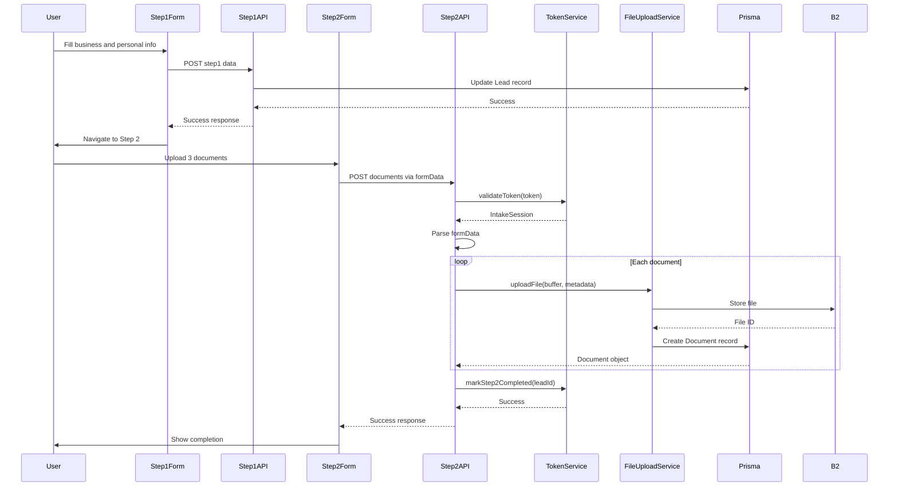
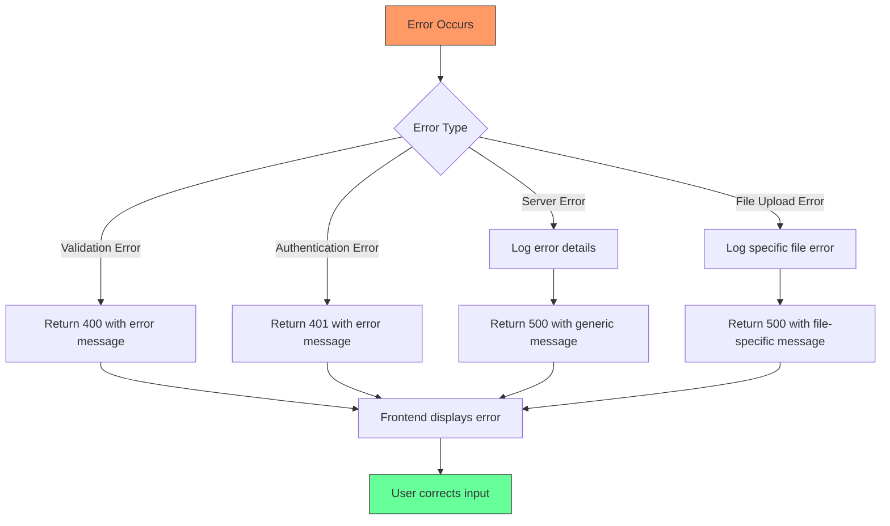

# Step 2: Additional Information and Document Upload

<cite>
**Referenced Files in This Document**   
- [route.ts](file://src/app/api/intake/[token]/step2/route.ts)
- [Step2Form.tsx](file://src/components/intake/Step2Form.tsx)
- [FileUploadService.ts](file://src/services/FileUploadService.ts)
- [TokenService.ts](file://src/services/TokenService.ts)
- [schema.prisma](file://prisma/schema.prisma)
- [step1/route.ts](file://src/app/api/intake/[token]/step1/route.ts)
- [Step1Form.tsx](file://src/components/intake/Step1Form.tsx)
</cite>

## Table of Contents
1. [Introduction](#introduction)
2. [API Endpoint Implementation](#api-endpoint-implementation)
3. [Frontend Implementation](#frontend-implementation)
4. [File Upload Service](#file-upload-service)
5. [Data Model Structure](#data-model-structure)
6. [End-to-End Process Flow](#end-to-end-process-flow)
7. [Error Handling](#error-handling)
8. [Security and Validation](#security-and-validation)
9. [Example Usage](#example-usage)

## Introduction
This document provides comprehensive documentation for the step2 intake endpoint responsible for collecting additional applicant information and processing document uploads. The endpoint handles multipart form-data requests containing financial documents and updates the applicant's status in the system. This process follows the initial information collection in step1 and completes the intake workflow.

**Section sources**
- [route.ts](file://src/app/api/intake/[token]/step2/route.ts)
- [Step2Form.tsx](file://src/components/intake/Step2Form.tsx)

## API Endpoint Implementation

The step2 endpoint is implemented as a Next.js API route that processes document uploads and completes the intake process. The endpoint validates the intake token, ensures step1 has been completed, processes uploaded files, and marks step2 as completed.



**Diagram sources**
- [route.ts](file://src/app/api/intake/[token]/step2/route.ts)

**Section sources**
- [route.ts](file://src/app/api/intake/[token]/step2/route.ts)

## Frontend Implementation

The Step2Form component manages the file input and submission process on the client side. It provides a drag-and-drop interface for uploading exactly three financial documents, with client-side validation for file types and sizes.



**Diagram sources**
- [Step2Form.tsx](file://src/components/intake/Step2Form.tsx)

**Section sources**
- [Step2Form.tsx](file://src/components/intake/Step2Form.tsx)

## File Upload Service

The FileUploadService handles secure storage of documents in Backblaze B2. It validates files against size and type restrictions, generates unique filenames to prevent conflicts, and stores metadata in the application database.



**Diagram sources**
- [FileUploadService.ts](file://src/services/FileUploadService.ts)

**Section sources**
- [FileUploadService.ts](file://src/services/FileUploadService.ts)

## Data Model Structure

The data model includes the Lead and Document entities with a one-to-many relationship. Document metadata is stored in the database while the actual files are stored in Backblaze B2.

```mermaid
erDiagram
LEAD {
Int id PK
String intakeToken UK
DateTime step1CompletedAt
DateTime step2CompletedAt
DateTime intakeCompletedAt
String status
String businessName
String monthlyRevenue
String amountNeeded
}
DOCUMENT {
Int id PK
Int leadId FK
String filename
String originalFilename
Int fileSize
String mimeType
String b2FileId
String b2BucketName
Int uploadedBy FK
DateTime uploadedAt
}
LEAD ||--o{ DOCUMENT : "has"
```



**Diagram sources**
- [schema.prisma](file://prisma/schema.prisma)

**Section sources**
- [schema.prisma](file://prisma/schema.prisma)

## End-to-End Process Flow

The complete process from initial information collection to document upload and intake completion involves multiple components working together.



**Diagram sources**
- [step1/route.ts](file://src/app/api/intake/[token]/step1/route.ts)
- [route.ts](file://src/app/api/intake/[token]/step2/route.ts)
- [Step1Form.tsx](file://src/components/intake/Step1Form.tsx)
- [Step2Form.tsx](file://src/components/intake/Step2Form.tsx)

**Section sources**
- [step1/route.ts](file://src/app/api/intake/[token]/step1/route.ts)
- [route.ts](file://src/app/api/intake/[token]/step2/route.ts)

## Error Handling

The system implements comprehensive error handling at both the frontend and backend levels to provide clear feedback to users and maintain system stability.



**Diagram sources**
- [route.ts](file://src/app/api/intake/[token]/step2/route.ts)
- [Step2Form.tsx](file://src/components/intake/Step2Form.tsx)

**Section sources**
- [route.ts](file://src/app/api/intake/[token]/step2/route.ts)
- [Step2Form.tsx](file://src/components/intake/Step2Form.tsx)

## Security and Validation

The document upload process includes multiple layers of security and validation to protect against malicious uploads and ensure data integrity.

### Validation Rules
- **File Count**: Exactly 3 documents required
- **File Types**: Only PDF, JPG, PNG, and DOCX allowed
- **File Size**: Maximum 10MB per file
- **Token Validation**: Must be valid and not expired
- **Step Order**: Step 1 must be completed first
- **Duplicate Prevention**: Step 2 cannot be completed twice

The system validates files on both client and server sides to prevent malicious uploads. Client-side validation provides immediate feedback, while server-side validation ensures security even if client validation is bypassed.

**Section sources**
- [FileUploadService.ts](file://src/services/FileUploadService.ts)
- [route.ts](file://src/app/api/intake/[token]/step2/route.ts)
- [Step2Form.tsx](file://src/components/intake/Step2Form.tsx)

## Example Usage

### cURL Example
```bash
curl -X POST \
  http://localhost:3000/api/intake/abc123xyz/step2 \
  -H "Content-Type: multipart/form-data" \
  -F "documents=@/path/to/statement1.pdf" \
  -F "documents=@/path/to/statement2.pdf" \
  -F "documents=@/path/to/statement3.pdf"
```

### Successful Response
```json
{
  "success": true,
  "message": "Documents uploaded successfully",
  "documents": [
    {
      "id": 123,
      "originalFilename": "statement1.pdf",
      "fileSize": 154289,
      "mimeType": "application/pdf",
      "uploadedAt": "2025-08-26T12:00:00.000Z"
    },
    {
      "id": 124,
      "originalFilename": "statement2.pdf",
      "fileSize": 205678,
      "mimeType": "application/pdf",
      "uploadedAt": "2025-08-26T12:00:01.000Z"
    },
    {
      "id": 125,
      "originalFilename": "statement3.pdf",
      "fileSize": 189456,
      "mimeType": "application/pdf",
      "uploadedAt": "2025-08-26T12:00:02.000Z"
    }
  ]
}
```

### Error Response
```json
{
  "error": "Exactly 3 documents are required"
}
```

**Section sources**
- [route.ts](file://src/app/api/intake/[token]/step2/route.ts)
- [Step2Form.tsx](file://src/components/intake/Step2Form.tsx)