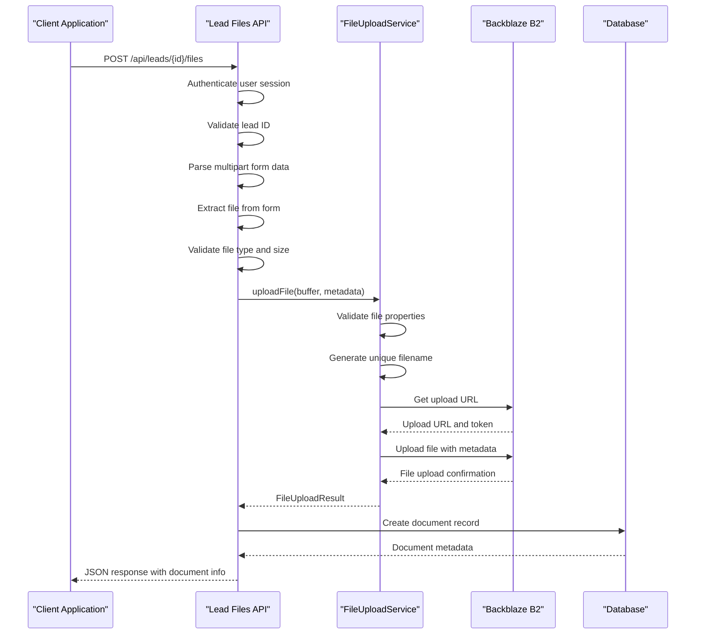
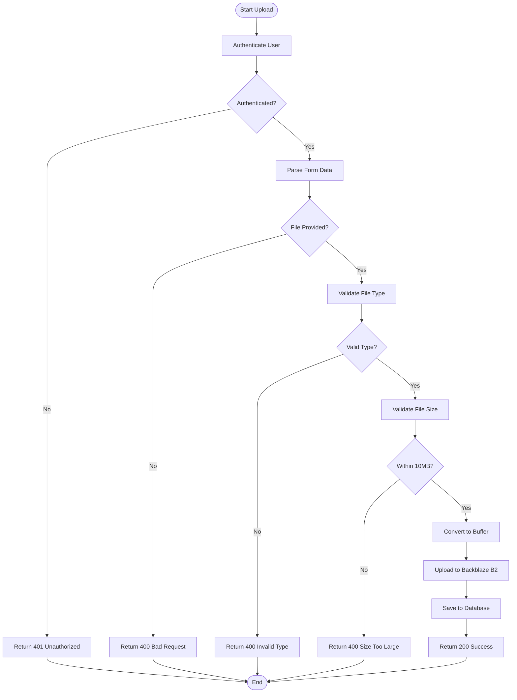
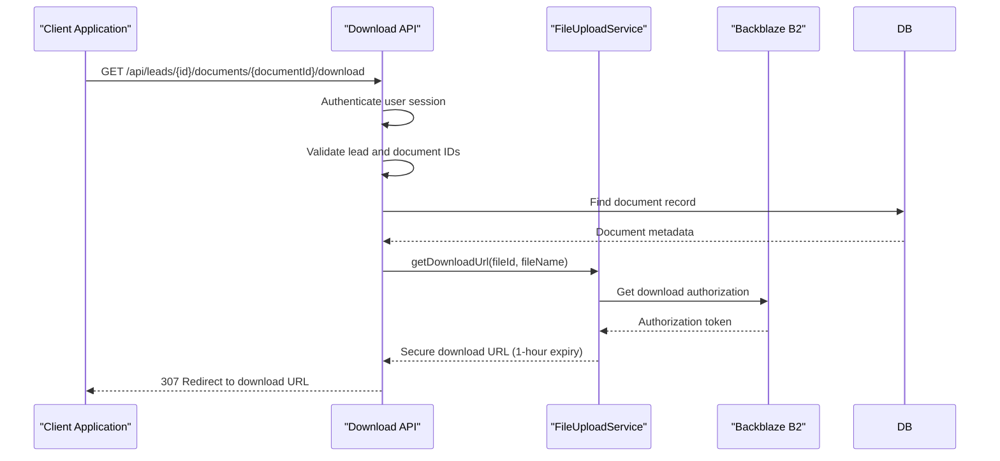
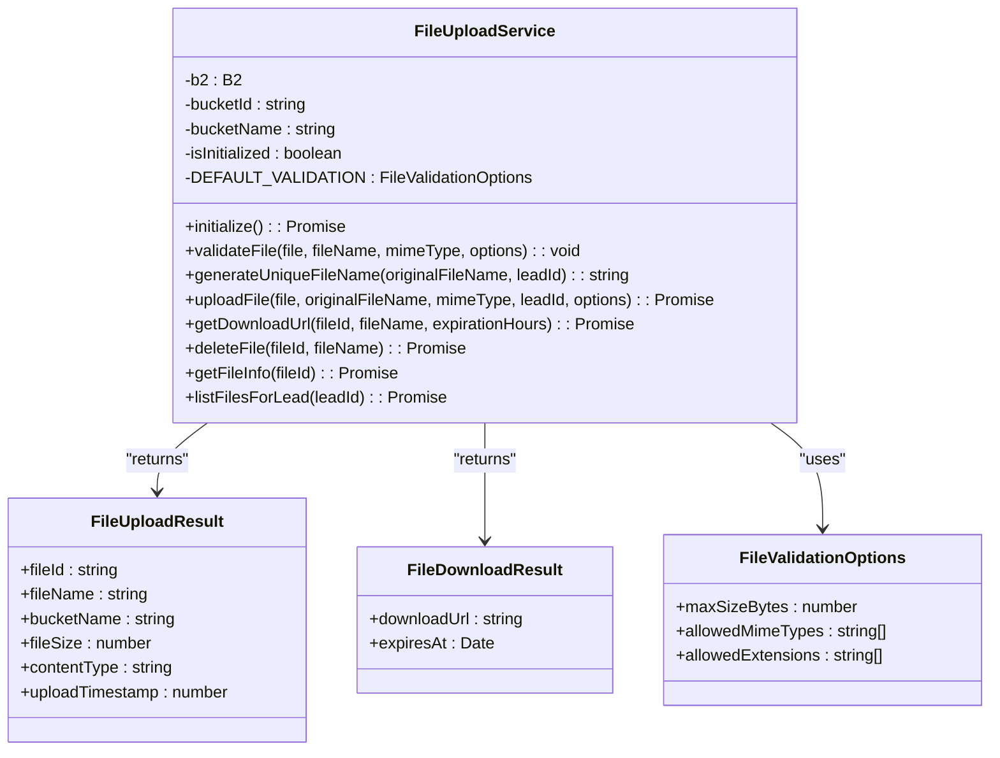
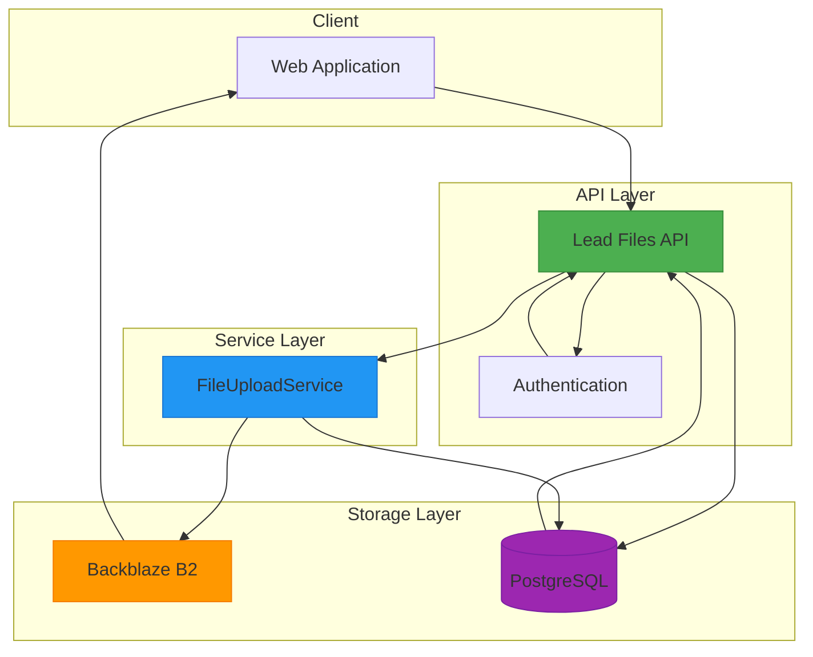

# Lead Files API

<cite>
**Referenced Files in This Document**   
- [route.ts](file://src/app/api/leads/[id]/files/route.ts)
- [FileUploadService.ts](file://src/services/FileUploadService.ts)
- [route.ts](file://src/app/api/leads/[id]/documents/[documentId]/download/route.ts)
- [schema.prisma](file://prisma/schema.prisma)
- [auth.ts](file://src/lib/auth.ts)
</cite>

## Table of Contents
1. [Introduction](#introduction)
2. [API Endpoints Overview](#api-endpoints-overview)
3. [File Upload Process](#file-upload-process)
4. [File Listing and Download](#file-listing-and-download)
5. [Data Model and Schema](#data-model-and-schema)
6. [Security and Access Control](#security-and-access-control)
7. [Error Handling](#error-handling)
8. [Integration with Backblaze B2](#integration-with-backblaze-b2)
9. [Usage Examples](#usage-examples)
10. [Architecture Diagram](#architecture-diagram)

## Introduction

The Lead Files API provides RESTful endpoints for managing document uploads and retrievals associated with leads in the merchant funding platform. This documentation details the implementation of file operations including uploading new documents, listing existing files, and downloading stored documents. The system integrates with Backblaze B2 for secure cloud storage while maintaining metadata in a PostgreSQL database through Prisma ORM. The API enforces strict access controls and file validation to ensure data integrity and security.

## API Endpoints Overview

The Lead Files API exposes the following endpoints for document management:

- **POST /api/leads/[id]/files**: Upload a new document to a lead
- **GET /api/leads/[id]/files**: List all documents for a lead (not implemented in current code)
- **DELETE /api/leads/[id]/files**: Delete a document from a lead
- **GET /api/leads/[id]/documents/[documentId]/download**: Download a specific document

The primary focus of this documentation is on the file upload (POST) and download functionality, including their integration with the FileUploadService and Backblaze B2 storage backend.

**Section sources**
- [route.ts](file://src/app/api/leads/[id]/files/route.ts)
- [route.ts](file://src/app/api/leads/[id]/documents/[documentId]/download/route.ts)

## File Upload Process

The file upload process handles document submissions through a multipart form data request. The system validates the file before storing it in Backblaze B2 and recording metadata in the database.

### Multipart Form Data Requirements

When uploading a file, clients must use multipart/form-data encoding with the following requirements:

- **Field name**: `file` (the file content)
- **File types**: PDF, JPG, PNG, DOCX only
- **Size limit**: 10MB maximum
- **Required authentication**: Valid user session

### Upload Workflow



**Diagram sources**
- [route.ts](file://src/app/api/leads/[id]/files/route.ts#L25-L133)
- [FileUploadService.ts](file://src/services/FileUploadService.ts#L100-L180)

**Section sources**
- [route.ts](file://src/app/api/leads/[id]/files/route.ts#L25-L133)
- [FileUploadService.ts](file://src/services/FileUploadService.ts#L100-L180)

### File Validation

The system enforces strict validation on uploaded files:

- **Accepted file types**: 
  - `application/pdf` (PDF)
  - `image/jpeg` (JPG/JPEG)
  - `image/png` (PNG)
  - `application/vnd.openxmlformats-officedocument.wordprocessingml.document` (DOCX)
- **Size limit**: 10MB (10,485,760 bytes)
- **Extension validation**: .pdf, .jpg, .jpeg, .png, .docx
- **Content validation**: Empty files are rejected

The validation occurs at two levels:
1. API route level (immediate rejection of invalid files)
2. FileUploadService level (comprehensive validation)



**Diagram sources**
- [route.ts](file://src/app/api/leads/[id]/files/route.ts#L25-L133)
- [FileUploadService.ts](file://src/services/FileUploadService.ts#L50-L98)

## File Listing and Download

The API provides functionality to download documents associated with leads. While a GET endpoint for listing documents is not explicitly implemented in the current code, the download functionality is fully operational.

### Document Download Process



**Diagram sources**
- [route.ts](file://src/app/api/leads/[id]/documents/[documentId]/download/route.ts#L15-L75)
- [FileUploadService.ts](file://src/services/FileUploadService.ts#L182-L205)

**Section sources**
- [route.ts](file://src/app/api/leads/[id]/documents/[documentId]/download/route.ts#L15-L75)
- [FileUploadService.ts](file://src/services/FileUploadService.ts#L182-L205)

### Download Security Features

The download system implements several security measures:

- **Authentication requirement**: Users must be logged in to download files
- **Authorization check**: Users can only download documents from leads they have access to
- **Time-limited URLs**: Download links expire after 1 hour
- **Direct B2 authorization**: Files are served directly from Backblaze B2 with temporary authorization tokens

## Data Model and Schema

The document storage system uses a relational database model to track file metadata while storing the actual file content in Backblaze B2.

### Document Database Schema

```erDiagram
  DOCUMENT {
    int id PK
    int lead_id FK
    string filename
    string original_filename
    int file_size
    string mime_type
    string b2_file_id
    string b2_bucket_name
    int uploaded_by FK
    timestamp uploaded_at
  }

  LEAD ||--o{ DOCUMENT : "has"
  USER ||--o{ DOCUMENT : "uploads"
```

**Diagram sources**
- [schema.prisma](file://prisma/schema.prisma#L200-L220)

### Document Model Fields

The Document model in Prisma defines the following fields:

- **id**: Primary key (auto-incrementing integer)
- **leadId**: Foreign key to the Lead model
- **filename**: System-generated unique filename in B2 storage
- **originalFilename**: Original filename provided by the user
- **fileSize**: File size in bytes
- **mimeType**: MIME type of the file
- **b2FileId**: Backblaze B2 file identifier
- **b2BucketName**: Name of the B2 bucket where file is stored
- **uploadedBy**: Foreign key to the User who uploaded the file
- **uploadedAt**: Timestamp of upload (defaults to current time)

**Section sources**
- [schema.prisma](file://prisma/schema.prisma#L200-L220)
- [route.ts](file://src/app/api/leads/[id]/files/route.ts#L115-L125)

### Response Schema

When a file is successfully uploaded, the API returns a JSON response with the following structure:

```json
{
  "document": {
    "id": 123,
    "leadId": 456,
    "filename": "leads/456/1719456789123-abcd1234-bank_statement.pdf",
    "originalFilename": "bank_statement.pdf",
    "fileSize": 1024000,
    "mimeType": "application/pdf",
    "b2FileId": "b2f1234567890",
    "b2BucketName": "merchant-funding-documents",
    "uploadedBy": 789,
    "uploadedAt": "2025-06-27T10:30:00.000Z",
    "user": {
      "id": 789,
      "email": "user@example.com"
    }
  }
}
```

The response includes both the database-stored metadata and the associated user information.

## Security and Access Control

The Lead Files API implements a comprehensive security model to protect sensitive document data.

### Authentication Mechanism

The system uses Next-Auth for authentication with a credentials provider:

```mermaid
classDiagram
class AuthOptions {
+adapter : PrismaAdapter
+providers : CredentialsProvider[]
+session : {strategy : "jwt"}
+callbacks : {jwt(), session()}
+pages : {signIn : "/auth/signin"}
}
class CredentialsProvider {
+name : "credentials"
+credentials : {email, password}
+authorize(credentials) : User | null
}
class User {
+id : string
+email : string
+role : UserRole
}
AuthOptions --> CredentialsProvider : "uses"
CredentialsProvider --> User : "returns"
AuthOptions --> User : "via PrismaAdapter"
```

**Diagram sources**
- [auth.ts](file://src/lib/auth.ts#L10-L70)
- [route.ts](file://src/app/api/leads/[id]/files/route.ts#L7-L10)

### Access Control Rules

The API enforces the following access control rules:

- **Authentication required**: All file operations require a valid user session
- **Lead ownership verification**: Users can only upload to existing leads
- **Document ownership**: The system records which user uploaded each document
- **Role-based access**: While not explicitly enforced in the file API, the authentication system supports role-based access (ADMIN, USER)

The middleware configuration shows that API routes (except auth routes) are protected:

```typescript
// Protect dashboard and API routes (except auth routes)
if (pathname.startsWith("/dashboard") || 
    (pathname.startsWith("/api") && !pathname.startsWith("/api/auth"))) {
  if (!token) {
    return NextResponse.redirect(new URL("/auth/signin", req.url));
  }
}
```

**Section sources**
- [auth.ts](file://src/lib/auth.ts#L10-L70)
- [middleware.ts](file://src/middleware.ts#L128-L135)

## Error Handling

The API implements comprehensive error handling for various failure scenarios.

### Error Response Schema

All error responses follow a consistent format:

```json
{
  "error": "Descriptive error message"
}
```

With appropriate HTTP status codes:
- **400 Bad Request**: Invalid input parameters
- **401 Unauthorized**: Missing or invalid authentication
- **404 Not Found**: Lead or document not found
- **500 Internal Server Error**: Unexpected server errors

### Common Error Conditions

**Invalid file type**:
```json
{
  "error": "Invalid file type. Only PDF, JPG, PNG, and DOCX files are allowed."
}
```
Status: 400

**File size too large**:
```json
{
  "error": "File size too large. Maximum size is 10MB."
}
```
Status: 400

**No file provided**:
```json
{
  "error": "No file provided"
}
```
Status: 400

**Invalid lead ID**:
```json
{
  "error": "Invalid lead ID"
}
```
Status: 400

**Lead not found**:
```json
{
  "error": "Lead not found"
}
```
Status: 404

**Unauthorized access**:
```json
{
  "error": "Unauthorized"
}
```
Status: 401

The system logs all errors with contextual information for debugging and auditing purposes.

**Section sources**
- [route.ts](file://src/app/api/leads/[id]/files/route.ts#L25-L133)
- [route.ts](file://src/app/api/leads/[id]/documents/[documentId]/download/route.ts#L15-L75)

## Integration with Backblaze B2

The FileUploadService provides a wrapper around the Backblaze B2 SDK, handling the integration with the cloud storage service.

### FileUploadService Architecture



**Diagram sources**
- [FileUploadService.ts](file://src/services/FileUploadService.ts#L24-L302)

### File Storage Strategy

The system uses the following strategy for file storage in Backblaze B2:

- **Organizational structure**: Files are organized by lead ID in the path `leads/{leadId}/`
- **Unique filenames**: Generated using timestamp, MD5 hash, and original filename to prevent conflicts
- **Metadata storage**: Original filename, lead ID, and upload timestamp stored as B2 file info
- **Environment variables**: B2 credentials and bucket information loaded from environment variables

The filename generation algorithm:
```
leads/{leadId}/{timestamp}-{8-char-hash}-{original-base-name}{extension}
```

Example: `leads/456/1719456789123-abcd1234-bank_statement.pdf`

**Section sources**
- [FileUploadService.ts](file://src/services/FileUploadService.ts#L130-L150)
- [FileUploadService.ts](file://src/services/FileUploadService.ts#L152-L180)

## Usage Examples

### File Upload Request

```bash
curl -X POST https://api.example.com/api/leads/456/files \
  -H "Authorization: Bearer <token>" \
  -H "Content-Type: multipart/form-data" \
  -F "file=@/path/to/document.pdf" \
  -v
```

### Successful Upload Response

```json
HTTP/1.1 200 OK
Content-Type: application/json

{
  "document": {
    "id": 123,
    "leadId": 456,
    "filename": "leads/456/1719456789123-abcd1234-bank_statement.pdf",
    "originalFilename": "bank_statement.pdf",
    "fileSize": 1024000,
    "mimeType": "application/pdf",
    "b2FileId": "b2f1234567890",
    "b2BucketName": "merchant-funding-documents",
    "uploadedBy": 789,
    "uploadedAt": "2025-06-27T10:30:00.000Z",
    "user": {
      "id": 789,
      "email": "staff@example.com"
    }
  }
}
```

### File Download Request

```bash
curl -X GET https://api.example.com/api/leads/456/documents/123/download \
  -H "Authorization: Bearer <token>" \
  -v
```

### Download Response

```http
HTTP/1.1 307 Temporary Redirect
Location: https://f001.backblazeb2.com/file/merchant-funding-documents/leads/456/1719456789123-abcd1234-bank_statement.pdf?Authorization=temporary-auth-token
```

### Client-Side Upload (JavaScript)

```javascript
async function uploadFile(leadId, file) {
  const formData = new FormData();
  formData.append('file', file);
  
  const response = await fetch(`/api/leads/${leadId}/files`, {
    method: 'POST',
    body: formData,
  });
  
  if (!response.ok) {
    const error = await response.json();
    throw new Error(error.error);
  }
  
  return response.json();
}
```

**Section sources**
- [route.ts](file://src/app/api/leads/[id]/files/route.ts#L25-L133)
- [route.ts](file://src/app/api/leads/[id]/documents/[documentId]/download/route.ts#L15-L75)
- [FileUploadService.ts](file://src/services/FileUploadService.ts#L100-L205)

## Architecture Diagram



**Diagram sources**
- [route.ts](file://src/app/api/leads/[id]/files/route.ts)
- [FileUploadService.ts](file://src/services/FileUploadService.ts)
- [schema.prisma](file://prisma/schema.prisma)
- [auth.ts](file://src/lib/auth.ts)