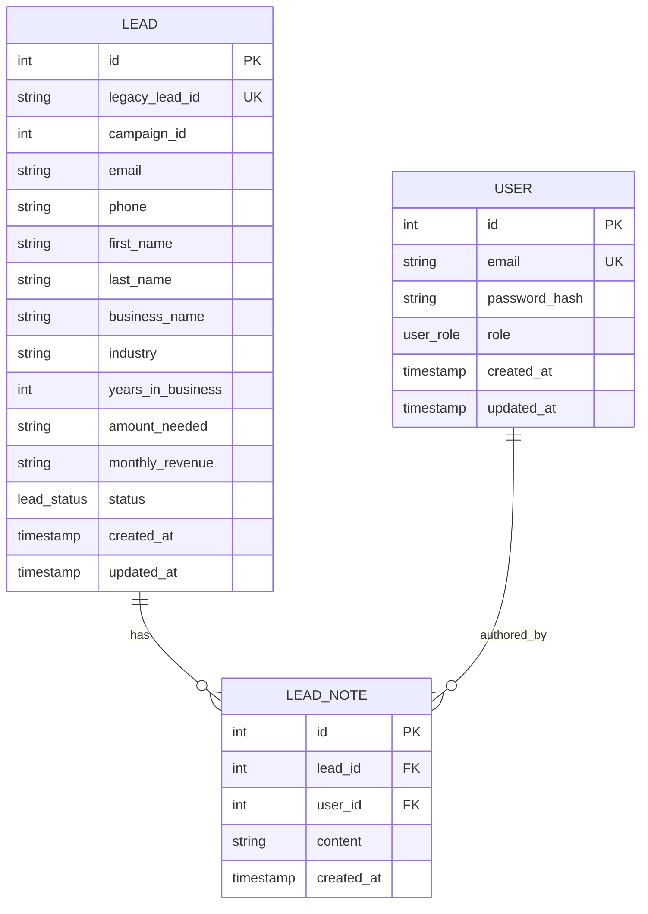
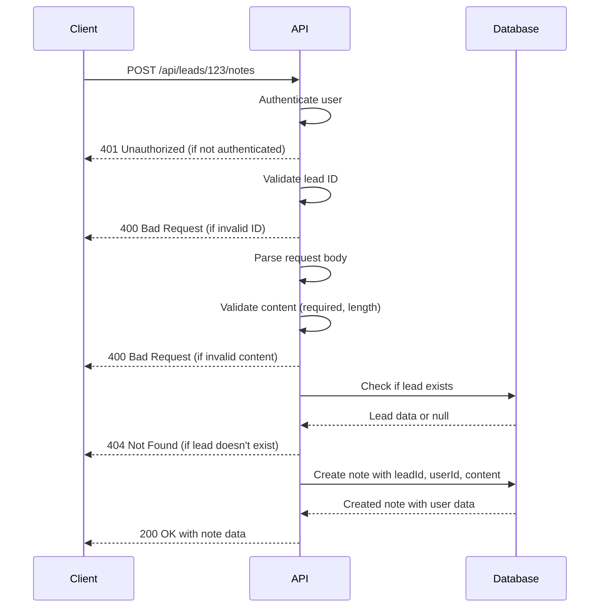
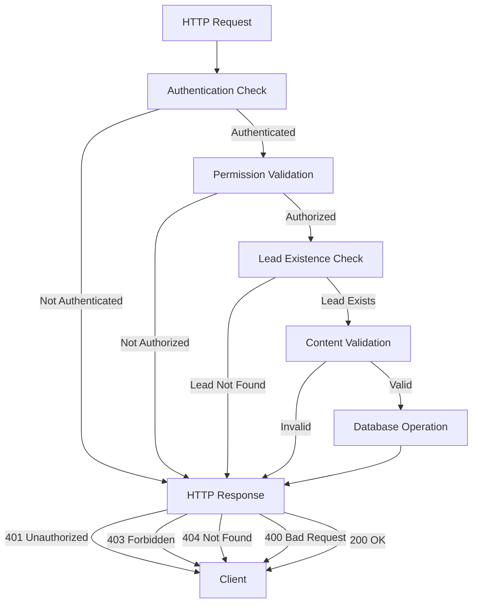

# Lead Notes API

<cite>
**Referenced Files in This Document**   
- [route.ts](file://src/app/api/leads/[id]/notes/route.ts)
- [schema.prisma](file://prisma/schema.prisma)
- [NotesSection.tsx](file://src/components/dashboard/NotesSection.tsx)
</cite>

## Table of Contents
1. [Introduction](#introduction)
2. [API Overview](#api-overview)
3. [Data Model](#data-model)
4. [CRUD Operations](#crud-operations)
   - [GET: Retrieve All Notes](#get-retrieve-all-notes)
   - [POST: Create a New Note](#post-create-a-new-note)
   - [PUT: Update a Note](#put-update-a-note)
   - [DELETE: Remove a Note](#delete-remove-a-note)
5. [Access Control](#access-control)
6. [Error Conditions](#error-conditions)
7. [Integration Details](#integration-details)
8. [Examples](#examples)

## Introduction

The Lead Notes API provides a comprehensive interface for managing internal notes associated with specific leads in the system. This API enables users to create, read, update, and delete notes, facilitating documentation of interactions, decisions, and important information throughout the lead lifecycle. The API is designed to support collaboration among team members by tracking authorship and timestamps for all notes.

The notes functionality is tightly integrated with the lead management system, allowing users to maintain a detailed history of communications and actions taken on each lead. This documentation is critical for maintaining continuity, especially when multiple team members are involved in processing a lead.

**Section sources**
- [route.ts](file://src/app/api/leads/[id]/notes/route.ts)
- [schema.prisma](file://prisma/schema.prisma)

## API Overview

The Lead Notes API is implemented as a RESTful endpoint that operates on the `/api/leads/[id]/notes` route, where `[id]` represents the unique identifier of the lead. The API supports standard CRUD operations through HTTP methods: GET for retrieving notes, POST for creating new notes, PUT for updating existing notes, and DELETE for removing notes.

The API follows a resource-oriented architecture, treating lead notes as sub-resources of leads. This hierarchical structure reflects the relationship between leads and their associated notes in the data model. All operations require authentication and appropriate permissions, ensuring that only authorized users can access or modify note data.

The API is built using Next.js App Router with server-side rendering enabled, and it leverages Prisma as the ORM for database interactions. The implementation includes comprehensive error handling, input validation, and security measures to protect data integrity and prevent unauthorized access.

```mermaid
flowchart TD
Client["Client Application"]
API["Lead Notes API"]
Database["PostgreSQL Database"]
Client --> |GET /api/leads/{id}/notes| API
Client --> |POST /api/leads/{id}/notes| API
Client --> |PUT /api/leads/{id}/notes/{noteId}| API
Client --> |DELETE /api/leads/{id}/notes/{noteId}| API
API --> |Query| Database
API --> |Create| Database
API --> |Update| Database
API --> |Delete| Database
Database --> |Return Data| API
API --> |Return Response| Client
subgraph "Security"
Auth["Authentication Check"]
Permissions["Permission Validation"]
end
API --> Auth
API --> Permissions
```

**Diagram sources**
- [route.ts](file://src/app/api/leads/[id]/notes/route.ts)
- [schema.prisma](file://prisma/schema.prisma)

**Section sources**
- [route.ts](file://src/app/api/leads/[id]/notes/route.ts)
- [schema.prisma](file://prisma/schema.prisma)

## Data Model

The lead notes data model defines the structure and relationships for storing note information in the database. Each note is associated with a specific lead and the user who created it, establishing important contextual relationships.

The LeadNote model contains the following fields:
- `id`: Unique identifier for the note (auto-incrementing integer)
- `leadId`: Foreign key referencing the associated lead
- `userId`: Foreign key referencing the user who created the note
- `content`: The text content of the note (string)
- `createdAt`: Timestamp of when the note was created (automatically set)

The model establishes relationships with the Lead and User models through foreign key constraints. When a lead is deleted, all associated notes are automatically removed due to the CASCADE delete rule. This ensures data consistency and prevents orphaned records in the database.



**Diagram sources**
- [schema.prisma](file://prisma/schema.prisma#L140-L154)

**Section sources**
- [schema.prisma](file://prisma/schema.prisma#L140-L154)

## CRUD Operations

### GET: Retrieve All Notes

The GET operation retrieves all notes associated with a specific lead, returning them in descending order by creation date (newest first). This endpoint supports pagination for future scalability, though the current implementation returns all notes without pagination parameters.

**Endpoint**: `GET /api/leads/{id}/notes`

**Request Parameters**:
- `id`: The unique identifier of the lead (path parameter)

**Response**:
- Status: 200 OK
- Body: Array of note objects with author information

The implementation retrieves notes by querying the database with the lead ID, including the associated user data to provide author information. The notes are ordered by creation date in descending order to display the most recent notes first.

**Section sources**
- [route.ts](file://src/app/api/leads/[id]/route.ts#L64-L119)
- [NotesSection.tsx](file://src/components/dashboard/NotesSection.tsx)

### POST: Create a New Note

The POST operation creates a new note associated with a specific lead. This operation requires authentication and validates the input before creating the note in the database.

**Endpoint**: `POST /api/leads/{id}/notes`

**Request Parameters**:
- `id`: The unique identifier of the lead (path parameter)
- Request Body: JSON object with `content` field

**Request Schema**:
```json
{
  "content": "string (required, 1-5000 characters)"
}
```

**Validation Rules**:
- Content is required and must be a non-empty string
- Content cannot exceed 5000 characters
- Lead must exist in the database
- User must be authenticated

**Response**:
- Success: 200 OK with created note object
- Error: 400 Bad Request for validation errors, 401 Unauthorized for authentication failures, 404 Not Found if lead doesn't exist

The implementation first validates the user's authentication status, then checks the lead ID validity, validates the note content, verifies the lead exists, and finally creates the note with the current user ID and timestamp.



**Diagram sources**
- [route.ts](file://src/app/api/leads/[id]/notes/route.ts#L0-L82)

**Section sources**
- [route.ts](file://src/app/api/leads/[id]/notes/route.ts#L0-L82)
- [NotesSection.tsx](file://src/components/dashboard/NotesSection.tsx)

### PUT: Update a Note

The PUT operation updates an existing note. This functionality allows users to correct information or add additional details to previously created notes.

**Endpoint**: `PUT /api/leads/{id}/notes/{noteId}`

**Request Parameters**:
- `id`: The unique identifier of the lead (path parameter)
- `noteId`: The unique identifier of the note to update (path parameter)
- Request Body: JSON object with `content` field

**Request Schema**:
```json
{
  "content": "string (required, 1-5000 characters)"
}
```

**Validation Rules**:
- Content is required and must be a non-empty string
- Content cannot exceed 5000 characters
- Note must exist and belong to the specified lead
- User must be authenticated
- User must have permission to edit the note (implementation may restrict to note author)

**Response**:
- Success: 200 OK with updated note object
- Error: 400 Bad Request for validation errors, 401 Unauthorized for authentication failures, 404 Not Found if note or lead doesn't exist

The implementation follows a similar pattern to the POST operation but includes additional checks to ensure the note exists and belongs to the specified lead. It also verifies that the user has appropriate permissions to modify the note, which may be restricted to the original author.

**Section sources**
- [route.ts](file://src/app/api/leads/[id]/notes/route.ts)

### DELETE: Remove a Note

The DELETE operation removes a note from the system. This action is permanent and cannot be undone.

**Endpoint**: `DELETE /api/leads/{id}/notes/{noteId}`

**Request Parameters**:
- `id`: The unique identifier of the lead (path parameter)
- `noteId`: The unique identifier of the note to delete (path parameter)

**Validation Rules**:
- Note must exist and belong to the specified lead
- User must be authenticated
- User must have permission to delete the note (implementation may restrict to note author or administrators)

**Response**:
- Success: 200 OK with success message
- Error: 401 Unauthorized for authentication failures, 404 Not Found if note or lead doesn't exist, 403 Forbidden if user lacks permission

The implementation verifies the note's existence and ownership, checks user permissions, and then removes the note from the database. Due to the CASCADE delete relationship, no additional cleanup is required.

**Section sources**
- [route.ts](file://src/app/api/leads/[id]/notes/route.ts)

## Access Control

The Lead Notes API implements strict access control to ensure data security and integrity. All operations require user authentication through the Next-Auth authentication system. The `getServerSession` function is used to verify the user's authentication status on each request.

The access control rules are as follows:
- **Authentication**: All endpoints require a valid user session. Unauthenticated requests receive a 401 Unauthorized response.
- **Authorization**: While the current implementation primarily checks authentication, the system is designed to support role-based access control. The User model includes a role field with ADMIN and USER roles, suggesting that future enhancements could restrict certain operations to specific roles.
- **Ownership**: The system records the user ID who creates each note, enabling potential ownership-based restrictions where users can only modify or delete their own notes.
- **Lead Association**: All operations are scoped to a specific lead, preventing users from accessing notes belonging to other leads.

The access control is implemented at the API route level, ensuring that unauthorized requests are rejected before any database operations are performed. This approach minimizes the risk of data exposure and reduces unnecessary database queries.



**Diagram sources**
- [route.ts](file://src/app/api/leads/[id]/notes/route.ts)

**Section sources**
- [route.ts](file://src/app/api/leads/[id]/notes/route.ts)

## Error Conditions

The Lead Notes API handles various error conditions to provide meaningful feedback to clients and maintain system stability:

**Authentication Errors**:
- Code: 401 Unauthorized
- Message: "Unauthorized"
- Cause: Missing or invalid authentication token
- Resolution: User must log in and include valid authentication credentials

**Validation Errors**:
- Code: 400 Bad Request
- Messages: 
  - "Invalid lead ID" (when ID is not a valid number)
  - "Note content is required" (when content is missing or empty)
  - "Note content cannot exceed 5000 characters" (when content is too long)
  - "Lead not found" (when specified lead doesn't exist)
- Cause: Invalid request data
- Resolution: Correct the request data and retry

**Server Errors**:
- Code: 500 Internal Server Error
- Message: "Internal server error"
- Cause: Unexpected server-side issues (database connectivity, etc.)
- Resolution: Contact system administrator

**Error Handling Implementation**:
The API uses try-catch blocks to handle exceptions during execution. All errors are caught, logged for debugging purposes, and converted to appropriate HTTP responses. This prevents stack traces from being exposed to clients while ensuring that errors are properly recorded for troubleshooting.

**Section sources**
- [route.ts](file://src/app/api/leads/[id]/notes/route.ts)

## Integration Details

The Lead Notes API is deeply integrated with the application's database and authentication systems. It uses Prisma as the ORM to interact with the PostgreSQL database, providing type-safe database operations and efficient query generation.

**Database Integration**:
- The API uses the Prisma client to perform CRUD operations on the LeadNote model
- Automatic timestamping is implemented through Prisma's `@default(now())` attribute on the `createdAt` field
- Relationships are managed through foreign key constraints with CASCADE delete behavior
- Data retrieval includes related user information using Prisma's `include` syntax

**Authentication Integration**:
- The API integrates with Next-Auth for session management
- The `authOptions` configuration defines the authentication strategy
- User sessions contain the user ID, which is used to associate notes with their authors

**Frontend Integration**:
The NotesSection component in the dashboard consumes the Lead Notes API to provide a user interface for managing notes. It handles the complete workflow:
- Displaying existing notes with author and timestamp information
- Providing a form for creating new notes
- Implementing client-side validation and character counting
- Handling API responses and updating the UI accordingly
- Managing loading states and error conditions

**Section sources**
- [route.ts](file://src/app/api/leads/[id]/notes/route.ts)
- [schema.prisma](file://prisma/schema.prisma)
- [NotesSection.tsx](file://src/components/dashboard/NotesSection.tsx)

## Examples

### Example 1: Creating a Note

**Request**:
```http
POST /api/leads/123/notes HTTP/1.1
Content-Type: application/json
Authorization: Bearer <token>

{
  "content": "Initial contact made with the business owner. They are interested in funding options for equipment purchase."
}
```

**Success Response**:
```http
HTTP/1.1 200 OK
Content-Type: application/json

{
  "note": {
    "id": 456,
    "leadId": 123,
    "userId": 789,
    "content": "Initial contact made with the business owner. They are interested in funding options for equipment purchase.",
    "createdAt": "2025-08-26T12:30:45.123Z",
    "user": {
      "id": 789,
      "email": "agent@example.com"
    }
  }
}
```

### Example 2: Retrieving Notes

**Request**:
```http
GET /api/leads/123/notes HTTP/1.1
Authorization: Bearer <token>
```

**Success Response**:
```http
HTTP/1.1 200 OK
Content-Type: application/json

{
  "notes": [
    {
      "id": 456,
      "leadId": 123,
      "userId": 789,
      "content": "Initial contact made with the business owner. They are interested in funding options for equipment purchase.",
      "createdAt": "2025-08-26T12:30:45.123Z",
      "user": {
        "id": 789,
        "email": "agent@example.com"
      }
    },
    {
      "id": 455,
      "leadId": 123,
      "userId": 790,
      "content": "Document package received and verified. All required forms are present and properly filled out.",
      "createdAt": "2025-08-25T15:20:30.456Z",
      "user": {
        "id": 790,
        "email": "processor@example.com"
      }
    }
  ]
}
```

### Example 3: Error Response

**Request with Invalid Content**:
```http
POST /api/leads/123/notes HTTP/1.1
Content-Type: application/json
Authorization: Bearer <token>

{
  "content": ""
}
```

**Error Response**:
```http
HTTP/1.1 400 Bad Request
Content-Type: application/json

{
  "error": "Note content is required"
}
```

**Section sources**
- [route.ts](file://src/app/api/leads/[id]/notes/route.ts)
- [NotesSection.tsx](file://src/components/dashboard/NotesSection.tsx)