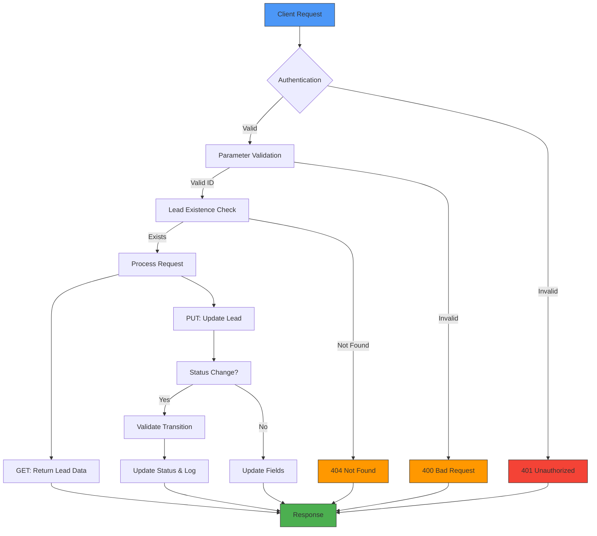
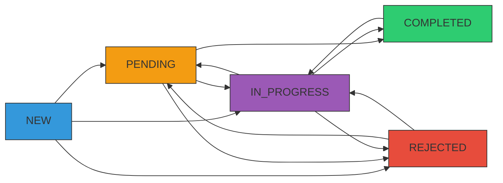
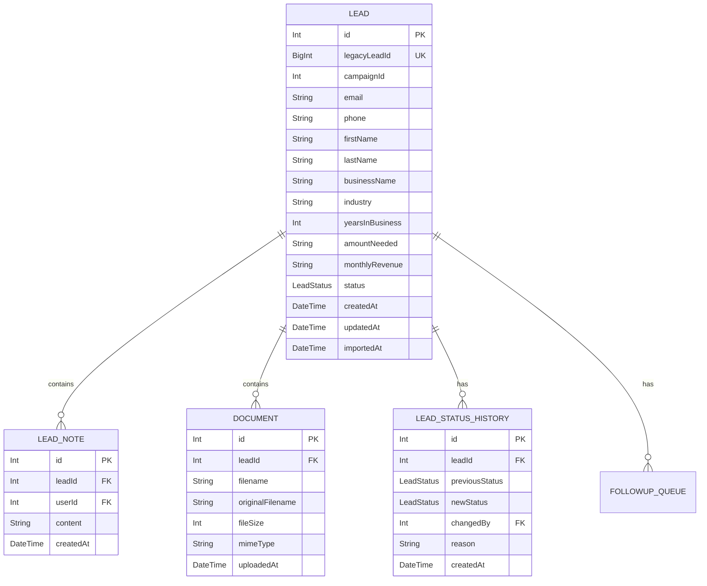
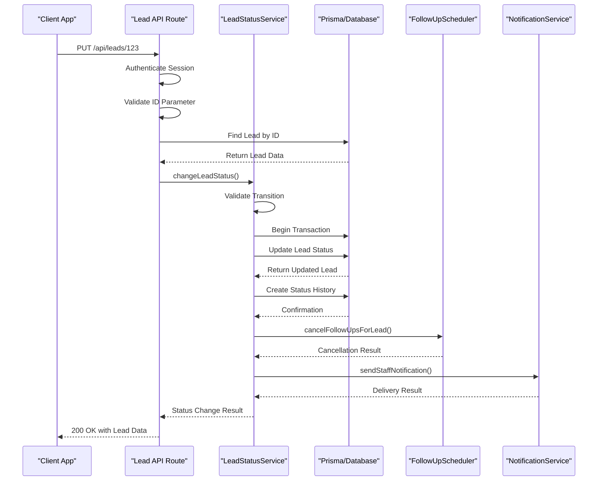

# Lead Resource Endpoint

<cite>
**Referenced Files in This Document**   
- [route.ts](file://src/app/api/leads/[id]/route.ts)
- [schema.prisma](file://prisma/schema.prisma)
- [LeadStatusService.ts](file://src/services/LeadStatusService.ts)
- [LeadDetailView.tsx](file://src/components/dashboard/LeadDetailView.tsx)
- [types.ts](file://src/components/dashboard/types.ts)
- [status/route.ts](file://src/app/api/leads/[id]/status/route.ts)
- [NotificationService.ts](file://src/services/NotificationService.ts)
- [FollowUpScheduler.ts](file://src/services/FollowUpScheduler.ts)
</cite>

## Table of Contents
1. [Introduction](#introduction)
2. [Endpoint Overview](#endpoint-overview)
3. [GET Method - Retrieve Lead](#get-method---retrieve-lead)
4. [PUT Method - Update Lead](#put-method---update-lead)
5. [Path Parameter Validation](#path-parameter-validation)
6. [Authentication and Permissions](#authentication-and-permissions)
7. [Request Body Schema](#request-body-schema)
8. [Response Structure](#response-structure)
9. [Error Responses](#error-responses)
10. [Status Transition Logic](#status-transition-logic)
11. [Data Persistence with Prisma](#data-persistence-with-prisma)
12. [Audit Logging and Notifications](#audit-logging-and-notifications)
13. [Integration Sequence](#integration-sequence)

## Introduction
This document provides comprehensive documentation for the individual lead resource endpoint in the fund-track application. The endpoint allows authorized users to retrieve and update lead information through RESTful API methods. The implementation leverages Next.js API routes, Prisma ORM for database operations, and a comprehensive service layer for business logic, status transitions, and notifications.

## Endpoint Overview
The lead resource endpoint provides RESTful operations for managing individual leads through the `[id]` dynamic parameter. The endpoint supports GET for retrieval and PUT for updates, with comprehensive validation, authentication, and audit logging.



**Diagram sources**
- [route.ts](file://src/app/api/leads/[id]/route.ts)

**Section sources**
- [route.ts](file://src/app/api/leads/[id]/route.ts)

## GET Method - Retrieve Lead
The GET method retrieves complete information for a specific lead by ID, including related data such as notes, documents, and status history.

### Request
```
GET /api/leads/{id}
Authorization: Bearer <token>
```

### Response Structure
The response includes the lead object with all attributes and related metadata:

**Response Schema**
- **lead**: Complete lead object with all fields
  - **id**: Unique identifier (number)
  - **legacyLeadId**: Original system identifier (string)
  - **campaignId**: Associated campaign (number)
  - **contact information**: email, phone, firstName, lastName
  - **business information**: businessName, industry, yearsInBusiness, etc.
  - **financial information**: amountNeeded, monthlyRevenue
  - **status**: Current lead status (NEW, PENDING, IN_PROGRESS, COMPLETED, REJECTED)
  - **timestamps**: createdAt, updatedAt, importedAt, intakeCompletedAt
  - **_count**: Related item counts (notes, documents, followupQueue)
  - **notes**: Array of lead notes with user information
  - **documents**: Array of uploaded documents with metadata
  - **statusHistory**: Recent status changes with user attribution

### Example Response
```json
{
  "lead": {
    "id": 123,
    "legacyLeadId": "1001",
    "campaignId": 123,
    "email": "john.doe@example.com",
    "phone": "1234567890",
    "firstName": "John",
    "lastName": "Doe",
    "businessName": "Doe Enterprises",
    "amountNeeded": 50000,
    "monthlyRevenue": 25000,
    "status": "IN_PROGRESS",
    "createdAt": "2025-08-26T10:00:00Z",
    "updatedAt": "2025-08-26T14:30:00Z",
    "importedAt": "2025-08-26T10:00:00Z",
    "_count": {
      "notes": 3,
      "documents": 2,
      "followupQueue": 1
    },
    "notes": [
      {
        "id": 1,
        "content": "Initial contact made",
        "createdAt": "2025-08-26T11:00:00Z",
        "user": {
          "id": 1,
          "email": "agent@company.com"
        }
      }
    ],
    "documents": [
      {
        "id": 1,
        "filename": "business_license.pdf",
        "fileSize": 153200,
        "uploadedAt": "2025-08-26T12:00:00Z",
        "user": {
          "id": 1,
          "email": "agent@company.com"
        }
      }
    ],
    "statusHistory": [
      {
        "previousStatus": "NEW",
        "newStatus": "IN_PROGRESS",
        "changedBy": 1,
        "reason": "Documents received",
        "createdAt": "2025-08-26T10:30:00Z",
        "user": {
          "id": 1,
          "email": "agent@company.com"
        }
      }
    ]
  }
}
```

**Section sources**
- [route.ts](file://src/app/api/leads/[id]/route.ts#L64-L119)
- [types.ts](file://src/components/dashboard/types.ts#L3-L65)

## PUT Method - Update Lead
The PUT method updates lead information, with special handling for status changes that trigger audit logging and business workflows.

### Request
```
PUT /api/leads/{id}
Authorization: Bearer <token>
Content-Type: application/json

{
  "status": "IN_PROGRESS",
  "firstName": "John",
  "lastName": "Doe",
  "email": "john.doe@example.com",
  "phone": "1234567890",
  "businessName": "Doe Enterprises",
  "reason": "Documents received and verified"
}
```

### Mutable Fields
The following fields can be updated via the PUT method:

**Contact Information**
- firstName
- lastName
- email
- phone

**Business Information**
- businessName

**Status Information**
- status (with validation)
- reason (for status transitions requiring explanation)

### Update Logic
The endpoint implements conditional logic:
1. If only status is being updated, it uses the LeadStatusService
2. If other fields are being updated, it performs a direct Prisma update
3. If both status and other fields are updated, it handles the status change first, then updates other fields

**Section sources**
- [route.ts](file://src/app/api/leads/[id]/route.ts#L150-L280)

## Path Parameter Validation
The endpoint validates the `[id]` path parameter to ensure it represents a valid numeric identifier.

### Validation Rules
- **Type**: Must be convertible to an integer
- **Format**: Must be a valid number string
- **Range**: Must be a positive integer

### Validation Implementation
```typescript
const { id } = await params;
const leadId = parseInt(id);
if (isNaN(leadId)) {
  return NextResponse.json({ error: "Invalid lead ID" }, { status: 400 });
}
```

The validation occurs before any database operations to prevent injection attacks and ensure data integrity.

**Section sources**
- [route.ts](file://src/app/api/leads/[id]/route.ts#L44-L52)

## Authentication and Permissions
The endpoint requires authenticated access with proper authorization.

### Authentication Flow
1. The request is intercepted by the authentication middleware
2. The session is validated using NextAuth
3. If no valid session exists, a 401 Unauthorized response is returned

### Permission Requirements
- **GET and PUT methods**: Require valid authentication
- **All users**: Can access leads based on their role permissions
- **No role-based restrictions**: At the endpoint level (handled by business logic)

```typescript
const session = await getServerSession(authOptions);
if (!session) {
  return NextResponse.json({ error: "Unauthorized" }, { status: 401 });
}
```

**Section sources**
- [route.ts](file://src/app/api/leads/[id]/route.ts#L47-L50)

## Request Body Schema
The request body for the PUT method supports specific fields with validation rules.

### Schema Definition
```json
{
  "status": "string",
  "firstName": "string",
  "lastName": "string",
  "email": "string",
  "phone": "string",
  "businessName": "string",
  "reason": "string"
}
```

### Data Validation Constraints
**Status Field**
- **Type**: String
- **Valid Values**: NEW, PENDING, IN_PROGRESS, COMPLETED, REJECTED
- **Validation**: Checked against LeadStatus enum values
- **Error**: 400 Bad Request for invalid values

**Email Field**
- **Type**: String
- **Format**: Valid email pattern (^[^\s@]+@[^\s@]+\.[^\s@]+$)
- **Validation**: Regex pattern matching
- **Error**: 400 Bad Request for invalid format

**Other Fields**
- No additional validation beyond type checking
- Null or undefined values are ignored in updates

```typescript
// Status validation
if (status && !Object.values(LeadStatus).includes(status)) {
  return NextResponse.json(
    { error: "Invalid status value" },
    { status: 400 }
  );
}

// Email validation
if (email && !/^[^\s@]+@[^\s@]+\.[^\s@]+$/.test(email)) {
  return NextResponse.json(
    { error: "Invalid email format" },
    { status: 400 }
  );
}
```

**Section sources**
- [route.ts](file://src/app/api/leads/[id]/route.ts#L150-L165)

## Response Structure
The response structure is consistent across successful operations, with standardized error responses for failures.

### Successful Response
All successful responses return a 200 OK status with a JSON body containing the lead data.

**Standard Response Format**
```json
{
  "lead": { /* lead object */ }
}
```

For status-only updates, additional metadata may be included:
```json
{
  "lead": { /* updated lead object */ },
  "followUpsCancelled": true,
  "staffNotificationSent": true
}
```

### Field Serialization
Special handling is applied to certain fields:
- **legacyLeadId**: Converted from BigInt to string for JSON serialization
- **Timestamps**: Preserved as ISO date strings
- **Count fields**: Included via Prisma's _count relation

```typescript
const serializedLead = {
  ...lead,
  legacyLeadId: lead.legacyLeadId ? lead.legacyLeadId.toString() : null,
};
```

**Section sources**
- [route.ts](file://src/app/api/leads/[id]/route.ts#L114-L119)
- [route.ts](file://src/app/api/leads/[id]/route.ts#L274-L280)

## Error Responses
The endpoint returns standardized error responses for various failure scenarios.

### Error Types and Status Codes
**400 Bad Request**
- **Cause**: Invalid lead ID parameter
- **Cause**: Invalid status value
- **Cause**: Invalid email format
- **Response**: `{ "error": "Invalid lead ID" }`

**401 Unauthorized**
- **Cause**: Missing or invalid authentication token
- **Response**: `{ "error": "Unauthorized" }`

**404 Not Found**
- **Cause**: Lead with specified ID does not exist
- **Response**: `{ "error": "Lead not found" }`

**500 Internal Server Error**
- **Cause**: Database errors
- **Cause**: Unexpected server exceptions
- **Response**: `{ "error": "Internal server error" }`

### Error Handling Implementation
The endpoint uses try-catch blocks to handle exceptions and provide meaningful error responses while logging details for debugging.

```typescript
try {
  // Business logic
} catch (error) {
  console.error("Error fetching lead:", error);
  return NextResponse.json(
    { error: "Internal server error" },
    { status: 500 }
  );
}
```

**Section sources**
- [route.ts](file://src/app/api/leads/[id]/route.ts#L53-L62)
- [route.ts](file://src/app/api/leads/[id]/route.ts#L100-L109)
- [route.ts](file://src/app/api/leads/[id]/route.ts#L294-L303)

## Status Transition Logic
The endpoint integrates with LeadStatusService to enforce valid status transitions and automate related workflows.

### Valid Status Transitions
The system enforces business rules for status changes:



**Diagram sources**
- [LeadStatusService.ts](file://src/services/LeadStatusService.ts#L21-L58)

### Transition Rules
**From NEW**
- Can transition to: PENDING, IN_PROGRESS, REJECTED
- Reason: New leads can be set to pending, in progress, or rejected

**From PENDING**
- Can transition to: IN_PROGRESS, COMPLETED, REJECTED
- Reason: Pending leads can progress to in progress, completed, or be rejected

**From IN_PROGRESS**
- Can transition to: COMPLETED, REJECTED, PENDING
- Reason: In progress leads can be completed, rejected, or moved back to pending

**From COMPLETED**
- Can transition to: IN_PROGRESS
- Requires reason
- Reason: Completed leads can only be reopened to in progress with a reason

**From REJECTED**
- Can transition to: PENDING, IN_PROGRESS
- Requires reason
- Reason: Rejected leads can be reopened to pending or in progress with a reason

### Special Handling
When status changes from PENDING:
- All pending follow-ups are automatically cancelled
- Staff are notified of significant status changes
- Status history is recorded with user attribution and reason

**Section sources**
- [LeadStatusService.ts](file://src/services/LeadStatusService.ts#L21-L58)
- [LeadStatusService.ts](file://src/services/LeadStatusService.ts#L60-L110)

## Data Persistence with Prisma
The endpoint uses Prisma ORM for database operations with proper transaction handling and relation loading.

### Prisma Operations
**GET Operation**
- Uses `findUnique` with comprehensive `include` for related data
- Loads notes, documents, status history, and count relations
- Orders related data by creation date (descending)

**PUT Operation**
- Uses `update` method for field updates
- Uses `findUnique` to verify lead existence
- Employs transactions for status changes to ensure data consistency

### Data Model
The Lead model contains comprehensive fields for lead management:



**Diagram sources**
- [schema.prisma](file://prisma/schema.prisma#L20-L140)

**Section sources**
- [schema.prisma](file://prisma/schema.prisma)
- [route.ts](file://src/app/api/leads/[id]/route.ts)

## Audit Logging and Notifications
The system automatically logs status changes and notifies relevant staff members.

### Audit Logging
When a lead status changes:
- A record is created in the lead_status_history table
- The record includes previous status, new status, changer ID, and reason
- The change is timestamped for audit purposes

```typescript
await tx.leadStatusHistory.create({
  data: {
    leadId,
    previousStatus: currentLead.status,
    newStatus,
    changedBy,
    reason: reason?.trim() || null
  }
});
```

### Notification System
Significant status changes trigger staff notifications:
- **Triggered Changes**:
  - NEW → IN_PROGRESS
  - PENDING → IN_PROGRESS
  - PENDING → COMPLETED
  - IN_PROGRESS → COMPLETED
  - COMPLETED → IN_PROGRESS (reopened)
  - REJECTED → PENDING/IN_PROGRESS (reopened)

- **Notification Method**: Email to all admin users
- **Content**: Includes lead details, status change, changer, and reason
- **Link**: Direct link to the lead details page

```typescript
// Send notification to all admin users
for (const admin of adminUsers) {
  try {
    const result = await notificationService.sendEmail({
      to: admin.email,
      subject,
      html: emailContent,
      text: emailContent.replace(/<[^>]*>/g, ''),
      leadId: lead.id
    });
  } catch (error) {
    logger.error(`Failed to send status change notification to ${admin.email}:`, error);
  }
}
```

**Section sources**
- [LeadStatusService.ts](file://src/services/LeadStatusService.ts#L210-L344)
- [NotificationService.ts](file://src/services/NotificationService.ts)

## Integration Sequence
The following sequence diagram illustrates the complete flow for updating a lead's status:



**Diagram sources**
- [route.ts](file://src/app/api/leads/[id]/route.ts)
- [LeadStatusService.ts](file://src/services/LeadStatusService.ts)
- [FollowUpScheduler.ts](file://src/services/FollowUpScheduler.ts)
- [NotificationService.ts](file://src/services/NotificationService.ts)

**Section sources**
- [route.ts](file://src/app/api/leads/[id]/route.ts)
- [LeadStatusService.ts](file://src/services/LeadStatusService.ts)