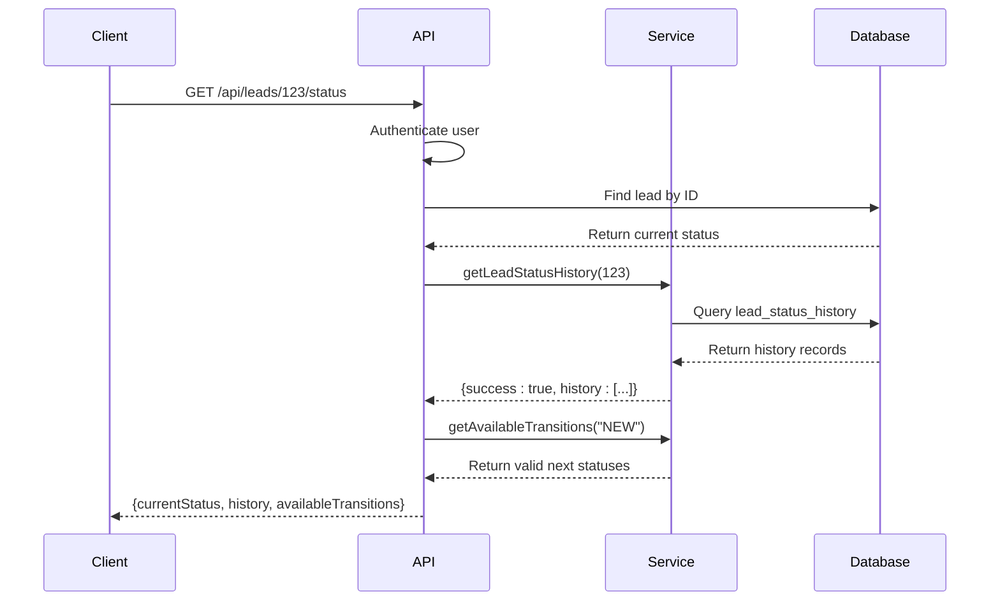
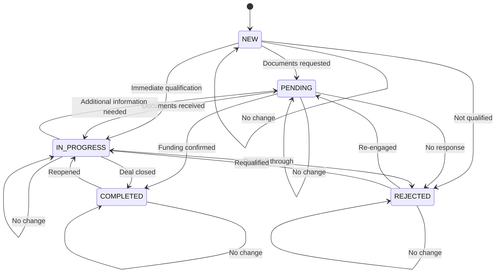

# Lead Status API

<cite>
**Referenced Files in This Document**   
- [LeadStatusService.ts](file://src/services/LeadStatusService.ts)
- [route.ts](file://src/app/api/leads/[id]/status/route.ts)
- [route.ts](file://src/app/api/leads/[id]/route.ts)
- [migration.sql](file://prisma/migrations/20250730060039_add_lead_status_history/migration.sql)
- [StatusHistorySection.tsx](file://src/components/dashboard/StatusHistorySection.tsx)
</cite>

## Table of Contents
1. [Lead Status API](#lead-status-api)
2. [PUT Method: Update Lead Status](#put-method-update-lead-status)
3. [GET Method: Retrieve Status History](#get-method-retrieve-status-history)
4. [Request and Response Schema](#request-and-response-schema)
5. [Business Logic and State Transitions](#business-logic-and-state-transitions)
6. [Audit Logging and History Tracking](#audit-logging-and-history-tracking)
7. [Error Handling](#error-handling)
8. [Integration and Usage Examples](#integration-and-usage-examples)

## PUT Method: Update Lead Status

The PUT method allows authorized users to update a lead's status through the `/api/leads/[id]` endpoint. The status update is processed via the `LeadStatusService` to enforce business rules and maintain data integrity.

The request must include the `status` field in the JSON body to initiate a status change. An optional `reason` field can be provided, which is required for certain transitions (e.g., reopening a completed or rejected lead). The system automatically records the user who made the change using the authenticated session.

When a status change is requested, the system:
1. Validates the user's authentication
2. Retrieves the current lead state
3. Validates the transition using predefined business rules
4. Executes the change within a database transaction
5. Creates an audit record in the status history
6. Triggers follow-up actions (e.g., canceling pending follow-ups if the lead is no longer pending)

**Section sources**
- [route.ts](file://src/app/api/leads/[id]/route.ts#L170-L214)
- [LeadStatusService.ts](file://src/services/LeadStatusService.ts#L112-L178)

## GET Method: Retrieve Status History

The GET method at `/api/leads/[id]/status` retrieves the current status, full status history, and available transitions for a specific lead. This endpoint provides comprehensive status information for display in the user interface.

The response includes:
- **currentStatus**: The lead's current status value
- **history**: Complete chronological list of past status changes
- **availableTransitions**: List of valid next statuses based on current state

Authentication is required to access this endpoint. The system returns a 401 error for unauthenticated requests and a 404 error if the lead does not exist.



**Diagram sources**
- [route.ts](file://src/app/api/leads/[id]/status/route.ts#L0-L63)
- [LeadStatusService.ts](file://src/services/LeadStatusService.ts#L345-L393)

**Section sources**
- [route.ts](file://src/app/api/leads/[id]/status/route.ts#L0-L63)
- [LeadStatusService.ts](file://src/services/LeadStatusService.ts#L345-L393)

## Request and Response Schema

### PUT Request Schema
```json
{
  "status": "IN_PROGRESS",
  "reason": "Client submitted required documentation"
}
```

**Required fields:**
- `status`: One of the valid LeadStatus enum values

**Optional fields:**
- `reason`: Text explanation for the status change (required for certain transitions)

### GET Response Schema
```json
{
  "currentStatus": "IN_PROGRESS",
  "history": [
    {
      "id": 1,
      "leadId": 123,
      "previousStatus": "NEW",
      "newStatus": "IN_PROGRESS",
      "changedBy": 456,
      "reason": "Initial contact made",
      "createdAt": "2025-07-30T10:00:00.000Z",
      "user": {
        "id": 456,
        "email": "agent@example.com"
      }
    }
  ],
  "availableTransitions": [
    {
      "status": "COMPLETED",
      "description": "Successfully closed/funded",
      "requiresReason": false
    },
    {
      "status": "REJECTED",
      "description": "Lead declined or not qualified",
      "requiresReason": false
    },
    {
      "status": "PENDING",
      "description": "Awaiting prospect response or action",
      "requiresReason": false
    }
  ]
}
```

**Section sources**
- [route.ts](file://src/app/api/leads/[id]/status/route.ts#L45-L62)
- [LeadStatusService.ts](file://src/services/LeadStatusService.ts#L345-L393)

## Business Logic and State Transitions

The LeadStatusService enforces a state machine pattern for lead status transitions. The valid transitions are defined in the `statusTransitions` array and follow specific business rules:



**Transition Rules:**
- **NEW**: Initial state for new leads
- **PENDING**: Awaiting client response or documentation
- **IN_PROGRESS**: Actively working with the client
- **COMPLETED**: Successfully funded/closed
- **REJECTED**: Declined or not qualified

**Special Rules:**
- Transitions from **COMPLETED** to **IN_PROGRESS** require a reason
- Transitions from **REJECTED** to any active state require a reason
- All other transitions may include an optional reason

```mermaid
classDiagram
class LeadStatusService {
+statusTransitions : StatusTransitionRule[]
+validateStatusTransition(current : LeadStatus, new : LeadStatus, reason? : string) : {valid : boolean, error? : string}
+changeLeadStatus(request : StatusChangeRequest) : Promise<StatusChangeResult>
+getAvailableTransitions(currentStatus : LeadStatus) : Array<{status : LeadStatus, description : string, requiresReason : boolean}>
+getLeadStatusHistory(leadId : number) : Promise<{success : boolean, history? : any[], error? : string}>
}
class StatusChangeRequest {
+leadId : number
+newStatus : LeadStatus
+changedBy : number
+reason? : string
}
class StatusChangeResult {
+success : boolean
+lead? : any
+error? : string
+followUpsCancelled? : boolean
+staffNotificationSent? : boolean
}
class StatusTransitionRule {
+from : LeadStatus
+to : LeadStatus[]
+requiresReason? : boolean
+description : string
}
LeadStatusService --> StatusChangeRequest : "uses"
LeadStatusService --> StatusChangeResult : "returns"
LeadStatusService --> StatusTransitionRule : "contains"
```

**Diagram sources**
- [LeadStatusService.ts](file://src/services/LeadStatusService.ts#L21-L58)
- [LeadStatusService.ts](file://src/services/LeadStatusService.ts#L60-L110)

**Section sources**
- [LeadStatusService.ts](file://src/services/LeadStatusService.ts#L21-L110)

## Audit Logging and History Tracking

All status changes are permanently recorded in the `lead_status_history` table for audit purposes. The system creates a history record for every status transition, capturing:

- Previous and new status values
- Timestamp of the change
- User who initiated the change
- Optional reason for the transition

The database schema for the history table is defined in the migration file:

```sql
CREATE TABLE "lead_status_history" (
    "id" SERIAL NOT NULL,
    "lead_id" INTEGER NOT NULL,
    "previous_status" "lead_status",
    "new_status" "lead_status" NOT NULL,
    "changed_by" INTEGER NOT NULL,
    "reason" TEXT,
    "created_at" TIMESTAMP(3) NOT NULL DEFAULT CURRENT_TIMESTAMP,
    CONSTRAINT "lead_status_history_pkey" PRIMARY KEY ("id")
);
```

Foreign key constraints ensure referential integrity:
- `lead_id` references `leads(id)` with CASCADE delete
- `changed_by` references `users(id)` with RESTRICT delete

The LeadStatusService automatically creates these records within the same database transaction as the status update, ensuring atomicity.

**Section sources**
- [migration.sql](file://prisma/migrations/20250730060039_add_lead_status_history/migration.sql#L0-L18)
- [LeadStatusService.ts](file://src/services/LeadStatusService.ts#L127-L178)

## Error Handling

The API returns appropriate HTTP status codes and error messages for various failure scenarios:

### Common Error Responses

| Status Code | Error Type | Response Body | Cause |
|-------------|------------|---------------|-------|
| 400 | Validation Error | `{ "error": "Invalid transition from COMPLETED to PENDING. Completed leads can only be reopened to in progress with a reason" }` | Invalid state transition |
| 400 | Validation Error | `{ "error": "Reason is required when changing from COMPLETED to IN_PROGRESS" }` | Missing required reason |
| 401 | Authentication Error | `{ "error": "Unauthorized" }` | Missing or invalid authentication |
| 404 | Not Found | `{ "error": "Lead not found" }` | Invalid lead ID |
| 400 | Validation Error | `{ "error": "Invalid lead ID" }` | Non-numeric lead ID |
| 500 | Internal Server Error | `{ "error": "Internal server error" }` | Unhandled server exception |

### Error Scenarios

**Invalid Status Transition:**
```json
{
  "error": "Invalid transition from COMPLETED to PENDING. Completed leads can only be reopened to in progress with a reason"
}
```

**Missing Required Reason:**
```json
{
  "error": "Reason is required when changing from COMPLETED to IN_PROGRESS"
}
```

**Unauthorized Access:**
```json
{
  "error": "Unauthorized"
}
```

The system validates transitions before attempting database operations, providing clear error messages that include the business rule description to help users understand valid workflows.

**Section sources**
- [LeadStatusService.ts](file://src/services/LeadStatusService.ts#L60-L110)
- [route.ts](file://src/app/api/leads/[id]/route.ts#L170-L214)

## Integration and Usage Examples

### Valid Status Workflows

**New Lead Processing:**
```http
PUT /api/leads/123
Content-Type: application/json

{
  "status": "IN_PROGRESS",
  "reason": "Initial qualification call completed successfully"
}
```

**Document Submission:**
```http
PUT /api/leads/123
Content-Type: application/json

{
  "status": "PENDING",
  "reason": "Requested additional financial documentation"
}
```

**Reopening a Completed Lead:**
```http
PUT /api/leads/123
Content-Type: application/json

{
  "status": "IN_PROGRESS",
  "reason": "Client wants to increase funding amount"
}
```

### Common Error Scenarios

**Invalid Transition (Completed to Pending):**
```http
PUT /api/leads/123
Content-Type: application/json

{
  "status": "PENDING"
}
```
Response: `400 Bad Request` with error message explaining the invalid transition.

**Missing Reason for Reopening:**
```http
PUT /api/leads/123
Content-Type: application/json

{
  "status": "IN_PROGRESS"
}
```
Response: `400 Bad Request` with error message indicating that a reason is required.

### Frontend Integration

The StatusHistorySection component demonstrates how the API is used in the UI:

```typescript
const response = await fetch(`/api/leads/${leadId}`, {
  method: "PUT",
  headers: {
    "Content-Type": "application/json",
  },
  body: JSON.stringify(updateData),
});
```

The component handles the response and updates the UI accordingly, providing feedback to the user about the status change result.

**Section sources**
- [StatusHistorySection.tsx](file://src/components/dashboard/StatusHistorySection.tsx#L88-L133)
- [route.ts](file://src/app/api/leads/[id]/route.ts#L170-L214)