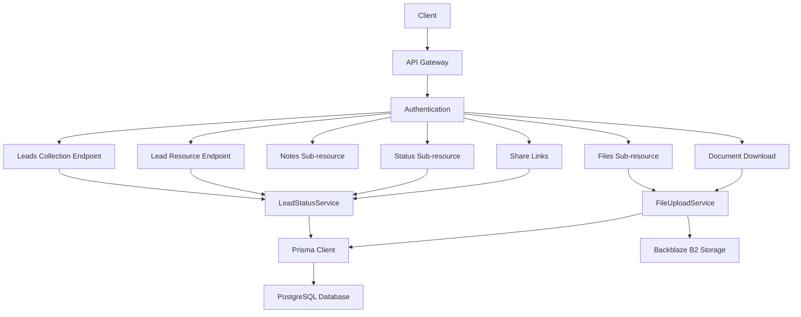
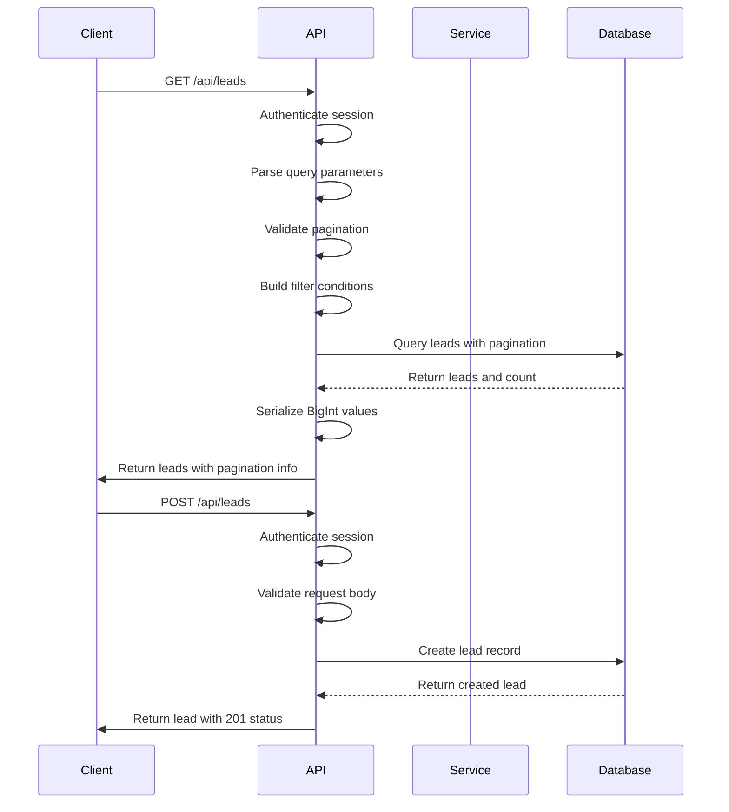
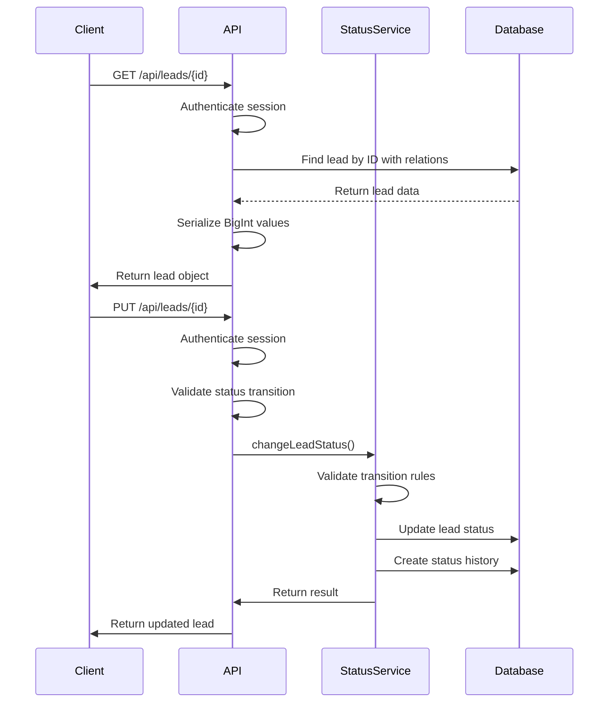
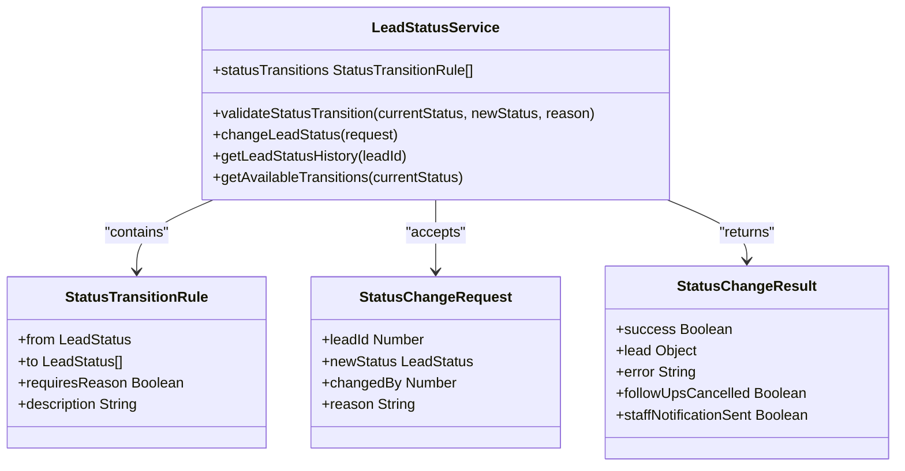
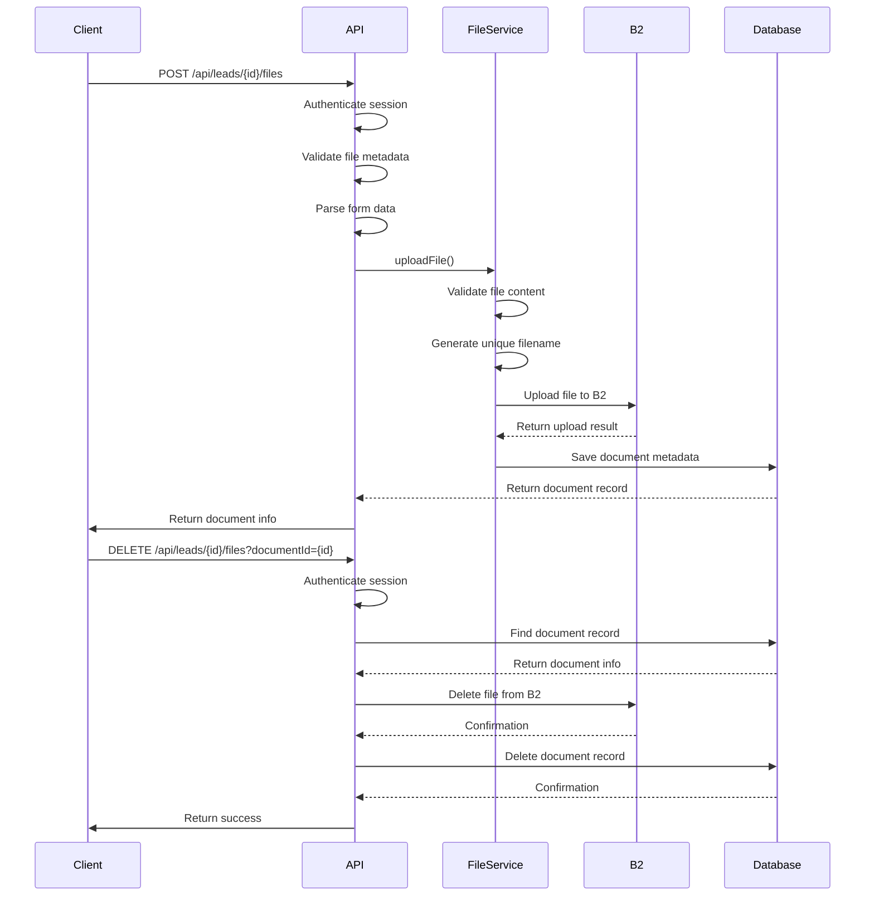
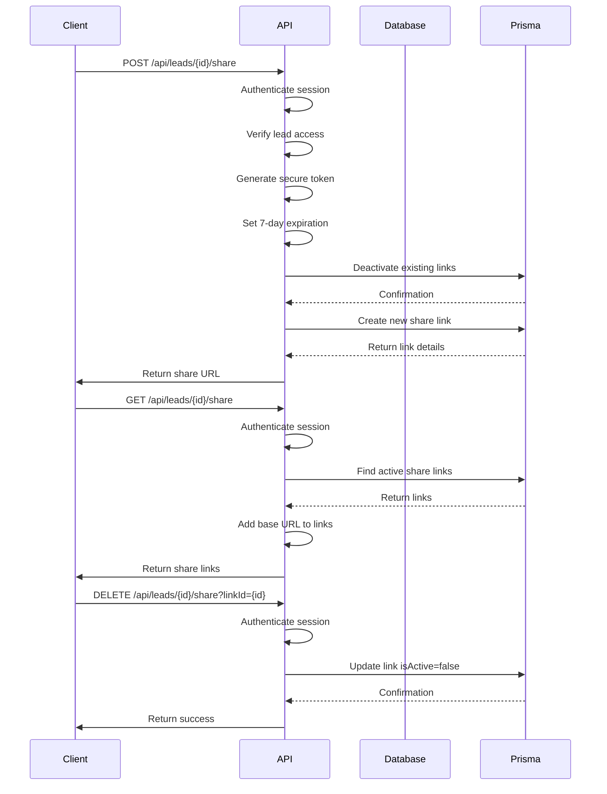
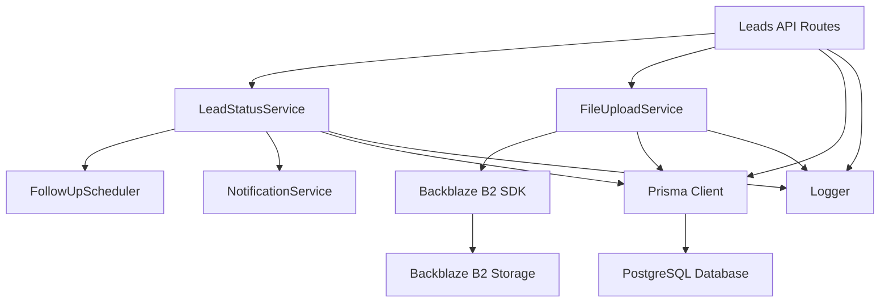

# Leads API Endpoints

<cite>
**Referenced Files in This Document**   
- [route.ts](file://src/app/api/leads/route.ts)
- [route.ts](file://src/app/api/leads/[id]/route.ts)
- [route.ts](file://src/app/api/leads/[id]/notes/route.ts)
- [route.ts](file://src/app/api/leads/[id]/status/route.ts)
- [route.ts](file://src/app/api/leads/[id]/files/route.ts)
- [route.ts](file://src/app/api/leads/[id]/documents/[documentId]/download/route.ts)
- [route.ts](file://src/app/api/leads/[id]/share/route.ts)
- [LeadStatusService.ts](file://src/services/LeadStatusService.ts)
- [FileUploadService.ts](file://src/services/FileUploadService.ts)
- [schema.prisma](file://prisma/schema.prisma)
- [types.ts](file://src/components/dashboard/types.ts)
- [ShareView.tsx](file://src/components/share/ShareView.tsx)
- [page.tsx](file://src/app/share/[token]/page.tsx)
</cite>

## Update Summary
**Changes Made**   
- Added new section for Lead Share Links API
- Updated Project Structure to include share functionality
- Added new sequence diagram for share link operations
- Updated architecture overview to include sharing feature
- Added section sources for newly analyzed files
- Enhanced diagram sources with specific file references

## Table of Contents
1. [Introduction](#introduction)
2. [Project Structure](#project-structure)
3. [Core Components](#core-components)
4. [Architecture Overview](#architecture-overview)
5. [Detailed Component Analysis](#detailed-component-analysis)
6. [Dependency Analysis](#dependency-analysis)
7. [Performance Considerations](#performance-considerations)
8. [Troubleshooting Guide](#troubleshooting-guide)
9. [Conclusion](#conclusion)

## Introduction
This document provides comprehensive documentation for the Leads API endpoints in the fund-track application. The API enables management of leads through a RESTful interface, supporting operations for listing, creating, retrieving, and updating leads. It also includes sub-resources for managing notes, status transitions, file attachments, and secure lead sharing. The system enforces business workflows through the LeadStatusService and securely stores documents using Backblaze B2 via the FileUploadService. This documentation details request/response schemas, filtering and pagination parameters, access control, and audit logging mechanisms.

## Project Structure
The Leads API is organized within the Next.js application structure using the App Router. The API routes are located under `src/app/api/leads/` with a hierarchical structure that reflects the resource relationships. The main collection endpoint is implemented in `route.ts`, while individual lead operations are handled in `[id]/route.ts`. Sub-resources such as notes, status, files, and share links have their own route files within the lead resource directory. Business logic is separated into services located in the `src/services/` directory, with `LeadStatusService` handling state transitions and `FileUploadService` managing document storage. The data model is defined in Prisma schema files, with the Lead model containing comprehensive business, personal, and financial information.

```mermaid
graph TB
subgraph "API Endpoints"
A[/api/leads] --> B[/api/leads/[id]]
B --> C[/api/leads/[id]/notes]
B --> D[/api/leads/[id]/status]
B --> E[/api/leads/[id]/files]
B --> F[/api/leads/[id]/documents/[documentId]/download]
B --> G[/api/leads/[id]/share]
end
subgraph "Services"
H[LeadStatusService] --> I[FollowUpScheduler]
H --> J[NotificationService]
K[FileUploadService] --> L[Backblaze B2]
end
subgraph "Data Model"
M[Prisma Schema] --> N[Lead Model]
N --> O[LeadNote]
N --> P[Document]
N --> Q[LeadStatusHistory]
N --> R[LeadShareLink]
end
A --> H
B --> H
C --> N
D --> H
E --> K
F --> K
G --> N
M --> N
```

**Diagram sources**
- [route.ts](file://src/app/api/leads/route.ts)
- [route.ts](file://src/app/api/leads/[id]/route.ts)
- [route.ts](file://src/app/api/leads/[id]/share/route.ts)
- [LeadStatusService.ts](file://src/services/LeadStatusService.ts)
- [FileUploadService.ts](file://src/services/FileUploadService.ts)
- [schema.prisma](file://prisma/schema.prisma)

**Section sources**
- [route.ts](file://src/app/api/leads/route.ts)
- [route.ts](file://src/app/api/leads/[id]/route.ts)
- [route.ts](file://src/app/api/leads/[id]/share/route.ts)
- [schema.prisma](file://prisma/schema.prisma)

## Core Components
The Leads API consists of several core components that work together to provide a complete lead management system. The API endpoints handle HTTP requests and responses, while services encapsulate business logic. The Prisma ORM provides database access with type safety, and the Backblaze B2 integration enables secure file storage. The LeadStatusService enforces workflow rules through state transition validation, and the FileUploadService manages document lifecycle operations. These components are designed with separation of concerns, allowing for maintainable and testable code.

**Section sources**
- [LeadStatusService.ts](file://src/services/LeadStatusService.ts)
- [FileUploadService.ts](file://src/services/FileUploadService.ts)
- [schema.prisma](file://prisma/schema.prisma)

## Architecture Overview
The Leads API follows a layered architecture with clear separation between presentation, business logic, and data access layers. API routes handle HTTP communication and authentication, delegating business operations to service classes. Services interact with the database through Prisma, enforcing business rules and maintaining audit trails. The architecture supports horizontal scaling through stateless API endpoints and externalized file storage. Security is implemented at multiple levels, including authentication, authorization, input validation, and secure file access via signed URLs. The system generates audit logs for sensitive operations, particularly status changes and file management.



**Diagram sources**
- [route.ts](file://src/app/api/leads/route.ts)
- [route.ts](file://src/app/api/leads/[id]/route.ts)
- [route.ts](file://src/app/api/leads/[id]/share/route.ts)
- [LeadStatusService.ts](file://src/services/LeadStatusService.ts)
- [FileUploadService.ts](file://src/services/FileUploadService.ts)
- [schema.prisma](file://prisma/schema.prisma)

## Detailed Component Analysis

### Leads Collection Endpoint Analysis
The leads collection endpoint provides CRUD operations for the lead collection, supporting both listing and creation of leads. The GET operation supports extensive filtering, sorting, and pagination capabilities, allowing clients to retrieve leads based on various criteria. The POST operation enables creation of new leads through the intake process.

#### Collection Endpoint Implementation


**Diagram sources**
- [route.ts](file://src/app/api/leads/route.ts)

**Section sources**
- [route.ts](file://src/app/api/leads/route.ts)

### Lead Resource Endpoint Analysis
The lead resource endpoint handles operations on individual leads using dynamic [id] segments. It supports retrieval (GET) and partial updates (PUT) of lead records. The endpoint integrates with the LeadStatusService to enforce workflow rules when changing lead status.

#### Resource Endpoint Implementation


**Diagram sources**
- [route.ts](file://src/app/api/leads/[id]/route.ts)
- [LeadStatusService.ts](file://src/services/LeadStatusService.ts)

**Section sources**
- [route.ts](file://src/app/api/leads/[id]/route.ts)

### Lead Notes Sub-resource Analysis
The notes sub-resource provides CRUD operations for managing notes associated with a lead. Notes are used to track communication and important information about the lead's progress through the sales funnel.

#### Notes Sub-resource Implementation
```mermaid
flowchart TD
Start([POST /api/leads/{id}/notes]) --> ValidateAuth["Authenticate Session"]
ValidateAuth --> CheckLead["Verify Lead Exists"]
CheckLead --> ValidateContent["Validate Note Content"]
ValidateContent --> LengthCheck{"Content Length > 5000?"}
LengthCheck --> |Yes| ReturnError["Return 400 Error"]
LengthCheck --> |No| CreateNote["Create Note in Database"]
CreateNote --> ReturnNote["Return Created Note"]
ReturnError --> End([Response])
ReturnNote --> End
```

**Diagram sources**
- [route.ts](file://src/app/api/leads/[id]/notes/route.ts)

**Section sources**
- [route.ts](file://src/app/api/leads/[id]/notes/route.ts)

### Lead Status Sub-resource Analysis
The status sub-resource manages state transitions for leads, enforcing business workflow rules through the LeadStatusService. It provides information about current status, available transitions, and status change history.

#### Status Sub-resource Implementation


**Diagram sources**
- [LeadStatusService.ts](file://src/services/LeadStatusService.ts)

**Section sources**
- [route.ts](file://src/app/api/leads/[id]/status/route.ts)
- [LeadStatusService.ts](file://src/services/LeadStatusService.ts)

### Lead Files Sub-resource Analysis
The files sub-resource manages document attachments for leads, integrating with Backblaze B2 for secure file storage. It handles file uploads, downloads, and deletions with appropriate validation and security measures.

#### Files Sub-resource Implementation


**Diagram sources**
- [route.ts](file://src/app/api/leads/[id]/files/route.ts)
- [FileUploadService.ts](file://src/services/FileUploadService.ts)

**Section sources**
- [route.ts](file://src/app/api/leads/[id]/files/route.ts)
- [FileUploadService.ts](file://src/services/FileUploadService.ts)

### Secure Document Download Analysis
The secure document download endpoint generates time-limited signed URLs for accessing files stored in Backblaze B2. This ensures that only authorized users can download documents while maintaining security.

#### Document Download Implementation
```mermaid
flowchart TD
Start([GET /api/leads/{id}/documents/{documentId}/download]) --> ValidateAuth["Authenticate Session"]
ValidateAuth --> FindDocument["Find Document by ID"]
FindDocument --> DocumentExists{"Document Found?"}
DocumentExists --> |No| Return404["Return 404 Error"]
DocumentExists --> |Yes| GenerateURL["Generate Signed URL"]
GenerateURL --> B2["Request Download Authorization from B2"]
B2 --> API["Return Download URL"]
API --> Redirect["Redirect to Download URL"]
Return404 --> End([Response])
Redirect --> End
```

**Diagram sources**
- [route.ts](file://src/app/api/leads/[id]/documents/[documentId]/download/route.ts)
- [FileUploadService.ts](file://src/services/FileUploadService.ts)

**Section sources**
- [route.ts](file://src/app/api/leads/[id]/documents/[documentId]/download/route.ts)
- [FileUploadService.ts](file://src/services/FileUploadService.ts)

### Lead Share Links Sub-resource Analysis
The share links sub-resource enables secure sharing of lead information with external parties through time-limited, revocable URLs. It provides operations to create, list, and deactivate share links with access tracking.

#### Share Links Sub-resource Implementation


**Diagram sources**
- [route.ts](file://src/app/api/leads/[id]/share/route.ts)
- [schema.prisma](file://prisma/schema.prisma#L230-L245)

**Section sources**
- [route.ts](file://src/app/api/leads/[id]/share/route.ts)
- [schema.prisma](file://prisma/schema.prisma#L230-L245)
- [page.tsx](file://src/app/share/[token]/page.tsx)
- [ShareView.tsx](file://src/components/share/ShareView.tsx)

## Dependency Analysis
The Leads API has a well-defined dependency structure that separates concerns and promotes maintainability. API routes depend on service classes for business logic, which in turn depend on the Prisma client for database operations and external services for specialized functionality. The LeadStatusService depends on the FollowUpScheduler and NotificationService to automate processes when lead status changes. The FileUploadService depends on the Backblaze B2 SDK for file operations. All components depend on the logger for audit and diagnostic purposes. This dependency structure enables independent testing and development of components.



**Diagram sources**
- [route.ts](file://src/app/api/leads/route.ts)
- [LeadStatusService.ts](file://src/services/LeadStatusService.ts)
- [FileUploadService.ts](file://src/services/FileUploadService.ts)

**Section sources**
- [route.ts](file://src/app/api/leads/route.ts)
- [LeadStatusService.ts](file://src/services/LeadStatusService.ts)
- [FileUploadService.ts](file://src/services/FileUploadService.ts)

## Performance Considerations
The Leads API is designed with performance in mind, implementing several optimizations to ensure responsive operations. The collection endpoint uses database-level pagination to limit result sets and reduce memory usage. Filtering and sorting are performed at the database level to leverage indexing and avoid in-memory operations. The API includes comprehensive indexing on frequently queried fields such as status, creation date, and search fields. For lead retrieval, the API uses selective field inclusion to minimize data transfer. The file upload and download operations use streaming where possible to avoid loading entire files into memory. The system also implements proper error handling to prevent cascading failures under high load.

## Troubleshooting Guide
When troubleshooting issues with the Leads API, consider the following common problems and solutions:

1. **Authentication failures**: Ensure the client is sending valid session information. Check that the authentication middleware is properly configured.

2. **Database connection issues**: Verify the DATABASE_URL environment variable is correctly set and the PostgreSQL instance is accessible.

3. **File upload failures**: Check that the B2_APPLICATION_KEY_ID, B2_APPLICATION_KEY, B2_BUCKET_NAME, and B2_BUCKET_ID environment variables are properly configured.

4. **Status transition errors**: Review the LeadStatusService transition rules to ensure the requested transition is allowed. Some transitions require a reason to be provided.

5. **Pagination issues**: Validate that page and limit parameters are within acceptable ranges (page >= 1, limit between 1 and 100).

6. **Search functionality problems**: Ensure the search query is being applied to the correct fields and that case-insensitive searching is working as expected.

7. **Performance degradation**: Check database query performance, particularly for the leads collection endpoint with complex filters. Consider adding indexes on frequently filtered fields.

8. **Share link issues**: Verify that the share link token exists, is active, and has not expired. Check that the LeadShareLink model in the database contains the expected fields and relationships.

**Section sources**
- [route.ts](file://src/app/api/leads/route.ts)
- [route.ts](file://src/app/api/leads/[id]/route.ts)
- [route.ts](file://src/app/api/leads/[id]/share/route.ts)
- [LeadStatusService.ts](file://src/services/LeadStatusService.ts)
- [FileUploadService.ts](file://src/services/FileUploadService.ts)

## Conclusion
The Leads API in fund-track provides a comprehensive and secure interface for managing leads throughout their lifecycle. The API follows RESTful principles with clear resource organization and consistent response formats. Business workflows are enforced through the LeadStatusService, which validates state transitions and maintains audit trails. Document management is handled securely through integration with Backblaze B2, with access controlled via time-limited signed URLs. The system supports extensive filtering, sorting, and pagination for efficient data retrieval. With proper error handling, logging, and separation of concerns, the API is maintainable, scalable, and secure for production use.