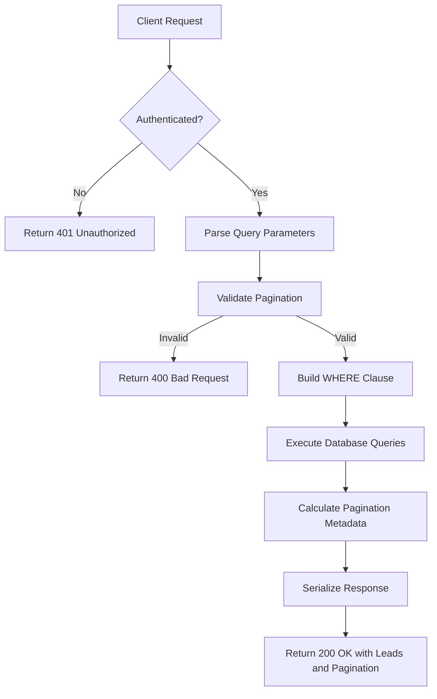
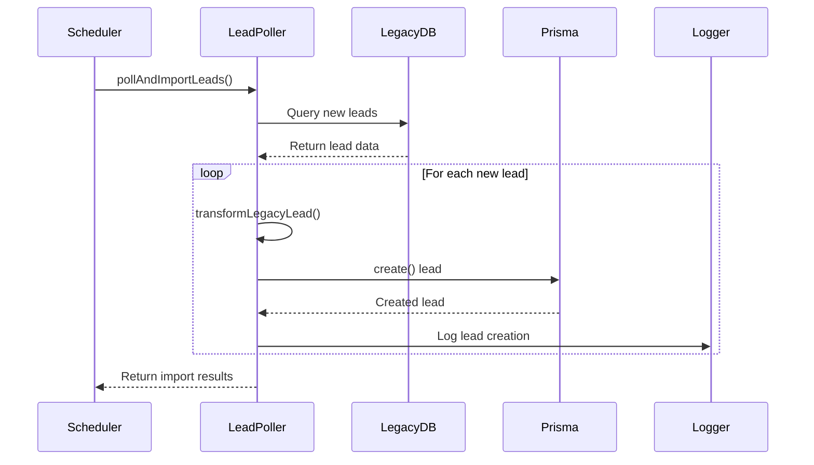
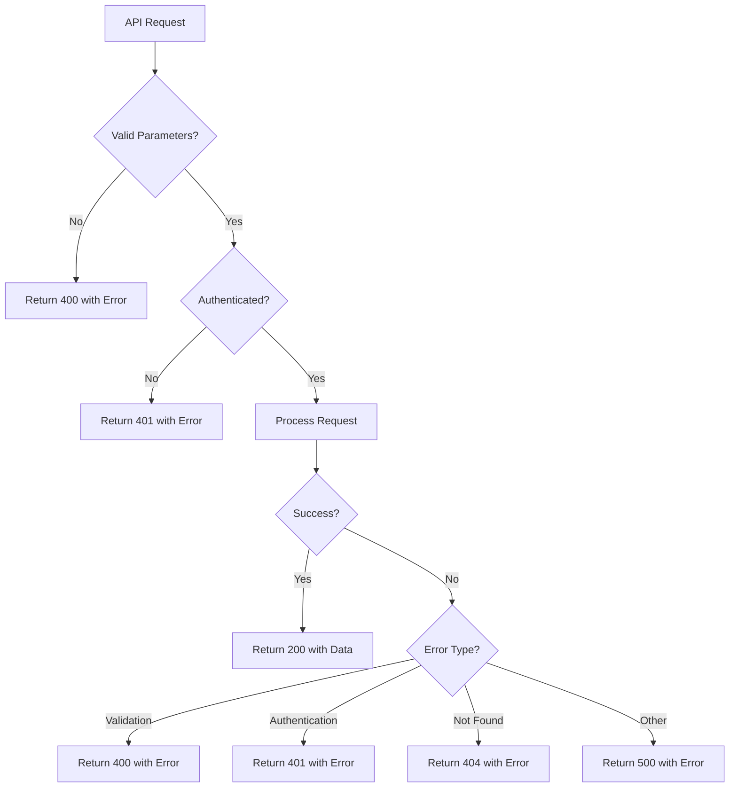
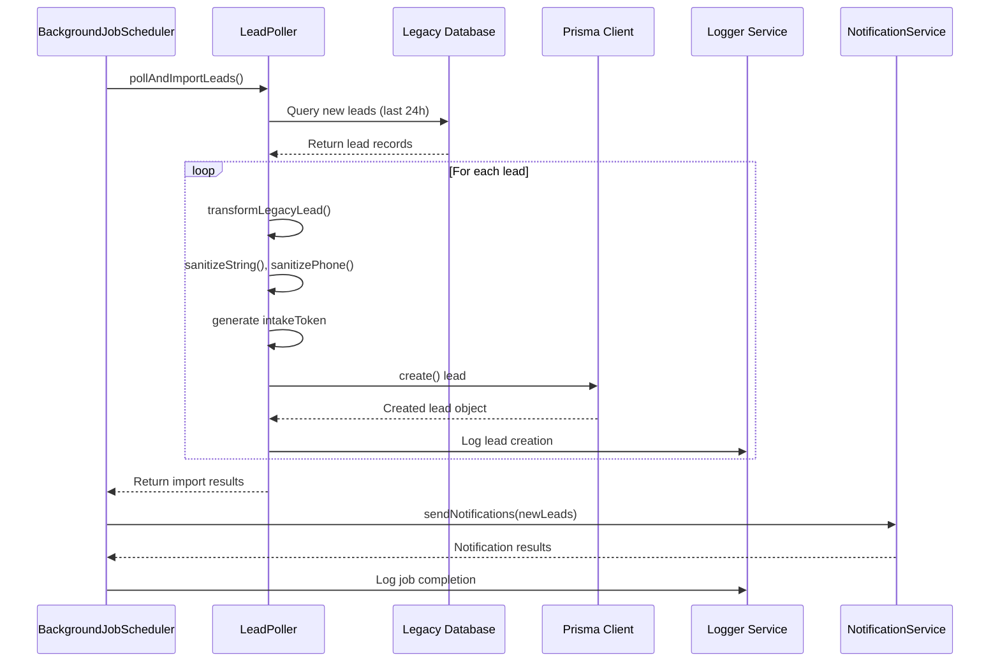
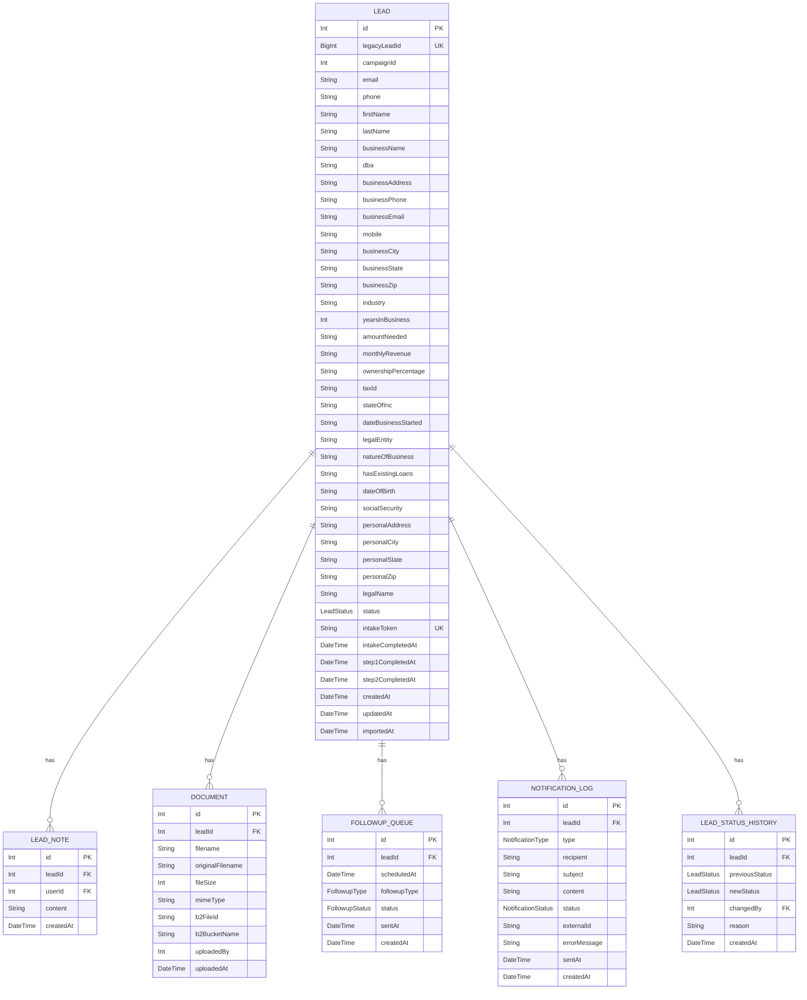

# Leads Collection Endpoints

<cite>
**Referenced Files in This Document**   
- [route.ts](file://src/app/api/leads/route.ts)
- [schema.prisma](file://prisma/schema.prisma)
- [LeadPoller.ts](file://src/services/LeadPoller.ts)
- [errors.ts](file://src/lib/errors.ts)
- [database-error-handler.ts](file://src/lib/database-error-handler.ts)
- [logger.ts](file://src/lib/logger.ts)
</cite>

## Table of Contents
1. [Introduction](#introduction)
2. [GET Method: Retrieve Paginated Leads](#get-method-retrieve-paginated-leads)
3. [POST Method: Create New Lead](#post-method-create-new-lead)
4. [Request and Response Formats](#request-and-response-formats)
5. [Error Handling](#error-handling)
6. [Database Integration with Prisma](#database-integration-with-prisma)
7. [Audit Logging](#audit-logging)
8. [Sequence Diagram: Lead Creation Flow](#sequence-diagram-lead-creation-flow)
9. [Data Model: Lead Structure](#data-model-lead-structure)

## Introduction
This document provides comprehensive documentation for the leads collection endpoints in the Fund Track application. The API supports retrieving a paginated list of leads with filtering and sorting capabilities, as well as creating new leads. The endpoints are built using Next.js App Router with Prisma ORM for database operations, featuring robust error handling, audit logging, and integration with background job processing for lead ingestion.

**Section sources**
- [route.ts](file://src/app/api/leads/route.ts)
- [schema.prisma](file://prisma/schema.prisma)

## GET Method: Retrieve Paginated Leads
The GET method retrieves a paginated list of leads with support for filtering, searching, and sorting. The endpoint requires authentication and returns leads with metadata about pagination.

### Query Parameters
The following query parameters are supported:

**Pagination**
- `page`: Page number (default: 1, minimum: 1)
- `limit`: Number of results per page (default: 10, minimum: 1, maximum: 100)

**Filtering**
- `status`: Filter by lead status (values: new, pending, in_progress, completed, rejected)
- `dateFrom`: Filter leads created on or after this date (ISO format)
- `dateTo`: Filter leads created on or before this date (ISO format)
- `search`: Search term that matches across multiple fields including name, email, phone, business name, and location

**Sorting**
- `sortBy`: Field to sort by (default: createdAt)
- `sortOrder`: Sort direction (asc or desc, default: desc)

### Implementation Details
The implementation builds a dynamic WHERE clause based on the provided filters. The search functionality performs case-insensitive matching across multiple fields using Prisma's `contains` operator with `mode: 'insensitive'`. Date filtering is applied to the `createdAt` field with `gte` and `lte` operators.

The response includes a pagination object with metadata about the current page, total pages, and navigation hints (hasNext, hasPrev).



**Diagram sources**
- [route.ts](file://src/app/api/leads/route.ts#L25-L166)

**Section sources**
- [route.ts](file://src/app/api/leads/route.ts#L25-L166)

## POST Method: Create New Lead
The POST method for creating new leads is not directly exposed through the `/api/leads` endpoint. Instead, new leads are created through a background polling process that imports leads from an external legacy system.

### Lead Creation Process
New leads are created through the following process:

1. A background job scheduler runs periodically (every 15 minutes by default)
2. The LeadPoller service queries the legacy database for new leads
3. Retrieved leads are transformed to match the application's data model
4. New leads are created in the application database via Prisma
5. Audit logging records the creation of new leads
6. Notifications are sent to staff about new leads

The actual lead creation occurs in the `LeadPoller` service, specifically in the `pollAndImportLeads` method, which uses Prisma's `create` operation to insert new lead records.



**Diagram sources**
- [LeadPoller.ts](file://src/services/LeadPoller.ts)
- [route.ts](file://src/app/api/leads/route.ts)

**Section sources**
- [LeadPoller.ts](file://src/services/LeadPoller.ts)
- [route.ts](file://src/app/api/leads/route.ts)

## Request and Response Formats
### GET Response Format
The GET method returns a JSON response with the following structure:

```json
{
  "leads": [
    {
      "id": 123,
      "legacyLeadId": "456",
      "campaignId": 11302,
      "firstName": "John",
      "lastName": "Doe",
      "email": "john.doe@example.com",
      "phone": "+15551234567",
      "businessName": "Example Business",
      "status": "NEW",
      "createdAt": "2025-08-26T10:00:00Z",
      "importedAt": "2025-08-26T10:00:00Z",
      "_count": {
        "notes": 2,
        "documents": 3
      }
    }
  ],
  "pagination": {
    "page": 1,
    "limit": 10,
    "totalCount": 150,
    "totalPages": 15,
    "hasNext": true,
    "hasPrev": false
  }
}
```

### Lead Object Structure
The lead object includes the following fields:

**Contact Information**
- `id`: Integer, unique identifier
- `legacyLeadId`: String, ID from legacy system
- `campaignId`: Integer, marketing campaign identifier
- `email`: String, primary email address
- `phone`: String, primary phone number
- `firstName`: String, first name
- `lastName`: String, last name

**Business Information**
- `businessName`: String, legal business name
- `dba`: String, "doing business as" name
- `businessAddress`: String, business street address
- `businessPhone`: String, business phone number
- `businessEmail`: String, business email address
- `mobile`: String, mobile phone number
- `businessCity`: String, business city
- `businessState`: String, business state
- `businessZip`: String, business ZIP code
- `industry`: String, industry type
- `yearsInBusiness`: Integer, years in operation
- `amountNeeded`: String, funding amount needed
- `monthlyRevenue`: String, monthly business revenue
- `ownershipPercentage`: String, owner's percentage of business
- `taxId`: String, business tax ID
- `stateOfInc`: String, state of incorporation
- `dateBusinessStarted`: String, business start date
- `legalEntity`: String, legal entity type
- `natureOfBusiness`: String, nature of business operations
- `hasExistingLoans`: String, indicator of existing loans

**Personal Information**
- `dateOfBirth`: String, date of birth
- `socialSecurity`: String, last 4 digits of SSN
- `personalAddress`: String, personal street address
- `personalCity`: String, personal city
- `personalState`: String, personal state
- `personalZip`: String, personal ZIP code
- `legalName`: String, legal name

**System Fields**
- `status`: Enum, current lead status
- `intakeToken`: String, unique token for intake process
- `intakeCompletedAt`: DateTime, when intake was completed
- `step1CompletedAt`: DateTime, when step 1 was completed
- `step2CompletedAt`: DateTime, when step 2 was completed
- `createdAt`: DateTime, record creation time
- `updatedAt`: DateTime, record update time
- `importedAt`: DateTime, when lead was imported

**Count Fields**
- `_count.notes`: Integer, number of notes
- `_count.documents`: Integer, number of documents

**Section sources**
- [schema.prisma](file://prisma/schema.prisma)
- [route.ts](file://src/app/api/leads/route.ts)

## Error Handling
The API implements comprehensive error handling for both client and server errors.

### Validation Errors
The GET method validates pagination parameters and throws a `ValidationError` if:
- `page` is less than 1
- `limit` is less than 1 or greater than 100

### Authentication Errors
Both methods require authentication. If no valid session is present, an `AuthenticationError` is thrown, resulting in a 401 Unauthorized response.

### Database Errors
Database operations are wrapped in `executeDatabaseOperation`, which handles Prisma-specific errors and logs them appropriately. This ensures that database connectivity issues or constraint violations are properly handled.

### Error Response Format
Error responses follow the format:
```json
{
  "error": "Error message describing the issue"
}
```

With appropriate HTTP status codes:
- 400 Bad Request for validation errors
- 401 Unauthorized for authentication errors
- 404 Not Found for missing resources
- 500 Internal Server Error for unexpected server errors



**Diagram sources**
- [errors.ts](file://src/lib/errors.ts)
- [database-error-handler.ts](file://src/lib/database-error-handler.ts)

**Section sources**
- [errors.ts](file://src/lib/errors.ts)
- [database-error-handler.ts](file://src/lib/database-error-handler.ts)

## Database Integration with Prisma
The leads endpoints use Prisma ORM for database operations, providing type safety and query optimization.

### Prisma Client Usage
The implementation uses the singleton Prisma client imported from `@/lib/prisma`. All database operations are wrapped in `executeDatabaseOperation` for consistent error handling and logging.

### Query Optimization
The GET method optimizes queries by:
- Using `findMany` with `skip` and `take` for pagination
- Including `_count` for related notes and documents in a single query
- Building dynamic WHERE clauses based on filters
- Using `count` to determine total records for pagination

### Transactions
While not explicitly shown in the leads endpoint, the Prisma client supports transactions for operations that require atomicity, such as creating a lead with associated notes or documents.

**Section sources**
- [prisma.ts](file://src/lib/prisma.ts)
- [database-error-handler.ts](file://src/lib/database-error-handler.ts)
- [schema.prisma](file://prisma/schema.prisma)

## Audit Logging
The application implements comprehensive audit logging for lead operations.

### API Request Logging
All API requests are logged using the logger service, capturing:
- HTTP method
- Endpoint URL
- Response status code
- Processing duration
- User ID (from session)
- Additional metadata specific to the operation

For the GET method, the log includes the number of results returned and pagination information.

### Database Operation Logging
Database operations are logged with specific operation names (e.g., "fetch_leads_with_pagination") and the affected model ("leads"), providing visibility into data access patterns.

### Background Job Logging
Lead creation through the polling process is logged with detailed information about:
- Number of leads processed
- Number of new leads created
- Number of duplicates skipped
- Any errors encountered

This logging infrastructure helps with monitoring, debugging, and security auditing.

**Section sources**
- [logger.ts](file://src/lib/logger.ts)
- [route.ts](file://src/app/api/leads/route.ts)

## Sequence Diagram: Lead Creation Flow
The following diagram illustrates the complete flow for creating new leads through the background polling process:



**Diagram sources**
- [LeadPoller.ts](file://src/services/LeadPoller.ts)
- [BackgroundJobScheduler.ts](file://src/services/BackgroundJobScheduler.ts)
- [route.ts](file://src/app/api/leads/route.ts)

## Data Model: Lead Structure
The Lead model in the Prisma schema defines the complete structure of a lead record in the database.



**Diagram sources**
- [schema.prisma](file://prisma/schema.prisma)

**Section sources**
- [schema.prisma](file://prisma/schema.prisma)