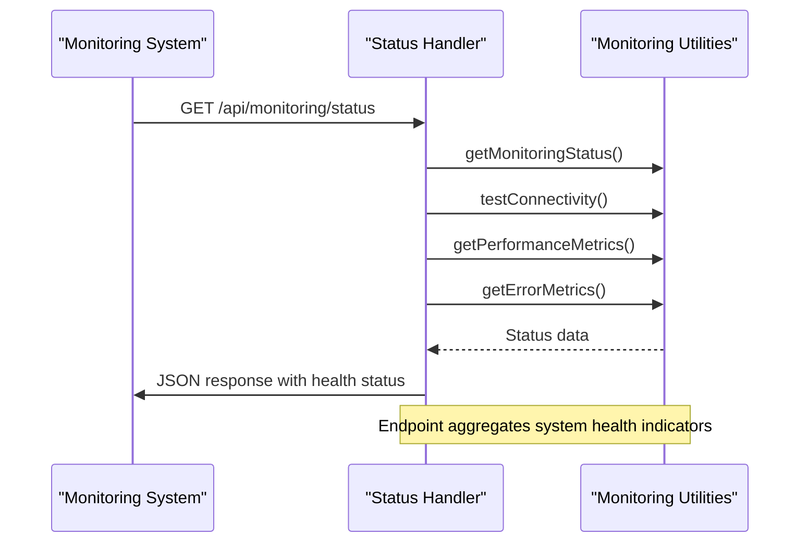
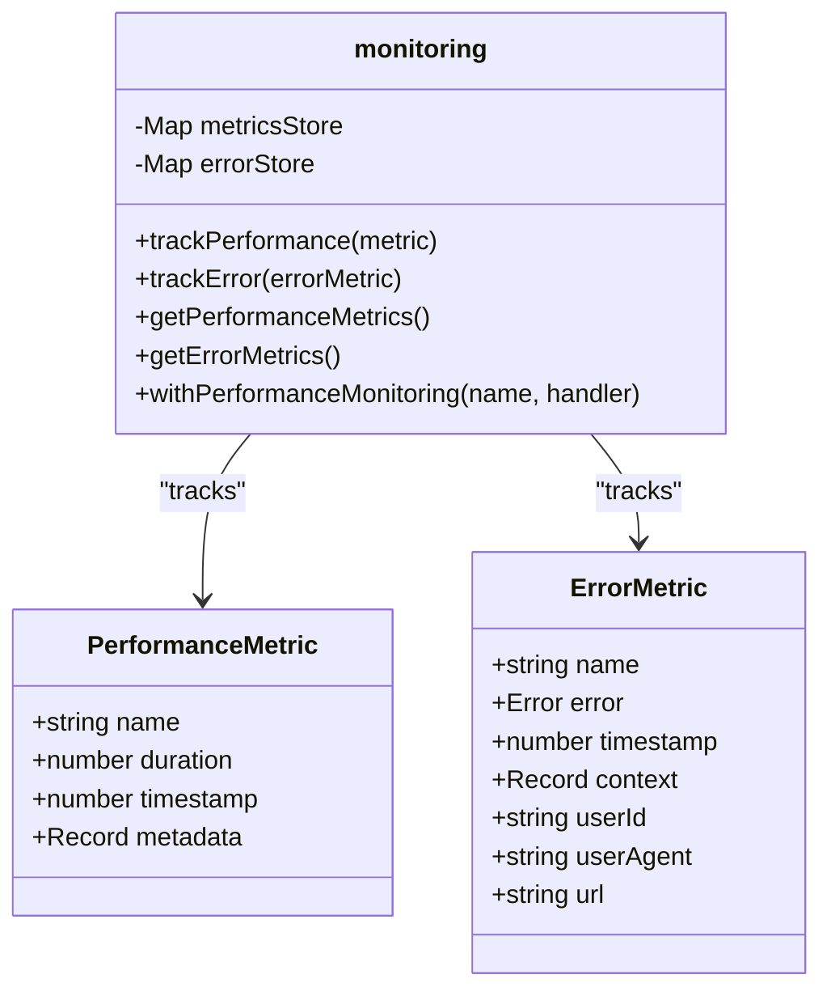
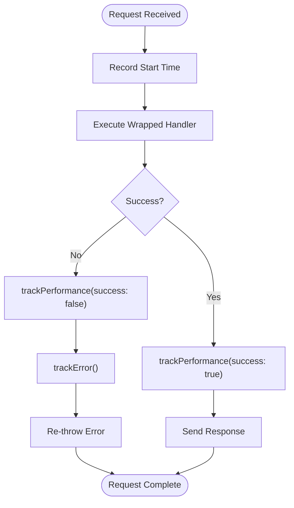
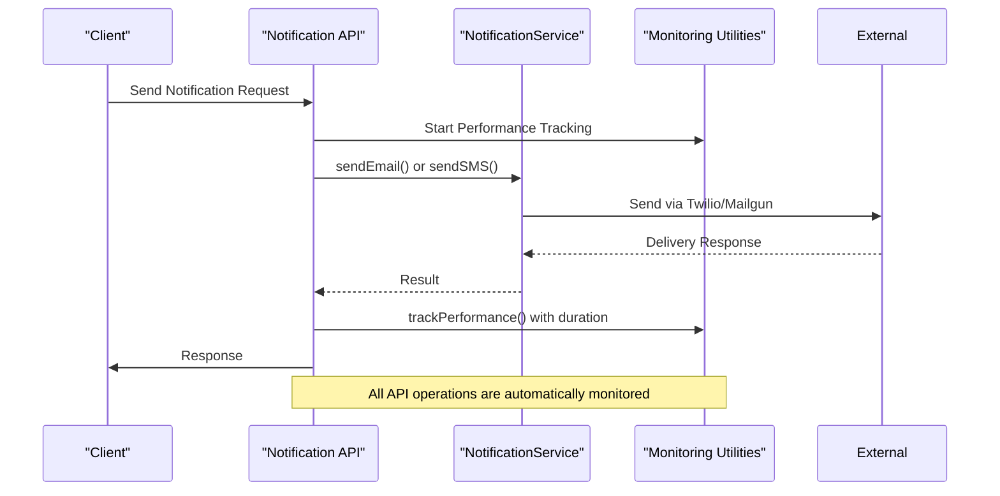
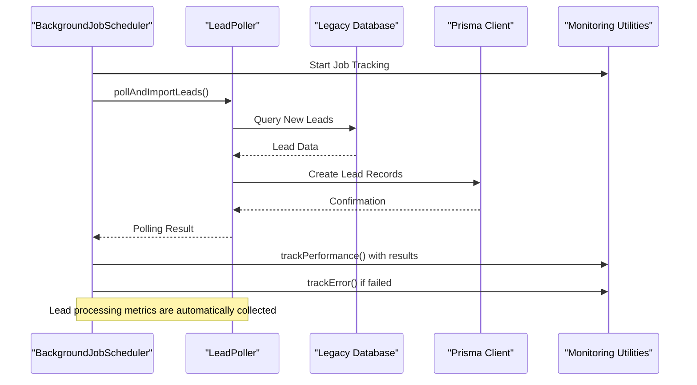

# Metrics and Monitoring API Endpoints

<cite>
**Referenced Files in This Document**   
- [src/app/api/metrics/route.ts](file://src/app/api/metrics/route.ts)
- [src/app/api/monitoring/status/route.ts](file://src/app/api/monitoring/status/route.ts)
- [src/lib/monitoring.ts](file://src/lib/monitoring.ts)
- [src/services/NotificationService.ts](file://src/services/NotificationService.ts)
- [src/services/LeadPoller.ts](file://src/services/LeadPoller.ts)
</cite>

## Table of Contents
1. [Introduction](#introduction)
2. [Metrics Endpoint](#metrics-endpoint)
3. [Monitoring Status Endpoint](#monitoring-status-endpoint)
4. [Custom Metrics Implementation](#custom-metrics-implementation)
5. [Integration with External Monitoring Tools](#integration-with-external-monitoring-tools)
6. [Service Integration Examples](#service-integration-examples)
7. [Example Responses](#example-responses)

## Introduction
The fund-track application provides two key endpoints for operational visibility and system monitoring: a metrics endpoint for detailed performance data and a monitoring/status endpoint for health aggregation. These endpoints enable administrators and external monitoring tools to track system performance, error rates, resource usage, and overall health. The implementation uses custom monitoring utilities to collect and expose metrics from various services including lead processing and notification systems.

## Metrics Endpoint

The metrics endpoint at `/api/metrics` exposes comprehensive application metrics in JSON format, suitable for monitoring systems. It provides performance, error, and system resource metrics.

### Endpoint Details
- **Path**: `/api/metrics`
- **Method**: `GET`
- **Response Format**: `application/json`
- **Authentication**: Required in production using Bearer token
- **Scrape Interval**: Recommended every 15-30 seconds

### Security and Access Control
In production environments, the endpoint requires authentication via a Bearer token that matches the `METRICS_API_KEY` environment variable. This prevents unauthorized access to sensitive performance data.

```typescript
if (process.env.NODE_ENV === 'production') {
  const authHeader = new Headers(request.headers).get('authorization');
  if (!authHeader || authHeader !== `Bearer ${process.env.METRICS_API_KEY}`) {
    return NextResponse.json({ error: 'Unauthorized' }, { status: 401 });
  }
}
```

### Response Structure
The endpoint returns a comprehensive JSON object containing:
- **Timestamp**: ISO timestamp of metric collection
- **System**: Process uptime, memory usage (heap, RSS, external), CPU usage, and environment details
- **Performance**: Aggregated performance metrics from tracked operations
- **Errors**: Error counts and details from tracked error events

### Data Collection
The endpoint gathers metrics from three primary sources:
1. **Performance metrics** via `getPerformanceMetrics()`
2. **Error metrics** via `getErrorMetrics()`
3. **System metrics** from Node.js process APIs

**Section sources**
- [src/app/api/metrics/route.ts](file://src/app/api/metrics/route.ts#L1-L59)

## Monitoring Status Endpoint

The monitoring/status endpoint at `/api/monitoring/status` provides a health check and system status summary for administrative dashboards and monitoring systems.

### Endpoint Details
- **Path**: `/api/monitoring/status`
- **Method**: `GET`
- **Response Format**: `application/json`
- **Authentication**: None required
- **Scrape Interval**: Recommended every 30-60 seconds

### Implementation and Middleware
The endpoint uses performance monitoring middleware that automatically tracks the execution time and success/failure of the status check operation. This creates a recursive monitoring capability where the monitoring system monitors itself.

```typescript
export const GET = withPerformanceMonitoring('monitoring_status', monitoringStatusHandler);
```

### Response Structure
The endpoint returns a health status response with:
- **Status**: "healthy" or "error" indicator
- **Timestamp**: ISO timestamp of check
- **Monitoring**: System monitoring status including logging connectivity
- **Metrics**: Summary of performance and error metrics

### Connectivity Testing
The endpoint performs a connectivity test to verify that logging functionality is working, which serves as a proxy for overall system health.



**Diagram sources**
- [src/app/api/monitoring/status/route.ts](file://src/app/api/monitoring/status/route.ts#L1-L68)

**Section sources**
- [src/app/api/monitoring/status/route.ts](file://src/app/api/monitoring/status/route.ts#L1-L68)

## Custom Metrics Implementation

The application implements a custom metrics collection system in the `monitoring.ts` utility module, providing performance tracking, error monitoring, and statistical aggregation.

### Core Components
The monitoring system consists of two primary data stores:
- **Performance metrics store**: Tracks operation duration, frequency, and statistics
- **Error metrics store**: Tracks error frequency and details



**Diagram sources**
- [src/lib/monitoring.ts](file://src/lib/monitoring.ts#L1-L277)

### Performance Tracking
The `trackPerformance` function records operation metrics including duration, count, minimum/maximum times, and average execution time.

```typescript
export function trackPerformance(metric: PerformanceMetric) {
  const existing = metricsStore.get(metric.name) || {
    count: 0,
    totalTime: 0,
    minTime: Infinity,
    maxTime: 0,
    lastUpdated: 0,
  };

  existing.count++;
  existing.totalTime += metric.duration;
  existing.minTime = Math.min(existing.minTime, metric.duration);
  existing.maxTime = Math.max(existing.maxTime, metric.duration);
  existing.lastUpdated = metric.timestamp;

  metricsStore.set(metric.name, existing);
}
```

### Error Tracking
The `trackError` function captures error occurrences, maintaining counts and the most recent error message for each error type.

```typescript
export function trackError(errorMetric: ErrorMetric) {
  const existing = errorStore.get(errorMetric.name) || {
    count: 0,
    lastOccurred: 0,
    lastError: '',
  };

  existing.count++;
  existing.lastOccurred = errorMetric.timestamp;
  existing.lastError = errorMetric.error.message;

  errorStore.set(errorMetric.name, existing);
}
```

### Performance Monitoring Middleware
The `withPerformanceMonitoring` higher-order function wraps API handlers to automatically track their performance and errors.



**Diagram sources**
- [src/lib/monitoring.ts](file://src/lib/monitoring.ts#L169-L229)

**Section sources**
- [src/lib/monitoring.ts](file://src/lib/monitoring.ts#L1-L277)

## Integration with External Monitoring Tools

The metrics and monitoring endpoints are designed to integrate with external monitoring tools like Prometheus and Grafana, providing operational visibility into the fund-track application.

### Prometheus Integration
Although the metrics endpoint returns JSON rather than the native Prometheus text format, the data structure is compatible with Prometheus scraping when processed through a suitable exporter or adapter. The performance and error metrics can be mapped to Prometheus counter and histogram types.

### Grafana Integration
Grafana can connect to the metrics endpoint through a JSON data source plugin, allowing administrators to create dashboards that visualize:
- Lead processing rates over time
- Notification volume trends
- API latency patterns
- System resource utilization
- Error rate monitoring

### Data Collection for Monitoring
The monitoring system collects data from various application services:
- **Lead processing rates**: Tracked via the LeadPoller service
- **Notification volumes**: Tracked via the NotificationService
- **API latency**: Tracked via the performance monitoring middleware
- **System resource usage**: Collected from Node.js process APIs

### Scrape Configuration
For optimal monitoring, configure your monitoring tools with the following settings:
- **Metrics endpoint**: Scrape every 15-30 seconds
- **Status endpoint**: Scrape every 30-60 seconds
- **Authentication**: Include Bearer token for metrics endpoint in production
- **Timeout**: Set to at least 10 seconds to accommodate processing time

## Service Integration Examples

### NotificationService Integration
The NotificationService integrates with the monitoring system by leveraging the underlying tracking mechanisms when sending notifications. While the service itself doesn't directly call monitoring functions, its operations are automatically tracked when invoked through monitored API routes.



**Diagram sources**
- [src/services/NotificationService.ts](file://src/services/NotificationService.ts#L1-L472)
- [src/lib/monitoring.ts](file://src/lib/monitoring.ts#L1-L277)

**Section sources**
- [src/services/NotificationService.ts](file://src/services/NotificationService.ts#L1-L472)

### LeadPoller Integration
The LeadPoller service is integrated with the monitoring system through the background job scheduler, which wraps the polling operation with performance monitoring.



**Diagram sources**
- [src/services/LeadPoller.ts](file://src/services/LeadPoller.ts#L1-L522)
- [src/services/BackgroundJobScheduler.ts](file://src/services/BackgroundJobScheduler.ts#L91-L135)

**Section sources**
- [src/services/LeadPoller.ts](file://src/services/LeadPoller.ts#L1-L522)

## Example Responses

### Metrics Endpoint Response
```json
{
  "timestamp": "2025-08-27T10:30:00.000Z",
  "system": {
    "uptime": 3600,
    "memory": {
      "heapUsed": 120,
      "heapTotal": 200,
      "external": 15,
      "rss": 180
    },
    "cpu": {
      "usage": {
        "user": 12345678,
        "system": 87654321
      }
    },
    "environment": {
      "nodeVersion": "v18.17.0",
      "platform": "darwin",
      "arch": "x64"
    }
  },
  "performance": {
    "lead_polling": {
      "count": 24,
      "averageTime": 2450,
      "minTime": 1200,
      "maxTime": 5200,
      "lastUpdated": 1724754600000
    },
    "notification_send": {
      "count": 156,
      "averageTime": 850,
      "minTime": 200,
      "maxTime": 3200,
      "lastUpdated": 1724754590000
    }
  },
  "errors": {
    "database_connection_error": {
      "count": 2,
      "lastOccurred": 1724754500000,
      "lastError": "Connection timeout"
    }
  }
}
```

### Monitoring Status Endpoint Response
```json
{
  "status": "healthy",
  "timestamp": "2025-08-27T10:30:00.000Z",
  "monitoring": {
    "errorReportingEnabled": false,
    "environment": "production",
    "metricsStoreSize": 15,
    "errorStoreSize": 3,
    "uptime": 3600,
    "logging": {
      "enabled": true,
      "error": null
    }
  },
  "metrics": {
    "performance": {
      "totalOperations": 15,
      "operations": {
        "lead_polling": {
          "count": 24,
          "averageTime": 2450,
          "minTime": 1200,
          "maxTime": 5200,
          "lastUpdated": 1724754600000
        }
      }
    },
    "errors": {
      "totalErrorTypes": 3,
      "errors": {
        "database_connection_error": {
          "count": 2,
          "lastOccurred": 1724754500000,
          "lastError": "Connection timeout"
        }
      }
    }
  }
}
```