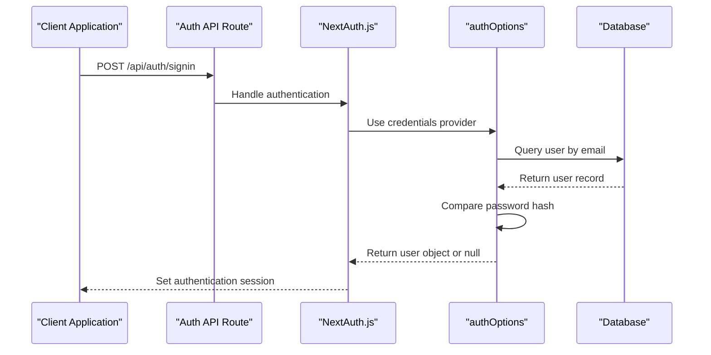
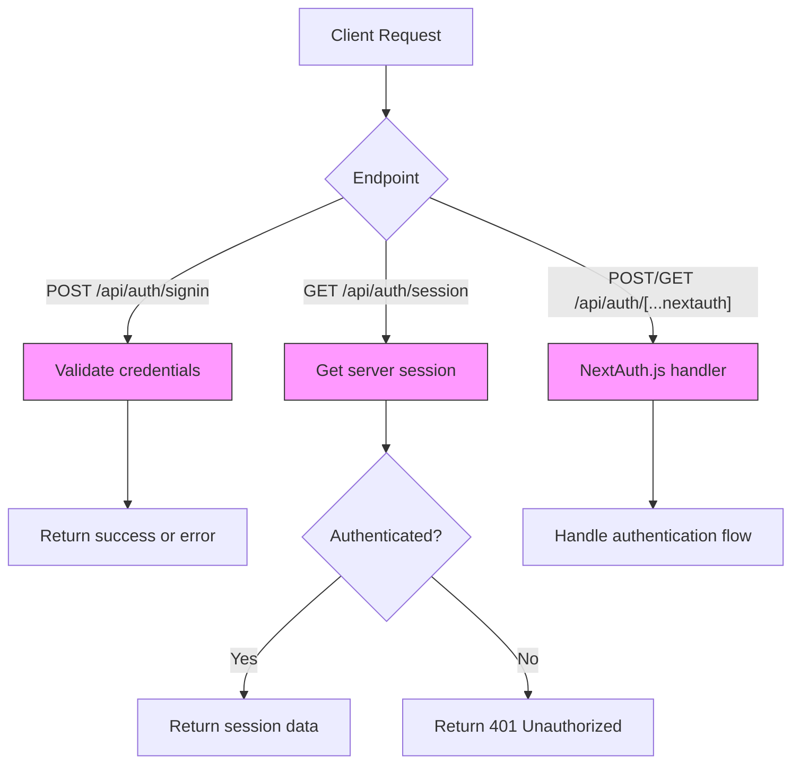
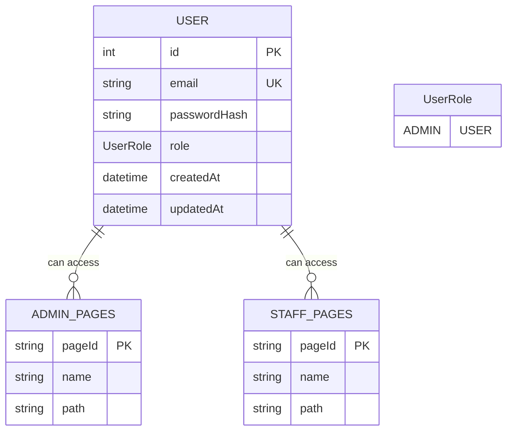
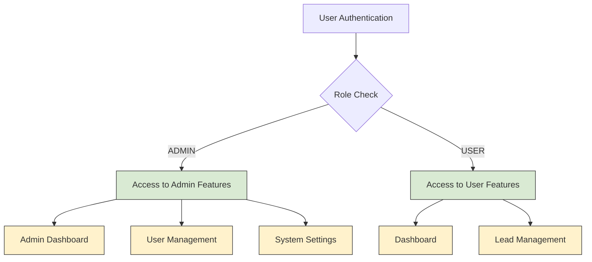

# Authentication and Authorization

<cite>
**Referenced Files in This Document**   
- [auth.ts](file://src/lib/auth.ts#L1-L70)
- [...nextauth]/route.ts](file://src/app/api/auth/[...nextauth]/route.ts#L1-L6)
- session/route.ts](file://src/app/api/auth/session/route.ts#L1-L31)
- signin/route.ts](file://src/app/api/auth/signin/route.ts#L1-L26)
- RoleGuard.tsx](file://src/components/auth/RoleGuard.tsx#L1-L75)
- SessionProvider.tsx](file://src/components/auth/SessionProvider.tsx#L1-L15)
- next-auth.d.ts](file://src/types/next-auth.d.ts#L1-L23)
- middleware.ts](file://src/middleware.ts#L1-L189)
- schema.prisma](file://prisma/schema.prisma#L1-L258)
- admin/page.tsx](file://src/app/admin/page.tsx#L1-L110)
- admin/settings/page.tsx](file://src/app/admin/settings/page.tsx#L1-L264)
</cite>

## Table of Contents
1. [Authentication and Authorization](#authentication-and-authorization)
2. [Core Authentication Implementation](#core-authentication-implementation)
3. [Session Management and JWT Handling](#session-management-and-jwt-handling)
4. [API Endpoints for Authentication](#api-endpoints-for-authentication)
5. [Role-Based Access Control](#role-based-access-control)
6. [Route Protection with Middleware](#route-protection-with-middleware)
7. [User Roles and Authorization Enforcement](#user-roles-and-authorization-enforcement)
8. [Security Best Practices](#security-best-practices)
9. [Implementation Examples](#implementation-examples)
10. [Troubleshooting Common Issues](#troubleshooting-common-issues)

## Core Authentication Implementation

The fund-track application implements authentication using NextAuth.js, a flexible authentication solution for Next.js applications. The system is configured to use credential-based authentication with email and password, leveraging the Prisma adapter for database persistence.

The authentication configuration is centralized in `src/lib/auth.ts`, which exports the `authOptions` object used by NextAuth.js. The system uses a credentials provider that validates user credentials against the database, with password hashing handled by bcrypt.



**Diagram sources**
- [auth.ts](file://src/lib/auth.ts#L1-L70)
- [...nextauth]/route.ts](file://src/app/api/auth/[...nextauth]/route.ts#L1-L6)

**Section sources**
- [auth.ts](file://src/lib/auth.ts#L1-L70)
- [...nextauth]/route.ts](file://src/app/api/auth/[...nextauth]/route.ts#L1-L6)

## Session Management and JWT Handling

The authentication system uses JWT (JSON Web Token) as the session strategy, which provides stateless session management and enhances scalability. When a user successfully authenticates, NextAuth.js creates a JWT that contains user information, which is then stored in an HTTP-only cookie.

The session flow involves several key steps:
1. User authentication via credentials provider
2. JWT creation with user data in the `jwt` callback
3. Session object population in the `session` callback
4. Secure cookie storage of the session token

The extended user types are defined in `src/types/next-auth.d.ts`, which augments the default NextAuth.js types to include the user's role and ID in both the session and JWT objects.

```mermaid
classDiagram
class Session {
+user : User
+expires : string
}
class User {
+id : string
+email : string
+role : UserRole
}
class JWT {
+id : string
+email : string
+role : UserRole
+exp : number
+iat : number
+jti : string
}
class authOptions {
+adapter : PrismaAdapter
+providers : CredentialsProvider[]
+session : {strategy : "jwt"}
+callbacks : {jwt(), session()}
}
Session --> User : "contains"
JWT --> User : "mirrors"
authOptions --> JWT : "creates in jwt callback"
authOptions --> Session : "populates in session callback"
```

**Diagram sources**
- [auth.ts](file://src/lib/auth.ts#L1-L70)
- [next-auth.d.ts](file://src/types/next-auth.d.ts#L1-L23)

**Section sources**
- [auth.ts](file://src/lib/auth.ts#L1-L70)
- [next-auth.d.ts](file://src/types/next-auth.d.ts#L1-L23)

## API Endpoints for Authentication

The application exposes several API endpoints to support authentication functionality. These endpoints follow REST principles and provide JSON responses with appropriate HTTP status codes.

The main authentication endpoints include:

- **`/api/auth/[...nextauth]`**: The primary NextAuth.js endpoint that handles all authentication flows (sign-in, sign-out, session, etc.)
- **`/api/auth/session`**: Retrieves the current user session information
- **`/api/auth/signin`**: API endpoint for programmatic sign-in (primarily for consistency)



The session endpoint (`/api/auth/session/route.ts`) implements server-side session retrieval using `getServerSession`, which verifies the authentication token and returns user information if valid. This endpoint is protected and returns a 401 status for unauthenticated requests.

**Section sources**
- [session/route.ts](file://src/app/api/auth/session/route.ts#L1-L31)
- [signin/route.ts](file://src/app/api/auth/signin/route.ts#L1-L26)
- [...nextauth]/route.ts](file://src/app/api/auth/[...nextauth]/route.ts#L1-L6)

## Role-Based Access Control

The application implements role-based access control (RBAC) through the `RoleGuard` component, which conditionally renders content based on the user's role. This client-side protection works in conjunction with server-side authorization to provide comprehensive access control.

The `RoleGuard` component uses the `useSession` hook from NextAuth.js to access the current user session and determine if the user has the required role to access a particular resource. It supports multiple allowed roles and provides a fallback UI for unauthorized users.

```typescript
export function RoleGuard({
  children,
  allowedRoles,
  fallback,
}: RoleGuardProps) {
  const { data: session, status } = useSession();

  if (status === "loading") return <PageLoading />;

  if (!session || !allowedRoles.includes(session.user.role)) {
    if (fallback !== undefined) return <>{fallback}</>;

    return (
      <div className="min-h-screen bg-gray-50 p-6 flex items-center justify-center">
        <div className="max-w-xl w-full bg-white border border-gray-100 rounded-md shadow-sm p-6">
          <h2 className="text-lg font-semibold text-gray-900">Access denied</h2>
          <p className="mt-2 text-sm text-gray-600">
            You do not have permission to view this page. If you believe this is
            a mistake, contact an administrator.
          </p>
        </div>
      </div>
    );
  }

  return <>{children}</>;
}
```

The system defines two user roles in the Prisma schema: ADMIN and USER. These roles are used throughout the application to control access to various features and data.



**Diagram sources**
- [schema.prisma](file://prisma/schema.prisma#L1-L258)
- [RoleGuard.tsx](file://src/components/auth/RoleGuard.tsx#L1-L75)

**Section sources**
- [RoleGuard.tsx](file://src/components/auth/RoleGuard.tsx#L1-L75)
- [schema.prisma](file://prisma/schema.prisma#L1-L258)

## Route Protection with Middleware

The application uses Next.js middleware for server-side route protection, ensuring that unauthorized users cannot access protected routes even if they bypass client-side checks. The middleware is defined in `src/middleware.ts` and uses the `withAuth` function from NextAuth.js.

The middleware configuration protects routes based on their path:
- `/dashboard/*` and `/api/*` (except `/api/auth/*`) require authentication
- `/admin/*` routes require ADMIN role
- Public routes like `/auth/*`, `/application/*`, and `/api/health` are accessible without authentication

```typescript
export default withAuth(
  function middleware(req) {
    const token = req.nextauth.token
    const { pathname } = req.nextUrl

    // Protect dashboard and API routes (except auth routes)
    if (pathname.startsWith("/dashboard") || 
        (pathname.startsWith("/api") && !pathname.startsWith("/api/auth"))) {
      
      if (!token) {
        return NextResponse.redirect(new URL("/auth/signin", req.url));
      }

      // Admin-only routes
      if (pathname.startsWith("/admin") && token.role !== "ADMIN") {
        return NextResponse.redirect(new URL("/dashboard", req.url));
      }
    }

    return addSecurityHeaders(NextResponse.next());
  },
  {
    callbacks: {
      authorized: ({ token, req }) => {
        const { pathname } = req.nextUrl
        
        // Allow access to public routes
        if (pathname.startsWith("/application/") ||
            pathname.startsWith("/auth/") ||
            pathname === "/api/health" ||
            (pathname.startsWith("/api/dev/") && 
             (process.env.NODE_ENV === 'development' || process.env.ENABLE_DEV_ENDPOINTS === 'true'))) {
          return true
        }
        
        // For protected routes, require authentication
        if (pathname.startsWith("/dashboard") || 
            (pathname.startsWith("/api") && !pathname.startsWith("/api/auth"))) {
          return !!token
        }
        
        return true
      },
    },
  }
)
```

**Section sources**
- [middleware.ts](file://src/middleware.ts#L1-L189)

## User Roles and Authorization Enforcement

The fund-track application implements a two-tier role system with ADMIN and USER roles, defined in the Prisma schema. These roles determine the level of access users have to various application features and data.

The authorization enforcement occurs at multiple levels:
1. **UI Level**: The `RoleGuard` component hides or shows UI elements based on user role
2. **Route Level**: Middleware protects routes based on role requirements
3. **API Level**: API endpoints validate user roles before processing requests

For example, the admin dashboard (`/src/app/admin/page.tsx`) conditionally renders navigation links based on the user's role, ensuring that only ADMIN users can see and access administrative features.



The system also provides convenience components like `AdminOnly` and `AuthenticatedOnly` that wrap the `RoleGuard` component for common use cases, simplifying role-based access control implementation across the application.

**Section sources**
- [admin/page.tsx](file://src/app/admin/page.tsx#L1-L110)
- [admin/settings/page.tsx](file://src/app/admin/settings/page.tsx#L1-L264)
- [RoleGuard.tsx](file://src/components/auth/RoleGuard.tsx#L1-L75)

## Security Best Practices

The authentication system implements several security best practices to protect user data and prevent common vulnerabilities:

1. **Password Hashing**: User passwords are hashed using bcrypt before storage, preventing exposure of plaintext passwords even in the event of a database breach.

2. **Secure Session Management**: The system uses JWT with HTTP-only, secure cookies to prevent XSS attacks and ensure session tokens are not accessible to client-side JavaScript.

3. **CSRF Protection**: While not explicitly shown in the code, NextAuth.js provides built-in CSRF protection for form submissions.

4. **Rate Limiting**: The middleware implements rate limiting to prevent brute force attacks on authentication endpoints.

5. **Input Validation**: All authentication inputs are validated for presence and format before processing.

6. **Secure Headers**: The application sets security headers including HSTS in production to enforce HTTPS connections.

7. **Environment-based Security**: Security features like HTTPS enforcement and secure cookies are configurable based on the environment.

```typescript
// Security headers function
function addSecurityHeaders(response: NextResponse): NextResponse {
  // Additional security headers not covered by next.config.mjs
  response.headers.set('X-Robots-Tag', 'noindex, nofollow');
  
  // HTTPS enforcement
  if (process.env.NODE_ENV === 'production' && process.env.FORCE_HTTPS === 'true') {
    response.headers.set('Strict-Transport-Security', 'max-age=63072000; includeSubDomains; preload');
  }
  
  // Secure cookies in production
  if (process.env.NODE_ENV === 'production' && process.env.SECURE_COOKIES === 'true') {
    const cookies = response.headers.get('set-cookie');
    if (cookies) {
      const secureCookies = cookies.replace(/; secure/gi, '').replace(/$/g, '; Secure; SameSite=Strict');
      response.headers.set('set-cookie', secureCookies);
    }
  }
  
  return response;
}
```

**Section sources**
- [middleware.ts](file://src/middleware.ts#L1-L189)
- [auth.ts](file://src/lib/auth.ts#L1-L70)

## Implementation Examples

The following examples demonstrate how authentication and authorization are implemented in various parts of the application:

### Protected Admin Page
The admin settings page uses the `AdminOnly` component to ensure only ADMIN users can access it:

```tsx
return (
  <AdminOnly>
    <div className="min-h-screen bg-gray-50">
      {/* Admin settings content */}
    </div>
  </AdminOnly>
);
```

### API Route with Role Validation
API endpoints validate user roles server-side to prevent unauthorized access:

```tsx
export async function DELETE(request: NextRequest) {
  try {
    const session = await getServerSession(authOptions);
    if (!session?.user || session.user.role !== UserRole.ADMIN) {
      return NextResponse.json(
        { error: "Unauthorized - Admin access required" },
        { status: 403 }
      );
    }
    // Proceed with admin-only operation
  } catch (error) {
    // Error handling
  }
}
```

### Conditional UI Rendering
The admin dashboard conditionally renders links based on user role:

```tsx
{session && session.user?.role === UserRole.ADMIN && (
  <Link
    href="/admin/users"
    className="block p-6 bg-white border border-gray-100 rounded-lg shadow-sm hover:shadow-md"
  >
    <h3 className="text-lg font-medium text-gray-900">Users</h3>
    <p className="mt-1 text-sm text-gray-600">
      Manage application users
    </p>
  </Link>
)}
```

**Section sources**
- [admin/settings/page.tsx](file://src/app/admin/settings/page.tsx#L1-L264)
- [admin/page.tsx](file://src/app/admin/page.tsx#L1-L110)
- [auth.ts](file://src/lib/auth.ts#L1-L70)

## Troubleshooting Common Issues

When working with the authentication system, several common issues may arise. The following troubleshooting guide addresses these scenarios:

### 1. User Cannot Sign In
**Symptoms**: Authentication fails with "Invalid credentials" message.
**Possible Causes**:
- Incorrect email or password
- User account does not exist
- Database connection issues
- Password hash mismatch

**Solutions**:
- Verify the email and password are correct
- Check that the user exists in the database
- Ensure the database is accessible
- Confirm password hashing is working correctly

### 2. Session Persistence Issues
**Symptoms**: User is frequently logged out or session data is lost.
**Possible Causes**:
- Cookie configuration issues
- Server-side session storage problems
- Clock skew between client and server

**Solutions**:
- Verify cookie settings (secure, httpOnly, sameSite)
- Check JWT expiration settings
- Ensure server clock is synchronized

### 3. Role-Based Access Not Working
**Symptoms**: Users can access routes or features they shouldn't have access to.
**Possible Causes**:
- Missing middleware configuration
- Client-side only protection without server-side validation
- Role data not properly included in session

**Solutions**:
- Verify middleware is properly configured
- Implement server-side role validation for API endpoints
- Check that role data is correctly included in JWT and session

### 4. API Authentication Failures
**Symptoms**: API requests return 401 Unauthorized errors.
**Possible Causes**:
- Missing or invalid authentication token
- Token expiration
- CORS issues

**Solutions**:
- Ensure authentication token is included in requests
- Implement token refresh logic
- Verify CORS configuration allows credentials

**Section sources**
- [auth.ts](file://src/lib/auth.ts#L1-L70)
- [middleware.ts](file://src/middleware.ts#L1-L189)
- [session/route.ts](file://src/app/api/auth/session/route.ts#L1-L31)