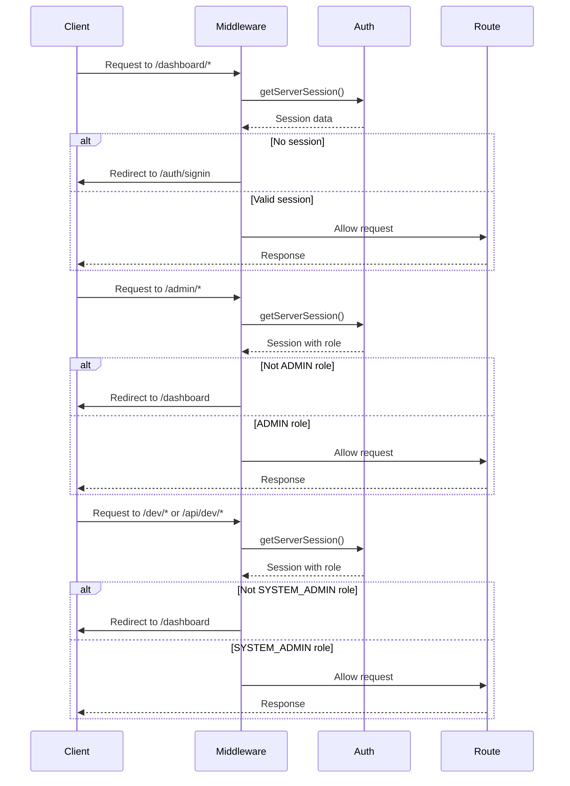
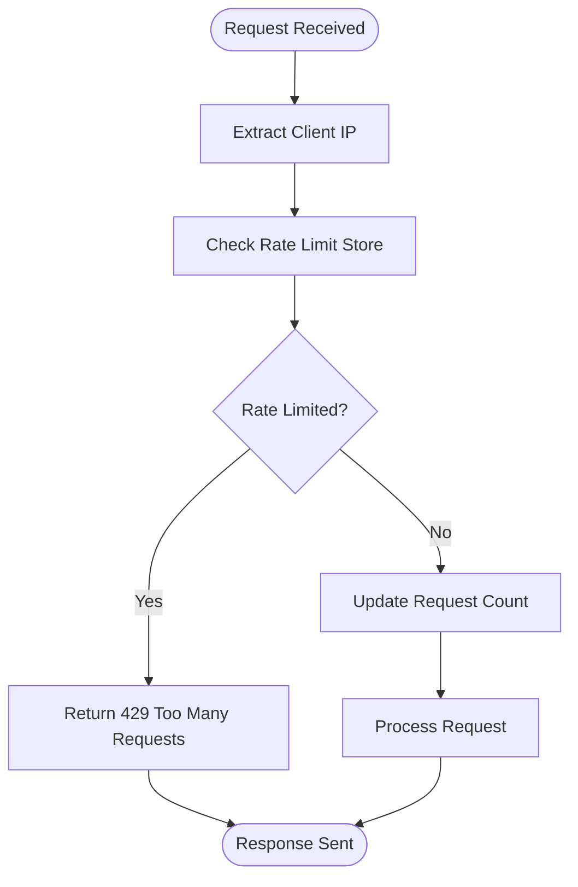
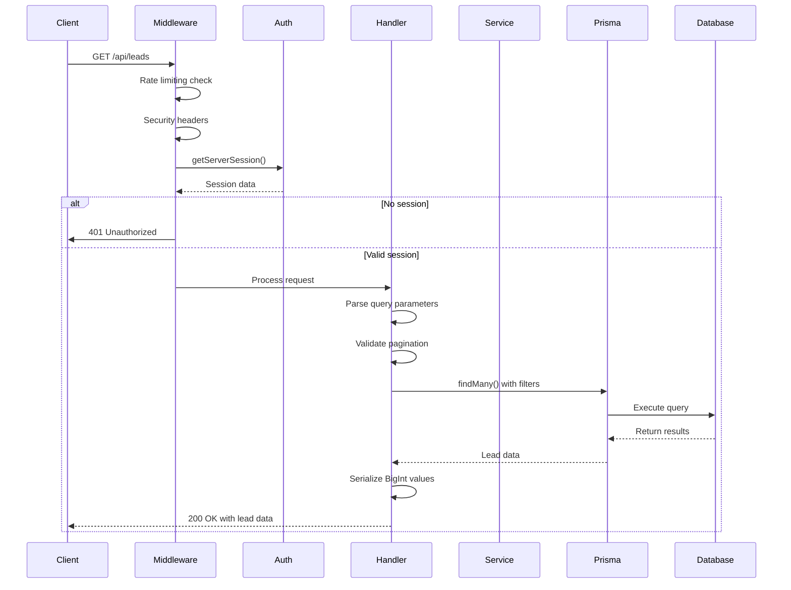
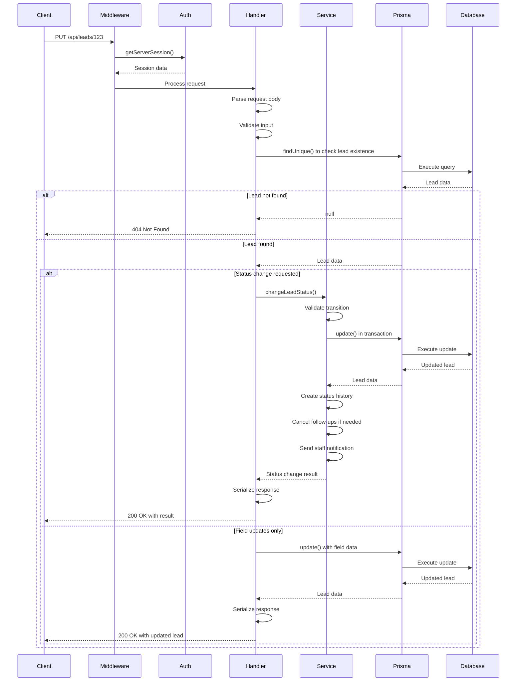
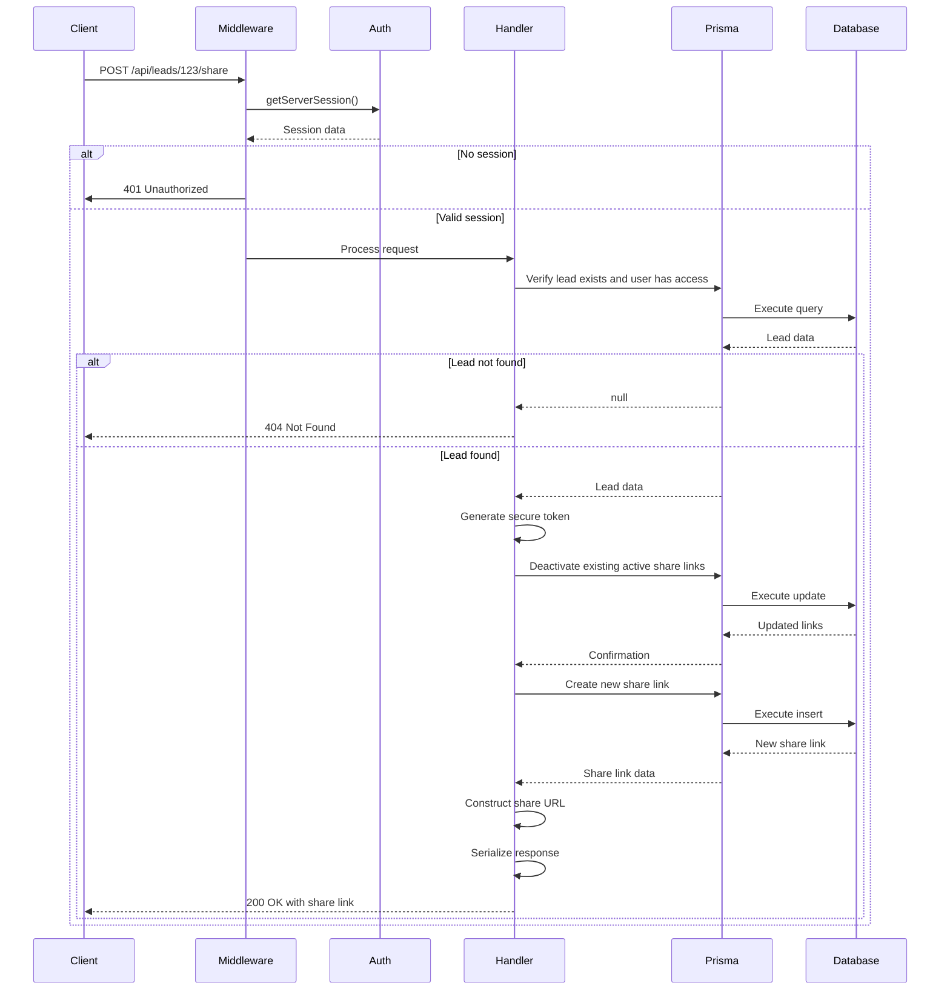
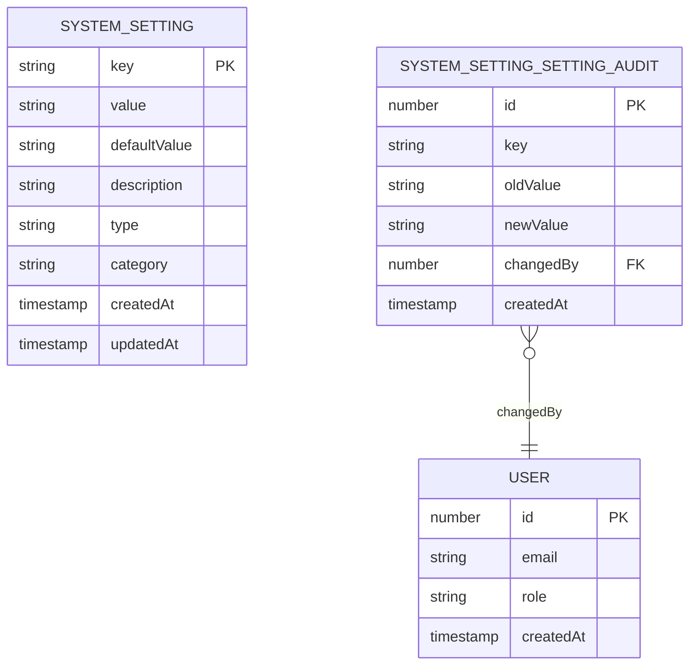
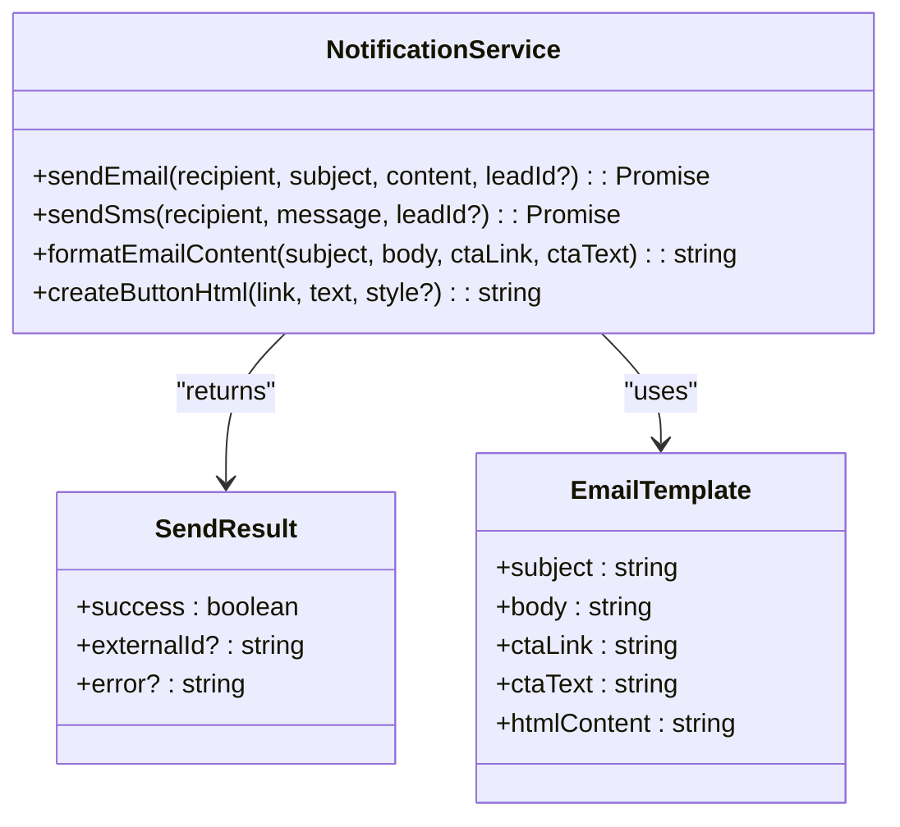
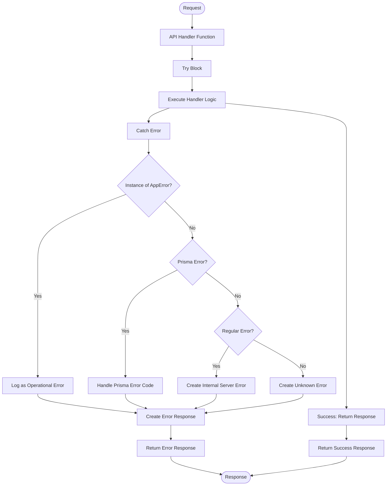

# Backend Architecture

<cite>
**Referenced Files in This Document**   
- [prisma.ts](file://src/lib/prisma.ts#L1-L61)
- [middleware.ts](file://src/middleware.ts#L1-L227) - *Updated to protect dev tools with SYSTEM_ADMIN role*
- [errors.ts](file://src/lib/errors.ts#L1-L340)
- [logger.ts](file://src/lib/logger.ts#L1-L350)
- [server-init.ts](file://src/lib/server-init.ts#L1-L128)
- [leads/route.ts](file://src/app/api/leads/route.ts#L1-L167)
- [leads/[id]/route.ts](file://src/app/api/leads/[id]/route.ts#L104-L303)
- [LeadStatusService.ts](file://src/services/LeadStatusService.ts#L1-L456)
- [system-settings.ts](file://prisma/seeds/system-settings.ts#L43-L73)
- [step3/route.ts](file://src/app/api/intake/[token]/step3/route.ts) - *Added digital signature endpoint*
- [schema.prisma](file://prisma/schema.prisma) - *Updated with digital signature and share link fields*
- [IntakeWorkflow.tsx](file://src/components/intake/IntakeWorkflow.tsx) - *Updated with digital signature step*
- [LeadDetailView.tsx](file://src/components/dashboard/LeadDetailView.tsx) - *Added digital signature display*
- [notifications.ts](file://src/lib/notifications.ts) - *Enhanced email content and button styling*
- [poll-leads/route.ts](file://src/app/api/cron/poll-leads/route.ts) - *Updated notification content*
- [BackgroundJobScheduler.ts](file://src/services/BackgroundJobScheduler.ts) - *Updated notification content*
- [FollowUpScheduler.ts](file://src/services/FollowUpScheduler.ts) - *Updated button styling*
- [share/route.ts](file://src/app/api/leads/[id]/share/route.ts) - *New share lead feature*
- [share/[token]/documents/[documentId]/route.ts](file://src/app/api/share/[token]/documents/[documentId]/route.ts) - *New shared document access endpoint*
</cite>

## Update Summary
**Changes Made**   
- Added documentation for share lead feature including API endpoints and workflow
- Updated middleware implementation to reflect SYSTEM_ADMIN role protection for dev tools
- Enhanced API route structure documentation with new share-related endpoints
- Added request lifecycle diagram for share link creation
- Updated security considerations with role-based access for development tools
- Added new diagram for lead sharing architecture
- Updated project structure to include new share API routes

## Table of Contents
1. [Introduction](#introduction)
2. [Project Structure](#project-structure)
3. [API Route Structure](#api-route-structure)
4. [Middleware Implementation](#middleware-implementation)
5. [Service Layer Pattern](#service-layer-pattern)
6. [Request Lifecycle](#request-lifecycle)
7. [Configuration Management](#configuration-management)
8. [Error Handling Strategies](#error-handling-strategies)
9. [Logging Practices](#logging-practices)
10. [Security Considerations](#security-considerations)

## Introduction
The fund-track application is a Next.js-based backend system designed to manage leads through a comprehensive lifecycle. The architecture follows modern patterns with clear separation of concerns between API routes, service layers, and data access. This document provides a comprehensive overview of the backend architecture, focusing on API design, middleware implementation, service layer patterns, and operational practices. Recent updates include the addition of a digital signature step in the intake workflow, enhanced notification content with improved button styling, and the implementation of a secure lead sharing feature with role-based access controls.

## Project Structure
The project follows a structured organization with distinct directories for different concerns:
- `prisma`: Database schema, migrations, and seed data
- `scripts`: Operational scripts for database management and system maintenance
- `src`: Main application source code
- `src/app`: Next.js App Router components and API routes
- `src/components`: Reusable UI components
- `src/lib`: Utility libraries and shared functionality
- `src/services`: Business logic encapsulation
- `test`: Test scripts for external integrations

```mermaid
graph TB
subgraph "Root"
Prisma[prisma/]
Scripts[scripts/]
Src[src/]
Test[test/]
end
subgraph "Src"
App[src/app/]
Components[src/components/]
Lib[src/lib/]
Services[src/services/]
Types[src/types/]
end
subgraph "App"
Admin[src/app/admin/]
Api[src/app/api/]
Dashboard[src/app/dashboard/]
end
subgraph "Api"
AdminApi[src/app/api/admin/]
Auth[src/app/api/auth/]
Cron[src/app/api/cron/]
Dev[src/app/api/dev/]
Health[src/app/api/health/]
Intake[src/app/api/intake/]
Leads[src/app/api/leads/]
Monitoring[src/app/api/monitoring/]
Share[src/app/api/share/] - *New share endpoints*
end
```

**Diagram sources**
- [src/app/api/leads/route.ts](file://src/app/api/leads/route.ts#L1-L167)
- [src/services/LeadStatusService.ts](file://src/services/LeadStatusService.ts#L1-L456)
- [src/app/api/leads/[id]/share/route.ts](file://src/app/api/leads/[id]/share/route.ts)
- [src/app/api/share/[token]/documents/[documentId]/route.ts](file://src/app/api/share/[token]/documents/[documentId]/route.ts)

## API Route Structure
The application uses Next.js App Router conventions for API route organization. Routes are organized by functional areas with clear path hierarchies:

- `/api/admin`: Administrative endpoints for system management
- `/api/auth`: Authentication and session management
- `/api/cron`: Scheduled job triggers
- `/api/dev`: Development and testing endpoints
- `/api/health`: Health check endpoints
- `/api/intake`: Lead intake workflow
- `/api/leads`: Lead management endpoints
- `/api/metrics`: System metrics
- `/api/monitoring`: System monitoring
- `/api/leads/[id]/share`: Generate and manage shareable links for leads
- `/api/share/[token]/documents/[documentId]`: Access shared documents without authentication

Each API route follows a consistent pattern with dynamic and static segments. For example:
- `GET /api/leads` - Retrieve paginated list of leads
- `GET /api/leads/[id]` - Retrieve specific lead by ID
- `PUT /api/leads/[id]` - Update lead information
- `GET /api/leads/[id]/status` - Retrieve lead status information
- `PUT /api/leads/[id]/status` - Update lead status
- `POST /api/intake/[token]/step3` - Submit digital signature for intake
- `POST /api/leads/[id]/share` - Generate secure share link for a lead
- `GET /api/leads/[id]/share` - Retrieve active share links for a lead
- `DELETE /api/leads/[id]/share?linkId=x` - Deactivate a specific share link
- `GET /api/share/[token]/documents/[documentId]` - Download shared document

```mermaid
graph TB
Client[Client Application]
subgraph "API Routes"
Admin[Admin Routes]
Auth[Authentication Routes]
Leads[Lead Management Routes]
Health[Health Check Routes]
Dev[Development Routes]
Intake[Intake Routes]
Share[Lead Sharing Routes]
end
Client --> |GET /api/leads| Leads
Client --> |PUT /api/leads/[id]| Leads
Client --> |GET /api/leads/[id]/status| Leads
Client --> |POST /api/auth/signin| Auth
Client --> |GET /api/health| Health
Client --> |GET /api/admin/settings| Admin
Client --> |POST /api/dev/test-notifications| Dev
Client --> |POST /api/intake/[token]/step3| Intake
Client --> |POST /api/leads/[id]/share| Share
Client --> |GET /api/leads/[id]/share| Share
Client --> |DELETE /api/leads/[id]/share| Share
Client --> |GET /api/share/[token]/documents/[documentId]| Share
style Leads fill:#4CAF50,stroke:#388E3C
style Auth fill:#2196F3,stroke:#1976D2
style Health fill:#FF9800,stroke:#F57C00
style Admin fill:#9C27B0,stroke:#7B1FA2
style Dev fill:#FF5722,stroke:#D84315
style Intake fill:#FFC107,stroke:#FFA000
style Share fill:#8BC34A,stroke:#689F38
```

**Diagram sources**
- [src/app/api/leads/route.ts](file://src/app/api/leads/route.ts#L1-L167)
- [src/app/api/leads/[id]/route.ts](file://src/app/api/leads/[id]/route.ts#L104-L303)
- [src/app/api/intake/[token]/step3/route.ts](file://src/app/api/intake/[token]/step3/route.ts)
- [src/app/api/leads/[id]/share/route.ts](file://src/app/api/leads/[id]/share/route.ts)
- [src/app/api/share/[token]/documents/[documentId]/route.ts](file://src/app/api/share/[token]/documents/[documentId]/route.ts)

**Section sources**
- [src/app/api/leads/route.ts](file://src/app/api/leads/route.ts#L1-L167)
- [src/app/api/leads/[id]/route.ts](file://src/app/api/leads/[id]/route.ts#L104-L303)
- [src/app/api/intake/[token]/step3/route.ts](file://src/app/api/intake/[token]/step3/route.ts)
- [src/app/api/leads/[id]/share/route.ts](file://src/app/api/leads/[id]/share/route.ts)
- [src/app/api/share/[token]/documents/[documentId]/route.ts](file://src/app/api/share/[token]/documents/[documentId]/route.ts)

## Middleware Implementation
The application implements comprehensive middleware for authentication, rate limiting, and security. The middleware is configured to handle various aspects of request processing before reaching the API handlers.

### Authentication and Authorization
The middleware uses NextAuth for authentication and implements role-based access control with enhanced security for development tools:



**Diagram sources**
- [src/middleware.ts](file://src/middleware.ts#L1-L227)

### Rate Limiting
The application implements rate limiting to prevent abuse:



**Diagram sources**
- [src/middleware.ts](file://src/middleware.ts#L1-L227)

### Security Headers
The middleware adds security headers to responses:

- `X-Robots-Tag: noindex, nofollow` - Prevents search engine indexing
- `Strict-Transport-Security` - Enforces HTTPS in production
- Secure cookie flags - Ensures cookies are transmitted securely

**Section sources**
- [src/middleware.ts](file://src/middleware.ts#L1-L227)

## Service Layer Pattern
The application follows a service layer pattern to encapsulate business logic, separating it from API route handlers. This promotes reusability, testability, and maintainability.

### Service Layer Organization
The services directory contains classes that encapsulate specific business domains:

- `BackgroundJobScheduler.ts`: Manages background job scheduling
- `FileUploadService.ts`: Handles file upload operations
- `FollowUpScheduler.ts`: Manages follow-up scheduling
- `LeadPoller.ts`: Polls for new leads
- `LeadStatusService.ts`: Manages lead status transitions
- `NotificationCleanupService.ts`: Cleans up notification logs
- `NotificationService.ts`: Sends notifications
- `SystemSettingsService.ts`: Manages system settings
- `TokenService.ts`: Handles token operations

### LeadStatusService Example
The `LeadStatusService` class demonstrates the service layer pattern by encapsulating lead status transition logic:

```mermaid
classDiagram
class LeadStatusService {
+statusTransitions : StatusTransitionRule[]
+validateStatusTransition(currentStatus, newStatus, reason) : {valid : boolean, error? : string}
+changeLeadStatus(request : StatusChangeRequest) : Promise<StatusChangeResult>
+getLeadStatusHistory(leadId : number) : Promise<{success : boolean, history? : any[], error? : string}>
+getAvailableTransitions(currentStatus : LeadStatus) : {status : LeadStatus, description : string, requiresReason : boolean}[]
+getStatusChangeStats(days : number) : Promise<{success : boolean, totalChanges : number, transitions : {from : LeadStatus, to : LeadStatus, count : number}[], error? : string}>
}
class StatusChangeRequest {
+leadId : number
+newStatus : LeadStatus
+changedBy : number
+reason? : string
}
class StatusChangeResult {
+success : boolean
+lead? : any
+error? : string
+followUpsCancelled? : boolean
+staffNotificationSent? : boolean
}
class StatusTransitionRule {
+from : LeadStatus
+to : LeadStatus[]
+requiresReason? : boolean
+description : string
}
LeadStatusService --> StatusChangeRequest : "uses"
LeadStatusService --> StatusChangeResult : "returns"
LeadStatusService --> StatusTransitionRule : "contains"
```

**Diagram sources**
- [src/services/LeadStatusService.ts](file://src/services/LeadStatusService.ts#L1-L456)

**Section sources**
- [src/services/LeadStatusService.ts](file://src/services/LeadStatusService.ts#L1-L456)

## Request Lifecycle
The request lifecycle follows a structured flow from HTTP ingress to database operations and external service calls.

### GET /api/leads Request Flow


**Diagram sources**
- [src/app/api/leads/route.ts](file://src/app/api/leads/route.ts#L1-L167)

### PUT /api/leads/[id] Request Flow


**Diagram sources**
- [src/app/api/leads/[id]/route.ts](file://src/app/api/leads/[id]/route.ts#L104-L303)
- [src/services/LeadStatusService.ts](file://src/services/LeadStatusService.ts#L1-L456)

### POST /api/intake/[token]/step3 Request Flow
```mermaid
sequenceDiagram
participant Client
participant Middleware
participant Auth
participant Handler
participant Service
participant Prisma
participant Database
Client->>Middleware : POST /api/intake/abc123/step3
Middleware->>Middleware : Rate limiting check
Middleware->>Middleware : Security headers
Middleware->>Handler : Process request
Handler->>Handler : Parse request body
Handler->>Handler : Validate digital signature
Handler->>Service : TokenService.validateToken()
Service-->>Handler : Intake session data
alt Invalid token
Handler-->>Client : 400 Bad Request
else Valid token
alt Step 1 or 2 not completed
Handler-->>Client : 400 Bad Request
else Step 3 already completed
Handler-->>Client : 400 Bad Request
else Valid request
Handler->>Prisma : Update lead with digital signature
Prisma->>Database : Execute update
Database-->>Prisma : Updated lead
Prisma-->>Handler : Lead data
Handler->>Prisma : Update intake session
Prisma->>Database : Execute update
Database-->>Prisma : Updated session
Prisma-->>Handler : Session data
Handler->>Handler : Set step3CompletedAt timestamp
Handler->>Handler : Set signatureDate
Handler->>Handler : Serialize response
Handler-->>Client : 200 OK with success
end
end
end
```

**Diagram sources**
- [src/app/api/intake/[token]/step3/route.ts](file://src/app/api/intake/[token]/step3/route.ts)
- [src/services/TokenService.ts](file://src/services/TokenService.ts)

**Section sources**
- [src/app/api/intake/[token]/step3/route.ts](file://src/app/api/intake/[token]/step3/route.ts)
- [src/services/TokenService.ts](file://src/services/TokenService.ts)

### POST /api/leads/[id]/share Request Flow


**Diagram sources**
- [src/app/api/leads/[id]/share/route.ts](file://src/app/api/leads/[id]/share/route.ts)

**Section sources**
- [src/app/api/leads/[id]/share/route.ts](file://src/app/api/leads/[id]/share/route.ts)

## Configuration Management
The application uses environment variables and system settings for configuration management.

### Environment Variables
Configuration is managed through environment variables with appropriate defaults and validation:

- `DATABASE_URL`: Database connection string
- `NODE_ENV`: Application environment (development, production)
- `ENABLE_RATE_LIMITING`: Controls rate limiting
- `RATE_LIMIT_WINDOW_MS`: Rate limiting window duration
- `RATE_LIMIT_MAX_REQUESTS`: Maximum requests per window
- `FORCE_HTTPS`: Enforces HTTPS in production
- `SECURE_COOKIES`: Enables secure cookie flags
- `ENABLE_DEV_ENDPOINTS`: Controls access to development endpoints
- `ENABLE_BACKGROUND_JOBS`: Controls background job execution

### System Settings
The application also uses a database-stored system settings mechanism:



**Diagram sources**
- [prisma/seeds/system-settings.ts](file://prisma/seeds/system-settings.ts#L43-L73)
- [src/services/SystemSettingsService.ts](file://src/services/SystemSettingsService.ts#L1-L289)

### Notification Content and Styling
Recent updates have enhanced the email content and button styling in notifications:



**Diagram sources**
- [src/lib/notifications.ts](file://src/lib/notifications.ts)
- [src/app/api/cron/poll-leads/route.ts](file://src/app/api/cron/poll-leads/route.ts)
- [src/services/BackgroundJobScheduler.ts](file://src/services/BackgroundJobScheduler.ts)
- [src/services/FollowUpScheduler.ts](file://src/services/FollowUpScheduler.ts)

**Section sources**
- [src/lib/notifications.ts](file://src/lib/notifications.ts)
- [src/app/api/cron/poll-leads/route.ts](file://src/app/api/cron/poll-leads/route.ts)
- [src/services/BackgroundJobScheduler.ts](file://src/services/BackgroundJobScheduler.ts)
- [src/services/FollowUpScheduler.ts](file://src/services/FollowUpScheduler.ts)

## Error Handling Strategies
The application implements a comprehensive error handling strategy with standardized error types and response formatting.

### Error Class Hierarchy

```mermaid
classDiagram
class AppError {
<<abstract>>
+statusCode : number
+code : string
+isOperational : boolean
+context? : Record<string, any>
+constructor(message : string, context? : Record<string, any>)
}
AppError <|-- ValidationError
AppError <|-- AuthenticationError
AppError <|-- AuthorizationError
AppError <|-- NotFoundError
AppError <|-- ConflictError
AppError <|-- RateLimitError
AppError <|-- DatabaseError
AppError <|-- ExternalServiceError
AppError <|-- InternalServerError
AppError <|-- FileOperationError
class ValidationError {
+statusCode : 400
+code : "VALIDATION_ERROR"
+isOperational : true
+field? : string
}
class AuthenticationError {
+statusCode : 401
+code : "AUTHENTICATION_ERROR"
+isOperational : true
}
class AuthorizationError {
+statusCode : 403
+code : "AUTHORIZATION_ERROR"
+isOperational : true
}
class NotFoundError {
+statusCode : 404
+code : "NOT_FOUND_ERROR"
+isOperational : true
+resource : string
+id? : string | number
}
class ConflictError {
+statusCode : 409
+code : "CONFLICT_ERROR"
+isOperational : true
}
class RateLimitError {
+statusCode : 429
+code : "RATE_LIMIT_ERROR"
+isOperational : true
}
class DatabaseError {
+statusCode : 500
+code : "DATABASE_ERROR"
+isOperational : true
+operation? : string
}
class ExternalServiceError {
+statusCode : 502
+code : "EXTERNAL_SERVICE_ERROR"
+isOperational : true
+service : string
+originalError? : Error
}
class InternalServerError {
+statusCode : 500
+code : "INTERNAL_SERVER_ERROR"
+isOperational : false
}
class FileOperationError {
+statusCode : 500
+code : "FILE_OPERATION_ERROR"
+isOperational : true
+operation : string
+filename? : string
}
```


**Diagram sources**
- [src/lib/errors.ts](file://src/lib/errors.ts#L1-L340)

### Error Handling Middleware
The `withErrorHandler` higher-order function wraps API handlers to provide consistent error handling:



**Diagram sources**
- [src/lib/errors.ts](file://src/lib/errors.ts#L1-L340)

**Section sources**
- [src/lib/errors.ts](file://src/lib/errors.ts#L1-L340)

## Logging Practices
The application implements structured logging with different log levels and context information.

### Logger Implementation
The logger uses Winston for server-side logging with custom levels and formats:

```mermaid
classDiagram
class Logger {
+levels : {error : 0, warn : 1, info : 2, http : 3, debug : 4}
+colors : {error : red, warn : yellow, info : green, http : magenta, debug : white}
+logFormat : format.combine()
+consoleFormat : format.combine()
+createLogger() : winston.Logger
+error(message : string, ...args : any[])
+warn(message : string, ...args : any[])
+info(message : string, ...args : any[])
+http(message : string, ...args : any[])
+debug(message : string, ...args : any[])
+child(context : Record<string, any>) : Logger
}
class ApiLogContext {
+method? : string
+url? : string
+statusCode? : number
+duration? : number
+userId? : string | number
+userAgent? : string
+ip? : string
}
class DatabaseLogContext {
+operation? : string
+table? : string
+duration? : number
+query? : string
+params? : any[]
}
class ExternalServiceLogContext {
+service? : string
+operation? : string
+success? : boolean
+duration? : number
+statusCode? : number
+retryCount? : number
}
Logger --> ApiLogContext : "supports"
Logger --> DatabaseLogContext : "supports"
Logger --> ExternalServiceLogContext : "supports"
```

**Diagram sources**
- [src/lib/logger.ts](file://src/lib/logger.ts#L1-L350)

### Log Context Types
The application uses specialized log contexts for different types of operations:

- `ApiLogContext`: For API request logging with method, URL, status code, duration, and user information
- `DatabaseLogContext`: For database operations with operation type, table, duration, query, and parameters
- `ExternalServiceLogContext`: For external service calls with service name, operation, success status, duration, and status code

**Section sources**
- [src/lib/logger.ts](file://src/lib/logger.ts#L1-L350)

## Security Considerations
The application implements multiple security measures to protect against common threats.

### Authentication and Authorization
- NextAuth integration for secure authentication
- Role-based access control (RBAC) for admin routes
- Protected routes require authentication
- Admin-only routes enforce role requirements
- SYSTEM_ADMIN role required for development tools and endpoints

### Rate Limiting
- IP-based rate limiting to prevent abuse
- Configurable window duration and request limits
- 429 responses with Retry-After header

### Security Headers
- `X-Robots-Tag` to prevent search engine indexing
- `Strict-Transport-Security` to enforce HTTPS
- Secure cookie flags in production
- Protection against suspicious bot traffic

### Input Validation
- Comprehensive validation in API routes
- Use of standardized error types for validation failures
- Protection against injection attacks through Prisma parameterization

### Error Handling
- Operational vs. non-operational error distinction
- Sensitive error details hidden in production
- Structured error responses with request IDs for tracking

### Environment Protection
- Build-time detection to prevent database connections during build
- Configuration validation at startup
- Secure handling of environment variables

### Digital Signature Security
- Digital signature stored as base64-encoded image data
- Signature date automatically recorded upon submission
- Step completion timestamps prevent workflow skipping
- Token validation ensures only authorized users can submit signatures

### Lead Sharing Security
- Secure random token generation using crypto.randomBytes
- Token expiration set to 7 days
- One active share link per lead at a time
- Access logging with access count and timestamp
- Deactivation of previous share links when new ones are created
- Validation of token, expiration, and active status before document access

**Section sources**
- [src/middleware.ts](file://src/middleware.ts#L1-L227)
- [src/lib/errors.ts](file://src/lib/errors.ts#L1-L340)
- [src/lib/prisma.ts](file://src/lib/prisma.ts#L1-L61)
- [src/lib/server-init.ts](file://src/lib/server-init.ts#L1-L128)
- [src/app/api/intake/[token]/step3/route.ts](file://src/app/api/intake/[token]/step3/route.ts)
- [src/app/api/leads/[id]/share/route.ts](file://src/app/api/leads/[id]/share/route.ts)
- [src/app/api/share/[token]/documents/[documentId]/route.ts](file://src/app/api/share/[token]/documents/[documentId]/route.ts)
- [prisma/schema.prisma](file://prisma/schema.prisma)