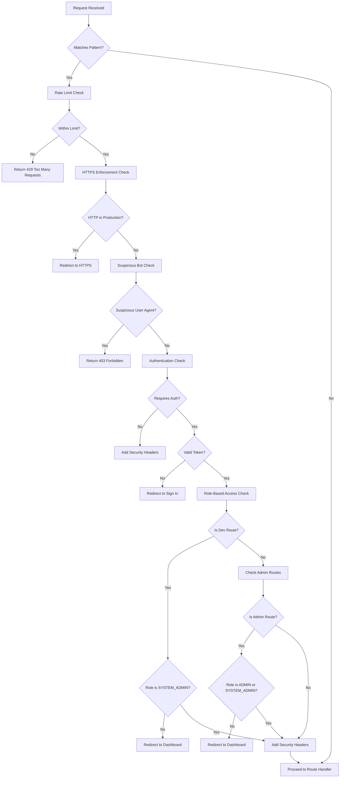
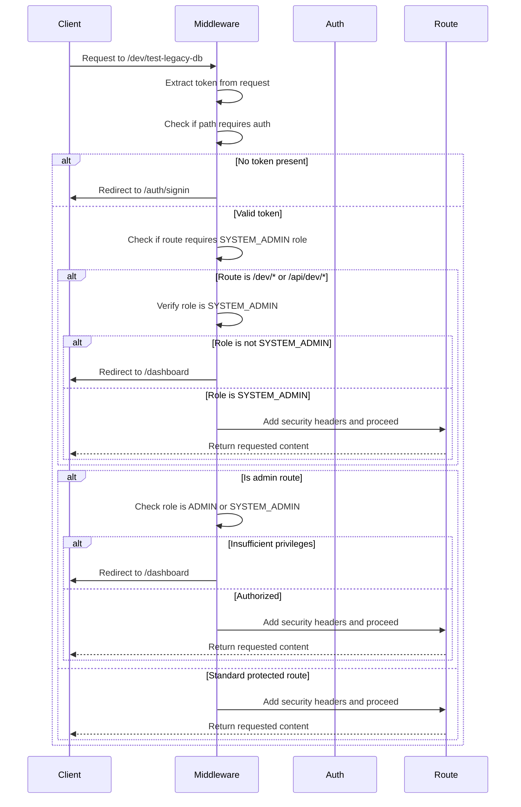
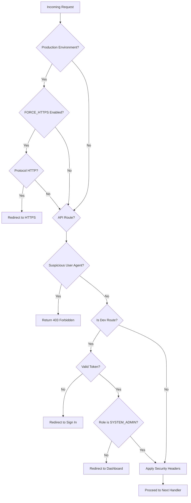
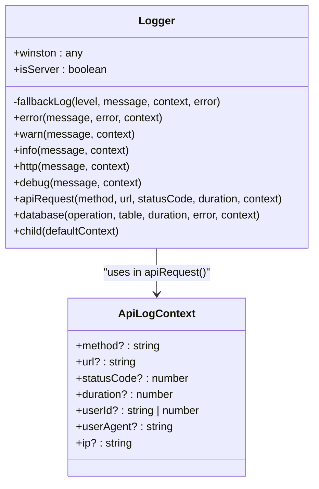
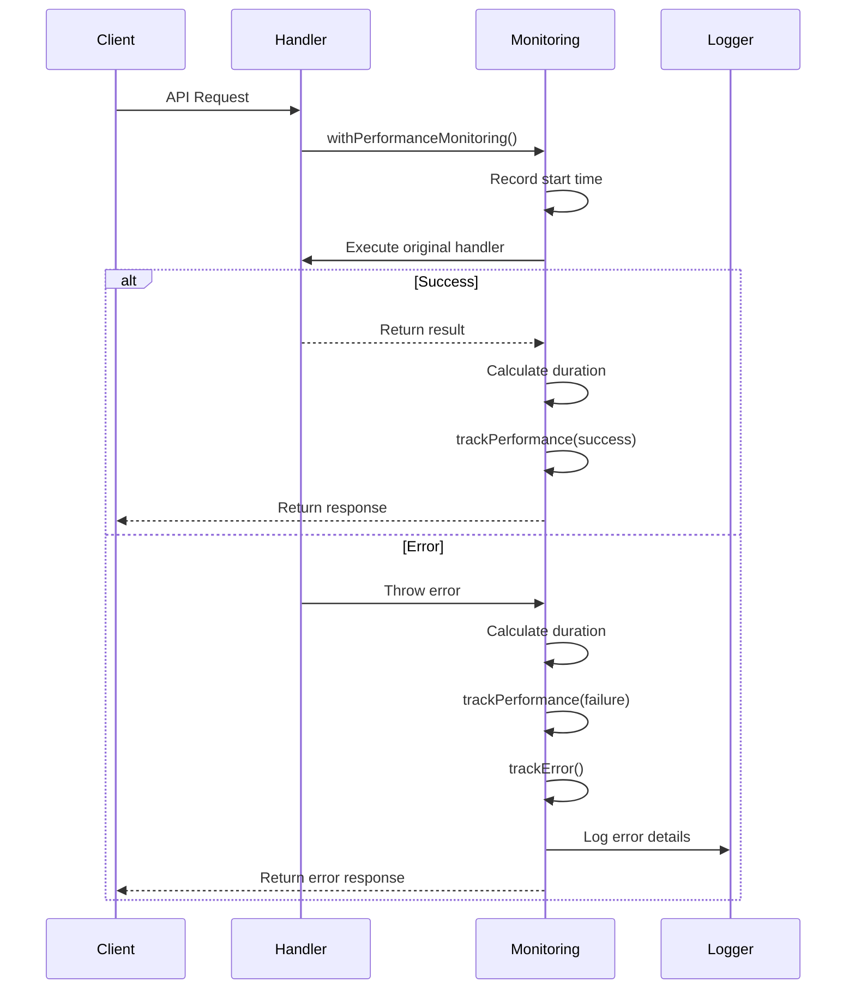
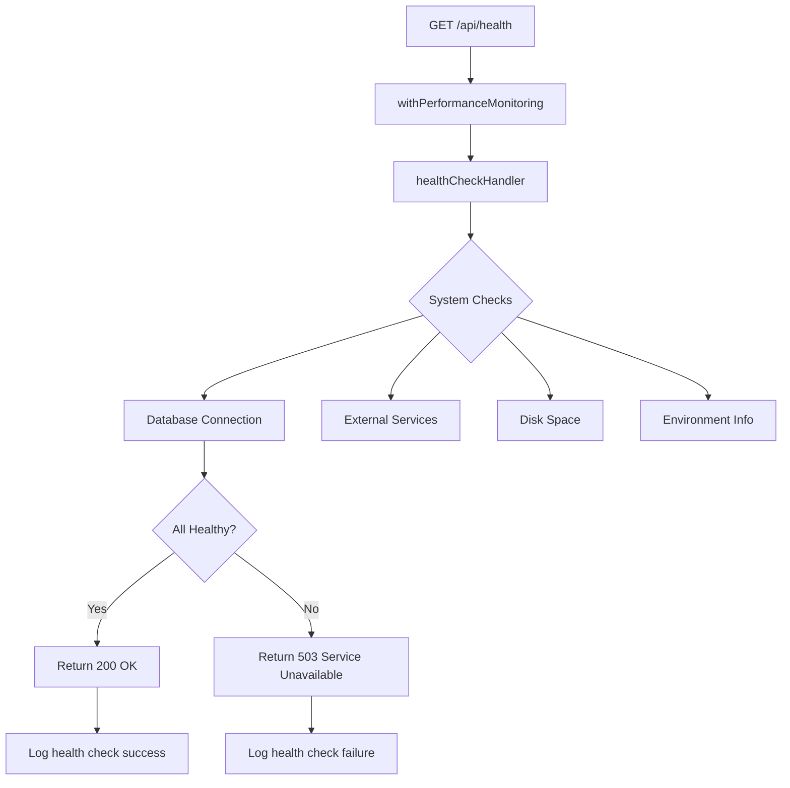
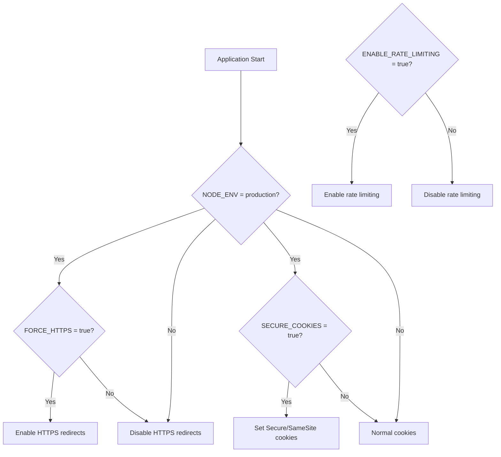

# Middleware Implementation

<cite>
**Referenced Files in This Document**   
- [middleware.ts](file://src/middleware.ts) - *Updated to include SYSTEM_ADMIN role checks for dev routes*
- [logger.ts](file://src/lib/logger.ts)
- [monitoring.ts](file://src/lib/monitoring.ts)
- [next.config.mjs](file://next.config.mjs)
- [api/health/route.ts](file://src/app/api/health/route.ts)
- [api/monitoring/status/route.ts](file://src/app/api/monitoring/status/route.ts)
- [prisma/migrations/20250906054914_add_system_admin_role/migration.sql](file://prisma/migrations/20250906054914_add_system_admin_role/migration.sql) - *Added SYSTEM_ADMIN role to user_role enum*
- [scripts/promote-to-system-admin.mjs](file://scripts/promote-to-system-admin.mjs) - *Script to promote users to SYSTEM_ADMIN role*
- [api/admin/users/route.ts](file://src/app/api/admin/users/route.ts) - *Admin API with SYSTEM_ADMIN role checks*
</cite>

## Update Summary
**Changes Made**   
- Updated Authentication and Authorization section to include SYSTEM_ADMIN role protection for /dev and /api/dev routes
- Enhanced Security Enforcement section with details about role-based access control for development tools
- Added new information about the SYSTEM_ADMIN role implementation and its impact on middleware behavior
- Updated diagrams to reflect the new authorization flow for development endpoints
- Added references to new and modified files related to the SYSTEM_ADMIN role implementation

## Table of Contents
1. [Introduction](#introduction)
2. [Middleware Configuration and Execution Flow](#middleware-configuration-and-execution-flow)
3. [Authentication and Authorization](#authentication-and-authorization)
4. [Security Enforcement](#security-enforcement)
5. [Request Logging and Monitoring](#request-logging-and-monitoring)
6. [Performance and Error Monitoring](#performance-and-error-monitoring)
7. [Health Checks and Metrics Collection](#health-checks-and-metrics-collection)
8. [Environment-Specific Behavior](#environment-specific-behavior)
9. [Common Middleware Patterns](#common-middleware-patterns)

## Introduction
The middleware implementation in the fund-track application serves as a central control layer for handling incoming HTTP requests before they reach their destination routes. It provides essential functionality including authentication enforcement, security hardening, rate limiting, request logging, and performance monitoring. Built on Next.js middleware capabilities, this implementation intercepts requests to protected routes such as the dashboard, API endpoints, admin interfaces, and application intake flows. The middleware operates in a sequential execution model, processing requests through multiple validation and enrichment steps before allowing them to proceed to their intended handlers.

**Section sources**
- [middleware.ts](file://src/middleware.ts#L0-L189)

## Middleware Configuration and Execution Flow

The middleware is configured to intercept requests to specific route patterns defined in the matcher configuration. This selective interception ensures that only relevant routes undergo middleware processing, optimizing performance while maintaining security coverage across critical application areas.

**Diagram sources**
- [middleware.ts](file://src/middleware.ts#L0-L189)

**Section sources**
- [middleware.ts](file://src/middleware.ts#L170-L189)

## Authentication and Authorization

The middleware implements a comprehensive authentication and authorization system using Next-Auth integration. It protects routes based on path patterns, allowing unauthenticated access to public routes while enforcing authentication for protected areas such as the dashboard and API endpoints.

The authorization callback determines access based on the request path and user token. Public routes like application intake pages, authentication endpoints, health checks, and intake API endpoints are accessible without authentication. All dashboard routes, API routes (except health and intake), and development endpoints require a valid authentication token.

The middleware now includes specific protection for development tools, requiring the SYSTEM_ADMIN role for access to /dev and /api/dev routes. This change enhances security by restricting access to potentially sensitive development and diagnostic tools to only the most privileged users.

**Diagram sources**
- [middleware.ts](file://src/middleware.ts#L128-L162)

**Section sources**
- [middleware.ts](file://src/middleware.ts#L128-L162)
- [middleware.ts](file://src/middleware.ts#L127-L167)
- [prisma/migrations/20250906054914_add_system_admin_role/migration.sql](file://prisma/migrations/20250906054914_add_system_admin_role/migration.sql#L0-L1)
- [scripts/promote-to-system-admin.mjs](file://scripts/promote-to-system-admin.mjs#L0-L69)

## Security Enforcement

The middleware implements multiple security layers to protect the application from common threats and vulnerabilities. These security measures include HTTPS enforcement, bot protection, security header injection, secure cookie handling, and role-based access control for development tools.

### Security Measures Implemented

- **HTTPS Enforcement**: Automatically redirects HTTP requests to HTTPS in production environments when FORCE_HTTPS is enabled
- **Bot Protection**: Blocks suspicious bots and scrapers from accessing API endpoints while allowing legitimate search engine crawlers
- **Security Headers**: Adds X-Robots-Tag to prevent indexing, and HSTS headers in production
- **Secure Cookies**: Modifies cookie headers to include Secure and SameSite=Strict attributes in production
- **Rate Limiting**: Prevents abuse through IP-based request throttling with configurable limits
- **Role-Based Access Control**: Restricts access to development tools to users with the SYSTEM_ADMIN role

The implementation of the SYSTEM_ADMIN role for development tool access represents a significant security enhancement. This role was added to the user_role enum through a database migration and is enforced at the middleware level for both UI and API development endpoints. Access to these tools is now restricted to users with this specific role, preventing potential security risks from unauthorized access to diagnostic and testing functionality.

**Diagram sources**
- [middleware.ts](file://src/middleware.ts#L87-L126)
- [middleware.ts](file://src/middleware.ts#L47-L85)
- [middleware.ts](file://src/middleware.ts#L127-L167)

**Section sources**
- [middleware.ts](file://src/middleware.ts#L47-L126)
- [middleware.ts](file://src/middleware.ts#L127-L167)
- [prisma/migrations/20250906054914_add_system_admin_role/migration.sql](file://prisma/migrations/20250906054914_add_system_admin_role/migration.sql#L0-L1)
- [scripts/promote-to-system-admin.mjs](file://scripts/promote-to-system-admin.mjs#L0-L69)
- [api/admin/users/route.ts](file://src/app/api/admin/users/route.ts#L48-L97)

## Request Logging and Monitoring

The middleware integrates with the application's logging system to capture detailed information about incoming requests. The logger implementation provides structured logging capabilities that work in both server and browser environments, using Winston for server-side logging with custom formatting and levels.

The logging system captures API request details including method, URL, status code, duration, user ID, user agent, and IP address. Different log levels (error, warn, info, http, debug) provide granular control over verbosity. In production, logs are formatted as JSON for easy parsing and analysis, while development environments use colorized console output.

**Diagram sources**
- [logger.ts](file://src/lib/logger.ts#L0-L350)

**Section sources**
- [logger.ts](file://src/lib/logger.ts#L0-L350)

## Performance and Error Monitoring

The application implements performance monitoring through higher-order functions that wrap API route handlers. This approach allows for automatic tracking of execution time, success/failure status, and error details without modifying the core business logic.

The monitoring system tracks both performance metrics and error occurrences, maintaining counters and timing information in memory stores. Each monitored operation is identified by a name, allowing for detailed analysis of specific endpoints or functionality.

**Diagram sources**
- [monitoring.ts](file://src/lib/monitoring.ts#L130-L167)
- [api/monitoring/status/route.ts](file://src/app/api/monitoring/status/route.ts#L0-L61)

**Section sources**
- [monitoring.ts](file://src/lib/monitoring.ts#L130-L167)
- [api/monitoring/status/route.ts](file://src/app/api/monitoring/status/route.ts#L0-L61)

## Health Checks and Metrics Collection

Health check endpoints are specifically designed to be accessible without authentication and are integrated with performance monitoring. The health check system evaluates various aspects of the application's status, including environment information, memory usage, and uptime.

The monitoring status endpoint provides detailed information about the monitoring system itself, including metrics store size, error store size, and connectivity test results. Both endpoints include performance monitoring to track their own response times and detect potential performance degradation.

**Diagram sources**
- [api/health/route.ts](file://src/app/api/health/route.ts#L268-L293)
- [monitoring.ts](file://src/lib/monitoring.ts#L169-L229)

**Section sources**
- [api/health/route.ts](file://src/app/api/health/route.ts#L268-L293)
- [monitoring.ts](file://src/lib/monitoring.ts#L169-L229)

## Environment-Specific Behavior

The middleware adapts its behavior based on environment variables, providing different functionality in development versus production environments. This configuration-driven approach allows for flexible deployment strategies while maintaining security in production.

### Environment Variables and Their Effects

- **NODE_ENV**: Determines whether the application is running in development, staging, or production mode
- **FORCE_HTTPS**: When true in production, enforces HTTPS by redirecting HTTP requests
- **ENABLE_RATE_LIMITING**: Controls whether rate limiting is active
- **RATE_LIMIT_WINDOW_MS**: Configures the time window for rate limiting (default: 900000ms/15 minutes)
- **RATE_LIMIT_MAX_REQUESTS**: Sets the maximum number of requests allowed per IP in the window
- **ENABLE_DEV_ENDPOINTS**: Allows access to development endpoints even in production when true
- **SECURE_COOKIES**: When true in production, ensures cookies are marked as Secure and SameSite=Strict

The next.config.mjs file also contains environment-specific configurations, including HTTP to HTTPS redirects in production and optimization settings.

**Diagram sources**
- [middleware.ts](file://src/middleware.ts#L87-L126)
- [next.config.mjs](file://next.config.mjs#L73-L107)

**Section sources**
- [middleware.ts](file://src/middleware.ts#L87-L126)
- [next.config.mjs](file://next.config.mjs#L73-L107)

## Common Middleware Patterns

The implementation demonstrates several common middleware patterns that can be reused across applications:

### Rate Limiting Pattern
Uses an in-memory Map to track request counts by IP address with configurable time windows and limits. In production deployments, this would typically be replaced with a distributed store like Redis.

### Security Header Injection
Implements a reusable function that adds security headers to responses, which can be applied consistently across different routes and handlers.

### Conditional Route Protection
Uses path-based rules to determine which routes require authentication, allowing public access to specific routes while protecting others.

### Environment-Aware Configuration
Leverages environment variables to modify behavior without code changes, enabling different configurations for development, staging, and production.

### Layered Security Approach
Implements multiple security checks in sequence (rate limiting, HTTPS enforcement, bot detection, authentication) to create defense in depth.

### Monitoring Integration
Uses higher-order functions to wrap handlers with performance monitoring, separating cross-cutting concerns from business logic.

### Role-Based Access Control
Extends the authorization model to include role-based access control for specific route patterns, particularly for development and administrative tools.

These patterns demonstrate best practices for middleware implementation, providing a balance between security, performance, and maintainability.

**Section sources**
- [middleware.ts](file://src/middleware.ts#L0-L189)
- [monitoring.ts](file://src/lib/monitoring.ts#L130-L167)
- [logger.ts](file://src/lib/logger.ts#L0-L350)
- [prisma/migrations/20250906054914_add_system_admin_role/migration.sql](file://prisma/migrations/20250906054914_add_system_admin_role/migration.sql#L0-L1)
- [scripts/promote-to-system-admin.mjs](file://scripts/promote-to-system-admin.mjs#L0-L69)