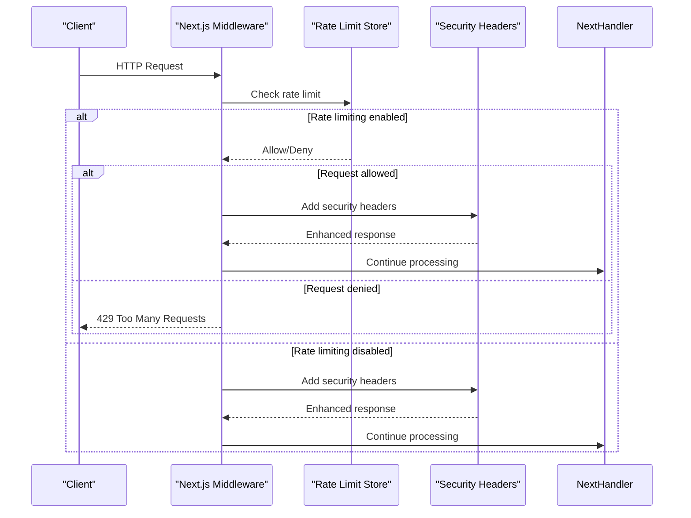
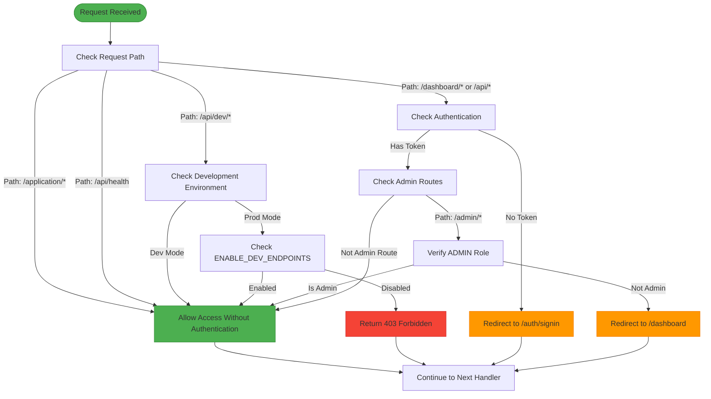
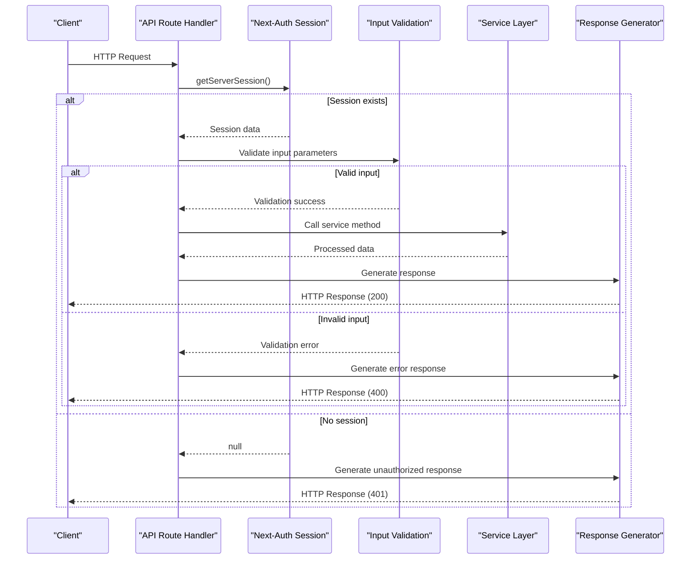
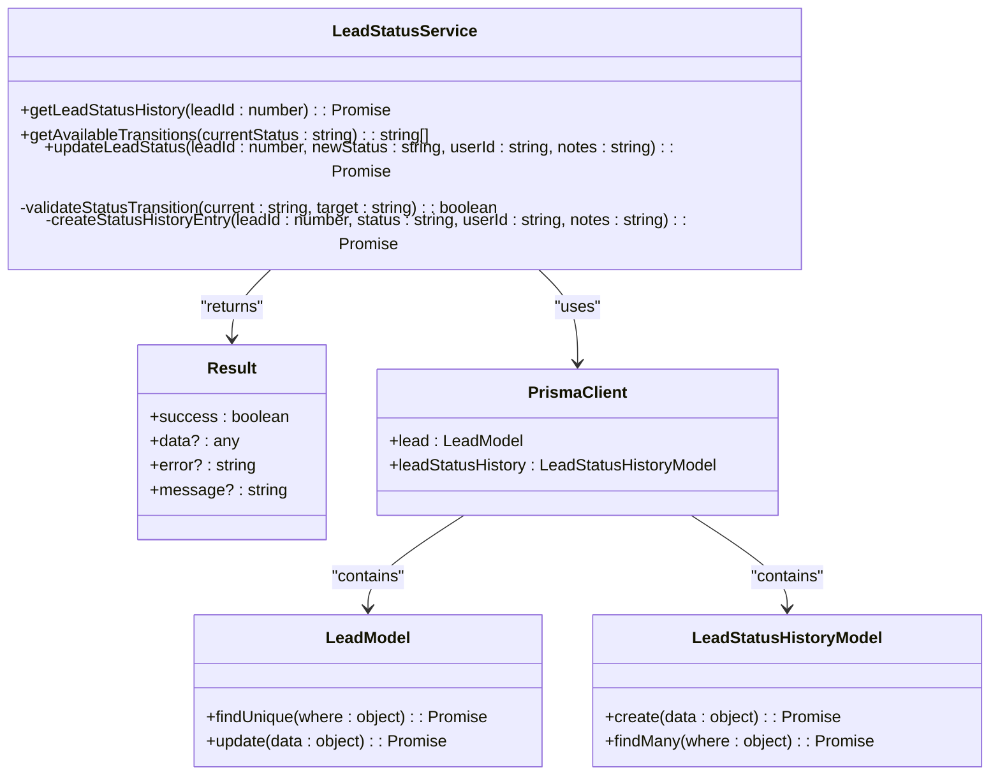
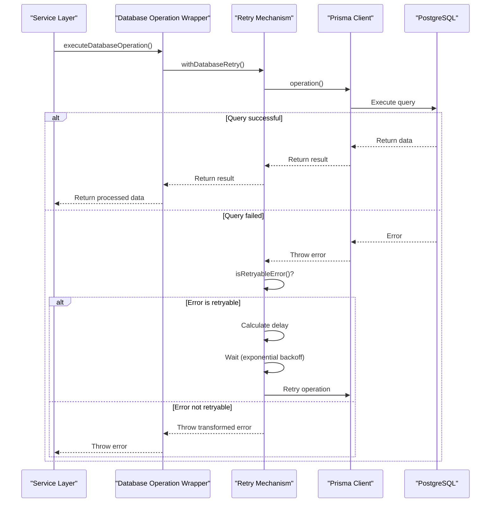
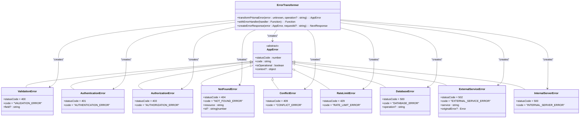
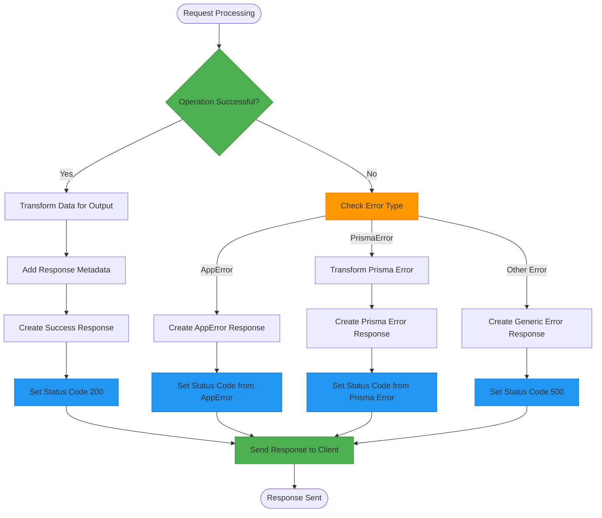
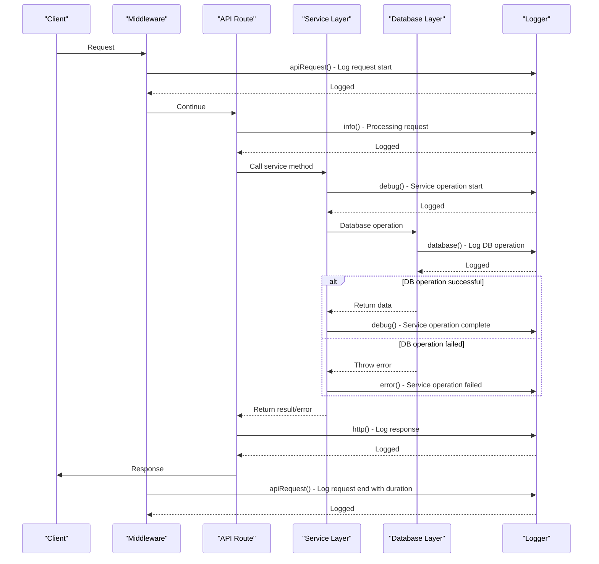
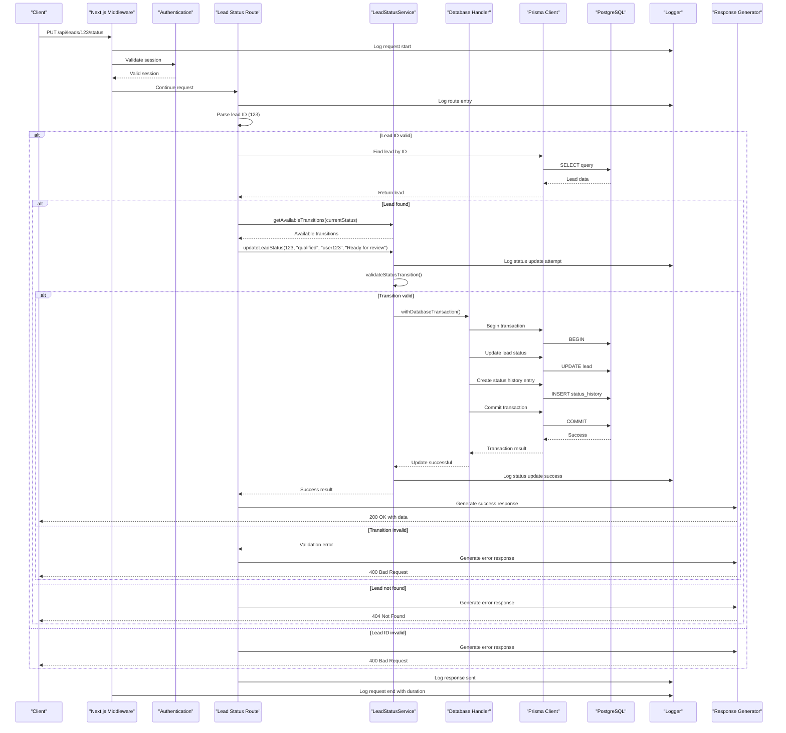
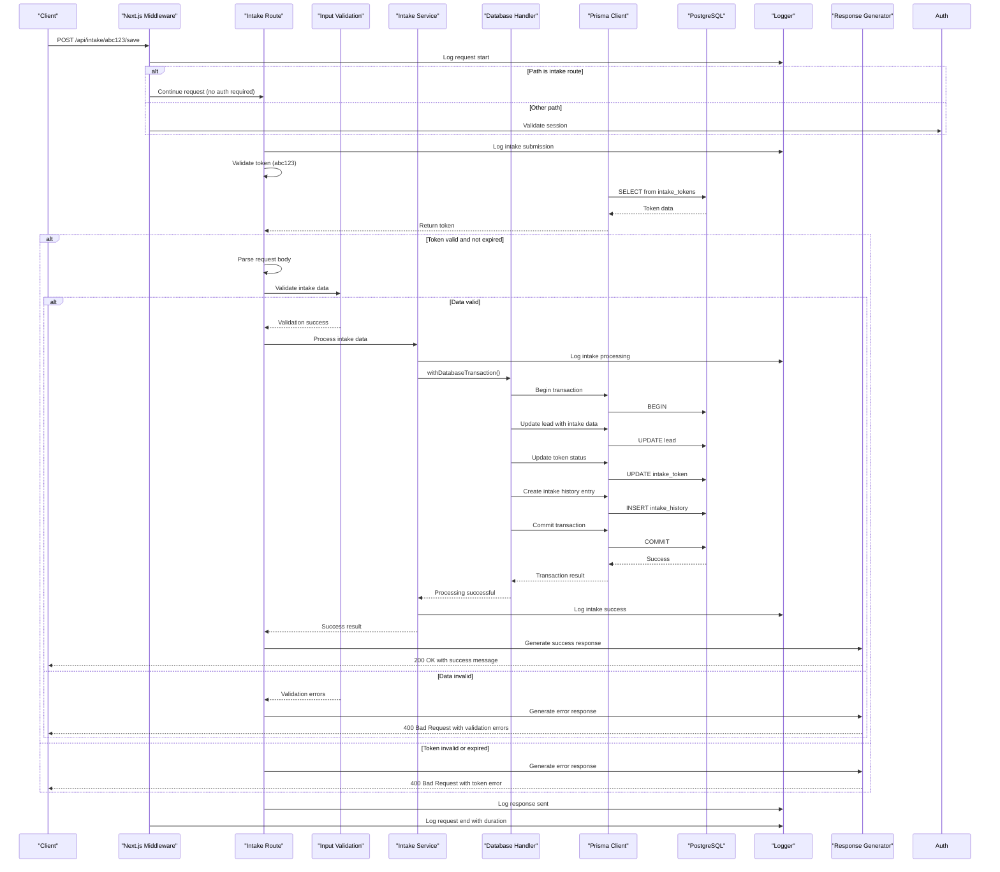

# Request Lifecycle and Data Flow

<cite>
**Referenced Files in This Document**   
- [middleware.ts](file://src/middleware.ts#L1-L189)
- [prisma.ts](file://src/lib/prisma.ts#L1-L61)
- [database-error-handler.ts](file://src/lib/database-error-handler.ts#L1-L321)
- [errors.ts](file://src/lib/errors.ts#L1-L340)
- [logger.ts](file://src/lib/logger.ts#L1-L351)
- [route.ts](file://src/app/api/leads/[id]/status/route.ts#L1-L64)
- [LeadStatusService.ts](file://src/services/LeadStatusService.ts)
</cite>

## Table of Contents
1. [Introduction](#introduction)
2. [Request Ingress and Middleware Processing](#request-ingress-and-middleware-processing)
3. [Authentication and Authorization Flow](#authentication-and-authorization-flow)
4. [API Route Handling](#api-route-handling)
5. [Service Layer and Business Logic](#service-layer-and-business-logic)
6. [Prisma Operations and Database Interaction](#prisma-operations-and-database-interaction)
7. [Error Handling and Propagation](#error-handling-and-propagation)
8. [Response Generation and Serialization](#response-generation-and-serialization)
9. [Logging and Context Preservation](#logging-and-context-preservation)
10. [End-to-End Example: Updating Lead Status](#end-to-end-example-updating-lead-status)
11. [End-to-End Example: Submitting Intake Data](#end-to-end-example-submitting-intake-data)

## Introduction
This document provides a comprehensive analysis of the request lifecycle and data flow in the fund-track backend system. It traces the journey of an HTTP request from initial ingress through middleware, authentication, API route handling, service invocation, Prisma operations, and response generation. The document illustrates data transformation at each layer, including input validation, business logic processing, and output serialization. It also documents error propagation and handling strategies across layers, including database error translation and client-facing error responses. The analysis highlights logging practices and contextual information preserved throughout the request lifecycle, using concrete examples such as updating a lead status or submitting intake data to demonstrate end-to-end flow.

## Request Ingress and Middleware Processing

The request lifecycle begins with the Next.js middleware, which acts as the first point of contact for incoming HTTP requests. The middleware performs several critical functions including rate limiting, security header injection, and request routing.

**Diagram sources**
- [middleware.ts](file://src/middleware.ts#L1-L189)

**Section sources**
- [middleware.ts](file://src/middleware.ts#L1-L189)

## Authentication and Authorization Flow

The authentication and authorization flow is implemented through Next-Auth integration in the middleware. The system checks for valid sessions and enforces access controls based on user roles and route requirements.

**Diagram sources**
- [middleware.ts](file://src/middleware.ts#L1-L189)

**Section sources**
- [middleware.ts](file://src/middleware.ts#L1-L189)

## API Route Handling

API route handling is implemented using Next.js App Router conventions. Each API endpoint is defined as a route.ts file that exports HTTP method handlers (GET, POST, PUT, DELETE, etc.). The route handlers receive the request and route parameters, perform necessary processing, and return a response.

**Section sources**
- [route.ts](file://src/app/api/leads/[id]/status/route.ts#L1-L64)

## Service Layer and Business Logic

The service layer contains the core business logic of the application. Services encapsulate domain-specific operations and coordinate between different data sources and external systems. The LeadStatusService, for example, manages lead status transitions and maintains status history.

**Section sources**
- [LeadStatusService.ts](file://src/services/LeadStatusService.ts)

## Prisma Operations and Database Interaction

Database interactions are managed through Prisma ORM, which provides a type-safe interface for database operations. The Prisma client is configured with connection pooling, query logging, and error handling. Database operations are wrapped with retry logic and comprehensive error translation.

**Diagram sources**
- [database-error-handler.ts](file://src/lib/database-error-handler.ts#L1-L321)
- [prisma.ts](file://src/lib/prisma.ts#L1-L61)

**Section sources**
- [database-error-handler.ts](file://src/lib/database-error-handler.ts#L1-L321)
- [prisma.ts](file://src/lib/prisma.ts#L1-L61)

## Error Handling and Propagation

The error handling system provides a comprehensive hierarchy of application-specific errors that are translated into standardized client-facing responses. Errors are transformed from low-level database exceptions to meaningful operational errors with appropriate HTTP status codes.

**Diagram sources**
- [errors.ts](file://src/lib/errors.ts#L1-L340)
- [database-error-handler.ts](file://src/lib/database-error-handler.ts#L1-L321)

**Section sources**
- [errors.ts](file://src/lib/errors.ts#L1-L340)
- [database-error-handler.ts](file://src/lib/database-error-handler.ts#L1-L321)

## Response Generation and Serialization

Response generation follows a standardized pattern that ensures consistent output format across all API endpoints. Successful responses contain the requested data, while error responses follow a uniform structure with error codes, messages, and contextual details.

**Section sources**
- [errors.ts](file://src/lib/errors.ts#L1-L340)
- [route.ts](file://src/app/api/leads/[id]/status/route.ts#L1-L64)

## Logging and Context Preservation

The logging system preserves contextual information throughout the request lifecycle, enabling effective monitoring, debugging, and auditing. The logger provides structured logging with different levels (error, warn, info, http, debug) and supports child loggers with additional context.

**Diagram sources**
- [logger.ts](file://src/lib/logger.ts#L1-L351)
- [middleware.ts](file://src/middleware.ts#L1-L189)

**Section sources**
- [logger.ts](file://src/lib/logger.ts#L1-L351)

## End-to-End Example: Updating Lead Status

This section traces the complete journey of updating a lead's status, from the HTTP request through all layers to the final response.

**Diagram sources**
- [middleware.ts](file://src/middleware.ts#L1-L189)
- [route.ts](file://src/app/api/leads/[id]/status/route.ts#L1-L64)
- [LeadStatusService.ts](file://src/services/LeadStatusService.ts)
- [database-error-handler.ts](file://src/lib/database-error-handler.ts#L1-L321)
- [prisma.ts](file://src/lib/prisma.ts#L1-L61)
- [logger.ts](file://src/lib/logger.ts#L1-L351)

**Section sources**
- [middleware.ts](file://src/middleware.ts#L1-L189)
- [route.ts](file://src/app/api/leads/[id]/status/route.ts#L1-L64)
- [LeadStatusService.ts](file://src/services/LeadStatusService.ts)

## End-to-End Example: Submitting Intake Data

This section traces the complete journey of submitting intake data through the application token endpoint, from the HTTP request through all layers to the final response.

**Diagram sources**
- [middleware.ts](file://src/middleware.ts#L1-L189)
- [route.ts](file://src/app/api/intake/[token]/save/route.ts)
- [prisma.ts](file://src/lib/prisma.ts#L1-L61)
- [database-error-handler.ts](file://src/lib/database-error-handler.ts#L1-L321)
- [logger.ts](file://src/lib/logger.ts#L1-L351)

**Section sources**
- [middleware.ts](file://src/middleware.ts#L1-L189)
- [prisma.ts](file://src/lib/prisma.ts#L1-L61)
- [database-error-handler.ts](file://src/lib/database-error-handler.ts#L1-L321)
- [logger.ts](file://src/lib/logger.ts#L1-L351)