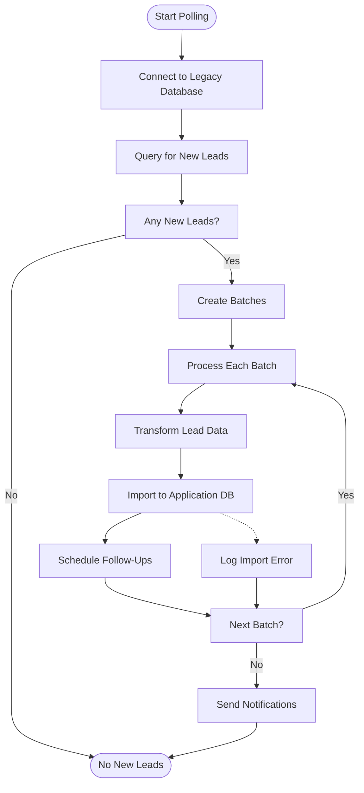
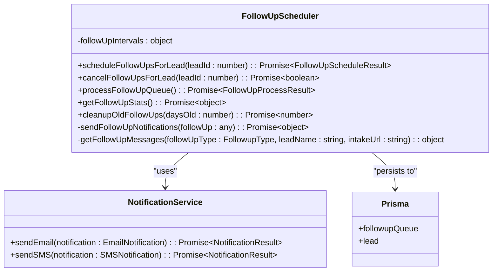
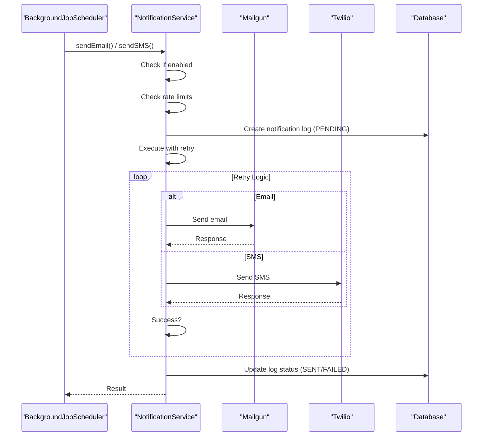
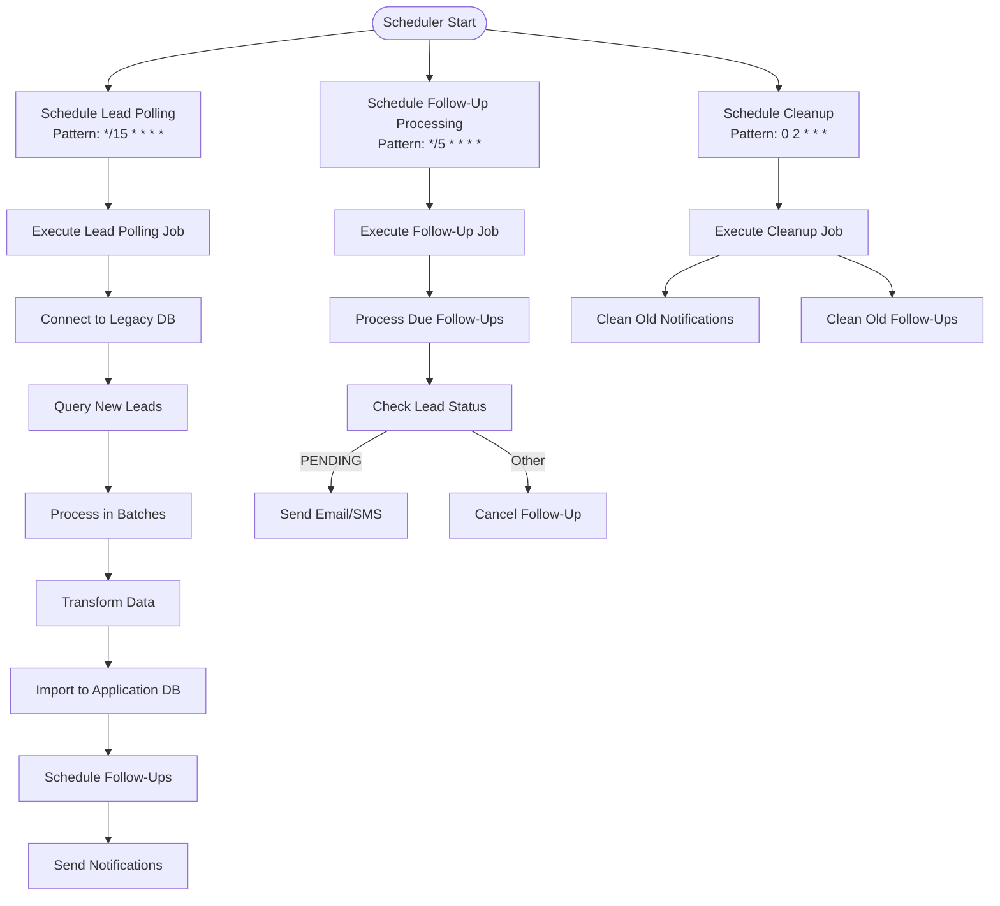
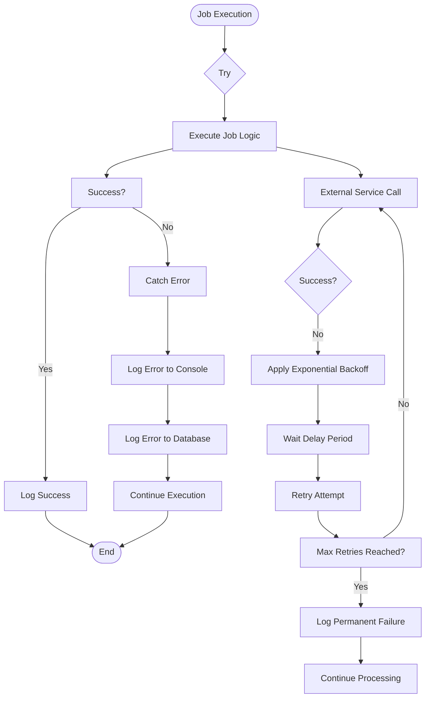
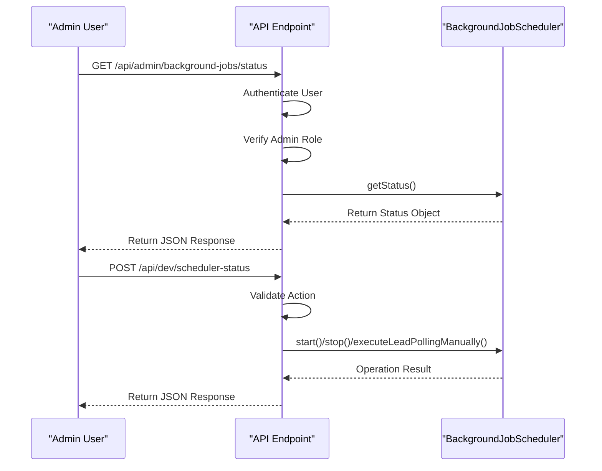
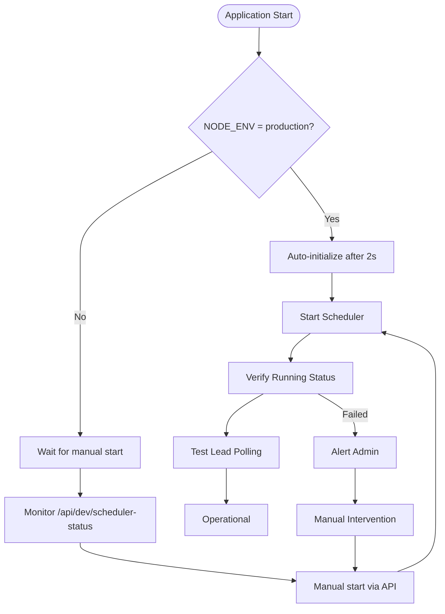

# Background Job Scheduler

<cite>
**Referenced Files in This Document**   
- [BackgroundJobScheduler.ts](file://src/services/BackgroundJobScheduler.ts)
- [LeadPoller.ts](file://src/services/LeadPoller.ts)
- [FollowUpScheduler.ts](file://src/services/FollowUpScheduler.ts)
- [NotificationService.ts](file://src/services/NotificationService.ts)
- [logger.ts](file://src/lib/logger.ts)
- [scheduler-status/route.ts](file://src/app/api/dev/scheduler-status/route.ts)
- [status/route.ts](file://src/app/api/admin/background-jobs/status/route.ts)
- [send-followups/route.ts](file://src/app/api/cron/send-followups/route.ts)
- [start-scheduler.sh](file://scripts/start-scheduler.sh)
- [ensure-scheduler-running.sh](file://scripts/ensure-scheduler-running.sh)
</cite>

## Table of Contents
1. [Introduction](#introduction)
2. [Core Components](#core-components)
3. [Architecture Overview](#architecture-overview)
4. [Detailed Component Analysis](#detailed-component-analysis)
5. [Job Execution Flow](#job-execution-flow)
6. [Error Handling and Recovery](#error-handling-and-recovery)
7. [API Integration and Monitoring](#api-integration-and-monitoring)
8. [Deployment and Process Management](#deployment-and-process-management)
9. [Configuration and Environment Variables](#configuration-and-environment-variables)
10. [Troubleshooting Guide](#troubleshooting-guide)

## Introduction

The Background Job Scheduler serves as the central coordination system for scheduled tasks within the merchant funding application. It manages critical background operations including lead polling from legacy databases, follow-up processing for pending applications, and periodic cleanup of old records. The scheduler ensures these operations run reliably and consistently according to predefined schedules, maintaining the application's data synchronization and customer engagement workflows.

As a singleton instance, the BackgroundJobScheduler provides a centralized point of control for all scheduled operations. It leverages the node-cron library to manage timing and execution, with comprehensive error handling, logging, and monitoring capabilities. The system is designed to be both automated for production environments and controllable through API endpoints for development and troubleshooting purposes.

The scheduler's architecture emphasizes reliability, observability, and maintainability, with clear separation of concerns between job scheduling, business logic execution, and external service integration. This documentation provides a comprehensive analysis of its implementation, functionality, and operational characteristics.

## Core Components

The Background Job Scheduler system comprises several interconnected components that work together to execute scheduled tasks reliably. The core component is the BackgroundJobScheduler class, which coordinates the execution of three primary jobs: lead polling, follow-up processing, and notification cleanup. Each job is implemented as a separate cron task with configurable scheduling patterns.

The scheduler integrates with specialized service classes that handle the business logic for each job type. The LeadPoller service is responsible for extracting new leads from legacy databases and importing them into the application. The FollowUpScheduler manages the lifecycle of follow-up communications for pending applications. The NotificationService handles the delivery of email and SMS notifications through external providers.

All components utilize a shared logging system that provides structured, context-rich logs for monitoring and debugging. The system also implements comprehensive error handling with database logging of critical failures, ensuring that issues can be diagnosed and addressed promptly.

**Section sources**
- [BackgroundJobScheduler.ts](file://src/services/BackgroundJobScheduler.ts#L1-L462)
- [LeadPoller.ts](file://src/services/LeadPoller.ts#L1-L521)
- [FollowUpScheduler.ts](file://src/services/FollowUpScheduler.ts#L1-L490)
- [NotificationService.ts](file://src/services/NotificationService.ts#L1-L471)

## Architecture Overview

The Background Job Scheduler operates as a central coordinator that manages the execution of scheduled tasks according to predefined cron patterns. It follows a modular architecture where the scheduler itself handles timing and orchestration, while delegating specific business logic to dedicated service classes. This separation of concerns allows for independent development, testing, and maintenance of each component.

The system integrates with the application's database through Prisma, using it for both data persistence and state management. It also interacts with external services for notifications, using Mailgun for email delivery and Twilio for SMS messaging. The entire system is configured through environment variables, allowing for flexible deployment across different environments.

```mermaid
graph TB
subgraph "Scheduler Core"
BJS[BackgroundJobScheduler]
end
subgraph "Job Types"
LP[Lead Polling Job]
FUP[Follow-Up Processing Job]
CLN[Cleanup Job]
end
subgraph "Service Components"
LPS[LeadPoller]
FUS[FollowUpScheduler]
NS[NotificationService]
end
subgraph "External Systems"
DB[(Database)]
MG[Mailgun]
TW[Twilio]
LD[Legacy Database]
end
subgraph "API Endpoints"
A1[/api/dev/scheduler-status]
A2[/api/admin/background-jobs/status]
A3[/api/cron/send-followups]
end
BJS --> LP
BJS --> FUP
BJS --> CLN
LP --> LPS
FUP --> FUS
CLN --> FUS
CLN --> NS
LPS --> DB
LPS --> LD
FUS --> DB
NS --> MG
NS --> TW
A1 --> BJS
A2 --> BJS
A3 --> FUS
BJS --> DB
style BJS fill:#4CAF50,stroke:#388E3C
style LP fill:#2196F3,stroke:#1976D2
style FUP fill:#2196F3,stroke:#1976D2
style CLN fill:#2196F3,stroke:#1976D2
```

**Diagram sources**
- [BackgroundJobScheduler.ts](file://src/services/BackgroundJobScheduler.ts#L1-L462)
- [LeadPoller.ts](file://src/services/LeadPoller.ts#L1-L521)
- [FollowUpScheduler.ts](file://src/services/FollowUpScheduler.ts#L1-L490)
- [NotificationService.ts](file://src/services/NotificationService.ts#L1-L471)

**Section sources**
- [BackgroundJobScheduler.ts](file://src/services/BackgroundJobScheduler.ts#L1-L462)

## Detailed Component Analysis

### BackgroundJobScheduler Analysis

The BackgroundJobScheduler class serves as the central coordinator for all scheduled tasks in the application. It manages three primary jobs through the node-cron library: lead polling, follow-up processing, and notification cleanup. Each job is configured with a cron pattern that can be customized through environment variables, providing flexibility in scheduling.

The scheduler maintains internal state to track its running status and references to the scheduled tasks. When started, it creates cron tasks for each job type with the appropriate scheduling pattern and timezone configuration. The default patterns are every 15 minutes for lead polling, every 5 minutes for follow-ups, and daily at 2 AM for cleanup operations.

```mermaid
classDiagram
class BackgroundJobScheduler {
-leadPollingTask : ScheduledTask | null
-followUpTask : ScheduledTask | null
-cleanupTask : ScheduledTask | null
-isRunning : boolean
+start() : void
+stop() : void
+getStatus() : object
+executeLeadPollingManually() : Promise~void~
+executeFollowUpManually() : Promise~void~
+executeCleanupManually() : Promise~void~
-executeLeadPollingJob() : Promise~void~
-executeFollowUpJob() : Promise~void~
-executeCleanupJob() : Promise~void~
-sendNotificationsForNewLeads() : Promise~void~
}
class LeadPoller {
+pollAndImportLeads() : Promise~PollingResult~
}
class FollowUpScheduler {
+processFollowUpQueue() : Promise~FollowUpProcessResult~
+cleanupOldFollowUps(daysOld : number) : Promise~number~
}
class NotificationService {
+sendEmail(notification : EmailNotification) : Promise~NotificationResult~
+sendSMS(notification : SMSNotification) : Promise~NotificationResult~
}
BackgroundJobScheduler --> LeadPoller : "uses"
BackgroundJobScheduler --> FollowUpScheduler : "uses"
BackgroundJobScheduler --> NotificationService : "uses"
BackgroundJobScheduler --> "node-cron" : "depends on"
```

**Diagram sources**
- [BackgroundJobScheduler.ts](file://src/services/BackgroundJobScheduler.ts#L1-L462)

**Section sources**
- [BackgroundJobScheduler.ts](file://src/services/BackgroundJobScheduler.ts#L1-L462)

### LeadPoller Analysis

The LeadPoller service is responsible for extracting new leads from legacy databases and importing them into the application's primary database. It implements a batch processing strategy to efficiently handle large volumes of data while maintaining system performance. The service connects to a legacy SQL Server database, queries for new leads based on campaign IDs, and transforms the data into the application's format.

The polling process begins by identifying the highest legacy lead ID already imported, then fetching all leads with higher IDs from the legacy system. This incremental approach ensures that no leads are missed between polling cycles. The service processes leads in configurable batches, with default batch size of 100 leads, allowing for efficient memory usage and error isolation.



**Diagram sources**
- [LeadPoller.ts](file://src/services/LeadPoller.ts#L1-L521)

**Section sources**
- [LeadPoller.ts](file://src/services/LeadPoller.ts#L1-L521)

### FollowUpScheduler Analysis

The FollowUpScheduler manages the lifecycle of follow-up communications for pending applications. It implements a queue-based system where follow-ups are scheduled at specific intervals after a lead is imported: 3 hours, 9 hours, 24 hours, and 72 hours. Each follow-up consists of both email and SMS notifications, with content tailored to the timing of the message.

The scheduler checks for due follow-ups every 5 minutes, processing any items in the queue that have reached their scheduled time. Before sending notifications, it verifies that the lead is still in PENDING status, canceling follow-ups for leads that have progressed to other stages. This ensures that communications are only sent to relevant prospects.



**Diagram sources**
- [FollowUpScheduler.ts](file://src/services/FollowUpScheduler.ts#L1-L490)

**Section sources**
- [FollowUpScheduler.ts](file://src/services/FollowUpScheduler.ts#L1-L490)

### NotificationService Analysis

The NotificationService handles the delivery of email and SMS notifications through external providers. It implements a robust retry mechanism with exponential backoff to handle transient failures, ensuring reliable message delivery. The service integrates with Mailgun for email delivery and Twilio for SMS messaging, with configuration managed through environment variables.

The service includes comprehensive rate limiting to prevent spamming recipients, allowing a maximum of 2 notifications per hour per recipient and 10 per day per lead. It also checks system settings to determine whether email or SMS notifications are enabled, providing administrative control over communication channels.



**Diagram sources**
- [NotificationService.ts](file://src/services/NotificationService.ts#L1-L471)

**Section sources**
- [NotificationService.ts](file://src/services/NotificationService.ts#L1-L471)

## Job Execution Flow

The Background Job Scheduler follows a well-defined execution flow for each of its scheduled tasks. When the scheduler starts, it initializes three cron jobs with their respective scheduling patterns. Each job executes its designated task according to the cron schedule, with the lead polling job running every 15 minutes, the follow-up processing job every 5 minutes, and the cleanup job daily at 2 AM.

The execution flow for the lead polling job begins with connecting to the legacy database and querying for new leads. The system identifies the highest legacy lead ID already imported and fetches all leads with higher IDs. These leads are processed in batches, transformed into the application's data format, and imported into the primary database. After successful import, follow-ups are scheduled for each new lead, and notifications are sent to inform prospects about completing their applications.



**Diagram sources**
- [BackgroundJobScheduler.ts](file://src/services/BackgroundJobScheduler.ts#L1-L462)
- [LeadPoller.ts](file://src/services/LeadPoller.ts#L1-L521)
- [FollowUpScheduler.ts](file://src/services/FollowUpScheduler.ts#L1-L490)

**Section sources**
- [BackgroundJobScheduler.ts](file://src/services/BackgroundJobScheduler.ts#L1-L462)

## Error Handling and Recovery

The Background Job Scheduler implements comprehensive error handling and recovery strategies to ensure system reliability and data integrity. Each job execution is wrapped in try-catch blocks that capture and log errors, preventing one failed job from affecting the execution of others. Critical errors are logged to the database in the notificationLog table, providing a persistent record for monitoring and troubleshooting.

For the lead polling job, errors are handled at multiple levels: database connection issues, query failures, data transformation errors, and import problems. When an error occurs during lead import, the system logs the specific error and continues processing the remaining leads in the batch. This fault-tolerant approach ensures that a single problematic lead does not prevent the import of valid leads.

The NotificationService implements an exponential backoff retry strategy for external service calls, with configurable retry attempts and delay intervals. This helps overcome transient network issues and service outages. The service also includes circuit breaker-like behavior by checking system settings before attempting to send notifications, allowing administrators to disable specific communication channels during maintenance or issues.



**Diagram sources**
- [BackgroundJobScheduler.ts](file://src/services/BackgroundJobScheduler.ts#L1-L462)
- [NotificationService.ts](file://src/services/NotificationService.ts#L1-L471)

**Section sources**
- [BackgroundJobScheduler.ts](file://src/services/BackgroundJobScheduler.ts#L1-L462)
- [NotificationService.ts](file://src/services/NotificationService.ts#L1-L471)

## API Integration and Monitoring

The Background Job Scheduler provides several API endpoints for monitoring and control, enabling both automated health checks and manual intervention when needed. These endpoints follow a layered security model, with development endpoints accessible without authentication and administrative endpoints requiring admin privileges.

The primary monitoring endpoint at `/api/admin/background-jobs/status` provides comprehensive information about the scheduler's current state, including whether it is running, the current cron patterns, and the next scheduled execution times for each job. This endpoint requires admin authentication, ensuring that sensitive operational information is protected in production environments.



**Diagram sources**
- [status/route.ts](file://src/app/api/admin/background-jobs/status/route.ts#L1-L47)
- [scheduler-status/route.ts](file://src/app/api/dev/scheduler-status/route.ts#L1-L82)

**Section sources**
- [status/route.ts](file://src/app/api/admin/background-jobs/status/route.ts#L1-L47)
- [scheduler-status/route.ts](file://src/app/api/dev/scheduler-status/route.ts#L1-L82)

## Deployment and Process Management

The Background Job Scheduler is designed with deployment considerations in mind, supporting both automated initialization in production environments and manual control for development and troubleshooting. The system includes several scripts and mechanisms to ensure reliable operation across different deployment scenarios.

In production environments, the scheduler auto-initializes when the application starts, with a 2-second delay to ensure all modules are loaded. This automatic startup is controlled by the NODE_ENV environment variable, with auto-initialization enabled only in production. For development environments, the scheduler can be manually controlled through API endpoints when ENABLE_DEV_ENDPOINTS is set to true.



**Diagram sources**
- [start-scheduler.sh](file://scripts/start-scheduler.sh#L1-L55)
- [ensure-scheduler-running.sh](file://scripts/ensure-scheduler-running.sh#L1-L92)
- [server-init.ts](file://src/lib/server-init.ts#L130-L177)

**Section sources**
- [start-scheduler.sh](file://scripts/start-scheduler.sh#L1-L55)
- [ensure-scheduler-running.sh](file://scripts/ensure-scheduler-running.sh#L1-L92)

## Configuration and Environment Variables

The Background Job Scheduler is highly configurable through environment variables, allowing for flexible deployment across different environments and operational requirements. These variables control scheduling patterns, batch sizes, API credentials, and feature toggles, providing administrators with fine-grained control over the system's behavior.

Key configuration variables include LEAD_POLLING_CRON_PATTERN for controlling the frequency of lead polling, FOLLOWUP_CRON_PATTERN for follow-up processing, and CLEANUP_CRON_PATTERN for cleanup operations. The MERCHANT_FUNDING_CAMPAIGN_IDS variable specifies which legacy database tables to poll for new leads, enabling selective data import based on campaign requirements.

| Environment Variable | Default Value | Description |
|----------------------|-------------|-------------|
| LEAD_POLLING_CRON_PATTERN | */15 * * * * | Cron pattern for lead polling frequency |
| FOLLOWUP_CRON_PATTERN | */5 * * * * | Cron pattern for follow-up processing |
| CLEANUP_CRON_PATTERN | 0 2 * * * | Cron pattern for cleanup operations |
| MERCHANT_FUNDING_CAMPAIGN_IDS | (required) | Comma-separated list of campaign IDs to poll |
| LEAD_POLLING_BATCH_SIZE | 100 | Number of leads to process in each batch |
| TZ | America/New_York | Timezone for cron scheduling |
| ENABLE_BACKGROUND_JOBS | true | Feature toggle for enabling background jobs |
| ENABLE_DEV_ENDPOINTS | false | Feature toggle for development API endpoints |

**Section sources**
- [BackgroundJobScheduler.ts](file://src/services/BackgroundJobScheduler.ts#L1-L462)
- [LeadPoller.ts](file://src/services/LeadPoller.ts#L1-L521)

## Troubleshooting Guide

When troubleshooting issues with the Background Job Scheduler, begin by checking the current status through the monitoring endpoints. The `/api/admin/background-jobs/status` endpoint provides comprehensive information about the scheduler's state, including whether it is running and the next scheduled execution times. For development environments, the `/api/dev/scheduler-status` endpoint offers additional control options.

Common issues include database connection problems, authentication failures with external services, and configuration errors. Check the application logs for error messages, paying particular attention to database connection errors, authentication failures, and cron scheduling issues. The system logs detailed information about each job execution, including processing times, record counts, and error messages.

For lead polling issues, verify that the MERCHANT_FUNDING_CAMPAIGN_IDS environment variable is correctly set and that the legacy database connection details are accurate. For notification delivery problems, check that the Mailgun and Twilio API credentials are correctly configured and that the respective services are enabled in the system settings.

**Section sources**
- [BackgroundJobScheduler.ts](file://src/services/BackgroundJobScheduler.ts#L1-L462)
- [logger.ts](file://src/lib/logger.ts#L1-L350)
- [scheduler-status/route.ts](file://src/app/api/dev/scheduler-status/route.ts#L1-L82)