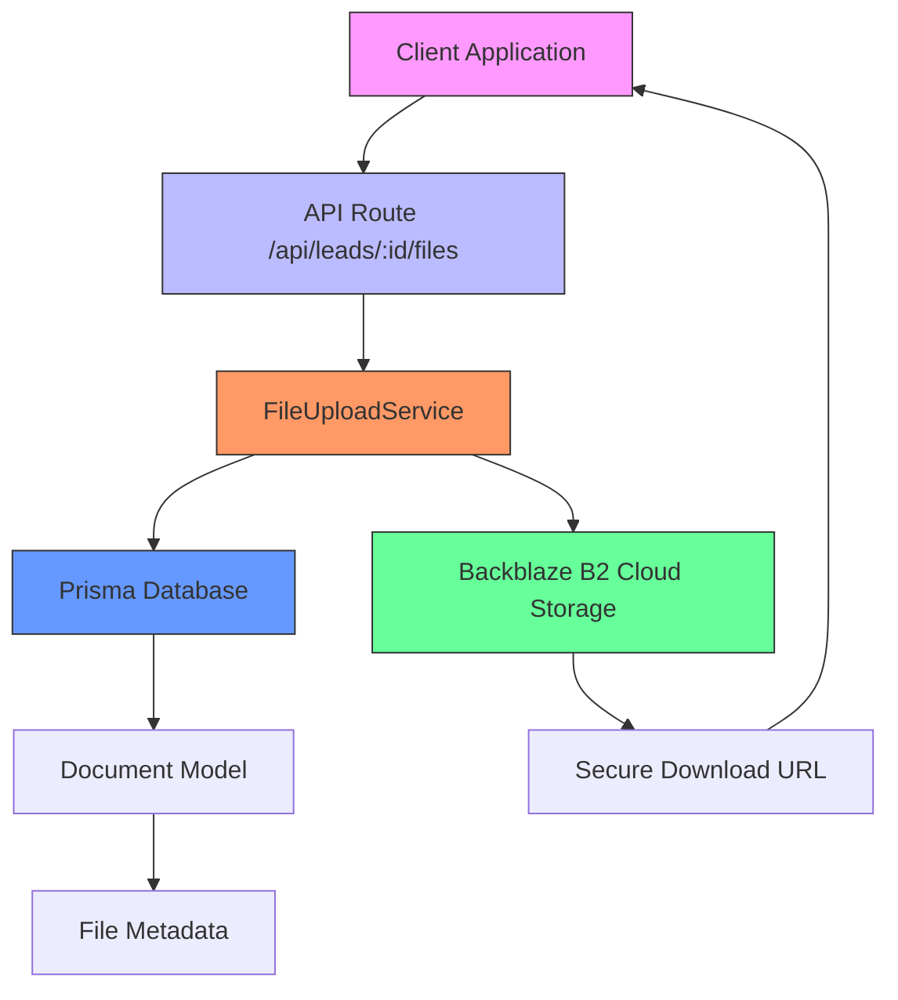
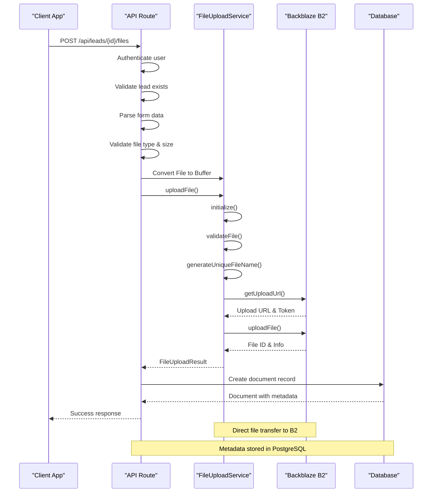
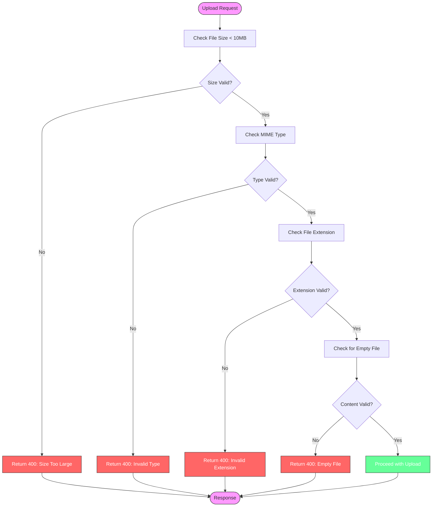
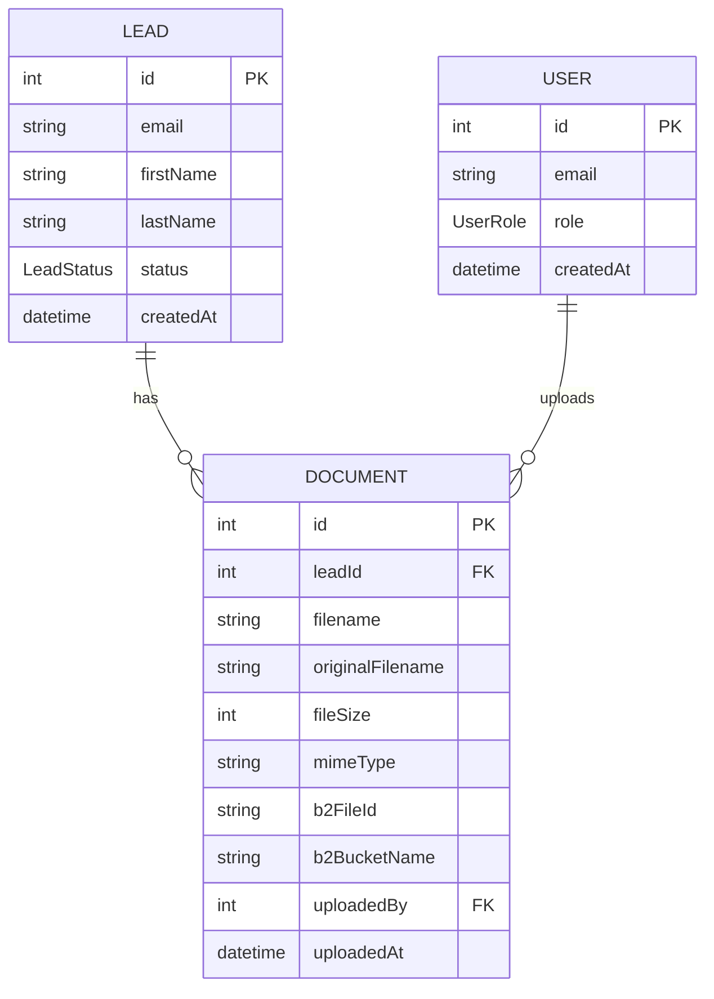
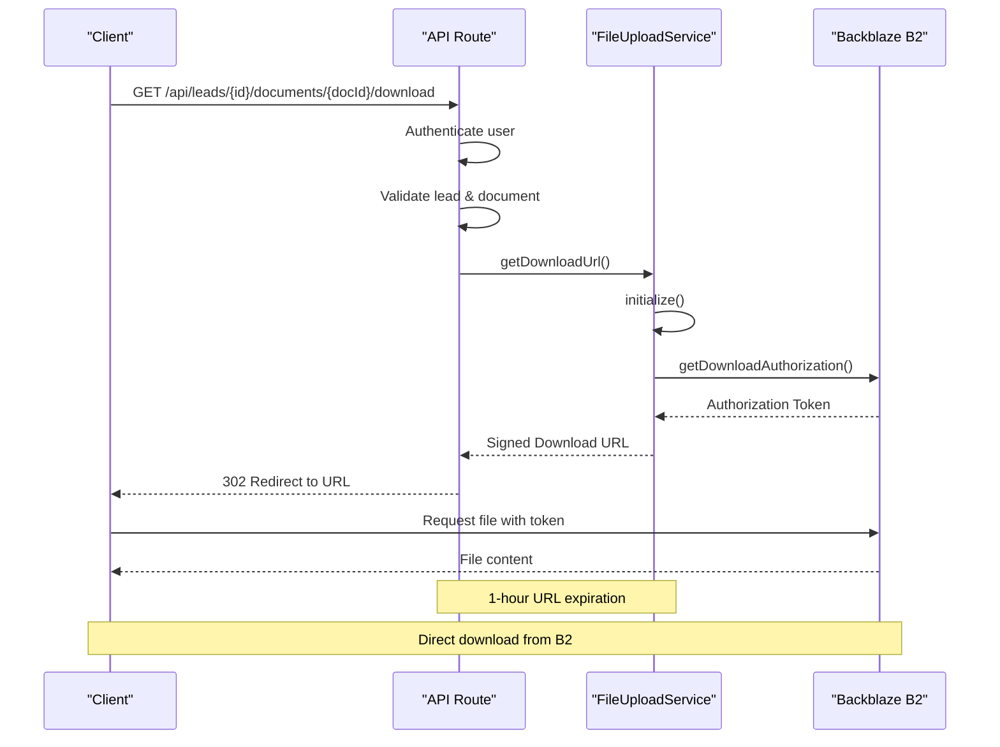

# File Upload Service

<cite>
**Referenced Files in This Document**   
- [FileUploadService.ts](file://src/services/FileUploadService.ts)
- [files/route.ts](file://src/app/api/leads/[id]/files/route.ts)
- [download/route.ts](file://src/app/api/leads/[id]/documents/[documentId]/download/route.ts)
- [schema.prisma](file://prisma/schema.prisma)
- [backblaze-b2.d.ts](file://src/types/backblaze-b2.d.ts)
</cite>

## Table of Contents
1. [Introduction](#introduction)
2. [Architecture Overview](#architecture-overview)
3. [Upload Workflow](#upload-workflow)
4. [File Validation and Security](#file-validation-and-security)
5. [Database Integration](#database-integration)
6. [Download and Access Control](#download-and-access-control)
7. [Error Handling](#error-handling)
8. [Performance and Cost Optimization](#performance-and-cost-optimization)

## Introduction
The File Upload Service is a core component of the fund-track application responsible for securely handling document uploads from applicants and staff. It provides a robust interface between the application and Backblaze B2 cloud storage, managing the complete lifecycle of file operations including upload, download, deletion, and metadata management. The service ensures files are properly validated, securely stored, and correctly associated with lead records in the database.

**Section sources**
- [FileUploadService.ts](file://src/services/FileUploadService.ts#L1-L50)

## Architecture Overview

**Diagram sources**
- [FileUploadService.ts](file://src/services/FileUploadService.ts#L1-L307)
- [files/route.ts](file://src/app/api/leads/[id]/files/route.ts#L1-L253)
- [schema.prisma](file://prisma/schema.prisma#L1-L258)

The File Upload Service architecture follows a layered pattern with clear separation of concerns. The service acts as an intermediary between the API routes and external storage systems. When a file upload request is received, the API route handles authentication and request parsing, then delegates to the FileUploadService for actual storage operations. The service interacts with Backblaze B2 for file storage while maintaining metadata in the PostgreSQL database via Prisma ORM.

## Upload Workflow

**Diagram sources**
- [files/route.ts](file://src/app/api/leads/[id]/files/route.ts#L1-L253)
- [FileUploadService.ts](file://src/services/FileUploadService.ts#L1-L307)

The file upload workflow begins with a client sending a POST request to the `/api/leads/{id}/files` endpoint with a form-data payload containing the file. The API route first authenticates the user, verifies the lead exists, and performs initial validation on file type and size. After converting the file to a Buffer, it calls the `uploadFile` method of the FileUploadService.

The service initializes the Backblaze B2 connection if needed, performs comprehensive validation, generates a unique filename using the lead ID and timestamp, and obtains an upload URL from B2. The file is then uploaded directly to Backblaze B2 with metadata including the original filename and lead ID. Upon successful upload, the service returns upload details to the API route, which saves the metadata to the database and returns the document information to the client.

**Section sources**
- [files/route.ts](file://src/app/api/leads/[id]/files/route.ts#L1-L253)
- [FileUploadService.ts](file://src/services/FileUploadService.ts#L1-L307)

## File Validation and Security

**Diagram sources**
- [FileUploadService.ts](file://src/services/FileUploadService.ts#L50-L99)
- [files/route.ts](file://src/app/api/leads/[id]/files/route.ts#L30-L50)

The service implements multiple layers of file validation to ensure security and data integrity. The validation process includes:

- **Size validation**: Files are limited to 10MB maximum, checked both in the API route and service layer
- **MIME type validation**: Only specific types are allowed: PDF, JPEG, PNG, and DOCX
- **Extension validation**: File extensions are verified against the allowed list
- **Content validation**: Empty files are rejected
- **Filename sanitization**: Unique filenames are generated to prevent conflicts and directory traversal attacks

The validation rules are defined in the `DEFAULT_VALIDATION` constant within the FileUploadService class and can be overridden with custom options. The service uses both client-provided MIME types and file extension checks to prevent type spoofing attacks.

**Section sources**
- [FileUploadService.ts](file://src/services/FileUploadService.ts#L50-L99)

## Database Integration

**Diagram sources**
- [schema.prisma](file://prisma/schema.prisma#L1-L258)

Uploaded files are associated with leads through the Document model in the database. When a file is successfully uploaded to Backblaze B2, the API route creates a corresponding record in the `documents` table with the following metadata:

- **Lead association**: The `leadId` field links the document to a specific lead
- **Storage metadata**: `b2FileId` and `b2BucketName` store the Backblaze B2 identifiers
- **File information**: Original filename, size, and MIME type are preserved
- **Audit information**: `uploadedBy` references the user who uploaded the file with timestamp

The relationship is defined in the Prisma schema with a foreign key constraint that cascades deletions, ensuring that when a lead is deleted, all associated documents are also removed. The Document model includes relations to both Lead and User models for efficient querying.

**Section sources**
- [schema.prisma](file://prisma/schema.prisma#L1-L258)
- [files/route.ts](file://src/app/api/leads/[id]/files/route.ts#L100-L130)

## Download and Access Control

**Diagram sources**
- [download/route.ts](file://src/app/api/leads/[id]/documents/[documentId]/download/route.ts#L1-L81)
- [FileUploadService.ts](file://src/services/FileUploadService.ts#L200-L237)

File downloads are handled through signed URLs with time-limited access. When a client requests to download a document, the API route at `/api/leads/{id}/documents/{documentId}/download` first authenticates the user and verifies that the requested document belongs to the specified lead. It then calls the `getDownloadUrl` method of the FileUploadService.

The service obtains a download authorization token from Backblaze B2 with a 1-hour expiration period. This creates a signed URL that grants temporary access to the file. The API route redirects the client to this signed URL, allowing direct download from Backblaze B2 without proxying through the application server. This approach reduces server load and bandwidth costs while maintaining security through time-limited access tokens.

**Section sources**
- [download/route.ts](file://src/app/api/leads/[id]/documents/[documentId]/download/route.ts#L1-L81)
- [FileUploadService.ts](file://src/services/FileUploadService.ts#L200-L237)

## Error Handling

The File Upload Service implements comprehensive error handling to ensure reliability and provide meaningful feedback:

- **Initialization errors**: Failed B2 authorization is logged and results in a service initialization error
- **Validation errors**: Invalid files trigger descriptive error messages with appropriate HTTP status codes
- **Upload failures**: Network issues or B2 errors are caught, logged, and propagated to the client
- **Graceful degradation**: When deleting files, the service continues with database cleanup even if B2 deletion fails

Error handling follows a consistent pattern with structured logging that includes relevant context such as lead ID, document ID, and user information. The service distinguishes between expected validation errors and unexpected system errors, handling each appropriately. All errors are logged with the application's logger for monitoring and debugging purposes.

**Section sources**
- [FileUploadService.ts](file://src/services/FileUploadService.ts#L150-L195)
- [files/route.ts](file://src/app/api/leads/[id]/files/route.ts#L190-L252)

## Performance and Cost Optimization

The File Upload Service incorporates several performance and cost optimization strategies:

- **Direct uploads**: Files are uploaded directly to Backblaze B2, reducing server bandwidth usage
- **Streaming**: The service uses B2's streaming capabilities to handle large files efficiently
- **Caching**: The B2 authorization token is cached for the service instance lifetime
- **Batch operations**: The `listFilesForLead` method can retrieve multiple files in a single call
- **Efficient naming**: The filename structure `leads/{leadId}/{timestamp}-{hash}-{originalName}` enables efficient prefix-based queries

Storage costs are managed through the 10MB file size limit and the use of Backblaze B2's cost-effective storage tier. The service also implements proper cleanup through the delete functionality, ensuring that both cloud storage and database records are removed when documents are deleted.

**Section sources**
- [FileUploadService.ts](file://src/services/FileUploadService.ts#L1-L307)
- [schema.prisma](file://prisma/schema.prisma#L1-L258)