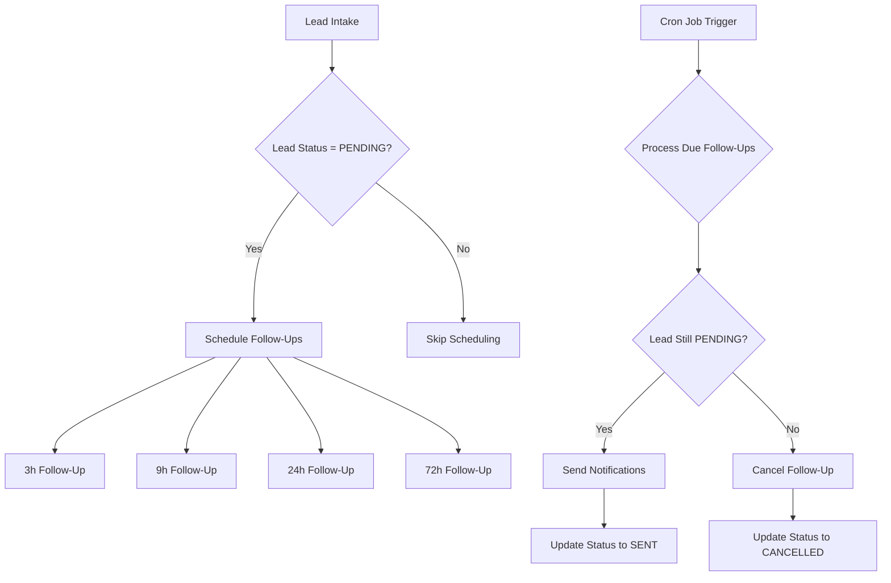
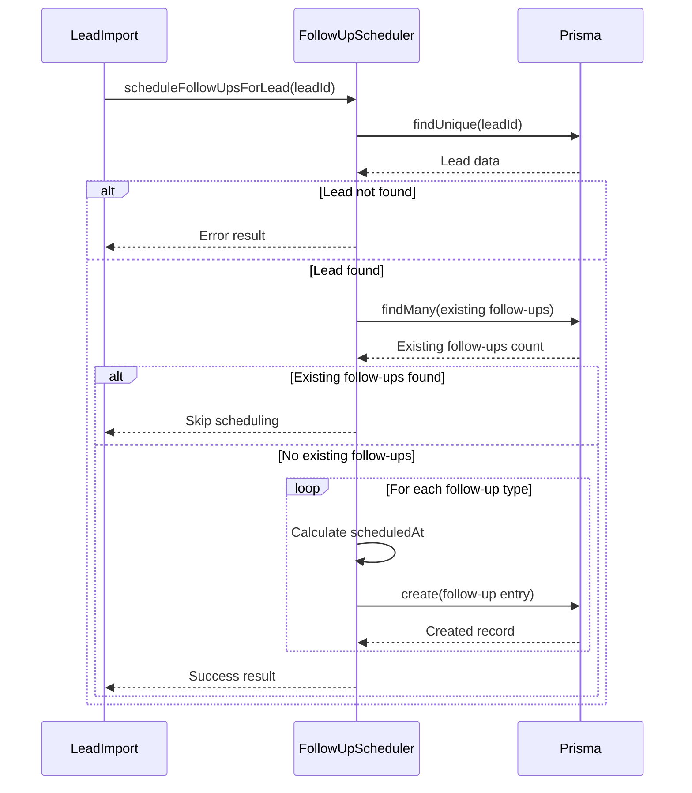
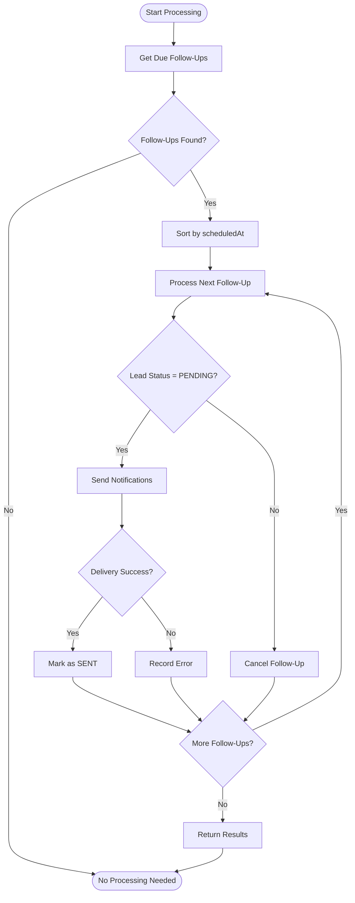
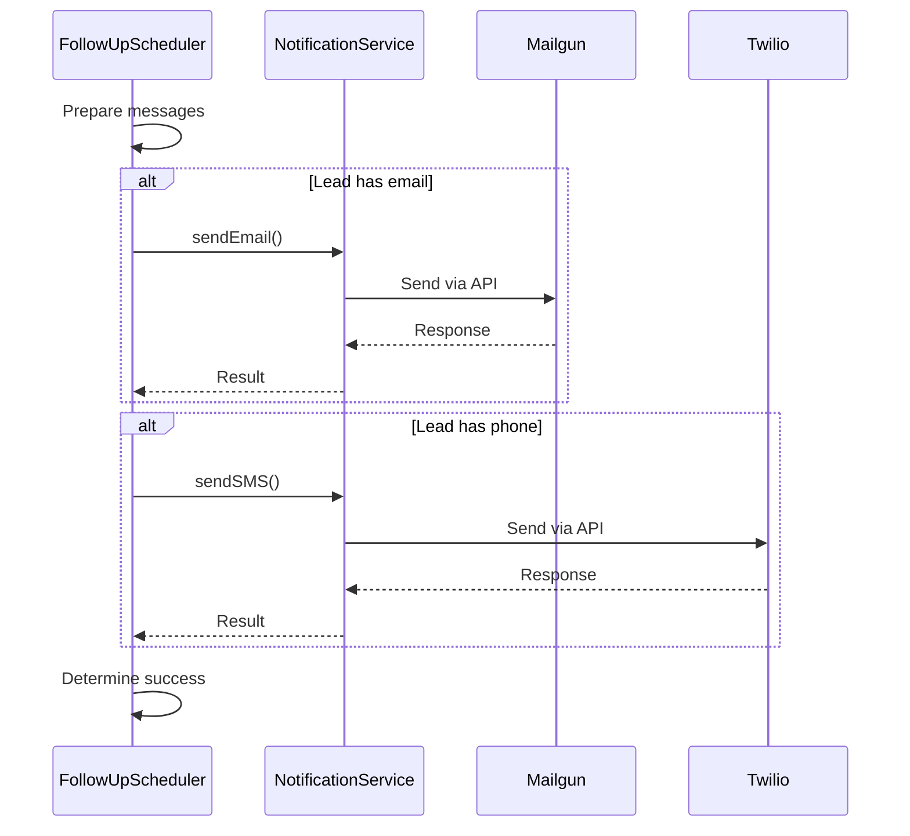

# Follow-Up Scheduler

<cite>
**Referenced Files in This Document**   
- [FollowUpScheduler.ts](file://src/services/FollowUpScheduler.ts)
- [NotificationService.ts](file://src/services/NotificationService.ts)
- [schema.prisma](file://prisma/schema.prisma)
- [SystemSettingsService.ts](file://src/services/SystemSettingsService.ts)
- [prisma.ts](file://src/lib/prisma.ts)
</cite>

## Table of Contents
1. [Introduction](#introduction)
2. [Core Functionality](#core-functionality)
3. [Scheduling Algorithm](#scheduling-algorithm)
4. [Queue Management and Processing](#queue-management-and-processing)
5. [Timestamp Calculations and Time Handling](#timestamp-calculations-and-time-handling)
6. [Integration with NotificationService](#integration-with-notificationservice)
7. [Error Recovery and Idempotency](#error-recovery-and-idempotency)
8. [Concurrency and Race Condition Control](#concurrency-and-race-condition-control)
9. [Performance Optimization](#performance-optimization)
10. [Configuration and System Settings](#configuration-and-system-settings)
11. [Execution Context and Cron Integration](#execution-context-and-cron-integration)
12. [Data Model and Database Schema](#data-model-and-database-schema)
13. [Monitoring and Statistics](#monitoring-and-statistics)
14. [Maintenance and Cleanup](#maintenance-and-cleanup)

## Introduction
The Follow-Up Scheduler service is responsible for managing time-based follow-up communications at predefined intervals (3h, 9h, 24h, 72h) after lead intake. This document provides a comprehensive analysis of its architecture, implementation details, and operational characteristics. The service coordinates with the NotificationService to deliver email and SMS reminders to incomplete leads, ensuring timely engagement while maintaining data integrity through robust error handling and idempotent processing.

**Section sources**
- [FollowUpScheduler.ts](file://src/services/FollowUpScheduler.ts#L1-L50)

## Core Functionality
The FollowUpScheduler service manages the lifecycle of follow-up communications for leads in the PENDING status. It automatically schedules follow-up notifications at specific intervals after lead intake and processes the follow-up queue to deliver time-sensitive reminders. The service ensures that leads receive timely prompts to complete their applications through multiple channels.

The core responsibilities include:
- Scheduling follow-ups when a lead is imported
- Processing due follow-ups from the queue
- Coordinating with NotificationService for delivery
- Handling status changes and cancellation of pending follow-ups
- Maintaining delivery status and processing statistics



**Diagram sources**
- [FollowUpScheduler.ts](file://src/services/FollowUpScheduler.ts#L50-L150)
- [FollowUpScheduler.ts](file://src/services/FollowUpScheduler.ts#L250-L350)

**Section sources**
- [FollowUpScheduler.ts](file://src/services/FollowUpScheduler.ts#L1-L100)

## Scheduling Algorithm
The scheduling algorithm creates follow-up entries for leads at four predefined intervals: 3 hours, 9 hours, 24 hours, and 72 hours after intake. The algorithm prevents duplicate scheduling by checking for existing pending follow-ups before creating new ones.

The intervals are defined as constants within the service:
- 3-hour follow-up: 10,800,000 milliseconds
- 9-hour follow-up: 32,400,000 milliseconds
- 24-hour follow-up: 86,400,000 milliseconds
- 72-hour follow-up: 259,200,000 milliseconds

When a lead is imported, the scheduler:
1. Validates that the lead exists and is in PENDING status
2. Checks for existing pending follow-ups to prevent duplicates
3. Calculates scheduled timestamps by adding interval durations to current time
4. Creates follow-up queue entries with PENDING status



**Diagram sources**
- [FollowUpScheduler.ts](file://src/services/FollowUpScheduler.ts#L50-L150)

**Section sources**
- [FollowUpScheduler.ts](file://src/services/FollowUpScheduler.ts#L50-L150)

## Queue Management and Processing
The FollowUpScheduler implements a queue-based processing system that handles follow-up delivery in a systematic manner. The queue management system ensures that follow-ups are processed in chronological order and handles various edge cases such as status changes and delivery failures.

Key aspects of queue management:
- Follow-ups are retrieved in ascending order by scheduledAt timestamp
- Each follow-up is processed individually with error isolation
- The system checks lead status before sending notifications
- Delivery status is updated after processing
- Processing statistics are collected and returned

The processFollowUpQueue method implements the core queue processing logic:
1. Retrieves all pending follow-ups with scheduledAt ≤ current time
2. Processes each follow-up in order
3. Validates lead status remains PENDING
4. Sends notifications through NotificationService
5. Updates follow-up status based on delivery outcome



**Diagram sources**
- [FollowUpScheduler.ts](file://src/services/FollowUpScheduler.ts#L250-L350)

**Section sources**
- [FollowUpScheduler.ts](file://src/services/FollowUpScheduler.ts#L250-L350)

## Timestamp Calculations and Time Handling
The FollowUpScheduler handles timestamp calculations using JavaScript Date objects and UTC time to ensure consistency across timezones. All timestamps are stored in UTC in the database, eliminating timezone-related issues.

Key timestamp handling practices:
- Uses Date.now() for current timestamp in milliseconds
- Calculates future timestamps by adding interval durations
- Stores all timestamps in UTC in the database
- Uses ISO format for logging timestamps
- Processes follow-ups based on absolute time comparison

The service does not implement timezone-specific scheduling, relying instead on UTC-based calculations. This approach simplifies the implementation and avoids complexities associated with daylight saving time and timezone conversions.

When scheduling follow-ups:
- Current time is captured as new Date()
- Future timestamps are calculated as now.getTime() + interval
- ScheduledAt field stores the exact UTC time for delivery
- Processing compares current UTC time with scheduledAt

This UTC-based approach ensures consistent behavior regardless of server or user timezone, though it means follow-ups are not tailored to local business hours.

**Section sources**
- [FollowUpScheduler.ts](file://src/services/FollowUpScheduler.ts#L60-L80)
- [FollowUpScheduler.ts](file://src/services/FollowUpScheduler.ts#L120-L140)
- [FollowUpScheduler.ts](file://src/services/FollowUpScheduler.ts#L270-L290)

## Integration with NotificationService
The FollowUpScheduler integrates with the NotificationService to deliver follow-up communications via email and SMS. This integration is implemented through direct method calls on the singleton notificationService instance.

Key integration points:
- sendFollowUpNotifications method calls NotificationService.sendEmail and sendSMS
- Notification results are used to determine follow-up success
- Lead contact information is passed to notification methods
- Notification failures are recorded in follow-up processing results

The integration follows these steps:
1. Retrieve follow-up and associated lead data
2. Construct message content based on follow-up type
3. Call NotificationService.sendEmail if lead has email
4. Call NotificationService.sendSMS if lead has phone
5. Consider follow-up successful if either notification succeeds
6. Record errors if notifications fail

The NotificationService provides additional features that enhance the integration:
- Retry logic with exponential backoff
- Rate limiting to prevent spam
- Configuration validation
- Delivery status tracking



**Diagram sources**
- [FollowUpScheduler.ts](file://src/services/FollowUpScheduler.ts#L350-L450)
- [NotificationService.ts](file://src/services/NotificationService.ts#L100-L200)

**Section sources**
- [FollowUpScheduler.ts](file://src/services/FollowUpScheduler.ts#L350-L450)
- [NotificationService.ts](file://src/services/NotificationService.ts#L100-L200)

## Error Recovery and Idempotency
The FollowUpScheduler implements robust error recovery mechanisms and idempotent processing to ensure reliability and data consistency.

Error recovery features:
- Try-catch blocks around all database operations
- Comprehensive error logging with context
- Partial success handling (continue processing after errors)
- Detailed error reporting in result objects
- Graceful degradation when dependencies fail

Idempotency considerations:
- Duplicate prevention through existing follow-up checks
- Status-based processing (only process PENDING follow-ups)
- Atomic updates to follow-up status
- Idempotent cancellation of follow-ups

The service handles errors at multiple levels:
1. **Scheduling errors**: Captured in FollowUpScheduleResult.errors
2. **Processing errors**: Captured in FollowUpProcessResult.errors
3. **Notification errors**: Propagated from NotificationService
4. **Database errors**: Handled by Prisma and logged

For critical operations, the service uses transactional patterns where appropriate. The processFollowUpQueue method processes each follow-up in isolation, ensuring that failures in one follow-up do not affect others.

The error handling strategy follows these principles:
- Never crash the entire process due to a single error
- Log errors with sufficient context for debugging
- Continue processing when possible
- Report all errors to the caller
- Maintain data consistency through status updates

**Section sources**
- [FollowUpScheduler.ts](file://src/services/FollowUpScheduler.ts#L100-L150)
- [FollowUpScheduler.ts](file://src/services/FollowUpScheduler.ts#L300-L350)
- [FollowUpScheduler.ts](file://src/services/FollowUpScheduler.ts#L400-L450)

## Concurrency and Race Condition Control
The FollowUpScheduler implements several mechanisms to handle concurrency and prevent race conditions, particularly important for a service that may be invoked simultaneously by multiple processes.

Concurrency control strategies:
- **Database-level constraints**: Unique constraints and foreign keys
- **Status-based filtering**: Only process PENDING follow-ups
- **Atomic updates**: Single update operations for status changes
- **Ordered processing**: Follow-ups processed by scheduledAt ascending

The service is designed to handle concurrent execution through:
- Idempotent scheduling (checks for existing follow-ups)
- Status validation before processing
- Independent processing of each follow-up
- Database transaction isolation

When multiple instances of the scheduler run simultaneously:
1. Both retrieve the same set of due follow-ups
2. First instance to process a follow-up updates its status to SENT
3. Second instance finds the follow-up no longer PENDING
4. Second instance skips the already-processed follow-up

This approach allows for safe horizontal scaling of the scheduler while preventing duplicate notifications. The use of database constraints and status checks ensures data integrity even under high concurrency.

The service does not implement distributed locking, relying instead on the database to handle concurrent updates. This simplifies the implementation while providing adequate protection against race conditions.

**Section sources**
- [FollowUpScheduler.ts](file://src/services/FollowUpScheduler.ts#L250-L350)
- [FollowUpScheduler.ts](file://src/services/FollowUpScheduler.ts#L100-L150)

## Performance Optimization
The FollowUpScheduler includes several performance optimizations to handle high-volume scenarios efficiently.

Key optimizations:
- **Batch database queries**: Retrieves all due follow-ups in a single query
- **Efficient filtering**: Database-level filtering by status and scheduledAt
- **Ordered retrieval**: Follow-ups sorted by scheduledAt at database level
- **Minimal database round trips**: Status updates are single operations
- **Caching**: Prisma client is reused across requests

For high-volume scenarios, the service can be optimized further:
- **Indexing**: The followup_queue table should have indexes on status and scheduledAt columns
- **Pagination**: Large follow-up queues could be processed in batches
- **Parallel processing**: Independent follow-ups could be processed concurrently
- **Connection pooling**: Prisma manages database connections efficiently

The current implementation processes follow-ups sequentially, which ensures predictable behavior and simplifies error handling. However, for very large volumes, parallel processing of independent follow-ups could improve throughput.

Database query optimization:
- Uses include to fetch lead data in the same query
- Filters at database level rather than in application
- Orders results at database level
- Uses count operations for statistics

The service's performance scales linearly with the number of due follow-ups, making it suitable for moderate volumes. For extremely high volumes, additional optimizations like message queues or distributed processing might be considered.

**Section sources**
- [FollowUpScheduler.ts](file://src/services/FollowUpScheduler.ts#L270-L290)
- [FollowUpScheduler.ts](file://src/services/FollowUpScheduler.ts#L120-L140)

## Configuration and System Settings
The FollowUpScheduler's behavior is influenced by system settings managed through the SystemSettingsService. These settings provide runtime configurability without requiring code changes.

Relevant system settings:
- **sms_notifications_enabled**: Boolean flag to enable/disable SMS
- **email_notifications_enabled**: Boolean flag to enable/disable email
- **notification_retry_attempts**: Number of retry attempts
- **notification_retry_delay**: Base delay for retry backoff

The service indirectly uses these settings through the NotificationService, which retrieves them at runtime:
- NotificationService checks enabled status before sending
- Retry configuration is dynamically updated from settings
- Rate limiting behavior is affected by system configuration

The SystemSettingsService implements a caching layer with 5-minute TTL to reduce database load while allowing relatively timely configuration updates.

Settings are stored in the system_settings table with:
- Key: Unique identifier (e.g., "sms_notifications_enabled")
- Value: String representation of the setting
- Type: Data type (BOOLEAN, STRING, NUMBER, JSON)
- Category: Grouping (NOTIFICATIONS, CONNECTIVITY)
- Default value: Fallback when setting not found

This configuration system allows administrators to modify notification behavior without redeploying the application, providing operational flexibility.

**Section sources**
- [SystemSettingsService.ts](file://src/services/SystemSettingsService.ts#L1-L100)
- [NotificationService.ts](file://src/services/NotificationService.ts#L100-L150)

## Execution Context and Cron Integration
The FollowUpScheduler is designed to be triggered by a cron job that runs at regular intervals. The execution context is provided through API routes in the Next.js application.

Based on the project structure, the cron endpoint is located at:
- src/app/api/cron/send-followups/route.ts

This route would typically:
1. Import the followUpScheduler singleton
2. Call processFollowUpQueue()
3. Return processing results
4. Handle authentication/authorization

The cron job likely runs every few minutes to ensure timely delivery of follow-ups. The frequency balances timely delivery with system resource usage.

The service is designed for stateless execution, making it suitable for serverless environments. Each execution:
- Connects to the database via Prisma
- Processes due follow-ups
- Disconnects from the database
- Returns results

The Prisma client implementation includes build-time detection to prevent database connections during static generation, ensuring compatibility with Next.js's hybrid rendering model.

The execution flow:
1. HTTP request to cron endpoint
2. Authentication check
3. FollowUpScheduler.processFollowUpQueue()
4. Return JSON response with processing results
5. Database connection cleanup

This design allows the scheduler to run in various environments, including traditional servers, serverless platforms, and containerized deployments.

**Section sources**
- [FollowUpScheduler.ts](file://src/services/FollowUpScheduler.ts#L250-L350)
- [prisma.ts](file://src/lib/prisma.ts#L1-L20)

## Data Model and Database Schema
The FollowUpScheduler relies on the FollowupQueue model defined in the Prisma schema. This model represents the follow-up queue and tracks the status of each follow-up communication.

### FollowupQueue Model
```prisma
model FollowupQueue {
  id           Int            @id @default(autoincrement())
  leadId       Int            @map("lead_id")
  scheduledAt  DateTime       @map("scheduled_at")
  followupType FollowupType   @map("followup_type")
  status       FollowupStatus @default(PENDING)
  sentAt       DateTime?      @map("sent_at")
  createdAt    DateTime       @default(now()) @map("created_at")

  // Relations
  lead Lead @relation(fields: [leadId], references: [id], onDelete: Cascade)

  @@map("followup_queue")
}
```

### Related Enums
```prisma
enum FollowupType {
  THREE_HOUR    @map("3h")
  NINE_HOUR     @map("9h")
  TWENTY_FOUR_H @map("24h")
  SEVENTY_TWO_H @map("72h")
}

enum FollowupStatus {
  PENDING   @map("pending")
  SENT      @map("sent")
  CANCELLED @map("cancelled")
}
```

### Key Fields
- **id**: Primary key, auto-incrementing integer
- **leadId**: Foreign key to the leads table
- **scheduledAt**: UTC timestamp when follow-up should be sent
- **followupType**: Enum indicating the follow-up interval
- **status**: Current status (PENDING, SENT, CANCELLED)
- **sentAt**: Timestamp when follow-up was successfully sent
- **createdAt**: Timestamp when record was created

The database schema includes appropriate indexes for query performance:
- Primary key index on id
- Foreign key index on leadId
- Likely indexes on status and scheduledAt for queue processing

The model uses database-level constraints to maintain data integrity:
- Required fields enforced at database level
- Foreign key relationship with cascade delete
- Default values for status and createdAt

This data model supports the scheduler's requirements for tracking follow-up state, ensuring delivery at the correct time, and maintaining an audit trail of communication attempts.

**Diagram sources**
- [schema.prisma](file://prisma/schema.prisma#L125-L140)

**Section sources**
- [schema.prisma](file://prisma/schema.prisma#L125-L140)
- [FollowUpScheduler.ts](file://src/services/FollowUpScheduler.ts#L270-L290)

## Monitoring and Statistics
The FollowUpScheduler provides monitoring capabilities through its getFollowUpStats method, which returns key metrics for operational visibility.

Statistics provided:
- **totalPending**: Total number of pending follow-ups
- **dueSoon**: Number of follow-ups due within the next hour
- **breakdown**: Count of follow-ups by type and status

These statistics enable:
- Monitoring queue size and growth
- Identifying processing delays
- Capacity planning
- Alerting on异常 patterns
- Performance trending

The stats method uses efficient database queries:
- groupBy to aggregate by followupType and status
- count operations for pending follow-ups
- time-based filtering for dueSoon calculation

Additional monitoring is provided through:
- Comprehensive logging with structured data
- Error reporting in result objects
- Integration with application logging system
- Potential integration with external monitoring tools

The statistics can be used to:
- Trigger alerts when queue size exceeds thresholds
- Measure scheduler performance
- Identify delivery issues
- Plan system capacity
- Verify correct operation

The service's design supports observability by providing clear metrics and detailed logs, making it easier to diagnose issues and optimize performance.

**Section sources**
- [FollowUpScheduler.ts](file://src/services/FollowUpScheduler.ts#L450-L480)

## Maintenance and Cleanup
The FollowUpScheduler includes a cleanup mechanism to maintain database performance and manage storage usage.

The cleanupOldFollowUps method:
- Removes completed and cancelled follow-ups older than a specified age
- Defaults to 30 days but accepts configurable retention period
- Returns the number of records removed
- Logs cleanup activity

This maintenance function addresses:
- Database bloat from historical records
- Performance degradation from large tables
- Storage cost management
- Data retention policy compliance

The cleanup process:
1. Calculates cutoff date based on daysOld parameter
2. Deletes records with status SENT or CANCELLED
3. Filters by createdAt < cutoffDate
4. Returns count of deleted records

Regular cleanup helps maintain optimal database performance by:
- Reducing table size
- Improving query performance
- Minimizing backup sizes
- Complying with data retention policies

The service does not implement automatic cleanup scheduling, suggesting that this function should be called periodically by an external process or administrator.

The cleanup functionality demonstrates good operational hygiene by providing a mechanism to manage data lifecycle and prevent unbounded growth of the follow-up queue table.

**Section sources**
- [FollowUpScheduler.ts](file://src/services/FollowUpScheduler.ts#L480-L500)