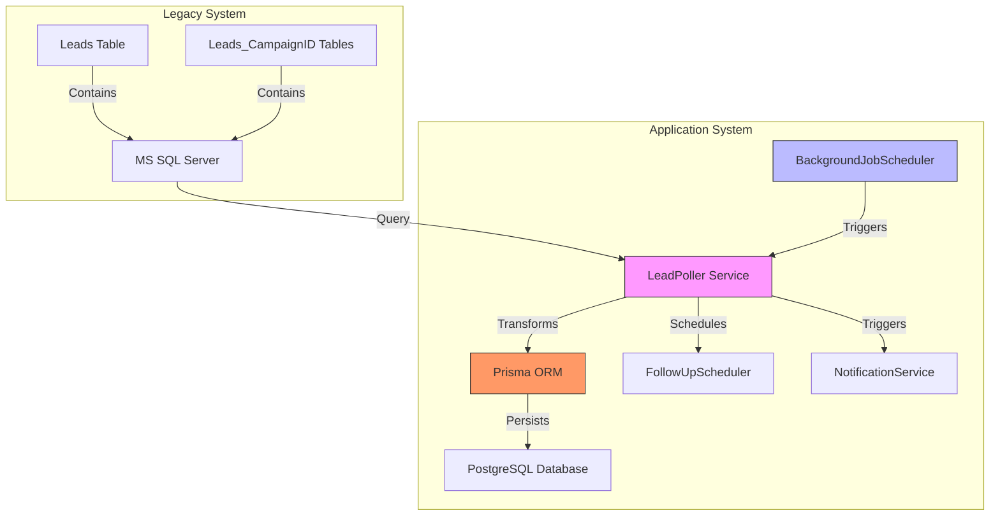
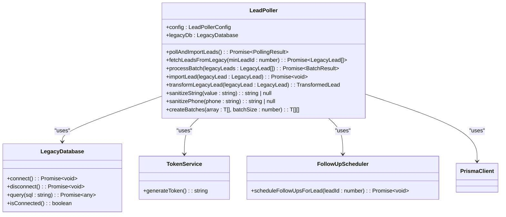
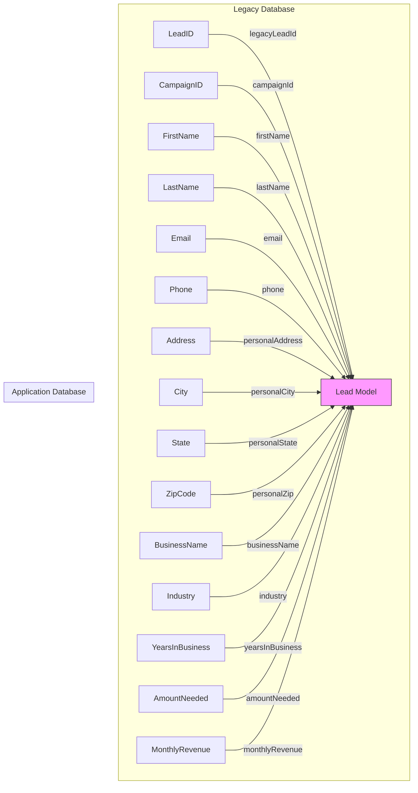
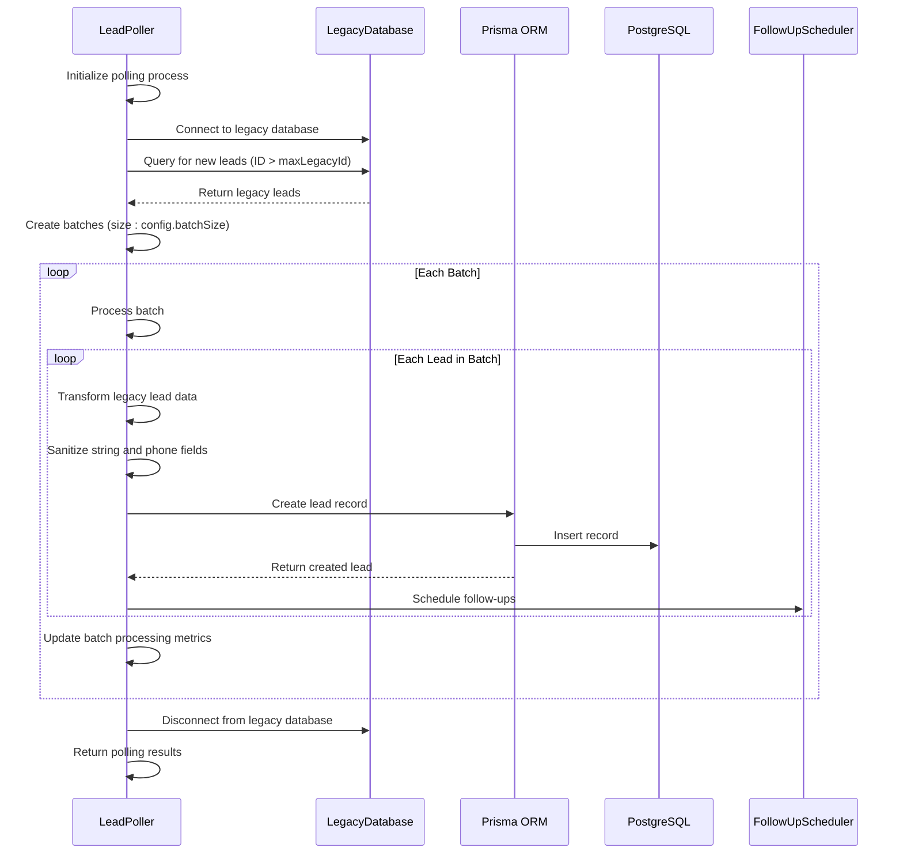
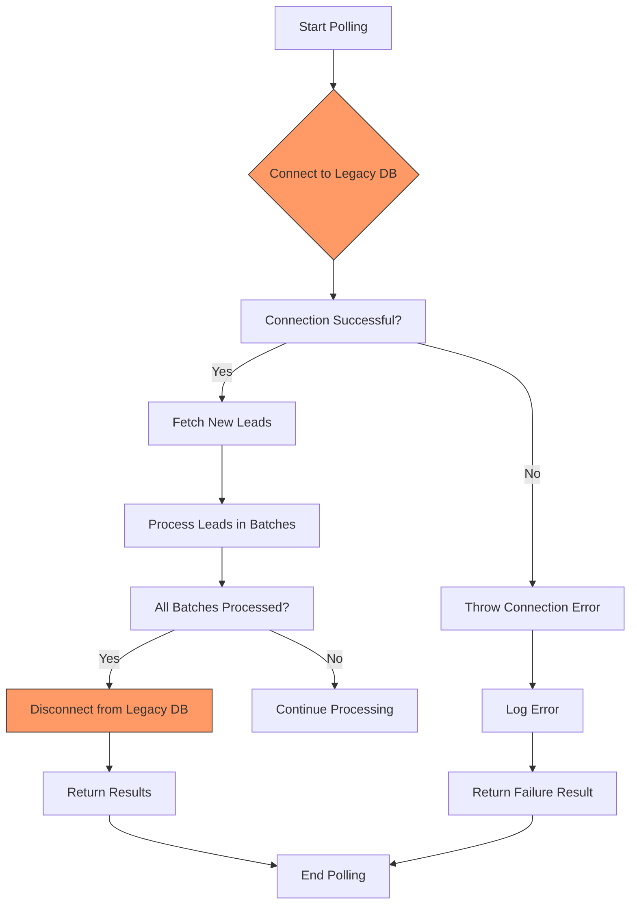
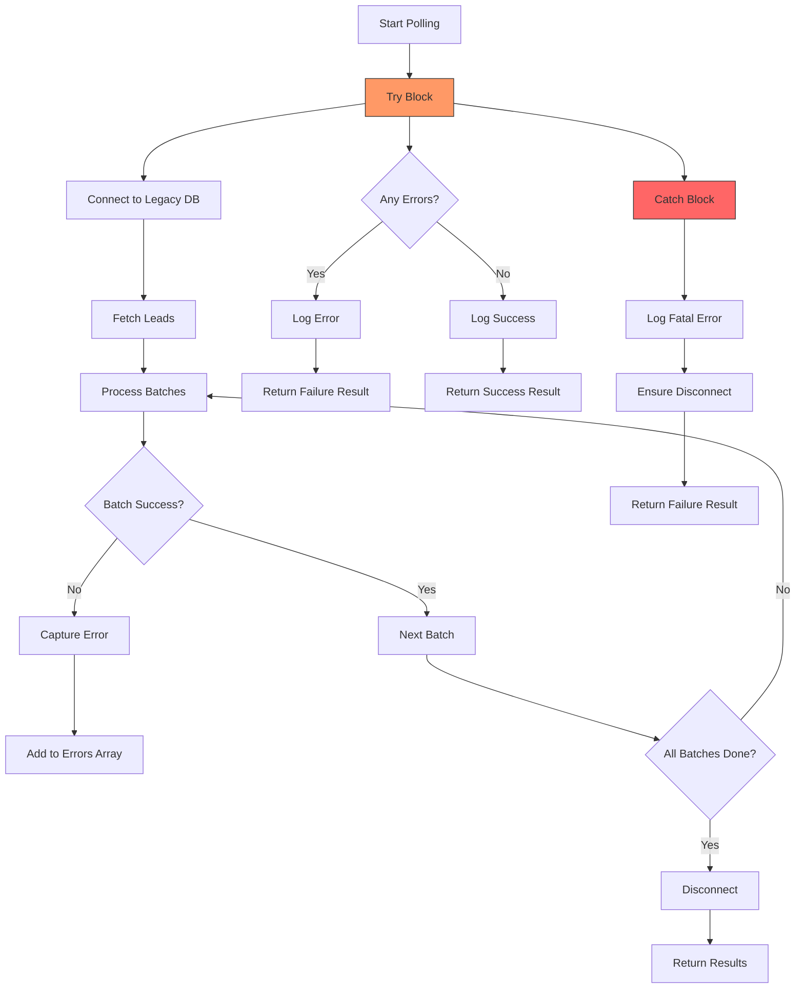
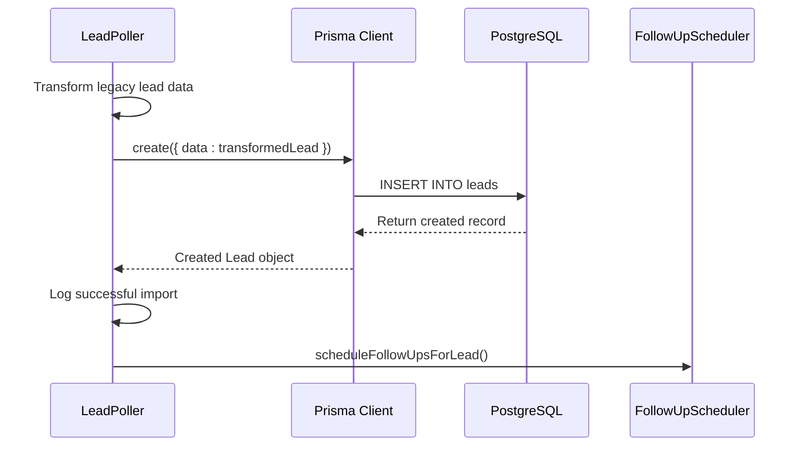
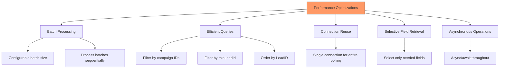
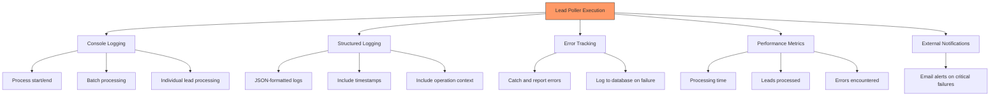

# Lead Poller Service

<cite>
**Referenced Files in This Document**   
- [LeadPoller.ts](file://src/services/LeadPoller.ts)
- [schema.prisma](file://prisma/schema.prisma)
- [poll-leads/route.ts](file://src/app/api/cron/poll-leads/route.ts)
- [BackgroundJobScheduler.ts](file://src/services/BackgroundJobScheduler.ts)
- [legacy-db.ts](file://src/lib/legacy-db.ts)
- [TokenService.ts](file://src/services/TokenService.ts)
- [FollowUpScheduler.ts](file://src/services/FollowUpScheduler.ts)
</cite>

## Table of Contents
1. [Introduction](#introduction)
2. [Architecture Overview](#architecture-overview)
3. [Core Components](#core-components)
4. [Detailed Component Analysis](#detailed-component-analysis)
5. [Data Transformation and Mapping](#data-transformation-and-mapping)
6. [Batch Processing Logic](#batch-processing-logic)
7. [Connection Handling](#connection-handling)
8. [Conflict Resolution and Error Handling](#conflict-resolution-and-error-handling)
9. [Integration with Prisma and Data Persistence](#integration-with-prisma-and-data-persistence)
10. [Polling Intervals and Scheduling](#polling-intervals-and-scheduling)
11. [Performance Optimizations](#performance-optimizations)
12. [Monitoring and Logging](#monitoring-and-logging)
13. [Common Issues and Solutions](#common-issues-and-solutions)

## Introduction

The Lead Poller Service is a critical component of the fund-track application responsible for synchronizing lead data from a legacy MS SQL Server database to the modern PostgreSQL application database. This service ensures that new leads captured in the legacy system are automatically imported into the application, where they can be processed through the intake workflow. The service operates through scheduled polling, batch processing, and robust error handling to maintain data integrity and system reliability.

**Section sources**
- [LeadPoller.ts](file://src/services/LeadPoller.ts#L0-L52)

## Architecture Overview

The Lead Poller Service operates as part of a larger background job scheduling system, integrating with multiple components to provide a complete lead ingestion pipeline. The architecture follows a producer-consumer pattern where the LeadPoller acts as the consumer of lead data from the legacy system.



**Diagram sources**
- [LeadPoller.ts](file://src/services/LeadPoller.ts#L21-L497)
- [BackgroundJobScheduler.ts](file://src/services/BackgroundJobScheduler.ts#L8-L458)

**Section sources**
- [LeadPoller.ts](file://src/services/LeadPoller.ts#L21-L497)
- [BackgroundJobScheduler.ts](file://src/services/BackgroundJobScheduler.ts#L8-L458)

## Core Components

The Lead Poller Service consists of several key components that work together to import leads from the legacy system:

- **LeadPoller**: Main service class that handles polling, transformation, and import logic
- **LegacyDatabase**: Connection handler for the MS SQL Server database
- **BackgroundJobScheduler**: Orchestrates when the polling occurs
- **Prisma**: ORM for persisting data to PostgreSQL
- **TokenService**: Generates secure intake tokens for new leads
- **FollowUpScheduler**: Schedules follow-up communications after lead import

The service follows a configuration-driven approach, allowing for flexible deployment across different environments through environment variables.

**Section sources**
- [LeadPoller.ts](file://src/services/LeadPoller.ts#L0-L52)
- [schema.prisma](file://prisma/schema.prisma#L0-L257)

## Detailed Component Analysis

### LeadPoller Class Analysis

The LeadPoller class is the central component responsible for synchronizing leads from the legacy MS SQL Server database to the PostgreSQL application database. It implements a robust polling mechanism that ensures data consistency and handles various edge cases.



**Diagram sources**
- [LeadPoller.ts](file://src/services/LeadPoller.ts#L21-L497)
- [legacy-db.ts](file://src/lib/legacy-db.ts#L0-L50)
- [TokenService.ts](file://src/services/TokenService.ts#L0-L20)
- [FollowUpScheduler.ts](file://src/services/FollowUpScheduler.ts#L0-L30)

**Section sources**
- [LeadPoller.ts](file://src/services/LeadPoller.ts#L21-L497)

## Data Transformation and Mapping

The Lead Poller Service performs comprehensive data transformation when importing leads from the legacy system to the application database. This transformation ensures data consistency and maps fields appropriately between the two systems.

### Field Mapping Strategy

The service maps legacy database fields to the application's Lead model, handling both direct mappings and derived values:



**Diagram sources**
- [schema.prisma](file://prisma/schema.prisma#L0-L257)
- [LeadPoller.ts](file://src/services/LeadPoller.ts#L345-L450)

**Section sources**
- [LeadPoller.ts](file://src/services/LeadPoller.ts#L345-L450)

### Data Transformation Rules

The `transformLegacyLead` method implements several important transformation rules:

1. **Type Conversion**: Numeric values like AmountNeeded and MonthlyRevenue are converted to strings as required by the schema
2. **Data Sanitization**: String fields are trimmed and nullified if empty
3. **Phone Normalization**: Phone numbers are stripped of non-digit characters and validated for length
4. **Token Generation**: A unique intake token is generated for each new lead
5. **Status Assignment**: New leads are assigned PENDING status with intakeToken populated
6. **Address Separation**: Personal address from legacy system is mapped to personal fields, while business address fields are initialized as null for later completion

The transformation also handles the separation of personal and business information, ensuring that the application's data model is properly populated while leaving business-specific fields to be completed during the intake process.

**Section sources**
- [LeadPoller.ts](file://src/services/LeadPoller.ts#L345-L450)

## Batch Processing Logic

The Lead Poller Service implements a sophisticated batch processing system to efficiently handle large volumes of lead data while maintaining system performance and reliability.

### Batch Processing Workflow



**Diagram sources**
- [LeadPoller.ts](file://src/services/LeadPoller.ts#L100-L340)

**Section sources**
- [LeadPoller.ts](file://src/services/LeadPoller.ts#L100-L340)

### Batch Configuration and Processing

The service processes leads in configurable batches to optimize performance and memory usage:

- **Batch Size**: Configurable via `LEAD_POLLING_BATCH_SIZE` environment variable (default: 100)
- **Batch Creation**: The `createBatches` method divides the fetched leads into chunks of the specified size
- **Sequential Processing**: Batches are processed sequentially to prevent overwhelming the database
- **Error Isolation**: If a batch fails, the error is isolated and other batches continue processing
- **Progress Tracking**: The service logs progress for each batch, including processing time and success/failure rates

The batch processing logic includes comprehensive error handling, with each batch wrapped in a try-catch block to prevent a single failure from stopping the entire polling process. Error messages are collected and returned as part of the polling result for monitoring and troubleshooting.

**Section sources**
- [LeadPoller.ts](file://src/services/LeadPoller.ts#L290-L340)

## Connection Handling

The Lead Poller Service implements robust connection handling to ensure reliable communication with the legacy MS SQL Server database.

### Connection Lifecycle



**Diagram sources**
- [LeadPoller.ts](file://src/services/LeadPoller.ts#L100-L150)
- [legacy-db.ts](file://src/lib/legacy-db.ts#L0-L50)

**Section sources**
- [LeadPoller.ts](file://src/services/LeadPoller.ts#L100-L150)

### Connection Management Strategy

The service follows a strict connection management strategy:

1. **Connection Establishment**: The `connect()` method is called at the beginning of the polling process
2. **Single Connection**: One connection is maintained for the entire polling session to minimize overhead
3. **Automatic Reconnection**: The underlying database client handles reconnection attempts if the connection is lost
4. **Graceful Disconnection**: The `disconnect()` method is called in the `finally` block to ensure the connection is always closed
5. **Error Handling**: Connection errors are caught and reported without crashing the application

The connection is established before fetching leads and maintained throughout the batch processing phase. This approach minimizes connection overhead while ensuring that resources are properly cleaned up after use, even if errors occur during processing.

**Section sources**
- [LeadPoller.ts](file://src/services/LeadPoller.ts#L100-L150)

## Conflict Resolution and Error Handling

The Lead Poller Service implements a comprehensive error handling and conflict resolution strategy to maintain data integrity and system reliability.

### Error Handling Architecture



**Diagram sources**
- [LeadPoller.ts](file://src/services/LeadPoller.ts#L100-L497)

**Section sources**
- [LeadPoller.ts](file://src/services/LeadPoller.ts#L100-L497)

### Conflict Resolution Strategy

The service employs a proactive conflict resolution approach:

1. **Duplicate Prevention**: By tracking the maximum legacy lead ID already imported, the service ensures that each lead is imported exactly once
2. **Idempotent Operations**: The polling process is designed to be idempotent, meaning it can be safely retried without creating duplicate records
3. **Transaction Safety**: Each lead import is handled as a separate database operation, preventing partial updates from affecting data integrity
4. **Error Isolation**: Errors are isolated to individual leads or batches, preventing a single failure from stopping the entire process
5. **Comprehensive Logging**: All operations and errors are logged for auditing and troubleshooting

The service does not need to handle duplicate records during import because it only fetches leads with IDs greater than the maximum already imported. This approach eliminates the need for duplicate checking and ensures that leads are processed in order.

**Section sources**
- [LeadPoller.ts](file://src/services/LeadPoller.ts#L150-L200)

## Integration with Prisma and Data Persistence

The Lead Poller Service integrates with Prisma ORM to persist lead data to the PostgreSQL application database, ensuring data consistency and integrity.

### Data Persistence Workflow



**Diagram sources**
- [LeadPoller.ts](file://src/services/LeadPoller.ts#L300-L340)
- [schema.prisma](file://prisma/schema.prisma#L0-L257)

**Section sources**
- [LeadPoller.ts](file://src/services/LeadPoller.ts#L300-L340)

### Prisma Integration Details

The service uses Prisma for all database operations with the following key integration points:

- **Lead Creation**: Uses `prisma.lead.create()` to insert new lead records
- **Data Querying**: Uses `prisma.lead.findFirst()` to determine the maximum legacy lead ID already imported
- **Type Safety**: Leverages Prisma's type system to ensure data consistency
- **Transaction Support**: Operations are atomic, ensuring data integrity
- **Relation Management**: Automatically handles relationships with related entities

The integration includes proper error handling for database operations, with errors caught and reported in the polling result. The service also leverages Prisma's connection pooling and query optimization features to ensure efficient database access.

**Section sources**
- [LeadPoller.ts](file://src/services/LeadPoller.ts#L300-L340)

## Polling Intervals and Scheduling

The Lead Poller Service is integrated with the application's background job scheduling system to execute at regular intervals.

### Scheduling Configuration

```mermaid
graph TB
A[BackgroundJobScheduler] --> B[Schedule lead polling]
B --> C{Cron Pattern}
C --> D["*/15 * * * *" Every 15 minutes]
C --> E[Custom via LEAD_POLLING_CRON_PATTERN]
A --> F[Execute pollAndImportLeads()]
F --> G[Process new leads]
G --> H[Send notifications if needed]
style D fill:#bbf,stroke:#333
style E fill:#bbf,stroke:#333
```

**Diagram sources**
- [BackgroundJobScheduler.ts](file://src/services/BackgroundJobScheduler.ts#L8-L100)
- [poll-leads/route.ts](file://src/app/api/cron/poll-leads/route.ts#L0-L50)

**Section sources**
- [BackgroundJobScheduler.ts](file://src/services/BackgroundJobScheduler.ts#L8-L100)

### Polling Configuration

The polling frequency is configurable through several mechanisms:

- **Default Schedule**: Every 15 minutes (`*/15 * * * *`)
- **Custom Schedule**: Configurable via `LEAD_POLLING_CRON_PATTERN` environment variable
- **Timezone Awareness**: Respects the `TZ` environment variable (default: America/New_York)
- **Manual Triggering**: Can be triggered manually via API endpoints for testing or emergency imports

The service can be triggered through multiple entry points:
- **Scheduled Jobs**: Automatically executed by BackgroundJobScheduler
- **API Endpoint**: POST request to `/api/cron/poll-leads`
- **Admin Interface**: Manual trigger via admin background jobs interface
- **Development Tools**: Test endpoint at `/api/dev/test-lead-polling`

This flexible scheduling approach ensures that leads are imported in a timely manner while allowing for customization based on operational requirements.

**Section sources**
- [BackgroundJobScheduler.ts](file://src/services/BackgroundJobScheduler.ts#L8-L100)

## Performance Optimizations

The Lead Poller Service implements several performance optimizations to efficiently handle large datasets and maintain system responsiveness.

### Performance Optimization Strategies



**Diagram sources**
- [LeadPoller.ts](file://src/services/LeadPoller.ts#L100-L497)

**Section sources**
- [LeadPoller.ts](file://src/services/LeadPoller.ts#L100-L497)

### Key Performance Features

The service includes several performance optimizations:

1. **Batched Processing**: Large datasets are processed in configurable batches to manage memory usage
2. **Efficient Database Queries**: The legacy database query filters by both campaign ID and lead ID to minimize result set size
3. **Connection Reuse**: A single database connection is maintained for the entire polling session
4. **Selective Field Retrieval**: Only necessary fields are retrieved from the legacy database
5. **Asynchronous Operations**: All I/O operations are performed asynchronously to maximize throughput
6. **Configurable Parameters**: Batch size and other performance-related settings can be adjusted via environment variables

These optimizations ensure that the service can handle large volumes of leads efficiently without overwhelming system resources or degrading application performance.

**Section sources**
- [LeadPoller.ts](file://src/services/LeadPoller.ts#L100-L497)

## Monitoring and Logging

The Lead Poller Service includes comprehensive monitoring and logging capabilities to ensure observability and facilitate troubleshooting.

### Monitoring Architecture



**Diagram sources**
- [LeadPoller.ts](file://src/services/LeadPoller.ts#L100-L497)
- [poll-leads/route.ts](file://src/app/api/cron/poll-leads/route.ts#L0-L192)

**Section sources**
- [LeadPoller.ts](file://src/services/LeadPoller.ts#L100-L497)

### Logging Implementation

The service implements comprehensive logging at multiple levels:

- **Process-Level Logging**: Logs the start and completion of the polling process
- **Batch-Level Logging**: Logs the processing of each batch with metrics
- **Lead-Level Logging**: Logs the processing of individual leads
- **Error Logging**: Captures and reports all errors with context
- **Performance Logging**: Records processing times and throughput metrics

All logs include contextual information such as timestamps, operation types, and relevant identifiers. The service also integrates with the application's notification system to send alerts when critical errors occur, ensuring that issues are promptly addressed.

**Section sources**
- [LeadPoller.ts](file://src/services/LeadPoller.ts#L100-L497)

## Common Issues and Solutions

The Lead Poller Service addresses several common issues that can occur during lead synchronization, with built-in solutions implemented in the codebase.

### Network Timeouts

**Issue**: The legacy database connection may timeout due to network issues or high latency.

**Solution**: The service implements connection resilience with:
- Automatic reconnection attempts
- Proper connection cleanup in finally blocks
- Comprehensive error handling that prevents crashes

```typescript
try {
  await this.legacyDb.connect();
  // Process leads
} catch (error) {
  // Handle connection errors gracefully
  result.errors.push(`Connection failed: ${error.message}`);
} finally {
  // Always attempt to disconnect
  await this.legacyDb.disconnect();
}
```

### Schema Mismatches

**Issue**: Differences between the legacy database schema and the application's data model.

**Solution**: The service implements robust data transformation:
- Type conversion (e.g., numbers to strings)
- Field mapping between different naming conventions
- Default values for missing fields
- Data sanitization and validation

### Duplicate Records

**Issue**: Potential for importing the same lead multiple times.

**Solution**: The service uses a reliable deduplication strategy:
- Tracks the maximum legacy lead ID already imported
- Only fetches leads with higher IDs
- Ensures each lead is processed exactly once

### Large Dataset Performance

**Issue**: Processing large numbers of leads can impact system performance.

**Solution**: The service implements performance optimizations:
- Configurable batch processing
- Efficient database queries with proper indexing
- Asynchronous operations to maximize throughput
- Memory-efficient processing

These solutions are implemented directly in the codebase, ensuring that the Lead Poller Service is robust and reliable in production environments.

**Section sources**
- [LeadPoller.ts](file://src/services/LeadPoller.ts#L100-L497)