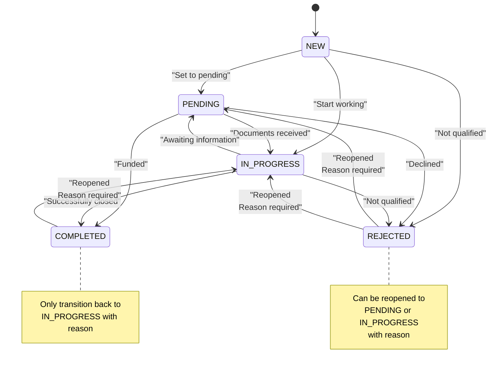

# Lead Status Service

<cite>
**Referenced Files in This Document**   
- [LeadStatusService.ts](file://src/services/LeadStatusService.ts)
- [schema.prisma](file://prisma/schema.prisma)
- [route.ts](file://src/app/api/leads/[id]/status/route.ts)
- [route.ts](file://src/app/api/leads/[id]/route.ts)
- [StatusHistorySection.tsx](file://src/components/dashboard/StatusHistorySection.tsx)
</cite>

## Table of Contents
1. [Introduction](#introduction)
2. [Core Status Model](#core-status-model)
3. [State Transition Rules](#state-transition-rules)
4. [Status Change Validation](#status-change-validation)
5. [Status Change Implementation](#status-change-implementation)
6. [API Integration](#api-integration)
7. [Frontend Status Management](#frontend-status-management)
8. [Audit and Notification System](#audit-and-notification-system)
9. [State Transition Diagram](#state-transition-diagram)
10. [Usage Examples](#usage-examples)

## Introduction
The Lead Status Service provides a comprehensive system for managing the lifecycle of leads through various statuses. It implements strict state transition rules, automatic audit logging, and integration with notification systems to ensure proper workflow enforcement and visibility into lead progression. The service handles validation, state changes, history tracking, and business logic automation when leads move through different stages of the sales funnel.

**Section sources**
- [LeadStatusService.ts](file://src/services/LeadStatusService.ts#L1-L20)

## Core Status Model
The lead status system is built around a well-defined enumeration of possible states and a history tracking mechanism that records all state transitions.

### Lead Status Enum
The system defines five distinct lead statuses that represent different stages in the lead lifecycle:

```typescript
enum LeadStatus {
  NEW         @map("new")
  PENDING     @map("pending")
  IN_PROGRESS @map("in_progress")
  COMPLETED   @map("completed")
  REJECTED    @map("rejected")
}
```

Each status has a human-readable description:
- **NEW**: "New lead, not yet contacted"
- **PENDING**: "Awaiting prospect response or action"
- **IN_PROGRESS**: "Actively working with prospect"
- **COMPLETED**: "Successfully closed/funded"
- **REJECTED**: "Lead declined or not qualified"

### Status History Model
The LeadStatusHistory model tracks all status changes with full audit information:

```prisma
model LeadStatusHistory {
  id           Int        @id @default(autoincrement())
  leadId       Int        @map("lead_id")
  previousStatus LeadStatus? @map("previous_status")
  newStatus    LeadStatus @map("new_status")
  changedBy    Int        @map("changed_by")
  reason       String?
  createdAt    DateTime   @default(now()) @map("created_at")

  // Relations
  lead Lead @relation(fields: [leadId], references: [id], onDelete: Cascade)
  user User @relation(fields: [changedBy], references: [id])
}
```

This model ensures complete traceability of all status changes, including who made the change, when it occurred, and any provided reason.

**Section sources**
- [schema.prisma](file://prisma/schema.prisma#L150-L185)
- [LeadStatusService.ts](file://src/services/LeadStatusService.ts#L395-L405)

## State Transition Rules
The Lead Status Service enforces strict business rules for valid state transitions, preventing invalid status changes and ensuring proper workflow progression.

### Valid Transitions Matrix
The service defines the following valid transitions between states:

```typescript
private readonly statusTransitions: StatusTransitionRule[] = [
  {
    from: LeadStatus.NEW,
    to: [LeadStatus.PENDING, LeadStatus.IN_PROGRESS, LeadStatus.REJECTED],
    description: 'New leads can be set to pending, in progress, or rejected'
  },
  {
    from: LeadStatus.PENDING,
    to: [LeadStatus.IN_PROGRESS, LeadStatus.COMPLETED, LeadStatus.REJECTED],
    description: 'Pending leads can progress to in progress, completed, or be rejected'
  },
  {
    from: LeadStatus.IN_PROGRESS,
    to: [LeadStatus.COMPLETED, LeadStatus.REJECTED, LeadStatus.PENDING],
    description: 'In progress leads can be completed, rejected, or moved back to pending'
  },
  {
    from: LeadStatus.COMPLETED,
    to: [LeadStatus.IN_PROGRESS],
    requiresReason: true,
    description: 'Completed leads can only be reopened to in progress with a reason'
  },
  {
    from: LeadStatus.REJECTED,
    to: [LeadStatus.PENDING, LeadStatus.IN_PROGRESS],
    requiresReason: true,
    description: 'Rejected leads can be reopened to pending or in progress with a reason'
  }
];
```

### Business Rules
Key business rules enforced by the transition system:

1. **New leads** can be moved to pending (awaiting response), in progress (actively working), or rejected (not qualified)
2. **Pending leads** can progress to in progress (documents received), completed (funded), or be rejected
3. **In progress leads** can be completed (successful), rejected (declined), or moved back to pending (awaiting information)
4. **Completed leads** can only be reopened to in progress, and a reason is required
5. **Rejected leads** can be reopened to pending or in progress, and a reason is required

**Section sources**
- [LeadStatusService.ts](file://src/services/LeadStatusService.ts#L21-L58)

## Status Change Validation
The service implements comprehensive validation to ensure all status transitions comply with business rules before they are applied.

### Validation Logic
The `validateStatusTransition` method performs the following checks:

```typescript
validateStatusTransition(currentStatus: LeadStatus, newStatus: LeadStatus, reason?: string): { valid: boolean; error?: string } {
  // Allow same status (no change)
  if (currentStatus === newStatus) {
    return { valid: true };
  }

  const rule = this.statusTransitions.find(r => r.from === currentStatus);
  if (!rule) {
    return { valid: false, error: `No transition rules defined for status: ${currentStatus}` };
  }

  if (!rule.to.includes(newStatus)) {
    return { 
      valid: false, 
      error: `Invalid transition from ${currentStatus} to ${newStatus}. ${rule.description}` 
    };
  }

  if (rule.requiresReason && !reason?.trim()) {
    return { 
      valid: false, 
      error: `Reason is required when changing from ${currentStatus} to ${newStatus}` 
    };
  }

  return { valid: true };
}
```

### Validation Scenarios
The validation system handles the following scenarios:

1. **Same status**: Returns valid if the current and new status are identical
2. **Invalid source status**: Returns an error if no rules exist for the current status
3. **Invalid transition**: Returns an error if the requested transition is not allowed
4. **Missing reason**: Returns an error if a reason is required but not provided

The validation is performed before any database operations, preventing invalid state changes.

**Section sources**
- [LeadStatusService.ts](file://src/services/LeadStatusService.ts#L60-L110)

## Status Change Implementation
The core `changeLeadStatus` method implements the complete workflow for changing a lead's status with proper transaction handling and side effects.

### Implementation Flow
```typescript
async changeLeadStatus(request: StatusChangeRequest): Promise<StatusChangeResult> {
  const { leadId, newStatus, changedBy, reason } = request;

  try {
    // Get current lead data
    const currentLead = await prisma.lead.findUnique({
      where: { id: leadId },
      select: {
        id: true,
        status: true,
        firstName: true,
        lastName: true,
        businessName: true,
        email: true,
        phone: true
      }
    });

    if (!currentLead) {
      return { success: false, error: 'Lead not found' };
    }

    // Validate the status transition
    const validation = this.validateStatusTransition(currentLead.status, newStatus, reason);
    if (!validation.valid) {
      return { success: false, error: validation.error };
    }

    // If no change, return success without doing anything
    if (currentLead.status === newStatus) {
      return { success: true, lead: currentLead };
    }

    // Perform the status change in a transaction
    const result = await prisma.$transaction(async (tx) => {
      // Update the lead status
      const updatedLead = await tx.lead.update({
        where: { id: leadId },
        data: { status: newStatus },
        include: {
          // Include related data for response
        }
      });

      // Create status history record
      await tx.leadStatusHistory.create({
        data: {
          leadId,
          previousStatus: currentLead.status,
          newStatus,
          changedBy,
          reason: reason?.trim() || null
        }
      });

      return updatedLead;
    });

    // Handle follow-up cancellation if status changed from PENDING
    let followUpsCancelled = false;
    if (currentLead.status === LeadStatus.PENDING && newStatus !== LeadStatus.PENDING) {
      try {
        const cancelled = await followUpScheduler.cancelFollowUpsForLead(leadId);
        followUpsCancelled = cancelled;
      } catch (error) {
        logger.error(`Failed to cancel follow-ups for lead ${leadId}:`, error);
      }
    }

    // Send staff notification for important status changes
    let staffNotificationSent = false;
    try {
      staffNotificationSent = await this.sendStaffStatusChangeNotification(
        result,
        currentLead.status,
        newStatus,
        changedBy,
        reason
      );
    } catch (error) {
      logger.error(`Failed to send staff notification for lead ${leadId} status change:`, error);
    }

    return {
      success: true,
      lead: result,
      followUpsCancelled,
      staffNotificationSent
    };

  } catch (error) {
    logger.error(`Failed to change status for lead ${leadId}:`, error);
    return {
      success: false,
      error: error instanceof Error ? error.message : 'Unknown error occurred'
    };
  }
}
```

### Key Features
1. **Transaction Safety**: Status update and history recording occur within a database transaction to ensure data consistency
2. **Comprehensive Response**: Returns detailed information about the operation result
3. **Error Resilience**: Non-critical operations (follow-up cancellation, notifications) don't fail the entire operation
4. **Audit Trail**: Every status change is recorded in the LeadStatusHistory table
5. **Side Effect Management**: Automatically handles related operations like follow-up cancellation

**Section sources**
- [LeadStatusService.ts](file://src/services/LeadStatusService.ts#L112-L245)

## API Integration
The Lead Status Service is exposed through REST API endpoints that handle status queries and updates.

### GET /api/leads/[id]/status
Retrieves the current status, status history, and available transitions for a lead:

```typescript
export async function GET(request: NextRequest, { params }: RouteParams) {
  try {
    // Check authentication
    const session = await getServerSession(authOptions);
    if (!session) {
      return NextResponse.json({ error: "Unauthorized" }, { status: 401 });
    }

    const { id } = await params;
    const leadId = parseInt(id);
    if (isNaN(leadId)) {
      return NextResponse.json({ error: "Invalid lead ID" }, { status: 400 });
    }

    // Get lead to check current status
    const lead = await prisma.lead.findUnique({
      where: { id: leadId },
      select: { id: true, status: true },
    });

    if (!lead) {
      return NextResponse.json({ error: "Lead not found" }, { status: 404 });
    }

    // Get status history
    const historyResult = await leadStatusService.getLeadStatusHistory(leadId);
    if (!historyResult.success) {
      return NextResponse.json({ error: historyResult.error }, { status: 500 });
    }

    // Get available transitions
    const availableTransitions = leadStatusService.getAvailableTransitions(
      lead.status
    );

    return NextResponse.json({
      currentStatus: lead.status,
      history: historyResult.history,
      availableTransitions,
    });
  } catch (error) {
    console.error("Error fetching lead status info:", error);
    return NextResponse.json(
      { error: "Internal server error" },
      { status: 500 }
    );
  }
}
```

### PUT /api/leads/[id]
Handles lead updates including status changes:

```typescript
export async function PUT(request: NextRequest, { params }: RouteParams) {
  try {
    // Check authentication
    const session = await getServerSession(authOptions);
    if (!session) {
      return NextResponse.json({ error: "Unauthorized" }, { status: 401 });
    }

    const { id } = await params;
    const leadId = parseInt(id);
    if (isNaN(leadId)) {
      return NextResponse.json({ error: "Invalid lead ID" }, { status: 400 });
    }

    const body = await request.json();
    const { status, firstName, lastName, email, phone, businessName, reason } = body;

    // Validate status if provided
    if (status && !Object.values(LeadStatus).includes(status)) {
      return NextResponse.json(
        { error: "Invalid status value" },
        { status: 400 }
      );
    }

    // Handle status change separately with validation and audit logging
    if (status !== undefined && status !== existingLead.status) {
      const statusChangeResult = await leadStatusService.changeLeadStatus({
        leadId,
        newStatus: status,
        changedBy: parseInt(session.user.id),
        reason,
      });

      if (!statusChangeResult.success) {
        return NextResponse.json(
          { error: statusChangeResult.error },
          { status: 400 }
        );
      }
    }
  }
}
```

**Section sources**
- [route.ts](file://src/app/api/leads/[id]/status/route.ts#L0-L63)
- [route.ts](file://src/app/api/leads/[id]/route.ts#L121-L172)

## Frontend Status Management
The dashboard UI provides an intuitive interface for managing lead statuses with real-time validation.

### Status History Section
The `StatusHistorySection` component displays the current status, history, and provides a form for status changes:

```tsx
export default function StatusHistorySection({
  leadId,
  currentStatus,
  onStatusChange,
  parentLoading = false,
}: StatusHistorySectionProps) {
  const [history, setHistory] = useState<StatusHistoryItem[]>([]);
  const [availableTransitions, setAvailableTransitions] = useState<StatusTransition[]>([]);
  const [showStatusChange, setShowStatusChange] = useState(false);
  const [selectedStatus, setSelectedStatus] = useState<LeadStatus | "">("");
  const [reason, setReason] = useState("");
  const [updating, setUpdating] = useState(false);

  const fetchStatusInfo = useCallback(async () => {
    try {
      setLoading(true);
      const response = await fetch(`/api/leads/${leadId}/status`);

      if (!response.ok) {
        throw new Error("Failed to fetch status information");
      }

      const data = await response.json();
      setHistory(data.history || []);
      setAvailableTransitions(data.availableTransitions || []);
      setError(null);
    } catch (err) {
      setError(err instanceof Error ? err.message : "Unknown error occurred");
    } finally {
      setLoading(false);
    }
  }, [leadId]);

  const handleStatusChange = async () => {
    if (!selectedStatus) return;

    try {
      setUpdating(true);

      const updateData: any = { status: selectedStatus };
      if (reason.trim()) {
        updateData.reason = reason.trim();
      }

      const response = await fetch(`/api/leads/${leadId}`, {
        method: "PUT",
        headers: {
          "Content-Type": "application/json",
        },
        body: JSON.stringify(updateData),
      });

      if (!response.ok) {
        const errorData = await response.json();
        throw new Error(errorData.error || "Failed to update status");
      }

      // Refresh status info
      await fetchStatusInfo();

      // Reset form
      setSelectedStatus("");
      setReason("");
      setShowStatusChange(false);

      // Notify parent component
      if (onStatusChange) {
        onStatusChange(selectedStatus, reason.trim() || undefined);
      }
    } catch (err) {
      setError(err instanceof Error ? err.message : "Failed to update status");
    } finally {
      setUpdating(false);
    }
  };

  return (
    <div className="bg-white shadow rounded-lg p-6">
      <div className="flex justify-between items-center mb-4">
        <h3 className="text-lg font-medium text-gray-900">Status History</h3>
        {availableTransitions.length > 0 && (
          <button
            onClick={() => setShowStatusChange(!showStatusChange)}
            className="inline-flex items-center px-3 py-2 border border-transparent text-sm leading-4 font-medium rounded-md text-white bg-indigo-600 hover:bg-indigo-700 focus:outline-none focus:ring-2 focus:ring-offset-2 focus:ring-indigo-500"
          >
            Change Status
          </button>
        )}
      </div>

      {/* Current Status */}
      <div className="mb-6">
        <div className="flex items-center">
          <span className="text-sm font-medium text-gray-500 mr-2">
            Current Status:
          </span>
          <span
            className={`inline-flex items-center px-2.5 py-0.5 rounded-full text-xs font-medium ${statusColors[currentStatus]}`}
          >
            {statusLabels[currentStatus]}
          </span>
        </div>
      </div>

      {/* Status Change Form */}
      {showStatusChange && (
        <div className="mb-6 p-4 bg-gray-50 rounded-lg">
          <h4 className="text-sm font-medium text-gray-900 mb-3">
            Change Status
          </h4>

          <div className="space-y-4">
            <div>
              <label
                htmlFor="status"
                className="block text-sm font-medium text-gray-700"
              >
                New Status
              </label>
              <select
                id="status"
                value={selectedStatus}
                onChange={(e) =>
                  setSelectedStatus(e.target.value as LeadStatus)
                }
                className="mt-1 block w-full pl-3 pr-10 py-2 text-base border-gray-300 focus:outline-none focus:ring-indigo-500 focus:border-indigo-500 sm:text-sm rounded-md"
              >
                <option value="">Select a status...</option>
                {availableTransitions.map((transition) => (
                  <option key={transition.status} value={transition.status}>
                    {statusLabels[transition.status]} - {transition.description}
                  </option>
                ))}
              </select>
            </div>

            {selectedTransition?.requiresReason && (
              <div>
                <label
                  htmlFor="reason"
                  className="block text-sm font-medium text-gray-700"
                >
                  Reason <span className="text-red-500">*</span>
                </label>
                <textarea
                  id="reason"
                  rows={3}
                  value={reason}
                  onChange={(e) => setReason(e.target.value)}
                  placeholder="Please provide a reason for this status change..."
                  className="mt-1 block w-full border-gray-300 rounded-md shadow-sm focus:ring-indigo-500 focus:border-indigo-500 sm:text-sm"
                />
              </div>
            )}

            {!selectedTransition?.requiresReason && (
              <div>
                <label
                  htmlFor="reason"
                  className="block text-sm font-medium text-gray-700"
                >
                  Reason (optional)
                </label>
                <textarea
                  id="reason"
                  rows={2}
                  value={reason}
                  onChange={(e) => setReason(e.target.value)}
                  placeholder="Optional reason for this status change..."
                  className="mt-1 block w-full border-gray-300 rounded-md shadow-sm focus:ring-indigo-500 focus:border-indigo-500 sm:text-sm"
                />
              </div>
            )}
          </div>
        </div>
      )}

      {/* Status History */}
      <div>
        <h4 className="text-sm font-medium text-gray-900 mb-3">History</h4>

        {history.length === 0 ? (
          <p className="text-sm text-gray-500">No status changes recorded.</p>
        ) : (
          <div className="flow-root">
            <ul className="-mb-8">
              {history.map((item, itemIdx) => (
                <li key={item.id}>
                  <div className="relative pb-6">
                    {itemIdx !== history.length - 1 ? (
                      <span
                        className="absolute top-3 left-3 -ml-px h-full w-0.5 bg-gray-200"
                        aria-hidden="true"
                      />
                    ) : null}
                    <div className="relative flex space-x-3">
                      <div>
                        <span className="h-6 w-6 rounded-full bg-gray-400 flex items-center justify-center ring-4 ring-white">
                          <svg
                            className="h-3 w-3 text-white"
                            fill="currentColor"
                            viewBox="0 0 20 20"
                          >
                            <path
                              fillRule="evenodd"
                              d="M10 18a8 8 0 100-16 8 8 0 000 16zm3.707-9.293a1 1 0 00-1.414-1.414L9 10.586 7.707 9.293a1 1 0 00-1.414 1.414l2 2a1 1 0 001.414 0l4-4z"
                              clipRule="evenodd"
                            />
                          </svg>
                        </span>
                      </div>
                      <div className="min-w-0 flex-1 pt-1 flex justify-between space-x-4">
                        <div>
                          <p className="text-xs text-gray-500">
                            Status changed from{" "}
                            {item.previousStatus ? (
                              <span
                                className={`inline-flex items-center px-1.5 py-0.5 rounded text-xs font-medium ${
                                  statusColors[item.previousStatus]
                                }`}
                              >
                                {statusLabels[item.previousStatus]}
                              </span>
                            ) : (
                              <span className="text-gray-400">—</span>
                            )}{" "}
                            to{" "}
                            <span
                              className={`inline-flex items-center px-1.5 py-0.5 rounded text-xs font-medium ${
                                statusColors[item.newStatus]
                              }`}
                            >
                              {statusLabels[item.newStatus]}
                            </span>
                          </p>
                          {item.reason && (
                            <p className="mt-1 text-xs text-gray-600">
                              <span className="font-medium">Reason:</span>{" "}
                              {item.reason}
                            </p>
                          )}
                          <p className="mt-0.5 text-xs text-gray-400">
                            by {item.user.email}
                          </p>
                        </div>
                        <div className="text-right text-xs whitespace-nowrap text-gray-500">
                          {new Date(item.createdAt).toLocaleString()}
                        </div>
                      </div>
                    </div>
                  </div>
                </li>
              ))}
            </ul>
          </div>
        )}
      </div>
    </div>
  );
}
```

**Section sources**
- [StatusHistorySection.tsx](file://src/components/dashboard/StatusHistorySection.tsx#L0-L374)

## Audit and Notification System
The service includes comprehensive audit logging and notification capabilities to ensure transparency and team awareness.

### Audit Logging
Every status change is recorded in the `leadStatusHistory` table with the following information:
- Lead ID
- Previous status
- New status
- User who made the change
- Optional reason for the change
- Timestamp of the change

This creates a complete audit trail that can be used for compliance, reporting, and debugging.

### Notification System
The service sends notifications for significant status changes:

```typescript
private async sendStaffStatusChangeNotification(
  lead: any,
  previousStatus: LeadStatus,
  newStatus: LeadStatus,
  changedBy: number,
  reason?: string
): Promise<boolean> {
  // Only send notifications for significant status changes
  const significantChanges = [
    { from: LeadStatus.NEW, to: LeadStatus.IN_PROGRESS },
    { from: LeadStatus.PENDING, to: LeadStatus.IN_PROGRESS },
    { from: LeadStatus.PENDING, to: LeadStatus.COMPLETED },
    { from: LeadStatus.IN_PROGRESS, to: LeadStatus.COMPLETED },
    { from: LeadStatus.COMPLETED, to: LeadStatus.IN_PROGRESS },
    { from: LeadStatus.REJECTED, to: LeadStatus.PENDING },
    { from: LeadStatus.REJECTED, to: LeadStatus.IN_PROGRESS }
  ];

  const isSignificant = significantChanges.some(
    change => change.from === previousStatus && change.to === newStatus
  );

  if (!isSignificant) {
    return false;
  }

  // Send notification to all admin users
  let notificationsSent = 0;
  for (const admin of adminUsers) {
    try {
      const result = await notificationService.sendEmail({
        to: admin.email,
        subject,
        html: emailContent,
        text: emailContent.replace(/<[^>]*>/g, ''),
        leadId: lead.id
      });

      if (result.success) {
        notificationsSent++;
      }
    } catch (error) {
      logger.error(`Failed to send status change notification to ${admin.email}:`, error);
    }
  }

  return notificationsSent > 0;
}
```

Notifications are sent to all admin users for significant changes such as:
- New leads becoming active
- Pending leads moving to in progress or completed
- Completed or rejected leads being reopened

**Section sources**
- [LeadStatusService.ts](file://src/services/LeadStatusService.ts#L247-L343)

## State Transition Diagram
The following diagram illustrates the valid state transitions for leads in the system:



**Diagram sources**
- [LeadStatusService.ts](file://src/services/LeadStatusService.ts#L21-L58)
- [schema.prisma](file://prisma/schema.prisma#L150-L185)

## Usage Examples
The following examples demonstrate common usage patterns for the Lead Status Service.

### Example 1: New Lead to In Progress
```typescript
const result = await leadStatusService.changeLeadStatus({
  leadId: 123,
  newStatus: LeadStatus.IN_PROGRESS,
  changedBy: 456,
  reason: "Initial contact made and qualification confirmed"
});

// Result: { success: true, lead: {...}, staffNotificationSent: true }
```

### Example 2: Pending to Completed (Funding)
```typescript
const result = await leadStatusService.changeLeadStatus({
  leadId: 123,
  newStatus: LeadStatus.COMPLETED,
  changedBy: 456
});

// Result: { success: true, lead: {...}, followUpsCancelled: true, staffNotificationSent: true }
```

### Example 3: Invalid Transition Attempt
```typescript
const result = await leadStatusService.changeLeadStatus({
  leadId: 123,
  newStatus: LeadStatus.REJECTED,
  changedBy: 456
});

// If current status is COMPLETED, result would be:
// { success: false, error: "Invalid transition from COMPLETED to REJECTED. Completed leads can only be reopened to in progress with a reason" }
```

### Example 4: Reopening a Completed Lead
```typescript
const result = await leadStatusService.changeLeadStatus({
  leadId: 123,
  newStatus: LeadStatus.IN_PROGRESS,
  changedBy: 456,
  reason: "Customer requested changes to funding terms"
});

// Result: { success: true, lead: {...}, staffNotificationSent: true }
```

### Example 5: Getting Status Information
```typescript
// Get current status and history
const statusInfo = await fetch('/api/leads/123/status').then(r => r.json());

// Response:
{
  currentStatus: "IN_PROGRESS",
  history: [
    {
      id: 1,
      previousStatus: null,
      newStatus: "NEW",
      changedBy: 456,
      reason: null,
      createdAt: "2025-08-26T10:00:00Z",
      user: { id: 456, email: "user@example.com" }
    },
    {
      id: 2,
      previousStatus: "NEW",
      newStatus: "IN_PROGRESS",
      changedBy: 456,
      reason: "Initial contact made",
      createdAt: "2025-08-26T11:00:00Z",
      user: { id: 456, email: "user@example.com" }
    }
  ],
  availableTransitions: [
    {
      status: "COMPLETED",
      description: "Successfully closed/funded",
      requiresReason: false
    },
    {
      status: "REJECTED",
      description: "Lead declined or not qualified",
      requiresReason: false
    },
    {
      status: "PENDING",
      description: "Awaiting prospect response or action",
      requiresReason: false
    }
  ]
}
```

**Section sources**
- [LeadStatusService.ts](file://src/services/LeadStatusService.ts#L112-L245)
- [route.ts](file://src/app/api/leads/[id]/status/route.ts#L0-L63)