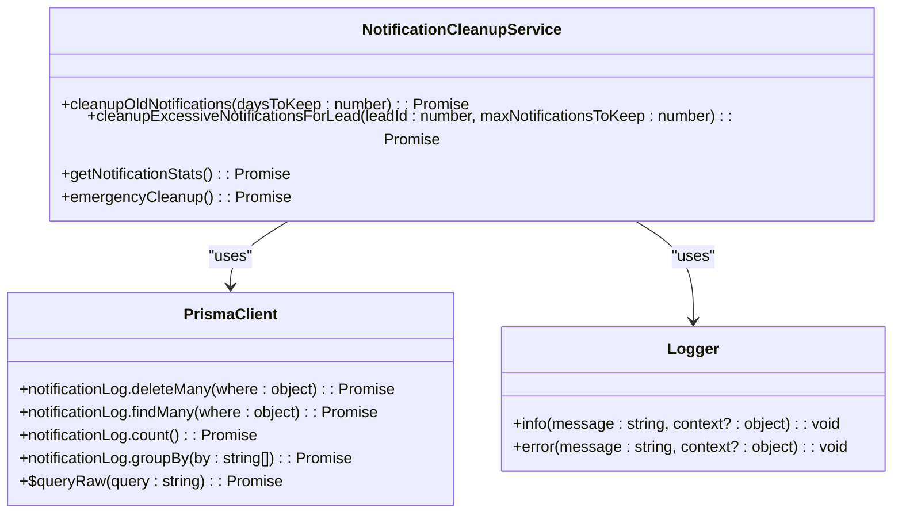
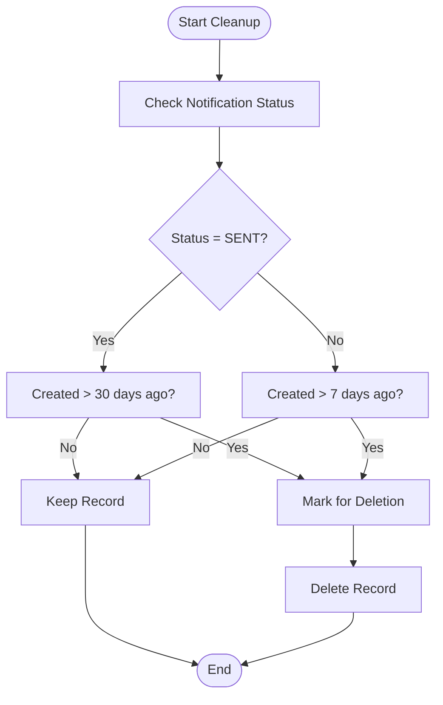
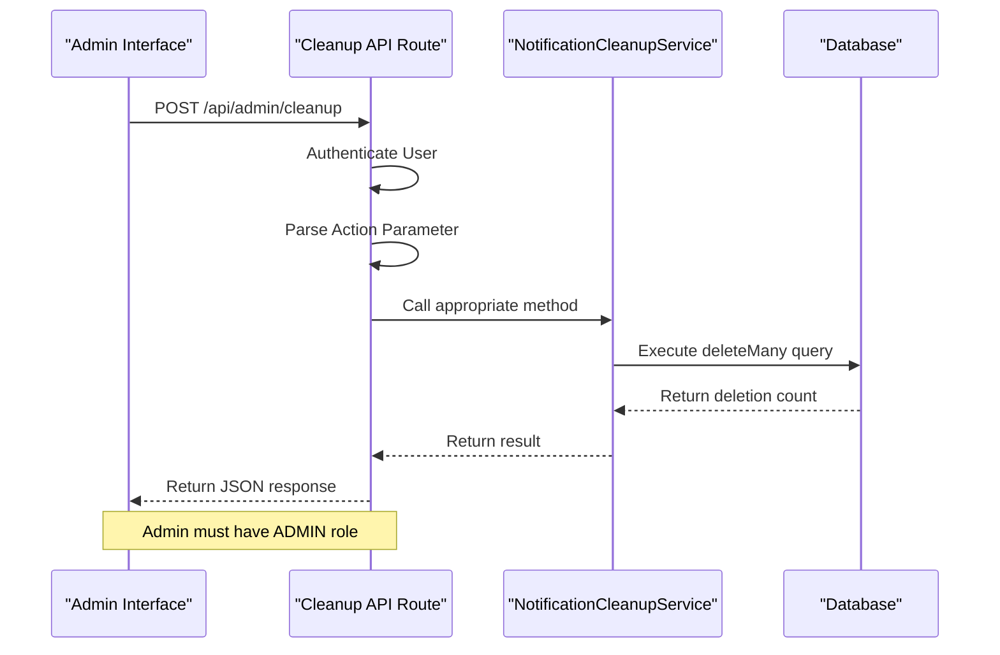
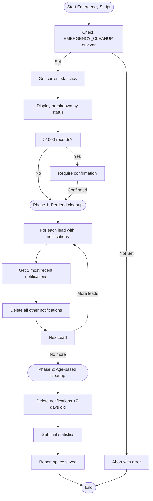
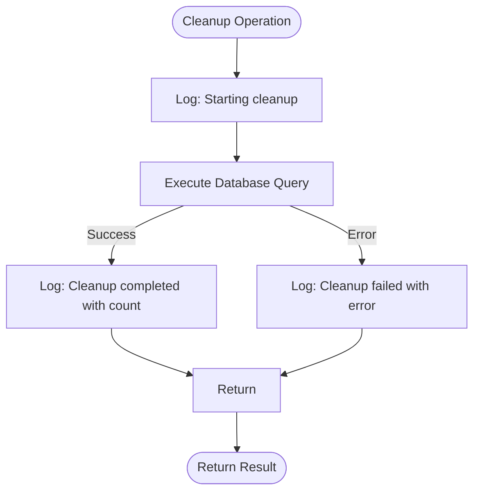
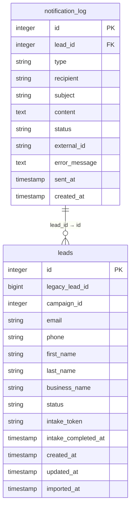

# Notification Cleanup Service

<cite>
**Referenced Files in This Document**   
- [NotificationCleanupService.ts](file://src/services/NotificationCleanupService.ts)
- [route.ts](file://src/app/api/admin/cleanup/route.ts)
- [emergency-cleanup.mjs](file://scripts/emergency-cleanup.mjs)
- [migration.sql](file://prisma/migrations/20240101000000_init/migration.sql)
- [migration.sql](file://prisma/migrations/20250812120000_add_notification_log_indexes/migration.sql)
</cite>

## Table of Contents
1. [Introduction](#introduction)
2. [Core Functionality](#core-functionality)
3. [Cleanup Criteria and Retention Policies](#cleanup-criteria-and-retention-policies)
4. [Batch Deletion Strategy](#batch-deletion-strategy)
5. [Integration with Administrative Interfaces](#integration-with-administrative-interfaces)
6. [Emergency Scripts and Manual Invocation](#emergency-scripts-and-manual-invocation)
7. [Performance Considerations](#performance-considerations)
8. [Safeguards Against Accidental Data Loss](#safeguards-against-accidental-data-loss)
9. [Logging and Monitoring](#logging-and-monitoring)
10. [Data Model and Schema](#data-model-and-schema)

## Introduction
The Notification Cleanup Service is a critical component responsible for maintaining system performance and database efficiency by systematically removing stale or obsolete notification records according to defined retention policies. This service prevents database bloat, ensures optimal query performance, and manages storage usage by implementing automated cleanup routines for notification logs. The service provides multiple cleanup strategies, including scheduled retention-based deletion, lead-specific cleanup, and emergency procedures for handling large-scale data accumulation.

**Section sources**
- [NotificationCleanupService.ts](file://src/services/NotificationCleanupService.ts#L3-L227)

## Core Functionality
The NotificationCleanupService class implements three primary functions for managing notification log lifecycle: regular cleanup based on retention policies, targeted cleanup for specific leads with excessive notifications, and emergency cleanup for rapid database size reduction. The service uses Prisma ORM to interact with the PostgreSQL database and integrates with the application's logging system to record all operations.

**Diagram sources**
- [NotificationCleanupService.ts](file://src/services/NotificationCleanupService.ts#L3-L227)

**Section sources**
- [NotificationCleanupService.ts](file://src/services/NotificationCleanupService.ts#L3-L227)

## Cleanup Criteria and Retention Policies
The service implements differentiated retention policies based on notification status. By default, it removes notification records older than 30 days, but applies a shorter retention period for failed notifications (7 days) to balance debugging needs with storage efficiency. The cleanup criteria are implemented using Prisma's query builder with conditional logic:

- **Sent notifications**: Retained for 30 days (configurable)
- **Failed notifications**: Retained for 7 days regardless of the general retention period
- **All notifications in emergency mode**: Removed if older than 7 days

The retention logic uses an OR condition in the Prisma query to ensure failed notifications are only kept for the shorter period even when the general retention period is longer.

**Diagram sources**
- [NotificationCleanupService.ts](file://src/services/NotificationCleanupService.ts#L15-L35)

**Section sources**
- [NotificationCleanupService.ts](file://src/services/NotificationCleanupService.ts#L15-L35)

## Batch Deletion Strategy
The service employs a batch deletion strategy using Prisma's deleteMany operation, which efficiently removes multiple records in a single database transaction. For lead-specific cleanup, the service first identifies the most recent notifications to preserve (based on createdAt timestamp) and then deletes all others in a single operation. This approach minimizes database round-trips and ensures atomicity of the cleanup operation.

When cleaning up excessive notifications for a specific lead, the service:
1. Queries the most recent N notifications (default: 10) to preserve
2. Extracts their IDs into a list
3. Performs a single deleteMany operation with a notIn clause

This strategy is particularly efficient for leads with high notification volumes, as it requires only two database queries regardless of the number of records to be deleted.

**Section sources**
- [NotificationCleanupService.ts](file://src/services/NotificationCleanupService.ts#L90-L115)

## Integration with Administrative Interfaces
The NotificationCleanupService is exposed through an administrative API endpoint that allows authorized users to trigger cleanup operations via HTTP requests. The API route at `/api/admin/cleanup` supports multiple actions and requires ADMIN role authentication through NextAuth.

The API supports the following actions:
- **cleanup-notifications**: Regular cleanup with configurable retention period
- **emergency-cleanup**: Emergency cleanup removing all notifications older than 7 days
- **cleanup-lead-notifications**: Targeted cleanup for a specific lead
- **get-stats**: Retrieve notification statistics for monitoring

**Diagram sources**
- [route.ts](file://src/app/api/admin/cleanup/route.ts#L0-L144)

**Section sources**
- [route.ts](file://src/app/api/admin/cleanup/route.ts#L0-L144)

## Emergency Scripts and Manual Invocation
In addition to the API interface, the system provides a standalone emergency cleanup script (`emergency-cleanup.mjs`) that can be executed directly from the command line. This script implements a more aggressive two-phase cleanup strategy:

1. **Per-lead cleanup**: For each lead with notifications, preserve only the 5 most recent notifications and delete the rest
2. **Age-based cleanup**: Remove all notifications older than 7 days

The script includes safety measures such as requiring the `EMERGENCY_CLEANUP=true` environment variable to be set before proceeding, preventing accidental execution. It also provides detailed progress reporting, showing statistics before and after cleanup, including the percentage of space saved.

**Diagram sources**
- [emergency-cleanup.mjs](file://scripts/emergency-cleanup.mjs#L0-L135)

**Section sources**
- [emergency-cleanup.mjs](file://scripts/emergency-cleanup.mjs#L0-L135)

## Performance Considerations
The cleanup service is designed with performance in mind, particularly for large-scale deletions. The database schema includes a composite index on `created_at` and `id` columns in descending order, which optimizes queries that filter by creation date and order by timestamp. This index significantly improves the performance of both the cleanup operations and regular queries that retrieve recent notifications.

For very large datasets, the service's batch deletion approach minimizes memory usage and database load by avoiding the retrieval of records to be deleted. The emergency script processes leads sequentially rather than loading all notification data into memory, making it suitable for databases with millions of records.

The service also provides a statistics endpoint that can help identify performance bottlenecks by revealing leads with excessive notification volumes, allowing administrators to address problematic cases proactively.

**Section sources**
- [migration.sql](file://prisma/migrations/20250812120000_add_notification_log_indexes/migration.sql#L2-L3)
- [NotificationCleanupService.ts](file://src/services/NotificationCleanupService.ts#L136-L162)

## Safeguards Against Accidental Data Loss
The system implements multiple safeguards to prevent accidental data loss:

1. **Authentication and authorization**: All API endpoints require ADMIN role authentication
2. **Parameter validation**: The API validates required parameters like leadId
3. **Environment variable check**: The emergency script requires explicit confirmation via environment variable
4. **Logging**: All cleanup operations are logged with detailed information including the number of records affected
5. **Transaction safety**: Prisma's deleteMany operations are atomic, ensuring data consistency

The service never deletes all notification records indiscriminately. Even in emergency mode, it only removes records older than 7 days, preserving recent notifications that may be needed for ongoing operations and debugging.

**Section sources**
- [route.ts](file://src/app/api/admin/cleanup/route.ts#L10-L15)
- [emergency-cleanup.mjs](file://scripts/emergency-cleanup.mjs#L50-L55)

## Logging and Monitoring
The NotificationCleanupService integrates comprehensive logging to track all operations and facilitate monitoring. Each cleanup operation generates log entries at key points:

- **Info level**: When cleanup starts and completes, including the number of records deleted
- **Error level**: If cleanup fails, with detailed error information

The service also provides a `getNotificationStats` method that returns comprehensive metrics for monitoring storage usage trends:

- Total notification count
- Breakdown by status (SENT, FAILED, etc.)
- Breakdown by type (EMAIL, SMS)
- Oldest and newest notification timestamps
- List of leads with excessive notifications (>50)

These statistics can be used to identify trends in notification volume, detect potential issues, and plan capacity requirements.

**Diagram sources**
- [NotificationCleanupService.ts](file://src/services/NotificationCleanupService.ts#L16-L20)
- [NotificationCleanupService.ts](file://src/services/NotificationCleanupService.ts#L136-L162)

**Section sources**
- [NotificationCleanupService.ts](file://src/services/NotificationCleanupService.ts#L16-L20)
- [NotificationCleanupService.ts](file://src/services/NotificationCleanupService.ts#L136-L162)

## Data Model and Schema
The notification cleanup operations target the `notification_log` table in the database, which stores records of all sent and attempted notifications. The table schema includes key fields that support the cleanup functionality:

- **id**: Primary key (SERIAL)
- **created_at**: Timestamp used for age-based cleanup
- **status**: ENUM field (pending, sent, failed) used for status-based retention
- **lead_id**: Foreign key to leads table, enabling lead-specific cleanup
- **type**: ENUM field (email, sms) for categorization

The table has a foreign key constraint on lead_id with SET NULL on delete, ensuring referential integrity. The composite index on `created_at DESC, id DESC` optimizes queries that filter by creation date and order by timestamp, which are common in both cleanup operations and regular application queries.

**Diagram sources**
- [migration.sql](file://prisma/migrations/20240101000000_init/migration.sql#L91-L132)
- [migration.sql](file://prisma/migrations/20250812120000_add_notification_log_indexes/migration.sql#L2-L3)

**Section sources**
- [migration.sql](file://prisma/migrations/20240101000000_init/migration.sql#L91-L132)
- [migration.sql](file://prisma/migrations/20250812120000_add_notification_log_indexes/migration.sql#L2-L3)