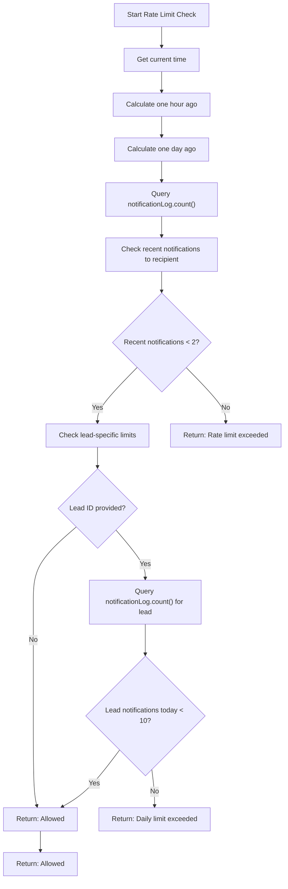
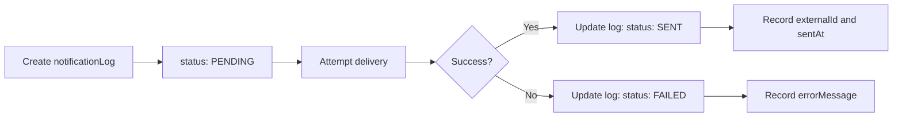
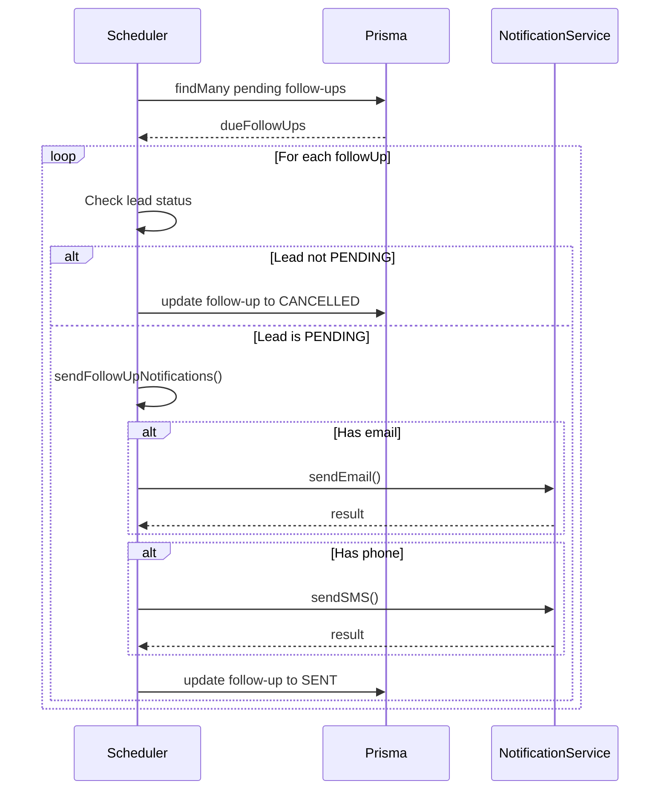

# Notification Service

<cite>
**Referenced Files in This Document**   
- [NotificationService.ts](file://src/services/NotificationService.ts#L1-L472)
- [FollowUpScheduler.ts](file://src/services/FollowUpScheduler.ts#L1-L491)
- [SystemSettingsService.ts](file://src/services/SystemSettingsService.ts#L1-L352)
- [schema.prisma](file://prisma/schema.prisma#L140-L158)
- [test-notifications.mjs](file://scripts/test-notifications.mjs#L1-L102)
</cite>

## Table of Contents
1. [Introduction](#introduction)
2. [Core Architecture](#core-architecture)
3. [Email and SMS Delivery Implementation](#email-and-sms-delivery-implementation)
4. [Message Templating System](#message-templating-system)
5. [Rate Limiting Mechanism](#rate-limiting-mechanism)
6. [Retry Logic with Exponential Backoff](#retry-logic-with-exponential-backoff)
7. [Delivery Status Tracking and Logging](#delivery-status-tracking-and-logging)
8. [Integration with FollowUpScheduler](#integration-with-followupscheduler)
9. [Configuration Management via System Settings](#configuration-management-via-system-settings)
10. [Error Handling and Fallback Mechanisms](#error-handling-and-fallback-mechanisms)
11. [Scalability and Security Considerations](#scalability-and-security-considerations)

## Introduction
The Notification Service is a core component responsible for sending email and SMS notifications to leads within the merchant funding application system. It integrates with external services (Mailgun for email and Twilio for SMS), implements robust delivery mechanisms with retry logic, enforces rate limiting, and maintains comprehensive delivery tracking through the NotificationLog model. The service is designed to be resilient, configurable, and scalable, supporting both direct API calls and scheduled follow-ups triggered by the FollowUpScheduler.

**Section sources**
- [NotificationService.ts](file://src/services/NotificationService.ts#L1-L50)

## Core Architecture
The Notification Service follows a modular, singleton-based architecture with clear separation of concerns. It encapsulates external service clients (Twilio and Mailgun), manages configuration through environment variables and dynamic system settings, and provides a clean interface for sending notifications. The service is initialized once and reused throughout the application lifecycle.

```mermaid
classDiagram
class NotificationService {
+twilioClient : Twilio | null
+mailgunClient : any | null
+config : NotificationConfig
+sendEmail(notification : EmailNotification) : Promise~NotificationResult~
+sendSMS(notification : SMSNotification) : Promise~NotificationResult~
-initializeClients() : void
-sendEmailInternal(notification : EmailNotification) : Promise~NotificationResult~
-sendSMSInternal(notification : SMSNotification) : Promise~NotificationResult~
-executeWithRetry~T~(fn : () => Promise~T~, operationType : string) : Promise~T~
-checkRateLimit(recipient : string, type : 'EMAIL' | 'SMS', leadId? : number) : Promise~{ allowed : boolean; reason? : string }~
-sleep(ms : number) : Promise~void~
+validateConfiguration() : Promise~boolean~
+getNotificationStats(leadId : number) : Promise~Record~string, number~~
+getRecentNotifications(limit : number = 50) : Promise~NotificationLog[]~
}
class NotificationConfig {
+twilio : { accountSid : string, authToken : string, phoneNumber : string }
+mailgun : { apiKey : string, domain : string, fromEmail : string }
+retryConfig : { maxRetries : number, baseDelay : number, maxDelay : number }
}
class EmailNotification {
+to : string
+subject : string
+text : string
+html? : string
+leadId? : number
}
class SMSNotification {
+to : string
+message : string
+leadId? : number
}
class NotificationResult {
+success : boolean
+externalId? : string
+error? : string
}
NotificationService --> NotificationConfig : "has"
NotificationService --> EmailNotification : "sends"
NotificationService --> SMSNotification : "sends"
NotificationService --> NotificationResult : "returns"
```

**Diagram sources**
- [NotificationService.ts](file://src/services/NotificationService.ts#L1-L472)

**Section sources**
- [NotificationService.ts](file://src/services/NotificationService.ts#L1-L472)

## Email and SMS Delivery Implementation
The Notification Service implements separate methods for sending email via Mailgun and SMS via Twilio, with consistent error handling and logging patterns. Both delivery methods follow the same workflow: validate service availability, check rate limits, create a log entry, attempt delivery with retry logic, and update the log status accordingly.

### Email Delivery Process
Email notifications are sent through the Mailgun API using the official Mailgun.js library. The service initializes the Mailgun client lazily when first needed, using credentials from environment variables. The `sendEmail` method orchestrates the entire delivery process, including configuration validation, rate limiting, and delivery tracking.

```mermaid
sequenceDiagram
participant Client
participant NotificationService
participant Mailgun
participant Prisma
Client->>NotificationService : sendEmail(notification)
NotificationService->>NotificationService : getNotificationSettings()
alt Email disabled
NotificationService-->>Client : { success : false, error : "Email notifications are disabled" }
stop
end
NotificationService->>NotificationService : checkRateLimit()
alt Rate limit exceeded
NotificationService-->>Client : { success : false, error : "Rate limit exceeded" }
stop
end
NotificationService->>NotificationService : initializeClients()
NotificationService->>Prisma : create notificationLog (PENDING)
NotificationService->>NotificationService : executeWithRetry(sendEmailInternal)
loop Retry attempts
NotificationService->>Mailgun : send email via messages.create()
alt Success
Mailgun-->>NotificationService : response with ID
break
else Error
NotificationService->>NotificationService : wait with exponential backoff
end
end
alt Delivery successful
NotificationService->>Prisma : update log status to SENT
NotificationService-->>Client : { success : true, externalId : "mailgun-id" }
else Delivery failed
NotificationService->>Prisma : update log status to FAILED
NotificationService-->>Client : { success : false, error : "Delivery failed" }
end
```

**Diagram sources**
- [NotificationService.ts](file://src/services/NotificationService.ts#L100-L200)

### SMS Delivery Process
SMS notifications are sent through the Twilio API using the official Twilio Node.js library. The implementation mirrors the email delivery process but uses Twilio-specific parameters such as the sender phone number from environment variables.

```mermaid
sequenceDiagram
participant Client
participant NotificationService
participant Twilio
participant Prisma
Client->>NotificationService : sendSMS(notification)
NotificationService->>NotificationService : getNotificationSettings()
alt SMS disabled
NotificationService-->>Client : { success : false, error : "SMS notifications are disabled" }
stop
end
NotificationService->>NotificationService : checkRateLimit()
alt Rate limit exceeded
NotificationService-->>Client : { success : false, error : "Rate limit exceeded" }
stop
end
NotificationService->>NotificationService : initializeClients()
NotificationService->>Prisma : create notificationLog (PENDING)
NotificationService->>NotificationService : executeWithRetry(sendSMSInternal)
loop Retry attempts
NotificationService->>Twilio : send SMS via messages.create()
alt Success
Twilio-->>NotificationService : message object with SID
break
else Error
NotificationService->>NotificationService : wait with exponential backoff
end
end
alt Delivery successful
NotificationService->>Prisma : update log status to SENT
NotificationService-->>Client : { success : true, externalId : "twilio-sid" }
else Delivery failed
NotificationService->>Prisma : update log status to FAILED
NotificationService-->>Client : { success : false, error : "Delivery failed" }
end
```

**Diagram sources**
- [NotificationService.ts](file://src/services/NotificationService.ts#L200-L300)

**Section sources**
- [NotificationService.ts](file://src/services/NotificationService.ts#L100-L300)

## Message Templating System
The Notification Service supports message templating through integration with the FollowUpScheduler, which generates context-specific messages for follow-up notifications. The templating system uses dynamic content based on follow-up type, lead information, and application URLs.

### Follow-Up Message Templates
The FollowUpScheduler implements a comprehensive message templating system that generates both email and SMS content based on the follow-up type (3-hour, 9-hour, 24-hour, or 72-hour). Each template includes personalized elements such as the lead's name, urgency level, and time reference.

```typescript
// Example of message template generation
private getFollowUpMessages(
  followUpType: FollowupType,
  leadName: string,
  intakeUrl: string
) {
  const baseMessages = {
    [FollowupType.THREE_HOUR]: {
      emailSubject: "Quick Reminder: Complete Your Merchant Funding Application",
      urgency: "We wanted to follow up quickly",
      timeframe: "just a few hours ago",
    },
    [FollowupType.NINE_HOUR]: {
      emailSubject: "Don't Miss Out: Your Merchant Funding Application",
      urgency: "We noticed you haven't completed",
      timeframe: "earlier today",
    },
    // ... other follow-up types
  };

  const message = baseMessages[followUpType];

  return {
    emailSubject: message.emailSubject,
    emailText: `Hi ${leadName},

${message.urgency} your merchant funding application that you started ${message.timeframe}.

Complete your application now: ${intakeUrl}

Don't miss this opportunity to secure funding for your business. The application only takes a few minutes to complete.

If you have any questions, please don't hesitate to contact us.

Best regards,
Merchant Funding Team`,
    emailHtml: `
      <h2>${message.emailSubject}</h2>
      <p>Hi ${leadName},</p>
      <p>${message.urgency} your merchant funding application that you started ${message.timeframe}.</p>
      <p><a href="${intakeUrl}" style="background-color: #dc3545; color: white; padding: 12px 24px; text-decoration: none; border-radius: 5px; font-weight: bold;">Complete Application Now</a></p>
      <p>Don't miss this opportunity to secure funding for your business. The application only takes a few minutes to complete.</p>
      <p>If you have any questions, please don't hesitate to contact us.</p>
      <p>Best regards,<br>Merchant Funding Team</p>
    `,
    smsText: `Hi ${leadName}! ${message.urgency} to complete your merchant funding application. Complete it now: ${intakeUrl}`,
  };
}
```

**Section sources**
- [FollowUpScheduler.ts](file://src/services/FollowUpScheduler.ts#L350-L450)

## Rate Limiting Mechanism
The Notification Service implements a comprehensive rate limiting system to prevent spam and ensure responsible communication practices. The rate limiting operates at two levels: per-recipient hourly limits and per-lead daily limits.

### Rate Limiting Rules
- **Per-recipient limit**: Maximum of 2 notifications per hour to the same email address or phone number
- **Per-lead limit**: Maximum of 10 notifications per day for the same lead
- **Graceful failure**: If rate limit checks fail due to database errors, the service allows the notification to proceed



**Diagram sources**
- [NotificationService.ts](file://src/services/NotificationService.ts#L350-L400)

**Section sources**
- [NotificationService.ts](file://src/services/NotificationService.ts#L350-L400)

## Retry Logic with Exponential Backoff
The Notification Service implements robust retry logic with exponential backoff to handle transient failures in external service communication. This ensures reliable delivery even during temporary network issues or service outages.

### Retry Configuration
The retry mechanism is configurable through both environment variables and dynamic system settings, allowing administrators to adjust retry behavior without code changes.

```typescript
// Retry configuration structure
interface RetryConfig {
  maxRetries: number;    // Maximum number of retry attempts
  baseDelay: number;     // Initial delay in milliseconds
  maxDelay: number;      // Maximum delay in milliseconds
}
```

### Exponential Backoff Algorithm
The service uses exponential backoff with the formula: `delay = min(baseDelay * 2^attempt, maxDelay)`. This means delays grow exponentially with each retry attempt but are capped at a maximum value to prevent excessively long waits.

```mermaid
sequenceDiagram
participant Service
participant ExternalAPI
Service->>ExternalAPI : Attempt 1
alt Success
ExternalAPI-->>Service : Success
stop
else Failure
Service->>Service : Wait 1000ms (1s)
Service->>ExternalAPI : Attempt 2
alt Success
ExternalAPI-->>Service : Success
stop
else Failure
Service->>Service : Wait 2000ms (2s)
Service->>ExternalAPI : Attempt 3
alt Success
ExternalAPI-->>Service : Success
stop
else Failure
Service->>Service : Wait 4000ms (4s)
Service->>ExternalAPI : Attempt 4 (max)
alt Success
ExternalAPI-->>Service : Success
else Failure
Service->>Service : Throw error after max retries
end
end
end
end
```

**Diagram sources**
- [NotificationService.ts](file://src/services/NotificationService.ts#L300-L350)

**Section sources**
- [NotificationService.ts](file://src/services/NotificationService.ts#L300-L350)

## Delivery Status Tracking and Logging
The Notification Service maintains comprehensive delivery tracking through the NotificationLog model, which records all notification attempts with detailed status information.

### NotificationLog Model Structure
The NotificationLog model captures essential information about each notification attempt, enabling detailed tracking, auditing, and analytics.

```prisma
model NotificationLog {
  id           Int                @id @default(autoincrement())
  leadId       Int?               @map("lead_id")
  type         NotificationType
  recipient    String
  subject      String?
  content      String?
  status       NotificationStatus @default(PENDING)
  externalId   String?            @map("external_id")
  errorMessage String?            @map("error_message")
  sentAt       DateTime?          @map("sent_at")
  createdAt    DateTime           @default(now()) @map("created_at")

  // Relations
  lead Lead? @relation(fields: [leadId], references: [id])

  @@map("notification_log")
}

enum NotificationType {
  EMAIL @map("email")
  SMS   @map("sms")
}

enum NotificationStatus {
  PENDING @map("pending")
  SENT    @map("sent")
  FAILED  @map("failed")
}
```

### Logging Workflow
For each notification attempt, the service follows a consistent logging workflow:
1. Create a log entry with status PENDING before delivery attempt
2. Update the log entry to SENT with external ID and timestamp on success
3. Update the log entry to FAILED with error message on delivery failure



**Diagram sources**
- [schema.prisma](file://prisma/schema.prisma#L140-L158)
- [NotificationService.ts](file://src/services/NotificationService.ts#L120-L140)

**Section sources**
- [schema.prisma](file://prisma/schema.prisma#L140-L158)
- [NotificationService.ts](file://src/services/NotificationService.ts#L120-L140)

## Integration with FollowUpScheduler
The Notification Service is tightly integrated with the FollowUpScheduler, which uses it to send automated follow-up notifications to leads at predefined intervals.

### Follow-Up Processing Workflow
The FollowUpScheduler processes pending follow-ups and uses the NotificationService to send notifications based on lead status and availability of contact information.



### Real Code Example: Follow-Up Notification
```typescript
// In FollowUpScheduler.sendFollowUpNotifications()
const emailResult = await notificationService.sendEmail({
  to: followUp.lead.email,
  subject: messages.emailSubject,
  text: messages.emailText,
  html: messages.emailHtml,
  leadId: followUp.lead.id,
});

const smsResult = await notificationService.sendSMS({
  to: followUp.lead.phone,
  message: messages.smsText,
  leadId: followUp.lead.id,
});
```

**Diagram sources**
- [FollowUpScheduler.ts](file://src/services/FollowUpScheduler.ts#L200-L300)

**Section sources**
- [FollowUpScheduler.ts](file://src/services/FollowUpScheduler.ts#L200-L300)

## Configuration Management via System Settings
The Notification Service leverages the SystemSettingsService for dynamic configuration, allowing runtime adjustments to notification behavior without requiring application restarts.

### Dynamic Configuration Parameters
The service retrieves the following configuration parameters from system settings:

```typescript
// Configuration retrieved from system settings
const settings = await getNotificationSettings();
// Returns:
// {
//   smsEnabled: boolean,
//   emailEnabled: boolean,
//   retryAttempts: number,
//   retryDelay: number
// }
```

### System Settings Structure
The system settings are stored in the database with the following structure:

```prisma
model SystemSetting {
  id           Int                @id @default(autoincrement())
  key          String             @unique
  value        String
  type         SystemSettingType
  category     SystemSettingCategory
  description  String
  defaultValue String             @map("default_value")
  updatedBy    Int?               @map("updated_by")
  createdAt    DateTime           @default(now()) @map("created_at")
  updatedAt    DateTime           @updatedAt @map("updated_at")
}

enum SystemSettingCategory {
  NOTIFICATIONS    @map("notifications")
  CONNECTIVITY     @map("connectivity")
}
```

Common notification-related settings include:
- `sms_notifications_enabled`: Controls whether SMS notifications are allowed
- `email_notifications_enabled`: Controls whether email notifications are allowed
- `notification_retry_attempts`: Number of retry attempts for failed deliveries
- `notification_retry_delay`: Base delay in milliseconds for retry backoff

**Section sources**
- [SystemSettingsService.ts](file://src/services/SystemSettingsService.ts#L1-L352)

## Error Handling and Fallback Mechanisms
The Notification Service implements comprehensive error handling to ensure reliability and provide meaningful feedback for troubleshooting.

### Error Handling Strategy
The service follows a consistent error handling pattern across all operations:

1. **Try-catch wrapping**: All external service calls are wrapped in try-catch blocks
2. **Log entry updates**: Failed deliveries update the NotificationLog with error details
3. **Graceful degradation**: When one notification method fails, others may still succeed
4. **Informative error messages**: Errors are captured and returned to callers

```typescript
try {
  const result = await this.executeWithRetry(
    () => this.sendEmailInternal(notification),
    'email'
  );
  
  // Update log entry on success
  await prisma.notificationLog.update({
    where: { id: logEntry.id },
    data: {
      status: NotificationStatus.SENT,
      externalId: result.externalId,
      sentAt: new Date(),
    },
  });
  
  return result;
} catch (error) {
  // Update log entry on failure
  await prisma.notificationLog.update({
    where: { id: logEntry.id },
    data: {
      status: NotificationStatus.FAILED,
      errorMessage: error instanceof Error ? error.message : 'Unknown error',
    },
  });

  return {
    success: false,
    error: error instanceof Error ? error.message : 'Unknown error',
  };
}
```

### Fallback Mechanisms
The FollowUpScheduler implements a fallback mechanism where it attempts both email and SMS delivery independently. If one method fails, the other may still succeed:

```typescript
// In FollowUpScheduler.sendFollowUpNotifications()
let emailSent = false;
let smsSent = false;

// Send email if available
if (followUp.lead.email) {
  try {
    const emailResult = await notificationService.sendEmail(/* ... */);
    if (emailResult.success) {
      emailSent = true;
    }
  } catch (error) {
    errors.push(`Email error: ${error.message}`);
  }
}

// Send SMS if available
if (followUp.lead.phone) {
  try {
    const smsResult = await notificationService.sendSMS(/* ... */);
    if (smsResult.success) {
      smsSent = true;
    }
  } catch (error) {
    errors.push(`SMS error: ${error.message}`);
  }
}

// Consider success if at least one notification was sent
const success = emailSent || smsSent;
```

**Section sources**
- [NotificationService.ts](file://src/services/NotificationService.ts#L150-L200)
- [FollowUpScheduler.ts](file://src/services/FollowUpScheduler.ts#L300-L350)

## Scalability and Security Considerations
The Notification Service is designed with scalability and security best practices in mind to handle growing volumes of notifications while protecting sensitive communication credentials.

### Scalability Features
- **Lazy client initialization**: External service clients are initialized only when first needed, reducing startup overhead
- **Database indexing**: The NotificationLog table has appropriate indexes for efficient querying by recipient, leadId, and status
- **Caching**: System settings are cached with a 5-minute TTL to reduce database load
- **Asynchronous processing**: Notifications are sent asynchronously, preventing blocking of main application flow

### Security Practices
- **Environment variable storage**: All external service credentials (Twilio and Mailgun) are stored in environment variables, not in code
- **Configuration validation**: The service validates required environment variables on startup
- **Input sanitization**: Recipient addresses are validated through rate limiting and database constraints
- **Error masking**: Detailed error messages from external services are logged internally but not exposed to clients

```typescript
// Configuration validation on startup
async validateConfiguration(): Promise<boolean> {
  const requiredEmailVars = [
    'MAILGUN_API_KEY',
    'MAILGUN_DOMAIN',
    'MAILGUN_FROM_EMAIL',
  ];

  const requiredSmsVars = [
    'TWILIO_ACCOUNT_SID',
    'TWILIO_AUTH_TOKEN',
    'TWILIO_PHONE_NUMBER',
  ];

  const missingEmailVars = requiredEmailVars.filter(varName => !process.env[varName]);
  const missingSmsVars = settings.smsEnabled ? requiredSmsVars.filter(varName => !process.env[varName]) : [];

  if (missingEmailVars.length > 0) {
    console.error('Missing required email environment variables:', missingEmailVars);
    return false;
  }

  if (missingSmsVars.length > 0) {
    console.error('Missing required SMS environment variables (SMS is enabled):', missingSmsVars);
    return false;
  }

  return true;
}
```

### Real Code Examples
**Sample Email Notification Payload:**
```json
{
  "to": "john.doe@example.com",
  "subject": "Quick Reminder: Complete Your Merchant Funding Application",
  "text": "Hi John Doe,\n\nWe wanted to follow up quickly your merchant funding application that you started just a few hours ago.\n\nComplete your application now: http://localhost:3000/application/abc123\n\nDon't miss this opportunity to secure funding for your business. The application only takes a few minutes to complete.\n\nIf you have any questions, please don't hesitate to contact us.\n\nBest regards,\nMerchant Funding Team",
  "html": "<h2>Quick Reminder: Complete Your Merchant Funding Application</h2><p>Hi John Doe,</p><p>We wanted to follow up quickly your merchant funding application that you started just a few hours ago.</p><p><a href=\"http://localhost:3000/application/abc123\" style=\"background-color: #dc3545; color: white; padding: 12px 24px; text-decoration: none; border-radius: 5px; font-weight: bold;\">Complete Application Now</a></p><p>Don't miss this opportunity to secure funding for your business. The application only takes a few minutes to complete.</p><p>If you have any questions, please don't hesitate to contact us.</p><p>Best regards,<br>Merchant Funding Team</p>",
  "leadId": 123
}
```

**Sample SMS Notification Payload:**
```json
{
  "to": "+15551234567",
  "message": "Hi John Doe! We wanted to follow up quickly to complete your merchant funding application. Complete it now: http://localhost:3000/application/abc123",
  "leadId": 123
}
```

**Test Script Usage:**
```bash
# Test email notification
node scripts/test-notifications.mjs email "test@example.com" "Test Subject" "Test message" 123

# Test SMS notification
node scripts/test-notifications.mjs sms "+1234567890" "Test SMS message" 123
```

**Section sources**
- [NotificationService.ts](file://src/services/NotificationService.ts#L400-L472)
- [test-notifications.mjs](file://scripts/test-notifications.mjs#L1-L102)