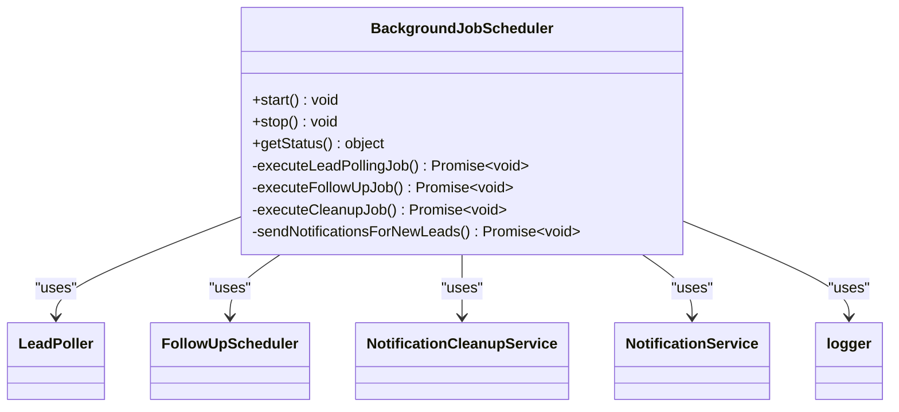
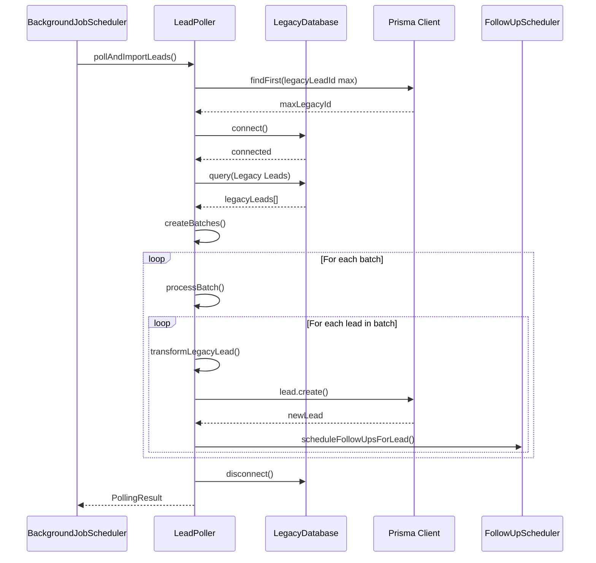
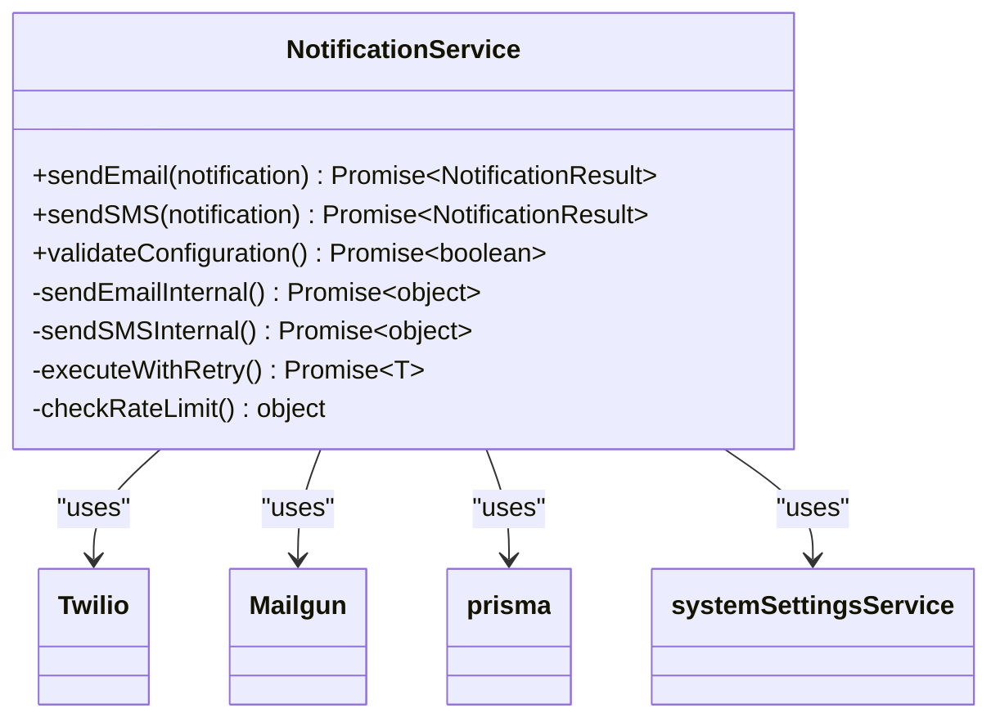
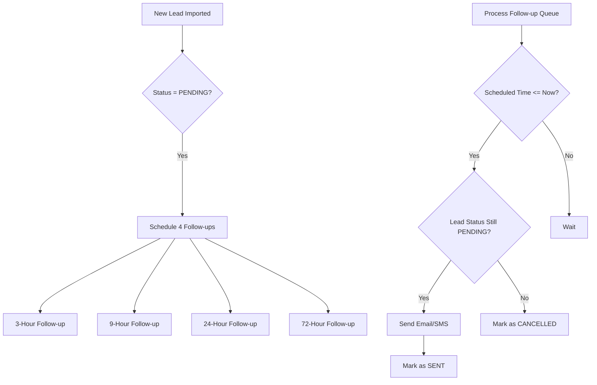
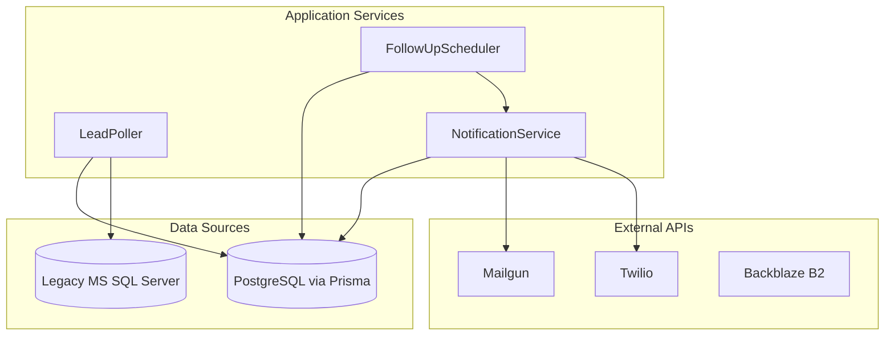

# Service Layer Architecture

<cite>
**Referenced Files in This Document**   
- [BackgroundJobScheduler.ts](file://src/services/BackgroundJobScheduler.ts)
- [LeadPoller.ts](file://src/services/LeadPoller.ts)
- [NotificationService.ts](file://src/services/NotificationService.ts)
- [FollowUpScheduler.ts](file://src/services/FollowUpScheduler.ts)
- [SystemSettingsService.ts](file://src/services/SystemSettingsService.ts)
- [legacy-db.ts](file://src/lib/legacy-db.ts)
- [prisma.ts](file://src/lib/prisma.ts)
- [notifications.ts](file://src/lib/notifications.ts)
- [server-init.ts](file://src/lib/server-init.ts)
</cite>

## Table of Contents
1. [Introduction](#introduction)
2. [Core Design Patterns](#core-design-patterns)
3. [Service Coordination via BackgroundJobScheduler](#service-coordination-via-backgroundjobscheduler)
4. [LeadPoller: Legacy Data Integration](#leadpoller-legacy-data-integration)
5. [NotificationService: Multi-Channel Communication](#notificationservice-multi-channel-communication)
6. [FollowUpScheduler: Automated Engagement](#followupscheduler-automated-engagement)
7. [Database and External Service Integration](#database-and-external-service-integration)
8. [Performance and Concurrency Considerations](#performance-and-concurrency-considerations)
9. [Conclusion](#conclusion)

## Introduction
The service layer of the fund-track backend implements a robust, modular architecture designed to encapsulate business logic, manage background operations, and coordinate interactions between the application and external systems. This documentation provides a comprehensive analysis of the service layer's design, focusing on its use of singleton patterns, dependency management, separation from API routes, and integration with database and external services. The architecture emphasizes testability, extensibility, and operational reliability, enabling efficient processing of leads, notifications, and follow-up actions.

## Core Design Patterns

The service layer employs several key design patterns to ensure maintainability and scalability. The most prominent is the **singleton pattern**, used extensively across services to ensure a single, shared instance throughout the application lifecycle. This pattern is implemented through direct instantiation and export of service objects, such as `notificationService` in `NotificationService.ts` and `systemSettingsService` in `SystemSettingsService.ts`. This approach guarantees consistent state and configuration across all components that utilize these services.

Dependency injection is implemented through a **lazy initialization and configuration pattern**. Services do not receive their dependencies (like Prisma client or external API clients) through constructor parameters. Instead, they access shared, globally available instances like `prisma` from `prisma.ts` and environment variables for configuration. This reduces coupling and simplifies service creation, as seen in the `NotificationService` which initializes Twilio and Mailgun clients only when needed, based on environment variables.

The architecture strictly separates business logic from API routes. Services like `LeadPoller` and `FollowUpScheduler` contain the core logic for data processing and workflow management, while API routes in the `src/app/api` directory act as thin controllers that trigger these services. This separation enhances testability, as business logic can be tested independently of HTTP concerns, and improves code reuse, as the same service methods can be invoked from multiple entry points, including API routes, cron jobs, and administrative interfaces.

**Section sources**
- [BackgroundJobScheduler.ts](file://src/services/BackgroundJobScheduler.ts#L8-L458)
- [NotificationService.ts](file://src/services/NotificationService.ts#L47-L468)
- [SystemSettingsService.ts](file://src/services/SystemSettingsService.ts#L291-L349)
- [server-init.ts](file://src/lib/server-init.ts#L0-L41)

## Service Coordination via BackgroundJobScheduler

The `BackgroundJobScheduler` class serves as the central orchestrator for all background operations in the system. It uses the `cron` library to schedule and execute periodic tasks, ensuring that critical business processes run reliably without manual intervention. The scheduler manages three primary jobs: lead polling, follow-up processing, and notification cleanup.

**Diagram sources**
- [BackgroundJobScheduler.ts](file://src/services/BackgroundJobScheduler.ts#L8-L458)

The lead polling job, scheduled every 15 minutes by default, is responsible for importing new leads from a legacy MS SQL Server database. It delegates the actual polling and import logic to the `LeadPoller` service. Upon successful import, it triggers the `sendNotificationsForNewLeads` method to dispatch initial intake notifications. The follow-up job, running every 5 minutes, processes the follow-up queue using the `FollowUpScheduler`, sending reminder notifications to leads that have not completed their application. The daily cleanup job removes old notification and follow-up records to maintain database performance.

Error handling within the scheduler is comprehensive. Each job execution is wrapped in a try-catch block. If a job fails, the error is logged, and a failure notification is sent to an admin email via the `NotificationService`. This ensures that operational issues are immediately visible and can be addressed promptly. The scheduler's status can be queried at any time, providing visibility into its operational state and the next scheduled execution times for each job.

**Section sources**
- [BackgroundJobScheduler.ts](file://src/services/BackgroundJobScheduler.ts#L8-L458)

## LeadPoller: Legacy Data Integration

The `LeadPoller` service is responsible for synchronizing data from a legacy MS SQL Server database into the application's primary PostgreSQL database via Prisma. It implements a polling mechanism that retrieves new leads incrementally, based on the highest `legacyLeadId` already imported. This ensures that no data is missed or duplicated during the import process.

**Diagram sources**
- [LeadPoller.ts](file://src/services/LeadPoller.ts#L21-L497)
- [legacy-db.ts](file://src/lib/legacy-db.ts#L130-L157)
- [prisma.ts](file://src/lib/prisma.ts#L0-L44)

The service uses a configurable batch size to process leads in chunks, which helps manage memory usage and transaction times. Each legacy lead is transformed into the application's data model, with sensitive data sanitized and an intake token generated using the `TokenService`. After a lead is successfully created in the database, the `FollowUpScheduler` is immediately invoked to schedule a series of follow-up notifications. This tight integration ensures that the engagement workflow begins as soon as a new lead is imported.

The `LeadPoller` demonstrates robust error handling. The entire polling process is wrapped in a try-catch block, and individual batch and lead processing operations are also isolated. If a lead fails to import, the error is logged, and processing continues with the next lead, preventing a single bad record from halting the entire import. The service also manages the lifecycle of the legacy database connection, ensuring it is properly opened and closed, even if an error occurs.

**Section sources**
- [LeadPoller.ts](file://src/services/LeadPoller.ts#L21-L497)
- [legacy-db.ts](file://src/lib/legacy-db.ts#L0-L157)

## NotificationService: Multi-Channel Communication

The `NotificationService` provides a unified interface for sending email and SMS notifications through third-party providers Mailgun and Twilio. It encapsulates the complexity of interacting with these external APIs, offering simple `sendEmail` and `sendSMS` methods that handle configuration, error retry logic, and logging.

**Diagram sources**
- [NotificationService.ts](file://src/services/NotificationService.ts#L47-L468)

A key feature of the `NotificationService` is its **exponential backoff retry mechanism**. The `executeWithRetry` method automatically retries failed notification attempts, with delays increasing between attempts. The number of retries and initial delay are configurable via the `SystemSettingsService`, allowing operational tuning without code changes. This significantly improves the reliability of notifications in the face of transient network or API issues.

The service also implements **rate limiting** to prevent spamming recipients. It checks the `notificationLog` table before sending a notification to ensure that no more than two messages are sent to the same recipient within an hour, and no more than ten messages are sent to the same lead within a day. This protects the application's reputation with email and SMS providers. All notification attempts are logged in the database with their status (PENDING, SENT, FAILED), providing a complete audit trail for monitoring and debugging.

**Section sources**
- [NotificationService.ts](file://src/services/NotificationService.ts#L47-L468)
- [notifications.ts](file://src/lib/notifications.ts#L0-L221)

## FollowUpScheduler: Automated Engagement

The `FollowUpScheduler` manages the lifecycle of automated follow-up communications for leads in the PENDING status. It uses a database-backed queue (`followupQueue` table) to schedule and track follow-up actions, ensuring reliability even if the application restarts.

**Diagram sources**
- [FollowUpScheduler.ts](file://src/services/FollowUpScheduler.ts#L19-L486)

When a new lead is imported, the `scheduleFollowUpsForLead` method is called, creating four entries in the `followupQueue` table with scheduled times at 3, 9, 24, and 72 hours after import. The `BackgroundJobScheduler` periodically calls `processFollowUpQueue`, which retrieves all pending follow-ups that are due. For each due follow-up, it first verifies that the lead is still in the PENDING status. If the lead's status has changed (e.g., to COMPLETED), the follow-up is cancelled, preventing unnecessary notifications.

The `sendFollowUpNotifications` method uses the `NotificationService` to send both email and SMS messages, if the lead's contact information is available. The message content is dynamically generated based on the follow-up type, becoming increasingly urgent as the time progresses. This graduated approach maximizes the chance of lead conversion. The service also provides a `cancelFollowUpsForLead` method, which is called whenever a lead's status changes, ensuring that no follow-ups are sent after a lead has completed their application or been disqualified.

**Section sources**
- [FollowUpScheduler.ts](file://src/services/FollowUpScheduler.ts#L19-L486)
- [BackgroundJobScheduler.ts](file://src/services/BackgroundJobScheduler.ts#L8-L458)

## Database and External Service Integration

The service layer interacts with two primary data sources: the main PostgreSQL database via Prisma ORM and a legacy MS SQL Server database. The Prisma client, exported from `prisma.ts`, is used by all services for database operations. It is configured with logging in development and includes global error handlers for graceful shutdown. Database errors are caught and transformed into application-specific errors (like `DatabaseError` or `ConflictError`) by the `database-error-handler.ts` module, providing a consistent error-handling experience.

**Diagram sources**
- [prisma.ts](file://src/lib/prisma.ts#L0-L44)
- [legacy-db.ts](file://src/lib/legacy-db.ts#L0-L157)
- [NotificationService.ts](file://src/services/NotificationService.ts#L47-L468)

The legacy database integration is handled by the `LegacyDatabase` class in `legacy-db.ts`. It uses the `mssql` library to establish a connection and execute queries. This class is implemented as a singleton, accessed via the `getLegacyDatabase()` function, ensuring a single connection pool is shared across the application. The `LeadPoller` uses this service to fetch leads, demonstrating a clear separation between the data access logic and the business logic of processing those leads.

External services like Mailgun and Twilio are integrated through their respective Node.js libraries. The `NotificationService` lazily initializes these clients when the first notification is sent, using credentials stored in environment variables. This pattern minimizes startup time and resource usage. The integration includes comprehensive error handling and logging, ensuring that failures in external services are captured and do not crash the application.

**Section sources**
- [prisma.ts](file://src/lib/prisma.ts#L0-L44)
- [legacy-db.ts](file://src/lib/legacy-db.ts#L0-L157)
- [NotificationService.ts](file://src/services/NotificationService.ts#L47-L468)
- [database-error-handler.ts](file://src/lib/database-error-handler.ts#L0-L40)

## Performance and Concurrency Considerations

The service layer is designed with performance and concurrency in mind, particularly for long-running operations like lead polling. The `LeadPoller` processes leads in batches, which prevents memory exhaustion when dealing with large datasets. Each batch is processed sequentially, but the operations within a batch (transforming, creating in the database, scheduling follow-ups) are performed synchronously to maintain data consistency and simplify error handling.

Concurrency is managed primarily through the scheduling mechanism. The `BackgroundJobScheduler` ensures that only one instance of each job (lead polling, follow-ups, cleanup) runs at a time, preventing race conditions and resource contention. This is crucial for operations that modify shared data, such as updating lead statuses or sending notifications. The use of database transactions, particularly through Prisma's `$transaction` method, further ensures data integrity during complex operations.

Performance is enhanced through **caching** in the `SystemSettingsService`. Settings are loaded into an in-memory Map with a configurable TTL, reducing the number of database queries required to check settings like notification enablement or retry counts. This cache is automatically refreshed when it expires, providing a balance between performance and freshness.

For long-running services, **robust error recovery** is paramount. The exponential backoff retry in `NotificationService` and the isolated error handling in `LeadPoller` ensure that transient failures do not result in permanent data loss or workflow interruption. The comprehensive logging, using the `logger` singleton, provides detailed operational visibility, enabling quick diagnosis and resolution of performance bottlenecks or failures.

**Section sources**
- [LeadPoller.ts](file://src/services/LeadPoller.ts#L21-L497)
- [BackgroundJobScheduler.ts](file://src/services/BackgroundJobScheduler.ts#L8-L458)
- [SystemSettingsService.ts](file://src/services/SystemSettingsService.ts#L291-L349)
- [NotificationService.ts](file://src/services/NotificationService.ts#L47-L468)

## Conclusion
The service layer of the fund-track backend exemplifies a well-structured, maintainable architecture. By leveraging singleton instances, clear separation of concerns, and robust error handling, it effectively encapsulates complex business logic for lead management, notifications, and follow-ups. The use of Prisma for database access and dedicated services for external integrations ensures reliable data persistence and communication. The `BackgroundJobScheduler` provides a reliable orchestration layer for automated tasks, while features like retry logic, rate limiting, and caching enhance performance and resilience. This architecture is highly testable and extensible, providing a solid foundation for future growth and feature development.