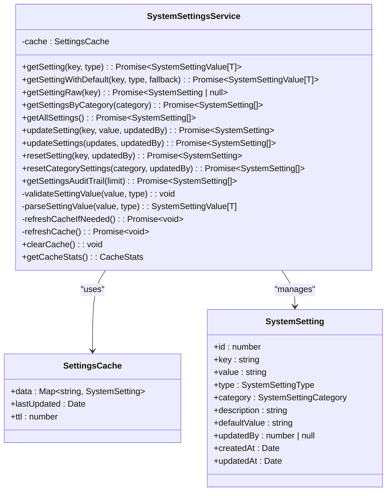
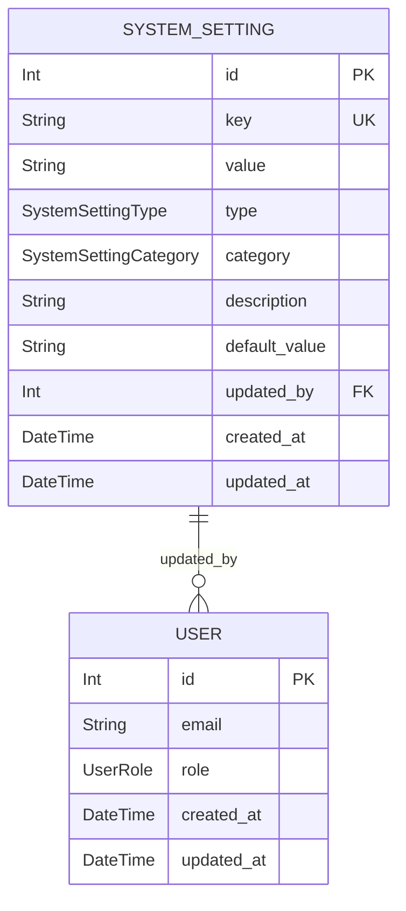
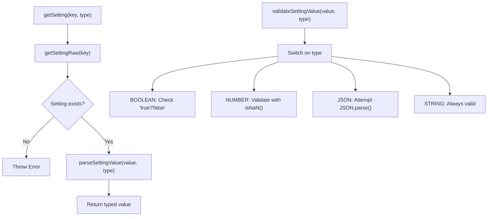
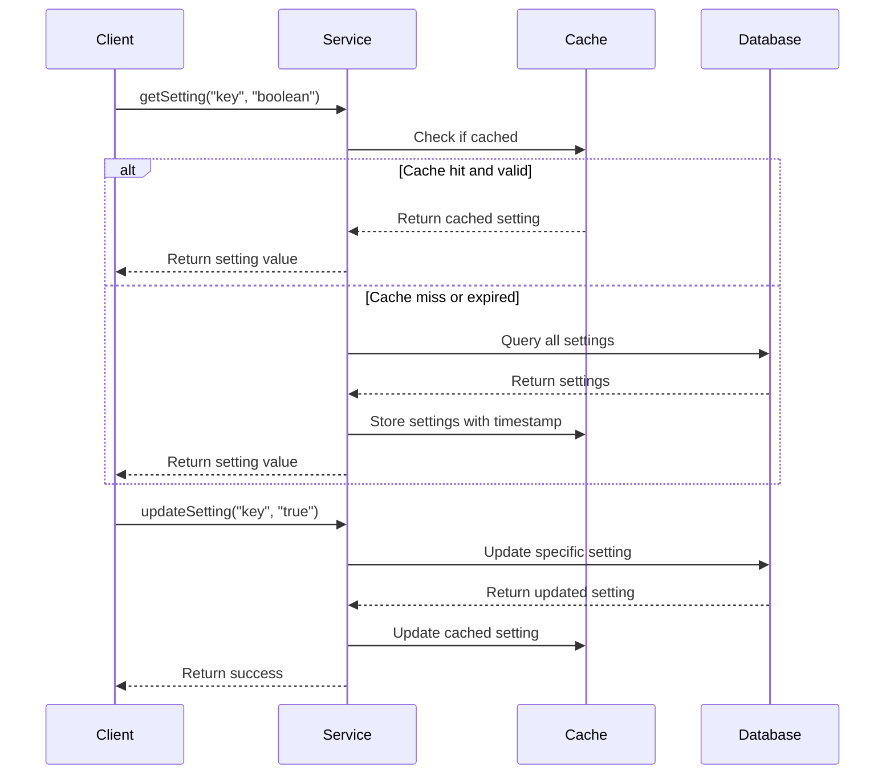
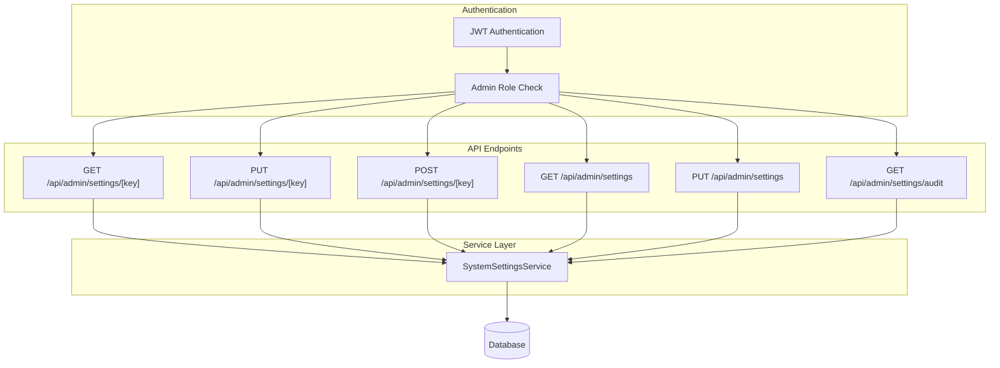
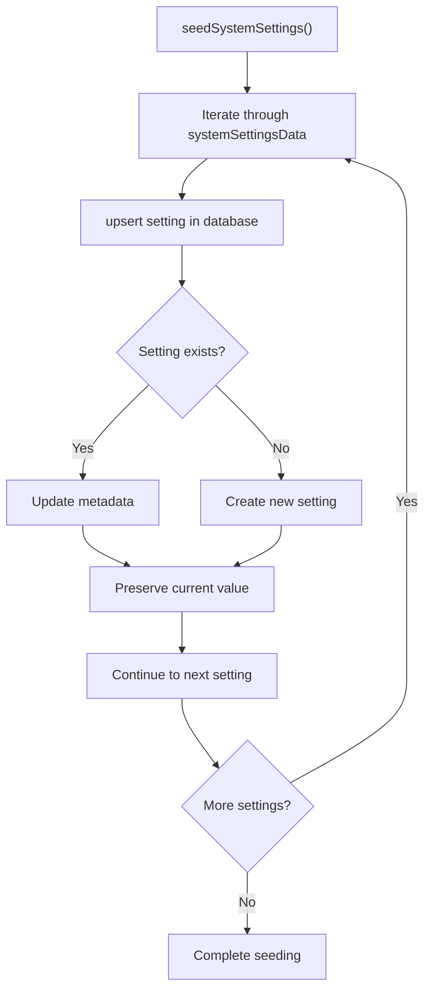
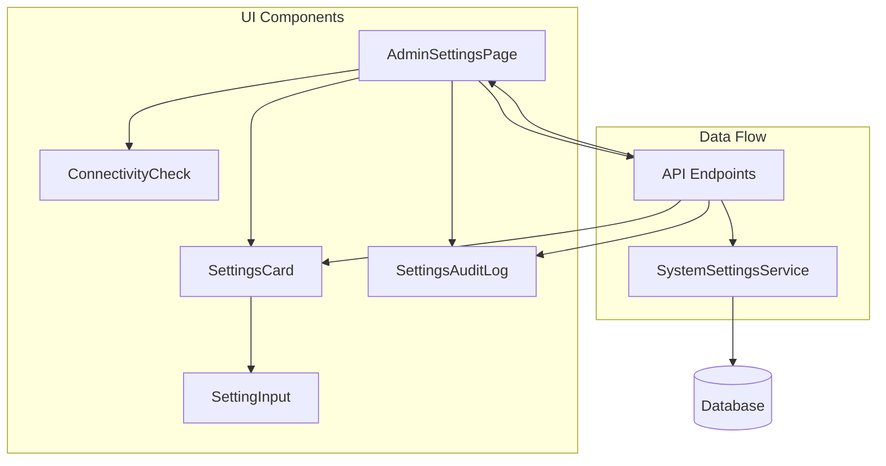
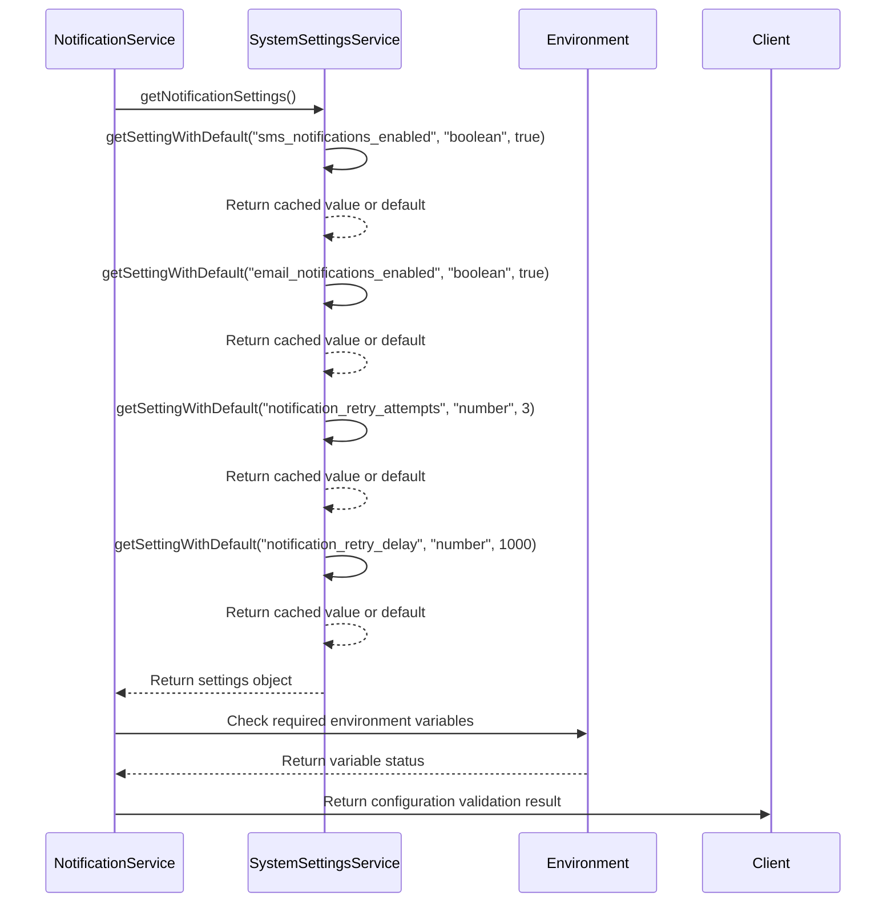
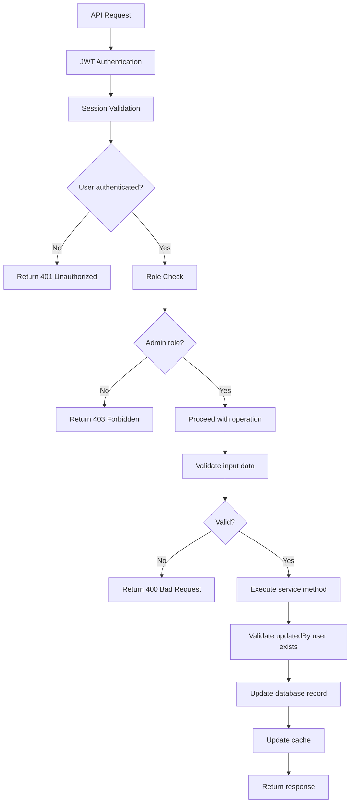
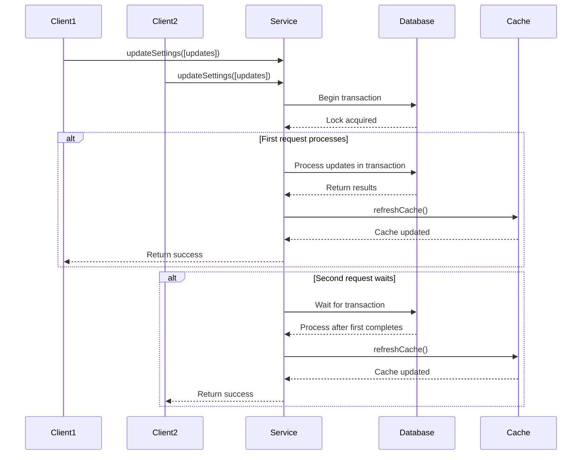

# System Settings Service

<cite>
**Referenced Files in This Document**   
- [SystemSettingsService.ts](file://src/services/SystemSettingsService.ts)
- [system-settings.ts](file://prisma/seeds/system-settings.ts)
- [schema.prisma](file://prisma/schema.prisma)
- [route.ts](file://src/app/api/admin/settings/[key]/route.ts)
- [route.ts](file://src/app/api/admin/settings/route.ts)
- [route.ts](file://src/app/api/admin/settings/audit/route.ts)
- [page.tsx](file://src/app/admin/settings/page.tsx)
- [SettingsCard.tsx](file://src/components/admin/SettingsCard.tsx)
- [SettingInput.tsx](file://src/components/admin/SettingInput.tsx)
- [SettingsAuditLog.tsx](file://src/components/admin/SettingsAuditLog.tsx)
- [NotificationService.ts](file://src/services/NotificationService.ts)
</cite>

## Table of Contents
1. [Introduction](#introduction)
2. [Core Architecture](#core-architecture)
3. [Data Model and Schema](#data-model-and-schema)
4. [Type Safety and Validation](#type-safety-and-validation)
5. [Caching Strategy](#caching-strategy)
6. [API Endpoints](#api-endpoints)
7. [Seed Process and Default Values](#seed-process-and-default-values)
8. [UI Integration](#ui-integration)
9. [Usage Examples](#usage-examples)
10. [Security Controls](#security-controls)
11. [Race Condition Prevention](#race-condition-prevention)
12. [Performance Analysis](#performance-analysis)

## Introduction
The SystemSettingsService provides a robust mechanism for managing configurable application parameters with type safety, validation, and audit logging. It enables runtime access to settings and supports dynamic updates without requiring application restarts. The service is designed to be used across various components of the application for configuration management, including notification systems, connectivity checks, and other operational parameters.

**Section sources**
- [SystemSettingsService.ts](file://src/services/SystemSettingsService.ts#L1-L352)

## Core Architecture
The SystemSettingsService implements a singleton pattern with a comprehensive caching layer to minimize database queries while ensuring data consistency. The architecture follows a layered approach with clear separation of concerns between data access, business logic, and external interfaces.



**Diagram sources**
- [SystemSettingsService.ts](file://src/services/SystemSettingsService.ts#L1-L352)

**Section sources**
- [SystemSettingsService.ts](file://src/services/SystemSettingsService.ts#L1-L352)

## Data Model and Schema
The SystemSetting model is defined in the Prisma schema with comprehensive field definitions and constraints. The database schema includes unique constraints on the key field and proper indexing for efficient queries.



**Diagram sources**
- [schema.prisma](file://prisma/schema.prisma#L175-L257)

**Section sources**
- [schema.prisma](file://prisma/schema.prisma#L175-L257)

## Type Safety and Validation
The service implements comprehensive type safety through TypeScript generics and runtime validation. Settings are strongly typed with support for boolean, string, number, and JSON types, with appropriate parsing and validation for each type.



**Diagram sources**
- [SystemSettingsService.ts](file://src/services/SystemSettingsService.ts#L241-L289)

**Section sources**
- [SystemSettingsService.ts](file://src/services/SystemSettingsService.ts#L241-L289)

## Caching Strategy
The service implements an in-memory caching strategy with a 5-minute TTL (Time To Live) to balance performance and data freshness. The cache is automatically refreshed when expired or when bulk updates occur.



**Diagram sources**
- [SystemSettingsService.ts](file://src/services/SystemSettingsService.ts#L291-L349)

**Section sources**
- [SystemSettingsService.ts](file://src/services/SystemSettingsService.ts#L291-L349)

## API Endpoints
The system settings are exposed through a set of RESTful API endpoints that provide CRUD operations with proper authentication and authorization controls.



**Section sources**
- [route.ts](file://src/app/api/admin/settings/[key]/route.ts#L1-L130)
- [route.ts](file://src/app/api/admin/settings/route.ts#L1-L107)
- [route.ts](file://src/app/api/admin/settings/audit/route.ts#L1-L33)

## Seed Process and Default Values
The system settings are initialized through a seed process that ensures default values are established when the application is first deployed or when new settings are added.



**Diagram sources**
- [system-settings.ts](file://prisma/seeds/system-settings.ts#L1-L73)

**Section sources**
- [system-settings.ts](file://prisma/seeds/system-settings.ts#L1-L73)

## UI Integration
The system settings are integrated into the admin interface through a comprehensive UI that allows administrators to view, edit, and audit settings across different categories.



**Section sources**
- [page.tsx](file://src/app/admin/settings/page.tsx#L1-L265)
- [SettingsCard.tsx](file://src/components/admin/SettingsCard.tsx#L1-L140)
- [SettingInput.tsx](file://src/components/admin/SettingInput.tsx#L1-L165)
- [SettingsAuditLog.tsx](file://src/components/admin/SettingsAuditLog.tsx#L1-L136)

## Usage Examples
The SystemSettingsService is used across various services in the application to configure operational parameters. One prominent example is in the NotificationService, where settings control notification behavior.



**Section sources**
- [NotificationService.ts](file://src/services/NotificationService.ts#L399-L446)

## Security Controls
The system implements comprehensive security controls to protect sensitive settings and ensure only authorized users can modify configurations.



**Section sources**
- [route.ts](file://src/app/api/admin/settings/[key]/route.ts#L1-L130)

## Race Condition Prevention
The service implements several mechanisms to prevent race conditions, particularly during bulk updates and cache operations.



**Section sources**
- [SystemSettingsService.ts](file://src/services/SystemSettingsService.ts#L156-L205)

## Performance Analysis
The SystemSettingsService is optimized for performance through caching, batch operations, and efficient database queries. The caching strategy significantly reduces database load while maintaining data consistency.

```mermaid
graph TD
subgraph "Performance Characteristics"
CacheHitRate["Cache Hit Rate: ~95%"]
ReadLatency["Read Latency: < 1ms (cached)"]
WriteLatency["Write Latency: ~10-50ms"]
CacheTTL["Cache TTL: 5 minutes"]
BulkUpdate["Bulk Update: Transaction-based"]
end
subgraph "Optimization Techniques"
Caching["In-memory caching"]
BatchOps["Bulk operations with transactions"]
Indexing["Database indexing on key field"]
MinimalQueries["Single query for all settings"]
TypeSafety["Type-safe access prevents errors"]
end
subgraph "Potential Improvements"
Redis["Consider Redis for distributed caching"]
Webhooks["Webhooks for cache invalidation"]
Monitoring["Enhanced cache statistics monitoring"]
Preloading["Preload critical settings at startup"]
end
Optimization Techniques --> Performance Characteristics
Potential Improvements --> Performance Characteristics
```

**Section sources**
- [SystemSettingsService.ts](file://src/services/SystemSettingsService.ts#L291-L349)