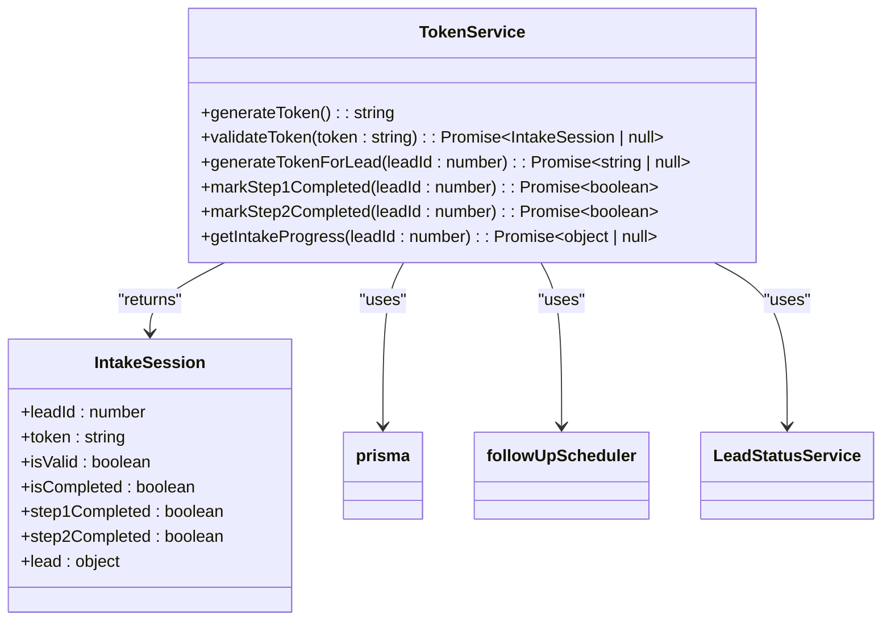
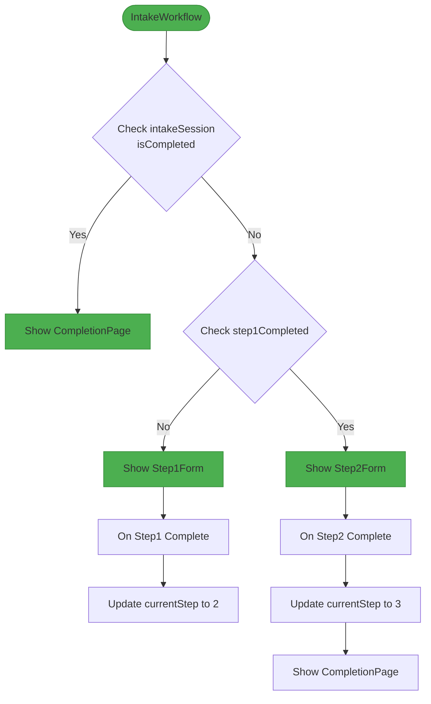
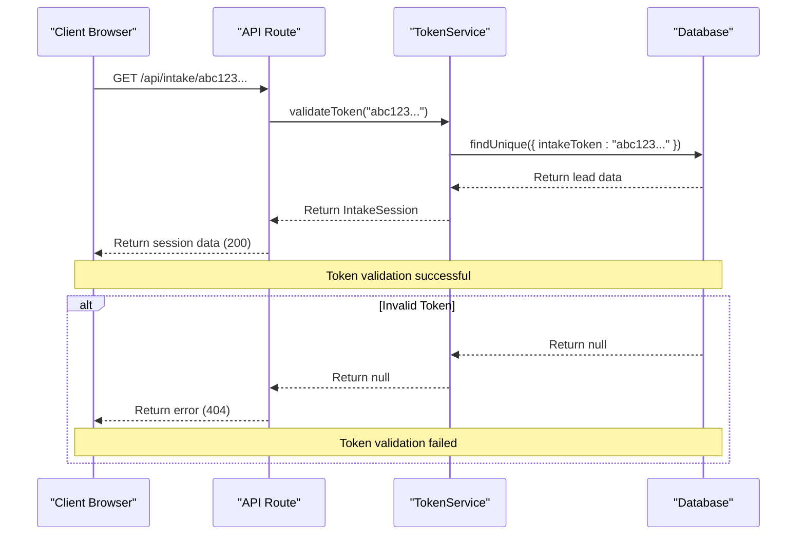
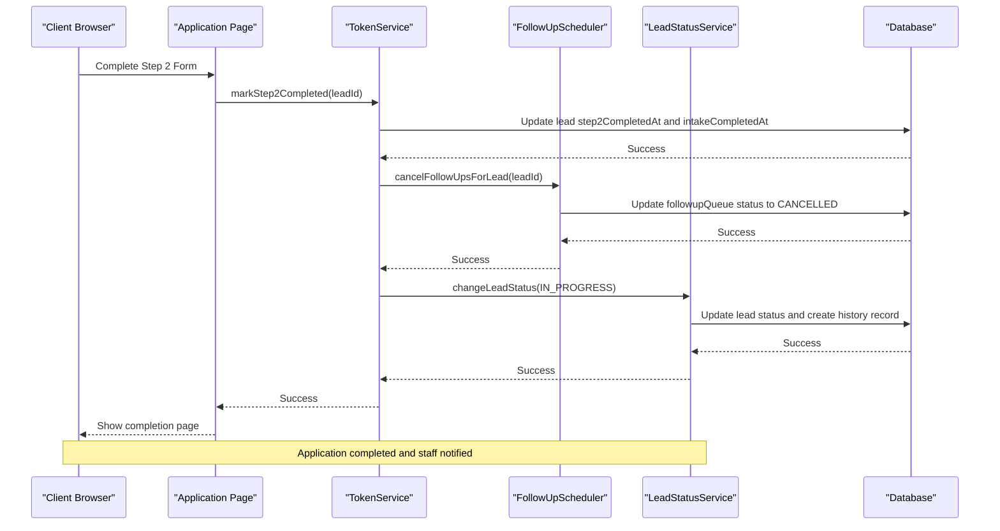

# Token Service

<cite>
**Referenced Files in This Document**   
- [TokenService.ts](file://src/services/TokenService.ts#L1-L313)
- [intake/[token]/route.ts](file://src/app/api/intake/[token]/route.ts#L1-L38)
- [application/[token]/page.tsx](file://src/app/application/[token]/page.tsx#L1-L222)
- [IntakeWorkflow.tsx](file://src/components/intake/IntakeWorkflow.tsx#L1-L96)
- [schema.prisma](file://prisma/schema.prisma#L1-L258)
- [FollowUpScheduler.ts](file://src/services/FollowUpScheduler.ts#L1-L489)
- [LeadStatusService.ts](file://src/services/LeadStatusService.ts#L1-L452)
</cite>

## Table of Contents
1. [Introduction](#introduction)
2. [Token Generation and Cryptographic Methods](#token-generation-and-cryptographic-methods)
3. [Token Validation and Authentication Flow](#token-validation-and-authentication-flow)
4. [Token Lifecycle and Expiration Policies](#token-lifecycle-and-expiration-policies)
5. [Revocation Mechanisms and Security Protections](#revocation-mechanisms-and-security-protections)
6. [Integration with Authentication System](#integration-with-authentication-system)
7. [Security Best Practices and Entropy Sources](#security-best-practices-and-entropy-sources)
8. [Architecture Overview](#architecture-overview)
9. [Detailed Component Analysis](#detailed-component-analysis)
10. [Sequence Diagrams](#sequence-diagrams)
11. [Troubleshooting Guide](#troubleshooting-guide)

## Introduction
The Token Service is a critical component of the merchant funding application system, responsible for managing secure token-based authentication for unauthenticated users during the multi-step intake process. This service enables prospective business owners to complete their funding applications without requiring traditional login credentials, while maintaining enterprise-grade security standards. The token system facilitates a seamless user experience by allowing applicants to resume their application from any device using a unique token link, while ensuring data integrity and protection against unauthorized access.

The Token Service operates as a stateless authentication mechanism that generates cryptographically secure tokens, validates their authenticity, and tracks application progress through the intake workflow. It integrates with the lead management system to maintain application state and coordinates with follow-up automation and status management services to ensure proper business process flow. This documentation provides a comprehensive analysis of the token service's architecture, implementation, security features, and integration points within the overall system.

**Section sources**
- [TokenService.ts](file://src/services/TokenService.ts#L1-L313)

## Token Generation and Cryptographic Methods
The Token Service employs industry-standard cryptographic practices to generate secure, unpredictable tokens for the intake workflow. The service uses Node.js's built-in `crypto` module, which provides access to the operating system's cryptographically strong pseudo-random data generator.

```typescript
static generateToken(): string {
  return crypto.randomBytes(32).toString('hex');
}
```

The token generation process creates a 32-byte (256-bit) random value using `crypto.randomBytes()`, which is then converted to a 64-character hexadecimal string. This approach provides 256 bits of entropy, making brute force attacks computationally infeasible. The use of the operating system's cryptographically secure random number generator ensures that the tokens cannot be predicted or reproduced, even if an attacker has partial knowledge of previously generated tokens.

The generated token is stored in the database as a unique constraint on the `intakeToken` field in the Lead model, preventing duplicate tokens and ensuring each application link is globally unique. The token serves as the primary key for accessing the intake workflow, with no additional secret components required for validation.

**Section sources**
- [TokenService.ts](file://src/services/TokenService.ts#L43-L47)

## Token Validation and Authentication Flow
The token validation process authenticates unauthenticated users during the multi-step application flow by verifying the token's existence and retrieving the associated lead data. The validation workflow follows a secure pattern that prevents information leakage about invalid tokens.

```typescript
static async validateToken(token: string): Promise<IntakeSession | null> {
  try {
    const lead = await prisma.lead.findUnique({
      where: { intakeToken: token },
      select: {
        id: true,
        // Contact Information
        email: true,
        phone: true,
        firstName: true,
        lastName: true,
        // ... other fields
        status: true,
        intakeToken: true,
        intakeCompletedAt: true,
        step1CompletedAt: true,
        step2CompletedAt: true,
      },
    });

    if (!lead || !lead.intakeToken) {
      return null;
    }

    // Construct and return IntakeSession object
    // ...
  } catch (error) {
    console.error('Error validating token:', error);
    return null;
  }
}
```

The validation process queries the database for a lead with a matching `intakeToken` value. If no matching record is found, or if the token field is null, the function returns `null` without distinguishing between these cases, preventing enumeration attacks. Upon successful validation, the service returns an `IntakeSession` object containing the lead's information and progress state, which is used to render the appropriate step in the application workflow.

The API endpoint `/api/intake/[token]` exposes this validation functionality through a GET request, returning the intake session data to the client application when the token is valid, or a 404 error when the token is invalid or expired.

**Section sources**
- [TokenService.ts](file://src/services/TokenService.ts#L49-L199)
- [intake/[token]/route.ts](file://src/app/api/intake/[token]/route.ts#L1-L38)

## Token Lifecycle and Expiration Policies
The Token Service implements a state-based lifecycle management system rather than time-based expiration. Tokens remain valid indefinitely until the associated application is completed or the lead status changes in a way that invalidates the intake process.

Tokens are generated and assigned to leads when they transition to the PENDING status, typically when a new lead is imported into the system:

```typescript
static async generateTokenForLead(leadId: number): Promise<string | null> {
  try {
    const token = this.generateToken();

    await prisma.lead.update({
      where: { id: leadId },
      data: {
        intakeToken: token,
        status: 'PENDING' // Set status to pending when token is generated
      },
    });

    return token;
  } catch (error) {
    console.error('Error generating token for lead:', error);
    return null;
  }
}
```

The lifecycle is tracked through timestamp fields in the Lead model:
- `step1CompletedAt`: Records when the first step of the application is completed
- `step2CompletedAt`: Records when the second step of the application is completed
- `intakeCompletedAt`: Records when the entire intake process is completed

Once `intakeCompletedAt` is set (when step 2 is completed), the token remains valid but the application workflow displays a completion message rather than allowing further edits. This approach allows applicants to access their completed application for reference while preventing modification of submitted information.

**Section sources**
- [TokenService.ts](file://src/services/TokenService.ts#L164-L218)
- [schema.prisma](file://prisma/schema.prisma#L1-L258)

## Revocation Mechanisms and Security Protections
The Token Service implements several security mechanisms to protect against unauthorized access and abuse, including protection against replay attacks and automated follow-up cancellation upon completion.

When a user completes the second step of the application, the system automatically cancels any pending follow-up communications:

```typescript
// Cancel any pending follow-ups since intake is now completed
try {
  await followUpScheduler.cancelFollowUpsForLead(leadId);
} catch (error) {
  console.error(`Failed to cancel follow-ups for completed lead ${leadId}:`, error);
  // Don't fail the step completion if follow-up cancellation fails
}
```

This prevents automated reminder messages from being sent to applicants who have already completed their application. The system also updates the lead status to IN_PROGRESS when intake is completed, alerting staff that the application is ready for review:

```typescript
const leadStatusService = new LeadStatusService();
const statusChangeResult = await leadStatusService.changeLeadStatus({
  leadId,
  newStatus: 'IN_PROGRESS',
  changedBy: systemUser.id,
  reason: 'Intake completed - documents uploaded and ready for review'
});
```

The service protects against replay attacks by using cryptographically secure random tokens that are effectively impossible to guess. Since each token is unique and tied to a specific lead record, replaying a captured token provides no advantage to an attacker. The system does not implement rate limiting on token validation at the service level, relying instead on application-level middleware and infrastructure protections.

**Section sources**
- [TokenService.ts](file://src/services/TokenService.ts#L219-L312)
- [FollowUpScheduler.ts](file://src/services/FollowUpScheduler.ts#L1-L489)
- [LeadStatusService.ts](file://src/services/LeadStatusService.ts#L1-L452)

## Integration with Authentication System
The Token Service integrates with the application's authentication system through middleware that allows unauthenticated access to the intake workflow while protecting other application routes:

```typescript
callbacks: {
  authorized: ({ token, req }) => {
    const { pathname } = req.nextUrl
    
    // Allow access to intake pages without authentication
    if (pathname.startsWith("/application/")) {
      return true
    }
    
    // Allow access to auth pages
    if (pathname.startsWith("/auth/")) {
      return true
    }

    // Allow health check endpoint
    if (pathname === "/api/health") {
      return true
    }
  }
}
```

This configuration allows users to access the application workflow at `/application/[token]` without requiring authentication, while protecting dashboard and API routes. The application page uses server-side rendering to validate the token before rendering the intake workflow:

```typescript
export default async function IntakePage({ params }: IntakePageProps) {
  const { token } = params;

  // Validate token and get intake session data
  const intakeSession = await TokenService.validateToken(token);

  if (!intakeSession) {
    notFound();
  }

  return (
    <div className="min-h-screen bg-[#f8fafc]">
      <div className="container mx-auto px-4 py-8">
        <div className="max-w-4xl mx-auto">
          <IntakeWorkflow intakeSession={intakeSession} />
        </div>
      </div>
    </div>
  );
}
```

The `IntakeWorkflow` component uses the validated session data to determine the current step in the application process and render the appropriate form components, creating a seamless multi-step experience.

**Section sources**
- [middleware.ts](file://src/middleware.ts#L128-L162)
- [application/[token]/page.tsx](file://src/app/application/[token]/page.tsx#L1-L222)
- [IntakeWorkflow.tsx](file://src/components/intake/IntakeWorkflow.tsx#L1-L96)

## Security Best Practices and Entropy Sources
The Token Service adheres to multiple security best practices to ensure the integrity and confidentiality of the intake process:

1. **Cryptographic Security**: Uses `crypto.randomBytes(32)` from Node.js's crypto module, which leverages the operating system's cryptographically secure random number generator (CSNG). On Unix-like systems, this typically uses `/dev/urandom`, while on Windows it uses `CrypGenRandom` or `BCryptGenRandom`.

2. **Token Storage**: Tokens are stored in the database with a unique constraint to prevent collisions, but the system does not store any additional secret information or hashes that could be compromised.

3. **Error Handling**: The service returns generic error messages and uses the same response (null) for both invalid tokens and system errors, preventing information leakage.

4. **Input Validation**: While not explicitly shown in the code, the API layer validates that a token parameter is provided before calling the validation service.

5. **Secure Transmission**: The application UI displays security indicators (SSL, encryption) to reassure users that their data is protected during transmission.

6. **Audit Logging**: Status changes are logged through the LeadStatusService, creating an audit trail of when applications are completed and reviewed.

The entropy source for token generation is the operating system's cryptographically secure random number generator, which typically combines multiple sources of entropy including:
- Hardware random number generators (if available)
- System timing jitter
- Interrupt timing
- Other environmental noise sources

This ensures that the generated tokens have sufficient entropy to resist brute force and prediction attacks, even under sustained assault.

**Section sources**
- [TokenService.ts](file://src/services/TokenService.ts#L1-L313)

## Architecture Overview
The Token Service is a core component of the merchant funding application system, providing secure, stateless authentication for the intake workflow. It operates as a utility service that generates and validates tokens, manages application state, and integrates with other system components to coordinate the application process.

```mermaid
graph TB
subgraph "Frontend"
A[Application Page] --> B[IntakeWorkflow]
B --> C[Step1Form]
B --> D[Step2Form]
B --> E[CompletionPage]
end
subgraph "API Layer"
F[/api/intake/[token]\] --> G[TokenService]
end
subgraph "Backend Services"
G[TokenService] --> H[Prisma ORM]
G --> I[FollowUpScheduler]
G --> J[LeadStatusService]
end
subgraph "Data Layer"
H --> K[(PostgreSQL Database)]
end
A --> F
K --> G
style G fill:#4CAF50,stroke:#388E3C
style F fill:#2196F3,stroke:#1976D2
style K fill:#FF9800,stroke:#F57C00
```

**Diagram sources**
- [TokenService.ts](file://src/services/TokenService.ts#L1-L313)
- [application/[token]/page.tsx](file://src/app/application/[token]/page.tsx#L1-L222)
- [intake/[token]/route.ts](file://src/app/api/intake/[token]/route.ts#L1-L38)

## Detailed Component Analysis
### TokenService Class Analysis
The TokenService class is implemented as a static utility class with methods for token generation, validation, and intake progress management. This design choice eliminates the need for instantiation and allows easy import and use throughout the application.



**Diagram sources**
- [TokenService.ts](file://src/services/TokenService.ts#L1-L313)

### Intake Workflow Component Analysis
The intake workflow is managed by the IntakeWorkflow component, which uses the validated token session to determine the current state of the application and render the appropriate UI.



**Diagram sources**
- [IntakeWorkflow.tsx](file://src/components/intake/IntakeWorkflow.tsx#L1-L96)

## Sequence Diagrams
### Token Validation Sequence
The token validation process follows a secure sequence that authenticates unauthenticated users and retrieves their application state:



**Diagram sources**
- [intake/[token]/route.ts](file://src/app/api/intake/[token]/route.ts#L1-L38)
- [TokenService.ts](file://src/services/TokenService.ts#L49-L199)

### Application Completion Sequence
When a user completes the application, multiple system components coordinate to update the application state and notify staff:



**Diagram sources**
- [TokenService.ts](file://src/services/TokenService.ts#L219-L312)
- [FollowUpScheduler.ts](file://src/services/FollowUpScheduler.ts#L1-L489)
- [LeadStatusService.ts](file://src/services/LeadStatusService.ts#L1-L452)

## Troubleshooting Guide
This section addresses common issues and error conditions related to the Token Service and provides guidance for diagnosis and resolution.

**Token Validation Returns 404 Error**
- **Cause**: The token does not exist in the database or has been invalidated
- **Diagnosis**: Check if the token exists in the leads table with `SELECT id, intake_token FROM leads WHERE intake_token = 'your_token_here';`
- **Resolution**: Ensure the lead exists and has a valid intake_token value

**Application Shows Wrong Step**
- **Cause**: The intake progress tracking fields (step1CompletedAt, step2CompletedAt) are not properly synchronized
- **Diagnosis**: Verify the timestamp fields in the database match the expected application state
- **Resolution**: Manually update the timestamp fields or use the appropriate TokenService methods to mark steps as completed

**Follow-up Messages Continue After Completion**
- **Cause**: The follow-up cancellation process failed
- **Diagnosis**: Check the followup_queue table for pending follow-ups for the lead
- **Resolution**: Manually cancel follow-ups or investigate errors in the FollowUpScheduler service

**Token Generation Fails**
- **Cause**: Database update failure when assigning token to lead
- **Diagnosis**: Check application logs for database error messages
- **Resolution**: Verify database connectivity and permissions, check for constraint violations

**Performance Issues with Token Validation**
- **Cause**: Missing database index on intake_token field
- **Diagnosis**: Check database query performance and execution plans
- **Resolution**: Ensure an index exists on the intake_token column

**Section sources**
- [TokenService.ts](file://src/services/TokenService.ts#L1-L313)
- [FollowUpScheduler.ts](file://src/services/FollowUpScheduler.ts#L1-L489)
- [schema.prisma](file://prisma/schema.prisma#L1-L258)