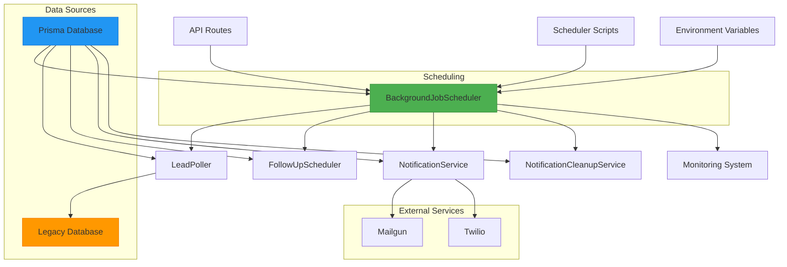
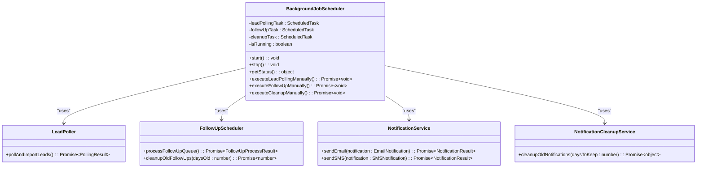
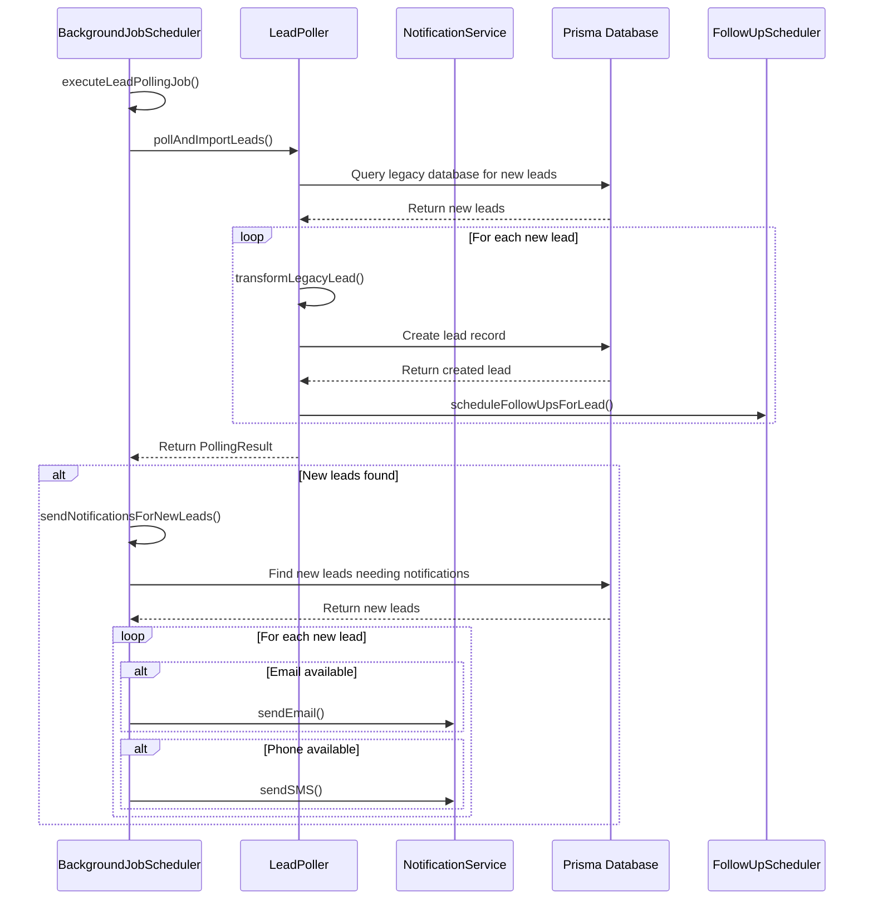
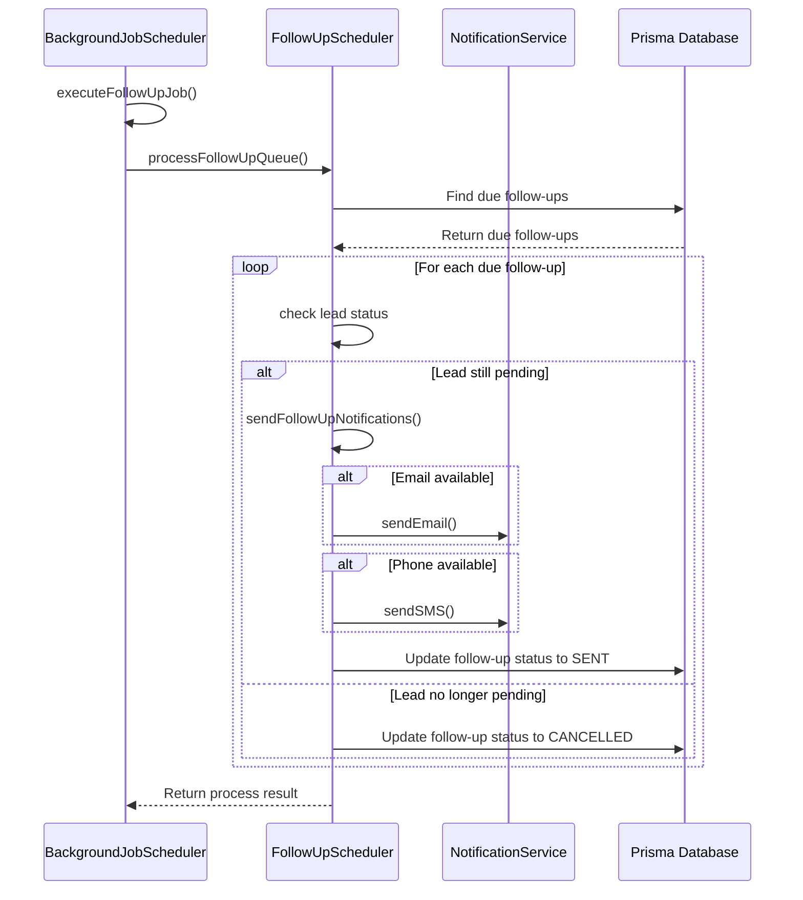
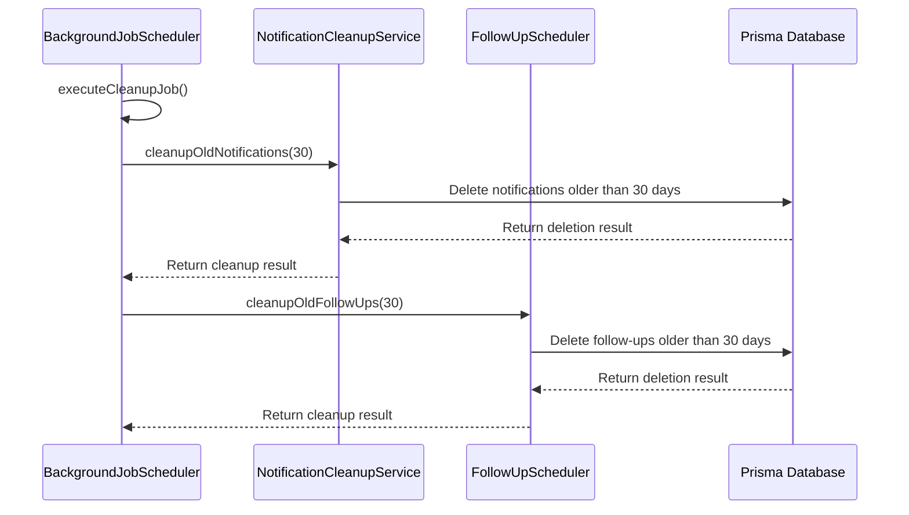
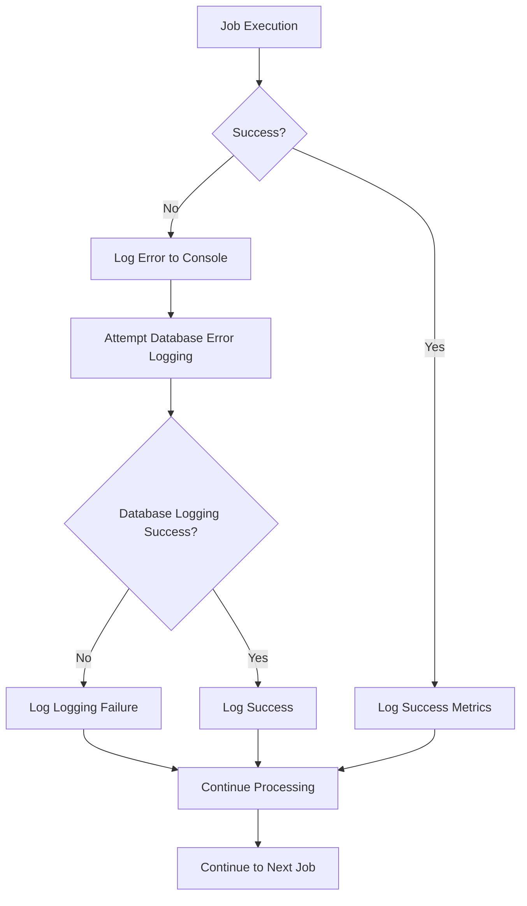
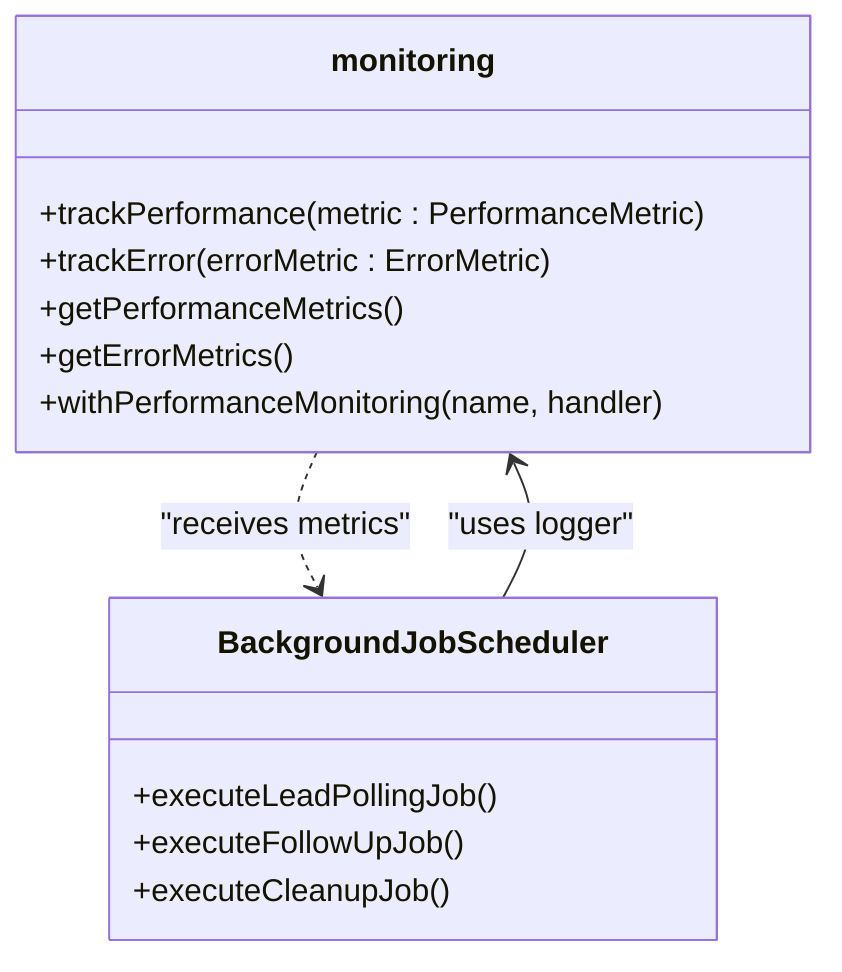
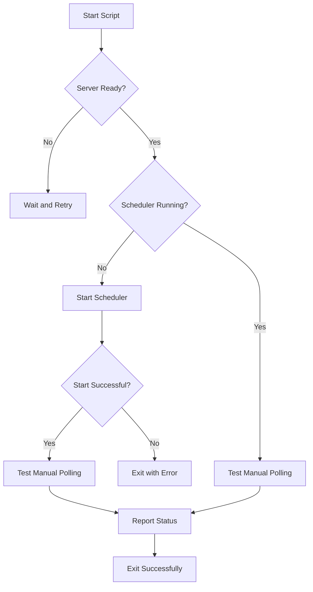

# Background Job Coordination

<cite>
**Referenced Files in This Document**   
- [BackgroundJobScheduler.ts](file://src/services/BackgroundJobScheduler.ts)
- [monitoring.ts](file://src/lib/monitoring.ts)
- [LeadPoller.ts](file://src/services/LeadPoller.ts)
- [FollowUpScheduler.ts](file://src/services/FollowUpScheduler.ts)
- [NotificationService.ts](file://src/services/NotificationService.ts)
- [NotificationCleanupService.ts](file://src/services/NotificationCleanupService.ts)
- [poll-leads/route.ts](file://src/app/api/cron/poll-leads/route.ts)
- [send-followups/route.ts](file://src/app/api/cron/send-followups/route.ts)
- [start-scheduler.mjs](file://scripts/start-scheduler.mjs)
- [ensure-scheduler-running.sh](file://scripts/ensure-scheduler-running.sh)
- [scheduler-status/route.ts](file://src/app/api/admin/background-jobs/status/route.ts)
</cite>

## Table of Contents
1. [Introduction](#introduction)
2. [Core Components](#core-components)
3. [Architecture Overview](#architecture-overview)
4. [Detailed Component Analysis](#detailed-component-analysis)
5. [Job Execution Flow](#job-execution-flow)
6. [Error Handling and Monitoring](#error-handling-and-monitoring)
7. [Production Deployment Strategy](#production-deployment-strategy)
8. [Configuration and Tuning](#configuration-and-tuning)
9. [Troubleshooting Guide](#troubleshooting-guide)

## Introduction
The BackgroundJobScheduler class serves as the central coordinator for all scheduled background tasks in the merchant funding application system. It manages the execution of periodic jobs including lead polling, follow-up processing, and notification cleanup. Implemented as a singleton pattern, it ensures only one instance runs at a time, preventing duplicate job executions in production environments. The scheduler integrates with Next.js API routes for external triggering and monitoring, while leveraging a comprehensive monitoring system for metrics collection and error reporting. This documentation provides a detailed analysis of its architecture, functionality, and integration points.

## Core Components
The BackgroundJobScheduler orchestrates several key services to perform its duties:
- **LeadPoller**: Responsible for importing new leads from the legacy database
- **FollowUpScheduler**: Manages the follow-up notification queue for pending applications
- **NotificationService**: Handles email and SMS delivery for new leads and follow-ups
- **NotificationCleanupService**: Maintains database health by removing old notification records
- **Monitoring System**: Provides metrics collection and error tracking capabilities

These components work together under the scheduler's coordination to ensure timely processing of leads and communications with applicants.

**Section sources**
- [BackgroundJobScheduler.ts](file://src/services/BackgroundJobScheduler.ts#L1-L462)

## Architecture Overview



**Diagram sources**
- [BackgroundJobScheduler.ts](file://src/services/BackgroundJobScheduler.ts#L1-L462)
- [LeadPoller.ts](file://src/services/LeadPoller.ts#L1-L521)
- [FollowUpScheduler.ts](file://src/services/FollowUpScheduler.ts#L1-L490)
- [NotificationService.ts](file://src/services/NotificationService.ts#L1-L471)

## Detailed Component Analysis

### BackgroundJobScheduler Implementation

The BackgroundJobScheduler implements the singleton pattern through a single exported instance, ensuring only one scheduler runs in the application. It uses the node-cron library to schedule and manage recurring tasks with configurable cron patterns.



**Diagram sources**
- [BackgroundJobScheduler.ts](file://src/services/BackgroundJobScheduler.ts#L1-L462)
- [LeadPoller.ts](file://src/services/LeadPoller.ts#L1-L521)
- [FollowUpScheduler.ts](file://src/services/FollowUpScheduler.ts#L1-L490)
- [NotificationService.ts](file://src/services/NotificationService.ts#L1-L471)
- [NotificationCleanupService.ts](file://src/services/NotificationCleanupService.ts#L1-L230)

**Section sources**
- [BackgroundJobScheduler.ts](file://src/services/BackgroundJobScheduler.ts#L1-L462)

### Singleton Pattern and Instance Management
The BackgroundJobScheduler implements the singleton pattern by exporting a single instance that can be imported throughout the application:

```typescript
export const backgroundJobScheduler = new BackgroundJobScheduler();
```

This ensures that only one instance of the scheduler exists in the application, preventing multiple instances from scheduling duplicate jobs. The `isRunning` flag and corresponding checks in the `start()` and `stop()` methods provide additional protection against multiple starts.

**Section sources**
- [BackgroundJobScheduler.ts](file://src/services/BackgroundJobScheduler.ts#L1-L462)

### Job Registration Interface
The scheduler registers three primary jobs during startup:

1. **Lead Polling Job**: Runs every 15 minutes (configurable via `LEAD_POLLING_CRON_PATTERN`)
2. **Follow-up Processing Job**: Runs every 5 minutes (configurable via `FOLLOWUP_CRON_PATTERN`)
3. **Notification Cleanup Job**: Runs daily at 2 AM (configurable via `CLEANUP_CRON_PATTERN`)

Each job is registered using node-cron with timezone awareness (defaulting to America/New_York) and configured with `scheduled: false` initially, allowing the scheduler to control when jobs start.

**Section sources**
- [BackgroundJobScheduler.ts](file://src/services/BackgroundJobScheduler.ts#L25-L100)

## Job Execution Flow

### Lead Polling Job Flow



**Diagram sources**
- [BackgroundJobScheduler.ts](file://src/services/BackgroundJobScheduler.ts#L102-L188)
- [LeadPoller.ts](file://src/services/LeadPoller.ts#L1-L521)
- [NotificationService.ts](file://src/services/NotificationService.ts#L1-L471)

**Section sources**
- [BackgroundJobScheduler.ts](file://src/services/BackgroundJobScheduler.ts#L102-L188)

### Follow-up Processing Job Flow



**Diagram sources**
- [BackgroundJobScheduler.ts](file://src/services/BackgroundJobScheduler.ts#L280-L302)
- [FollowUpScheduler.ts](file://src/services/FollowUpScheduler.ts#L1-L490)
- [NotificationService.ts](file://src/services/NotificationService.ts#L1-L471)

**Section sources**
- [BackgroundJobScheduler.ts](file://src/services/BackgroundJobScheduler.ts#L280-L302)

### Cleanup Job Flow



**Diagram sources**
- [BackgroundJobScheduler.ts](file://src/services/BackgroundJobScheduler.ts#L370-L404)
- [NotificationCleanupService.ts](file://src/services/NotificationCleanupService.ts#L1-L230)
- [FollowUpScheduler.ts](file://src/services/FollowUpScheduler.ts#L1-L490)

**Section sources**
- [BackgroundJobScheduler.ts](file://src/services/BackgroundJobScheduler.ts#L370-L404)

## Error Handling and Monitoring

### Error Boundary Implementation
The BackgroundJobScheduler implements comprehensive error handling with multiple layers of protection:



Each job execution is wrapped in try-catch blocks that:
1. Log errors to the console using the application logger
2. Attempt to create a database record in the notificationLog table for monitoring
3. Handle potential failures in the error logging process itself

**Section sources**
- [BackgroundJobScheduler.ts](file://src/services/BackgroundJobScheduler.ts#L110-L188)

### Monitoring Integration
The scheduler leverages the monitoring library for metrics collection and error reporting. While the system previously used Sentry, it now relies on local logging with the monitoring.ts module providing performance tracking and error metrics.



The monitoring system tracks:
- Performance metrics for each job execution
- Error occurrences and frequencies
- System uptime and memory usage
- API route performance

**Diagram sources**
- [monitoring.ts](file://src/lib/monitoring.ts#L1-L276)
- [BackgroundJobScheduler.ts](file://src/services/BackgroundJobScheduler.ts#L1-L462)

**Section sources**
- [monitoring.ts](file://src/lib/monitoring.ts#L1-L276)

## Production Deployment Strategy

### Next.js API Route Integration
The BackgroundJobScheduler integrates with Next.js API routes through dedicated endpoints that allow external triggering of jobs:

```mermaid
graph TD
A[External Cron Job] --> B[/api/cron/poll-leads POST]
A --> C[/api/cron/send-followups POST]
B --> D[BackgroundJobScheduler]
C --> D
D --> E[Execute Job]
E --> F[Return JSON Response]
F --> B
F --> C
G[Monitoring System] --> H[/api/admin/background-jobs/status]
H --> D
D --> H
H --> G
```

The API routes provide:
- HTTP endpoints for cron job integration
- JSON responses with execution results
- Health check capabilities
- Status monitoring

**Diagram sources**
- [poll-leads/route.ts](file://src/app/api/cron/poll-leads/route.ts#L1-L192)
- [send-followups/route.ts](file://src/app/api/cron/send-followups/route.ts#L1-L103)
- [BackgroundJobScheduler.ts](file://src/services/BackgroundJobScheduler.ts#L1-L462)

**Section sources**
- [poll-leads/route.ts](file://src/app/api/cron/poll-leads/route.ts#L1-L192)
- [send-followups/route.ts](file://src/app/api/cron/send-followups/route.ts#L1-L103)

### Singleton Instance Enforcement
The system ensures only one scheduler instance runs in production through multiple mechanisms:

1. **Singleton Pattern**: Single exported instance prevents multiple instantiations
2. **Status Checks**: `start()` method checks `isRunning` flag before proceeding
3. **Process Scripts**: Dedicated scripts manage scheduler lifecycle
4. **Health Checks**: API endpoints verify scheduler status

The `ensure-scheduler-running.sh` script implements a comprehensive check:
- Waits for the server to be ready
- Checks current scheduler status
- Starts the scheduler if not running
- Tests functionality with manual polling
- Provides detailed status reporting



**Diagram sources**
- [ensure-scheduler-running.sh](file://scripts/ensure-scheduler-running.sh#L1-L92)
- [start-scheduler.mjs](file://scripts/start-scheduler.mjs#L1-L57)
- [BackgroundJobScheduler.ts](file://src/services/BackgroundJobScheduler.ts#L1-L462)

**Section sources**
- [ensure-scheduler-running.sh](file://scripts/ensure-scheduler-running.sh#L1-L92)
- [start-scheduler.mjs](file://scripts/start-scheduler.mjs#L1-L57)

### Heartbeat Monitoring and Graceful Shutdown
The scheduler implements proper lifecycle management with:

- **Heartbeat Monitoring**: Status endpoint provides real-time scheduler state
- **Graceful Shutdown**: Handles SIGINT and SIGTERM signals to stop jobs cleanly
- **Process Termination**: Exits with appropriate status codes

The startup script includes signal handlers for clean shutdown:

```typescript
process.on('SIGINT', () => {
  console.log('\n🛑 Received SIGINT, stopping scheduler...');
  backgroundJobScheduler.stop();
  process.exit(0);
});

process.on('SIGTERM', () => {
  console.log('\n🛑 Received SIGTERM, stopping scheduler...');
  backgroundJobScheduler.stop();
  process.exit(0);
});
```

**Section sources**
- [start-scheduler.mjs](file://scripts/start-scheduler.mjs#L50-L57)
- [BackgroundJobScheduler.ts](file://src/services/BackgroundJobScheduler.ts#L189-L228)

## Configuration and Tuning

### Configuration Options
The BackgroundJobScheduler supports several configuration options through environment variables:

| Environment Variable | Default Value | Description |
|----------------------|-------------|-------------|
| `LEAD_POLLING_CRON_PATTERN` | `*/15 * * * *` | Cron pattern for lead polling frequency |
| `FOLLOWUP_CRON_PATTERN` | `*/5 * * * *` | Cron pattern for follow-up processing frequency |
| `CLEANUP_CRON_PATTERN` | `0 2 * * *` | Cron pattern for notification cleanup |
| `TZ` | `America/New_York` | Timezone for cron scheduling |
| `MERCHANT_FUNDING_CAMPAIGN_IDS` | (required) | Comma-separated list of campaign IDs to poll |
| `LEAD_POLLING_BATCH_SIZE` | `100` | Number of leads to process per batch |

### Concurrency Control and Job Isolation
The scheduler ensures job isolation through:

- **Sequential Execution**: Jobs run independently with their own cron schedules
- **Error Containment**: Failures in one job don't affect others
- **Resource Management**: Each job manages its own database connections and external service calls

The system prevents race conditions by:
- Using database transactions where appropriate
- Implementing rate limiting in the NotificationService
- Processing leads in batches to manage memory usage
- Adding delays between notifications to avoid rate limiting

### Extension Points
The architecture provides several extension points for adding new scheduled tasks:

1. **Add New Job Methods**: Implement private methods for new job types
2. **Register in start()**: Add cron scheduling in the start() method
3. **Create API Endpoint**: Add a new API route for external triggering
4. **Update Status Method**: Include new job in getStatus() response

Example of adding a new job:
```typescript
// 1. Add job method
private async executeNewJob(): Promise<void> {
  // Job implementation
}

// 2. Register in start()
this.newJobTask = cron.schedule(
  process.env.NEW_JOB_PATTERN || "0 * * * *",
  async () => {
    await this.executeNewJob();
  },
  { scheduled: false, timezone: process.env.TZ || "America/New_York" }
);
this.newJobTask.start();
```

**Section sources**
- [BackgroundJobScheduler.ts](file://src/services/BackgroundJobScheduler.ts#L25-L100)

## Troubleshooting Guide

### Common Issues and Solutions

**Issue**: Scheduler not starting in production
- **Check**: Verify environment variables are set
- **Check**: Ensure database connection is available
- **Check**: Validate legacy database credentials
- **Solution**: Run `start-scheduler.mjs` manually to see error output

**Issue**: Duplicate jobs running
- **Check**: Verify only one instance of the application is running
- **Check**: Ensure `ensure-scheduler-running.sh` isn't being called multiple times
- **Solution**: Implement process locking or use a distributed lock

**Issue**: Notifications not being sent
- **Check**: Verify Twilio and Mailgun credentials
- **Check**: Ensure notification settings are enabled in the database
- **Check**: Review rate limiting logs
- **Solution**: Test notification service independently

**Issue**: High memory usage
- **Check**: Monitor batch size for lead polling
- **Check**: Review number of pending follow-ups
- **Solution**: Reduce `LEAD_POLLING_BATCH_SIZE` or optimize queries

### Monitoring and Diagnostics
Use the following endpoints for monitoring:

- `GET /api/admin/background-jobs/status` - Current scheduler status
- `GET /api/cron/send-followups` - Follow-up queue statistics
- `GET /api/health` - Overall system health
- `GET /api/dev/scheduler-status` - Detailed scheduler diagnostics

The system logs detailed information for each job execution, including:
- Processing time
- Records processed
- Errors encountered
- Notification statistics

**Section sources**
- [BackgroundJobScheduler.ts](file://src/services/BackgroundJobScheduler.ts#L304-L330)
- [scheduler-status/route.ts](file://src/app/api/admin/background-jobs/status/route.ts)
- [send-followups/route.ts](file://src/app/api/cron/send-followups/route.ts#L50-L103)