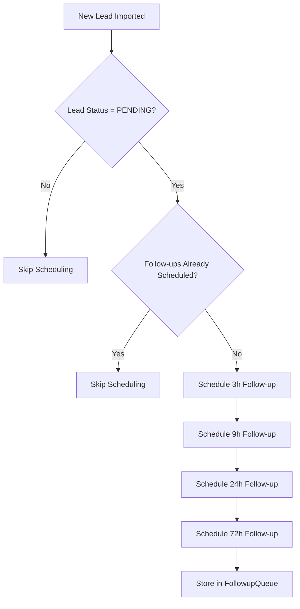
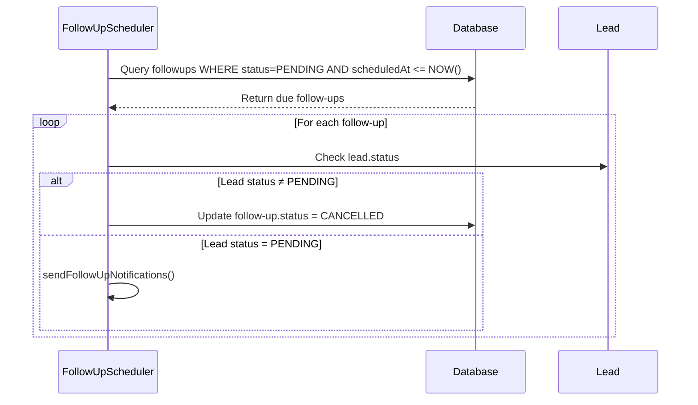
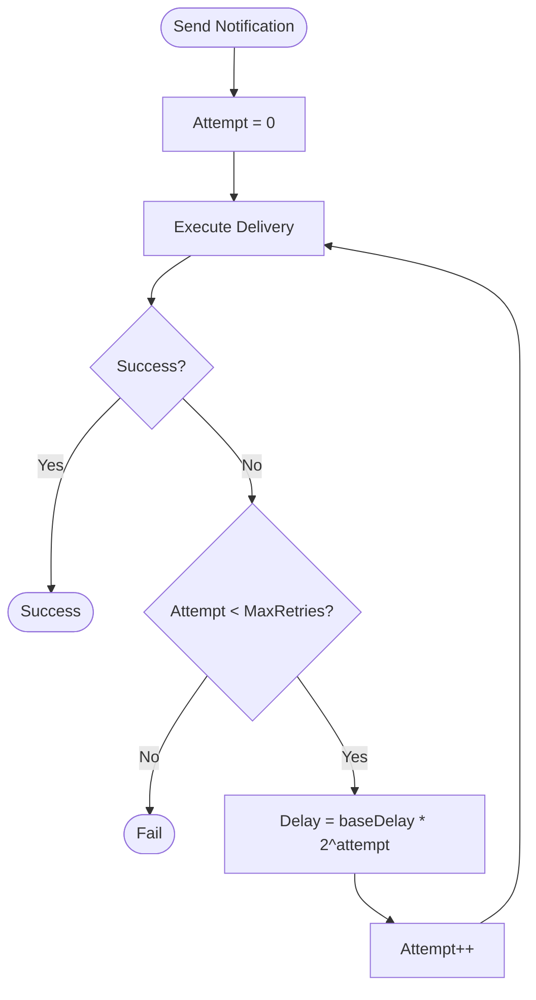
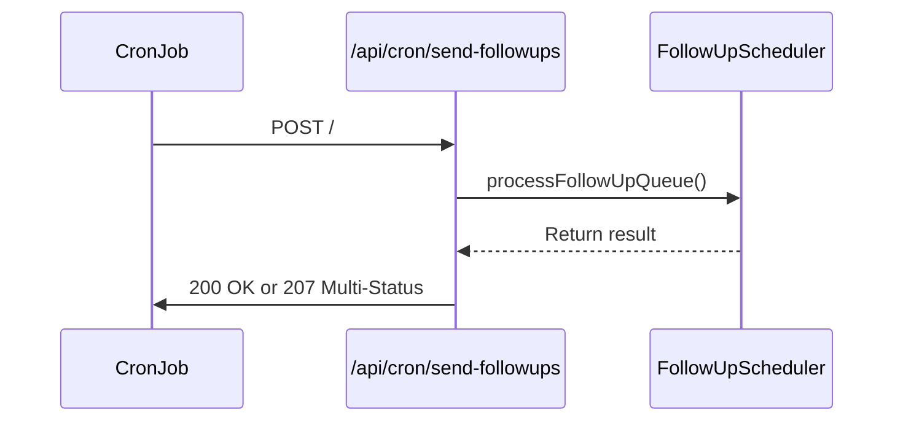
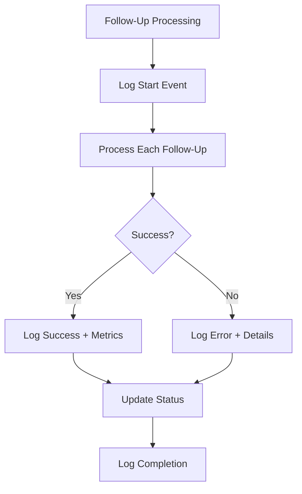
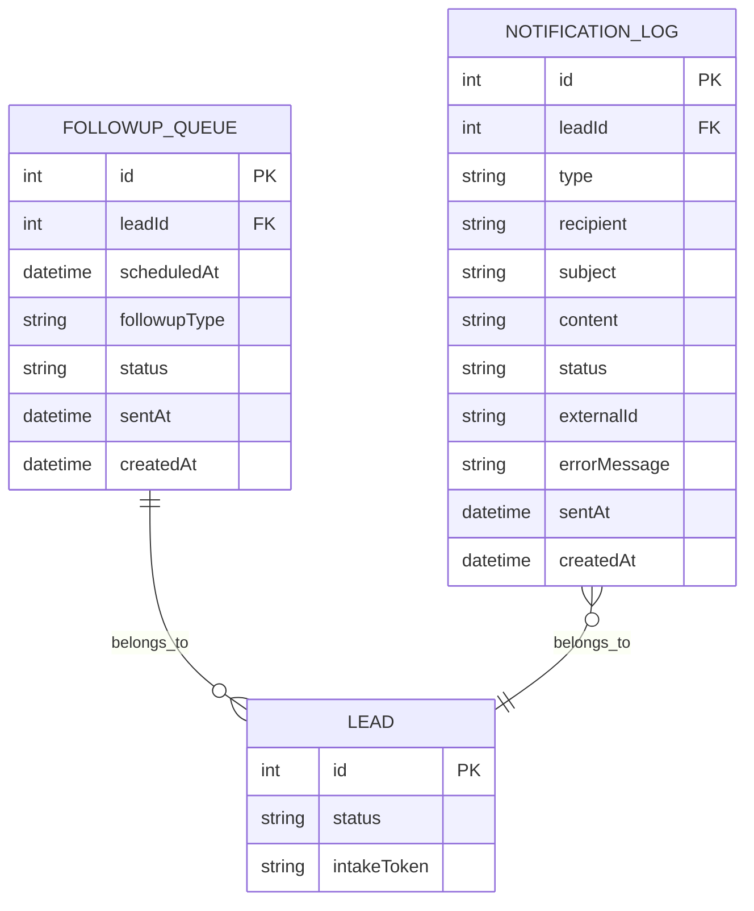

# Follow-Up Scheduling Service

<cite>
**Referenced Files in This Document**   
- [FollowUpScheduler.ts](file://src/services/FollowUpScheduler.ts)
- [NotificationService.ts](file://src/services/NotificationService.ts)
- [send-followups/route.ts](file://src/app/api/cron/send-followups/route.ts)
- [schema.prisma](file://prisma/schema.prisma)
- [logger.ts](file://src/lib/logger.ts)
- [SystemSettingsService.ts](file://src/services/SystemSettingsService.ts)
</cite>

## Table of Contents
1. [Introduction](#introduction)
2. [Core Components](#core-components)
3. [Follow-Up Scheduling Algorithm](#follow-up-scheduling-algorithm)
4. [Time-Based Filtering and Processing Logic](#time-based-filtering-and-processing-logic)
5. [Notification Delivery and Retry Mechanism](#notification-delivery-and-retry-mechanism)
6. [Endpoint and Workflow Execution](#endpoint-and-workflow-execution)
7. [Idempotency, Error Recovery, and Queue Management](#idempotency-error-recovery-and-queue-management)
8. [Monitoring, Logging, and Debugging](#monitoring-logging-and-debugging)
9. [Data Models and Schema](#data-models-and-schema)

## Introduction
The Follow-Up Scheduling Service is responsible for automating communication with leads at predefined intervals after their creation. It ensures timely engagement by sending email and SMS notifications through third-party providers MailGun and Twilio. The service processes entries in the FollowupQueue model based on time thresholds (3h, 9h, 24h, 72h) since lead creation, coordinating with the NotificationService to deliver messages, manage retries on failure, enforce rate limits, and update delivery status in the NotificationLog. This document details the architecture, workflow, error handling, and monitoring mechanisms of the system.

## Core Components

The Follow-Up Scheduling Service comprises several key components that work together to manage automated follow-ups:

- **FollowUpScheduler**: Orchestrates scheduling, processing, and cancellation of follow-up tasks.
- **NotificationService**: Handles actual delivery of emails and SMS via MailGun and Twilio with retry logic.
- **/api/cron/send-followups endpoint**: Triggered on a schedule to initiate follow-up processing.
- **Prisma ORM Models**: Define data structures for FollowupQueue and NotificationLog.
- **SystemSettingsService**: Provides configurable parameters such as retry attempts and delays.
- **Logger**: Captures operational events for monitoring and debugging.

These components interact through well-defined interfaces, ensuring modularity and maintainability.

**Section sources**
- [FollowUpScheduler.ts](file://src/services/FollowUpScheduler.ts#L1-L490)
- [NotificationService.ts](file://src/services/NotificationService.ts#L1-L471)
- [send-followups/route.ts](file://src/app/api/cron/send-followups/route.ts#L1-L103)

## Follow-Up Scheduling Algorithm

The FollowUpScheduler initiates follow-up sequences when a new lead is imported into the system. The `scheduleFollowUpsForLead` method creates four scheduled entries in the FollowupQueue corresponding to the 3-hour, 9-hour, 24-hour, and 72-hour intervals after lead creation.

Each follow-up is assigned a type (`THREE_HOUR`, `NINE_HOUR`, etc.) and a `scheduledAt` timestamp calculated using predefined millisecond intervals. Before scheduling, the system verifies:
- The lead exists and has a `PENDING` status.
- No duplicate follow-ups are already scheduled.

This prevents redundant notifications and ensures only active leads receive communications.

**Diagram sources**
- [FollowUpScheduler.ts](file://src/services/FollowUpScheduler.ts#L40-L148)

## Time-Based Filtering and Processing Logic

The service processes follow-ups based on time-based filtering. The `processFollowUpQueue` method queries the database for all `PENDING` follow-ups where `scheduledAt <= current time`. Entries are ordered by `scheduledAt` in ascending order to ensure chronological processing.

For each due follow-up:
1. It checks if the associated lead is still in `PENDING` status.
2. If not, the follow-up is marked as `CANCELLED`.
3. Otherwise, it proceeds to send notifications via `sendFollowUpNotifications`.

This real-time filtering ensures only timely and relevant follow-ups are processed.

**Diagram sources**
- [FollowUpScheduler.ts](file://src/services/FollowUpScheduler.ts#L165-L244)

## Notification Delivery and Retry Mechanism

The NotificationService handles message delivery using MailGun for email and Twilio for SMS. Each notification attempt includes:

### Retry Logic
Using exponential backoff, the service retries failed deliveries up to a configurable number of times (`retryAttempts`). The delay between attempts starts at `retryDelay` milliseconds and doubles each time, capped at 30 seconds.

**Diagram sources**
- [NotificationService.ts](file://src/services/NotificationService.ts#L244-L283)

### Rate Limiting Enforcement
To prevent spamming, the system enforces two rate limits:
- Maximum of **2 notifications per hour per recipient**
- Maximum of **10 notifications per day per lead**

These checks are performed before sending any message by querying the NotificationLog.

### Status Updates in NotificationLog
Every notification attempt creates a log entry with:
- `status`: Initially `PENDING`, then updated to `SENT` or `FAILED`
- `externalId`: Message ID from MailGun or Twilio
- `errorMessage`: If delivery fails
- `sentAt`: Timestamp of successful delivery

This provides full auditability and debugging capability.

**Section sources**
- [NotificationService.ts](file://src/services/NotificationService.ts#L1-L471)

## Endpoint and Workflow Execution

The `/api/cron/send-followups` endpoint is triggered on a scheduled basis (e.g., every 15 minutes) to execute the follow-up workflow. It exposes two HTTP methods:

- **POST**: Initiates processing of the follow-up queue.
- **GET**: Retrieves statistics about pending follow-ups.

When the POST request is received:
1. The `processFollowUpQueue` method is invoked.
2. Results are logged with performance metrics.
3. A JSON response is returned indicating success or partial failure (HTTP 207).

**Diagram sources**
- [send-followups/route.ts](file://src/app/api/cron/send-followups/route.ts#L10-L103)

## Idempotency, Error Recovery, and Queue Management

### Idempotency Checks
The system prevents duplicate notifications through:
- Unique scheduling per lead (checks for existing `PENDING` follow-ups).
- Status tracking (`PENDING`, `SENT`, `CANCELLED`) to avoid reprocessing.

### Error Recovery
- All operations are wrapped in try-catch blocks.
- Failed follow-ups remain in the queue for next cycle unless permanently failed.
- Database transactions ensure atomic updates.

### Example Queue Processing
Consider a lead created at 10:00 AM:
- At 1:00 PM (3h), the 3-hour follow-up is processed.
- At 7:00 PM (9h), the 9-hour follow-up is processed.
- If the lead changes status to `COMPLETED` at 11:00 PM, the remaining 24h and 72h follow-ups are cancelled during the next processing cycle.

### Cancellation on Status Change
When a lead’s status changes from `PENDING`, the `cancelFollowUpsForLead` method updates all `PENDING` follow-ups to `CANCELLED`, ensuring no further notifications are sent.

**Section sources**
- [FollowUpScheduler.ts](file://src/services/FollowUpScheduler.ts#L149-L163)
- [FollowUpScheduler.ts](file://src/services/FollowUpScheduler.ts#L208-L220)

## Monitoring, Logging, and Debugging

### Logging Strategy
The logger captures structured logs for:
- Job start and completion
- Individual follow-up processing
- Delivery successes and failures
- Performance metrics (processing time)

Log levels include:
- `backgroundJob`: For high-level workflow events
- `info`: For routine operations
- `error`: For exceptions and delivery failures

### Monitoring and Debugging Tools
- **getFollowUpStats()**: Returns counts of pending, due-soon, and completed follow-ups.
- **getRecentNotifications()**: Retrieves recent logs for debugging.
- **NotificationLog**: Full history of all delivery attempts with timestamps and error messages.

Administrators can use these tools to:
- Track delivery success rates
- Identify recurring delivery issues
- Audit communication history

**Diagram sources**
- [logger.ts](file://src/lib/logger.ts#L1-L50)
- [FollowUpScheduler.ts](file://src/services/FollowUpScheduler.ts#L330-L360)
- [NotificationService.ts](file://src/services/NotificationService.ts#L420-L450)

## Data Models and Schema

### FollowupQueue Model
Stores scheduled follow-up tasks with:
- `leadId`: Foreign key to Lead
- `scheduledAt`: When the follow-up should be sent
- `followupType`: Interval type (3h, 9h, 24h, 72h)
- `status`: Current state (PENDING, SENT, CANCELLED)
- `sentAt`: Timestamp when sent

### NotificationLog Model
Tracks all notification attempts:
- `type`: EMAIL or SMS
- `recipient`: Email or phone number
- `status`: PENDING, SENT, FAILED
- `externalId`: ID from MailGun/Twilio
- `errorMessage`: If failed

### Enum Definitions
- **FollowupType**: THREE_HOUR, NINE_HOUR, TWENTY_FOUR_H, SEVENTY_TWO_H
- **FollowupStatus**: PENDING, SENT, CANCELLED
- **NotificationStatus**: PENDING, SENT, FAILED

These models are defined in Prisma and mapped to PostgreSQL tables.

**Diagram sources**
- [schema.prisma](file://prisma/schema.prisma#L180-L257)