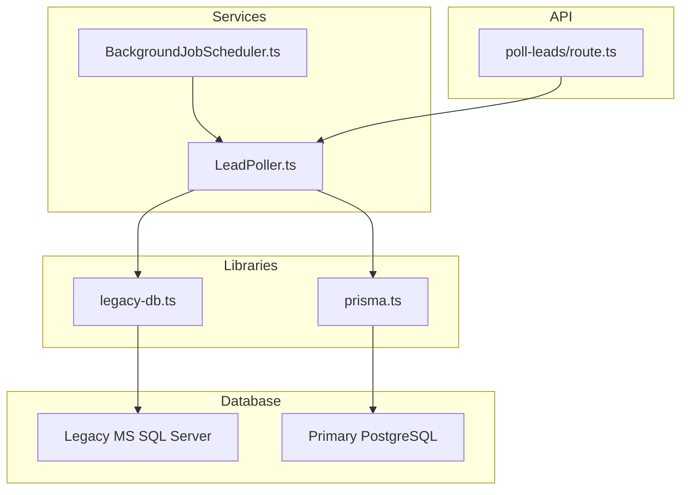
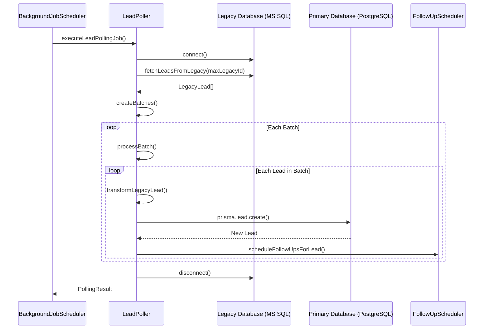
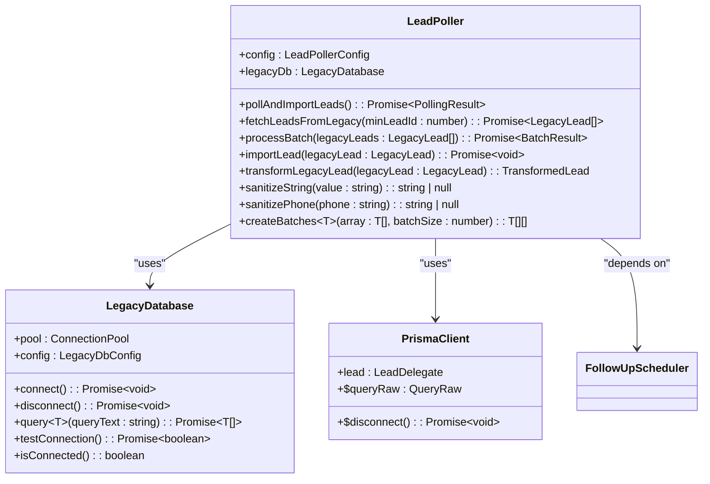
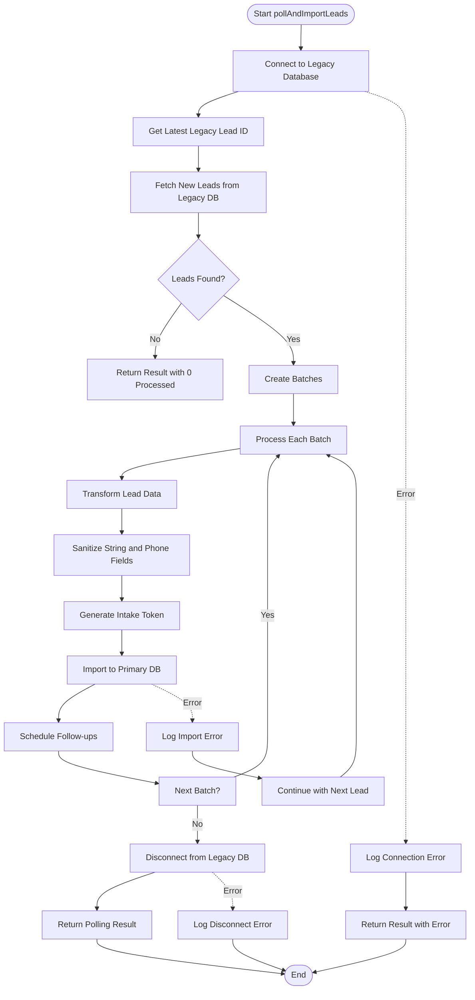
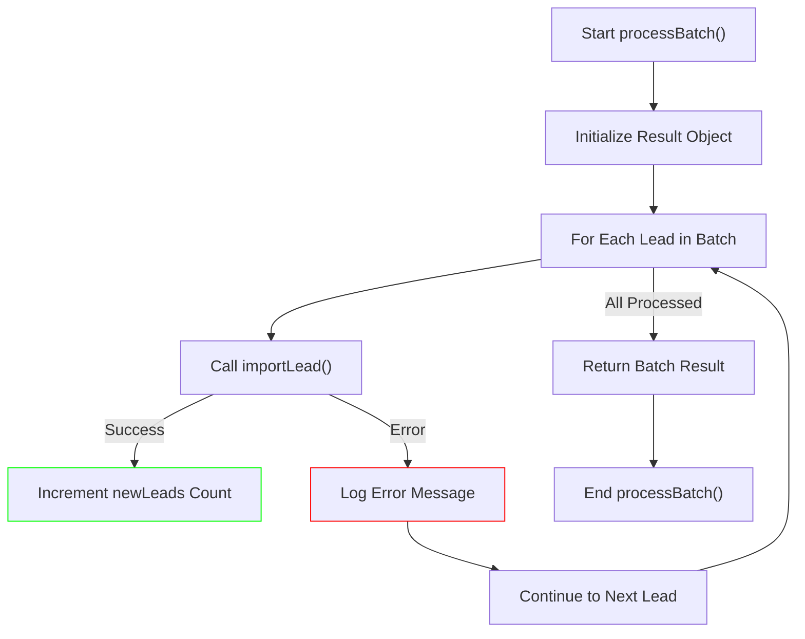
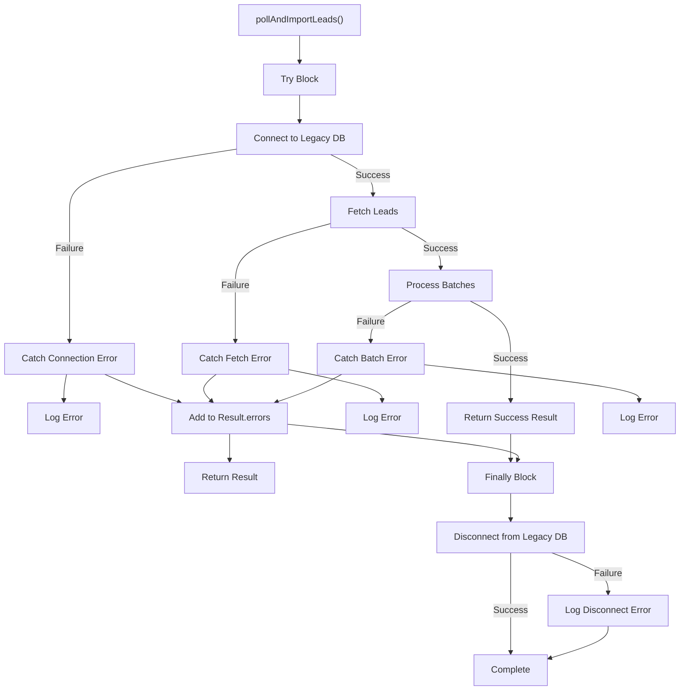
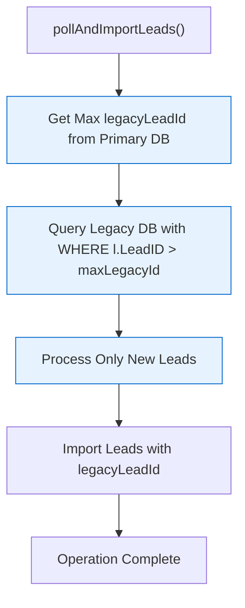
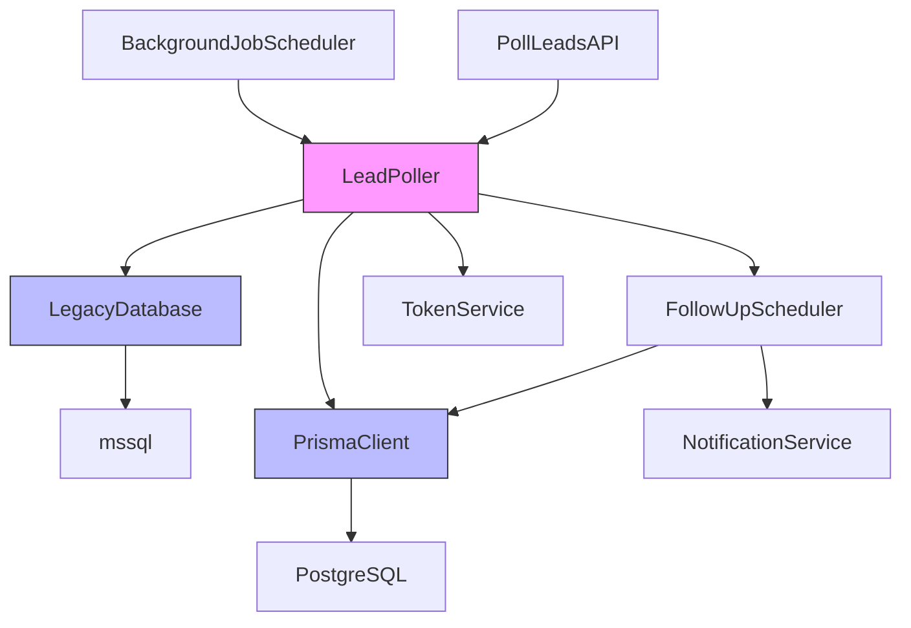

# Lead Polling Service

<cite>
**Referenced Files in This Document**   
- [LeadPoller.ts](file://src/services/LeadPoller.ts)
- [legacy-db.ts](file://src/lib/legacy-db.ts)
- [prisma.ts](file://src/lib/prisma.ts)
- [schema.prisma](file://prisma/schema.prisma)
- [BackgroundJobScheduler.ts](file://src/services/BackgroundJobScheduler.ts)
- [poll-leads/route.ts](file://src/app/api/cron/poll-leads/route.ts)
</cite>

## Table of Contents
1. [Introduction](#introduction)
2. [Project Structure](#project-structure)
3. [Core Components](#core-components)
4. [Architecture Overview](#architecture-overview)
5. [Detailed Component Analysis](#detailed-component-analysis)
6. [Dependency Analysis](#dependency-analysis)
7. [Performance Considerations](#performance-considerations)
8. [Troubleshooting Guide](#troubleshooting-guide)
9. [Conclusion](#conclusion)

## Introduction
The Lead Polling Service is a critical component of the merchant funding application system, responsible for synchronizing lead data from a legacy MS SQL Server database into the primary PostgreSQL database. This service ensures that new leads captured in the legacy system are automatically imported, transformed, and made available for processing in the modern application. The service implements robust error handling, batch processing, and idempotent operations to ensure data integrity and system reliability.

## Project Structure
The Lead Polling Service is organized within the repository's service-oriented architecture, with clear separation of concerns between data access, business logic, and integration points. The service leverages several key directories:

- **src/services**: Contains the LeadPoller implementation and related services
- **src/lib**: Houses database connection utilities for both legacy and primary databases
- **prisma**: Manages the PostgreSQL schema and migrations
- **src/app/api/cron**: Exposes the API endpoint for triggering lead polling



**Diagram sources**
- [LeadPoller.ts](file://src/services/LeadPoller.ts)
- [legacy-db.ts](file://src/lib/legacy-db.ts)
- [prisma.ts](file://src/lib/prisma.ts)
- [BackgroundJobScheduler.ts](file://src/services/BackgroundJobScheduler.ts)
- [poll-leads/route.ts](file://src/app/api/cron/poll-leads/route.ts)

**Section sources**
- [LeadPoller.ts](file://src/services/LeadPoller.ts)
- [legacy-db.ts](file://src/lib/legacy-db.ts)
- [prisma.ts](file://src/lib/prisma.ts)

## Core Components
The Lead Polling Service consists of several core components that work together to synchronize lead data between databases. The primary component is the LeadPoller class, which orchestrates the entire polling process. This service connects to the legacy MS SQL Server database using the mssql library, queries for new or updated leads, and synchronizes them into the PostgreSQL database via Prisma ORM.

The service implements a batch processing strategy to efficiently handle large volumes of leads while maintaining system performance. Each batch is processed independently, allowing for error isolation and recovery. The LeadPoller also implements an idempotent insertion strategy by tracking the latest imported legacy lead ID, ensuring that no leads are duplicated during the synchronization process.

**Section sources**
- [LeadPoller.ts](file://src/services/LeadPoller.ts#L21-L497)
- [legacy-db.ts](file://src/lib/legacy-db.ts#L21-L157)
- [prisma.ts](file://src/lib/prisma.ts#L1-L60)

## Architecture Overview
The Lead Polling Service follows a layered architecture that separates concerns between data access, business logic, and integration points. The service is triggered either by a scheduled cron job through the BackgroundJobScheduler or manually via the /api/cron/poll-leads API endpoint.



**Diagram sources**
- [LeadPoller.ts](file://src/services/LeadPoller.ts#L21-L497)
- [BackgroundJobScheduler.ts](file://src/services/BackgroundJobScheduler.ts#L1-L462)

## Detailed Component Analysis

### LeadPoller Service Analysis
The LeadPoller service is the central component responsible for synchronizing lead data between the legacy and primary databases. It implements a comprehensive polling mechanism that efficiently retrieves new leads and imports them into the system.

#### Class Structure and Relationships


**Diagram sources**
- [LeadPoller.ts](file://src/services/LeadPoller.ts#L21-L497)
- [legacy-db.ts](file://src/lib/legacy-db.ts#L21-L157)
- [prisma.ts](file://src/lib/prisma.ts#L1-L60)

#### Polling Process Flow


**Diagram sources**
- [LeadPoller.ts](file://src/services/LeadPoller.ts#L21-L497)

**Section sources**
- [LeadPoller.ts](file://src/services/LeadPoller.ts#L21-L497)

### Legacy Database Integration
The LeadPoller service connects to the legacy MS SQL Server database using the mssql library through a dedicated LegacyDatabase class. This integration handles connection management, query execution, and error handling.

#### Connection Configuration
The LegacyDatabase class uses environment variables to configure the connection parameters:

- **LEGACY_DB_SERVER**: Hostname or IP address of the MS SQL Server
- **LEGACY_DB_DATABASE**: Database name (defaults to "LeadData2")
- **LEGACY_DB_USER**: Username for authentication
- **LEGACY_DB_PASSWORD**: Password for authentication
- **LEGACY_DB_PORT**: Port number (defaults to 1433)
- **LEGACY_DB_ENCRYPT**: Whether to use encryption (defaults to true)
- **LEGACY_DB_TRUST_CERT**: Whether to trust server certificate (defaults to true)
- **LEGACY_DB_REQUEST_TIMEOUT**: Request timeout in milliseconds (defaults to 30,000)
- **LEGACY_DB_CONNECTION_TIMEOUT**: Connection timeout in milliseconds (defaults to 15,000)

The service implements connection pooling and ensures that connections are properly closed in the finally block of the pollAndImportLeads method, preventing connection leaks.

**Section sources**
- [legacy-db.ts](file://src/lib/legacy-db.ts#L21-L157)

### Primary Database Integration
The LeadPoller service synchronizes leads into the PostgreSQL database using Prisma ORM. The Prisma client is configured with appropriate logging and error handling based on the environment.

#### Data Model Mapping
The service maps legacy lead data to the Prisma Lead model, handling data type conversions and field transformations:

```mermaid
erDiagram
LEGACY_LEAD ||--o{ LEAD : maps_to
LEGACY_LEAD {
number ID PK
number CampaignID
string Email
string Phone
string FirstName
string LastName
string BusinessName
string Industry
number YearsInBusiness
number AmountNeeded
number MonthlyRevenue
string Address
string City
string State
string ZipCode
datetime CreatedDate
}
LEAD {
number id PK
bigint legacyLeadId UK
number campaignId
string email?
string phone?
string firstName?
string lastName?
string businessName?
string industry?
number yearsInBusiness?
string amountNeeded?
string monthlyRevenue?
string personalAddress?
string personalCity?
string personalState?
string personalZip?
string businessAddress?
string businessCity?
string businessState?
string businessZip?
string status
string intakeToken UK
datetime importedAt
}
```

**Diagram sources**
- [schema.prisma](file://prisma/schema.prisma#L1-L257)
- [LeadPoller.ts](file://src/services/LeadPoller.ts#L21-L497)

**Section sources**
- [schema.prisma](file://prisma/schema.prisma#L1-L257)
- [LeadPoller.ts](file://src/services/LeadPoller.ts#L21-L497)

### Batch Processing Logic
The LeadPoller implements a sophisticated batch processing strategy to efficiently handle large volumes of leads while maintaining system performance and reliability.

#### Batch Processing Flow


The service processes leads in configurable batches, with a default batch size of 100 leads. This approach provides several benefits:

- **Memory Efficiency**: Limits the number of leads held in memory at any time
- **Error Isolation**: Failures in one lead don't prevent processing of others in the batch
- **Progress Tracking**: Allows monitoring of processing progress at the batch level
- **Performance Optimization**: Reduces the overhead of database transactions

**Section sources**
- [LeadPoller.ts](file://src/services/LeadPoller.ts#L21-L497)

### Error Handling Strategy
The LeadPoller service implements a comprehensive error handling strategy to ensure reliability during database connectivity issues and data processing errors.

#### Error Handling Flow


The service handles errors at multiple levels:

1. **Connection Errors**: Handled during database connection attempts
2. **Query Errors**: Handled when fetching leads from specific campaign tables
3. **Batch Processing Errors**: Handled when processing individual batches
4. **Lead Import Errors**: Handled when importing individual leads
5. **Follow-up Scheduling Errors**: Handled when scheduling follow-ups (non-critical)

The service continues processing even when individual operations fail, ensuring that partial success is achieved when possible.

**Section sources**
- [LeadPoller.ts](file://src/services/LeadPoller.ts#L21-L497)

### Idempotent Insertion Strategy
The LeadPoller service implements an idempotent insertion strategy to prevent duplicate leads from being imported.

#### Idempotency Flow


The idempotency is achieved through:

1. **Tracking Latest ID**: The service queries the primary database to find the highest legacyLeadId already imported
2. **Filtered Queries**: The legacy database is queried only for leads with IDs greater than the maximum found
3. **Unique Constraint**: The legacyLeadId field has a unique constraint in the primary database schema
4. **Ascending Order**: Leads are processed in ascending order of their legacy IDs to maintain consistency

This strategy ensures that even if the polling process is interrupted and restarted, no leads will be duplicated.

**Section sources**
- [LeadPoller.ts](file://src/services/LeadPoller.ts#L21-L497)
- [schema.prisma](file://prisma/schema.prisma#L1-L257)

## Dependency Analysis
The LeadPolling service has several key dependencies that enable its functionality:



**Diagram sources**
- [LeadPoller.ts](file://src/services/LeadPoller.ts)
- [BackgroundJobScheduler.ts](file://src/services/BackgroundJobScheduler.ts)
- [poll-leads/route.ts](file://src/app/api/cron/poll-leads/route.ts)

**Section sources**
- [LeadPoller.ts](file://src/services/LeadPoller.ts)
- [BackgroundJobScheduler.ts](file://src/services/BackgroundJobScheduler.ts)

## Performance Considerations
The LeadPolling service has been designed with several performance considerations to ensure efficient operation:

### Configuration Parameters
The service is configurable through environment variables:

- **MERCHANT_FUNDING_CAMPAIGN_IDS**: Comma-separated list of campaign IDs to poll
- **LEAD_POLLING_BATCH_SIZE**: Number of leads to process in each batch (default: 100)
- **LEAD_POLLING_CRON_PATTERN**: Cron pattern for scheduled polling (default: "*/15 * * * *")
- **LEGACY_DB_REQUEST_TIMEOUT**: Timeout for database queries (default: 30,000ms)
- **LEGACY_DB_CONNECTION_TIMEOUT**: Timeout for database connections (default: 15,000ms)

### Indexing Strategies
The database schema includes several indexes to optimize query performance:

- **Primary Key Indexes**: On all ID fields for fast lookups
- **Unique Constraints**: On legacyLeadId and intakeToken to prevent duplicates
- **Foreign Key Indexes**: On relation fields for efficient joins
- **Date-based Indexes**: On importedAt and createdAt fields for time-based queries

### Optimization Recommendations
1. **Monitor Batch Size**: Adjust LEAD_POLLING_BATCH_SIZE based on system performance and memory usage
2. **Optimize Legacy Queries**: Ensure appropriate indexes exist on the legacy database's LeadID and CampaignID fields
3. **Connection Pooling**: Consider implementing connection pooling for the legacy database if not already present
4. **Asynchronous Processing**: For very large batches, consider making the import process fully asynchronous
5. **Monitoring**: Implement monitoring for processing time, error rates, and database connection metrics

**Section sources**
- [LeadPoller.ts](file://src/services/LeadPoller.ts)
- [schema.prisma](file://prisma/schema.prisma)

## Troubleshooting Guide
This section addresses common issues that may occur with the LeadPolling service and provides guidance for resolution.

### Network Timeouts
**Issue**: Connection or query timeouts when accessing the legacy database
**Symptoms**: "Failed to connect to legacy database" or "Query execution failed" errors
**Solutions**:
- Increase LEGACY_DB_CONNECTION_TIMEOUT and LEGACY_DB_REQUEST_TIMEOUT values
- Verify network connectivity between application and database servers
- Check firewall rules and security groups
- Monitor network latency and packet loss

### Schema Mismatches
**Issue**: Column name or data type mismatches between legacy and primary databases
**Symptoms**: "Column not found" or "Invalid data type" errors
**Solutions**:
- Verify the SELECT clause in fetchLeadsFromLegacy matches actual column names
- Check data type compatibility between MS SQL Server and PostgreSQL
- Update the transformLegacyLead method to handle new or changed fields
- Run database schema comparisons to identify differences

### Data Type Conversions
**Issue**: Problems with data type conversions, particularly for numeric and date fields
**Symptoms**: "Invalid number" or "Invalid date" errors
**Solutions**:
- Ensure AmountNeeded and MonthlyRevenue are handled as strings (as per schema)
- Verify date format compatibility between databases
- Implement additional data validation in the transformLegacyLead method
- Add error handling for invalid numeric values

### Duplicate Lead Prevention
**Issue**: Potential for duplicate leads during service restarts or failures
**Solutions**:
- Ensure the unique constraint on legacyLeadId is enforced
- Verify the idempotent insertion strategy is working correctly
- Monitor the maxLegacyId tracking mechanism
- Implement additional logging to track processed lead IDs

**Section sources**
- [LeadPoller.ts](file://src/services/LeadPoller.ts)
- [legacy-db.ts](file://src/lib/legacy-db.ts)
- [schema.prisma](file://prisma/schema.prisma)

## Conclusion
The Lead Polling Service is a robust and reliable component that effectively synchronizes lead data between legacy and primary databases. By implementing batch processing, comprehensive error handling, and idempotent operations, the service ensures data integrity while maintaining system performance. The service's integration with the BackgroundJobScheduler and API endpoints provides flexibility in how polling is triggered, supporting both scheduled and manual operations. With proper configuration and monitoring, this service forms a critical bridge between legacy systems and modern application functionality.