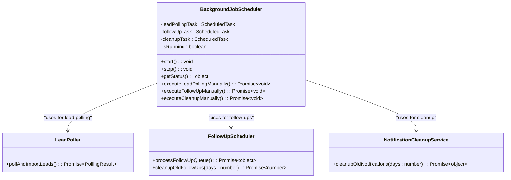
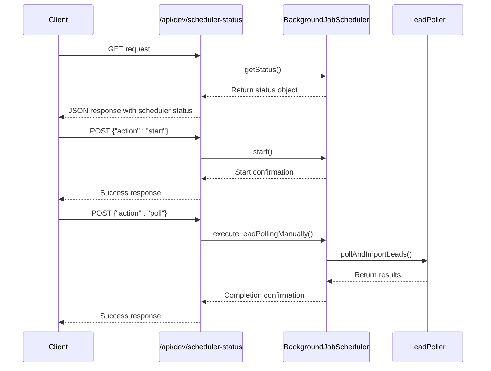
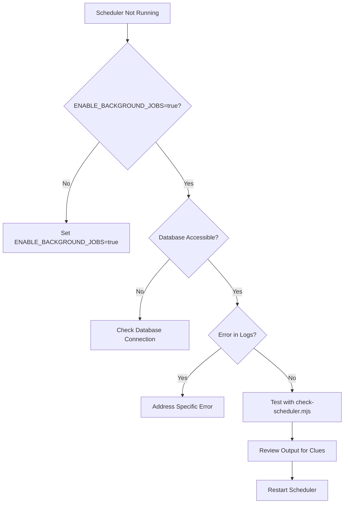
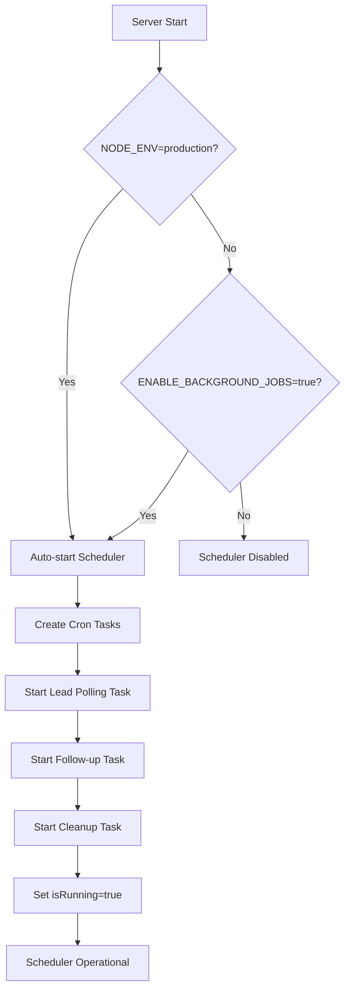

# Scheduler Operations and Monitoring

<cite>
**Referenced Files in This Document**   
- [start-scheduler.mjs](file://scripts/start-scheduler.mjs)
- [check-scheduler.mjs](file://scripts/check-scheduler.mjs)
- [ensure-scheduler-running.sh](file://scripts/ensure-scheduler-running.sh)
- [BackgroundJobScheduler.ts](file://src/services/BackgroundJobScheduler.ts)
- [scheduler-status/route.ts](file://src/app/api/dev/scheduler-status/route.ts)
- [server-init.ts](file://src/lib/server-init.ts)
</cite>

## Table of Contents
1. [Introduction](#introduction)
2. [Scheduler Architecture Overview](#scheduler-architecture-overview)
3. [Core Components](#core-components)
4. [Scheduler Management Scripts](#scheduler-management-scripts)
5. [Real-time Monitoring via API Endpoint](#real-time-monitoring-via-api-endpoint)
6. [Troubleshooting Common Issues](#troubleshooting-common-issues)
7. [Best Practices for Production](#best-practices-for-production)
8. [Environment Configuration](#environment-configuration)
9. [Conclusion](#conclusion)

## Introduction
This document provides comprehensive operational guidance for managing the background job scheduler in the fund-track application. The scheduler handles critical tasks including lead polling, follow-up processing, and notification cleanup. This documentation covers startup procedures, monitoring techniques, troubleshooting strategies, and best practices for ensuring reliable scheduler operation in both development and production environments.

The system uses a centralized BackgroundJobScheduler class that manages multiple cron-based tasks. Access to scheduler controls is provided through both command-line scripts and API endpoints, enabling flexible management approaches depending on the environment and use case.

## Scheduler Architecture Overview

```mermaid
graph TD
A[BackgroundJobScheduler] --> B[Lead Polling Task]
A --> C[Follow-up Processing Task]
A --> D[Notification Cleanup Task]
B --> E[Cron: */15 * * * *]
C --> F[Cron: */5 * * * *]
D --> G[Cron: 0 2 * * *]
H[Scheduler Management] --> I[start-scheduler.mjs]
H --> J[check-scheduler.mjs]
H --> K[ensure-scheduler-running.sh]
H --> L[/api/dev/scheduler-status]
I --> A
J --> L
K --> L
L --> A
M[Environment Variables] --> A
M --> L
```

**Diagram sources**
- [BackgroundJobScheduler.ts](file://src/services/BackgroundJobScheduler.ts#L8-L458)
- [scheduler-status/route.ts](file://src/app/api/dev/scheduler-status/route.ts#L0-L82)

## Core Components

The background job scheduling system consists of several key components that work together to ensure reliable execution of periodic tasks.

### BackgroundJobScheduler Class
The core of the scheduling system is the BackgroundJobScheduler class, which manages the lifecycle of scheduled tasks. It uses the node-cron library to schedule and execute jobs at specified intervals.



**Diagram sources**
- [BackgroundJobScheduler.ts](file://src/services/BackgroundJobScheduler.ts#L8-L458)
- [LeadPoller.ts](file://src/services/LeadPoller.ts#L0-L52)
- [FollowUpScheduler.ts](file://src/services/FollowUpScheduler.ts)

**Section sources**
- [BackgroundJobScheduler.ts](file://src/services/BackgroundJobScheduler.ts#L8-L458)

## Scheduler Management Scripts

### start-scheduler.mjs
This script provides a direct way to start the background job scheduler by importing and calling the BackgroundJobScheduler instance directly.

```javascript
import { backgroundJobScheduler } from '../src/services/BackgroundJobScheduler.js';
import { logger } from '../src/lib/logger.js';

async function startScheduler() {
  try {
    console.log('🚀 Starting background job scheduler...');
    
    const statusBefore = backgroundJobScheduler.getStatus();
    console.log('📊 Current status:', JSON.stringify(statusBefore, null, 2));
    
    if (statusBefore.isRunning) {
      console.log('✅ Scheduler is already running');
      return;
    }
    
    backgroundJobScheduler.start();
    
    const statusAfter = backgroundJobScheduler.getStatus();
    console.log('📊 Status after start:', JSON.stringify(statusAfter, null, 2));
    
    if (statusAfter.isRunning) {
      console.log('✅ Background job scheduler started successfully!');
      console.log(`📅 Next lead polling: ${statusAfter.nextLeadPolling}`);
      console.log(`📅 Next follow-up: ${statusAfter.nextFollowUp}`);
    } else {
      console.log('❌ Failed to start scheduler');
    }
    
  } catch (error) {
    console.error('❌ Error starting scheduler:', error);
    process.exit(1);
  }
}
```

**Section sources**
- [start-scheduler.mjs](file://scripts/start-scheduler.mjs#L0-L57)

### check-scheduler.mjs
This script checks the current status of the scheduler by making an HTTP request to the /api/dev/scheduler-status endpoint and displaying detailed information.

```javascript
const baseUrl = process.env.NEXTAUTH_URL || 'http://localhost:3000';
const url = `${baseUrl}/api/dev/scheduler-status`;

console.log('🔍 Checking Background Job Scheduler Status...\n');

try {
  const response = await fetch(url);
  const data = await response.json();

  console.log('📊 Scheduler Status:');
  console.log('==================');
  console.log(`Running: ${data.scheduler.isRunning ? '✅ YES' : '❌ NO'}`);
  console.log(`Lead Polling Pattern: ${data.scheduler.leadPollingPattern}`);
  console.log(`Follow-up Pattern: ${data.scheduler.followUpPattern}`);
  
  if (data.scheduler.nextLeadPolling) {
    const nextPolling = new Date(data.scheduler.nextLeadPolling);
    const now = new Date();
    const minutesUntil = Math.round((nextPolling - now) / (1000 * 60));
    console.log(`Next Lead Polling: ${nextPolling.toLocaleString()} (in ${minutesUntil} minutes)`);
  }
  
  if (data.scheduler.nextFollowUp) {
    const nextFollowUp = new Date(data.scheduler.nextFollowUp);
    const now = new Date();
    const minutesUntil = Math.round((nextFollowUp - now) / (1000 * 60));
    console.log(`Next Follow-up: ${nextFollowUp.toLocaleString()} (in ${minutesUntil} minutes)`);
  }
}
```

**Section sources**
- [check-scheduler.mjs](file://scripts/check-scheduler.mjs#L0-L71)

### ensure-scheduler-running.sh
This shell script ensures the scheduler is running and functional, designed to be used as a cron job or startup script in production environments.

```bash
#!/bin/bash

echo "🔍 Checking scheduler status..."

# Wait for server to be ready
max_attempts=30
attempt=0
while [ $attempt -lt $max_attempts ]; do
    if curl -s "http://localhost:3000/api/health" > /dev/null 2>&1; then
        echo "✅ Server is ready"
        break
    fi
    echo "⏳ Waiting for server to start... (attempt $((attempt + 1))/$max_attempts)"
    sleep 2
    attempt=$((attempt + 1))
done

# Check scheduler status
status_response=$(curl -s "http://localhost:3000/api/dev/scheduler-status" 2>/dev/null)
is_running=$(echo "$status_response" | jq -r '.result.scheduler.isRunning // false' 2>/dev/null)

if [ "$is_running" = "true" ]; then
    echo "✅ Scheduler is already running"
    
    # Test manual polling to ensure it's working
    poll_response=$(curl -s -X POST "http://localhost:3000/api/dev/scheduler-status" \
      -H "Content-Type: application/json" \
      -d '{"action": "poll"}' 2>/dev/null)
    
    if echo "$poll_response" | jq -e '.success' > /dev/null 2>&1; then
        echo "✅ Manual polling test successful"
    else
        echo "⚠️  Manual polling test failed: $poll_response"
    fi
else
    echo "🔧 Starting scheduler..."
    
    start_response=$(curl -s -X POST "http://localhost:3000/api/dev/scheduler-status" \
      -H "Content-Type: application/json" \
      -d '{"action": "start"}' 2>/dev/null)
    
    if echo "$start_response" | jq -e '.success' > /dev/null 2>&1; then
        echo "✅ Scheduler started successfully"
        
        # Verify it's running
        sleep 2
        status_response=$(curl -s "http://localhost:3000/api/dev/scheduler-status" 2>/dev/null)
        is_running=$(echo "$status_response" | jq -r '.result.scheduler.isRunning // false' 2>/dev/null)
        
        if [ "$is_running" = "true" ]; then
            echo "✅ Scheduler confirmed running"
            
            # Test manual polling
            poll_response=$(curl -s -X POST "http://localhost:3000/api/dev/scheduler-status" \
              -H "Content-Type: application/json" \
              -d '{"action": "poll"}' 2>/dev/null)
            
            if echo "$poll_response" | jq -e '.success' > /dev/null 2>&1; then
                echo "✅ Manual polling test successful"
                echo "🎉 Scheduler is now running and functional!"
            else
                echo "⚠️  Manual polling test failed: $poll_response"
            fi
        else
            echo "❌ Scheduler failed to start properly"
            exit 1
        fi
    else
        echo "❌ Failed to start scheduler: $start_response"
        exit 1
    fi
fi
```

**Section sources**
- [ensure-scheduler-running.sh](file://scripts/ensure-scheduler-running.sh#L0-L92)

## Real-time Monitoring via API Endpoint

### /api/dev/scheduler-status Endpoint
This API endpoint provides real-time visibility into the scheduler's health and execution state. It supports both GET and POST methods for status retrieval and control operations.



**Diagram sources**
- [scheduler-status/route.ts](file://src/app/api/dev/scheduler-status/route.ts#L0-L82)
- [BackgroundJobScheduler.ts](file://src/services/BackgroundJobScheduler.ts#L8-L458)

The endpoint implementation:

```typescript
export async function GET() {
    try {
        const status = backgroundJobScheduler.getStatus();

        return NextResponse.json({
            success: true,
            action: 'scheduler-status',
            result: {
                scheduler: status,
                environment: {
                    nodeEnv: process.env.NODE_ENV,
                    backgroundJobsEnabled: process.env.ENABLE_BACKGROUND_JOBS,
                    leadPollingPattern: process.env.LEAD_POLLING_CRON_PATTERN,
                    campaignIds: process.env.MERCHANT_FUNDING_CAMPAIGN_IDS,
                },
                timestamp: new Date().toISOString(),
            }
        });
    } catch (error) {
        return NextResponse.json(
            {
                success: false,
                error: 'Failed to get scheduler status',
                details: error instanceof Error ? error.message : 'Unknown error'
            },
            { status: 500 }
        );
    }
}

export async function POST(request: Request) {
    try {
        const body = await request.json();
        const { action } = body;

        if (action === 'start') {
            backgroundJobScheduler.start();
            return NextResponse.json({
                success: true,
                message: 'Background job scheduler started manually',
                timestamp: new Date().toISOString(),
            });
        } else if (action === 'stop') {
            backgroundJobScheduler.stop();
            return NextResponse.json({
                success: true,
                message: 'Background job scheduler stopped manually',
                timestamp: new Date().toISOString(),
            });
        } else if (action === 'poll') {
            await backgroundJobScheduler.executeLeadPollingManually();
            return NextResponse.json({
                success: true,
                message: 'Lead polling executed manually',
                timestamp: new Date().toISOString(),
            });
        } else {
            return NextResponse.json(
                { error: 'Invalid action. Use "start", "stop", or "poll"' },
                { status: 400 }
            );
        }
    } catch (error) {
        return NextResponse.json(
            {
                error: 'Failed to execute scheduler action',
                details: error instanceof Error ? error.message : 'Unknown error'
            },
            { status: 500 }
        );
    }
}
```

**Section sources**
- [scheduler-status/route.ts](file://src/app/api/dev/scheduler-status/route.ts#L0-L82)

## Troubleshooting Common Issues

### Scheduler Crashes
When the scheduler crashes or fails to start, follow this diagnostic procedure:

1. **Check environment variables**: Ensure `ENABLE_BACKGROUND_JOBS=true` is set
2. **Verify database connectivity**: The scheduler depends on database access
3. **Review logs**: Check application logs for error messages
4. **Test manually**: Use `node scripts/check-scheduler.mjs` to verify status



**Section sources**
- [server-init.ts](file://src/lib/server-init.ts#L0-L177)
- [BackgroundJobScheduler.ts](file://src/services/BackgroundJobScheduler.ts#L8-L458)

### Stuck Jobs
If jobs appear to be stuck or not executing as expected:

1. **Check cron patterns**: Verify `LEAD_POLLING_CRON_PATTERN` and `FOLLOWUP_CRON_PATTERN`
2. **Examine job execution time**: Long-running jobs may overlap
3. **Review error logs**: Look for job-specific errors
4. **Manual execution**: Test with `/api/dev/scheduler-status` POST action "poll"

### Duplicate Executions
To prevent duplicate executions:

1. **Ensure single instance**: The scheduler should run on only one server instance
2. **Use locking mechanisms**: Implement database-level locks for critical operations
3. **Monitor execution frequency**: Verify jobs run at expected intervals
4. **Check for overlapping schedules**: Ensure cron patterns don't cause overlaps

## Best Practices for Production

### Monitoring and Alerting
Implement comprehensive monitoring to ensure scheduler reliability:

- **Health checks**: Regularly call `/api/dev/scheduler-status` to verify operation
- **Log monitoring**: Set up alerts for scheduler-related errors
- **Execution tracking**: Monitor job completion times and success rates
- **External monitoring**: Use external services to verify endpoint availability

### Disaster Recovery
Prepare for scheduler failures with these recovery strategies:

1. **Automated restart**: Use `ensure-scheduler-running.sh` as a cron job (e.g., every 5 minutes)
2. **Backup execution methods**: Maintain multiple ways to start the scheduler
3. **Manual intervention procedures**: Document steps for manual recovery
4. **State verification**: Always verify scheduler state after restart

### Process Management
For reliable operation in production:

- **Use process managers**: Run the application with PM2, systemd, or similar
- **Enable automatic restarts**: Configure process managers to restart on failure
- **Monitor resource usage**: Ensure adequate CPU and memory allocation
- **Log rotation**: Implement log rotation to prevent disk space issues

## Environment Configuration

### Required Environment Variables
The scheduler behavior is controlled by several environment variables:

**Scheduler Control**
- `ENABLE_BACKGROUND_JOBS`: Set to "true" to enable the scheduler
- `NODE_ENV`: Set to "production" to auto-start the scheduler

**Scheduling Patterns**
- `LEAD_POLLING_CRON_PATTERN`: Cron pattern for lead polling (default: "*/15 * * * *")
- `FOLLOWUP_CRON_PATTERN`: Cron pattern for follow-up processing (default: "*/5 * * * *")
- `CLEANUP_CRON_PATTERN`: Cron pattern for cleanup jobs (default: "0 2 * * *")

**System Configuration**
- `TZ`: Timezone for cron scheduling (default: "America/New_York")
- `MERCHANT_FUNDING_CAMPAIGN_IDS`: Campaign IDs to poll for leads
- `LEAD_POLLING_BATCH_SIZE`: Number of leads to process per batch (default: 100)

### Initialization Process
The scheduler initialization follows this sequence:



**Section sources**
- [server-init.ts](file://src/lib/server-init.ts#L0-L177)

## Conclusion
The background job scheduler is a critical component of the fund-track application, responsible for time-sensitive operations including lead acquisition, follow-up processing, and system maintenance. This documentation has covered the architecture, management scripts, monitoring capabilities, and operational best practices for ensuring reliable scheduler operation.

Key takeaways:
- Use the provided scripts (`start-scheduler.mjs`, `check-scheduler.mjs`, `ensure-scheduler-running.sh`) for routine management
- Leverage the `/api/dev/scheduler-status` endpoint for real-time monitoring and control
- Implement proper environment configuration, especially `ENABLE_BACKGROUND_JOBS`
- Establish monitoring and alerting to detect and respond to issues promptly
- Follow best practices for production deployment and disaster recovery

By following these guidelines, operations teams can ensure the scheduler runs reliably and contributes to the overall stability and effectiveness of the application.