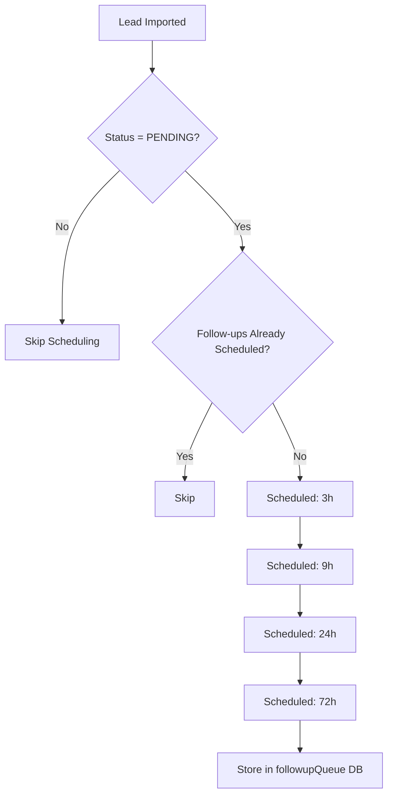
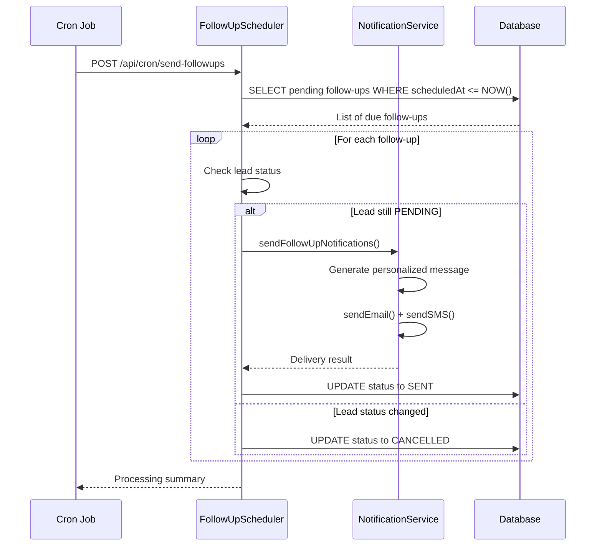
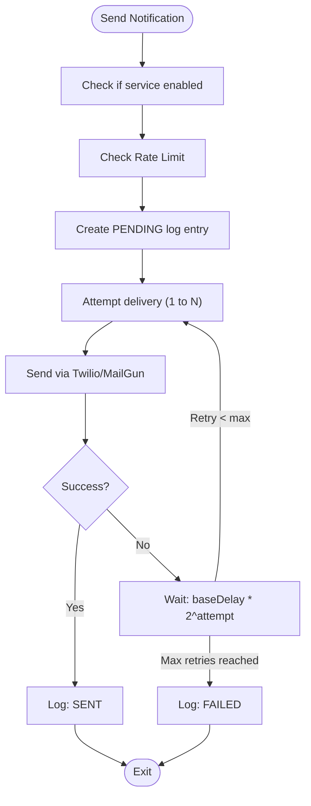
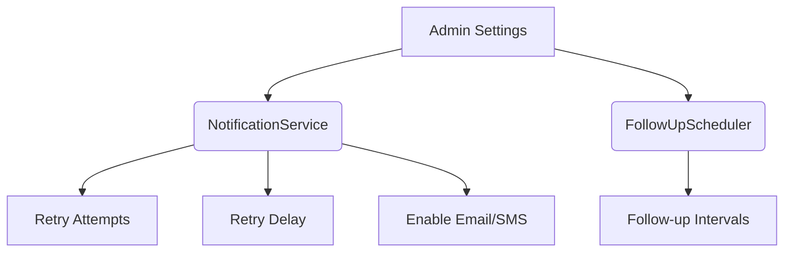

# Automated Notification System

<cite>
**Referenced Files in This Document**   
- [FollowUpScheduler.ts](file://src/services/FollowUpScheduler.ts)
- [NotificationService.ts](file://src/services/NotificationService.ts)
- [send-followups/route.ts](file://src/app/api/cron/send-followups/route.ts)
- [test-notifications/route.ts](file://src/app/api/dev/test-notifications/route.ts)
- [notifications/route.ts](file://src/app/api/admin/notifications/route.ts)
- [SystemSettingsService.ts](file://src/services/SystemSettingsService.ts)
</cite>

## Table of Contents
1. [Introduction](#introduction)
2. [Follow-Up Scheduling Mechanism](#follow-up-scheduling-mechanism)
3. [Notification Delivery and Retry Logic](#notification-delivery-and-retry-logic)
4. [API Endpoints for Testing and Monitoring](#api-endpoints-for-testing-and-monitoring)
5. [Notification Templates and Personalization](#notification-templates-and-personalization)
6. [Rate Limiting and Deliverability](#rate-limiting-and-deliverability)
7. [Monitoring and Administrative Interface](#monitoring-and-administrative-interface)

## Introduction
The Automated Notification System is designed to engage leads through timely email and SMS communications using MailGun and Twilio. The system automatically triggers initial and follow-up notifications at predefined intervals—3h, 9h, 24h, and 72h—after a lead is imported. These follow-ups are managed by the FollowUpScheduler, which queues notifications and processes them via a cron job. The NotificationService handles message delivery with robust retry logic, rate limiting, and comprehensive error handling. Administrators can monitor logs, send test messages, and adjust settings through dedicated API endpoints and an admin interface.

## Follow-Up Scheduling Mechanism

The FollowUpScheduler is responsible for queuing follow-up notifications when a new lead is imported. It schedules four distinct follow-ups at increasing intervals to maximize conversion while respecting user engagement patterns.



**Diagram sources**
- [FollowUpScheduler.ts](file://src/services/FollowUpScheduler.ts#L19-L486)

**Section sources**
- [FollowUpScheduler.ts](file://src/services/FollowUpScheduler.ts#L19-L486)

When a lead is created with status PENDING, the `scheduleFollowUpsForLead` method is invoked. It checks for existing pending follow-ups to prevent duplicates and schedules four entries in the `followupQueue` database table with timestamps offset by 3, 9, 24, and 72 hours. If a lead’s status changes (e.g., to CONVERTED or REJECTED), all pending follow-ups are automatically cancelled via `cancelFollowUpsForLead`.

The actual processing of due follow-ups is triggered by a cron job that calls the `processFollowUpQueue` method. This function retrieves all follow-ups where `scheduledAt ≤ now` and status is PENDING. For each due follow-up, it verifies the lead is still in PENDING status before dispatching notifications.



**Diagram sources**
- [send-followups/route.ts](file://src/app/api/cron/send-followups/route.ts#L1-L104)
- [FollowUpScheduler.ts](file://src/services/FollowUpScheduler.ts#L166-L282)

**Section sources**
- [send-followups/route.ts](file://src/app/api/cron/send-followups/route.ts#L1-L104)
- [FollowUpScheduler.ts](file://src/services/FollowUpScheduler.ts#L166-L282)

## Notification Delivery and Retry Logic

The NotificationService manages all outbound communications via MailGun (email) and Twilio (SMS). It implements exponential backoff retry logic and respects configurable retry limits.



**Diagram sources**
- [NotificationService.ts](file://src/services/NotificationService.ts#L47-L468)

**Section sources**
- [NotificationService.ts](file://src/services/NotificationService.ts#L47-L468)

The `sendEmail` and `sendSMS` methods first validate whether the respective channel is enabled via system settings. They then perform rate limiting checks before creating a log entry in the `notificationLog` table with status PENDING.

The core retry mechanism is implemented in `executeWithRetry`, which uses exponential backoff:
- **Base delay**: Configurable (default: 1000ms)
- **Max retries**: Configurable (default: 3)
- **Max delay**: Hardcoded at 30 seconds

Each failed attempt logs a warning and delays the next retry using the formula: `min(baseDelay * 2^attempt, maxDelay)`.

## API Endpoints for Testing and Monitoring

The system exposes several API endpoints for testing, diagnostics, and administrative access.

### Test Notification Endpoint
**POST /api/dev/test-notifications**

Allows developers to send test emails or SMS messages:
```json
{
  "type": "email",
  "recipient": "test@example.com",
  "subject": "Test Subject",
  "message": "Hello, this is a test.",
  "leadId": 123
}
```

The endpoint validates input and delegates to `NotificationService.sendEmail` or `sendSMS`. It returns delivery status and external identifiers (e.g., Twilio SID or MailGun message ID).

**Section sources**
- [test-notifications/route.ts](file://src/app/api/dev/test-notifications/route.ts#L1-L110)

### Notification Logs Endpoint
**GET /api/admin/notifications**

Provides paginated access to notification logs with filtering by:
- **type**: EMAIL or SMS
- **status**: PENDING, SENT, FAILED
- **recipient**: Partial match
- **search**: Full-text search across multiple fields

For performance, full-text queries use PostgreSQL’s `to_tsvector` with a GIN index, while standard queries use Prisma ORM with cursor-based pagination.

**Section sources**
- [notifications/route.ts](file://src/app/api/admin/notifications/route.ts#L1-L122)

## Notification Templates and Personalization

Follow-up messages are dynamically generated based on the follow-up type and include personalized tokens.

### Personalization Tokens
| Token | Description | Example |
|-------|-------------|--------|
| `{leadName}` | First + Last name or business name | John Doe |
| `{intakeUrl}` | Unique application link | https://app.example.com/application/abc123 |
| `{timeframe}` | Relative time context | "just a few hours ago" |

### Template Examples

**3-Hour Follow-Up (Email)**
- **Subject**: Quick Reminder: Complete Your Merchant Funding Application
- **Body**: 
  > Hi {leadName},  
  > We wanted to follow up quickly on your merchant funding application that you started just a few hours ago.  
  > Complete your application now: {intakeUrl}

**72-Hour Follow-Up (SMS)**
- **Message**: 
  > Hi {leadName}! This is your final reminder to complete your merchant funding application. Complete it now: {intakeUrl}

Templates are generated in `getFollowUpMessages` and include both plain text and HTML variants for emails, with a prominent CTA button styled in red.

**Section sources**
- [FollowUpScheduler.ts](file://src/services/FollowUpScheduler.ts#L374-L429)

## Rate Limiting and Deliverability

To prevent spam and ensure compliance, the system enforces strict rate limits:

### Rate Limiting Rules
- **Per recipient**: Max 2 notifications per hour
- **Per lead**: Max 10 notifications per day

These limits are checked in `checkRateLimit` before sending any message. The system queries the `notificationLog` table for recent SENT entries matching the recipient and/or lead ID.

If rate limits are exceeded, the request is rejected with a descriptive error. Failed rate limit checks do not block delivery but are logged for debugging.

### Compliance and Deliverability
- **Unsubscribe handling**: Managed by MailGun’s built-in unsubscribe tracking
- **SMS compliance**: All messages include opt-out instructions (e.g., "Reply STOP to unsubscribe")
- **Email authentication**: SPF, DKIM, and DMARC are configured via MailGun
- **Content optimization**: Messages avoid spam-triggering keywords and maintain a balanced text-to-link ratio

**Section sources**
- [NotificationService.ts](file://src/services/NotificationService.ts#L329-L387)

## Monitoring and Administrative Interface

Administrators can monitor system health and notification performance through multiple channels.

### Admin Dashboard Endpoints
- **GET /api/cron/send-followups**: Returns follow-up queue statistics including:
  - `totalPending`: Number of scheduled but not yet processed follow-ups
  - `dueSoon`: Number due within the next hour
  - Breakdown by type and status

- **GET /api/dev/test-notifications**: Returns recent test notifications and sample leads for quick testing

### Configuration Settings
Notification behavior is controlled via system settings:
- `sms_notifications_enabled`: Enables/disables SMS
- `email_notifications_enabled`: Enables/disables email
- `notification_retry_attempts`: Number of retry attempts (default: 3)
- `notification_retry_delay`: Base delay in milliseconds (default: 1000)

These settings are retrieved via `getNotificationSettings` and influence both delivery and retry behavior.



**Diagram sources**
- [SystemSettingsService.ts](file://src/services/SystemSettingsService.ts#L342-L349)
- [NotificationService.ts](file://src/services/NotificationService.ts#L47-L468)

**Section sources**
- [SystemSettingsService.ts](file://src/services/SystemSettingsService.ts#L342-L349)
- [NotificationService.ts](file://src/services/NotificationService.ts#L47-L468)

The system also includes diagnostic scripts such as `check-scheduler.mjs` and `test-notifications.mjs` to validate scheduler health and connectivity to external services.