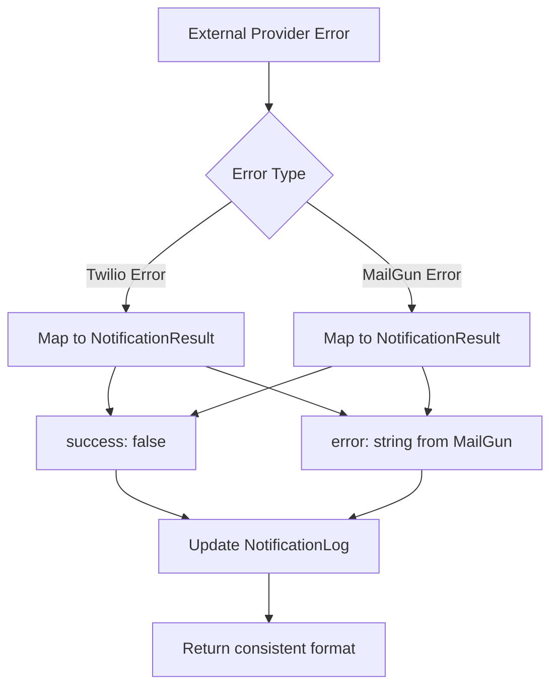
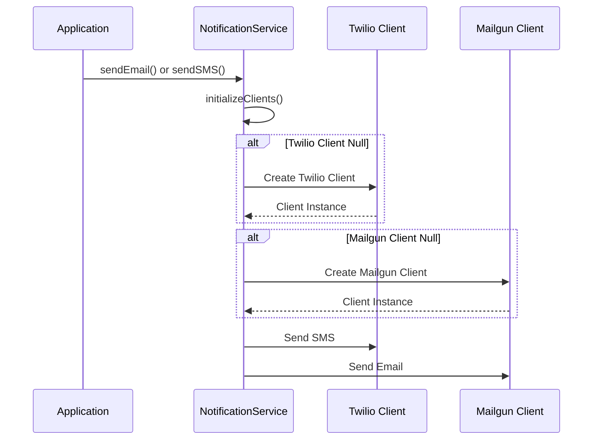
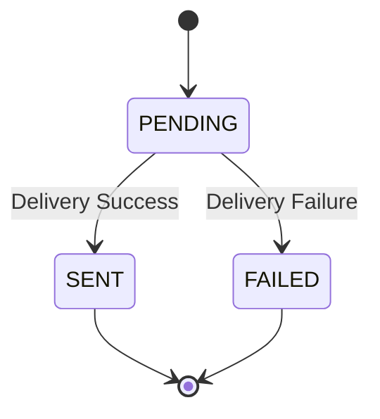
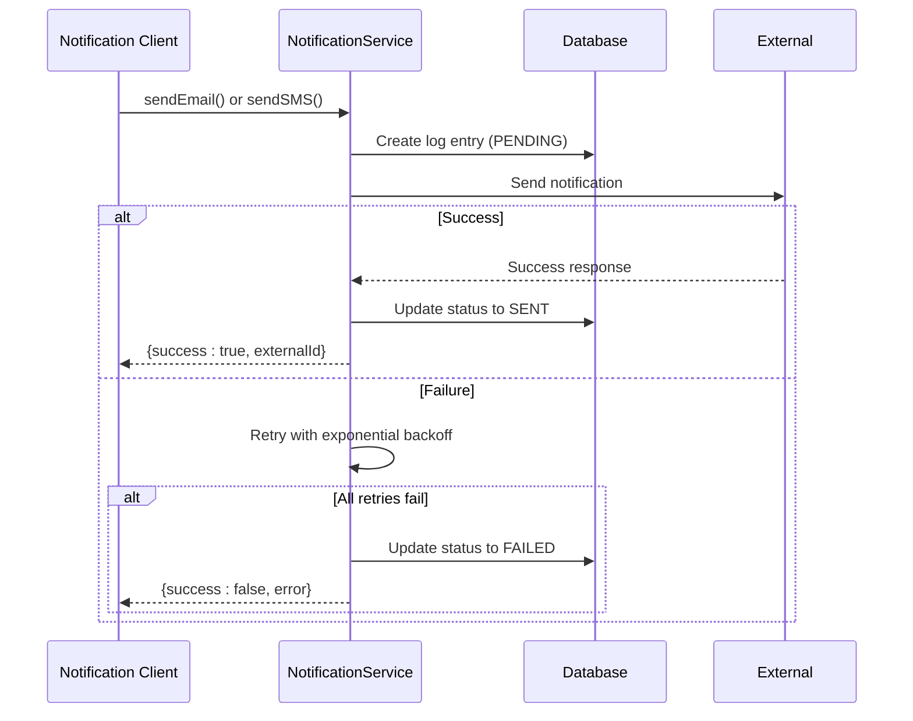
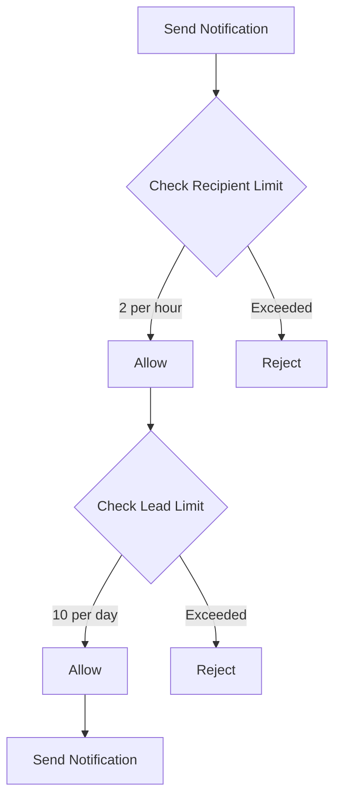
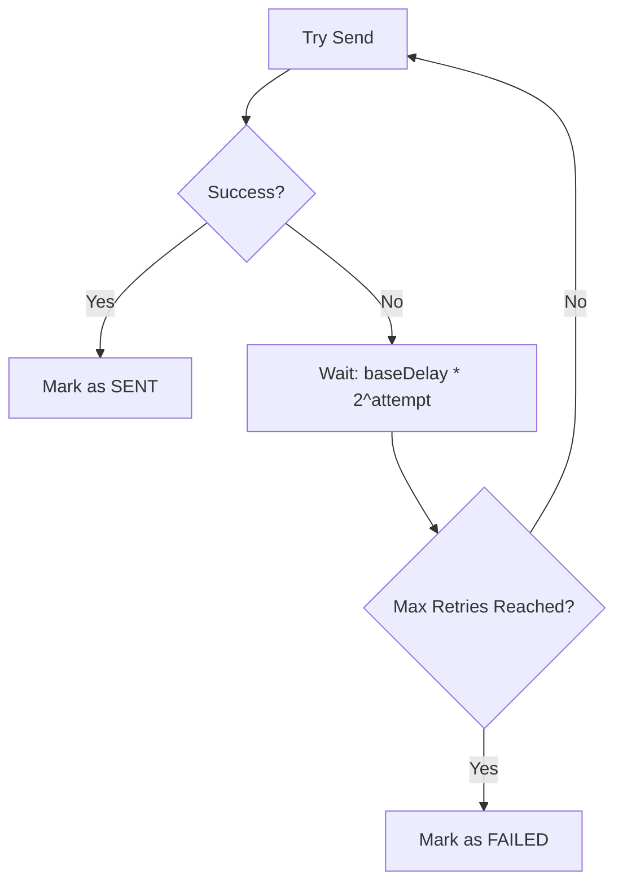
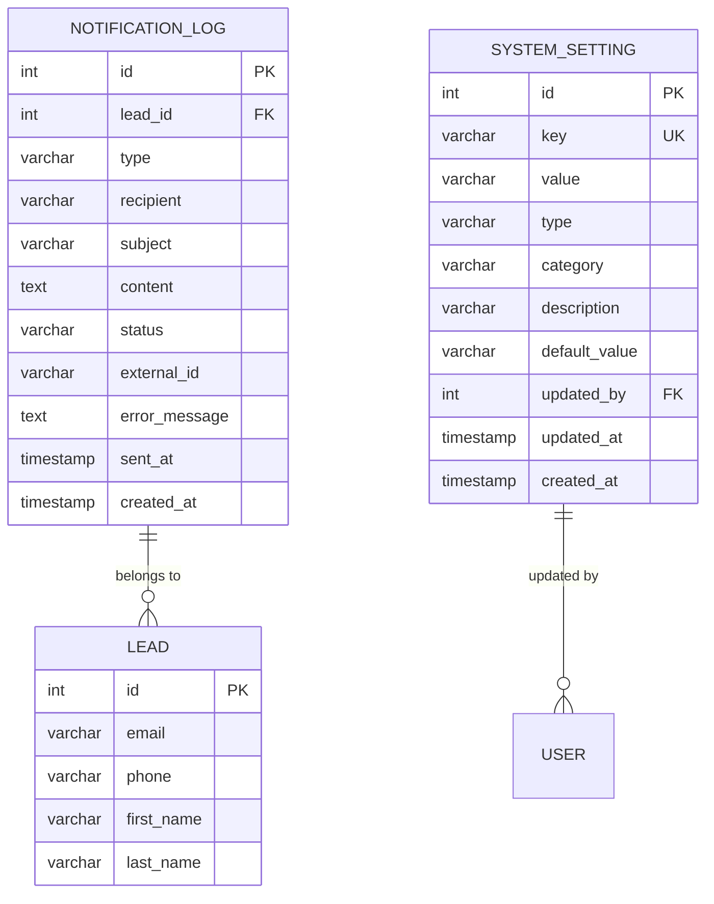

# External Notification Integrations

<cite>
**Referenced Files in This Document**   
- [NotificationService.ts](file://src/services/NotificationService.ts)
- [notifications.ts](file://src/lib/notifications.ts)
- [SystemSettingsService.ts](file://src/services/SystemSettingsService.ts)
- [schema.prisma](file://prisma/schema.prisma)
</cite>

## Table of Contents
1. [Introduction](#introduction)
2. [Configuration Parameters](#configuration-parameters)
3. [Abstraction Layer Architecture](#abstraction-layer-architecture)
4. [Error Handling and Response Mapping](#error-handling-and-response-mapping)
5. [Network-Level Considerations](#network-level-considerations)
6. [Webhook Processing and Status Tracking](#webhook-processing-and-status-tracking)
7. [Notification Workflow Sequence](#notification-workflow-sequence)
8. [Rate Limiting and Retry Mechanisms](#rate-limiting-and-retry-mechanisms)
9. [Database Schema for Notifications](#database-schema-for-notifications)

## Introduction
This document details the integration architecture for external notification services within the merchant funding application. The system supports both Twilio for SMS and MailGun for email notifications through a unified abstraction layer. The design enables flexible configuration, reliable delivery, and comprehensive tracking of all notifications. The implementation includes robust error handling, retry mechanisms, and rate limiting to ensure system stability and compliance with provider policies.

## Configuration Parameters

### Twilio Configuration
The Twilio integration requires the following environment variables:
- **TWILIO_ACCOUNT_SID**: Account identifier for authentication
- **TWILIO_AUTH_TOKEN**: Authentication token for API access
- **TWILIO_PHONE_NUMBER**: Sender phone number for SMS messages

These credentials are loaded during service initialization and used to create the Twilio client instance. The configuration is validated at startup to ensure all required parameters are present when SMS notifications are enabled.

### MailGun Configuration
The MailGun integration requires these environment variables:
- **MAILGUN_API_KEY**: API key for authentication
- **MAILGUN_DOMAIN**: Sending domain configured in MailGun
- **MAILGUN_FROM_EMAIL**: Default sender email address

The MailGun client is initialized with these parameters, and the configuration is validated during system startup. The domain parameter is essential as it specifies which domain to use for sending emails in multi-domain MailGun accounts.

### Runtime Configuration Settings
Additional notification behavior is controlled through database-stored settings managed by the SystemSettingsService:
- **sms_notifications_enabled**: Boolean flag to enable/disable SMS notifications
- **email_notifications_enabled**: Boolean flag to enable/disable email notifications
- **notification_retry_attempts**: Number of retry attempts for failed notifications
- **notification_retry_delay**: Base delay in milliseconds for retry backoff

These settings allow runtime configuration without requiring application restarts or environment variable changes.

**Section sources**
- [NotificationService.ts](file://src/services/NotificationService.ts#L53-L101)
- [SystemSettingsService.ts](file://src/services/SystemSettingsService.ts#L342-L349)

## Abstraction Layer Architecture

```mermaid
classDiagram
class NotificationService {
-twilioClient : Twilio | null
-mailgunClient : any | null
-config : NotificationConfig
+sendEmail(notification : EmailNotification) : Promise~NotificationResult~
+sendSMS(notification : SMSNotification) : Promise~NotificationResult~
+validateConfiguration() : Promise~boolean~
+getNotificationStats(leadId : number) : Promise~Record~string, number~~
+getRecentNotifications(limit? : number) : Promise~NotificationLog[]~
}
class EmailNotification {
+to : string
+subject : string
+text : string
+html? : string
+leadId? : number
}
class SMSNotification {
+to : string
+message : string
+leadId? : number
}
class NotificationResult {
+success : boolean
+externalId? : string
+error? : string
}
class SystemSettingsService {
+getSetting(key : string, type : T) : Promise~SystemSettingValue[T]~
+getSettingWithDefault(key : string, type : T, fallback : SystemSettingValue[T]) : Promise~SystemSettingValue[T]~
}
class NotificationService --> EmailNotification : "sends"
class NotificationService --> SMSNotification : "sends"
class NotificationService --> NotificationResult : "returns"
class NotificationService --> SystemSettingsService : "retrieves config"
class NotificationService --> Prisma : "logs to"
```

**Diagram sources**
- [NotificationService.ts](file://src/services/NotificationService.ts#L47-L468)
- [SystemSettingsService.ts](file://src/services/SystemSettingsService.ts#L342-L349)

**Section sources**
- [NotificationService.ts](file://src/services/NotificationService.ts#L47-L468)

## Error Handling and Response Mapping

### External API Error Mapping
The system maps external provider errors to a consistent internal format:



When an external API call fails, the error is caught and transformed into a standardized `NotificationResult` object with `success: false` and an error message. This ensures consistent error handling across different notification types.

### Internal Error Types
The system defines the following error states:
- **Provider Client Not Initialized**: Thrown when attempting to send notifications without proper client initialization
- **Rate Limit Exceeded**: Returned when recipient or lead notification limits are reached
- **Configuration Invalid**: Returned when required environment variables are missing
- **Delivery Failed**: Generic error for failed delivery attempts after retries

All errors are logged in the `notification_log` table with timestamps and error messages for auditing and troubleshooting.

**Section sources**
- [NotificationService.ts](file://src/services/NotificationService.ts#L120-L143)
- [NotificationService.ts](file://src/services/NotificationService.ts#L170-L195)

## Network-Level Considerations

### Connection Management
The notification service implements lazy initialization of external clients to optimize resource usage:



Clients are only created when first needed, reducing startup overhead and connection costs.

### TLS and Security Requirements
Both Twilio and MailGun require TLS-secured connections:
- All API endpoints use HTTPS
- API keys and credentials are transmitted over encrypted channels
- No plain-text credentials are stored or logged
- Environment variables containing credentials are protected from exposure

The system inherits the security configuration from the underlying libraries (twilio and mailgun.js), which enforce modern TLS standards.

### Timeouts and Connection Pooling
While explicit timeout configuration is not implemented, the underlying libraries handle connection timeouts according to their defaults:
- Twilio library uses default HTTP client timeouts
- MailGun library uses Node.js HTTP client defaults
- Connection pooling is managed by the underlying HTTP clients

For high-volume notification scenarios, consider configuring custom HTTP agents with specific timeout and pooling settings.

**Section sources**
- [NotificationService.ts](file://src/services/NotificationService.ts#L103-L110)
- [NotificationService.ts](file://src/services/NotificationService.ts#L250-L260)

## Webhook Processing and Status Tracking

### Current Status: Webhook Implementation Gap
After thorough analysis of the codebase, **no webhook endpoints exist** for processing delivery receipts or bounce notifications from Twilio or MailGun. The system currently lacks the capability to receive and process real-time delivery status updates from external providers.

### Notification Status Tracking
Despite the absence of webhook processing, the system implements status tracking through a three-state model:



The states are defined in the `NotificationStatus` enum:
- **PENDING**: Notification created but not yet sent
- **SENT**: Notification successfully delivered
- **FAILED**: Notification delivery failed after all retry attempts

### Status Update Mechanism
Status updates occur synchronously during the send operation:



The system relies on the immediate response from external APIs to determine success or failure, rather than asynchronous webhook callbacks.

### Recommended Implementation
To implement proper webhook processing, the following components should be added:
1. **Webhook Endpoints**: API routes to receive callbacks from Twilio and MailGun
2. **Signature Verification**: Validate webhook authenticity using provider-specific signatures
3. **Status Update Service**: Update notification_log records based on webhook data
4. **Event Queue**: Handle webhook processing asynchronously to prevent timeouts

**Section sources**
- [schema.prisma](file://prisma/schema.prisma#L220-L225)
- [NotificationService.ts](file://src/services/NotificationService.ts#L115-L143)

## Notification Workflow Sequence

```mermaid
sequenceDiagram
participant Client as Application
participant NS as NotificationService
participant SS as SystemSettings
participant DB as Database
participant Twilio as Twilio API
participant Mailgun as Mailgun API
Client->>NS : sendEmail() or sendSMS()
NS->>SS : getNotificationSettings()
alt Email Notifications Disabled
NS-->>Client : Error : Email disabled
return
end
alt SMS Notifications Disabled
NS-->>Client : Error : SMS disabled
return
end
NS->>NS : checkRateLimit()
alt Rate Limit Exceeded
NS-->>Client : Error : Rate limit exceeded
return
end
NS->>NS : initializeClients()
NS->>DB : Create notification_log (PENDING)
loop Retry Mechanism
NS->>Mailgun : Send Email
Mailgun-->>NS : Response
alt Success
NS->>DB : Update status to SENT
NS-->>Client : Success result
break
else Failure
NS->>NS : Wait with exponential backoff
end
end
alt All retries failed
NS->>DB : Update status to FAILED
NS-->>Client : Failure result
end
```

The sequence diagram illustrates the complete workflow for sending a notification, including configuration checks, rate limiting, client initialization, database logging, and retry logic.

**Diagram sources**
- [NotificationService.ts](file://src/services/NotificationService.ts#L78-L195)
- [NotificationService.ts](file://src/services/NotificationService.ts#L297-L349)

**Section sources**
- [NotificationService.ts](file://src/services/NotificationService.ts#L78-L195)

## Rate Limiting and Retry Mechanisms

### Rate Limiting Strategy
The system implements two levels of rate limiting:



1. **Per-recipient limiting**: Maximum of 2 notifications per hour to the same email address or phone number
2. **Per-lead limiting**: Maximum of 10 notifications per day for the same lead

These limits prevent spamming recipients while allowing necessary communication.

### Exponential Backoff Retry Logic
Failed notifications are retried using exponential backoff:



The retry configuration is dynamic:
- **Base delay**: Configurable via `notification_retry_delay` setting (default: 1000ms)
- **Maximum retries**: Configurable via `notification_retry_attempts` setting (default: 3)
- **Maximum delay**: Hardcoded at 30 seconds to prevent excessively long waits

The actual delay is calculated as: `min(baseDelay * 2^attempt, maxDelay)`

**Section sources**
- [NotificationService.ts](file://src/services/NotificationService.ts#L320-L349)
- [NotificationService.ts](file://src/services/NotificationService.ts#L351-L380)

## Database Schema for Notifications



The database schema includes two key tables for notification management:

### NotificationLog Table
Stores all notification attempts with the following key fields:
- **id**: Primary key
- **lead_id**: Foreign key to the lead record
- **type**: Notification type (EMAIL or SMS)
- **recipient**: Destination email or phone number
- **status**: Current status (PENDING, SENT, FAILED)
- **external_id**: Message ID from external provider
- **error_message**: Error details if delivery failed
- **sent_at**: Timestamp of successful delivery

### SystemSetting Table
Stores configurable notification parameters:
- **key**: Setting identifier (e.g., "sms_notifications_enabled")
- **value**: Current value as string
- **type**: Data type (BOOLEAN, STRING, NUMBER, JSON)
- **category**: Grouping category (NOTIFICATIONS, CONNECTIVITY)
- **default_value**: Default value if not set

The schema supports efficient querying of notification history and status tracking.

**Diagram sources**
- [schema.prisma](file://prisma/schema.prisma#L180-L257)

**Section sources**
- [schema.prisma](file://prisma/schema.prisma#L180-L257)