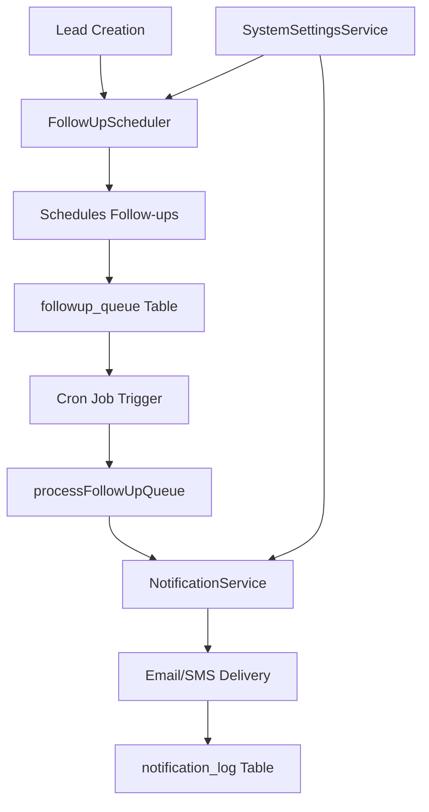
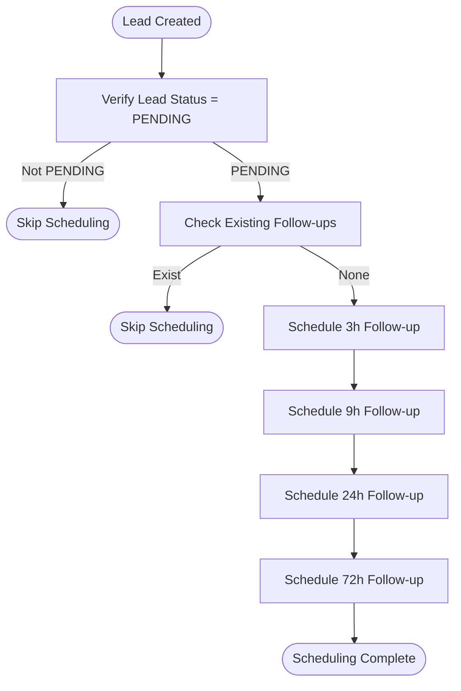
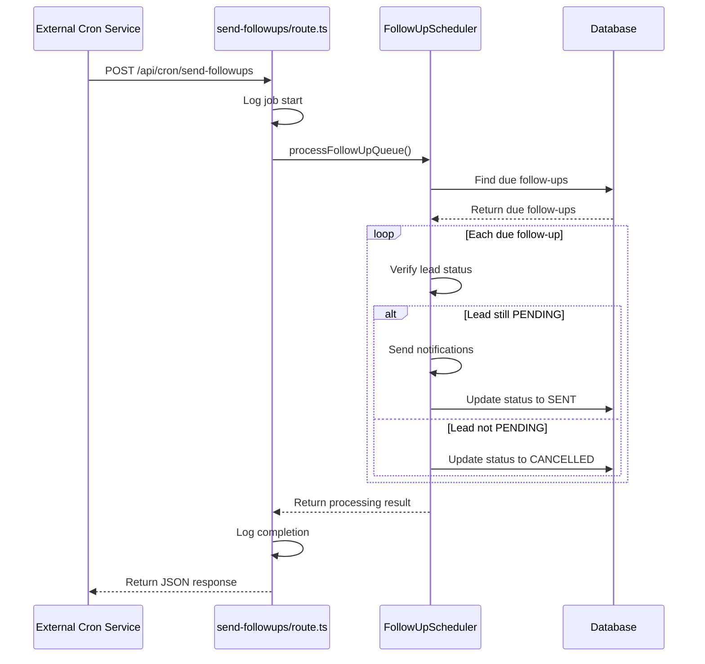
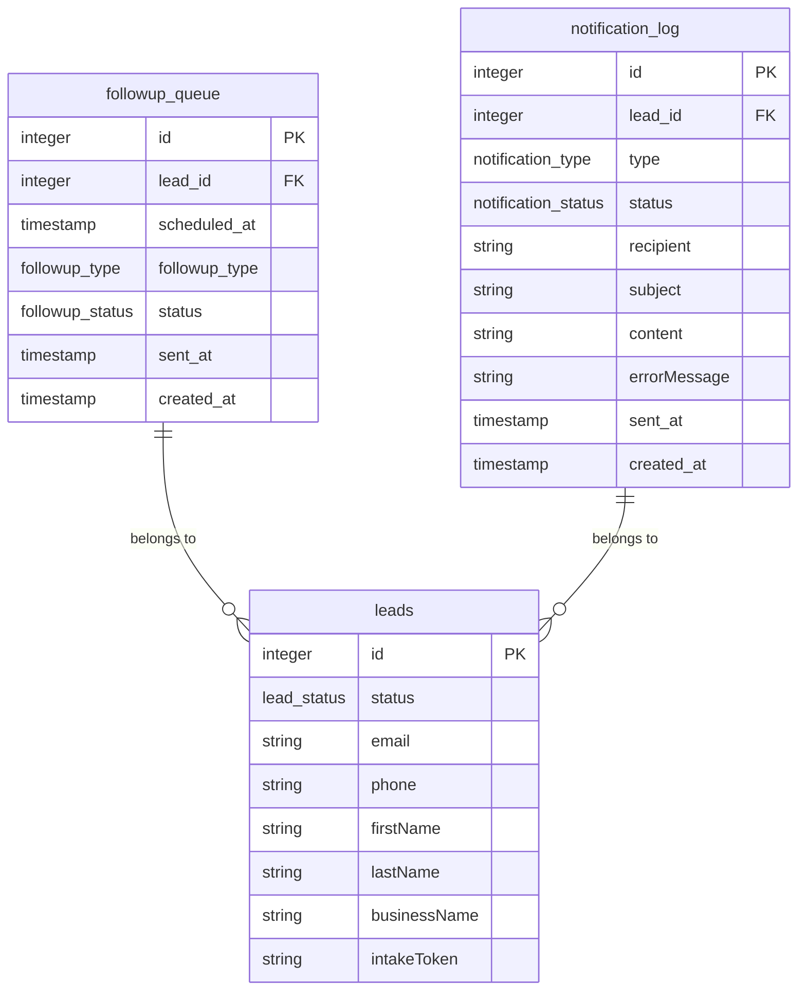
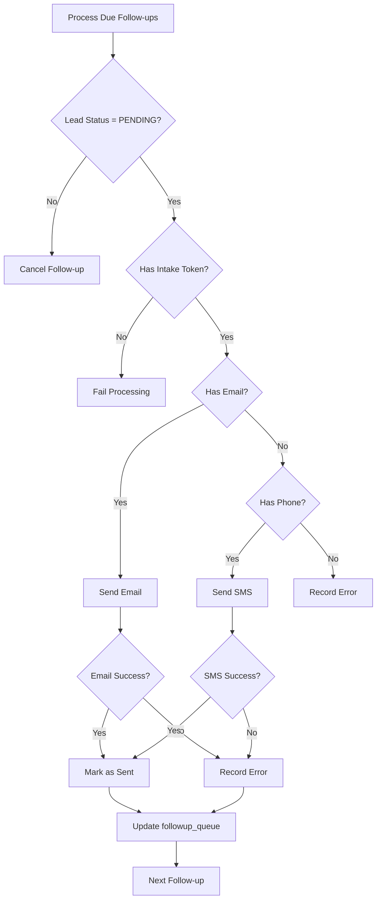
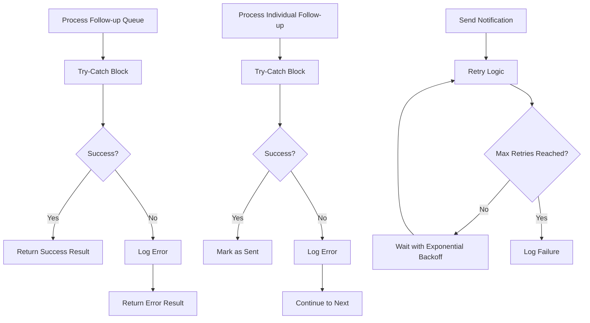

# Follow-Up Scheduling Mechanism

<cite>
**Referenced Files in This Document**   
- [FollowUpScheduler.ts](file://src/services/FollowUpScheduler.ts)
- [send-followups/route.ts](file://src/app/api/cron/send-followups/route.ts)
- [NotificationService.ts](file://src/services/NotificationService.ts)
- [SystemSettingsService.ts](file://src/services/SystemSettingsService.ts)
- [migration.sql](file://prisma/migrations/20240101000000_init/migration.sql)
</cite>

## Table of Contents
1. [Introduction](#introduction)
2. [Core Components](#core-components)
3. [Scheduling Algorithm](#scheduling-algorithm)
4. [Cron Job Integration](#cron-job-integration)
5. [Database Schema](#database-schema)
6. [Notification Processing](#notification-processing)
7. [Idempotent Processing Pattern](#idempotent-processing-pattern)
8. [Error Recovery and Monitoring](#error-recovery-and-monitoring)
9. [Business Logic and Templates](#business-logic-and-templates)
10. [Security and Authentication](#security-and-authentication)

## Introduction
The Follow-Up Scheduling Mechanism is a critical component of the merchant funding application system that ensures timely communication with leads through automated follow-up messages. This system schedules and processes follow-up notifications at strategic intervals (3h, 9h, 24h, and 72h) after lead creation to maximize conversion rates. The mechanism integrates with external notification services for email and SMS delivery while maintaining robust error handling, idempotent processing, and comprehensive monitoring capabilities.

**Section sources**
- [FollowUpScheduler.ts](file://src/services/FollowUpScheduler.ts#L1-L50)

## Core Components

The follow-up scheduling system consists of several interconnected components that work together to deliver timely notifications to leads. The primary components include the FollowUpScheduler service, the cron job endpoint, the NotificationService, and the underlying database schema.



**Diagram sources**
- [FollowUpScheduler.ts](file://src/services/FollowUpScheduler.ts#L1-L490)
- [send-followups/route.ts](file://src/app/api/cron/send-followups/route.ts#L1-L103)
- [NotificationService.ts](file://src/services/NotificationService.ts#L1-L472)

**Section sources**
- [FollowUpScheduler.ts](file://src/services/FollowUpScheduler.ts#L1-L490)
- [send-followups/route.ts](file://src/app/api/cron/send-followups/route.ts#L1-L103)

## Scheduling Algorithm

The scheduling algorithm determines when follow-up messages should be sent based on the time of lead creation. When a new lead is created with "PENDING" status, the system automatically schedules four follow-up messages at predetermined intervals.



The algorithm uses the following intervals defined in the FollowUpScheduler class:

**Follow-up Intervals**
- **THREE_HOUR**: 3 * 60 * 60 * 1000 milliseconds (3 hours)
- **NINE_HOUR**: 9 * 60 * 60 * 1000 milliseconds (9 hours)
- **TWENTY_FOUR_H**: 24 * 60 * 60 * 1000 milliseconds (24 hours)
- **SEVENTY_TWO_H**: 72 * 60 * 60 * 1000 milliseconds (72 hours)

When a lead is created, the system:
1. Verifies the lead exists and has "PENDING" status
2. Checks if follow-ups are already scheduled for this lead
3. Calculates the scheduled time for each follow-up by adding the interval to the current time
4. Creates records in the followup_queue table for each follow-up type

**Section sources**
- [FollowUpScheduler.ts](file://src/services/FollowUpScheduler.ts#L15-L97)

## Cron Job Integration

The follow-up processing is triggered via a cron job that calls the `/api/cron/send-followups` endpoint. This endpoint is secured and designed to be called by external scheduling services like cron or cloud-based schedulers.



The endpoint supports two HTTP methods:
- **POST**: Processes the follow-up queue and sends due notifications
- **GET**: Retrieves follow-up queue statistics for monitoring

The POST endpoint returns different status codes based on the outcome:
- **200 OK**: Successful processing with no errors
- **207 Multi-Status**: Partial success (some follow-ups processed, some failed)
- **500 Internal Server Error**: Complete failure

**Diagram sources**
- [send-followups/route.ts](file://src/app/api/cron/send-followups/route.ts#L7-L103)

**Section sources**
- [send-followups/route.ts](file://src/app/api/cron/send-followups/route.ts#L7-L103)

## Database Schema

The follow-up scheduling system relies on a well-defined database schema to store and manage follow-up records. The primary table is `followup_queue`, which stores all scheduled follow-up messages.



**Table: followup_queue**
- **id**: Primary key (SERIAL)
- **lead_id**: Foreign key referencing leads.id (INTEGER, NOT NULL)
- **scheduled_at**: Timestamp when the follow-up should be sent (TIMESTAMP, NOT NULL)
- **followup_type**: Type of follow-up ('3h', '9h', '24h', '72h') (followup_type, NOT NULL)
- **status**: Current status of the follow-up ('pending', 'sent', 'cancelled') (followup_status, NOT NULL, DEFAULT 'pending')
- **sent_at**: Timestamp when the follow-up was sent (TIMESTAMP)
- **created_at**: Timestamp when the record was created (TIMESTAMP, NOT NULL, DEFAULT CURRENT_TIMESTAMP)

The schema also includes enum types:
- **followup_type**: ENUM ('3h', '9h', '24h', '72h')
- **followup_status**: ENUM ('pending', 'sent', 'cancelled')

**Diagram sources**
- [migration.sql](file://prisma/migrations/20240101000000_init/migration.sql#L47-L88)

**Section sources**
- [migration.sql](file://prisma/migrations/20240101000000_init/migration.sql#L47-L88)
- [FollowUpScheduler.ts](file://src/services/FollowUpScheduler.ts#L99-L146)

## Notification Processing

The notification processing system handles the delivery of follow-up messages through multiple channels (email and SMS) with built-in retry logic and rate limiting.



The NotificationService processes notifications with the following workflow:
1. Validates that the notification channel is enabled via system settings
2. Checks rate limits to prevent spamming
3. Creates a notification_log entry with PENDING status
4. Attempts to send the notification with exponential backoff retry logic
5. Updates the notification_log status to SENT or FAILED
6. Returns the result to the calling service

The service implements rate limiting with the following rules:
- Maximum of 2 notifications per hour per recipient
- Maximum of 10 notifications per day per lead

**Section sources**
- [NotificationService.ts](file://src/services/NotificationService.ts#L1-L472)
- [FollowUpScheduler.ts](file://src/services/FollowUpScheduler.ts#L281-L322)

## Idempotent Processing Pattern

The system implements an idempotent processing pattern to prevent duplicate notifications and ensure reliable message delivery even in the face of failures.

```mermaid
classDiagram
class FollowUpScheduler {
+processFollowUpQueue()
+scheduleFollowUpsForLead()
+cancelFollowUpsForLead()
}
class NotificationService {
+sendEmail()
+sendSMS()
+executeWithRetry()
}
class Database {
+followup_queue
+notification_log
}
FollowUpScheduler --> NotificationService : "uses"
FollowUpScheduler --> Database : "queries and updates"
NotificationService --> Database : "logs notifications"
note right of FollowUpScheduler
Implements idempotent processing :
- Checks lead status before sending
- Updates status to SENT after delivery
- Prevents reprocessing of sent follow-ups
end
note right of NotificationService
Implements idempotent delivery :
- Exponential backoff retry
- Rate limiting
- Transactional logging
end
```

Key aspects of the idempotent processing pattern:

**Status-Based Processing**
The system uses status flags to ensure each follow-up is processed exactly once:
- **PENDING**: Follow-up is scheduled and awaiting processing
- **SENT**: Follow-up has been successfully delivered
- **CANCELLED**: Follow-up was cancelled (lead status changed)

When processing the queue, the system only selects follow-ups with PENDING status and scheduled_at <= current time. After processing, the status is updated to either SENT or CANCELLED, preventing reprocessing.

**Atomic Updates**
Database operations are performed atomically to prevent race conditions:
```typescript
await prisma.followupQueue.update({
  where: { id: followUp.id },
  data: {
    status: FollowupStatus.SENT,
    sentAt: new Date(),
  },
});
```

**Lead Status Validation**
Before sending a follow-up, the system validates that the lead is still in PENDING status:
```typescript
if (followUp.lead.status !== LeadStatus.PENDING) {
  // Cancel this follow-up since lead is no longer pending
  await prisma.followupQueue.update({
    where: { id: followUp.id },
    data: { status: FollowupStatus.CANCELLED },
  });
  continue;
}
```

**Section sources**
- [FollowUpScheduler.ts](file://src/services/FollowUpScheduler.ts#L148-L282)

## Error Recovery and Monitoring

The system includes comprehensive error recovery mechanisms and monitoring capabilities to ensure reliability and provide visibility into system performance.

### Error Handling
The follow-up processing includes multiple layers of error handling:



Error recovery features include:
- **Retry Logic**: The NotificationService implements exponential backoff retry with configurable parameters
- **Error Logging**: All errors are logged with detailed context for debugging
- **Partial Success**: The system continues processing other follow-ups even if some fail
- **Graceful Degradation**: If one notification channel fails, the system attempts others

### Monitoring
The system provides several monitoring endpoints and metrics:

**Processing Statistics**
The FollowUpScheduler includes a method to retrieve follow-up statistics:
```typescript
async getFollowUpStats() {
  const stats = await prisma.followupQueue.groupBy({
    by: ["followupType", "status"],
    _count: true,
  });
  
  const totalPending = await prisma.followupQueue.count({
    where: { status: FollowupStatus.PENDING },
  });
  
  const dueSoon = await prisma.followupQueue.count({
    where: {
      status: FollowupStatus.PENDING,
      scheduledAt: {
        lte: new Date(Date.now() + 60 * 60 * 1000), // Due within 1 hour
      },
    },
  });
  
  return { totalPending, dueSoon, breakdown: stats };
}
```

**Processing Latency**
The cron endpoint measures and reports processing time:
```typescript
const startTime = Date.now();
// ... processing ...
const processingTime = Date.now() - startTime;
```

**Health Indicators**
Key health indicators include:
- **totalPending**: Total number of pending follow-ups
- **dueSoon**: Number of follow-ups due within the next hour
- **processingTime**: Time taken to process the queue
- **errorRate**: Percentage of follow-ups that failed

**Section sources**
- [FollowUpScheduler.ts](file://src/services/FollowUpScheduler.ts#L440-L489)
- [send-followups/route.ts](file://src/app/api/cron/send-followups/route.ts#L70-L103)

## Business Logic and Templates

The follow-up system incorporates business logic to determine message relevance and uses templated messages that vary by follow-up interval.

### Message Templates
The system uses different message templates for each follow-up interval, with increasing urgency as time progresses:

```mermaid
flowchart TD
A[THREE_HOUR] --> B["Subject: Quick Reminder: Complete Your Merchant Funding Application"]
A --> C["Urgency: We wanted to follow up quickly"]
A --> D["Timeframe: just a few hours ago"]
E[NINE_HOUR] --> F["Subject: Don't Miss Out: Your Merchant Funding Application"]
E --> G["Urgency: We noticed you haven't completed"]
E --> H["Timeframe: earlier today"]
I[TWENTY_FOUR_H] --> J["Subject: Final Reminder: Complete Your Application Today"]
I --> K["Urgency: This is a friendly reminder"]
I --> L["Timeframe: yesterday"]
M[SEVENTY_TWO_H] --> N["Subject: Last Chance: Your Merchant Funding Application Expires Soon"]
M --> O["Urgency: This is your final reminder"]
M --> P["Timeframe: a few days ago"]
```



The message content is generated dynamically based on:
- **Lead Name**: Uses firstName and lastName if available, otherwise businessName
- **Intake URL**: Personalized URL for completing the application
- **Follow-up Type**: Determines the urgency and timeframe wording

### Business Logic
The system applies several business rules to determine message relevance:

**Lead Status Check**
Follow-ups are only sent to leads with PENDING status:
```typescript
if (followUp.lead.status !== LeadStatus.PENDING) {
  await prisma.followupQueue.update({
    where: { id: followUp.id },
    data: { status: FollowupStatus.CANCELLED },
  });
  continue;
}
```

**Intake Token Validation**
Follow-ups require a valid intake token:
```typescript
if (!followUp.lead.intakeToken) {
  errors.push("Lead has no intake token");
  return { success: false, errors };
}
```

**Channel Availability**
Messages are only sent if the corresponding contact information is available:
- Email messages require a valid email address
- SMS messages require a valid phone number

The system attempts to send notifications through all available channels, considering the follow-up successful if at least one channel succeeds.

**Section sources**
- [FollowUpScheduler.ts](file://src/services/FollowUpScheduler.ts#L322-L439)

## Security and Authentication

The follow-up scheduling system implements several security measures to protect against unauthorized access and ensure proper authentication.

### Endpoint Protection
The cron job endpoint is designed to be called by trusted external services. While the code doesn't show explicit authentication, the endpoint naming convention (`/api/cron/`) suggests it's intended for internal/cron use only.

### Configuration Management
Notification settings are managed through the SystemSettingsService, which provides a secure way to configure notification behavior:

```mermaid
classDiagram
class SystemSettingsService {
+getSetting()
+updateSetting()
+getSettingsByCategory()
+validateSettingValue()
}
class NotificationService {
+getNotificationSettings()
+validateConfiguration()
}
SystemSettingsService <|-- NotificationService : "depends on"
note right of SystemSettingsService
Security features :
- Type validation
- User audit trails
- Cache with TTL
- Input validation
end
```

The system uses environment variables for sensitive credentials:
- **MAILGUN_API_KEY**: API key for Mailgun email service
- **MAILGUN_DOMAIN**: Mailgun domain
- **MAILGUN_FROM_EMAIL**: Sender email address
- **TWILIO_ACCOUNT_SID**: Twilio account SID
- **TWILIO_AUTH_TOKEN**: Twilio authentication token
- **TWILIO_PHONE_NUMBER**: Twilio phone number

The NotificationService validates configuration on startup:
```typescript
async validateConfiguration(): Promise<boolean> {
  const requiredEmailVars = [
    'MAILGUN_API_KEY',
    'MAILGUN_DOMAIN',
    'MAILGUN_FROM_EMAIL',
  ];
  
  const requiredSmsVars = [
    'TWILIO_ACCOUNT_SID',
    'TWILIO_AUTH_TOKEN',
    'TWILIO_PHONE_NUMBER',
  ];
  
  // Check for missing environment variables
  // Validate client initialization
}
```

### Rate Limiting
The system implements rate limiting to prevent abuse:
- Maximum of 2 notifications per hour per recipient
- Maximum of 10 notifications per day per lead

These limits are enforced in the NotificationService's checkRateLimit method.

**Section sources**
- [NotificationService.ts](file://src/services/NotificationService.ts#L399-L446)
- [SystemSettingsService.ts](file://src/services/SystemSettingsService.ts#L1-L199)