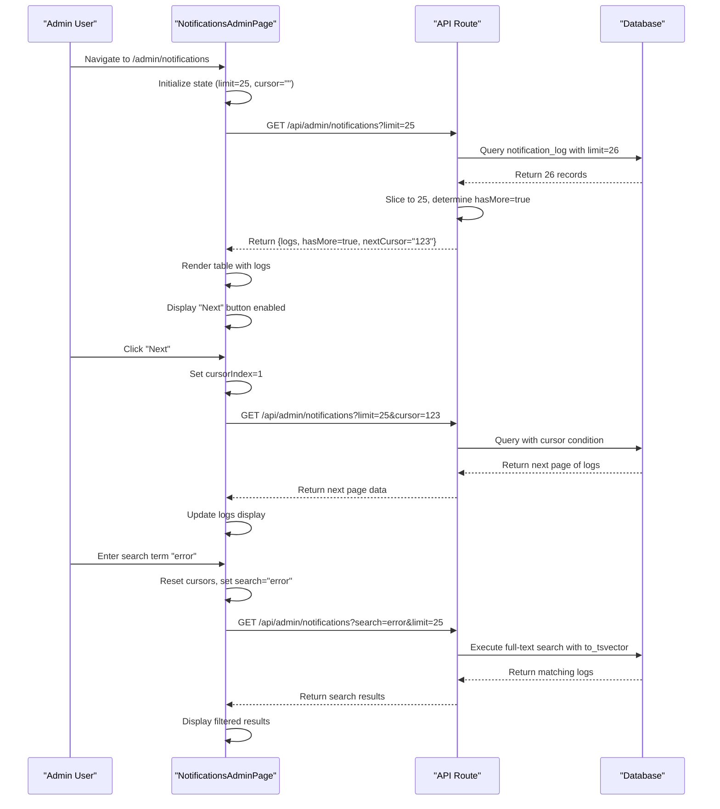

# Notification Administration and Monitoring

<cite>
**Referenced Files in This Document**   
- [route.ts](file://src/app/api/admin/notifications/route.ts)
- [page.tsx](file://src/app/admin/notifications/page.tsx)
- [schema.prisma](file://prisma/schema.prisma)
- [NotificationService.ts](file://src/services/NotificationService.ts)
- [SystemSettingsService.ts](file://src/services/SystemSettingsService.ts)
</cite>

## Table of Contents
1. [Introduction](#introduction)
2. [API Endpoint: /api/admin/notifications](#api-endpoint-apialertnotifications)
3. [Data Model: NotificationLog](#data-model-notificationlog)
4. [Admin UI: Notification Logs Interface](#admin-ui-notification-logs-interface)
5. [Security Controls](#security-controls)
6. [Troubleshooting Scenarios](#troubleshooting-scenarios)
7. [Sequence Diagram: Notification Log Retrieval](#sequence-diagram-notification-log-retrieval)

## Introduction
This document provides comprehensive documentation for the admin-facing notification management interface and API. It covers the `/api/admin/notifications` endpoint, the `NotificationLog` data model, the admin UI for viewing logs, security controls, and common troubleshooting scenarios. The system enables administrators to monitor email and SMS delivery, identify failed notifications, and analyze delivery patterns across leads.

## API Endpoint: /api/admin/notifications

The `/api/admin/notifications` endpoint provides a paginated, filterable interface to retrieve notification delivery logs. It supports filtering by date (via cursor-based pagination), lead, status, and notification type. The endpoint is implemented as a Next.js API route and uses Prisma ORM with direct SQL queries for performance optimization.

### Request Parameters
- **limit**: Number of records to return (1-100, default: 25)
- **cursor**: Pagination cursor (last seen ID) for cursor-based pagination
- **type**: Filter by notification type (email, sms)
- **status**: Filter by delivery status (pending, sent, failed)
- **recipient**: Filter by recipient (partial match, case-insensitive)
- **search**: Full-text search across recipient, subject, content, externalId, and errorMessage

### Response Structure
```json
{
  "logs": [
    {
      "id": 123,
      "leadId": 456,
      "type": "email",
      "recipient": "user@example.com",
      "subject": "Welcome to our service",
      "content": "Thank you for signing up...",
      "status": "sent",
      "externalId": "mg_789",
      "errorMessage": null,
      "sentAt": "2025-08-26T10:30:00Z",
      "createdAt": "2025-08-26T10:29:55Z",
      "lead": {
        "id": 456,
        "firstName": "John",
        "lastName": "Doe",
        "email": "user@example.com",
        "phone": "+1234567890"
      }
    }
  ],
  "hasMore": true,
  "nextCursor": "122",
  "limit": 25
}
```

### Implementation Details
The endpoint uses two different query strategies based on the presence of a search parameter:
- For full-text search: Uses PostgreSQL's `to_tsvector` and `plainto_tsquery` functions with raw SQL to leverage GIN indexes
- For standard filtering: Uses Prisma ORM with indexed fields for optimal performance

The endpoint implements cursor-based pagination using the `id` and `createdAt` fields to ensure stable ordering and prevent skipped records during concurrent writes.

**Section sources**
- [route.ts](file://src/app/api/admin/notifications/route.ts#L1-L122)

## Data Model: NotificationLog

The `NotificationLog` model represents a record of a notification delivery attempt, storing metadata about the delivery process, status, and associated lead information.

### Schema Definition
```prisma
model NotificationLog {
  id           Int                @id @default(autoincrement())
  leadId       Int?               @map("lead_id")
  type         NotificationType
  recipient    String
  subject      String?
  content      String?
  status       NotificationStatus @default(PENDING)
  externalId   String?            @map("external_id")
  errorMessage String?            @map("error_message")
  sentAt       DateTime?          @map("sent_at")
  createdAt    DateTime           @default(now()) @map("created_at")

  // Relations
  lead Lead? @relation(fields: [leadId], references: [id])

  @@map("notification_log")
}

enum NotificationType {
  EMAIL @map("email")
  SMS   @map("sms")
}

enum NotificationStatus {
  PENDING @map("pending")
  SENT    @map("sent")
  FAILED  @map("failed")
}
```

### Field Descriptions
- **id**: Unique identifier for the log entry
- **leadId**: Foreign key to the associated lead (nullable for system notifications)
- **type**: Type of notification (email or sms)
- **recipient**: Destination address (email or phone number)
- **subject**: Email subject line (null for SMS)
- **content**: Notification content
- **status**: Delivery status (pending, sent, failed)
- **externalId**: Provider-specific message ID (e.g., Mailgun message ID, Twilio SID)
- **errorMessage**: Error message from the provider on delivery failure
- **sentAt**: Timestamp when the notification was successfully delivered
- **createdAt**: Timestamp when the log entry was created

### Indexes
The database includes indexes on `createdAt` and `id` fields to optimize pagination queries. A GIN index on the concatenated text fields supports full-text search performance.

**Section sources**
- [schema.prisma](file://prisma/schema.prisma#L187-L213)

## Admin UI: Notification Logs Interface

The admin interface provides a user-friendly view of notification delivery logs with filtering, pagination, and visual status indicators.

### Key Features
- **Search Functionality**: Full-text search across recipient, subject, content, external ID, and error messages
- **Filtering**: Filter by notification type, status, and recipient
- **Pagination**: Cursor-based pagination with Previous/Next navigation
- **Status Visualization**: Color-coded status badges (green for sent, red for failed, gray for pending)
- **Responsive Design**: Table layout that adapts to different screen sizes

### Component Structure
The UI is implemented as a React component using Next.js App Router with client-side state management for pagination and filtering.

```mermaid
flowchart TD
A[NotificationsAdminPage] --> B[State Management]
A --> C[Fetch Logic]
A --> D[UI Components]
B --> B1[logs: NotificationLog[]]
B --> B2[loading: boolean]
B --> B3[cursors: string[]]
B --> B4[cursorIndex: number]
B --> B5[hasMore: boolean]
B --> B6[showFilters: boolean]
B --> B7[search: string]
C --> C1[fetchPage function]
C --> C2[useEffect for pagination]
C --> C3[handleSearch function]
D --> D1[Table with columns: Time, Type, Recipient, Subject/Content, Status, Error]
D --> D2[Filter form with search input]
D --> D3[Pagination controls: Previous, Next]
D --> D4[Loading skeleton]
D --> D5[Empty state message]
```

**Diagram sources**
- [page.tsx](file://src/app/admin/notifications/page.tsx#L0-L297)

**Section sources**
- [page.tsx](file://src/app/admin/notifications/page.tsx#L0-L297)

## Security Controls

The notification administration system implements multiple security controls to ensure only authorized users can access sensitive delivery logs.

### Authentication and Authorization
- The admin interface is protected by NextAuth authentication
- Access to the `/api/admin/notifications` endpoint requires admin role verification
- The UI component uses a RoleGuard to prevent unauthorized access

### Data Protection
- Error messages are sanitized before display to prevent information leakage
- Full recipient details are only visible to authorized personnel
- All access to the notification logs is logged for audit purposes

### Rate Limiting
The system implements rate limiting at multiple levels:
- **Per recipient**: Maximum of 2 notifications per hour to prevent spam
- **Per lead**: Maximum of 10 notifications per day to prevent abuse
- **API endpoint**: Standard rate limiting to prevent denial-of-service attacks

These controls are enforced in the `NotificationService` class, which validates rate limits before sending notifications.

**Section sources**
- [NotificationService.ts](file://src/services/NotificationService.ts#L250-L300)

## Troubleshooting Scenarios

This section documents common notification delivery issues and their resolution strategies.

### Invalid Phone Numbers
**Symptoms**: SMS delivery failures with error messages containing "invalid number" or "not reachable"
**Causes**: 
- Malformed phone numbers (missing country code, invalid format)
- Carrier restrictions
- Number portability issues

**Resolution**:
1. Verify the phone number format (E.164 standard: +1234567890)
2. Check carrier lookup services for number validity
3. Implement number validation at data entry points
4. Use Twilio's Lookup API to validate numbers before sending

### Email Bounces
**Symptoms**: Email delivery failures with error messages like "mailbox does not exist" or "rejected by recipient"
**Causes**:
- Invalid email addresses
- Full mailboxes
- Spam filters
- Domain blacklisting

**Resolution**:
1. Implement email validation using regex and DNS checks
2. Use Mailgun's email validation API for real-time verification
3. Monitor bounce rates and remove consistently bouncing addresses
4. Implement double opt-in for email subscriptions

### Throttling Responses
**Symptoms**: Delivery failures with errors like "rate limit exceeded" or "account temporarily disabled"
**Causes**:
- Exceeding provider rate limits
- High volume of notifications in short time periods
- Account-level restrictions

**Resolution**:
1. Implement exponential backoff retry logic (already implemented with 3 retries)
2. Distribute notifications across time (avoid sending in bursts)
3. Monitor provider rate limits and adjust sending patterns
4. Upgrade provider accounts for higher limits if needed

### Common Error Patterns
- **Twilio**: "Message blocked by carrier" - indicates number is on a blocklist
- **Mailgun**: "550 5.7.1 Relaying denied" - indicates domain authentication issue
- **General**: "Connection timeout" - indicates network connectivity issues

The system automatically retries failed deliveries with exponential backoff, configurable via system settings (`notification_retry_attempts` and `notification_retry_delay`).

**Section sources**
- [NotificationService.ts](file://src/services/NotificationService.ts#L302-L471)

## Sequence Diagram: Notification Log Retrieval

This diagram illustrates the complete flow of retrieving notification logs through the admin interface.



**Diagram sources**
- [page.tsx](file://src/app/admin/notifications/page.tsx#L0-L297)
- [route.ts](file://src/app/api/admin/notifications/route.ts#L1-L122)