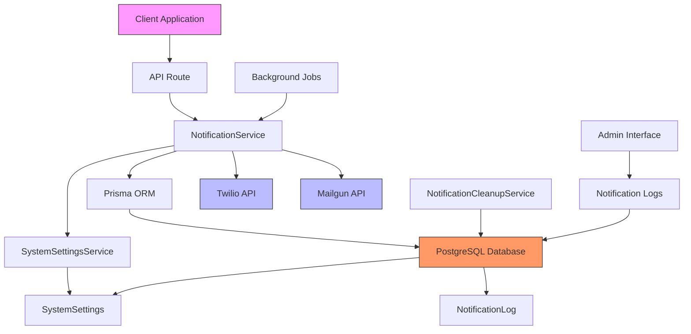
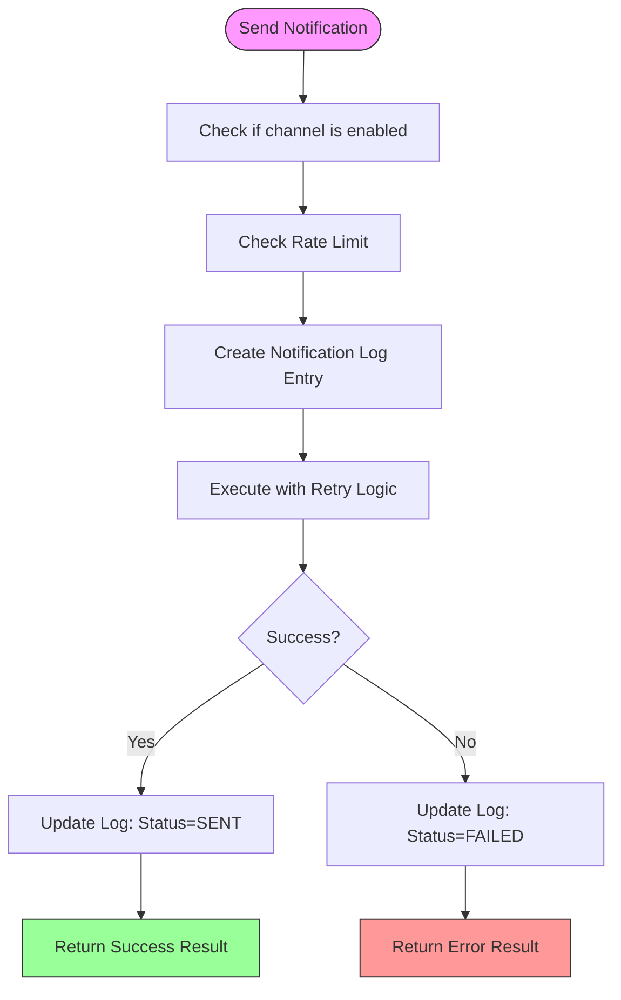
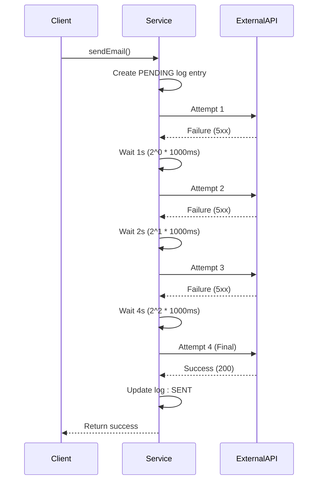
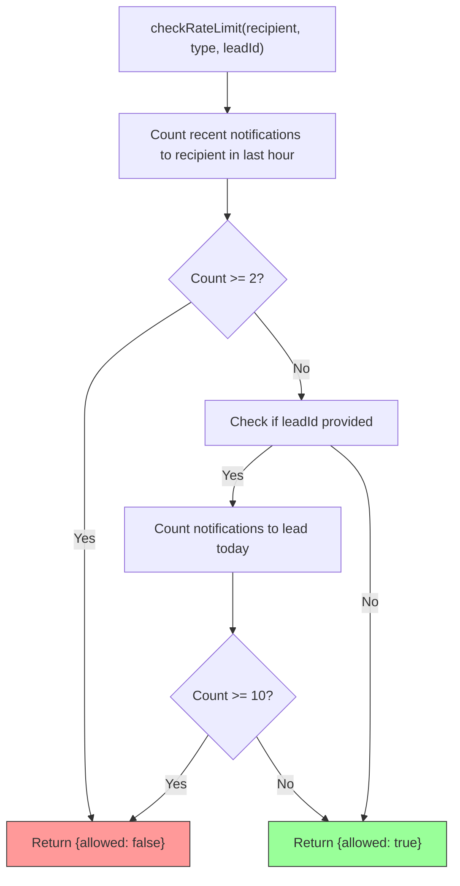
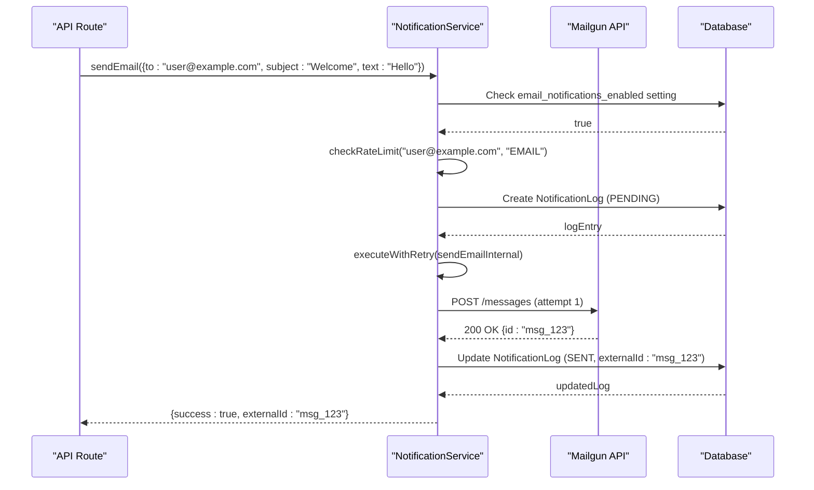
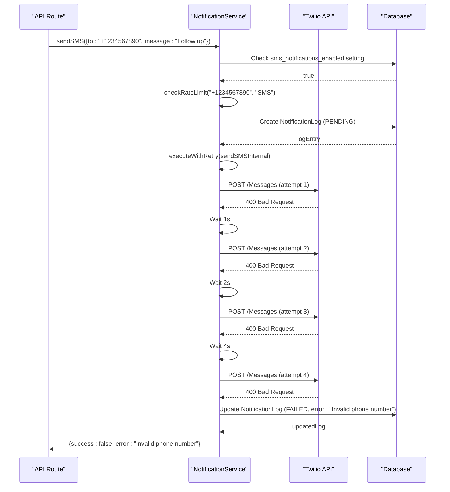
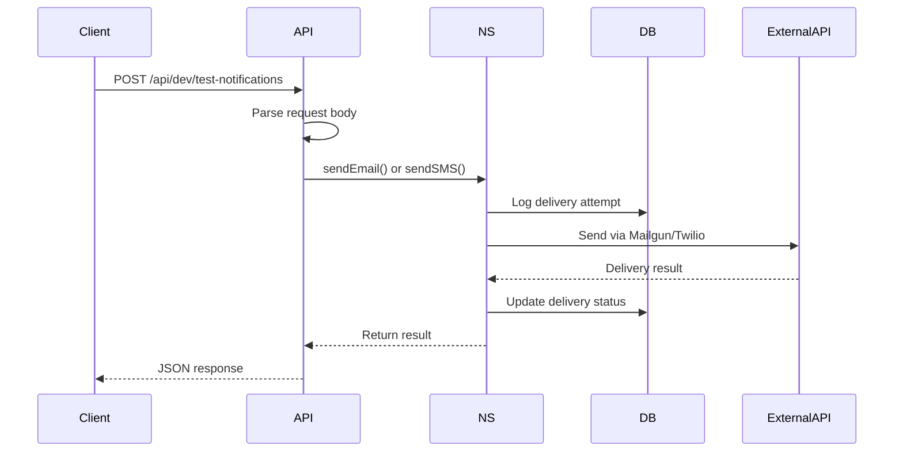
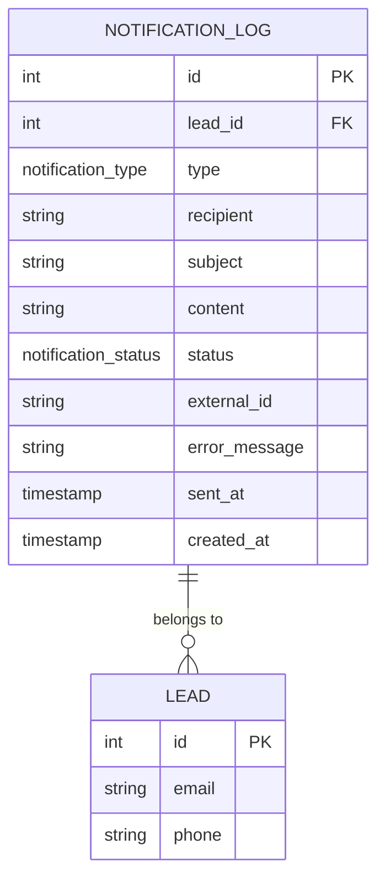
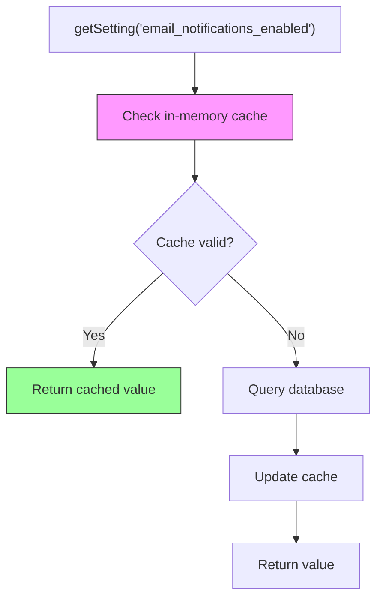

# Notification Service Core

<cite>
**Referenced Files in This Document**   
- [NotificationService.ts](file://src/services/NotificationService.ts)
- [SystemSettingsService.ts](file://src/services/SystemSettingsService.ts)
- [schema.prisma](file://prisma/schema.prisma)
- [route.ts](file://src/app/api/admin/notifications/route.ts)
- [route.ts](file://src/app/api/dev/test-notifications/route.ts)
- [20250812120000_add_notification_log_indexes/migration.sql](file://prisma/migrations/20250812120000_add_notification_log_indexes/migration.sql)
- [NotificationCleanupService.ts](file://src/services/NotificationCleanupService.ts)
</cite>

## Table of Contents
1. [Introduction](#introduction)
2. [Core Components](#core-components)
3. [Architecture Overview](#architecture-overview)
4. [Detailed Component Analysis](#detailed-component-analysis)
5. [Notification Flow Examples](#notification-flow-examples)
6. [Configuration and Environment Setup](#configuration-and-environment-setup)
7. [Integration and Service Invocation](#integration-and-service-invocation)
8. [Error Handling and Monitoring](#error-handling-and-monitoring)
9. [Performance and Optimization](#performance-and-optimization)

## Introduction
The Notification Service Core is responsible for managing the delivery of email and SMS notifications through third-party providers Mailgun and Twilio. It implements robust retry logic, rate limiting, and comprehensive logging to ensure reliable and secure communication. The service integrates with the application's database via Prisma ORM, logs all delivery attempts to the NotificationLog model, and supports dynamic configuration through system settings. This document provides a comprehensive analysis of its implementation, covering architecture, functionality, error handling, and integration patterns.

## Core Components
The core functionality of the notification system is implemented in the `NotificationService` class, which handles both email and SMS delivery. It leverages the `SystemSettingsService` for dynamic configuration and uses Prisma to interact with the database. The service supports retry mechanisms with exponential backoff, rate limiting to prevent spam, and detailed logging of all notification attempts. Key components include the unified `sendNotification` interface (via `sendEmail` and `sendSMS`), message templating capabilities, and integration with external APIs.

**Section sources**
- [NotificationService.ts](file://src/services/NotificationService.ts#L1-L471)
- [SystemSettingsService.ts](file://src/services/SystemSettingsService.ts#L1-L351)

## Architecture Overview



**Diagram sources**
- [NotificationService.ts](file://src/services/NotificationService.ts#L1-L471)
- [SystemSettingsService.ts](file://src/services/SystemSettingsService.ts#L1-L351)
- [schema.prisma](file://prisma/schema.prisma#L1-L257)

## Detailed Component Analysis

### Notification Service Implementation

#### Class Structure and Dependencies
```mermaid
classDiagram
class NotificationService {
-twilioClient : Twilio | null
-mailgunClient : any | null
-config : NotificationConfig
+sendEmail(notification : EmailNotification) : Promise~NotificationResult~
+sendSMS(notification : SMSNotification) : Promise~NotificationResult~
-sendEmailInternal(notification : EmailNotification) : Promise~NotificationResult~
-sendSMSInternal(notification : SMSNotification) : Promise~NotificationResult~
-executeWithRetry~T~(fn : () => Promise~T~, operationType : string) : Promise~T~
-checkRateLimit(recipient : string, type : 'EMAIL' | 'SMS', leadId? : number) : Promise~{ allowed : boolean; reason? : string }~
+validateConfiguration() : Promise~boolean~
+getNotificationStats(leadId : number) : Promise~Record~string, number~~
+getRecentNotifications(limit : number = 50) : Promise~NotificationLog[]~
}
class SystemSettingsService {
+getSetting~T~(key : string, type : T) : Promise~SystemSettingValue[T]~
+getSettingWithDefault~T~(key : string, type : T, fallback : SystemSettingValue[T]) : Promise~SystemSettingValue[T]~
+getSettingRaw(key : string) : Promise~SystemSetting | null~
+updateSetting(key : string, value : string, updatedBy? : number) : Promise~SystemSetting~
+updateSettings(updates : { key : string; value : string }[], updatedBy? : number) : Promise~SystemSetting[]~
+resetSetting(key : string, updatedBy? : number) : Promise~SystemSetting~
+resetCategorySettings(category : SystemSettingCategory, updatedBy? : number) : Promise~SystemSetting[]~
+getSettingsAuditTrail(limit : number = 50) : Promise~SystemSetting[]~
}
class NotificationConfig {
+twilio : { accountSid : string; authToken : string; phoneNumber : string }
+mailgun : { apiKey : string; domain : string; fromEmail : string }
+retryConfig : { maxRetries : number; baseDelay : number; maxDelay : number }
}
NotificationService --> SystemSettingsService : "uses"
NotificationService --> NotificationConfig : "configures"
NotificationService --> "Prisma Client" : "logs to"
SystemSettingsService --> "Prisma Client" : "reads from"
```

**Diagram sources**
- [NotificationService.ts](file://src/services/NotificationService.ts#L1-L471)
- [SystemSettingsService.ts](file://src/services/SystemSettingsService.ts#L1-L351)

#### Unified Notification Interface
The `NotificationService` provides a unified interface for sending notifications through different channels. The service exposes two primary methods: `sendEmail` and `sendSMS`, which follow a consistent pattern for handling delivery attempts, logging, and error management.



**Diagram sources**
- [NotificationService.ts](file://src/services/NotificationService.ts#L1-L471)

### Retry Logic with Exponential Backoff
The service implements a sophisticated retry mechanism using exponential backoff to handle transient failures when communicating with external APIs. This ensures reliable delivery while preventing overwhelming the external services with rapid retry attempts.



**Diagram sources**
- [NotificationService.ts](file://src/services/NotificationService.ts#L300-L345)

### Rate Limiting Implementation
The notification service implements rate limiting to prevent spam and abuse. It enforces limits at both the recipient level (2 notifications per hour) and lead level (10 notifications per day).



**Diagram sources**
- [NotificationService.ts](file://src/services/NotificationService.ts#L350-L405)

## Notification Flow Examples

### Successful Email Delivery Flow


**Diagram sources**
- [NotificationService.ts](file://src/services/NotificationService.ts#L100-L150)

### Failed SMS Delivery Flow


**Diagram sources**
- [NotificationService.ts](file://src/services/NotificationService.ts#L150-L200)

## Configuration and Environment Setup
The notification service is configured through environment variables and dynamic system settings. Environment variables provide the essential API credentials, while system settings allow runtime configuration of behavior without requiring application restarts.

### Environment Variables
The following environment variables must be configured for the service to function:

- **MAILGUN_API_KEY**: API key for Mailgun service authentication
- **MAILGUN_DOMAIN**: Sending domain configured in Mailgun
- **MAILGUN_FROM_EMAIL**: Default sender email address for outgoing messages
- **TWILIO_ACCOUNT_SID**: Account SID for Twilio API authentication
- **TWILIO_AUTH_TOKEN**: Auth token for Twilio API authentication
- **TWILIO_PHONE_NUMBER**: Registered phone number for sending SMS messages

### Dynamic System Settings
The service retrieves configuration from the database through `SystemSettingsService`, allowing administrators to modify behavior at runtime:

```typescript
const settings = await getNotificationSettings();
// Returns:
// {
//   smsEnabled: boolean,
//   emailEnabled: boolean,
//   retryAttempts: number,
//   retryDelay: number
// }
```

These settings are stored in the `system_settings` table with keys:
- `sms_notifications_enabled` (boolean)
- `email_notifications_enabled` (boolean)
- `notification_retry_attempts` (number)
- `notification_retry_delay` (number)

The service validates its configuration on startup through the `validateConfiguration()` method, checking for required environment variables and attempting to initialize API clients.

**Section sources**
- [NotificationService.ts](file://src/services/NotificationService.ts#L50-L90)
- [SystemSettingsService.ts](file://src/services/SystemSettingsService.ts#L200-L250)
- [schema.prisma](file://prisma/schema.prisma#L200-L220)

## Integration and Service Invocation
The notification service is integrated into the application through API routes and can be invoked from various contexts including HTTP requests and background jobs.

### API Route Integration
The service is exposed through development and administrative API endpoints:



**Diagram sources**
- [route.ts](file://src/app/api/dev/test-notifications/route.ts#L1-L109)

### Code Example: Service Invocation
```typescript
// From an API route
import { notificationService } from '@/services/NotificationService';

await notificationService.sendEmail({
  to: 'customer@example.com',
  subject: 'Application Received',
  text: 'Thank you for your application. We will review it shortly.',
  html: '<p>Thank you for your application. We will review it shortly.</p>',
  leadId: 123
});

// From a background job
import { notificationService } from '@/services/NotificationService';

await notificationService.sendSMS({
  to: '+1234567890',
  message: 'Your application is pending. Please complete the process.',
  leadId: 123
});
```

The service is also used in administrative interfaces to retrieve notification logs and statistics:

```typescript
// Get recent notifications for debugging
const recent = await notificationService.getRecentNotifications(50);

// Get delivery statistics for a lead
const stats = await notificationService.getNotificationStats(123);
```

**Section sources**
- [route.ts](file://src/app/api/dev/test-notifications/route.ts#L1-L109)
- [NotificationService.ts](file://src/services/NotificationService.ts#L448-L471)

## Error Handling and Monitoring
The notification service implements comprehensive error handling for both transient and permanent delivery failures, with detailed logging for monitoring and debugging.

### Error Handling Strategy
The service distinguishes between different types of errors:
- **Transient errors**: Network issues, rate limiting, temporary service outages
- **Permanent errors**: Invalid credentials, malformed requests, invalid recipient addresses

Transient errors are handled through the retry mechanism with exponential backoff, while permanent errors result in immediate failure without retries.

### Logging and Monitoring
All notification attempts are logged to the `NotificationLog` model, which captures comprehensive information about each delivery attempt:



**Diagram sources**
- [schema.prisma](file://prisma/schema.prisma#L180-L195)

The log includes:
- **Status tracking**: PENDING, SENT, or FAILED
- **External identifiers**: Message IDs from Mailgun or Twilio for tracking
- **Error details**: Specific error messages for failed deliveries
- **Timestamps**: Creation and delivery times
- **Recipient information**: Email or phone number
- **Associated lead**: Optional relationship to a lead record

Administrative interfaces provide access to these logs through the `/api/admin/notifications` endpoint, which supports filtering, searching, and pagination.

**Section sources**
- [NotificationService.ts](file://src/services/NotificationService.ts#L100-L200)
- [schema.prisma](file://prisma/schema.prisma#L180-L195)
- [route.ts](file://src/app/api/admin/notifications/route.ts#L1-L121)

## Performance and Optimization
The notification system includes several performance optimizations to ensure efficient operation at scale.

### Database Indexing
The `notification_log` table is optimized with indexes to support efficient querying:

```sql
-- Created by migration 20250812120000_add_notification_log_indexes
CREATE INDEX idx_notification_log_created_at_id ON notification_log(created_at DESC, id DESC);
```

This composite index enables efficient cursor-based pagination when retrieving logs in chronological order. The administrative interface uses this index for both filtered and unfiltered queries.

### Caching Strategy
The `SystemSettingsService` implements an in-memory cache with a 5-minute TTL to reduce database queries for frequently accessed configuration values:



**Diagram sources**
- [SystemSettingsService.ts](file://src/services/SystemSettingsService.ts#L150-L200)

### Cleanup and Maintenance
The system includes a `NotificationCleanupService` that periodically removes old notification logs to prevent database bloat:

```typescript
// Cleanup old notifications (older than 30 days)
await cleanupService.cleanupOldNotifications(30);

// Cleanup excessive notifications for a specific lead
await cleanupService.cleanupExcessiveNotificationsForLead(123, 10);
```

Failed notifications are retained for a shorter period (7 days) compared to successful ones (30 days), balancing debugging needs with storage efficiency.

**Section sources**
- [NotificationCleanupService.ts](file://src/services/NotificationCleanupService.ts#L1-L88)
- [20250812120000_add_notification_log_indexes/migration.sql](file://prisma/migrations/20250812120000_add_notification_log_indexes/migration.sql#L1-L10)