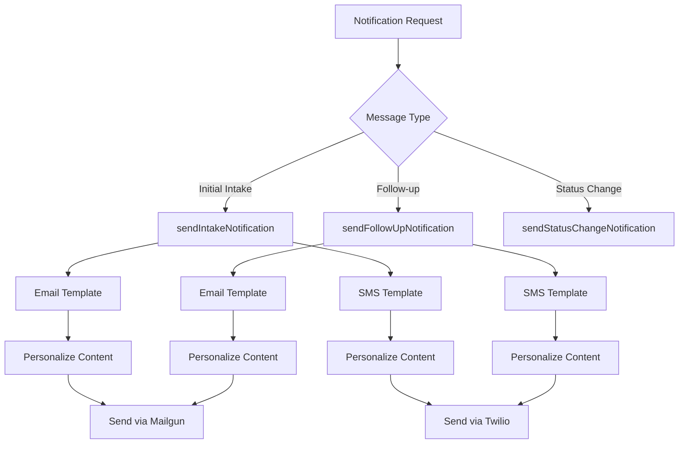
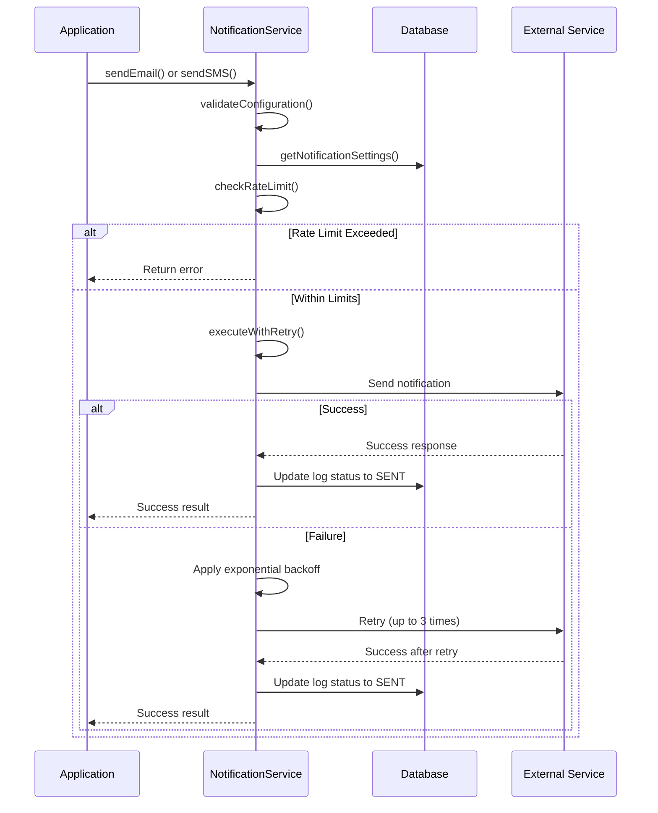
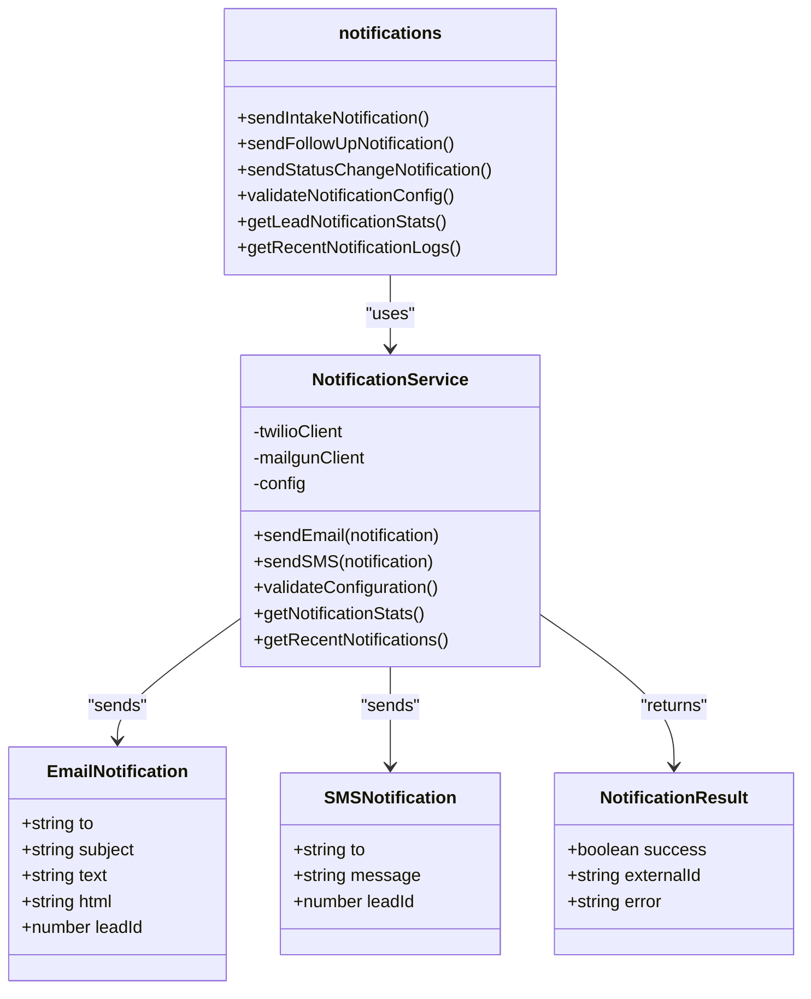

# Notification Templates and Personalization

<cite>
**Referenced Files in This Document**   
- [notifications.ts](file://src/lib/notifications.ts)
- [NotificationService.ts](file://src/services/NotificationService.ts)
- [system-settings.ts](file://prisma/seeds/system-settings.ts)
- [test-mailgun.ts](file://test/test-mailgun.ts)
</cite>

## Table of Contents
1. [Template Registry and Message Types](#template-registry-and-message-types)
2. [Personalization Tokens and Syntax](#personalization-tokens-and-syntax)
3. [Template Loading and Validation](#template-loading-and-validation)
4. [Template Rendering Process](#template-rendering-process)
5. [Email and SMS Template Examples](#email-and-sms-template-examples)
6. [Template Versioning and A/B Testing](#template-versioning-and-ab-testing)
7. [Compliance and Regulatory Requirements](#compliance-and-regulatory-requirements)

## Template Registry and Message Types

The notification system implements a template registry pattern through helper functions in the `notifications.ts` library that manage different message types for the lead lifecycle. The system supports initial confirmation messages and follow-up notifications at various intervals (3-hour, 9-hour, 24-hour, and 72-hour follow-ups). These templates are organized as reusable functions that can be invoked based on the business logic requirements.

The template registry is implemented through exported functions like `sendIntakeNotification` and `sendFollowUpNotification`, which serve as factories for different notification types. This pattern allows for consistent message delivery while maintaining flexibility to customize content based on the context. The system also includes specialized notification types for internal staff communications, such as status change notifications, which follow a similar pattern but are directed internally rather than to leads.

**Diagram sources**
- [notifications.ts](file://src/lib/notifications.ts#L15-L220)

**Section sources**
- [notifications.ts](file://src/lib/notifications.ts#L15-L220)

## Personalization Tokens and Syntax

The system uses a simple string interpolation syntax for personalization tokens, implementing them directly through JavaScript template literals rather than a dedicated templating engine. Personalization tokens are represented as variables within template strings, using the format `${variableName}`. The system supports several key personalization tokens including `{{firstName}}`, `{{lastName}}`, `{{businessName}}`, and `{{applicationLink}}` (referred to as `intakeUrl` in the code).

When templates are processed, these tokens are replaced with actual lead data retrieved from the database. The personalization process occurs within the notification helper functions, where lead data is destructured and used to populate template strings. For example, the `sendIntakeNotification` function extracts `firstName`, `lastName`, and `businessName` from the lead data and uses them to customize both email and SMS messages. The full name is constructed using `[firstName, lastName].filter(Boolean).join(" ")` to handle cases where one name component might be missing.

The system also personalizes URLs by constructing the `intakeUrl` from the `INTAKE_BASE_URL` environment variable and the lead's `intakeToken`. This creates a unique, secure link for each lead that allows them to continue their application process. Business names are conditionally included in messages using ternary operators to ensure grammatical correctness when the business name is present or absent.

**Section sources**
- [notifications.ts](file://src/lib/notifications.ts#L15-L220)

## Template Loading and Validation

Templates are loaded and validated through a combination of environment configuration checks and runtime validation processes. The system performs configuration validation on startup through the `validateNotificationConfig` function, which checks for the presence of required environment variables for both email (Mailgun) and SMS (Twilio) services. This validation ensures that all necessary credentials and settings are available before the application begins sending notifications.

The `NotificationService` class implements a comprehensive validation process that checks both global configuration and per-notification requirements. Before sending any notification, the system verifies that the corresponding notification type is enabled in the system settings. For email notifications, it confirms that `MAILGUN_API_KEY`, `MAILGUN_DOMAIN`, and `MAILGUN_FROM_EMAIL` environment variables are set. For SMS notifications, it checks for `TWILIO_ACCOUNT_SID`, `TWILIO_AUTH_TOKEN`, and `TWILIO_PHONE_NUMBER` variables, but only if SMS functionality is enabled in the database settings.

Additionally, the system implements rate limiting validation to prevent spamming recipients. The `checkRateLimit` method enforces business rules that limit notifications to a maximum of 2 per hour per recipient and 10 per day per lead. This validation occurs immediately before sending each notification and can prevent delivery if the limits are exceeded. The validation process also includes retry logic with exponential backoff, allowing the system to recover from temporary failures while preventing overwhelming external services.

**Diagram sources**
- [NotificationService.ts](file://src/services/NotificationService.ts#L399-L446)
- [NotificationService.ts](file://src/services/NotificationService.ts#L297-L349)

**Section sources**
- [NotificationService.ts](file://src/services/NotificationService.ts#L399-L446)
- [NotificationService.ts](file://src/services/NotificationService.ts#L297-L349)

## Template Rendering Process

The template rendering process occurs within the notification helper functions and involves combining static template content with dynamic lead data. Unlike traditional templating systems that store templates separately and process them with a rendering engine, this system uses JavaScript template literals directly within the code. This approach simplifies the rendering process by leveraging native JavaScript string interpolation.

When a notification is sent, the system first retrieves the lead data and constructs personalized variables such as `fullName` and `businessText`. These variables are then used within template literals to create the final message content. For email notifications, both plain text (`text`) and HTML (`html`) versions are rendered simultaneously, ensuring compatibility with different email clients. The HTML templates include inline CSS for basic styling, focusing on readability and clear call-to-action buttons.

The rendering process also handles conditional content based on the availability of data. For example, business names are only included in messages when present, and different follow-up messages are selected based on the `followUpType` parameter. The system uses simple conditional logic and template literals to generate the appropriate message variant without requiring complex template inheritance or conditional directives.

After rendering, the system creates a notification log entry in the database with status "PENDING" before attempting delivery. If the notification is successfully sent, the log is updated with status "SENT" and the external service's message ID. If delivery fails, the log is updated with status "FAILED" and the error message. This logging mechanism provides a complete audit trail of all notification attempts and their outcomes.

**Section sources**
- [notifications.ts](file://src/lib/notifications.ts#L15-L220)
- [NotificationService.ts](file://src/services/NotificationService.ts#L150-L250)

## Email and SMS Template Examples

The system implements distinct templates for email and SMS notifications, optimized for their respective channels. Email templates include both plain text and HTML versions, with the HTML version featuring responsive design elements and styled call-to-action buttons. SMS templates are designed to be concise due to character limitations, focusing on essential information and including shortened URLs when possible.

For initial intake notifications, the email template includes a personalized greeting, a clear explanation of the next steps, and a prominent call-to-action button linking to the application portal. The HTML version uses inline CSS to create a professional appearance with a blue primary button, while the plain text version uses a simple link format. The SMS template is significantly shorter, delivering the essential information in approximately 160 characters: "Hi ${fullName}, complete your merchant funding application${businessText}: ${intakeUrl}".

Follow-up notifications vary their messaging based on timing, with 3-hour follow-ups using a gentle reminder tone, 24-hour follow-ups emphasizing urgency, and 72-hour follow-ups indicating that the application is about to expire. The email templates for follow-ups maintain consistent branding with the initial notification but adjust the subject lines and messaging to reflect the follow-up nature. For example, follow-up emails use subject lines like "Reminder: Complete Your Merchant Funding Application" and "Final Reminder: Complete Your Application Today."

**Diagram sources**
- [NotificationService.ts](file://src/services/NotificationService.ts#L50-L100)
- [notifications.ts](file://src/lib/notifications.ts#L15-L220)

**Section sources**
- [test-mailgun.ts](file://test/test-mailgun.ts#L52-L209)
- [notifications.ts](file://src/lib/notifications.ts#L51-L78)

## Template Versioning and A/B Testing

The current implementation does not include explicit template versioning or A/B testing capabilities. Templates are hardcoded within the application code, meaning that any changes to template content require code modifications and deployment. This approach simplifies the system architecture but limits the ability to test different message variations or maintain historical versions of templates.

The lack of versioning means that when templates are updated, all future notifications use the new version immediately. There is no mechanism to gradually roll out template changes or to compare the performance of different template versions. Similarly, there is no built-in A/B testing framework that would allow the system to randomly select between different message variants and measure their effectiveness based on conversion rates or other metrics.

However, the modular design of the notification system provides a foundation that could support future implementation of versioning and testing features. The separation of template logic into distinct helper functions makes it possible to extend the system with template management capabilities, such as storing templates in the database with version tracking or implementing a rules engine to select between different template variants based on experimental parameters.

**Section sources**
- [notifications.ts](file://src/lib/notifications.ts#L15-L220)

## Compliance and Regulatory Requirements

The notification system incorporates several compliance measures to adhere to regulatory requirements for commercial messaging. The most significant compliance feature is the rate limiting mechanism, which prevents excessive messaging to individual recipients. By limiting notifications to 2 per hour per recipient and 10 per day per lead, the system helps ensure compliance with anti-spam regulations such as the CAN-SPAM Act and TCPA (Telephone Consumer Protection Act).

The system also supports opt-out management through the notification settings stored in the database. Administrators can disable email or SMS notifications globally, providing a mechanism to respect user preferences and comply with opt-out requests. While the current implementation does not include a direct unsubscribe link in messages, the architecture supports such functionality through the `getNotificationSettings` service that could be extended to manage per-recipient preferences.

Message content follows best practices for commercial messaging by including clear sender identification ("Merchant Funding Team") and avoiding deceptive subject lines. The templates also include professional closing and contact information, which is required by the CAN-SPAM Act. For SMS messages, the content is concise and includes a clear purpose, helping to meet the expectations of mobile messaging regulations.

The system's comprehensive logging provides an audit trail that can be used for compliance reporting, with detailed records of all notification attempts, including timestamps, recipient information, message content, and delivery status. This logging supports transparency and accountability in messaging practices, which is essential for regulatory compliance in the financial services industry.

**Section sources**
- [NotificationService.ts](file://src/services/NotificationService.ts#L297-L349)
- [system-settings.ts](file://prisma/seeds/system-settings.ts#L43-L73)