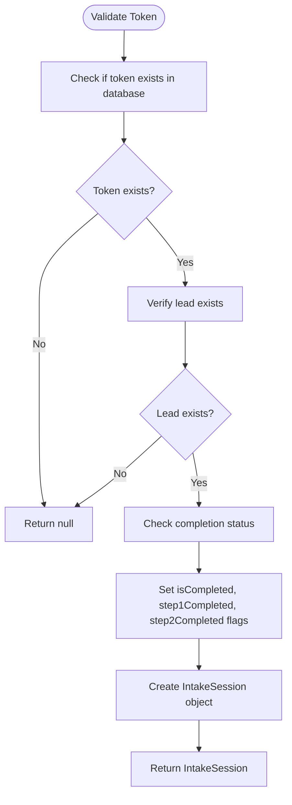
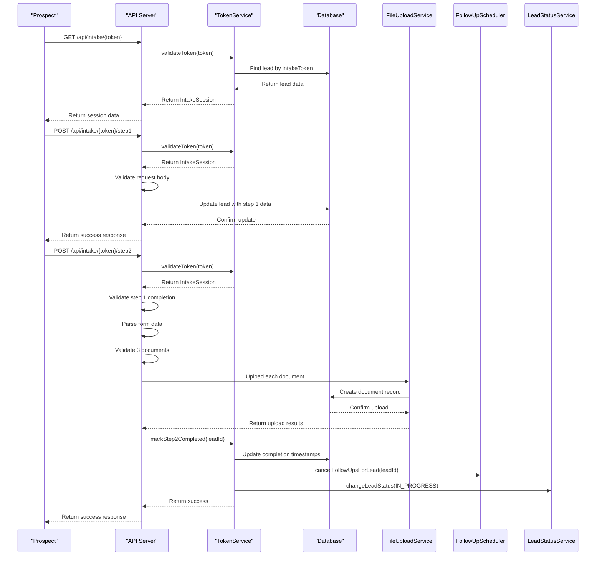
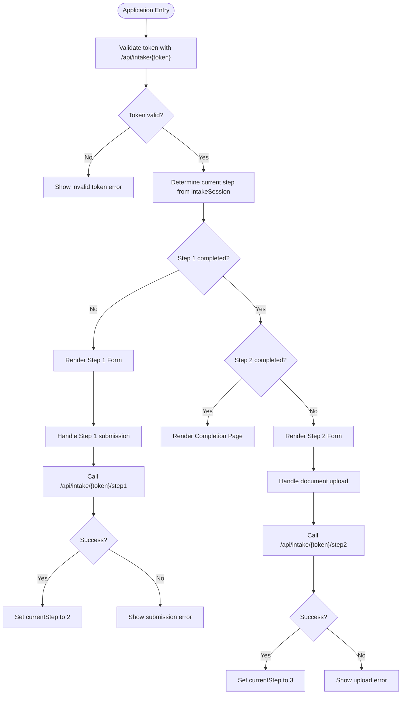
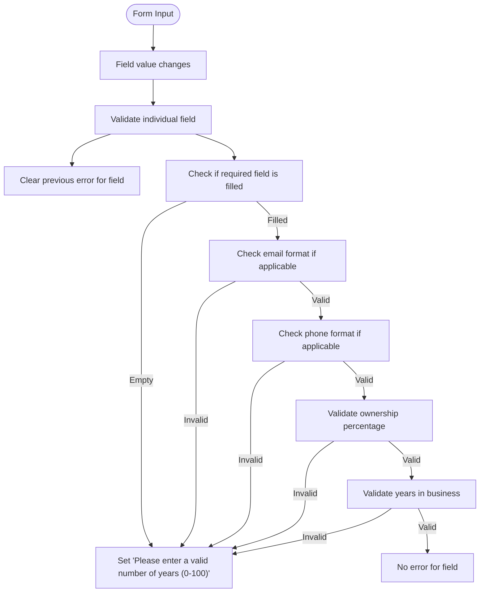
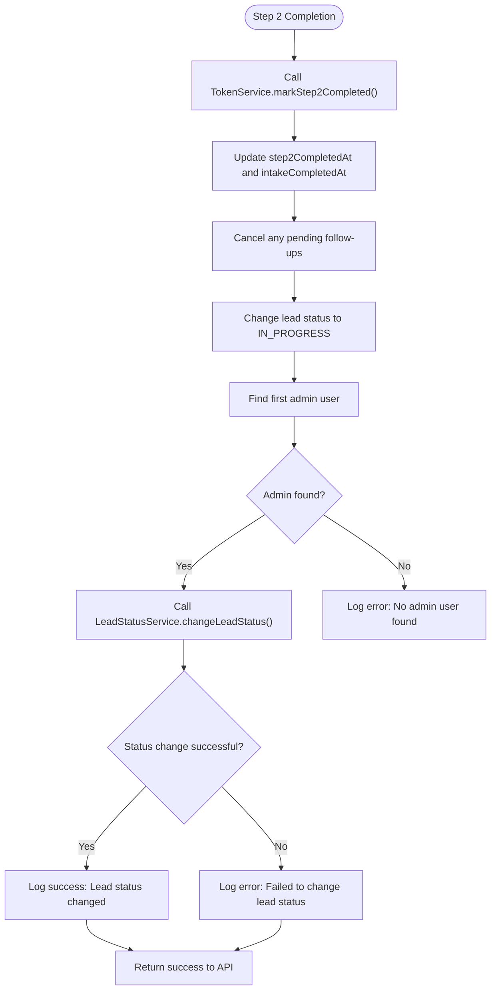

# Intake Process Workflow

<cite>
**Referenced Files in This Document**   
- [TokenService.ts](file://src/services/TokenService.ts)
- [step1/route.ts](file://src/app/api/intake/[token]/step1/route.ts)
- [step2/route.ts](file://src/app/api/intake/[token]/step2/route.ts)
- [IntakeWorkflow.tsx](file://src/components/intake/IntakeWorkflow.tsx)
- [Step1Form.tsx](file://src/components/intake/Step1Form.tsx)
- [Step2Form.tsx](file://src/components/intake/Step2Form.tsx)
</cite>

## Table of Contents
1. [Introduction](#introduction)
2. [Token Management System](#token-management-system)
3. [API Endpoints for Intake Process](#api-endpoints-for-intake-process)
4. [UI Workflow and Form Structure](#ui-workflow-and-form-structure)
5. [Data Validation and Error Handling](#data-validation-and-error-handling)
6. [Security Considerations](#security-considerations)
7. [State Persistence and Completion Logic](#state-persistence-and-completion-logic)
8. [Example Scenarios](#example-scenarios)

## Introduction
The Intake Process Workflow enables prospects to securely complete a two-step application process through token-based access. This document details the complete workflow, from token generation to final submission, including the underlying architecture, API design, UI implementation, and security mechanisms. The system ensures that sensitive application data is protected while providing a seamless user experience for completing business funding applications.

## Token Management System

The TokenService class manages secure token generation, validation, and lifecycle for the intake process. Tokens are cryptographically secure and tied to specific leads in the system.

```mermaid
classDiagram
class TokenService {
+generateToken() : string
+validateToken(token : string) : Promise<IntakeSession | null>
+generateTokenForLead(leadId : number) : Promise<string | null>
+markStep1Completed(leadId : number) : Promise<boolean>
+markStep2Completed(leadId : number) : Promise<boolean>
+getIntakeProgress(leadId : number) : Promise<{...} | null>
}
class IntakeSession {
+leadId : number
+token : string
+isValid : boolean
+isCompleted : boolean
+step1Completed : boolean
+step2Completed : boolean
+lead : Lead
}
class Lead {
+id : number
+email : string | null
+phone : string | null
+firstName : string | null
+lastName : string | null
+businessName : string | null
+businessAddress : string | null
+businessPhone : string | null
+businessEmail : string | null
+mobile : string | null
+businessCity : string | null
+businessState : string | null
+businessZip : string | null
+industry : string | null
+yearsInBusiness : number | null
+amountNeeded : string | null
+monthlyRevenue : string | null
+ownershipPercentage : string | null
+taxId : string | null
+stateOfInc : string | null
+dateBusinessStarted : string | null
+legalEntity : string | null
+natureOfBusiness : string | null
+hasExistingLoans : string | null
+dateOfBirth : string | null
+socialSecurity : string | null
+personalAddress : string | null
+personalCity : string | null
+personalState : string | null
+personalZip : string | null
+legalName : string | null
+status : string
}
TokenService --> IntakeSession : "returns"
TokenService --> Lead : "contains in session"
TokenService --> "prisma.lead" : "database operations"
```

**Diagram sources**
- [TokenService.ts](file://src/services/TokenService.ts#L20-L312)

**Section sources**
- [TokenService.ts](file://src/services/TokenService.ts#L20-L312)

### Token Generation
Tokens are generated using Node.js's crypto module to ensure cryptographic security:

```typescript
static generateToken(): string {
  return crypto.randomBytes(32).toString('hex');
}
```

When a new lead is created, a token is generated and assigned to the lead record:

```typescript
static async generateTokenForLead(leadId: number): Promise<string | null> {
  try {
    const token = this.generateToken();

    await prisma.lead.update({
      where: { id: leadId },
      data: {
        intakeToken: token,
        status: 'PENDING'
      },
    });

    return token;
  } catch (error) {
    console.error('Error generating token for lead:', error);
    return null;
  }
}
```

### Token Validation
The validation process checks if a token exists and is associated with a valid lead:



**Diagram sources**
- [TokenService.ts](file://src/services/TokenService.ts#L50-L110)

**Section sources**
- [TokenService.ts](file://src/services/TokenService.ts#L50-L110)

The `validateToken` method returns an `IntakeSession` object containing the lead's current state and completion status, enabling the UI to determine which step to display.

### Token Expiration and Cleanup
The system does not implement time-based token expiration. Instead, tokens are effectively "expired" through state management:

- Tokens become invalid when the intake process is completed (status changes to IN_PROGRESS)
- Tokens are not automatically cleaned up; they remain in the database as historical records
- The system relies on the `intakeCompletedAt` timestamp to determine if a token should be considered expired

This approach allows for audit trails while preventing reuse of completed tokens.

## API Endpoints for Intake Process

The intake process is exposed through RESTful API endpoints that handle each step of the application process.



**Diagram sources**
- [step1/route.ts](file://src/app/api/intake/[token]/step1/route.ts#L1-L304)
- [step2/route.ts](file://src/app/api/intake/[token]/step2/route.ts#L1-L152)
- [TokenService.ts](file://src/services/TokenService.ts#L20-L312)

**Section sources**
- [step1/route.ts](file://src/app/api/intake/[token]/step1/route.ts#L1-L304)
- [step2/route.ts](file://src/app/api/intake/[token]/step2/route.ts#L1-L152)

### Step 1 API Endpoint
The `/api/intake/[token]/step1` endpoint handles the first step of the application process, which collects business and personal information.

**Request**
- Method: POST
- Path: `/api/intake/{token}/step1`
- Content-Type: application/json

**Request Body Structure**
```json
{
  "businessName": "string",
  "dba": "string",
  "businessAddress": "string",
  "businessPhone": "string",
  "businessEmail": "string",
  "mobile": "string",
  "businessCity": "string",
  "businessState": "string",
  "businessZip": "string",
  "ownershipPercentage": "string",
  "taxId": "string",
  "stateOfInc": "string",
  "dateBusinessStarted": "string",
  "legalEntity": "string",
  "natureOfBusiness": "string",
  "hasExistingLoans": "string",
  "industry": "string",
  "yearsInBusiness": "string",
  "monthlyRevenue": "string",
  "amountNeeded": "string",
  "firstName": "string",
  "lastName": "string",
  "dateOfBirth": "string",
  "socialSecurity": "string",
  "personalAddress": "string",
  "personalCity": "string",
  "personalState": "string",
  "personalZip": "string",
  "legalName": "string",
  "email": "string"
}
```

**Response Success (200)**
```json
{
  "success": true,
  "message": "Step 1 completed successfully",
  "data": {
    "step1Completed": true,
    "nextStep": 2
  }
}
```

**Response Errors**
- 400 Bad Request: Missing token
- 404 Not Found: Invalid or expired token
- 400 Bad Request: Missing required fields
- 400 Bad Request: Invalid email format
- 400 Bad Request: Invalid phone number format
- 400 Bad Request: Invalid ownership percentage
- 400 Bad Request: Invalid years in business
- 500 Internal Server Error: Database or server error

### Step 2 API Endpoint
The `/api/intake/[token]/step2` endpoint handles document upload for the second step of the application process.

**Request**
- Method: POST
- Path: `/api/intake/{token}/step2`
- Content-Type: multipart/form-data

**Request Body Structure**
- Form field: `documents` (array of files, exactly 3 required)
- File types: PDF, JPG, PNG, DOCX
- Maximum file size: 10MB per file

**Response Success (200)**
```json
{
  "success": true,
  "message": "Documents uploaded successfully",
  "documents": [
    {
      "id": "number",
      "originalFilename": "string",
      "fileSize": "number",
      "mimeType": "string",
      "uploadedAt": "datetime"
    }
  ]
}
```

**Response Errors**
- 400 Bad Request: Invalid or expired token
- 400 Bad Request: Step 1 not completed
- 400 Bad Request: Step 2 already completed
- 400 Bad Request: Exactly 3 documents required
- 400 Bad Request: Empty or invalid document
- 500 Internal Server Error: Failed to upload document
- 500 Internal Server Error: Failed to complete step 2

## UI Workflow and Form Structure

The intake process UI is implemented as a React component that guides prospects through the two-step application process.



**Diagram sources**
- [IntakeWorkflow.tsx](file://src/components/intake/IntakeWorkflow.tsx#L1-L96)
- [Step1Form.tsx](file://src/components/intake/Step1Form.tsx#L1-L399)
- [Step2Form.tsx](file://src/components/intake/Step2Form.tsx#L1-L312)

**Section sources**
- [IntakeWorkflow.tsx](file://src/components/intake/IntakeWorkflow.tsx#L1-L96)

### IntakeWorkflow Component
The main workflow component manages the state and navigation between steps:

```typescript
export default function IntakeWorkflow({ intakeSession }: IntakeWorkflowProps) {
  const [currentStep, setCurrentStep] = useState(() => {
    if (intakeSession.isCompleted) return 3;
    if (intakeSession.step1Completed) return 2;
    return 1;
  });

  const handleStep1Complete = () => {
    setCurrentStep(2);
  };

  const handleStep2Complete = () => {
    setCurrentStep(3);
  };

  // Progress indicator logic
  const getStepStatus = (step: number) => {
    if (step < currentStep) return 'completed';
    if (step === currentStep) return 'current';
    return 'upcoming';
  };

  return (
    <div>
      {/* Progress indicator */}
      <div className="mb-8">
        {/* Step 1 indicator */}
        {/* Progress bar */}
        {/* Step 2 indicator */}
      </div>

      {/* Step content */}
      {currentStep === 1 && (
        <Step1Form 
          intakeSession={intakeSession} 
          onComplete={handleStep1Complete}
        />
      )}
      
      {currentStep === 2 && (
        <Step2Form 
          intakeSession={intakeSession} 
          onComplete={handleStep2Complete}
        />
      )}
      
      {currentStep === 3 && (
        <CompletionPage intakeSession={intakeSession} />
      )}
    </div>
  );
}
```

### Step 1 Form Structure
The first step collects comprehensive business and personal information through a multi-section form:

**Business Details Section**
- Legal Business Name (required)
- DBA (Doing Business As) (optional)
- Business Address (required)
- Business Phone (required)
- Company Email (required)
- Mobile (required)
- City (required)
- State (required, dropdown)
- Zip Code (required)
- Percentage of Ownership (required, 0-100)
- Tax ID (required)
- State of Incorporation (required, dropdown)
- Date Business Started (required)
- Legal Entity (required, dropdown)
- Nature of Business (required, dropdown)
- Do You Have Any Loans Now? (required, dropdown)
- Industry or Product Type (required)
- Years in Business (required, 0-100)
- Monthly Gross Revenue (required, dropdown)
- Amount Requested (required, dropdown)

**Personal Details Section**
- First Name (required)
- Last Name (required)
- Date of Birth (required)
- Social Security Number (required)
- Personal Address (required)
- Personal City (required)
- Personal State (required, dropdown)
- Personal Zip Code (required)

**Legal Information Section**
- Your Legal Name (required)
- Email Address (required)

### Step 2 Form Structure
The second step provides an interface for uploading exactly three financial documents:

**Document Upload Features**
- Drag-and-drop interface
- File browser button
- Real-time validation of file type and size
- Progress indicators during upload
- Ability to remove selected files
- Visual feedback for upload status

**File Requirements**
- Exactly 3 documents required
- Accepted formats: PDF, JPG, PNG, DOCX
- Maximum file size: 10MB per file
- Common document types: bank statements, financial statements

## Data Validation and Error Handling

The system implements comprehensive validation at both the client and server levels to ensure data quality and security.

### Client-Side Validation
The Step1Form component performs real-time validation as users complete the form:



**Diagram sources**
- [Step1Form.tsx](file://src/components/intake/Step1Form.tsx#L198-L398)

**Section sources**
- [Step1Form.tsx](file://src/components/intake/Step1Form.tsx#L198-L398)

### Server-Side Validation
The API endpoints perform thorough validation before processing requests:

**Step 1 Validation Rules**
- Token validation: Ensure token exists and is valid
- Completion status: Prevent resubmission of completed steps
- Required fields: Verify all required fields are present
- Email format: Validate using regex pattern `^[^'''\s@]+@[^'''\s@]+\.[^'''\s@]+$`
- Phone format: Basic validation with regex `^[\d\s\-\(\)\+\.]{10,}$`
- Ownership percentage: Must be a number between 0 and 100
- Years in business: Must be a number between 0 and 100
- Data sanitization: Trim whitespace from all string fields
- Phone cleaning: Remove formatting characters and normalize

**Step 2 Validation Rules**
- Token validation: Ensure token exists and is valid
- Step progression: Verify Step 1 is completed before allowing document upload
- Completion status: Prevent resubmission of completed steps
- Document count: Require exactly 3 documents
- File validation: Check each file for size, type, and content
- Empty files: Reject files with zero size

### Error Response Structure
The API returns consistent error responses to help clients handle validation failures:

```json
{
  "error": "Descriptive error message",
  "missingFields": ["field1", "field2"]
}
```

The client handles these errors by displaying appropriate messages to users, either as inline field errors or as alerts for critical issues.

## Security Considerations

The intake process implements multiple security measures to protect sensitive data and prevent abuse.

### Token Security
- **Cryptographic Strength**: Tokens are generated using `crypto.randomBytes(32)` which provides 256 bits of entropy, making them resistant to guessing attacks
- **Secure Storage**: Tokens are stored in the database and transmitted over HTTPS
- **No Plaintext Exposure**: Tokens are never logged or exposed in client-side code beyond what's necessary for API calls
- **Single-Use Pattern**: While tokens don't expire by time, they become invalid once the intake process is completed

### Input Sanitization
All user inputs are sanitized to prevent injection attacks:

- **String Trimming**: All string fields are trimmed of whitespace
- **Email Normalization**: Email addresses are converted to lowercase
- **Phone Cleaning**: Phone numbers have formatting characters removed and are stored in a standardized format
- **Null Handling**: Empty optional fields are stored as NULL rather than empty strings

### Replay Attack Prevention
The system prevents replay attacks through state management:

- **Step Progression**: Each step can only be completed once
- **Timestamp Tracking**: Completion timestamps prevent re-submission
- **Status Transitions**: The lead status changes from PENDING to IN_PROGRESS upon completion, invalidating the token for further use

### Token Leakage Mitigation
While the system doesn't implement automatic token expiration, it minimizes the impact of token leakage:

- **Limited Scope**: Tokens only provide access to the intake process for a specific lead
- **No Sensitive Operations**: Tokens cannot be used to modify completed applications or access other leads
- **Activity Monitoring**: Server logs capture token usage for audit purposes

### Additional Security Measures
- **HTTPS Enforcement**: The middleware enforces HTTPS in production environments
- **Rate Limiting**: API endpoints are protected by rate limiting to prevent brute force attacks
- **Secure Headers**: The application sets security headers including HSTS and secure cookies
- **Input Validation**: Comprehensive validation prevents malformed data from being processed

## State Persistence and Completion Logic

The system maintains state throughout the intake process using database timestamps and status flags.

### State Tracking Fields
The lead record contains several fields that track the intake process state:

- **intakeToken**: The secure token for accessing the intake process
- **step1CompletedAt**: Timestamp when Step 1 was completed (NULL if not completed)
- **step2CompletedAt**: Timestamp when Step 2 was completed (NULL if not completed)
- **intakeCompletedAt**: Timestamp when the entire intake process was completed (NULL if not completed)
- **status**: Current lead status (PENDING, IN_PROGRESS, etc.)

### Completion Workflow
When Step 2 is completed, the system triggers several actions:



**Diagram sources**
- [TokenService.ts](file://src/services/TokenService.ts#L200-L312)

**Section sources**
- [TokenService.ts](file://src/services/TokenService.ts#L200-L312)

The `markStep2Completed` method performs the following actions:
1. Updates the lead record with completion timestamps
2. Cancels any pending follow-ups for the lead
3. Changes the lead status to IN_PROGRESS using the LeadStatusService
4. Uses the first admin user as the actor for the status change
5. Logs the status change for audit purposes

This workflow ensures that completed applications are properly routed to staff for review while maintaining a complete audit trail.

## Example Scenarios

### Successful Submission Scenario
**Prospect completes both steps successfully**

1. **Token Generation**: A new lead is created with status NEW, and a token is generated and assigned
2. **Step 1 Access**: The prospect accesses `/application/{token}` and sees the Step 1 form
3. **Step 1 Completion**: The prospect fills in all required fields and submits the form
4. **Server Processing**: The API validates the data, updates the lead record, and returns success
5. **UI Transition**: The UI advances to Step 2, showing the document upload interface
6. **Document Upload**: The prospect uploads three valid financial documents
7. **Server Processing**: The API validates the documents, uploads them to Backblaze B2, creates document records, and marks the intake as completed
8. **Status Update**: The lead status changes to IN_PROGRESS, and staff are notified
9. **Completion**: The prospect sees the completion page, and the application enters the review phase

### Failed Submission Scenario
**Prospect attempts to submit with invalid data**

1. **Incomplete Form**: The prospect leaves the "Legal Business Name" field empty and submits Step 1
2. **Client Validation**: The client-side validation highlights the empty field with an error message
3. **User Correction**: The prospect fills in the missing field but enters an invalid email format
4. **API Validation**: The API rejects the submission with "Invalid email format"
5. **User Correction**: The prospect corrects the email and successfully submits Step 1
6. **Document Upload**: The prospect attempts to upload four documents
7. **Validation Error**: The API rejects the submission with "Exactly 3 documents are required"
8. **User Correction**: The prospect removes one document and successfully uploads the remaining three
9. **Completion**: The application is successfully completed and enters the review phase

### Security Incident Scenario
**Token leakage and attempted replay attack**

1. **Token Leak**: A prospect accidentally shares their intake URL containing the token
2. **Unauthorized Access**: A third party attempts to access the intake process using the leaked token
3. **Initial Access**: The third party can view the current state of the application
4. **Step 1 Attempt**: If Step 1 is not completed, the attacker could potentially submit data
5. **Data Attribution**: All submissions are attributed to the original lead, with timestamps recorded
6. **Detection**: The legitimate prospect notices changes to their application and contacts support
7. **Resolution**: Support staff can review the audit logs and restore the application to its previous state

This scenario highlights the importance of token confidentiality, though the system's design limits the potential damage from token leakage.